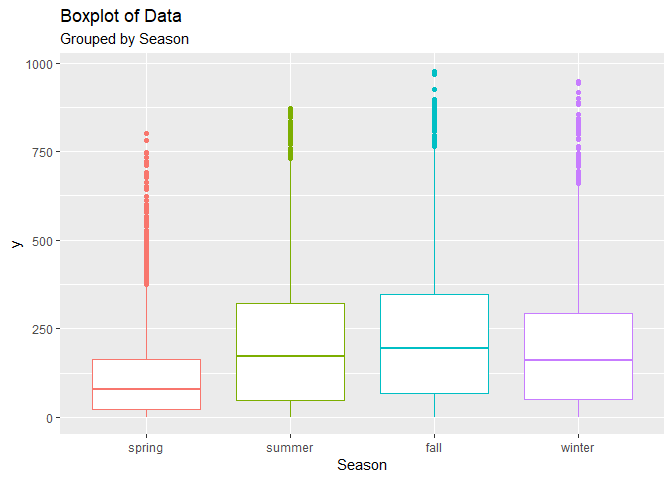
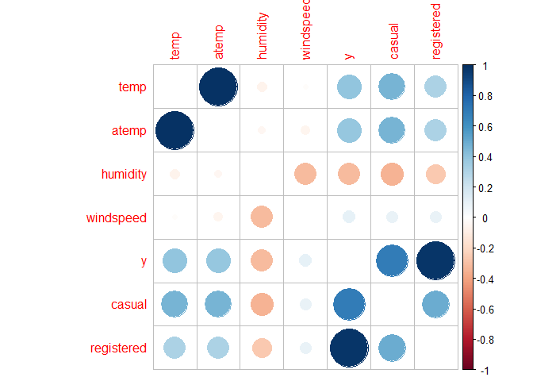
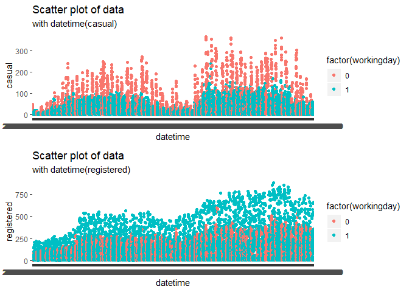
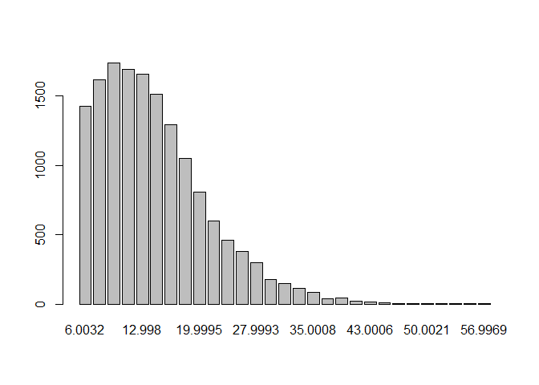

**자전거 대여 수요예측 분석**
=============================

본 문서는 Kaggle에 업로드된 '자전거 수요예측 분석'(Bike Sharing Demand)을 마크다운형식으로 편집하여,
Github에 업로드 하기 위하여 작성된 문서입니다.
데이터 출처 \*<https://www.kaggle.com/c/bike-sharing-demand>

------------------------------------------------------------------------

분석 과정 목차
--------------

[1. 변수 정의](#변수-정의)

[2. 분석 과정](#분석-과정)

[데이터 구조 확인](#데이터-구조-확인)

[사전 가설 수립(Make insight)](#가설-사전-수립)

[EDA](#Exproratory-Data-Analysis)

[Data preprocessing](#Data-Preprocessing)

[Modeling](#Modeling)

[3. 결론](#한계점)

------------------------------------------------------------------------

변수 정의
---------

1.  datetime - hourly date + timestamp

2.  season
    -   1 : spring
    -   2 : summer
    -   3 : fall
    -   4 : winter
3.  holiday - whether the day is considered a holiday (휴일)

4.  workingday - whether the day is neither a weekend nor holiday (주말도, 휴일도 아닌 날)

5.  weather
    -   1: Clear, Few clouds, Partly cloudy, Partly cloudy
    -   2: Mist + Cloudy, Mist + Broken clouds, Mist + Few clouds, Mist
    -   3: Light Snow, Light Rain + Thunderstorm + Scattered clouds, Light Rain + Scattered clouds
    -   4: Heavy Rain + Ice Pallets + Thunderstorm + Mist, Snow + Fog
6.  temp - temperature in Celsius(섭씨) -&gt; 실제온도.

7.  atemp - "feels like" temperature in Celsius (체감온도)

8.  humidity - relative humidity (습기)

9.  windspeed - wind speed (풍속)

**Train에만 있는 것. (종속변수)**

-   casual - number of non-registered user rentals initiated (비회원의 렌탈수)

-   registered - number of registered user rentals initiated (회원의 렌탈수)

-   count - number of total rentals (토탈렌트)

------------------------------------------------------------------------

분석 과정
---------

### 데이터 구조 확인

**Initialize**

``` r
rm(list=ls())
library(ggplot2)  #for plotting
library(corrplot) #for correlation plot
```

    ## corrplot 0.84 loaded

``` r
library(dplyr)    #for %in% function
```

    ## 
    ## Attaching package: 'dplyr'

    ## The following objects are masked from 'package:stats':
    ## 
    ##     filter, lag

    ## The following objects are masked from 'package:base':
    ## 
    ##     intersect, setdiff, setequal, union

``` r
library(caret)    #for cross validation
```

    ## Loading required package: lattice

``` r
library(pscl)     #for Zero-inflated poisson regression
```

    ## Classes and Methods for R developed in the
    ## Political Science Computational Laboratory
    ## Department of Political Science
    ## Stanford University
    ## Simon Jackman
    ## hurdle and zeroinfl functions by Achim Zeileis

``` r
library(gridExtra)
```

    ## Warning: package 'gridExtra' was built under R version 3.5.2

    ## 
    ## Attaching package: 'gridExtra'

    ## The following object is masked from 'package:dplyr':
    ## 
    ##     combine

``` r
setwd('C:\\github\\Project\\BikeSharing')
train <- read.csv('train.csv', stringsAsFactors = F)
test <- read.csv('test.csv', stringsAsFactors = F)
```

``` r
colSums(is.na(train))
```

    ##   datetime     season    holiday workingday    weather       temp 
    ##          0          0          0          0          0          0 
    ##      atemp   humidity  windspeed     casual registered      count 
    ##          0          0          0          0          0          0

``` r
colSums(is.na(test))
```

    ##   datetime     season    holiday workingday    weather       temp 
    ##          0          0          0          0          0          0 
    ##      atemp   humidity  windspeed 
    ##          0          0          0

``` r
str(c(train, test))
```

    ## List of 21
    ##  $ datetime  : chr [1:10886] "2011-01-01 0:00" "2011-01-01 1:00" "2011-01-01 2:00" "2011-01-01 3:00" ...
    ##  $ season    : int [1:10886] 1 1 1 1 1 1 1 1 1 1 ...
    ##  $ holiday   : int [1:10886] 0 0 0 0 0 0 0 0 0 0 ...
    ##  $ workingday: int [1:10886] 0 0 0 0 0 0 0 0 0 0 ...
    ##  $ weather   : int [1:10886] 1 1 1 1 1 2 1 1 1 1 ...
    ##  $ temp      : num [1:10886] 9.84 9.02 9.02 9.84 9.84 ...
    ##  $ atemp     : num [1:10886] 14.4 13.6 13.6 14.4 14.4 ...
    ##  $ humidity  : int [1:10886] 81 80 80 75 75 75 80 86 75 76 ...
    ##  $ windspeed : num [1:10886] 0 0 0 0 0 ...
    ##  $ casual    : int [1:10886] 3 8 5 3 0 0 2 1 1 8 ...
    ##  $ registered: int [1:10886] 13 32 27 10 1 1 0 2 7 6 ...
    ##  $ count     : int [1:10886] 16 40 32 13 1 1 2 3 8 14 ...
    ##  $ datetime  : chr [1:6493] "2011-01-20 0:00" "2011-01-20 1:00" "2011-01-20 2:00" "2011-01-20 3:00" ...
    ##  $ season    : int [1:6493] 1 1 1 1 1 1 1 1 1 1 ...
    ##  $ holiday   : int [1:6493] 0 0 0 0 0 0 0 0 0 0 ...
    ##  $ workingday: int [1:6493] 1 1 1 1 1 1 1 1 1 1 ...
    ##  $ weather   : int [1:6493] 1 1 1 1 1 1 1 1 1 2 ...
    ##  $ temp      : num [1:6493] 10.7 10.7 10.7 10.7 10.7 ...
    ##  $ atemp     : num [1:6493] 11.4 13.6 13.6 12.9 12.9 ...
    ##  $ humidity  : int [1:6493] 56 56 56 56 56 60 60 55 55 52 ...
    ##  $ windspeed : num [1:6493] 26 0 0 11 11 ...

------------------------------------------------------------------------

-&gt; NA값은 존재하지 않는다는 것을 확인할 수 있다.

### 가설 사전 수립

**Idea 1. train과 test 데이터의 차이점**

train data에 비하여 test데이터는 casual(비회원의 렌트 수)와 registered(회원의 렌트 수)가 존재하지 않는다.
결국 count는 전체의 렌트 수 이므로, 두개의 모델을 적합시켜서 각각에서의 비회원 / 회원의 렌트수를 예측 한 이후에 그걸 더하면 좀 더 정확하지 않을까?
아무래도 casual과 registered는 확실히 경향에 있어서 차이가 있을 것 같다.
casual일때 더 많이 빌릴까? registered일때 더 많이 빌릴까?
이 사람들의 특징에서는 어떠한 차이가 존재할까?

**Idea 2. 기본 가정 확인하기.**

우리가 원하는 종속변수는 특정한 사건(렌트)의 수를 뜻하는 정수이다.
그렇다면 glm을 통해서 poison분포로 적합시킬 수 있지는 않을까?

**Idea 3. 변수간의 관계에 대해서 생각해보기.**

날짜에 관련된 변수가 datetime, holiday, workingday 이렇게 3개나 존재한다. (어쩌면 weather 또한 관련 되어 있을지도)
Weather는 temp, atemp, humidity와 관계가 밀접하지 않을까?
변수간의 Correration 확인해볼수 있을것 같다.

------------------------------------------------------------------------

### Exproratory Data Analysis

**Preparing Total data**

``` r
test[,c('casual', 'registered', 'count')] <- NA
train <- rename(train, 'y' = 'count')
test <- rename(test, 'y' = 'count')
data <- rbind(train, test)
str(data)
```

    ## 'data.frame':    17379 obs. of  12 variables:
    ##  $ datetime  : chr  "2011-01-01 0:00" "2011-01-01 1:00" "2011-01-01 2:00" "2011-01-01 3:00" ...
    ##  $ season    : int  1 1 1 1 1 1 1 1 1 1 ...
    ##  $ holiday   : int  0 0 0 0 0 0 0 0 0 0 ...
    ##  $ workingday: int  0 0 0 0 0 0 0 0 0 0 ...
    ##  $ weather   : int  1 1 1 1 1 2 1 1 1 1 ...
    ##  $ temp      : num  9.84 9.02 9.02 9.84 9.84 ...
    ##  $ atemp     : num  14.4 13.6 13.6 14.4 14.4 ...
    ##  $ humidity  : int  81 80 80 75 75 75 80 86 75 76 ...
    ##  $ windspeed : num  0 0 0 0 0 ...
    ##  $ casual    : int  3 8 5 3 0 0 2 1 1 8 ...
    ##  $ registered: int  13 32 27 10 1 1 0 2 7 6 ...
    ##  $ y         : int  16 40 32 13 1 1 2 3 8 14 ...

``` r
colSums(is.na(data))
```

    ##   datetime     season    holiday workingday    weather       temp 
    ##          0          0          0          0          0          0 
    ##      atemp   humidity  windspeed     casual registered          y 
    ##          0          0          0       6493       6493       6493

**datetime**

``` r
nrow(data) == length(unique(data$datetime))
```

    ## [1] TRUE

-&gt; 문자열 데이터이며, 데이터의 분할이 필요함을 확인할 수 있다.

``` r
ggplot(data = data, aes(x = datetime, y = y)) +
  geom_point() +
  labs(title = 'Scatter plot of data',
       subtitle = 'With datetime(all Y)')
```

    ## Warning: Removed 6493 rows containing missing values (geom_point).


-&gt; 각 월의 20일~마지막일 까지는 test에 포함된 NA값이다.

따라서, 이 빈 구역들의 y값들을 예측하는 것이 목표이다.

**season**

팩터들의 이름을 부여한다.

``` r
str(data$season)
```

    ##  int [1:17379] 1 1 1 1 1 1 1 1 1 1 ...

``` r
data$season[which(data$season == 1)] <- 'spring'
data$season[which(data$season == 2)] <- 'summer'
data$season[which(data$season == 3)] <- 'fall'
data$season[which(data$season == 4)] <- 'winter'
data$season <- factor(data$season,
                         levels = c('spring', 'summer', 'fall', 'winter'))
levels(data$season)
```

    ## [1] "spring" "summer" "fall"   "winter"

계절에 따른 y값의 모양을 상자그림을 통하여 실시하려고 한다.
단 2가지 방법으로 표현해보도록 하자.(이후 표현은 ggplot으로 통일한다.)

**A. Box Plot으로 그리기**

``` r
boxplot(data$y ~ data$season)
```


**B. ggplot을 활용한 그림**

``` r
ggplot(data = data) +
  geom_boxplot(aes(x = factor(season), y = y) ,fill = c('coral', 'coral1', 'coral2', 'coral3')) +
  labs(title = 'Boxplot of Data' ,
       subtitle = 'Grouped by Season' ,
       x = 'Season') +
  scale_x_discrete(labels = levels(data$season))
```

    ## Warning: Removed 6493 rows containing non-finite values (stat_boxplot).



-&gt; 계절에 따라 y(count)의 값이 크게 변동은 없는 것을 확인할 수 있다.

**holiday**

``` r
data$holiday[which(data$holiday == 0)] <- 'holiday'
data$holiday[which(data$holiday == 1)] <- 'non holiday'
data$holiday <- as.factor(data$holiday)
str(data$holiday)
```

    ##  Factor w/ 2 levels "holiday","non holiday": 1 1 1 1 1 1 1 1 1 1 ...

``` r
table(data$holiday)
```

    ## 
    ##     holiday non holiday 
    ##       16879         500

-&gt; Binary data 이며, Holiday와 Non holiday의 비율이 16879 : 500 인것을 확인할 수 있다.

``` r
ggplot(data = data) +
  geom_boxplot(aes(x = factor(holiday), y = y, group = holiday)) +
  aes(fill = holiday) +
  labs(title = 'Boxplot of Data' ,
       subtitle = 'Grouped by holiday',
       x = 'Holiday') +
    scale_x_discrete(labels = levels(data$holiday))
```

    ## Warning: Removed 6493 rows containing non-finite values (stat_boxplot).


-&gt; Holiday 유무에 따라 평균의 큰 차이는 없으나 큰 Y 값들이 Holiday에 상대적으로 많은 것을 확인할 수 있다.

**workingday**

``` r
data$workingday[which(data$workingday == 0)] <- 'non workingday'
data$workingday[which(data$workingday == 1)] <- 'workingday'
data$workingday <- as.factor(data$workingday)
table(data$workingday)
```

    ## 
    ## non workingday     workingday 
    ##           5514          11865

-&gt; 1 : 2의 비율로 분포하는 것을 확인할 수 있다.

차이점 확인하기.

``` r
ggplot(data = data) +
  geom_boxplot(aes(x = factor(workingday), y = y, group = workingday)) +
  aes(fill = workingday) +
  labs(title = 'Boxplot of Data' ,
       subtitle = 'Grouped by workingday',
       x = 'workingday') +
    scale_x_discrete(labels = levels(data$workingday))
```

    ## Warning: Removed 6493 rows containing non-finite values (stat_boxplot).


-&gt; 평균의 차이가 크지 않은 것을 확인할 수 있다.

**weather**

범주별 데이터 수 확인

``` r
data$weather <- as.factor(data$weather)
table(data$weather)
```

    ## 
    ##     1     2     3     4 
    ## 11413  4544  1419     3

-&gt; 4(Heavy Rain)인 자료가 단 3개밖에 존재하지 않는다.

차이점 확인

``` r
ggplot(data = train) +
  geom_boxplot(aes(x = factor(weather), y = y, group = weather)) +
  aes(fill = weather) +
  labs(title = 'Boxplot of Data' ,
       subtitle = 'Grouped by weather',
       x = 'weather') +
    scale_x_discrete(labels = levels(data$weather))
```


-&gt; 범주 4의 치환이 필요함을 확인할 수 있고, 날씨에 따른 y의 변화를 확인할 수 있다.

**Numeric data Exploring**

temp, atemp, humidity, windspeed 모두 수치형 데이터이며, 이중 주목할 것은 temp(온도)와 atemp(체감온도) 일 것이다.
-&gt; 따라서 두 변수는 반드시 강한 상관관계를 가질 것으로 예상된다.

``` r
num_data <- data[, c('temp', 'atemp', 'humidity', 'windspeed')]
cor(num_data)
```

    ##                  temp       atemp    humidity   windspeed
    ## temp       1.00000000  0.98767214 -0.06988139 -0.02312526
    ## atemp      0.98767214  1.00000000 -0.05191770 -0.06233604
    ## humidity  -0.06988139 -0.05191770  1.00000000 -0.29010490
    ## windspeed -0.02312526 -0.06233604 -0.29010490  1.00000000

-&gt; 예상대로 temp와 atemp의 상관관계를 확인할 수 있었다.

**각 연속형 변수의 히스토그램과, 종속변수와의 상관계수 확인**

test data에는 y값이 존재하지 않으므로, train data에서 numeric data를 추출하여 correlation을 계산한다.

``` r
num_train <- train[, c('temp', 'atemp', 'humidity', 'windspeed', 'y' ,'casual', 'registered')]
cor(num_train)
```

    ##                   temp       atemp    humidity   windspeed          y
    ## temp        1.00000000  0.98494811 -0.06494877 -0.01785201  0.3944536
    ## atemp       0.98494811  1.00000000 -0.04353571 -0.05747300  0.3897844
    ## humidity   -0.06494877 -0.04353571  1.00000000 -0.31860699 -0.3173715
    ## windspeed  -0.01785201 -0.05747300 -0.31860699  1.00000000  0.1013695
    ## y           0.39445364  0.38978444 -0.31737148  0.10136947  1.0000000
    ## casual      0.46709706  0.46206654 -0.34818690  0.09227619  0.6904136
    ## registered  0.31857128  0.31463539 -0.26545787  0.09105166  0.9709481
    ##                 casual  registered
    ## temp        0.46709706  0.31857128
    ## atemp       0.46206654  0.31463539
    ## humidity   -0.34818690 -0.26545787
    ## windspeed   0.09227619  0.09105166
    ## y           0.69041357  0.97094811
    ## casual      1.00000000  0.49724969
    ## registered  0.49724969  1.00000000

-&gt; 각각의 상관계수를 확인할 수 있다.

**Pair plot 그리기**

시각화를 통해서 상관관계를 다시 확인한다.

``` r
corrplot(cor(num_train), method = 'circle', diag = FALSE)
```


-&gt; 상관관계들을 확인할 수 있다.

**각 연속형 변수들의 히스토그램**

``` r
temp_hist <- ggplot(data = num_data, aes(num_data$temp))+ geom_histogram() + labs(x = 'temp')
atemp_hist <- ggplot(data = num_data, aes(num_data$atemp))+ geom_histogram() + labs(x = 'atemp')
humidity_hist <- ggplot(data = num_data, aes(num_data$humidity))+ geom_histogram() + labs(x = 'humidity')
windspeed_hist <- ggplot(data = num_data, aes(num_data$windspeed))+ geom_histogram() + labs(x = 'windspeed')

grid.arrange(temp_hist, atemp_hist, humidity_hist, windspeed_hist, ncol=2, nrow = 2)
```

    ## `stat_bin()` using `bins = 30`. Pick better value with `binwidth`.
    ## `stat_bin()` using `bins = 30`. Pick better value with `binwidth`.
    ## `stat_bin()` using `bins = 30`. Pick better value with `binwidth`.
    ## `stat_bin()` using `bins = 30`. Pick better value with `binwidth`.


-&gt; 알 수 있는 사실
- humidity에서 100으로 관측된 값들을 세부적으로 봐야 한다.
- windspeed에서 0으로 관측된 값들(NA로 추청)이 보인다.

**Checking Y**

``` r
ggplot(data = train, aes(train$y))+
     geom_histogram()
```

    ## `stat_bin()` using `bins = 30`. Pick better value with `binwidth`.



-&gt; 왼쪽으로 치우친 것을 확인할 수 있으며, 변수변환의 필요성을 확인할 수 있다.

-&gt; 또한 변수의 성질(0 이상의 정수)에 따라서 Possion regression의 적합을 생각할 수 있다.

**Checking additional Y (Casual & Registered)**

본 데이터에는, casual(회원의 count) + registered(비회원의 count) = y(총 카운트 합) 으로 총 3가지의 종속변수가 존재한다고 볼 수 있다.
분포의 차이를 확인하고 각각 다른 모형에 적합시키는 방법을 고려해 볼 수 있다.

기술통계량 비교

``` r
summary(data$registered)
```

    ##    Min. 1st Qu.  Median    Mean 3rd Qu.    Max.    NA's 
    ##     0.0    36.0   118.0   155.6   222.0   886.0    6493

``` r
sd(data$registered, na.rm = TRUE)
```

    ## [1] 151.039

``` r
summary(data$casual)
```

    ##    Min. 1st Qu.  Median    Mean 3rd Qu.    Max.    NA's 
    ##    0.00    4.00   17.00   36.02   49.00  367.00    6493

``` r
sd(data$casual, na.rm = TRUE)
```

    ## [1] 49.96048

Box plot을 통한 비교

``` r
A <- ggplot(data = data, aes(y = registered)) +
    geom_boxplot(fill = 'blue') +
    labs(title = 'Box plot of registered')
B <- ggplot(data = data, aes(y = casual)) +
    geom_boxplot(fill = 'red') +
    labs(title = 'Box plot of casual')

grid.arrange(A, B, ncol = 2)
```

    ## Warning: Removed 6493 rows containing non-finite values (stat_boxplot).

    ## Warning: Removed 6493 rows containing non-finite values (stat_boxplot).


Histogram을 통한 비교

``` r
A <- ggplot(data = data, aes(x = registered)) +
    geom_histogram(fill = 'blue') +
    labs(title = 'Histogram of registered')
B <- ggplot(data = data, aes(x = casual)) +
    geom_histogram(fill = 'red') +
    labs(title = 'Histogram of casual')
C <- ggplot(data = data, aes(x = y))+
    geom_histogram() +
    labs(title = 'Histogram of all y',
         subtitle = 'Sum of registered & casual')

grid.arrange(A, B, C, nrow = 3)
```

    ## `stat_bin()` using `bins = 30`. Pick better value with `binwidth`.

    ## Warning: Removed 6493 rows containing non-finite values (stat_bin).

    ## `stat_bin()` using `bins = 30`. Pick better value with `binwidth`.

    ## Warning: Removed 6493 rows containing non-finite values (stat_bin).

    ## `stat_bin()` using `bins = 30`. Pick better value with `binwidth`.

    ## Warning: Removed 6493 rows containing non-finite values (stat_bin).


-&gt; 두 종속변수의 구성요소가 명확히 다른 분포를 갖는 것을 확인할 수 있으며, 나누어 예측하는 것이 적절하다.

``` r
#workingday로 구분하여 확인하는 casual과 registered의 분포 차이
A <- ggplot(data = train, aes(x = datetime, y = casual, color = factor(workingday))) +
    geom_point() +
    labs(title = 'Scatter plot of data',
        subtitle = 'with datetime(casual)')
B <- ggplot(data = train, aes(x = datetime, y = registered, color = factor(workingday))) +
    geom_point() +
    labs(title = 'Scatter plot of data',
        subtitle = 'with datetime(registered)')
grid.arrange(A, B, nrow = 2)
```


#### EDA 정리

| 변수명     | 특징                                                                        | 전처리 방법                            |
|------------|-----------------------------------------------------------------------------|----------------------------------------|
| Datetime   | 각 월의 20일 이후의 정보를 예측해야하며, 시계열성을 확인했다.               | Lag변수를 만든다.                      |
| Season     | 종속변수와의 큰 연관성을 찾을 수 없었다.                                    | X                                      |
| Holiday    | 두 범주값의 비율이 매우 비대칭이며, 종속변수와의 큰 연관성은 보이지 않는다. | X                                      |
| Workingday | 종속변수와의 큰 연관성을 찾을 수 없었다.                                    | X                                      |
| Weather    | 범주 4의 수가 3개로, 매우 적은 관측치를 보였다.                             | 유사한 다른 값으로 치환한다.           |
| Temp       | Atemp변수와의 높은 상관관계를 보인다.                                       | 삭제 여부 검토                         |
| Atemp      | Temp변수와의 높은 상관관계를 보인다.                                        | 삭제 여부 검토                         |
| Humidity   | 높은 수치를 기록한 값에서 공백이 보인다.                                    | 높은 값이 결측값을 의미하는지 검토     |
| Windspeed  | 0과 다른 수치 사이에 공백이 보인다.                                         | 0이 결측값을 의미하는지 검토           |
| 종속변수   | y = casual + registered, 각기 다른 분포를 보인다.                           | 분할하여 예측했을 때, 유의한 변수 확인 |

------------------------------------------------------------------------

### Data Preprocessing

**datetime**

-   연월일 / 시간 -&gt; 월별로 계절을 나누는게 어느정도 정확하지 않을까?
-   시간대별로 다른 대여수? 버리고 싶지만, 시간대별로 온도가 너무 다르다.

-&gt; 시간대 별로 morning, afternoon, night, dawn 으로 나눠서 파생변수를 만들고 date time을 지우면 어떨까?
너무 많은 정보의 삭제가 우려된다. 각 시간을 범주형으로 살리고, lag 변수를 만들어서 파생변수로 사용해보자.

**시간 분할해서 plot그려보기.**

시간 분할

``` r
sp <- unlist(strsplit(data$datetime, ":"))
#시간 추출
time <- substr(sp[seq(from = 1, to = length(sp), by = 2)], 12, 13)
#일시 추출
day <- substr(sp[seq(from = 1, to = length(sp), by = 2)], 1, 10)
day <- as.integer(gsub("-", "" , day, perl=TRUE))

data$time <- as.integer(time)
data$day <- as.numeric(factor(rank(day))) #일시를 단순한 순서로 변경
```

``` r
ggplot(data = data, aes(x = day, y = y)) +
  geom_point() +
  labs(title = 'Scatter plot of data',
       subtitle = 'with time')
```

    ## Warning: Removed 6493 rows containing missing values (geom_point).


-&gt; 일정한 추세를 보이는 것을 확인할 수 있었다.

``` r
same_time_idx <- which(data$time == 6)
same_time_data <- data[same_time_idx, ]

A1 <- ggplot(data = same_time_data, aes(x = datetime, y = registered, color = workingday)) +
  geom_point() +
  labs(title = 'Count of registered(Grouped by workingday)',
       subtitle = 'with sametime')

A2 <- ggplot(data = same_time_data, aes(x = datetime, y = casual, color = workingday)) +
  geom_point() +
  labs(title = 'Count of casual(Grouped by workingday)',
       subtitle = 'with sametime')

B1 <- ggplot(data = same_time_data, aes(x = datetime, y = registered, color = holiday)) +
  geom_point() +
  labs(title = 'Count of registered(Grouped by holiday)',
       subtitle = 'with sametime(registered)')

B2 <- ggplot(data = same_time_data, aes(x = datetime, y = casual, color = holiday)) +
  geom_point() +
  labs(title = 'Count of casual(Grouped by holiday)',
       subtitle = 'with sametime(casual)')

grid.arrange(A1, B1, A2, B2, nrow = 2, ncol = 2)
```

    ## Warning: Removed 270 rows containing missing values (geom_point).

    ## Warning: Removed 270 rows containing missing values (geom_point).

    ## Warning: Removed 270 rows containing missing values (geom_point).

    ## Warning: Removed 270 rows containing missing values (geom_point).



``` r
A1 <- ggplot(data = same_time_data, aes(x = datetime, y = registered, color = holiday)) +
  geom_point() +
  labs(title = 'Scatter plot of data',
       subtitle = 'with sametime(registered)')
B1 <- ggplot(data = same_time_data, aes(x = datetime, y = casual, color = holiday)) +
  geom_point() +
  labs(title = 'Scatter plot of data',
       subtitle = 'with sametime(casula)')
grid.arrange(A1, B1, nrow = 2)
```

    ## Warning: Removed 270 rows containing missing values (geom_point).

    ## Warning: Removed 270 rows containing missing values (geom_point).


**날짜로 시간대 나누기**

0 ~ 6시 dawn, 7 ~ 12시 morning, 1 ~ 6시 afternoon, 7 ~ 12시 night로 범주화시킨다.

``` r
dawnidx <- which(data$time == 0  #data$time %in% paste0(0:5, ":00")
               | data$time == 1
               | data$time == 2
               | data$time == 3
               | data$time == 4
               | data$time == 5)
morningidx <- which(data$time == 6  #data$time %in% paste0(6:11, ":00")
                    | data$time == 7
                    | data$time == 8
                    | data$time == 9
                    | data$time == 10
                    | data$time == 11)
afternoonidx <- which(data$time == 12  #data$time %in% paste0(12:17, ":00")
                      | data$time == 13
                      | data$time == 14
                      | data$time == 15
                      | data$time == 16
                      | data$time == 17)
nightidx <- which(data$time == 18  #data$time %in% paste0(18:23, ":00")
                  | data$time == 19
                  | data$time == 20
                  | data$time == 21
                  | data$time == 22
                  | data$time == 23)

data$daytime <- data$time

data$daytime[dawnidx] <- 'dawn'
data$daytime[morningidx] <- 'morning'
data$daytime[afternoonidx] <- 'afternoon'
data$daytime[nightidx] <- 'night'

data$time <- as.factor(data$time)
data$daytime <- as.factor(data$daytime)
```

**범주화된 변수로 Box plot 그리기**

``` r
ggplot(data = data, aes(x = daytime, y = y)) +
  geom_boxplot(aes(group = daytime)) +
  aes(fill = daytime) +
  labs(title = 'Boxplot of Data' ,
       subtitle = 'Grouped by daytime')
```

    ## Warning: Removed 6493 rows containing non-finite values (stat_boxplot).


-&gt; 각각의 시간에 따른 추세가 중요해보이므로, 범주화 시킨 변수를 삭제한다.

``` r
data <- subset(data, select = -c(daytime))
```

**연도, 월 추출**

``` r
data$year <- substr(data$datetime, 1, 4)
data$year <- as.factor(data$year)
data$month <- substr(data$datetime, 6, 7)
data$month <- as.factor(data$month)
data <- subset(data, select = -c(datetime))
```

-&gt; datetime에서 일자를 사용하지 않는이유 : test와 train의 일자가 모두 다르기 때문.

**season**

EDA과정에서 약간의 영향력을 확인했기 때문에, 따로 처리하지 않도록 한다.

**Holiday**

위에서 확인한 boxplot을 확인해 보았을 때, 변수의 비율도 치우쳐있고 count에 큰 영향을 주는 것 같지 않다. -&gt; 지워버리자. workingday 데이터만 사용

``` r
data <- subset(data, select = -c(holiday))
```

**workingday**

workingday 변수 역시 큰 영향을 끼치지 않아 보이지만, holiday 변수의 삭제로 인해 이 변수는 남겨놓고 분석을 시도해보기로 한다.

**weather**

4번 범주(악천후)에 속하는 데이터가 3개밖에 존재하지 않는 것을 확인했으므로, 이를 다른 범주로 치환해야 한다.

``` r
list(Index = which(data$weather == 4),
     Previous_day = data[which(data$weather == 4)-1,'weather'],
     Level4_day = data[which(data$weather == 4),'weather'],
     Next_day = data[which(data$weather == 4)+1,'weather'])
```

    ## $Index
    ## [1]  5632 11041 14135
    ## 
    ## $Previous_day
    ## [1] 3 3 3
    ## Levels: 1 2 3 4
    ## 
    ## $Level4_day
    ## [1] 4 4 4
    ## Levels: 1 2 3 4
    ## 
    ## $Next_day
    ## [1] 3 3 3
    ## Levels: 1 2 3 4

-&gt; 3개의 데이터 모두 전후일에 날씨변수가 3이었다. 이에 따라서 모든 범주 4를 범주 3으로 치환한다.

``` r
data[which(data$weather == 4), 'weather'] = '3'
data$weather <- as.factor(data$weather)
```

**Numeric data**

Numeric data는 따로 처리하지 않도록 한다.

-&gt; 파생변수를 만들어서 한번에 처리할 수 있다면?

**불쾌지수 변수 만들기**

``` r
discomfort <- with(data, (9/5)*temp-
                     0.55*(1-(humidity/100))*((9/5)*temp-26)+32)
data$discomfort <- discomfort
```

**상관계수 확인하기(불쾌지수 추가)**

``` r
num_data_2 <- data[which(!is.na(data$y)), c('temp', 'atemp', 'humidity', 'windspeed','discomfort', 'y')]
cor(num_data_2)
```

    ##                   temp       atemp    humidity   windspeed  discomfort
    ## temp        1.00000000  0.98494811 -0.06494877 -0.01785201  0.98683890
    ## atemp       0.98494811  1.00000000 -0.04353571 -0.05747300  0.97367141
    ## humidity   -0.06494877 -0.04353571  1.00000000 -0.31860699  0.03457894
    ## windspeed  -0.01785201 -0.05747300 -0.31860699  1.00000000 -0.03726081
    ## discomfort  0.98683890  0.97367141  0.03457894 -0.03726081  1.00000000
    ## y           0.39445364  0.38978444 -0.31737148  0.10136947  0.34551225
    ##                     y
    ## temp        0.3944536
    ## atemp       0.3897844
    ## humidity   -0.3173715
    ## windspeed   0.1013695
    ## discomfort  0.3455122
    ## y           1.0000000

-&gt; temp와 atemp, discomfort와의 multiple correlation을 확인하고, 변수 처리방안을 고민한다.

**windspeed**

Histogram

``` r
ggplot(data = data, aes(data$windspeed))+
     geom_histogram()
```

    ## `stat_bin()` using `bins = 30`. Pick better value with `binwidth`.


-&gt; 0값이 상당히 많이 관측된 것을 확인할 수 있다. 이는 실제 값이 아닌 NA값일 확률이 높으므로(구간이 비어져있음),
이를 대체할 방법을 찾는다.

결측값(0)을 평균값으로 대치

``` r
data[which(data$windspeed == 0), "windspeed"] <- median(data[which(data$windspeed != 0), "windspeed"])
```

Boxplot을 통한 풍속과 날씨의 연관성 확인

``` r
ggplot(data = data, aes(x = weather, y = windspeed)) +
  geom_boxplot(aes(group = weather)) +
  aes(fill = weather) +
  labs(title = 'Boxplot of Data(windspeed)' ,
       subtitle = 'Grouped by weather')
```


-&gt; 큰 영향을 보이지 않는 것 같아 보인다.

------------------------------------------------------------------------

### Modeling

**Model 1 : Idea 1 을 활용**

``` r
length(train$y)
```

    ## [1] 10886

``` r
sum(train$y == (train$casual + train$registered))
```

    ## [1] 10886

-&gt; y(count) = casual + resistered임을 확인했기 때문에 따로 모형을 적합시켜서 그 합을 구해본다.

**Data partitioning**

``` r
train1 <- data[1 : nrow(train), ]
test1 <- data[-c(1:nrow(train)), ]
```

**환경에 따른 modeling**

``` r
f1_reg <- formula(registered ~ season+workingday+weather+temp+atemp+humidity+windspeed+time+year+month+discomfort)
f1_cas <- formula(casual ~ season+workingday+weather+temp+atemp+humidity+windspeed+time+year+month+discomfort)
fit1_reg <- lm(formula = f1_reg, data = train1)
fit1_cas <- lm(formula = f1_cas, data = train1)
```

**가정 확인**

``` r
par(mfrow = c(2,2))
plot(fit1_reg)
```



``` r
plot(fit1_cas)
```


-&gt; 정규성에 대한 가정을 위배한다. 종속변수의 변환이 필요하다는 것을 확인할 수 있다.

**Model 2 : Log-transformation with Model 1**
각각의 종속변수는 0이상의 정수이므로 1을 더한뒤에 log변환을 시도한다.

``` r
f2_reg <- formula(log(registered+1) ~ season+workingday+weather+temp+atemp+humidity+windspeed+time+year+month+discomfort)
f2_cas <- formula(log(casual+1) ~ season+workingday+weather+temp+atemp+humidity+windspeed+time+year+month+discomfort)
fit2_reg <- lm(formula = f2_reg, data = train1)
fit2_cas <- lm(formula = f2_cas, data = train1)
```

**가정 확인**

``` r
par(mfrow = c(2,2))
plot(fit1_reg)
```


``` r
plot(fit1_cas)
```


-&gt; 변환 전에 비해, 나아진 모습을 보인다.

**Return to Data partition**

Train data를 T\_model과 V\_model data로 분할하여 각 모형을 평가하기로 한다.

caret::createDataPartition을 활용한 data partition

``` r
set.seed(1)

Caret_idx <- createDataPartition(train1$y, p = 0.8, list = FALSE) 
T_model <- train1[Caret_idx, ]
V_model <- train1[-Caret_idx, ]
```

-&gt; set.seed()함수를 사용하여 매 시행마다 같은 데이터셋을 활용할 수 있도록 고정시킨다.

**Model 2 fitting**

``` r
fit2_reg <- lm(formula = f2_reg, data = T_model)
fit2_cas <- lm(formula = f2_cas, data = T_model)
summary(fit2_reg)
```

    ## 
    ## Call:
    ## lm(formula = f2_reg, data = T_model)
    ## 
    ## Residuals:
    ##     Min      1Q  Median      3Q     Max 
    ## -3.2666 -0.2974  0.0331  0.3584  2.1986 
    ## 
    ## Coefficients: (3 not defined because of singularities)
    ##                        Estimate Std. Error t value Pr(>|t|)    
    ## (Intercept)           2.4113637  0.1807965  13.337  < 2e-16 ***
    ## seasonsummer          0.6583798  0.0461051  14.280  < 2e-16 ***
    ## seasonfall            0.6705702  0.0453912  14.773  < 2e-16 ***
    ## seasonwinter          0.7211512  0.0326119  22.113  < 2e-16 ***
    ## workingdayworkingday  0.0734889  0.0137258   5.354 8.82e-08 ***
    ## weather2             -0.0420729  0.0157459  -2.672  0.00755 ** 
    ## weather3             -0.4996040  0.0264165 -18.913  < 2e-16 ***
    ## temp                 -0.0056989  0.0082154  -0.694  0.48790    
    ## atemp                 0.0139556  0.0044812   3.114  0.00185 ** 
    ## humidity             -0.0032892  0.0005227  -6.293 3.27e-10 ***
    ## windspeed            -0.0045350  0.0010473  -4.330 1.51e-05 ***
    ## time1                -0.6394294  0.0435233 -14.692  < 2e-16 ***
    ## time2                -1.1281100  0.0435680 -25.893  < 2e-16 ***
    ## time3                -1.5861797  0.0438466 -36.176  < 2e-16 ***
    ## time4                -1.8303183  0.0440143 -41.585  < 2e-16 ***
    ## time5                -0.8115976  0.0440640 -18.419  < 2e-16 ***
    ## time6                 0.3910177  0.0439889   8.889  < 2e-16 ***
    ## time7                 1.3015464  0.0439445  29.618  < 2e-16 ***
    ## time8                 2.0029375  0.0432163  46.347  < 2e-16 ***
    ## time9                 1.5785744  0.0436448  36.169  < 2e-16 ***
    ## time10                1.1448174  0.0438495  26.108  < 2e-16 ***
    ## time11                1.2721585  0.0441549  28.811  < 2e-16 ***
    ## time12                1.4862376  0.0448638  33.128  < 2e-16 ***
    ## time13                1.4385693  0.0448060  32.107  < 2e-16 ***
    ## time14                1.3413498  0.0450493  29.775  < 2e-16 ***
    ## time15                1.4024733  0.0451342  31.073  < 2e-16 ***
    ## time16                1.7256639  0.0448924  38.440  < 2e-16 ***
    ## time17                2.1887105  0.0449114  48.734  < 2e-16 ***
    ## time18                2.0998837  0.0444958  47.193  < 2e-16 ***
    ## time19                1.8152646  0.0439928  41.263  < 2e-16 ***
    ## time20                1.5067164  0.0432429  34.843  < 2e-16 ***
    ## time21                1.2573778  0.0435754  28.855  < 2e-16 ***
    ## time22                1.0058818  0.0436484  23.045  < 2e-16 ***
    ## time23                0.6151632  0.0436487  14.094  < 2e-16 ***
    ## year2012              0.5142700  0.0129859  39.602  < 2e-16 ***
    ## month02               0.2038628  0.0315528   6.461 1.10e-10 ***
    ## month03               0.2407071  0.0335666   7.171 8.05e-13 ***
    ## month04              -0.2459099  0.0356215  -6.903 5.43e-12 ***
    ## month05              -0.0104444  0.0325725  -0.321  0.74848    
    ## month06                      NA         NA      NA       NA    
    ## month07              -0.1000376  0.0330988  -3.022  0.00252 ** 
    ## month08              -0.0848620  0.0323119  -2.626  0.00865 ** 
    ## month09                      NA         NA      NA       NA    
    ## month10               0.0380569  0.0342358   1.112  0.26634    
    ## month11               0.0210005  0.0315914   0.665  0.50623    
    ## month12                      NA         NA      NA       NA    
    ## discomfort            0.0066471  0.0048580   1.368  0.17126    
    ## ---
    ## Signif. codes:  0 '***' 0.001 '**' 0.01 '*' 0.05 '.' 0.1 ' ' 1
    ## 
    ## Residual standard error: 0.5927 on 8666 degrees of freedom
    ## Multiple R-squared:  0.8215, Adjusted R-squared:  0.8206 
    ## F-statistic: 927.2 on 43 and 8666 DF,  p-value: < 2.2e-16

-&gt; month와 season계수의 직접적으로 연관되어 있으므로, NA값이 나온다. season변수를 사용하도록 한다.

**Month변수 삭제 후 다시 적합**

Month변수 삭제하기

``` r
data1 <- subset(data, select = -c(month))

train2 <- data1[1 : nrow(train), ]
test2 <- data1[-c(1:nrow(train)), ]
```

수정된 데이터 train2를 통해 다시 모형적합(formula도 수정)

``` r
set.seed(1)

Caret_idx <- createDataPartition(train2$y, p = 0.8, list = FALSE) 
T_model <- train2[Caret_idx, ]
V_model <- train2[-Caret_idx, ]

f2_reg <- formula(log(registered+1) ~ season+workingday+weather+temp+atemp+humidity+windspeed+time+year+discomfort)
f2_cas <- formula(log(casual+1) ~ season+workingday+weather+temp+atemp+humidity+windspeed+time+year+discomfort)
fit2_reg <- lm(formula = f2_reg, data = T_model)
fit2_cas <- lm(formula = f2_cas, data = T_model)
```

**모형 2+1 평가**

``` r
pred2_reg <- exp(predict(fit2_reg, newdata = V_model))-1
pred2_cas <- exp(predict(fit2_cas, newdata = V_model))-1
pred2_y <- pred2_reg + pred2_cas

MSE_f2 <- mean((V_model$y-pred2_y)^2)
RMSE_f2 <- sqrt(MSE_f2)
list(MSE = MSE_f2, RMSE = RMSE_f2)
```

    ## $MSE
    ## [1] 8902.436
    ## 
    ## $RMSE
    ## [1] 94.35272

-&gt; MSE : 8916, RMSE : 94를 기록.

**casual과 registered를 분할하지 않고, 바로 적합시킨 모형2(logtransform) 평가**

``` r
f2_y <- formula(log(y+1) ~ season+workingday+weather+temp+atemp+humidity+windspeed+time+year+discomfort)
fit2_y <- lm(formula = f2_y, data = T_model)
pred2_real_y <- exp(predict(fit2_y, newdata = V_model))-1


MSE_f2_real_y <- mean((V_model$y-pred2_real_y)^2)
RMSE_f2_real_y <- sqrt(MSE_f2_real_y)
list(MSE = MSE_f2_real_y, RMSE = RMSE_f2_real_y)
```

    ## $MSE
    ## [1] 9260.605
    ## 
    ## $RMSE
    ## [1] 96.23204

-&gt; MSE : 9269, RMSE : 96을 기록.
-&gt; Model2의 경우 분할하여 적합시키는게 정확하다.

**Model 3 fitting : Poisson regression**

``` r
f3_reg <- formula(registered ~ season+workingday+weather+temp+atemp+humidity+windspeed+time+year+discomfort)
f3_cas <- formula(casual ~ season+workingday+weather+temp+atemp+humidity+windspeed+time+year+discomfort)
f3_y <- formula(y ~ season+workingday+weather+temp+atemp+humidity+windspeed+time+year+discomfort)

fit3_reg <- glm(formula = f3_reg ,
               data = T_model,
               family = poisson)
fit3_cas <- glm(formula = f3_cas ,
               data = T_model,
               family = poisson)
fit3_y <- glm(formula = f3_y ,
               data = T_model,
               family = poisson)
```

**모형 3+1 평가**

``` r
pred3_reg <- predict(fit3_reg, newdata = V_model)
pred3_cas <- predict(fit3_cas, newdata = V_model)
pred3_y <- pred3_reg + pred3_cas

MSE_f3 <- mean((V_model$y-pred3_y)^2)
RMSE_f3 <- sqrt(MSE_f3)
list(MSE = MSE_f3, RMSE = RMSE_f3)
```

    ## $MSE
    ## [1] 65309.2
    ## 
    ## $RMSE
    ## [1] 255.5567

-&gt; MSE : 65309, RMSE : 255를 기록.

**모형 3 평가**

``` r
pred3_real_y <- predict(fit3_y, newdata = V_model)

MSE_f3_real_y <- mean((V_model$y-pred3_real_y)^2)
RMSE_f3_real_y <- sqrt(MSE_f3_real_y)
list(MSE = MSE_f3_real_y, RMSE = RMSE_f3_real_y)
```

    ## $MSE
    ## [1] 66600.78
    ## 
    ## $RMSE
    ## [1] 258.0713

-&gt; MSE : 66600, RMSE : 258을 기록.

**Model 4 fitting : inflated poisson regression **

``` r
#mat_f4 <- subset(T_model, select = c('season','workingday','weather','temp','atemp','humidity',
#                                                        'windspeed','time','year','discomfort'))
#fit4_reg <- zip.mod(T_model$y, mat_f4)
fit4_reg <- zeroinfl(registered ~ 
                       season + workingday + weather + temp + atemp + humidity + windspeed + time + year + discomfort|1, 
                     data = T_model)
fit4_cas <- zeroinfl(casual ~ 
                       season + workingday + weather + temp + atemp + humidity + windspeed + time + year + discomfort|1, 
                     data = T_model)
#fit4_real_y <- zeroinfl(y ~ 
#                       season + workingday + weather + temp + atemp + humidity + windspeed + time + year + discomfort|1, 
#                     data = T_model)
```

**모형 4+1 평가**

``` r
pred4_reg <- predict(fit4_reg, newdata = V_model)
pred4_cas <- predict(fit4_cas, newdata = V_model)
pred4_y <- pred4_reg + pred4_cas

MSE_f4 <- mean((V_model$y-pred4_y)^2)
RMSE_f4 <- sqrt(MSE_f4)
list(MSE = MSE_f4, RMSE = RMSE_f4)
```

    ## $MSE
    ## [1] 7072.963
    ## 
    ## $RMSE
    ## [1] 84.10091

-&gt; MSE : 7081, RMSE : 84를 기록.

**Model 4+2 : y값은 0이 존재하지 않으며, zero-inflated는 casual에서만 존재함.**

``` r
fit4_2_reg <- glm(casual ~ season + workingday + weather + temp + atemp + humidity + windspeed + time + year + discomfort,
               data = T_model,
               family = poisson)
fit4_cas <- zeroinfl(casual ~ 
                       season + workingday + weather + temp + atemp + humidity + windspeed + time + year + discomfort|1, 
                     data = T_model)
```

-&gt; table함수로 각 변수들의 min을 확인해 보면, casual에서 0이 압도적으로 많은 것을 확인할 수 있다.

**모형 4+2 평가**

``` r
pred4_2_reg <- predict(fit4_2_reg, newdata = V_model)
pred4_cas <- predict(fit4_cas, newdata = V_model)
pred4_2_y <- pred4_2_reg + pred4_cas

MSE_f4_2 <- mean((V_model$y-pred4_2_y)^2)
RMSE_f4_2 <- sqrt(MSE_f4_2)
list(MSE = MSE_f4_2, RMSE = RMSE_f4_2)
```

    ## $MSE
    ## [1] 47346.34
    ## 
    ## $RMSE
    ## [1] 217.5921

-&gt; MSE : 47351, RMSE : 217을 기록.

**최종모형 적합**

평가결과 모형 4+1이 가장 우수한 것을 확인했으므로, 이를 학습데이터(train2)에 적용하여 최종파일을 생성하도록 한다.
**Final model\_1 fitting**

``` r
fit_reg <- zeroinfl(registered ~ 
                       season + workingday + weather + temp + atemp + humidity + windspeed + time + year + discomfort|1, 
                     data = train2)
fit_cas <- zeroinfl(casual ~ 
                       season + workingday + weather + temp + atemp + humidity + windspeed + time + year + discomfort|1, 
                     data = train2)
pred_reg <- predict(fit_reg, newdata = test2)
pred_cas <- predict(fit_cas, newdata = test2)
pred_y <- pred_reg + pred_cas
```

**Make sampleSubmission file with model 4+1**

``` r
sampleSubmission <- read.csv('sampleSubmission.csv', header = T)
sampleSubmission$count <- pred_y
write.csv(sampleSubmission, file = 'smapleSubmission_github.csv', row.names = FALSE)
```

**Final model\_2 fitting**

``` r
f2_reg <- formula(log(registered+1) ~ season+workingday+weather+temp+atemp+humidity+windspeed+time+year+discomfort)
f2_cas <- formula(log(casual+1) ~ season+workingday+weather+temp+atemp+humidity+windspeed+time+year+discomfort)
fit_reg_2 <- lm(formula = f2_reg, data = train2)
fit_cas_2 <- lm(formula = f2_cas, data = train2)

pred_reg_2 <- exp(predict(fit_reg_2, newdata = test2))-1
pred_cas_2 <- exp(predict(fit_cas_2, newdata = test2))-1
pred_y_2 <- pred_reg_2 + pred_cas_2
```

**Make sampleSubmission file with model 2+1**

``` r
sampleSubmission_2 <- read.csv('sampleSubmission.csv', header = T)
sampleSubmission_2$count <- pred_y_2
write.csv(sampleSubmission_2, file = 'smapleSubmission_github_2.csv', row.names = FALSE)
```

------------------------------------------------------------------------

한계점
------

현재 점수는 WindSpeed(풍속) 변수의 0값이 많은 것을 적절한 값으로 채우지 못한 결과이다.
즉 EDA과정에서 누락된 부분이 존재하므로, 추후에 수정과정을 통하여 더 나은 결과를 얻어야 할 것이다.
