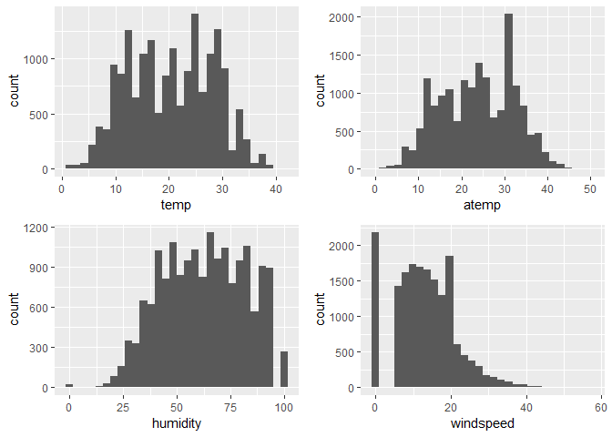
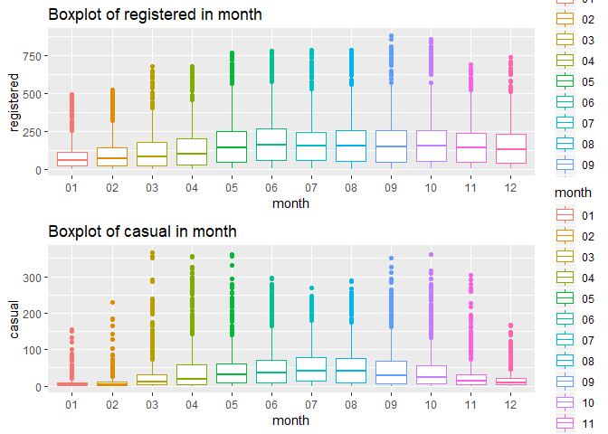

**자전거 대여 수요예측 분석**
=============================

본 문서는 Kaggle에 업로드된 '자전거 수요예측 분석'(Bike Sharing Demand)을 마크다운형식으로 편집하여,
Github에 업로드 하기 위하여 작성된 문서입니다.
데이터 출처 \*<https://www.kaggle.com/c/bike-sharing-demand>

------------------------------------------------------------------------

분석 과정 목차
--------------

1.  변수 정의
2.  분석 과정
    -   데이터 구조 확인
    -   사전 가설 수립(Make insight)
    -   EDA / Data preprocessing
    -   Modeling
    -   MSE Checking
3.  결론

------------------------------------------------------------------------

변수 정의
---------

1.  datetime - hourly date + timestamp

2.  season
    -   1 : spring
    -   2 : summer
    -   3 : fall
    -   4 : winter
3.  holiday - whether the day is considered a holiday (휴일)

4.  workingday - whether the day is neither a weekend nor holiday (주말도, 휴일도 아닌 날)

5.  weather
    -   1: Clear, Few clouds, Partly cloudy, Partly cloudy
    -   2: Mist + Cloudy, Mist + Broken clouds, Mist + Few clouds, Mist
    -   3: Light Snow, Light Rain + Thunderstorm + Scattered clouds, Light Rain + Scattered clouds
    -   4: Heavy Rain + Ice Pallets + Thunderstorm + Mist, Snow + Fog
6.  temp - temperature in Celsius(섭씨) -&gt; 실제온도.

7.  atemp - "feels like" temperature in Celsius (체감온도)

8.  humidity - relative humidity (습기)

9.  windspeed - wind speed (풍속)

**Train에만 있는 것. (종속변수)**

-   casual - number of non-registered user rentals initiated (비회원의 렌탈수)

-   registered - number of registered user rentals initiated (회원의 렌탈수)

-   count - number of total rentals (토탈렌트)

------------------------------------------------------------------------

분석 과정
---------

### 데이터 구조확인

**Initialize**

``` r
rm(list=ls())
library(ggplot2)  #for plotting
library(corrplot) #for correlation plot
```

    ## corrplot 0.84 loaded

``` r
library(dplyr)    #for %in% function
```

    ## 
    ## Attaching package: 'dplyr'

    ## The following objects are masked from 'package:stats':
    ## 
    ##     filter, lag

    ## The following objects are masked from 'package:base':
    ## 
    ##     intersect, setdiff, setequal, union

``` r
library(caret)    #for cross validation
```

    ## Loading required package: lattice

``` r
setwd('C:\\github\\Project\\BikeSharing')
train <- read.csv('train.csv', stringsAsFactors = F)
test <- read.csv('test.csv', stringsAsFactors = F)
```

``` r
colSums(is.na(train))
```

    ##   datetime     season    holiday workingday    weather       temp 
    ##          0          0          0          0          0          0 
    ##      atemp   humidity  windspeed     casual registered      count 
    ##          0          0          0          0          0          0

``` r
colSums(is.na(test))
```

    ##   datetime     season    holiday workingday    weather       temp 
    ##          0          0          0          0          0          0 
    ##      atemp   humidity  windspeed 
    ##          0          0          0

``` r
str(c(train, test))
```

    ## List of 21
    ##  $ datetime  : chr [1:10886] "2011-01-01 0:00" "2011-01-01 1:00" "2011-01-01 2:00" "2011-01-01 3:00" ...
    ##  $ season    : int [1:10886] 1 1 1 1 1 1 1 1 1 1 ...
    ##  $ holiday   : int [1:10886] 0 0 0 0 0 0 0 0 0 0 ...
    ##  $ workingday: int [1:10886] 0 0 0 0 0 0 0 0 0 0 ...
    ##  $ weather   : int [1:10886] 1 1 1 1 1 2 1 1 1 1 ...
    ##  $ temp      : num [1:10886] 9.84 9.02 9.02 9.84 9.84 ...
    ##  $ atemp     : num [1:10886] 14.4 13.6 13.6 14.4 14.4 ...
    ##  $ humidity  : int [1:10886] 81 80 80 75 75 75 80 86 75 76 ...
    ##  $ windspeed : num [1:10886] 0 0 0 0 0 ...
    ##  $ casual    : int [1:10886] 3 8 5 3 0 0 2 1 1 8 ...
    ##  $ registered: int [1:10886] 13 32 27 10 1 1 0 2 7 6 ...
    ##  $ count     : int [1:10886] 16 40 32 13 1 1 2 3 8 14 ...
    ##  $ datetime  : chr [1:6493] "2011-01-20 0:00" "2011-01-20 1:00" "2011-01-20 2:00" "2011-01-20 3:00" ...
    ##  $ season    : int [1:6493] 1 1 1 1 1 1 1 1 1 1 ...
    ##  $ holiday   : int [1:6493] 0 0 0 0 0 0 0 0 0 0 ...
    ##  $ workingday: int [1:6493] 1 1 1 1 1 1 1 1 1 1 ...
    ##  $ weather   : int [1:6493] 1 1 1 1 1 1 1 1 1 2 ...
    ##  $ temp      : num [1:6493] 10.7 10.7 10.7 10.7 10.7 ...
    ##  $ atemp     : num [1:6493] 11.4 13.6 13.6 12.9 12.9 ...
    ##  $ humidity  : int [1:6493] 56 56 56 56 56 60 60 55 55 52 ...
    ##  $ windspeed : num [1:6493] 26 0 0 11 11 ...

------------------------------------------------------------------------

-&gt; NA값은 존재하지 않는다는 것을 확인할 수 있다.

### 가설 사전 수립(Make insights)

**Idea 1. train과 test 데이터의 차이점**

train data에 비하여 test데이터는 casual(비회원의 렌트 수)와 registered(회원의 렌트 수)가 존재하지 않는다.
결국 count는 전체의 렌트 수 이므로, 두개의 모델을 적합시켜서 각각에서의 비회원 / 회원의 렌트수를 예측 한 이후에 그걸 더하면 좀 더 정확하지 않을까?
아무래도 casual과 registered는 확실히 경향에 있어서 차이가 있을 것 같다.
casual일때 더 많이 빌릴까? registered일때 더 많이 빌릴까?
이 사람들의 특징에서는 어떠한 차이가 존재할까?

**Idea 2. 기본 가정 확인하기.**

우리가 원하는 종속변수는 특정한 사건(렌트)의 수를 뜻하는 정수이다.
그렇다면 glm을 통해서 poison분포로 적합시킬 수 있지는 않을까?

**Idea 3. 변수간의 관계에 대해서 생각해보기.**

날짜에 관련된 변수가 datetime, holiday, workingday 이렇게 3개나 존재한다. (어쩌면 weather 또한 관련 되어 있을지도)
Weather는 temp, atemp, humidity와 관계가 밀접하지 않을까?
변수간의 Correration 확인해볼수 있을것 같다.

------------------------------------------------------------------------

### Exproratory Data Analysis (EDA)

**Preparing Total data**

``` r
test[,c('casual', 'registered', 'count')] <- NA
train <- rename(train, 'y' = 'count')
test <- rename(test, 'y' = 'count')
data <- rbind(train, test)
str(data)
```

    ## 'data.frame':    17379 obs. of  12 variables:
    ##  $ datetime  : chr  "2011-01-01 0:00" "2011-01-01 1:00" "2011-01-01 2:00" "2011-01-01 3:00" ...
    ##  $ season    : int  1 1 1 1 1 1 1 1 1 1 ...
    ##  $ holiday   : int  0 0 0 0 0 0 0 0 0 0 ...
    ##  $ workingday: int  0 0 0 0 0 0 0 0 0 0 ...
    ##  $ weather   : int  1 1 1 1 1 2 1 1 1 1 ...
    ##  $ temp      : num  9.84 9.02 9.02 9.84 9.84 ...
    ##  $ atemp     : num  14.4 13.6 13.6 14.4 14.4 ...
    ##  $ humidity  : int  81 80 80 75 75 75 80 86 75 76 ...
    ##  $ windspeed : num  0 0 0 0 0 ...
    ##  $ casual    : int  3 8 5 3 0 0 2 1 1 8 ...
    ##  $ registered: int  13 32 27 10 1 1 0 2 7 6 ...
    ##  $ y         : int  16 40 32 13 1 1 2 3 8 14 ...

**datetime**

``` r
nrow(data)
```

    ## [1] 17379

``` r
length(table(data$datetime))
```

    ## [1] 17379

-&gt; 문자열 데이터이며, 데이터의 분할이 필요함을 확인할 수 있다.

``` r
ggplot(data = data, aes(x = datetime, y = y)) +
  geom_point() +
  labs(title = 'Scatter plot of data',
       subtitle = 'with datetime')
```

    ## Warning: Removed 6493 rows containing missing values (geom_point).


-&gt; 각 월의 20일~마지막일 까지는 test에 포함된 NA값이다.

따라서, 이 빈 구역들의 y값들을 예측하는 것이 목표이다.

**season**

팩터들의 이름을 부여한다.

``` r
str(data$season)
```

    ##  int [1:17379] 1 1 1 1 1 1 1 1 1 1 ...

``` r
data$season[which(data$season == 1)] <- 'spring'
data$season[which(data$season == 2)] <- 'summer'
data$season[which(data$season == 3)] <- 'fall'
data$season[which(data$season == 4)] <- 'winter'
data$season <- factor(data$season,
                         levels = c('spring', 'summer', 'fall', 'winter'))
levels(data$season)
```

    ## [1] "spring" "summer" "fall"   "winter"

계절에 따른 y값의 모양을 상자그림을 통하여 실시하려고 한다.
단 2가지 방법으로 표현해보도록 하자.(이후 표현은 ggplot으로 통일한다.)

**A. Box Plot으로 그리기**

``` r
boxplot(data$y ~ data$season)
```


**B. ggplot을 활용한 그림**

``` r
ggplot(data = train) +
  geom_boxplot(aes(x = factor(season), y = y) ,fill = c('coral', 'coral1', 'coral2', 'coral3')) +
  labs(title = 'Boxplot of Data' ,
       subtitle = 'Grouped by Season' ,
       x = 'Season') +
  scale_x_discrete(labels = levels(data$season))
```


-&gt; 계절에 따라 y(count)의 값이 크게 변동은 없으나, summer와 fall의 평균이 어느정도 높은것을 확인할 수 있다.

**holiday**

``` r
data$holiday[which(data$holiday == 0)] <- 'holiday'
data$holiday[which(data$holiday == 1)] <- 'non holiday'
data$holiday <- as.factor(data$holiday)
str(data$holiday)
```

    ##  Factor w/ 2 levels "holiday","non holiday": 1 1 1 1 1 1 1 1 1 1 ...

``` r
table(data$holiday)
```

    ## 
    ##     holiday non holiday 
    ##       16879         500

-&gt; Binary data 이며, Holiday와 Non holiday의 비율이 16879 : 500 인것을 확인할 수 있다.

-&gt; count에 영향을 주지 않는다.

``` r
ggplot(data = train, aes(x = holiday, y = y)) +
  geom_boxplot(aes(group = holiday)) +
  aes(fill = holiday) +
  labs(title = 'Boxplot of Data' ,
       subtitle = 'Grouped by holiday')
```


-&gt; Holiday 유무에 따라 평균의 큰 차이는 없으나 큰 Y 값들이 Holiday에 상대적으로 많은 것을 확인할 수 있다.

**workingday**

``` r
data$workingday[which(data$workingday == 0)] <- 'non workingday'
data$workingday[which(data$workingday == 1)] <- 'workingday'
data$workingday <- as.factor(data$workingday)
table(data$workingday)
```

    ## 
    ## non workingday     workingday 
    ##           5514          11865

-&gt; 1 : 2의 비율로 분포하는 것을 확인할 수 있다.

차이점 확인하기.

``` r
ggplot(data = train, aes(x = workingday, y = y)) +
  geom_boxplot(aes(group = workingday)) +
  aes(fill = workingday) +
  labs(title = 'Boxplot of Data' ,
       subtitle = 'Grouped by working')
```


-&gt; 평균의 차이가 크지 않은 것을 확인할 수 있다.

**weather**

범주별 데이터 수 확인

``` r
table(data$weather)
```

    ## 
    ##     1     2     3     4 
    ## 11413  4544  1419     3

-&gt; 4(Heavy Rain)인 자료가 단 3개밖에 존재하지 않는다.

차이점 확인

``` r
ggplot(data = data, aes(x = weather, y = y))+
     geom_boxplot(aes(group = weather)) +
     aes(fill = weather) +
     labs(title = 'Boxplot of Data' ,
     subtitle = 'Grouped by weather')
```

    ## Warning: Removed 6493 rows containing non-finite values (stat_boxplot).


-&gt; 범주 4의 치환이 필요함을 확인할 수 있고, 날씨에 따른 y의 변화를 확인할 수 있다.

**Numeric data Exploring**

temp, atemp, humidity, windspeed 모두 수치형 데이터이며, 이중 주목할 것은 temp(온도)와 atemp(체감온도) 일 것이다.
-&gt; 따라서 두 변수는 반드시 강한 상관관계를 가질 것으로 예상된다.

``` r
num_data <- data[, c('temp', 'atemp', 'humidity', 'windspeed')]
cor(num_data)
```

    ##                  temp       atemp    humidity   windspeed
    ## temp       1.00000000  0.98767214 -0.06988139 -0.02312526
    ## atemp      0.98767214  1.00000000 -0.05191770 -0.06233604
    ## humidity  -0.06988139 -0.05191770  1.00000000 -0.29010490
    ## windspeed -0.02312526 -0.06233604 -0.29010490  1.00000000

-&gt; 예상대로 temp와 atemp의 상관관계를 확인할 수 있었다.

**각 연속형 변수의 히스토그램과, 종속변수와의 상관계수 확인**

test data에는 y값이 존재하지 않으므로, train data에서 numeric data를 추출하여 correlation을 계산한다.

``` r
num_train <- train[, c('temp', 'atemp', 'humidity', 'windspeed', 'y')]
cor(num_train)[,5]
```

    ##       temp      atemp   humidity  windspeed          y 
    ##  0.3944536  0.3897844 -0.3173715  0.1013695  1.0000000

-&gt; 각각의 상관계수를 확인할 수 있다.

**Pair plot 그리기**

시각화를 통해서 상관관계를 다시 확인한다.

``` r
corrplot(cor(num_train), method = 'circle', diag = FALSE)
```


-&gt; 상관관계들을 확인할 수 있다.

**Checking Y**

``` r
ggplot(data = data, aes(data$y))+
     geom_histogram()
```

    ## `stat_bin()` using `bins = 30`. Pick better value with `binwidth`.

    ## Warning: Removed 6493 rows containing non-finite values (stat_bin).


-&gt; 왼쪽으로 치우친 것을 확인할 수 있으며, 변수변환의 필요성을 확인할 수 있다.

-&gt; 또한 변수의 성질(0 이상의 정수)에 따라서 Possion regression의 적합을 생각할 수 있다.

------------------------------------------------------------------------

### Data Preprocessing

**datetime**

-   연월일 / 시간 -&gt; 월별로 계절을 나누는게 어느정도 정확하지 않을까?
-   시간대별로 다른 대여수? 버리고 싶지만, 시간대별로 온도가 너무 다르다.

-&gt; 시간대 별로 morning, afternoon, night, dawn 으로 나눠서 파생변수를 만들고 date time을 지우면 어떨까?

**시간 분할해서 plot그려보기.**

``` r
sp <- unlist(strsplit(data$datetime, ":"))
time <- substr(sp[seq(from = 1, to = length(sp), by = 2)], 12, 13)
data$time <- as.integer(time)
ggplot(data = data, aes(x = time, y = y)) +
  geom_point() +
  labs(title = 'Scatter plot of data',
       subtitle = 'with time')
```

    ## Warning: Removed 6493 rows containing missing values (geom_point).


-&gt; 일정한 추세를 보이는 것을 확인할 수 있었다.

**날짜로 시간대 나누기**

0 ~ 6시 dawn, 7 ~ 12시 morning, 1 ~ 6시 afternoon, 7 ~ 12시 night로 범주화시킨다.

``` r
dawnidx <- which(data$time == 0  #data$time %in% paste0(0:5, ":00")
               | data$time == 1
               | data$time == 2
               | data$time == 3
               | data$time == 4
               | data$time == 5)
morningidx <- which(data$time == 6  #data$time %in% paste0(6:11, ":00")
                    | data$time == 7
                    | data$time == 8
                    | data$time == 9
                    | data$time == 10
                    | data$time == 11)
afternoonidx <- which(data$time == 12  #data$time %in% paste0(12:17, ":00")
                      | data$time == 13
                      | data$time == 14
                      | data$time == 15
                      | data$time == 16
                      | data$time == 17)
nightidx <- which(data$time == 18  #data$time %in% paste0(18:23, ":00")
                  | data$time == 19
                  | data$time == 20
                  | data$time == 21
                  | data$time == 22
                  | data$time == 23)

data$daytime <- data$time

data$daytime[dawnidx] <- 'dawn'
data$daytime[morningidx] <- 'morning'
data$daytime[afternoonidx] <- 'afternoon'
data$daytime[nightidx] <- 'night'

data$time <- as.factor(data$time)
data$daytime <- as.factor(data$daytime)
```

**범주화된 변수로 Box plot 그리기**

``` r
ggplot(data = data, aes(x = daytime, y = y)) +
  geom_boxplot(aes(group = daytime)) +
  aes(fill = daytime) +
  labs(title = 'Boxplot of Data' ,
       subtitle = 'Grouped by daytime')
```

    ## Warning: Removed 6493 rows containing non-finite values (stat_boxplot).



-&gt; 각각의 시간에 따른 추세가 중요해보이므로, 범주화 시킨 변수를 삭제한다.

``` r
data <- subset(data, select = -c(daytime))
```

**연도, 월 추출**

``` r
data$year <- substr(data$datetime, 1, 4)
data$year <- as.factor(data$year)
data$month <- substr(data$datetime, 6, 7)
data$month <- as.factor(data$month)
data <- subset(data, select = -c(datetime))
```

-&gt; datetime에서 일자를 사용하지 않는이유 : test와 train의 일자가 모두 다르기 때문.

**season**

EDA과정에서 약간의 영향력을 확인했기 때문에, 따로 처리하지 않도록 한다.

**Holiday**

위에서 확인한 boxplot을 확인해 보았을 때, 변수의 비율도 치우쳐있고 count에 큰 영향을 주는 것 같지 않다. -&gt; 지워버리자. workingday 데이터만 사용

``` r
data <- subset(data, select = -c(holiday))
```

**workingday**

workingday 변수 역시 큰 영향을 끼치지 않아 보이지만, holiday 변수의 삭제로 인해 이 변수는 남겨놓고 분석을 시도해보기로 한다.

**weather**

4번 범주(악천후)에 속하는 데이터가 3개밖에 존재하지 않는 것을 확인했으므로, 이를 다른 범주로 치환해야 한다.

``` r
list(Index = which(data$weather == 4),
     Previous_day = data[which(data$weather == 4)-1,'weather'],
     Level4_day = data[which(data$weather == 4),'weather'],
     Next_day = data[which(data$weather == 4)+1,'weather'])
```

    ## $Index
    ## [1]  5632 11041 14135
    ## 
    ## $Previous_day
    ## [1] 3 3 3
    ## 
    ## $Level4_day
    ## [1] 4 4 4
    ## 
    ## $Next_day
    ## [1] 3 3 3

-&gt; 3개의 데이터 모두 전후일에 날씨변수가 3이었다. 이에 따라서 모든 범주 4를 범주 3으로 치환한다.

``` r
data[which(data$weather == 4), 'weather'] = '3'
data$weather <- as.factor(data$weather)
```

**Numeric data**

Numeric data는 따로 처리하지 않도록 한다.

-&gt; 파생변수를 만들어서 한번에 처리할 수 있다면?

**불쾌지수 변수 만들기**

``` r
discomfort <- with(data, (9/5)*temp-
                     0.55*(1-(humidity/100))*((9/5)*temp-26)+32)
data$discomfort <- discomfort
```

**상관계수 확인하기(불쾌지수 추가)**

``` r
num_data_2 <- data[which(!is.na(data$y)), c('temp', 'atemp', 'humidity', 'windspeed','discomfort', 'y')]
cor(num_data_2)
```

    ##                   temp       atemp    humidity   windspeed  discomfort
    ## temp        1.00000000  0.98494811 -0.06494877 -0.01785201  0.98683890
    ## atemp       0.98494811  1.00000000 -0.04353571 -0.05747300  0.97367141
    ## humidity   -0.06494877 -0.04353571  1.00000000 -0.31860699  0.03457894
    ## windspeed  -0.01785201 -0.05747300 -0.31860699  1.00000000 -0.03726081
    ## discomfort  0.98683890  0.97367141  0.03457894 -0.03726081  1.00000000
    ## y           0.39445364  0.38978444 -0.31737148  0.10136947  0.34551225
    ##                     y
    ## temp        0.3944536
    ## atemp       0.3897844
    ## humidity   -0.3173715
    ## windspeed   0.1013695
    ## discomfort  0.3455122
    ## y           1.0000000

-&gt; temp와 atemp, discomfort와의 multiple correlation을 확인하고, 변수 처리방안을 고민한다.

**windspeed**

Boxplot을 통한 풍속과 날씨의 연관성 확인

``` r
ggplot(data = data, aes(x = weather, y = windspeed)) +
  geom_boxplot(aes(group = weather)) +
  aes(fill = weather) +
  labs(title = 'Boxplot of Data(windspeed)' ,
       subtitle = 'Grouped by weather')
```


-&gt; 큰 영향을 보이지 않는 것 같아 보인다.

------------------------------------------------------------------------

### Modeling

**Model 1 : Idea 1 을 활용**

``` r
length(train$y)
```

    ## [1] 10886

``` r
sum(train$y == (train$casual + train$registered))
```

    ## [1] 10886

-&gt; y(count) = casual + resistered임을 확인했기 때문에 따로 모형을 적합시켜서 그 합을 구해본다.

**Data partitioning**

``` r
train1 <- data[1 : nrow(train), ]
test1 <- data[-c(1:nrow(train)), ]
```

**환경에 따른 modeling**

``` r
f1_reg <- formula(registered ~ season+workingday+weather+temp+atemp+humidity+windspeed+time+year+month+discomfort)
f1_cas <- formula(casual ~ season+workingday+weather+temp+atemp+humidity+windspeed+time+year+month+discomfort)
fit1_reg <- lm(formula = f1_reg, data = train1)
fit1_cas <- lm(formula = f1_cas, data = train1)
```

**가정 확인**

``` r
par(mfrow = c(2,2))
plot(fit1_reg)
```



``` r
plot(fit1_cas)
```


-&gt; 정규성에 대한 가정을 위배한다. 종속변수의 변환이 필요하다는 것을 확인할 수 있다.

**Model 2 : Log-transformation with Model 1**
각각의 종속변수는 0이상의 정수이므로 1을 더한뒤에 log변환을 시도한다.

``` r
f2_reg <- formula(log(registered+1) ~ season+workingday+weather+temp+atemp+humidity+windspeed+time+year+month+discomfort)
f2_cas <- formula(log(casual+1) ~ season+workingday+weather+temp+atemp+humidity+windspeed+time+year+month+discomfort)
fit2_reg <- lm(formula = f2_reg, data = train1)
fit2_cas <- lm(formula = f2_cas, data = train1)
```

**가정 확인**

``` r
par(mfrow = c(2,2))
plot(fit1_reg)
```


``` r
plot(fit1_cas)
```


-&gt; 변환 전에 비해, 나아진 모습을 보인다.

**Return to Data partition**

Caret 패키지를 활용한 모형 학습

``` r
CV_IDX <- createMultiFolds(train1$y, k = 10, times = 3)
```

MSE
===

pred1 &lt;- predict(fit1, newdata = test1) sum((test1$count-pred1)^2) / ncol(test1) \#RMSE sqrt(sum((test1$count-pred1)^2) / ncol(test1))

변수변환
--------

par(mfrow = c(1,1)) hist(train1*c**o**u**n**t*)*h**i**s**t*(*l**o**g*(*t**r**a**i**n*1count)) hist(sqrt(train1$count)) fit2 &lt;- lm(sqrt(count) ~ datetime+season+workingday+weather+temp+atemp+humidity+windspeed+time, data = train1) summary(fit2) par(mfrow = c(2,2)) plot(fit2)

MSE
===

pred2 &lt;- predict(fit2, newdata = test1) sum((test1$count-pred2)^2) / ncol(test1) \#RMSE sqrt(sum((test1$count-pred2)^2) / ncol(test1)) par(mfrow = c(1,1)) plot(train1$count)

### Idea1 써먹어 보기. count변수는 결국 registered와 casual의 합에 불과하다.

--&gt; 그렇다면 각각의 특성이 다르므로, 2개의 모델을 만들어서 그것의 예측값의 합을 count의 합으로 둔다면?
=========================================================================================================

sum((train1*r**e**g**i**s**t**e**r**e**d* + *t**r**a**i**n*1casual)==train1$count) nrow(train1) \#합이라는 것을 확인.

hist(train1*r**e**g**i**s**t**e**r**e**d*)*h**i**s**t*(*t**r**a**i**n*1casual) \#박스콕스.......쓰고싶다...단점을 확인해봐야겠다. str(train1)

####### 지현이의 조언 : 종속변수가 이산형이니까 회귀분석을 쓰는 건 옳지않은것이 맞고, PoissonRegression을 써야된다.

library(mpath) \#resistered와 casual을 구분하여 추정한 뒤, 합을 구하기.

Poifit1 &lt;- glm(registered ~datetime+season+holiday+workingday+weather+temp+atemp+humidity+windspeed+time+daytime , data = train1, family = poisson)

Poifit2 &lt;- glm(casual ~datetime+season+holiday+workingday+weather+temp+atemp+humidity+windspeed+time+daytime , data = train1, family = poisson)

제출파일 만들기
===============

pre1 &lt;- predict(Poifit1, newdata = test1) pre2 &lt;- predict(Poifit2, newdata = test1) exppre1 &lt;- exp(pre1) exppre2 &lt;- exp(pre2) final &lt;- exppre1+exppre2 sampleSubmission &lt;- read.csv('sampleSubmission.csv', header = T) sampleSubmission$count &lt;- final write.csv(sampleSubmission, file = 'smapleSubmission5.csv') str(sampleSubmission)

과대산포를 의심할 수 있을 것 같다.
==================================

mean(train1*c**o**u**n**t*)*v**a**r*(*t**r**a**i**n*1count)

모델이 합리적인지 확인해보고 싶을땐? k-fold Cross validation을 사용하는 것이 옳은 것 같다.
------------------------------------------------------------------------------------------

Cross Validation
----------------

library(caret)

set.seed(123) train1\_fold &lt;- createFolds(train1$count, k = 10) form &lt;- formula(count ~ datetime + season + holiday + workingday + weather + temp + atemp + humidity + windspeed + time)

cv\_results &lt;- lapply(train1\_fold, function(x) { count\_train &lt;- train1\[-x, \] count\_test &lt;- train1\[x, \] count\_model &lt;- glm(formula = form, data = count\_train, family = poisson) credit\_pred &lt;- exp(predict(count\_model, newdata = count\_test)) credit\_actual &lt;- count\_test$count MSE &lt;- sum((credit\_actual - credit\_pred)^2) / nrow(credit\_actual) return(MSE) })

weather의 변수를 보자
=====================

table(data.all*w**e**a**t**h**e**r*)*w**h**i**c**h*(*d**a**t**a*.*a**l**l*weather == 4) invaliddata &lt;- which(data.all$weather == 4) \#3개의 데이터 data.all &lt;- data.all\[-invaliddata, \] \#삭제 str(cv\_results) mean(unlist(cv\_results))

train1 &lt;- data.all\[1:nrow(train)-1, \] test1 &lt;- data.all\[10886:nrow(data.all), \]

제출파일 만들기
===============

pre &lt;- predict(Poifit, newdata = test1) exppre &lt;- exp(pre) sampleSubmission &lt;- read.csv('sampleSubmission.csv', header = T) sampleSubmission$count &lt;- exppre write.csv(sampleSubmission, file = 'smapleSubmission2.csv') str(sampleSubmission)
