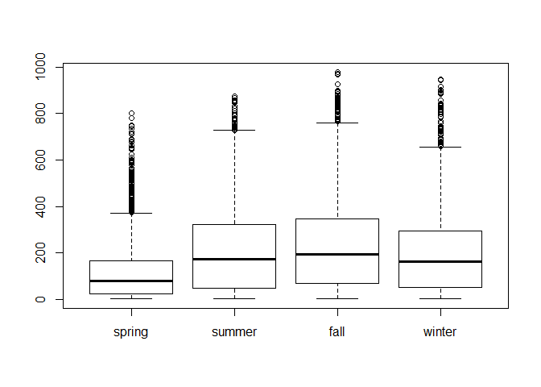
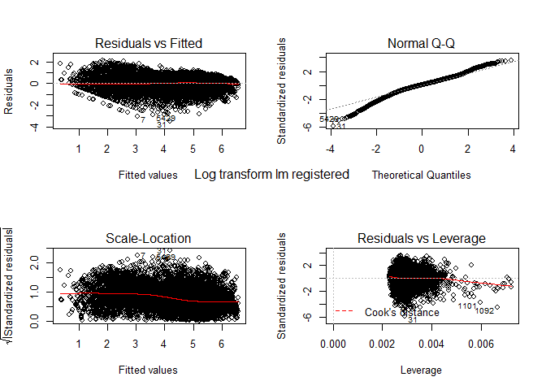

**자전거 대여 수요예측 분석**
=============================

본 문서는 Kaggle에 업로드된 '자전거 수요예측 분석'(Bike Sharing Demand)을 마크다운형식으로 편집하여,
Github에 업로드 하기 위하여 작성된 문서입니다.
데이터 출처 \*<https://www.kaggle.com/c/bike-sharing-demand>

------------------------------------------------------------------------

분석 과정 목차
--------------

[1. 변수 정의](#변수-정의)

[2. 분석 과정](#분석-과정)

[데이터 구조 확인](#데이터-구조-확인)

[사전 가설 수립(Make insight)](#가설-사전-수립)

[EDA](#Exproratory-Data-Analysis)

[Data preprocessing](#Data-Preprocessing)

[Modeling](#Modeling)

[3. 결론](#한계점)

------------------------------------------------------------------------

변수 정의
---------

1.  datetime - hourly date + timestamp

2.  season
    -   1 : spring
    -   2 : summer
    -   3 : fall
    -   4 : winter
3.  holiday - whether the day is considered a holiday (휴일)

4.  workingday - whether the day is neither a weekend nor holiday (주말도, 휴일도 아닌 날)

5.  weather
    -   1: Clear, Few clouds, Partly cloudy, Partly cloudy
    -   2: Mist + Cloudy, Mist + Broken clouds, Mist + Few clouds, Mist
    -   3: Light Snow, Light Rain + Thunderstorm + Scattered clouds, Light Rain + Scattered clouds
    -   4: Heavy Rain + Ice Pallets + Thunderstorm + Mist, Snow + Fog
6.  temp - temperature in Celsius(섭씨) -&gt; 실제온도.

7.  atemp - "feels like" temperature in Celsius (체감온도)

8.  humidity - relative humidity (습기)

9.  windspeed - wind speed (풍속)

**Train에만 있는 것. (종속변수)**

-   casual - number of non-registered user rentals initiated (비회원의 렌탈수)

-   registered - number of registered user rentals initiated (회원의 렌탈수)

-   count - number of total rentals (토탈렌트)

------------------------------------------------------------------------

분석 과정
---------

### 데이터 구조 확인

**Initialize**

``` r
rm(list=ls())
library(ggplot2)  #for plotting
library(corrplot) #for correlation plot
library(dplyr)    #for %in% function
library(caret)    #for cross validation
library(pscl)     #for Zero-inflated poisson regression
library(plm)     #for index function
library(qcc)     #for overdispersion
library(gridExtra)
library(rpart) # train : CART
library(party) #train : ctree
library(randomForest) # train : rf
library(e1071) #train : ranger(rf보다 빠른 속도)
library(ranger) #train : ranger(rf보다 빠른 속도)
library(elasticnet) #train : ridge
library(car) # for vif function(multicollinearity)
setwd('C:\\github\\Project\\BikeSharing')
train <- read.csv('train.csv', stringsAsFactors = F)
test <- read.csv('test.csv', stringsAsFactors = F)
```

``` r
colSums(is.na(train))
```

    ##   datetime     season    holiday workingday    weather       temp 
    ##          0          0          0          0          0          0 
    ##      atemp   humidity  windspeed     casual registered      count 
    ##          0          0          0          0          0          0

``` r
colSums(is.na(test))
```

    ##   datetime     season    holiday workingday    weather       temp 
    ##          0          0          0          0          0          0 
    ##      atemp   humidity  windspeed 
    ##          0          0          0

``` r
str(c(train, test))
```

    ## List of 21
    ##  $ datetime  : chr [1:10886] "2011-01-01 0:00" "2011-01-01 1:00" "2011-01-01 2:00" "2011-01-01 3:00" ...
    ##  $ season    : int [1:10886] 1 1 1 1 1 1 1 1 1 1 ...
    ##  $ holiday   : int [1:10886] 0 0 0 0 0 0 0 0 0 0 ...
    ##  $ workingday: int [1:10886] 0 0 0 0 0 0 0 0 0 0 ...
    ##  $ weather   : int [1:10886] 1 1 1 1 1 2 1 1 1 1 ...
    ##  $ temp      : num [1:10886] 9.84 9.02 9.02 9.84 9.84 ...
    ##  $ atemp     : num [1:10886] 14.4 13.6 13.6 14.4 14.4 ...
    ##  $ humidity  : int [1:10886] 81 80 80 75 75 75 80 86 75 76 ...
    ##  $ windspeed : num [1:10886] 0 0 0 0 0 ...
    ##  $ casual    : int [1:10886] 3 8 5 3 0 0 2 1 1 8 ...
    ##  $ registered: int [1:10886] 13 32 27 10 1 1 0 2 7 6 ...
    ##  $ count     : int [1:10886] 16 40 32 13 1 1 2 3 8 14 ...
    ##  $ datetime  : chr [1:6493] "2011-01-20 0:00" "2011-01-20 1:00" "2011-01-20 2:00" "2011-01-20 3:00" ...
    ##  $ season    : int [1:6493] 1 1 1 1 1 1 1 1 1 1 ...
    ##  $ holiday   : int [1:6493] 0 0 0 0 0 0 0 0 0 0 ...
    ##  $ workingday: int [1:6493] 1 1 1 1 1 1 1 1 1 1 ...
    ##  $ weather   : int [1:6493] 1 1 1 1 1 1 1 1 1 2 ...
    ##  $ temp      : num [1:6493] 10.7 10.7 10.7 10.7 10.7 ...
    ##  $ atemp     : num [1:6493] 11.4 13.6 13.6 12.9 12.9 ...
    ##  $ humidity  : int [1:6493] 56 56 56 56 56 60 60 55 55 52 ...
    ##  $ windspeed : num [1:6493] 26 0 0 11 11 ...

------------------------------------------------------------------------

-&gt; NA값은 존재하지 않는다는 것을 확인할 수 있다.

### 가설 사전 수립

**Idea 1. train과 test 데이터의 차이점**

train data에 비하여 test데이터는 casual(비회원의 렌트 수)와 registered(회원의 렌트 수)가 존재하지 않는다.
결국 count는 전체의 렌트 수 이므로, 두개의 모델을 적합시켜서 각각에서의 비회원 / 회원의 렌트수를 예측 한 이후에 그걸 더하면 좀 더 정확하지 않을까?
아무래도 casual과 registered는 확실히 경향에 있어서 차이가 있을 것 같다.
casual일때 더 많이 빌릴까? registered일때 더 많이 빌릴까?
이 사람들의 특징에서는 어떠한 차이가 존재할까?

**Idea 2. 기본 가정 확인하기.**

우리가 원하는 종속변수는 특정한 사건(렌트)의 수를 뜻하는 정수이다.
그렇다면 glm을 통해서 poison분포로 적합시킬 수 있지는 않을까?

**Idea 3. 변수간의 관계에 대해서 생각해보기.**

날짜에 관련된 변수가 datetime, holiday, workingday 이렇게 3개나 존재한다. (어쩌면 weather 또한 관련 되어 있을지도)
Weather는 temp, atemp, humidity와 관계가 밀접하지 않을까?
변수간의 Correration 확인해볼수 있을것 같다.

------------------------------------------------------------------------

### Exproratory Data Analysis

**Preparing Total data**

``` r
test[,c('casual', 'registered', 'count')] <- NA
train <- rename(train, 'y' = 'count')
test <- rename(test, 'y' = 'count')
data <- rbind(train, test)
str(data)
```

    ## 'data.frame':    17379 obs. of  12 variables:
    ##  $ datetime  : chr  "2011-01-01 0:00" "2011-01-01 1:00" "2011-01-01 2:00" "2011-01-01 3:00" ...
    ##  $ season    : int  1 1 1 1 1 1 1 1 1 1 ...
    ##  $ holiday   : int  0 0 0 0 0 0 0 0 0 0 ...
    ##  $ workingday: int  0 0 0 0 0 0 0 0 0 0 ...
    ##  $ weather   : int  1 1 1 1 1 2 1 1 1 1 ...
    ##  $ temp      : num  9.84 9.02 9.02 9.84 9.84 ...
    ##  $ atemp     : num  14.4 13.6 13.6 14.4 14.4 ...
    ##  $ humidity  : int  81 80 80 75 75 75 80 86 75 76 ...
    ##  $ windspeed : num  0 0 0 0 0 ...
    ##  $ casual    : int  3 8 5 3 0 0 2 1 1 8 ...
    ##  $ registered: int  13 32 27 10 1 1 0 2 7 6 ...
    ##  $ y         : int  16 40 32 13 1 1 2 3 8 14 ...

``` r
colSums(is.na(data))
```

    ##   datetime     season    holiday workingday    weather       temp 
    ##          0          0          0          0          0          0 
    ##      atemp   humidity  windspeed     casual registered          y 
    ##          0          0          0       6493       6493       6493

**Categorical data Exploring**

**datetime**

``` r
nrow(data) == length(unique(data$datetime))
```

    ## [1] TRUE

-&gt; 문자열 데이터이며, 데이터의 분할이 필요함을 확인할 수 있다.

``` r
ggplot(data = data, aes(x = datetime, y = y)) +
  geom_point() +
  labs(title = 'Scatter plot of data',
       subtitle = 'With datetime(all Y)')
```

    ## Warning: Removed 6493 rows containing missing values (geom_point).


-&gt; 각 월의 20일~마지막일 까지는 test에 포함된 NA값이다.

따라서, 이 빈 구역들의 y값들을 예측하는 것이 목표이다.

**season**

팩터들의 이름을 부여한다.

``` r
str(data$season)
```

    ##  int [1:17379] 1 1 1 1 1 1 1 1 1 1 ...

``` r
data$season[which(data$season == 1)] <- 'spring'
data$season[which(data$season == 2)] <- 'summer'
data$season[which(data$season == 3)] <- 'fall'
data$season[which(data$season == 4)] <- 'winter'
data$season <- factor(data$season,
                         levels = c('spring', 'summer', 'fall', 'winter'))
levels(data$season)
```

    ## [1] "spring" "summer" "fall"   "winter"

계절에 따른 y값의 모양을 상자그림을 통하여 실시하려고 한다.
단 2가지 방법으로 표현해보도록 하자.(이후 표현은 ggplot으로 통일한다.)

**A. Box Plot으로 그리기**

``` r
boxplot(data$y ~ data$season)
```



**B. ggplot을 활용한 그림**

``` r
ggplot(data = data, aes(x = season, y = y, color = season)) +
  geom_boxplot() +
  labs(title = 'Boxplot of Data' ,
       subtitle = 'Grouped by Season' ,
       x = 'Season') +
  theme(legend.position = 'none')
```

    ## Warning: Removed 6493 rows containing non-finite values (stat_boxplot).


-&gt; 계절에 따라 y(count)의 값이 크게 변동은 없는 것을 확인할 수 있다.

**holiday**

``` r
data$holiday[which(data$holiday == 0)] <- 'holiday'
data$holiday[which(data$holiday == 1)] <- 'non holiday'
data$holiday <- as.factor(data$holiday)
str(data$holiday)
```

    ##  Factor w/ 2 levels "holiday","non holiday": 1 1 1 1 1 1 1 1 1 1 ...

``` r
table(data$holiday)
```

    ## 
    ##     holiday non holiday 
    ##       16879         500

-&gt; Binary data 이며, Holiday와 Non holiday의 비율이 16879 : 500 인것을 확인할 수 있다.
\*\* 비율차이 시각화 \*\*

``` r
D1 <- as.data.frame(table(data$holiday))

ggplot(data = D1, aes(x = Var1, y = Freq, fill = Var1)) +
  geom_col() +
  labs(title = 'Bar plot of frequency',
       subtitle = 'in Holiday variable') +
  theme(legend.position = 'none')
```


``` r
  #stat_identity()
```

``` r
ggplot(data = data, aes(x = holiday, y = y, color = holiday)) +
  geom_boxplot() +
  labs(title = 'Boxplot of Data' ,
       subtitle = 'Grouped by holiday',
       x = 'Holiday') +
  theme(legend.position = 'none')
```

    ## Warning: Removed 6493 rows containing non-finite values (stat_boxplot).


``` r
    #scale_x_discrete(labels = levels(data$holiday))
```

-&gt; Holiday 유무에 따라 평균의 큰 차이는 없으나 큰 Y 값들이 Holiday에 상대적으로 많은 것을 확인할 수 있다.

**workingday**

``` r
data$workingday[which(data$workingday == 0)] <- 'non workingday'
data$workingday[which(data$workingday == 1)] <- 'workingday'
data$workingday <- as.factor(data$workingday)
table(data$workingday)
```

    ## 
    ## non workingday     workingday 
    ##           5514          11865

-&gt; 1 : 2의 비율로 분포하는 것을 확인할 수 있다.

\*\* 비율차이 시각화 \*\*

``` r
D1 <- as.data.frame(table(data$workingday))

ggplot(data = D1, aes(x = Var1, y = Freq, fill = Var1)) +
  geom_col() +
  labs(title = 'Bar plot of frequency',
       subtitle = 'in Workingday variable') +
  theme(legend.position = 'none')
```


``` r
  #stat_identity()
```

차이점 확인하기.

``` r
ggplot(data = data) +
  geom_boxplot(aes(x = workingday, y = y, color = workingday)) +
  labs(title = 'Boxplot of Data' ,
       subtitle = 'Grouped by workingday',
       x = 'workingday') +
  theme(legend.position = 'none')
```

    ## Warning: Removed 6493 rows containing non-finite values (stat_boxplot).


``` r
    #scale_x_discrete(labels = levels(data$workingday))
```

-&gt; 평균의 차이가 크지 않은 것을 확인할 수 있다.

**weather**

범주별 데이터 수 확인

``` r
data$weather <- as.factor(data$weather)
table(data$weather)
```

    ## 
    ##     1     2     3     4 
    ## 11413  4544  1419     3

-&gt; 4(Heavy Rain)인 자료가 단 3개밖에 존재하지 않는다.

차이점 확인

``` r
ggplot(data = data) +
  geom_boxplot(aes(x = weather, y = y, color = weather)) +
  labs(title = 'Boxplot of Data' ,
       subtitle = 'Grouped by weather',
       x = 'weather') +
  theme(legend.position = 'none')
```

    ## Warning: Removed 6493 rows containing non-finite values (stat_boxplot).


-&gt; 범주 4의 치환이 필요함을 확인할 수 있고, 날씨에 따른 y의 변화를 확인할 수 있다.

**Numerical data Exploring**

temp, atemp, humidity, windspeed 모두 수치형 데이터이며, 이중 주목할 것은 temp(온도)와 atemp(체감온도) 일 것이다.
-&gt; 따라서 두 변수는 반드시 강한 상관관계를 가질 것으로 예상된다.

``` r
num_data <- data[, c('temp', 'atemp', 'humidity', 'windspeed')]
cor(num_data)
```

    ##                  temp       atemp    humidity   windspeed
    ## temp       1.00000000  0.98767214 -0.06988139 -0.02312526
    ## atemp      0.98767214  1.00000000 -0.05191770 -0.06233604
    ## humidity  -0.06988139 -0.05191770  1.00000000 -0.29010490
    ## windspeed -0.02312526 -0.06233604 -0.29010490  1.00000000

-&gt; 예상대로 temp와 atemp의 상관관계를 확인할 수 있었다.

**각 연속형 변수의 히스토그램과, 종속변수와의 상관계수 확인**

test data에는 y값이 존재하지 않으므로, train data에서 numeric data를 추출하여 correlation을 계산한다.

``` r
num_train <- train[, c('temp', 'atemp', 'humidity', 'windspeed', 'y' ,'casual', 'registered')]
cor(num_train)
```

    ##                   temp       atemp    humidity   windspeed          y
    ## temp        1.00000000  0.98494811 -0.06494877 -0.01785201  0.3944536
    ## atemp       0.98494811  1.00000000 -0.04353571 -0.05747300  0.3897844
    ## humidity   -0.06494877 -0.04353571  1.00000000 -0.31860699 -0.3173715
    ## windspeed  -0.01785201 -0.05747300 -0.31860699  1.00000000  0.1013695
    ## y           0.39445364  0.38978444 -0.31737148  0.10136947  1.0000000
    ## casual      0.46709706  0.46206654 -0.34818690  0.09227619  0.6904136
    ## registered  0.31857128  0.31463539 -0.26545787  0.09105166  0.9709481
    ##                 casual  registered
    ## temp        0.46709706  0.31857128
    ## atemp       0.46206654  0.31463539
    ## humidity   -0.34818690 -0.26545787
    ## windspeed   0.09227619  0.09105166
    ## y           0.69041357  0.97094811
    ## casual      1.00000000  0.49724969
    ## registered  0.49724969  1.00000000

-&gt; 각각의 상관계수를 확인할 수 있다.

**Pair plot 그리기**

시각화를 통해서 상관관계를 다시 확인한다.

``` r
corrplot(cor(num_train), method = 'circle', diag = FALSE)
```


-&gt; 상관관계들을 확인할 수 있다.

**각 연속형 변수들의 히스토그램**

``` r
temp_hist <- ggplot(data = num_data, aes(num_data$temp))+ geom_histogram() + labs(x = 'temp')
atemp_hist <- ggplot(data = num_data, aes(num_data$atemp))+ geom_histogram() + labs(x = 'atemp')
humidity_hist <- ggplot(data = num_data, aes(num_data$humidity))+ geom_histogram() + labs(x = 'humidity')
windspeed_hist <- ggplot(data = num_data, aes(num_data$windspeed))+ geom_histogram() + labs(x = 'windspeed')

grid.arrange(temp_hist, atemp_hist, humidity_hist, windspeed_hist, ncol=2, nrow = 2)
```

    ## `stat_bin()` using `bins = 30`. Pick better value with `binwidth`.
    ## `stat_bin()` using `bins = 30`. Pick better value with `binwidth`.
    ## `stat_bin()` using `bins = 30`. Pick better value with `binwidth`.
    ## `stat_bin()` using `bins = 30`. Pick better value with `binwidth`.


-&gt; 알 수 있는 사실
- humidity에서 100으로 관측된 값들을 세부적으로 봐야 한다. : 비오는 날의 습도는 100!
- windspeed에서 0으로 관측된 값들(NA로 추청)이 보인다.

**Checking Y**

``` r
ggplot(data = train, aes(train$y))+
     geom_histogram()
```

    ## `stat_bin()` using `bins = 30`. Pick better value with `binwidth`.


-&gt; 왼쪽으로 치우친 것을 확인할 수 있으며, 변수변환의 필요성을 확인할 수 있다.

-&gt; 또한 변수의 성질(0 이상의 정수)에 따라서 Possion regression의 적합을 생각할 수 있다.

**Checking additional Y (Casual & Registered)**

본 데이터에는, casual(회원의 count) + registered(비회원의 count) = y(총 카운트 합) 으로 총 3가지의 종속변수가 존재한다고 볼 수 있다.
분포의 차이를 확인하고 각각 다른 모형에 적합시키는 방법을 고려해 볼 수 있다.

**기술통계량 비교**

``` r
summary(data$registered)
```

    ##    Min. 1st Qu.  Median    Mean 3rd Qu.    Max.    NA's 
    ##     0.0    36.0   118.0   155.6   222.0   886.0    6493

``` r
sd(data$registered, na.rm = TRUE)
```

    ## [1] 151.039

``` r
summary(data$casual)
```

    ##    Min. 1st Qu.  Median    Mean 3rd Qu.    Max.    NA's 
    ##    0.00    4.00   17.00   36.02   49.00  367.00    6493

``` r
sd(data$casual, na.rm = TRUE)
```

    ## [1] 49.96048

**Box plot을 통한 비교**

``` r
ggplot(data = data) +
  geom_boxplot(aes(y = registered, fill = 'blue', alpha = 0.5)) +
  geom_boxplot(aes(y = casual, fill = 'red', alpha = 0.5)) +
  labs(title = 'Box plot of registered')
```

    ## Warning: Removed 6493 rows containing non-finite values (stat_boxplot).

    ## Warning: Removed 6493 rows containing non-finite values (stat_boxplot).


``` r
A <- ggplot(data = data, aes(y = registered)) +
    geom_boxplot(fill = 'blue') +
    labs(title = 'Box plot of registered')
B <- ggplot(data = data, aes(y = casual)) +
    geom_boxplot(fill = 'red') +
    labs(title = 'Box plot of casual')
grid.arrange(A, B, ncol = 2)
```

    ## Warning: Removed 6493 rows containing non-finite values (stat_boxplot).

    ## Warning: Removed 6493 rows containing non-finite values (stat_boxplot).


**Histogram을 통한 비교**

``` r
A <- ggplot(data = data, aes(x = registered)) +
    geom_histogram(fill = 'blue') +
    labs(title = 'Histogram of registered')
B <- ggplot(data = data, aes(x = casual)) +
    geom_histogram(fill = 'red') +
    labs(title = 'Histogram of casual')
C <- ggplot(data = data, aes(x = y))+
    geom_histogram() +
    labs(title = 'Histogram of all y',
         subtitle = 'Sum of registered & casual')

grid.arrange(A, B, C, nrow = 3)
```

    ## `stat_bin()` using `bins = 30`. Pick better value with `binwidth`.

    ## Warning: Removed 6493 rows containing non-finite values (stat_bin).

    ## `stat_bin()` using `bins = 30`. Pick better value with `binwidth`.

    ## Warning: Removed 6493 rows containing non-finite values (stat_bin).

    ## `stat_bin()` using `bins = 30`. Pick better value with `binwidth`.

    ## Warning: Removed 6493 rows containing non-finite values (stat_bin).


-&gt; 두 종속변수의 구성요소가 명확히 다른 분포를 갖는 것을 확인할 수 있으며, 나누어 예측하는 것이 적절하다.

``` r
#workingday로 구분하여 확인하는 casual과 registered의 분포 차이
A <- ggplot(data = train, aes(x = datetime, y = casual, color = factor(workingday))) +
    geom_point() +
    labs(title = 'Scatter plot of data',
        subtitle = 'with datetime(casual)')
B <- ggplot(data = train, aes(x = datetime, y = registered, color = factor(workingday))) +
    geom_point() +
    labs(title = 'Scatter plot of data',
        subtitle = 'with datetime(registered)')
grid.arrange(A, B, nrow = 2)
```


#### EDA 정리

| 변수명     | 특징                                                                        | 전처리 방법                            |
|------------|-----------------------------------------------------------------------------|----------------------------------------|
| Datetime   | 각 월의 20일 이후의 정보를 예측해야하며, 시간에 따른 차이를 확인했다.       | 시간변수 생성                          |
| Season     | 종속변수와의 큰 연관성을 찾을 수 없었다.                                    | X                                      |
| Holiday    | 두 범주값의 비율이 매우 비대칭이며, 종속변수와의 큰 연관성은 보이지 않는다. | X                                      |
| Workingday | 종속변수와의 큰 연관성을 찾을 수 없었다.                                    | X                                      |
| Weather    | 범주 4의 수가 3개로, 매우 적은 관측치를 보였다.                             | 유사한 다른 값으로 치환한다.           |
| Temp       | Atemp변수와의 높은 상관관계를 보인다.                                       | 삭제 여부 검토                         |
| Atemp      | Temp변수와의 높은 상관관계를 보인다.                                        | 삭제 여부 검토                         |
| Humidity   | 높은 수치를 기록한 값에서 공백이 보인다.                                    | 100의 값은 비오는 날을 의미한다.       |
| Windspeed  | 0과 다른 수치 사이에 공백이 보인다.                                         | 0이 결측값을 의미하는지 검토           |
| 종속변수   | y = casual + registered, 각기 다른 분포를 보인다.                           | 분할하여 예측했을 때, 유의한 변수 확인 |

------------------------------------------------------------------------

### Data Preprocessing

**datetime**

-   연월일 / 시간 -&gt; 월별로 계절을 나누는게 어느정도 정확하지 않을까?
-   시간대별로 다른 대여수? 버리고 싶지만, 시간대별로 온도가 너무 다르다.

-&gt; 시간대 별로 morning, afternoon, night, dawn 으로 나눠서 파생변수를 만들고 date time을 지우면 어떨까?
너무 많은 정보의 삭제가 우려된다. 각 시간을 범주형으로 살리자.

**시간 분할해서 plot그려보기.**

``` r
sp <- unlist(strsplit(data$datetime, ":"))
#시간 추출
time <- substr(sp[seq(from = 1, to = length(sp), by = 2)], 12, 13)
#일시 추출
day <- substr(sp[seq(from = 1, to = length(sp), by = 2)], 1, 10)
day <- as.integer(gsub("-", "" , day, perl=TRUE))

data$time <- factor(time, levels = c(0:23))
data$day <- as.numeric(factor(rank(day))) #일시를 단순한 순서로 변경
```

``` r
ggplot(data = data, aes(x = day, y = y)) +
  geom_point() +
  labs(title = 'Scatter plot of data',
       subtitle = 'with time')
```

    ## Warning: Removed 6493 rows containing missing values (geom_point).


-&gt; 일정한 추세를 보이는 것을 확인할 수 있었다.

``` r
same_time_idx <- which(data$time == 6)
same_time_data <- data[same_time_idx, ]

A1 <- ggplot(data = same_time_data, aes(x = datetime, y = registered, color = workingday)) +
  geom_point() +
  labs(title = 'Count of registered(Grouped by workingday)',
       subtitle = 'with sametime(ex.6AM)')

A2 <- ggplot(data = same_time_data, aes(x = datetime, y = casual, color = workingday)) +
  geom_point() +
  labs(title = 'Count of casual(Grouped by workingday)',
       subtitle = 'with sametime(ex.6AM)')

B1 <- ggplot(data = same_time_data, aes(x = datetime, y = registered, color = holiday)) +
  geom_point() +
  labs(title = 'Count of registered(Grouped by holiday)',
       subtitle = 'with sametime(ex.6AM)')

B2 <- ggplot(data = same_time_data, aes(x = datetime, y = casual, color = holiday)) +
  geom_point() +
  labs(title = 'Count of casual(Grouped by holiday)',
       subtitle = 'with sametime(ex.6AM)')

grid.arrange(A1, B1, A2, B2, nrow = 2, ncol = 2)
```

    ## Warning: Removed 270 rows containing missing values (geom_point).

    ## Warning: Removed 270 rows containing missing values (geom_point).

    ## Warning: Removed 270 rows containing missing values (geom_point).

    ## Warning: Removed 270 rows containing missing values (geom_point).


-&gt; Workingday + registered 의 조합이 가장 두드러지게 분리된다.

**연도, 월에 따른 비교**

``` r
data$year <- substr(data$datetime, 1, 4)
data$year <- as.factor(data$year)
data$month <- substr(data$datetime, 6, 7)
data$month <- as.factor(data$month)
```

**연도에 따른 차이**

``` r
A <- ggplot(data = data, aes(x = year, y = registered, color = year)) +
  geom_boxplot() +
  labs(title = 'Boxplot of registered in year')
B <- ggplot(data = data, aes(x = year, y = casual, color = year)) +
  geom_boxplot() +
  labs(title = 'Boxplot of casual in year')

grid.arrange(A, B, ncol=2)
```

    ## Warning: Removed 6493 rows containing non-finite values (stat_boxplot).

    ## Warning: Removed 6493 rows containing non-finite values (stat_boxplot).


-&gt; 차이의 여부 확인

**월에 따른 차이**

``` r
A <- ggplot(data = data, aes(x = month, y = registered, color = month)) +
  geom_boxplot() +
  labs(title = 'Boxplot of registered in month')
B <- ggplot(data = data, aes(x = month, y = casual, color = month)) +
  geom_boxplot() +
  labs(title = 'Boxplot of casual in month')

grid.arrange(A, B, nrow=2)
```

    ## Warning: Removed 6493 rows containing non-finite values (stat_boxplot).

    ## Warning: Removed 6493 rows containing non-finite values (stat_boxplot).


-&gt; 일정한 추세 확인

**시간에 따른 차이**

``` r
A <- ggplot(data = data, aes(x = time, y = registered, color = time)) +
  geom_boxplot() +
  labs(title = 'Boxplot of registered in time')
B <- ggplot(data = data, aes(x = time, y = casual, color = time)) +
  geom_boxplot() +
  labs(title = 'Boxplot of casual in time')

grid.arrange(A, B, nrow=2)
```

    ## Warning: Removed 6493 rows containing non-finite values (stat_boxplot).

    ## Warning: Removed 6493 rows containing non-finite values (stat_boxplot).


-&gt; 일정한 추세 확인

datetime변수 삭제

``` r
data <- subset(data, select = -c(datetime))
```

-&gt; datetime에서 일자를 사용하지 않는이유 : test와 train의 일자가 모두 다르기 때문.

**season**

EDA과정에서 약간의 영향력을 확인했기 때문에, 따로 처리하지 않도록 한다.

**Holiday**

위에서 확인한 boxplot을 확인해 보았을 때, 변수의 비율도 치우쳐있고 count에 큰 영향을 주는 것 같지 않다.
-&gt; 지워버리자. workingday 데이터만 사용

``` r
data <- subset(data, select = -c(holiday))
```

**workingday**

workingday 변수 역시 큰 영향을 끼치지 않아 보이지만, holiday 변수의 삭제로 인해 이 변수는 남겨놓고 분석을 시도해보기로 한다.

**weather**

4번 범주(악천후)에 속하는 데이터가 3개밖에 존재하지 않는 것을 확인했으므로, 이를 다른 범주로 치환해야 한다.

``` r
list(Index = which(data$weather == 4),
     Previous_day = data[which(data$weather == 4)-1,'weather'],
     Level4_day = data[which(data$weather == 4),'weather'],
     Next_day = data[which(data$weather == 4)+1,'weather'])
```

    ## $Index
    ## [1]  5632 11041 14135
    ## 
    ## $Previous_day
    ## [1] 3 3 3
    ## Levels: 1 2 3 4
    ## 
    ## $Level4_day
    ## [1] 4 4 4
    ## Levels: 1 2 3 4
    ## 
    ## $Next_day
    ## [1] 3 3 3
    ## Levels: 1 2 3 4

-&gt; 3개의 데이터 모두 전후일에 날씨변수가 3이었다. 이에 따라서 모든 범주 4를 범주 3으로 치환한다.

``` r
data[which(data$weather == 4), 'weather'] = '3'
data$weather <- factor(data$weather) #범주4 제거
```

**Numeric data**

Numeric data는 따로 처리하지 않도록 한다.

-&gt; 파생변수를 만들어서 한번에 처리할 수 있다면?

**불쾌지수 변수 만들기**

Discomfort = temp & humidity

``` r
discomfort <- with(data, (9/5)*temp-
                     0.55*(1-(humidity/100))*((9/5)*temp-26)+32)
data$discomfort <- discomfort
```

**상관계수 확인하기(불쾌지수 추가)**

``` r
num_data_2 <- data[which(!is.na(data$y)), c('temp', 'atemp', 'humidity', 'windspeed','discomfort', 'y')]
cor(num_data_2)
```

    ##                   temp       atemp    humidity   windspeed  discomfort
    ## temp        1.00000000  0.98494811 -0.06494877 -0.01785201  0.98683890
    ## atemp       0.98494811  1.00000000 -0.04353571 -0.05747300  0.97367141
    ## humidity   -0.06494877 -0.04353571  1.00000000 -0.31860699  0.03457894
    ## windspeed  -0.01785201 -0.05747300 -0.31860699  1.00000000 -0.03726081
    ## discomfort  0.98683890  0.97367141  0.03457894 -0.03726081  1.00000000
    ## y           0.39445364  0.38978444 -0.31737148  0.10136947  0.34551225
    ##                     y
    ## temp        0.3944536
    ## atemp       0.3897844
    ## humidity   -0.3173715
    ## windspeed   0.1013695
    ## discomfort  0.3455122
    ## y           1.0000000

-&gt; temp와 atemp, humidity, discomfort와의 correlation을 확인하고, 변수 처리방안을 고민한다.

-&gt; 모형 적합 후에 삭제여부 검토

**windspeed**

Histogram

``` r
ggplot(data = data, aes(data$windspeed))+
     geom_histogram()
```

    ## `stat_bin()` using `bins = 30`. Pick better value with `binwidth`.


-&gt; 0값이 상당히 많이 관측된 것을 확인할 수 있다.

이는 실제 값이 아닌 NA값일 확률이 높으므로(구간이 비어져있음), 대체할 방법을 찾는다.

분포확인

``` r
length(table(data$windspeed))
```

    ## [1] 30

총 30개의 값으로 분포, 연속형이 아닌 범주로 봐도 될까?
-&gt; 범주의 값에 따라서 편차가 크다.

``` r
barplot(table(data[which(data$windspeed != 0), "windspeed"]))
```


2180개의 결측값, 풍속에 영향을 줄 만한 변수는? : season, weather, temp, atemp, humidity, time, day, month, discomfort

``` r
# train_wind / test_wind / val_wind 데이터 분할
train_wind <- data[which(data$windspeed != 0), ]
test_wind <- data[which(data$windspeed == 0), ]
set.seed(1)
val_idx <- createDataPartition(train_wind$windspeed, p = 0.3, list = FALSE)
val_wind <- train_wind[val_idx, ]
tr_wind <- train_wind[-val_idx, ]
```

모형 적합전, train에 들어갈 formula(날씨변수)와 trainControl인자 설정

``` r
f_1 <- formula(windspeed ~ season + weather + temp + atemp + humidity + time + day + month + discomfort)
#파라메터 설정시에 진행할 CV방법 : 3repeated 5-fold cross validation
tc_1 <- trainControl(method = 'repeatedcv', 
                     number = 5,
                     repeats = 3)
```

**method1 . ctree2 사용. **

``` r
#ctree2는 maxdepth도 조절
wind_model_tree <- train(f_1, method = 'ctree2',  trControl = tc_1, data = tr_wind) 
```

    ## Warning in load(system.file("models", "models.RData", package = "caret")):
    ## strings not representable in native encoding will be translated to UTF-8

``` r
plot(wind_model_tree$finalModel)
```


``` r
wind_pre <- predict(wind_model_tree, newdata = val_wind)
mean((wind_pre-val_wind$windspeed)^2)
```

    ## [1] 44.19632

**method2 . randomForest 사용. **

``` r
#학습시간 쒯~~~~ 해결방법은?
wind_model_rf <- train(f_1, method = 'ranger', 
                       importance = 'impurity', #impurity : 불순도를 통한 variableimportance
                       data = tr_wind) # rf(randomForest보다 빠르대!) trControl = tc_1,
```

    ## Warning in load(system.file("models", "models.RData", package = "caret")):
    ## strings not representable in native encoding will be translated to UTF-8

``` r
wind_pre <- predict(wind_model_rf, newdata = val_wind)
mean((wind_pre-val_wind$windspeed)^2)
```

    ## [1] 25.33907

**Variable Importance plot in predicting windspeed**

``` r
imp_var <- data.frame(importance(wind_model_rf$finalModel))
Variable <- row.names(imp_var)
Importance <- imp_var[, 1]

imp_var <- data.frame('Variable' = Variable, 'Importance' = Importance)
imp_var <- imp_var[order(imp_var$Importance, decreasing = TRUE), ] #내림차순 정렬

imp_var_5 <- imp_var[c(1:5), ]
imp_var_7 <- imp_var[c(1:7), ]

imp_plot_5 <- ggplot(data = imp_var_5, aes(x = reorder(Variable, -Importance), y = Importance)) +
  geom_col() +
  labs(title = 'Variable Imp plot with 5 variable',
       x = 'Variable')

imp_plot_7 <- ggplot(data = imp_var_7, aes(x = reorder(Variable, -Importance), y = Importance)) +
  geom_col() +
  labs(title = 'Variable Imp plot with 7 variable',
       x = 'Variable')

imp_plot_all <- ggplot(data = imp_var, aes(x = reorder(Variable, -Importance), y = Importance)) +
  geom_col() +
  labs(title = 'Variable Imp plot with all variable',
       x = 'Variable')

grid.arrange(imp_plot_5, imp_plot_7, imp_plot_all, nrow = 3)
```


**method3 . 중앙값(Median)으로 대치 **

``` r
wind_pre_median <- median(tr_wind$windspeed)
mean((wind_pre_median - val_wind$windspeed)^2)
```

    ## [1] 53.59861

**method4 . 평균(Mean)으로 대치 **

``` r
wind_pre_mean <- mean(tr_wind$windspeed)
mean((wind_pre_mean - val_wind$windspeed)^2)
```

    ## [1] 51.15766

-&gt; RandomForest로 결측값을 대체하자.

**결측값(windspeed) 대체**

``` r
#포뮬러 설정 : 날씨변수
f_wind <- formula(windspeed ~ season + weather + temp + atemp + humidity + time + day + month + discomfort)

#파라메터 설정시에 진행할 CV방법 : 3repeated 5-fold cross validation
tc_wind <- trainControl(method = 'repeatedcv', 
                        number = 5,
                        repeats = 3)

wind_model_rf_final <- train(f_wind, method = 'ranger', 
                             importance = 'impurity',
                             trControl = tc_wind,
                             data = train_wind) # train_wind_a : 0이 아닌 값을 갖는 모든 데이터
```

    ## Warning in load(system.file("models", "models.RData", package = "caret")):
    ## strings not representable in native encoding will be translated to UTF-8

``` r
wind_pre <- predict(wind_model_rf_final, newdata = test_wind)
test_wind$windspeed <- round(wind_pre, digits = 4) #4자리수까지 반올림 후, 대체
```

``` r
data_baseline <- rbind(test_wind, train_wind)
```

``` r
load('C:\\BikeEnv.Rdata')
```

**Baseline 완성**

------------------------------------------------------------------------

### Modeling

``` r
str(data_baseline)
```

    ## 'data.frame':    17379 obs. of  15 variables:
    ##  $ season    : Factor w/ 4 levels "spring","summer",..: 1 1 1 1 1 1 1 1 1 1 ...
    ##  $ workingday: Factor w/ 2 levels "non workingday",..: 1 1 1 1 1 1 1 1 1 1 ...
    ##  $ weather   : Factor w/ 3 levels "1","2","3": 1 1 1 1 1 2 1 1 1 1 ...
    ##  $ temp      : num  9.84 9.02 9.02 9.84 9.84 ...
    ##  $ atemp     : num  14.4 13.6 13.6 14.4 14.4 ...
    ##  $ humidity  : int  81 80 80 75 75 75 80 86 75 76 ...
    ##  $ windspeed : num  7.14 7.25 7.1 7.03 7.12 ...
    ##  $ casual    : int  3 8 5 3 0 0 2 1 1 8 ...
    ##  $ registered: int  13 32 27 10 1 1 0 2 7 6 ...
    ##  $ y         : int  16 40 32 13 1 1 2 3 8 14 ...
    ##  $ time      : Factor w/ 24 levels "0","1","2","3",..: 1 2 3 4 5 6 7 8 9 10 ...
    ##  $ day       : num  1 1 1 1 1 1 1 1 1 1 ...
    ##  $ year      : Factor w/ 2 levels "2011","2012": 1 1 1 1 1 1 1 1 1 1 ...
    ##  $ month     : Factor w/ 12 levels "01","02","03",..: 1 1 1 1 1 1 1 1 1 1 ...
    ##  $ discomfort: num  50.6 49.3 49.3 50.9 50.9 ...

**Data preparing**
data\_baseline, train\_baseline, test\_baseline 3종류의 데이터 준비완료

``` r
(feature <- colnames(data_baseline))
```

    ##  [1] "season"     "workingday" "weather"    "temp"       "atemp"     
    ##  [6] "humidity"   "windspeed"  "casual"     "registered" "y"         
    ## [11] "time"       "day"        "year"       "month"      "discomfort"

**Linear regression**

``` r
feature <- colnames(data_baseline)
N_var <- c('y', 'casual', 'registered', 'season', 'month', 'year', 'temp', 'atemp') # 다중공선성을 고려한 변수 제거
X_var <- setdiff(feature, N_var)
form_reg <- as.formula(paste('registered~', paste0(X_var, collapse = '+')))
form_cas <- as.formula(paste('casual~', paste0(X_var, collapse = '+')))
fitlm_reg <- lm(formula = form_reg, data = train_baseline)
fitlm_cas <- lm(formula = form_cas, data = train_baseline)
```

**모형 확인**

``` r
summary(fitlm_reg)
```

    ## 
    ## Call:
    ## lm(formula = form_reg, data = train_baseline)
    ## 
    ## Residuals:
    ##     Min      1Q  Median      3Q     Max 
    ## -325.40  -48.63   -6.73   44.57  426.45 
    ## 
    ## Coefficients:
    ##                        Estimate Std. Error t value Pr(>|t|)    
    ## (Intercept)          -1.523e+02  7.577e+00 -20.094  < 2e-16 ***
    ## workingdayworkingday  3.807e+01  1.753e+00  21.723  < 2e-16 ***
    ## weather2             -7.537e+00  2.009e+00  -3.752 0.000176 ***
    ## weather3             -5.663e+01  3.396e+00 -16.677  < 2e-16 ***
    ## humidity             -5.121e-01  5.683e-02  -9.012  < 2e-16 ***
    ## windspeed            -4.615e-01  1.296e-01  -3.562 0.000370 ***
    ## time1                -1.448e+01  5.644e+00  -2.565 0.010322 *  
    ## time2                -2.423e+01  5.665e+00  -4.278 1.90e-05 ***
    ## time3                -3.348e+01  5.717e+00  -5.856 4.87e-09 ***
    ## time4                -3.451e+01  5.691e+00  -6.063 1.38e-09 ***
    ## time5                -2.001e+01  5.659e+00  -3.535 0.000409 ***
    ## time6                 3.629e+01  5.652e+00   6.422 1.40e-10 ***
    ## time7                 1.653e+02  5.647e+00  29.269  < 2e-16 ***
    ## time8                 3.010e+02  5.644e+00  53.331  < 2e-16 ***
    ## time9                 1.463e+02  5.651e+00  25.890  < 2e-16 ***
    ## time10                7.976e+01  5.665e+00  14.079  < 2e-16 ***
    ## time11                9.639e+01  5.691e+00  16.937  < 2e-16 ***
    ## time12                1.310e+02  5.721e+00  22.900  < 2e-16 ***
    ## time13                1.238e+02  5.748e+00  21.543  < 2e-16 ***
    ## time14                1.060e+02  5.768e+00  18.369  < 2e-16 ***
    ## time15                1.178e+02  5.775e+00  20.395  < 2e-16 ***
    ## time16                1.810e+02  5.766e+00  31.385  < 2e-16 ***
    ## time17                3.359e+02  5.749e+00  58.425  < 2e-16 ***
    ## time18                3.138e+02  5.722e+00  54.837  < 2e-16 ***
    ## time19                2.119e+02  5.682e+00  37.293  < 2e-16 ***
    ## time20                1.400e+02  5.663e+00  24.716  < 2e-16 ***
    ## time21                9.497e+01  5.648e+00  16.814  < 2e-16 ***
    ## time22                6.326e+01  5.642e+00  11.212  < 2e-16 ***
    ## time23                2.934e+01  5.640e+00   5.203 1.99e-07 ***
    ## day                   2.075e-01  3.958e-03  52.424  < 2e-16 ***
    ## discomfort            2.191e+00  7.954e-02  27.543  < 2e-16 ***
    ## ---
    ## Signif. codes:  0 '***' 0.001 '**' 0.01 '*' 0.05 '.' 0.1 ' ' 1
    ## 
    ## Residual standard error: 85.08 on 10855 degrees of freedom
    ## Multiple R-squared:  0.6836, Adjusted R-squared:  0.6827 
    ## F-statistic: 781.8 on 30 and 10855 DF,  p-value: < 2.2e-16

-&gt; R스퀘어는 0.329로 잘 적합되지 않았다.

**가정 확인**

``` r
par(mfrow = c(2,2))
plot(fitlm_reg)
mtext("lm registered", side = 3, line = -14, outer = TRUE)
```


``` r
plot(fitlm_cas)
mtext("lm casual", side = 3, line = -14, outer = TRUE)
```


-&gt; 정규성에 대한 가정을 위배한다. 종속변수의 변환이 필요하다는 것을 확인할 수 있다.

**Linear regression with Log-transformation**

각각의 종속변수는 0이상의 정수이므로 1을 더한뒤에 log변환을 시도한다.

``` r
feature <- colnames(data_baseline)
N_var <- c('y', 'casual', 'registered', 'season', 'month', 'year', 'temp', 'atemp') # 다중공선성을 고려한 변수 제거
X_var <- setdiff(feature, N_var)
form_log_reg <- as.formula(paste('log(registered+1)~', paste0(X_var, collapse = '+')))
form_log_cas <- as.formula(paste('log(casual+1)~', paste0(X_var, collapse = '+')))
fitlm_log_reg <- lm(formula = form_log_reg, data = train_baseline)
fitlm_log_cas <- lm(formula = form_log_cas, data = train_baseline)
```

**가정 확인**

``` r
par(mfrow = c(2,2))
plot(fitlm_log_reg)
mtext("Log transform lm registered", side = 3, line = -14, outer = TRUE)
```



``` r
plot(fitlm_log_cas)
mtext("Log transform lm casual", side = 3, line = -14, outer = TRUE)
```


-&gt; 변환 전에 비해, 종속변수의 정규성에 있어서 나아진 모습을 보인다.

**Interpretation of Regression**

Casual : 로그변환한 선형회귀모형

``` r
summary(fitlm_log_cas)
```

    ## 
    ## Call:
    ## lm(formula = form_log_cas, data = train_baseline)
    ## 
    ## Residuals:
    ##      Min       1Q   Median       3Q      Max 
    ## -2.74238 -0.39656  0.05636  0.46011  2.62890 
    ## 
    ## Coefficients:
    ##                        Estimate Std. Error t value Pr(>|t|)    
    ## (Intercept)          -7.795e-01  5.941e-02 -13.120  < 2e-16 ***
    ## workingdayworkingday -6.994e-01  1.374e-02 -50.891  < 2e-16 ***
    ## weather2             -9.048e-02  1.575e-02  -5.745 9.42e-09 ***
    ## weather3             -6.137e-01  2.663e-02 -23.051  < 2e-16 ***
    ## humidity             -7.140e-03  4.456e-04 -16.024  < 2e-16 ***
    ## windspeed            -7.696e-03  1.016e-03  -7.574 3.92e-14 ***
    ## time1                -4.098e-01  4.426e-02  -9.259  < 2e-16 ***
    ## time2                -6.800e-01  4.442e-02 -15.310  < 2e-16 ***
    ## time3                -1.064e+00  4.483e-02 -23.728  < 2e-16 ***
    ## time4                -1.295e+00  4.463e-02 -29.027  < 2e-16 ***
    ## time5                -1.155e+00  4.438e-02 -26.034  < 2e-16 ***
    ## time6                -4.555e-01  4.432e-02 -10.277  < 2e-16 ***
    ## time7                 3.306e-01  4.428e-02   7.468 8.79e-14 ***
    ## time8                 9.524e-01  4.425e-02  21.523  < 2e-16 ***
    ## time9                 1.142e+00  4.431e-02  25.764  < 2e-16 ***
    ## time10                1.334e+00  4.442e-02  30.036  < 2e-16 ***
    ## time11                1.492e+00  4.462e-02  33.427  < 2e-16 ***
    ## time12                1.565e+00  4.486e-02  34.882  < 2e-16 ***
    ## time13                1.567e+00  4.507e-02  34.765  < 2e-16 ***
    ## time14                1.575e+00  4.523e-02  34.818  < 2e-16 ***
    ## time15                1.582e+00  4.529e-02  34.941  < 2e-16 ***
    ## time16                1.601e+00  4.521e-02  35.419  < 2e-16 ***
    ## time17                1.684e+00  4.508e-02  37.361  < 2e-16 ***
    ## time18                1.479e+00  4.486e-02  32.973  < 2e-16 ***
    ## time19                1.258e+00  4.455e-02  28.245  < 2e-16 ***
    ## time20                1.018e+00  4.440e-02  22.931  < 2e-16 ***
    ## time21                8.481e-01  4.429e-02  19.151  < 2e-16 ***
    ## time22                6.669e-01  4.424e-02  15.074  < 2e-16 ***
    ## time23                3.817e-01  4.422e-02   8.632  < 2e-16 ***
    ## day                   8.156e-04  3.104e-05  26.276  < 2e-16 ***
    ## discomfort            5.512e-02  6.237e-04  88.389  < 2e-16 ***
    ## ---
    ## Signif. codes:  0 '***' 0.001 '**' 0.01 '*' 0.05 '.' 0.1 ' ' 1
    ## 
    ## Residual standard error: 0.6671 on 10855 degrees of freedom
    ## Multiple R-squared:  0.8004, Adjusted R-squared:  0.7998 
    ## F-statistic:  1451 on 30 and 10855 DF,  p-value: < 2.2e-16

-&gt; R스퀘어가 0.59로 향상된 모습을 보인다.

-&gt; 모든 변수가 유의하다는 것을 확인할 수 있다.

Registered : 로그변환한 선형회귀모형

``` r
summary(fitlm_log_reg)
```

    ## 
    ## Call:
    ## lm(formula = form_log_reg, data = train_baseline)
    ## 
    ## Residuals:
    ##     Min      1Q  Median      3Q     Max 
    ## -3.4935 -0.3091  0.0374  0.3661  2.1175 
    ## 
    ## Coefficients:
    ##                        Estimate Std. Error t value Pr(>|t|)    
    ## (Intercept)           1.9671802  0.0534114  36.831  < 2e-16 ***
    ## workingdayworkingday  0.0850781  0.0123552   6.886 6.05e-12 ***
    ## weather2             -0.0515387  0.0141586  -3.640 0.000274 ***
    ## weather3             -0.5038590  0.0239368 -21.050  < 2e-16 ***
    ## humidity             -0.0027625  0.0004006  -6.896 5.65e-12 ***
    ## windspeed            -0.0053605  0.0009135  -5.868 4.53e-09 ***
    ## time1                -0.6180810  0.0397895 -15.534  < 2e-16 ***
    ## time2                -1.1320590  0.0399321 -28.350  < 2e-16 ***
    ## time3                -1.5815205  0.0403004 -39.243  < 2e-16 ***
    ## time4                -1.8350635  0.0401193 -45.740  < 2e-16 ***
    ## time5                -0.8023605  0.0398956 -20.112  < 2e-16 ***
    ## time6                 0.3742417  0.0398426   9.393  < 2e-16 ***
    ## time7                 1.3449679  0.0398058  33.788  < 2e-16 ***
    ## time8                 1.9751216  0.0397844  49.646  < 2e-16 ***
    ## time9                 1.5938772  0.0398330  40.014  < 2e-16 ***
    ## time10                1.1661261  0.0399327  29.202  < 2e-16 ***
    ## time11                1.2694584  0.0401169  31.644  < 2e-16 ***
    ## time12                1.4923166  0.0403307  37.002  < 2e-16 ***
    ## time13                1.4512765  0.0405201  35.816  < 2e-16 ***
    ## time14                1.3392785  0.0406635  32.936  < 2e-16 ***
    ## time15                1.4145309  0.0407130  34.744  < 2e-16 ***
    ## time16                1.7326399  0.0406488  42.625  < 2e-16 ***
    ## time17                2.1914370  0.0405237  54.078  < 2e-16 ***
    ## time18                2.1263523  0.0403341  52.719  < 2e-16 ***
    ## time19                1.8241432  0.0400556  45.540  < 2e-16 ***
    ## time20                1.5152308  0.0399174  37.959  < 2e-16 ***
    ## time21                1.2569914  0.0398155  31.570  < 2e-16 ***
    ## time22                1.0106898  0.0397726  25.412  < 2e-16 ***
    ## time23                0.6086852  0.0397552  15.311  < 2e-16 ***
    ## day                   0.0014836  0.0000279  53.166  < 2e-16 ***
    ## discomfort            0.0196991  0.0005607  35.134  < 2e-16 ***
    ## ---
    ## Signif. codes:  0 '***' 0.001 '**' 0.01 '*' 0.05 '.' 0.1 ' ' 1
    ## 
    ## Residual standard error: 0.5997 on 10855 degrees of freedom
    ## Multiple R-squared:  0.8168, Adjusted R-squared:  0.8163 
    ## F-statistic:  1614 on 30 and 10855 DF,  p-value: < 2.2e-16

-&gt; R스퀘어가 0.46로 향상된 모습을 보인다.

-&gt; 모든 변수가 유의하다는 것을 확인할 수 있다.

**Return to Data partition**

Train data를 T\_model과 V\_model data로 분할하여 각 모형을 평가하기로 한다.

caret::createDataPartition을 활용한 data partition

``` r
set.seed(1)
train_baseline$time <- factor(train_baseline$time)
test_baseline$time <- factor(test_baseline$time)
Caret_idx_cas <- createDataPartition(train_baseline$casual, p = 0.8, list = FALSE) 
Caret_idx_reg <- createDataPartition(train_baseline$registered, p = 0.8, list = FALSE) 
T_model_cas <- train_baseline[Caret_idx_cas, ]
V_model_cas <- train_baseline[-Caret_idx_cas, ]
T_model_reg <- train_baseline[Caret_idx_reg, ]
V_model_reg <- train_baseline[-Caret_idx_reg, ]
```

-&gt; set.seed()함수를 사용하여 매 시행마다 같은 데이터셋을 활용할 수 있도록 고정시킨다.

**Define the lossfunction (RMSLE)**
과소평가된 항목에 패널티를 주는 RMSLE function : 작을수록 정확하다.

``` r
RMSLE_func <- function(pred, actual) {
  rmsle <- sqrt(mean((log(pred+1)-log(actual+1))^2))
  return(rmsle)
}
```

**Linear regression(log transform) fitting**

직전 확인한대로, 선택한 변수들로 모형을 적합시킨다. (다중공선성과 가정을 고려한 변수선택)

``` r
feature <- colnames(data_baseline)
N_var <- c('y', 'casual', 'registered', 'season', 'year', 'temp', 'atemp') # 다중공선성을 고려한 변수 제거 'month',
X_var <- setdiff(feature, N_var)

form_log_cas <- as.formula(paste('log(casual+1)~', paste0(X_var, collapse = '+')))
form_log_reg <- as.formula(paste('log(registered+1)~', paste0(X_var, collapse = '+')))

fitlm_log_cas <- lm(formula = form_log_cas, data = T_model_cas)
fitlm_log_reg <- lm(formula = form_log_reg, data = T_model_reg)
```

**모형 평가**

``` r
pred_cas <- exp(predict(fitlm_log_cas, newdata = V_model_cas))-1
pred_cas[which(pred_cas < 0)] <- 0
pred_reg <- exp(predict(fitlm_log_reg, newdata = V_model_reg))-1
pred_reg[which(pred_reg < 0)] <- 0

RMSLE_cas <- RMSLE_func(pred_cas, V_model_cas$casual)
RMSLE_reg <- RMSLE_func(pred_reg, V_model_reg$registered)
list(Casual = RMSLE_cas, Registered = RMSLE_reg)
```

    ## $Casual
    ## [1] 0.6164459
    ## 
    ## $Registered
    ## [1] 0.5831908

-&gt; Casual : 0.6165, Registered : 0.5831

**Poisson regression**

``` r
feature <- colnames(data_baseline)
N_var <- c('y', 'casual', 'registered', 'season', 'year', 'temp', 'atemp') # 다중공선성을 고려한 변수 제거 'month',
X_var <- setdiff(feature, N_var)

form_pr_cas <- as.formula(paste('casual~', paste0(X_var, collapse = '+')))
form_pr_reg <- as.formula(paste('registered~', paste0(X_var, collapse = '+')))

fitlm_pr_cas <- glm(formula = form_pr_cas,
                    data = T_model_cas,
                    family = poisson)
fitlm_pr_reg <- glm(formula = form_pr_reg,
                    data = T_model_reg,
                    family = poisson)
```

**모형 평가**

``` r
pred_cas <- predict(fitlm_pr_cas, newdata = V_model_cas)
pred_cas[which(pred_cas < 0)] <- 0
pred_reg <- predict(fitlm_pr_reg, newdata = V_model_reg)
pred_reg[which(pred_reg < 0)] <- 0

sqrt(mean((pred_cas - V_model_cas$casual)^2))
```

    ## [1] 59.3859

``` r
RMSLE_cas <- RMSLE_func(pred_cas, V_model_cas$casual)
RMSLE_reg <- RMSLE_func(pred_reg, V_model_reg$registered)
list(Casual = RMSLE_cas, Registered = RMSLE_reg)
```

    ## $Casual
    ## [1] 1.849693
    ## 
    ## $Registered
    ## [1] 2.955046

-&gt; Casual : 1.8497, Registered : 2.9550  
지나치게 값이 벗어난다.

**Zero Inflated poisson regression**

``` r
feature <- colnames(data_baseline)
N_var <- c('y', 'casual', 'registered', 'season', 'year', 'temp', 'atemp') # 다중공선성을 고려한 변수 제거 'month',
X_var <- setdiff(feature, N_var)

form_zi_cas <- as.formula(paste('casual~', paste0(X_var, collapse = '+'), '|1'))
form_zi_reg <- as.formula(paste('registered~', paste0(X_var, collapse = '+'), '|1'))

fitlm_zi_cas <- zeroinfl(formula = form_zi_cas,
                         data = T_model_cas)
fitlm_zi_reg <- zeroinfl(formula = form_zi_reg,
                         data = T_model_reg)
```

**모형평가**

``` r
pred_cas <- predict(fitlm_zi_cas, newdata = V_model_cas)
pred_cas[which(pred_cas < 0)] <- 0
pred_reg <- predict(fitlm_zi_reg, newdata = V_model_reg)
pred_reg[which(pred_reg < 0)] <- 0

RMSLE_cas <- RMSLE_func(pred_cas, V_model_cas$casual)
RMSLE_reg <- RMSLE_func(pred_reg, V_model_reg$registered)
list(Casual = RMSLE_cas, Registered = RMSLE_reg)
```

    ## $Casual
    ## [1] 0.6456977
    ## 
    ## $Registered
    ## [1] 0.6221865

-&gt; Casual : 0.6457, Registered : 0.6221

**Ridge regression**

``` r
feature <- colnames(data_baseline)
N_var <- c('y', 'casual', 'registered', 'season', 'year', 'temp', 'atemp') # 다중공선성을 고려한 변수 제거 'month',
X_var <- setdiff(feature, N_var)

form_log_cas <- as.formula(paste('log(casual+1)~', paste0(X_var, collapse = '+')))
form_log_reg <- as.formula(paste('log(registered+1)~', paste0(X_var, collapse = '+')))

tc <- trainControl(method = 'repeatedcv', 
                   number = 5,
                   repeats = 3)

fitrr_log_cas <- train(form_log_cas, method = 'ridge',  trControl = tc, data = T_model_cas)
```

    ## Warning in load(system.file("models", "models.RData", package = "caret")):
    ## strings not representable in native encoding will be translated to UTF-8

``` r
fitrr_log_reg <- train(form_log_reg, method = 'ridge',  trControl = tc, data = T_model_reg)
```

    ## Warning in load(system.file("models", "models.RData", package = "caret")):
    ## strings not representable in native encoding will be translated to UTF-8

**모형 평가**

``` r
pred_cas <- exp(predict(fitrr_log_cas, newdata = V_model_cas))-1
pred_cas[which(pred_cas < 0)] <- 0
pred_reg <- exp(predict(fitrr_log_reg, newdata = V_model_reg))-1
pred_reg[which(pred_reg < 0)] <- 0

RMSLE_cas <- RMSLE_func(pred_cas, V_model_cas$casual)
RMSLE_reg <- RMSLE_func(pred_reg, V_model_reg$registered)
list(Casual = RMSLE_cas, Registered = RMSLE_reg)
```

    ## $Casual
    ## [1] 0.6164465
    ## 
    ## $Registered
    ## [1] 0.5831905

-&gt; Casual : 0.6165, Registered : 0.5831

**앙상블 데이터 만들기**

``` r
feature <- colnames(data_baseline)
N_var <- c('y', 'casual', 'registered', 'season', 'year', 'temp', 'atemp') # 다중공선성을 고려한 변수 제거 'month',
X_var <- setdiff(feature, N_var)

#Linear regression, Ridge regression
form_log_cas <- as.formula(paste('log(casual+1)~', paste0(X_var, collapse = '+')))
form_log_reg <- as.formula(paste('log(registered+1)~', paste0(X_var, collapse = '+')))

#Poisson regression
form_pr_cas <- as.formula(paste('casual~', paste0(X_var, collapse = '+')))
form_pr_reg <- as.formula(paste('registered~', paste0(X_var, collapse = '+')))

#Zero-inflated poisson regression
form_zi_cas <- as.formula(paste('casual~', paste0(X_var, collapse = '+'), '|1'))
form_zi_reg <- as.formula(paste('registered~', paste0(X_var, collapse = '+'), '|1'))


#for Ridge alpha
tc <- trainControl(method = 'repeatedcv', 
                   number = 5,
                   repeats = 3)

fitlm_log_cas <- train(form_log_cas, method = 'lm', data = T_model_cas)
fitlm_log_reg <- train(form_log_reg, method = 'lm', data = T_model_reg)

fitrr_log_cas <- train(form_log_cas, method = 'ridge',  trControl = tc, data = T_model_cas)
fitrr_log_reg <- train(form_log_reg, method = 'ridge',  trControl = tc, data = T_model_reg)

fit_pr_cas <- train(form_pr_cas, method = 'glm',  family = 'poisson', data = T_model_cas)
fit_pr_reg <- train(form_pr_reg, method = 'glm',  family = 'poisson', data = T_model_reg)


fit_zi_cas <- zeroinfl(formula = form_zi_cas,
                         data = T_model_cas)
fit_zi_reg <- zeroinfl(formula = form_zi_reg,
                         data = T_model_reg)

pred_lm_cas <- exp(predict(fitlm_log_cas, newdata = V_model_cas))-1
pred_lm_reg <- exp(predict(fitlm_log_reg, newdata = V_model_reg))-1

pred_rr_cas <- exp(predict(fitrr_log_cas, newdata = V_model_cas))-1
pred_rr_reg <- exp(predict(fitrr_log_reg, newdata = V_model_reg))-1

pred_pr_cas <- predict(fit_pr_cas, newdata = V_model_cas)
pred_pr_reg <- predict(fit_pr_reg, newdata = V_model_reg)

pred_zi_cas <- predict(fit_zi_cas, newdata = V_model_cas)
pred_zi_reg <- predict(fit_zi_reg, newdata = V_model_reg)

ens_data_cas <- as.data.frame(cbind(pred_lm_cas, pred_rr_cas, pred_pr_cas, pred_zi_cas, V_model_cas$casual))
names(ens_data_cas)[5] <- 'actual_cas'
ens_data_reg <- as.data.frame(cbind(pred_lm_reg, pred_rr_reg, pred_pr_reg, pred_zi_reg, V_model_reg$registered))
names(ens_data_reg)[5] <- 'actual_reg'
```

**앙상블모형 평가\_cas**

``` r
choice_2 <- combn(1:4, 2)
choice_3 <- combn(1:4, 3)
choice_4 <- combn(1:4, 4)
X <- list(C_2 = choice_2,
          C_3 = choice_3,
          C_4 = choice_4)
ens_data_cas1 <- ens_data_cas
for (i in 1:length(X)) {
  for (j in 1:ncol(X[[i]])) {
    col_idx <- X[[i]][, j]
    ens_data_cas1 <- cbind(ens_data_cas1, apply(ens_data_cas1[, col_idx], 1, mean))
    colnames(ens_data_cas1)[ncol(ens_data_cas1)] <- paste0(X[[i]][, j], collapse = '_')
  }
}

for (i in 6:ncol(ens_data_cas1)) {
  cat(colnames(ens_data_cas1)[i], ' RMSLE of cas = ', (RMSLE_func(ens_data_cas1[, i], ens_data_cas1$actual_cas)), '\n')
}
```

    ## 1_2  RMSLE of cas =  0.6247636 
    ## 1_3  RMSLE of cas =  0.6214618 
    ## 1_4  RMSLE of cas =  0.6225605 
    ## 2_3  RMSLE of cas =  0.621461 
    ## 2_4  RMSLE of cas =  0.6225597 
    ## 3_4  RMSLE of cas =  0.6446028 
    ## 1_2_3  RMSLE of cas =  0.6186378 
    ## 1_2_4  RMSLE of cas =  0.6193464 
    ## 1_3_4  RMSLE of cas =  0.6276314 
    ## 2_3_4  RMSLE of cas =  0.6276307 
    ## 1_2_3_4  RMSLE of cas =  0.6219948

**앙상블모형 평가\_reg**

``` r
choice_2 <- combn(1:4, 2)
choice_3 <- combn(1:4, 3)
choice_4 <- combn(1:4, 4)
X <- list(C_2 = choice_2,
          C_3 = choice_3,
          C_4 = choice_4)

ens_data_reg1 <- ens_data_reg
for (i in 1:length(X)) {
  for (j in 1:ncol(X[[i]])) {
    col_idx <- X[[i]][, j]
    ens_data_reg1 <- cbind(ens_data_reg1, apply(ens_data_reg1[, col_idx], 1, mean))
    colnames(ens_data_reg1)[ncol(ens_data_reg1)] <- paste0(X[[i]][, j], collapse = '_')
  }
}

for (i in 6:ncol(ens_data_reg1)) {
  cat(colnames(ens_data_reg1)[i], ' RMSLE of reg= ', (RMSLE_func(ens_data_reg1[, i], ens_data_reg1$actual_reg)), '\n')
}
```

    ## 1_2  RMSLE of reg=  0.5831906 
    ## 1_3  RMSLE of reg=  0.5943124 
    ## 1_4  RMSLE of reg=  0.5944102 
    ## 2_3  RMSLE of reg=  0.5943111 
    ## 2_4  RMSLE of reg=  0.5944089 
    ## 3_4  RMSLE of reg=  0.6220835 
    ## 1_2_3  RMSLE of reg=  0.588173 
    ## 1_2_4  RMSLE of reg=  0.5882334 
    ## 1_3_4  RMSLE of reg=  0.6022928 
    ## 2_3_4  RMSLE of reg=  0.6022919 
    ## 1_2_3_4  RMSLE of reg=  0.5943605

-&gt; 두 변수 모두에서 앙상블이 큰 힘을 발휘하지 못한다. : Regression model간의 앙상블이기때문.

**최종모형 적합**

평가결과 casual / registered 모두 어려운 모형보다 Ridge regression이 적합하다고 판단.

**Final model fitting**

``` r
N_var <- c('y', 'casual', 'registered', 'season', 'year', 'temp', 'atemp') # 다중공선성을 고려한 변수 제거 'month',
X_var <- setdiff(feature, N_var)

form_log_cas <- as.formula(paste('log(casual+1)~', paste0(X_var, collapse = '+')))
form_log_reg <- as.formula(paste('log(registered+1)~', paste0(X_var, collapse = '+')))

tc <- trainControl(method = 'repeatedcv', 
                   number = 5,
                   repeats = 3)

final_model_cas <- train(form_log_cas, method = 'ridge',  trControl = tc, data = train_baseline)
```

    ## Warning in load(system.file("models", "models.RData", package = "caret")):
    ## strings not representable in native encoding will be translated to UTF-8

``` r
final_model_reg <- train(form_log_reg, method = 'ridge',  trControl = tc, data = train_baseline)
```

    ## Warning in load(system.file("models", "models.RData", package = "caret")):
    ## strings not representable in native encoding will be translated to UTF-8

``` r
pred_cas <- exp(predict(final_model_cas, newdata = test_baseline))+1
pred_cas[pred_cas<0] <- 0
pred_reg <- exp(predict(final_model_reg, newdata = test_baseline))+1
pred_reg[pred_reg<0] <- 0
pred_y <- pred_reg + pred_cas
```

**Make sampleSubmission file with Final model**

``` r
sampleSubmission <- read.csv('sampleSubmission.csv', header = T)
sampleSubmission$count <- pred_y
write.csv(sampleSubmission, file = 'sampleSubmission_github.csv', row.names = FALSE)
```

------------------------------------------------------------------------

한계점
------

-&gt; 복잡한 모형 &lt; Ridge regression의 아웃풋을 얻을 수 있다.
