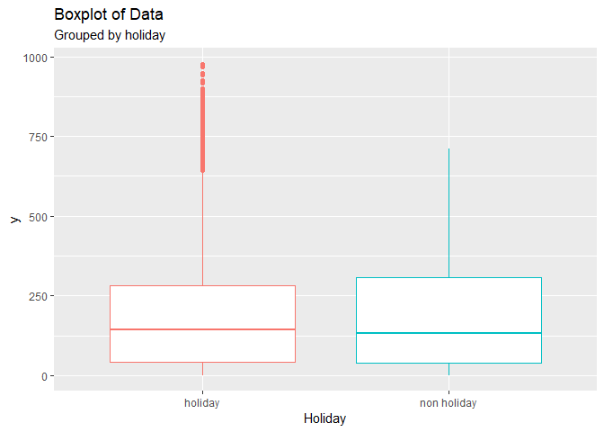
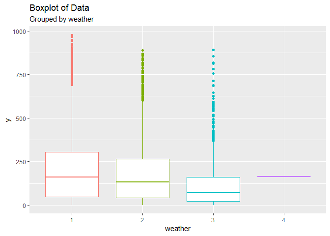
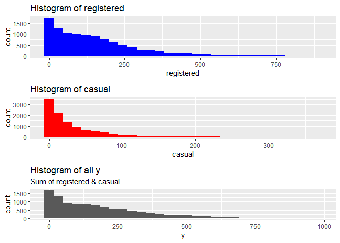

**자전거 대여 수요예측 분석**
=============================

본 문서는 Kaggle에 업로드된 '자전거 수요예측 분석'(Bike Sharing Demand)을 마크다운형식으로 편집하여,
Github에 업로드 하기 위하여 작성된 문서입니다.
데이터 출처 \*<https://www.kaggle.com/c/bike-sharing-demand>

------------------------------------------------------------------------

분석 과정 목차
--------------

[1. 변수 정의](#변수-정의)

[2. 분석 과정](#분석-과정)

[데이터 구조 확인](#데이터-구조-확인)

[사전 가설 수립(Make insight)](#가설-사전-수립)

[EDA](#Exproratory-Data-Analysis)

[Data preprocessing](#Data-Preprocessing)

[Modeling](#Modeling)

[3. 결론](#한계점)

------------------------------------------------------------------------

변수 정의
---------

1.  datetime - hourly date + timestamp

2.  season
    -   1 : spring
    -   2 : summer
    -   3 : fall
    -   4 : winter
3.  holiday - whether the day is considered a holiday (휴일)

4.  workingday - whether the day is neither a weekend nor holiday (주말도, 휴일도 아닌 날)

5.  weather
    -   1: Clear, Few clouds, Partly cloudy, Partly cloudy
    -   2: Mist + Cloudy, Mist + Broken clouds, Mist + Few clouds, Mist
    -   3: Light Snow, Light Rain + Thunderstorm + Scattered clouds, Light Rain + Scattered clouds
    -   4: Heavy Rain + Ice Pallets + Thunderstorm + Mist, Snow + Fog
6.  temp - temperature in Celsius(섭씨) -&gt; 실제온도.

7.  atemp - "feels like" temperature in Celsius (체감온도)

8.  humidity - relative humidity (습기)

9.  windspeed - wind speed (풍속)

**Train에만 있는 것. (종속변수)**

-   casual - number of non-registered user rentals initiated (비회원의 렌탈수)

-   registered - number of registered user rentals initiated (회원의 렌탈수)

-   count - number of total rentals (토탈렌트)

------------------------------------------------------------------------

분석 과정
---------

### 데이터 구조 확인

**Initialize**

``` r
rm(list=ls())
library(ggplot2)  #for plotting
library(corrplot) #for correlation plot
```

    ## corrplot 0.84 loaded

``` r
library(dplyr)    #for %in% function
```

    ## 
    ## Attaching package: 'dplyr'

    ## The following objects are masked from 'package:stats':
    ## 
    ##     filter, lag

    ## The following objects are masked from 'package:base':
    ## 
    ##     intersect, setdiff, setequal, union

``` r
library(caret)    #for cross validation
```

    ## Loading required package: lattice

``` r
library(pscl)     #for Zero-inflated poisson regression
```

    ## Classes and Methods for R developed in the
    ## Political Science Computational Laboratory
    ## Department of Political Science
    ## Stanford University
    ## Simon Jackman
    ## hurdle and zeroinfl functions by Achim Zeileis

``` r
library(gridExtra)
```

    ## Warning: package 'gridExtra' was built under R version 3.5.2

    ## 
    ## Attaching package: 'gridExtra'

    ## The following object is masked from 'package:dplyr':
    ## 
    ##     combine

``` r
library(rpart) # train : CART
library(party) #train : ctree
```

    ## Warning: package 'party' was built under R version 3.5.3

    ## Loading required package: grid

    ## Loading required package: mvtnorm

    ## Warning: package 'mvtnorm' was built under R version 3.5.2

    ## Loading required package: modeltools

    ## Warning: package 'modeltools' was built under R version 3.5.2

    ## Loading required package: stats4

    ## Loading required package: strucchange

    ## Warning: package 'strucchange' was built under R version 3.5.3

    ## Loading required package: zoo

    ## 
    ## Attaching package: 'zoo'

    ## The following objects are masked from 'package:base':
    ## 
    ##     as.Date, as.Date.numeric

    ## Loading required package: sandwich

    ## Warning: package 'sandwich' was built under R version 3.5.3

``` r
library(randomForest) # train : rf
```

    ## Warning: package 'randomForest' was built under R version 3.5.3

    ## randomForest 4.6-14

    ## Type rfNews() to see new features/changes/bug fixes.

    ## 
    ## Attaching package: 'randomForest'

    ## The following object is masked from 'package:gridExtra':
    ## 
    ##     combine

    ## The following object is masked from 'package:dplyr':
    ## 
    ##     combine

    ## The following object is masked from 'package:ggplot2':
    ## 
    ##     margin

``` r
library(e1071) #train : ranger(rf보다 빠른 속도)
```

    ## Warning: package 'e1071' was built under R version 3.5.2

``` r
library(ranger) #train : ranger(rf보다 빠른 속도)
```

    ## Warning: package 'ranger' was built under R version 3.5.3

    ## 
    ## Attaching package: 'ranger'

    ## The following object is masked from 'package:randomForest':
    ## 
    ##     importance

``` r
library(elasticnet) #train : ridge
```

    ## Warning: package 'elasticnet' was built under R version 3.5.2

    ## Loading required package: lars

    ## Warning: package 'lars' was built under R version 3.5.2

    ## Loaded lars 1.2

``` r
library(car) # for vif function(multicollinearity)
```

    ## Warning: package 'car' was built under R version 3.5.3

    ## Loading required package: carData

    ## Warning: package 'carData' was built under R version 3.5.2

    ## 
    ## Attaching package: 'car'

    ## The following object is masked from 'package:modeltools':
    ## 
    ##     Predict

    ## The following object is masked from 'package:dplyr':
    ## 
    ##     recode

``` r
setwd('C:\\github\\Project\\BikeSharing')
train <- read.csv('train.csv', stringsAsFactors = F)
test <- read.csv('test.csv', stringsAsFactors = F)
```

``` r
colSums(is.na(train))
```

    ##   datetime     season    holiday workingday    weather       temp 
    ##          0          0          0          0          0          0 
    ##      atemp   humidity  windspeed     casual registered      count 
    ##          0          0          0          0          0          0

``` r
colSums(is.na(test))
```

    ##   datetime     season    holiday workingday    weather       temp 
    ##          0          0          0          0          0          0 
    ##      atemp   humidity  windspeed 
    ##          0          0          0

``` r
str(c(train, test))
```

    ## List of 21
    ##  $ datetime  : chr [1:10886] "2011-01-01 0:00" "2011-01-01 1:00" "2011-01-01 2:00" "2011-01-01 3:00" ...
    ##  $ season    : int [1:10886] 1 1 1 1 1 1 1 1 1 1 ...
    ##  $ holiday   : int [1:10886] 0 0 0 0 0 0 0 0 0 0 ...
    ##  $ workingday: int [1:10886] 0 0 0 0 0 0 0 0 0 0 ...
    ##  $ weather   : int [1:10886] 1 1 1 1 1 2 1 1 1 1 ...
    ##  $ temp      : num [1:10886] 9.84 9.02 9.02 9.84 9.84 ...
    ##  $ atemp     : num [1:10886] 14.4 13.6 13.6 14.4 14.4 ...
    ##  $ humidity  : int [1:10886] 81 80 80 75 75 75 80 86 75 76 ...
    ##  $ windspeed : num [1:10886] 0 0 0 0 0 ...
    ##  $ casual    : int [1:10886] 3 8 5 3 0 0 2 1 1 8 ...
    ##  $ registered: int [1:10886] 13 32 27 10 1 1 0 2 7 6 ...
    ##  $ count     : int [1:10886] 16 40 32 13 1 1 2 3 8 14 ...
    ##  $ datetime  : chr [1:6493] "2011-01-20 0:00" "2011-01-20 1:00" "2011-01-20 2:00" "2011-01-20 3:00" ...
    ##  $ season    : int [1:6493] 1 1 1 1 1 1 1 1 1 1 ...
    ##  $ holiday   : int [1:6493] 0 0 0 0 0 0 0 0 0 0 ...
    ##  $ workingday: int [1:6493] 1 1 1 1 1 1 1 1 1 1 ...
    ##  $ weather   : int [1:6493] 1 1 1 1 1 1 1 1 1 2 ...
    ##  $ temp      : num [1:6493] 10.7 10.7 10.7 10.7 10.7 ...
    ##  $ atemp     : num [1:6493] 11.4 13.6 13.6 12.9 12.9 ...
    ##  $ humidity  : int [1:6493] 56 56 56 56 56 60 60 55 55 52 ...
    ##  $ windspeed : num [1:6493] 26 0 0 11 11 ...

------------------------------------------------------------------------

-&gt; NA값은 존재하지 않는다는 것을 확인할 수 있다.

### 가설 사전 수립

**Idea 1. train과 test 데이터의 차이점**

train data에 비하여 test데이터는 casual(비회원의 렌트 수)와 registered(회원의 렌트 수)가 존재하지 않는다.
결국 count는 전체의 렌트 수 이므로, 두개의 모델을 적합시켜서 각각에서의 비회원 / 회원의 렌트수를 예측 한 이후에 그걸 더하면 좀 더 정확하지 않을까?
아무래도 casual과 registered는 확실히 경향에 있어서 차이가 있을 것 같다.
casual일때 더 많이 빌릴까? registered일때 더 많이 빌릴까?
이 사람들의 특징에서는 어떠한 차이가 존재할까?

**Idea 2. 기본 가정 확인하기.**

우리가 원하는 종속변수는 특정한 사건(렌트)의 수를 뜻하는 정수이다.
그렇다면 glm을 통해서 poison분포로 적합시킬 수 있지는 않을까?

**Idea 3. 변수간의 관계에 대해서 생각해보기.**

날짜에 관련된 변수가 datetime, holiday, workingday 이렇게 3개나 존재한다. (어쩌면 weather 또한 관련 되어 있을지도)
Weather는 temp, atemp, humidity와 관계가 밀접하지 않을까?
변수간의 Correration 확인해볼수 있을것 같다.

------------------------------------------------------------------------

### Exproratory Data Analysis

**Preparing Total data**

``` r
test[,c('casual', 'registered', 'count')] <- NA
train <- rename(train, 'y' = 'count')
test <- rename(test, 'y' = 'count')
data <- rbind(train, test)
str(data)
```

    ## 'data.frame':    17379 obs. of  12 variables:
    ##  $ datetime  : chr  "2011-01-01 0:00" "2011-01-01 1:00" "2011-01-01 2:00" "2011-01-01 3:00" ...
    ##  $ season    : int  1 1 1 1 1 1 1 1 1 1 ...
    ##  $ holiday   : int  0 0 0 0 0 0 0 0 0 0 ...
    ##  $ workingday: int  0 0 0 0 0 0 0 0 0 0 ...
    ##  $ weather   : int  1 1 1 1 1 2 1 1 1 1 ...
    ##  $ temp      : num  9.84 9.02 9.02 9.84 9.84 ...
    ##  $ atemp     : num  14.4 13.6 13.6 14.4 14.4 ...
    ##  $ humidity  : int  81 80 80 75 75 75 80 86 75 76 ...
    ##  $ windspeed : num  0 0 0 0 0 ...
    ##  $ casual    : int  3 8 5 3 0 0 2 1 1 8 ...
    ##  $ registered: int  13 32 27 10 1 1 0 2 7 6 ...
    ##  $ y         : int  16 40 32 13 1 1 2 3 8 14 ...

``` r
colSums(is.na(data))
```

    ##   datetime     season    holiday workingday    weather       temp 
    ##          0          0          0          0          0          0 
    ##      atemp   humidity  windspeed     casual registered          y 
    ##          0          0          0       6493       6493       6493

**Categorical data Exploring**

**datetime**

``` r
nrow(data) == length(unique(data$datetime))
```

    ## [1] TRUE

-&gt; 문자열 데이터이며, 데이터의 분할이 필요함을 확인할 수 있다.

``` r
ggplot(data = data, aes(x = datetime, y = y)) +
  geom_point() +
  labs(title = 'Scatter plot of data',
       subtitle = 'With datetime(all Y)')
```

    ## Warning: Removed 6493 rows containing missing values (geom_point).


-&gt; 각 월의 20일~마지막일 까지는 test에 포함된 NA값이다.

따라서, 이 빈 구역들의 y값들을 예측하는 것이 목표이다.

**season**

팩터들의 이름을 부여한다.

``` r
str(data$season)
```

    ##  int [1:17379] 1 1 1 1 1 1 1 1 1 1 ...

``` r
data$season[which(data$season == 1)] <- 'spring'
data$season[which(data$season == 2)] <- 'summer'
data$season[which(data$season == 3)] <- 'fall'
data$season[which(data$season == 4)] <- 'winter'
data$season <- factor(data$season,
                         levels = c('spring', 'summer', 'fall', 'winter'))
levels(data$season)
```

    ## [1] "spring" "summer" "fall"   "winter"

계절에 따른 y값의 모양을 상자그림을 통하여 실시하려고 한다.
단 2가지 방법으로 표현해보도록 하자.(이후 표현은 ggplot으로 통일한다.)

**A. Box Plot으로 그리기**

``` r
boxplot(data$y ~ data$season)
```


**B. ggplot을 활용한 그림**

``` r
ggplot(data = data, aes(x = season, y = y, color = season)) +
  geom_boxplot() +
  labs(title = 'Boxplot of Data' ,
       subtitle = 'Grouped by Season' ,
       x = 'Season')
```

    ## Warning: Removed 6493 rows containing non-finite values (stat_boxplot).


-&gt; 계절에 따라 y(count)의 값이 크게 변동은 없는 것을 확인할 수 있다.

**holiday**

``` r
data$holiday[which(data$holiday == 0)] <- 'holiday'
data$holiday[which(data$holiday == 1)] <- 'non holiday'
data$holiday <- as.factor(data$holiday)
str(data$holiday)
```

    ##  Factor w/ 2 levels "holiday","non holiday": 1 1 1 1 1 1 1 1 1 1 ...

``` r
table(data$holiday)
```

    ## 
    ##     holiday non holiday 
    ##       16879         500

-&gt; Binary data 이며, Holiday와 Non holiday의 비율이 16879 : 500 인것을 확인할 수 있다.
\*\* 비율차이 시각화 \*\*

``` r
D1 <- as.data.frame(table(data$holiday))

ggplot(data = D1, aes(x = Var1, y = Freq, fill = Var1)) +
  geom_col() +
  labs(title = 'Bar plot of frequency',
       subtitle = 'in Holiday variable') #+
```


``` r
  #stat_identity()
```

``` r
ggplot(data = data, aes(x = holiday, y = y, color = holiday)) +
  geom_boxplot() +
  labs(title = 'Boxplot of Data' ,
       subtitle = 'Grouped by holiday',
       x = 'Holiday')# +
```

    ## Warning: Removed 6493 rows containing non-finite values (stat_boxplot).



``` r
    #scale_x_discrete(labels = levels(data$holiday))
```

-&gt; Holiday 유무에 따라 평균의 큰 차이는 없으나 큰 Y 값들이 Holiday에 상대적으로 많은 것을 확인할 수 있다.

**workingday**

``` r
data$workingday[which(data$workingday == 0)] <- 'non workingday'
data$workingday[which(data$workingday == 1)] <- 'workingday'
data$workingday <- as.factor(data$workingday)
table(data$workingday)
```

    ## 
    ## non workingday     workingday 
    ##           5514          11865

-&gt; 1 : 2의 비율로 분포하는 것을 확인할 수 있다.

\*\* 비율차이 시각화 \*\*

``` r
D1 <- as.data.frame(table(data$workingday))

ggplot(data = D1, aes(x = Var1, y = Freq, fill = Var1)) +
  geom_col() +
  labs(title = 'Bar plot of frequency',
       subtitle = 'in Workingday variable')
```


``` r
  #stat_identity()
```

차이점 확인하기.

``` r
ggplot(data = data) +
  geom_boxplot(aes(x = workingday, y = y, color = workingday)) +
  labs(title = 'Boxplot of Data' ,
       subtitle = 'Grouped by workingday',
       x = 'workingday') #+
```

    ## Warning: Removed 6493 rows containing non-finite values (stat_boxplot).


``` r
    #scale_x_discrete(labels = levels(data$workingday))
```

-&gt; 평균의 차이가 크지 않은 것을 확인할 수 있다.

**weather**

범주별 데이터 수 확인

``` r
data$weather <- as.factor(data$weather)
table(data$weather)
```

    ## 
    ##     1     2     3     4 
    ## 11413  4544  1419     3

-&gt; 4(Heavy Rain)인 자료가 단 3개밖에 존재하지 않는다.

차이점 확인

``` r
ggplot(data = data) +
  geom_boxplot(aes(x = weather, y = y, color = weather)) +
  labs(title = 'Boxplot of Data' ,
       subtitle = 'Grouped by weather',
       x = 'weather') #+
```

    ## Warning: Removed 6493 rows containing non-finite values (stat_boxplot).



``` r
    #scale_x_discrete(labels = levels(data$weather))
```

-&gt; 범주 4의 치환이 필요함을 확인할 수 있고, 날씨에 따른 y의 변화를 확인할 수 있다.

**Numerical data Exploring**

temp, atemp, humidity, windspeed 모두 수치형 데이터이며, 이중 주목할 것은 temp(온도)와 atemp(체감온도) 일 것이다.
-&gt; 따라서 두 변수는 반드시 강한 상관관계를 가질 것으로 예상된다.

``` r
num_data <- data[, c('temp', 'atemp', 'humidity', 'windspeed')]
cor(num_data)
```

    ##                  temp       atemp    humidity   windspeed
    ## temp       1.00000000  0.98767214 -0.06988139 -0.02312526
    ## atemp      0.98767214  1.00000000 -0.05191770 -0.06233604
    ## humidity  -0.06988139 -0.05191770  1.00000000 -0.29010490
    ## windspeed -0.02312526 -0.06233604 -0.29010490  1.00000000

-&gt; 예상대로 temp와 atemp의 상관관계를 확인할 수 있었다.

**각 연속형 변수의 히스토그램과, 종속변수와의 상관계수 확인**

test data에는 y값이 존재하지 않으므로, train data에서 numeric data를 추출하여 correlation을 계산한다.

``` r
num_train <- train[, c('temp', 'atemp', 'humidity', 'windspeed', 'y' ,'casual', 'registered')]
cor(num_train)
```

    ##                   temp       atemp    humidity   windspeed          y
    ## temp        1.00000000  0.98494811 -0.06494877 -0.01785201  0.3944536
    ## atemp       0.98494811  1.00000000 -0.04353571 -0.05747300  0.3897844
    ## humidity   -0.06494877 -0.04353571  1.00000000 -0.31860699 -0.3173715
    ## windspeed  -0.01785201 -0.05747300 -0.31860699  1.00000000  0.1013695
    ## y           0.39445364  0.38978444 -0.31737148  0.10136947  1.0000000
    ## casual      0.46709706  0.46206654 -0.34818690  0.09227619  0.6904136
    ## registered  0.31857128  0.31463539 -0.26545787  0.09105166  0.9709481
    ##                 casual  registered
    ## temp        0.46709706  0.31857128
    ## atemp       0.46206654  0.31463539
    ## humidity   -0.34818690 -0.26545787
    ## windspeed   0.09227619  0.09105166
    ## y           0.69041357  0.97094811
    ## casual      1.00000000  0.49724969
    ## registered  0.49724969  1.00000000

-&gt; 각각의 상관계수를 확인할 수 있다.

**Pair plot 그리기**

시각화를 통해서 상관관계를 다시 확인한다.

``` r
corrplot(cor(num_train), method = 'circle', diag = FALSE)
```


-&gt; 상관관계들을 확인할 수 있다.

**각 연속형 변수들의 히스토그램**

``` r
temp_hist <- ggplot(data = num_data, aes(num_data$temp))+ geom_histogram() + labs(x = 'temp')
atemp_hist <- ggplot(data = num_data, aes(num_data$atemp))+ geom_histogram() + labs(x = 'atemp')
humidity_hist <- ggplot(data = num_data, aes(num_data$humidity))+ geom_histogram() + labs(x = 'humidity')
windspeed_hist <- ggplot(data = num_data, aes(num_data$windspeed))+ geom_histogram() + labs(x = 'windspeed')

grid.arrange(temp_hist, atemp_hist, humidity_hist, windspeed_hist, ncol=2, nrow = 2)
```

    ## `stat_bin()` using `bins = 30`. Pick better value with `binwidth`.
    ## `stat_bin()` using `bins = 30`. Pick better value with `binwidth`.
    ## `stat_bin()` using `bins = 30`. Pick better value with `binwidth`.
    ## `stat_bin()` using `bins = 30`. Pick better value with `binwidth`.


-&gt; 알 수 있는 사실
- humidity에서 100으로 관측된 값들을 세부적으로 봐야 한다. : 비오는 날의 습도는 100!
- windspeed에서 0으로 관측된 값들(NA로 추청)이 보인다.

**Checking Y**

``` r
ggplot(data = train, aes(train$y))+
     geom_histogram()
```

    ## `stat_bin()` using `bins = 30`. Pick better value with `binwidth`.


-&gt; 왼쪽으로 치우친 것을 확인할 수 있으며, 변수변환의 필요성을 확인할 수 있다.

-&gt; 또한 변수의 성질(0 이상의 정수)에 따라서 Possion regression의 적합을 생각할 수 있다.

**Checking additional Y (Casual & Registered)**

본 데이터에는, casual(회원의 count) + registered(비회원의 count) = y(총 카운트 합) 으로 총 3가지의 종속변수가 존재한다고 볼 수 있다.
분포의 차이를 확인하고 각각 다른 모형에 적합시키는 방법을 고려해 볼 수 있다.

**기술통계량 비교**

``` r
summary(data$registered)
```

    ##    Min. 1st Qu.  Median    Mean 3rd Qu.    Max.    NA's 
    ##     0.0    36.0   118.0   155.6   222.0   886.0    6493

``` r
sd(data$registered, na.rm = TRUE)
```

    ## [1] 151.039

``` r
summary(data$casual)
```

    ##    Min. 1st Qu.  Median    Mean 3rd Qu.    Max.    NA's 
    ##    0.00    4.00   17.00   36.02   49.00  367.00    6493

``` r
sd(data$casual, na.rm = TRUE)
```

    ## [1] 49.96048

**Box plot을 통한 비교**

``` r
ggplot(data = data) +
  geom_boxplot(aes(y = registered, fill = 'blue', alpha = 0.5)) +
  geom_boxplot(aes(y = casual, fill = 'red', alpha = 0.5)) +
  labs(title = 'Box plot of registered')
```

    ## Warning: Removed 6493 rows containing non-finite values (stat_boxplot).

    ## Warning: Removed 6493 rows containing non-finite values (stat_boxplot).


``` r
A <- ggplot(data = data, aes(y = registered)) +
    geom_boxplot(fill = 'blue') +
    labs(title = 'Box plot of registered')
B <- ggplot(data = data, aes(y = casual)) +
    geom_boxplot(fill = 'red') +
    labs(title = 'Box plot of casual')
grid.arrange(A, B, ncol = 2)
```

    ## Warning: Removed 6493 rows containing non-finite values (stat_boxplot).

    ## Warning: Removed 6493 rows containing non-finite values (stat_boxplot).


**Histogram을 통한 비교**

``` r
A <- ggplot(data = data, aes(x = registered)) +
    geom_histogram(fill = 'blue') +
    labs(title = 'Histogram of registered')
B <- ggplot(data = data, aes(x = casual)) +
    geom_histogram(fill = 'red') +
    labs(title = 'Histogram of casual')
C <- ggplot(data = data, aes(x = y))+
    geom_histogram() +
    labs(title = 'Histogram of all y',
         subtitle = 'Sum of registered & casual')

grid.arrange(A, B, C, nrow = 3)
```

    ## `stat_bin()` using `bins = 30`. Pick better value with `binwidth`.

    ## Warning: Removed 6493 rows containing non-finite values (stat_bin).

    ## `stat_bin()` using `bins = 30`. Pick better value with `binwidth`.

    ## Warning: Removed 6493 rows containing non-finite values (stat_bin).

    ## `stat_bin()` using `bins = 30`. Pick better value with `binwidth`.

    ## Warning: Removed 6493 rows containing non-finite values (stat_bin).



-&gt; 두 종속변수의 구성요소가 명확히 다른 분포를 갖는 것을 확인할 수 있으며, 나누어 예측하는 것이 적절하다.

``` r
#workingday로 구분하여 확인하는 casual과 registered의 분포 차이
A <- ggplot(data = train, aes(x = datetime, y = casual, color = factor(workingday))) +
    geom_point() +
    labs(title = 'Scatter plot of data',
        subtitle = 'with datetime(casual)')
B <- ggplot(data = train, aes(x = datetime, y = registered, color = factor(workingday))) +
    geom_point() +
    labs(title = 'Scatter plot of data',
        subtitle = 'with datetime(registered)')
grid.arrange(A, B, nrow = 2)
```


#### EDA 정리

| 변수명     | 특징                                                                        | 전처리 방법                            |
|------------|-----------------------------------------------------------------------------|----------------------------------------|
| Datetime   | 각 월의 20일 이후의 정보를 예측해야하며, 시계열성을 확인했다.               | Lag변수를 만든다.                      |
| Season     | 종속변수와의 큰 연관성을 찾을 수 없었다.                                    | X                                      |
| Holiday    | 두 범주값의 비율이 매우 비대칭이며, 종속변수와의 큰 연관성은 보이지 않는다. | X                                      |
| Workingday | 종속변수와의 큰 연관성을 찾을 수 없었다.                                    | X                                      |
| Weather    | 범주 4의 수가 3개로, 매우 적은 관측치를 보였다.                             | 유사한 다른 값으로 치환한다.           |
| Temp       | Atemp변수와의 높은 상관관계를 보인다.                                       | 삭제 여부 검토                         |
| Atemp      | Temp변수와의 높은 상관관계를 보인다.                                        | 삭제 여부 검토                         |
| Humidity   | 높은 수치를 기록한 값에서 공백이 보인다.                                    | 100의 값은 비오는 날을 의미한다.       |
| Windspeed  | 0과 다른 수치 사이에 공백이 보인다.                                         | 0이 결측값을 의미하는지 검토           |
| 종속변수   | y = casual + registered, 각기 다른 분포를 보인다.                           | 분할하여 예측했을 때, 유의한 변수 확인 |

------------------------------------------------------------------------

### Data Preprocessing

**datetime**

-   연월일 / 시간 -&gt; 월별로 계절을 나누는게 어느정도 정확하지 않을까?
-   시간대별로 다른 대여수? 버리고 싶지만, 시간대별로 온도가 너무 다르다.

-&gt; 시간대 별로 morning, afternoon, night, dawn 으로 나눠서 파생변수를 만들고 date time을 지우면 어떨까?
너무 많은 정보의 삭제가 우려된다. 각 시간을 범주형으로 살리고, lag 변수를 만들어서 파생변수로 사용해보자.

**시간 분할해서 plot그려보기.**

``` r
#sp <- unlist(strsplit(data$datetime, " "))
#시간 추출
#time <- sp[seq(from = 1, to = length(sp), by = 2)]
#table(time)
```

시간 분할

``` r
sp <- unlist(strsplit(data$datetime, ":"))
#시간 추출
time <- substr(sp[seq(from = 1, to = length(sp), by = 2)], 12, 13)
#일시 추출
day <- substr(sp[seq(from = 1, to = length(sp), by = 2)], 1, 10)
day <- as.integer(gsub("-", "" , day, perl=TRUE))

data$time <- as.integer(time)
data$day <- as.numeric(factor(rank(day))) #일시를 단순한 순서로 변경

head(table(data$day), 20)
```

    ## 
    ##  1  2  3  4  5  6  7  8  9 10 11 12 13 14 15 16 17 18 19 20 
    ## 24 23 22 23 23 23 23 24 24 24 22 22 24 23 24 24 24 12 23 24

``` r
ggplot(data = data, aes(x = day, y = y)) +
  geom_point() +
  labs(title = 'Scatter plot of data',
       subtitle = 'with time')
```

    ## Warning: Removed 6493 rows containing missing values (geom_point).


-&gt; 일정한 추세를 보이는 것을 확인할 수 있었다.

``` r
same_time_idx <- which(data$time == 6)
same_time_data <- data[same_time_idx, ]

A1 <- ggplot(data = same_time_data, aes(x = datetime, y = registered, color = workingday)) +
  geom_point() +
  labs(title = 'Count of registered(Grouped by workingday)',
       subtitle = 'with sametime(ex.6AM)')

A2 <- ggplot(data = same_time_data, aes(x = datetime, y = casual, color = workingday)) +
  geom_point() +
  labs(title = 'Count of casual(Grouped by workingday)',
       subtitle = 'with sametime(ex.6AM)')

B1 <- ggplot(data = same_time_data, aes(x = datetime, y = registered, color = holiday)) +
  geom_point() +
  labs(title = 'Count of registered(Grouped by holiday)',
       subtitle = 'with sametime(ex.6AM)')

B2 <- ggplot(data = same_time_data, aes(x = datetime, y = casual, color = holiday)) +
  geom_point() +
  labs(title = 'Count of casual(Grouped by holiday)',
       subtitle = 'with sametime(ex.6AM)')

grid.arrange(A1, B1, A2, B2, nrow = 2, ncol = 2)
```

    ## Warning: Removed 270 rows containing missing values (geom_point).

    ## Warning: Removed 270 rows containing missing values (geom_point).

    ## Warning: Removed 270 rows containing missing values (geom_point).

    ## Warning: Removed 270 rows containing missing values (geom_point).


-&gt; Workingday + registered 의 조합이 가장 두드러지게 분리된다.

**연도, 월에 따른 비교**

``` r
data$year <- substr(data$datetime, 1, 4)
data$year <- as.factor(data$year)
data$month <- substr(data$datetime, 6, 7)
data$month <- as.factor(data$month)
```

**연도에 따른 차이**

``` r
A <- ggplot(data = data, aes(x = year, y = registered, color = year)) +
  geom_boxplot() +
  labs(title = 'Boxplot of registered in year')
B <- ggplot(data = data, aes(x = year, y = casual, color = year)) +
  geom_boxplot() +
  labs(title = 'Boxplot of casual in year')

grid.arrange(A, B, ncol=2)
```

    ## Warning: Removed 6493 rows containing non-finite values (stat_boxplot).

    ## Warning: Removed 6493 rows containing non-finite values (stat_boxplot).


-&gt; 차이의 여부 확인

**월에 따른 차이**

``` r
A <- ggplot(data = data, aes(x = month, y = registered, color = month)) +
  geom_boxplot() +
  labs(title = 'Boxplot of registered in month')
B <- ggplot(data = data, aes(x = month, y = casual, color = month)) +
  geom_boxplot() +
  labs(title = 'Boxplot of casual in month')

grid.arrange(A, B, nrow=2)
```

    ## Warning: Removed 6493 rows containing non-finite values (stat_boxplot).

    ## Warning: Removed 6493 rows containing non-finite values (stat_boxplot).


-&gt; 일정한 추세 확인

datetime변수 삭제

``` r
data <- subset(data, select = -c(datetime))
```

-&gt; datetime에서 일자를 사용하지 않는이유 : test와 train의 일자가 모두 다르기 때문.

**Lagvariable in day**
Lag변수에서 사용할 수 있는 변수를 선택한다.

``` r
#ggplot(data = data, aes(x = day, y = temp)) +
#  geom_point()
```

-&gt; 문제점 발견! 1차 모델링 이후에 해결법 확인하기

**season**

EDA과정에서 약간의 영향력을 확인했기 때문에, 따로 처리하지 않도록 한다.

**Holiday**

위에서 확인한 boxplot을 확인해 보았을 때, 변수의 비율도 치우쳐있고 count에 큰 영향을 주는 것 같지 않다. -&gt; 지워버리자. workingday 데이터만 사용

``` r
data <- subset(data, select = -c(holiday))
```

**workingday**

workingday 변수 역시 큰 영향을 끼치지 않아 보이지만, holiday 변수의 삭제로 인해 이 변수는 남겨놓고 분석을 시도해보기로 한다.

**weather**

4번 범주(악천후)에 속하는 데이터가 3개밖에 존재하지 않는 것을 확인했으므로, 이를 다른 범주로 치환해야 한다.

``` r
list(Index = which(data$weather == 4),
     Previous_day = data[which(data$weather == 4)-1,'weather'],
     Level4_day = data[which(data$weather == 4),'weather'],
     Next_day = data[which(data$weather == 4)+1,'weather'])
```

    ## $Index
    ## [1]  5632 11041 14135
    ## 
    ## $Previous_day
    ## [1] 3 3 3
    ## Levels: 1 2 3 4
    ## 
    ## $Level4_day
    ## [1] 4 4 4
    ## Levels: 1 2 3 4
    ## 
    ## $Next_day
    ## [1] 3 3 3
    ## Levels: 1 2 3 4

-&gt; 3개의 데이터 모두 전후일에 날씨변수가 3이었다. 이에 따라서 모든 범주 4를 범주 3으로 치환한다.

``` r
data[which(data$weather == 4), 'weather'] = '3'
data$weather <- factor(data$weather) #범주4 제거
```

**Numeric data**

Numeric data는 따로 처리하지 않도록 한다.

-&gt; 파생변수를 만들어서 한번에 처리할 수 있다면?

**불쾌지수 변수 만들기**

Discomfort = temp & humidity

``` r
discomfort <- with(data, (9/5)*temp-
                     0.55*(1-(humidity/100))*((9/5)*temp-26)+32)
data$discomfort <- discomfort
```

**상관계수 확인하기(불쾌지수 추가)**

``` r
num_data_2 <- data[which(!is.na(data$y)), c('temp', 'atemp', 'humidity', 'windspeed','discomfort', 'y')]
cor(num_data_2)
```

    ##                   temp       atemp    humidity   windspeed  discomfort
    ## temp        1.00000000  0.98494811 -0.06494877 -0.01785201  0.98683890
    ## atemp       0.98494811  1.00000000 -0.04353571 -0.05747300  0.97367141
    ## humidity   -0.06494877 -0.04353571  1.00000000 -0.31860699  0.03457894
    ## windspeed  -0.01785201 -0.05747300 -0.31860699  1.00000000 -0.03726081
    ## discomfort  0.98683890  0.97367141  0.03457894 -0.03726081  1.00000000
    ## y           0.39445364  0.38978444 -0.31737148  0.10136947  0.34551225
    ##                     y
    ## temp        0.3944536
    ## atemp       0.3897844
    ## humidity   -0.3173715
    ## windspeed   0.1013695
    ## discomfort  0.3455122
    ## y           1.0000000

``` r
# data <- subset(data, select = -c(temp, humidity))
```

-&gt; temp와 atemp, humidity, discomfort와의 correlation을 확인하고, 변수 처리방안을 고민한다.
-&gt; 모형 적합 후에 삭제여부 검토

**windspeed**

Histogram

``` r
ggplot(data = data, aes(data$windspeed))+
     geom_histogram()
```

    ## `stat_bin()` using `bins = 30`. Pick better value with `binwidth`.


-&gt; 0값이 상당히 많이 관측된 것을 확인할 수 있다. 이는 실제 값이 아닌 NA값일 확률이 높으므로(구간이 비어져있음),
이를 대체할 방법을 찾는다.

분포확인

``` r
length(table(data$windspeed))
```

    ## [1] 30

총 30개의 값으로 분포, 연속형이 아닌 범주로 봐도 될까?
-&gt; 범주의 값에 따라서 편차가 크다.

``` r
barplot(table(data[which(data$windspeed != 0), "windspeed"]))
```


2180개의 결측값, 풍속에 영향을 줄 만한 변수는? : season, weather, temp, atemp, humidity, time, day, month, discomfort

``` r
# train_wind / test_wind / val_wind 데이터 분할
train_wind <- data[which(data$windspeed != 0), ]
test_wind <- data[which(data$windspeed == 0), ]
set.seed(1)
val_idx <- createDataPartition(train_wind$windspeed, p = 0.3, list = FALSE)
val_wind <- train_wind[val_idx, ]
tr_wind <- train_wind[-val_idx, ]
```

모형 적합전, train에 들어갈 formula(날씨변수)와 trainControl인자 설정

``` r
f_1 <- formula(windspeed ~ season + weather + temp + atemp + humidity + time + day + month + discomfort)
#파라메터 설정시에 진행할 CV방법 : 3repeated 5-fold cross validation
tc_1 <- trainControl(method = 'repeatedcv', 
                     number = 5,
                     repeats = 3)
```

**method1 . ctree2 사용. **

``` r
wind_model_tree <- train(f_1, method = 'ctree2',  trControl = tc_1, data = tr_wind) #ctree2는 maxdepth도 조절
plot(wind_model_tree$finalModel)
```


``` r
wind_pre <- predict(wind_model_tree, newdata = val_wind)
mean((wind_pre-val_wind$windspeed)^2)
```

    ## [1] 44.19632

**method2 . randomForest 사용. **

``` r
#학습시간 쒯~~~~ 해결방법은?
wind_model_rf <- train(f_1, method = 'ranger', 
                       importance = 'impurity', #impurity : 불순도를 통한 variableimportance
                       data = tr_wind) # rf(randomForest보다 빠르대!) trControl = tc_1,
wind_pre <- predict(wind_model_rf, newdata = val_wind)
mean((wind_pre-val_wind$windspeed)^2)
```

    ## [1] 23.60205

**Variable Importance plot in predicting windspeed**

``` r
imp_var <- data.frame(importance(wind_model_rf$finalModel))
Variable <- row.names(imp_var)
Importance <- imp_var[, 1]

imp_var <- data.frame('Variable' = Variable, 'Importance' = Importance)
imp_var <- imp_var[order(imp_var$Importance, decreasing = TRUE), ] #내림차순 정렬

imp_var_5 <- imp_var[c(1:5), ]
imp_var_7 <- imp_var[c(1:7), ]

imp_plot_5 <- ggplot(data = imp_var_5, aes(x = reorder(Variable, -Importance), y = Importance)) +
  geom_col() +
  labs(title = 'Variable Imp plot with 5 variable',
       x = 'Variable')

imp_plot_7 <- ggplot(data = imp_var_7, aes(x = reorder(Variable, -Importance), y = Importance)) +
  geom_col() +
  labs(title = 'Variable Imp plot with 7 variable',
       x = 'Variable')

imp_plot_all <- ggplot(data = imp_var, aes(x = reorder(Variable, -Importance), y = Importance)) +
  geom_col() +
  labs(title = 'Variable Imp plot with all variable',
       x = 'Variable')

grid.arrange(imp_plot_5, imp_plot_7, imp_plot_all, nrow = 3)
```


**method3 . 중앙값(Median)으로 대치 **

``` r
wind_pre_median <- median(tr_wind$windspeed)
mean((wind_pre_median - val_wind$windspeed)^2)
```

    ## [1] 53.59861

**method4 . 평균(Mean)으로 대치 **

``` r
wind_pre_mean <- mean(tr_wind$windspeed)
mean((wind_pre_mean - val_wind$windspeed)^2)
```

    ## [1] 51.15766

-&gt; RandomForest로 결측값을 대체하자.

**결측값(windspeed) 대체**

``` r
#포뮬러 설정 : 날씨변수
f_wind <- formula(windspeed ~ season + weather + temp + atemp + humidity + time + day + month + discomfort)

#파라메터 설정시에 진행할 CV방법 : 3repeated 5-fold cross validation
tc_wind <- trainControl(method = 'repeatedcv', 
                        number = 5,
                        repeats = 3)

wind_model_rf_final <- train(f_wind, method = 'ranger', 
                             importance = 'impurity',
                             trControl = tc_wind,
                             data = train_wind) # train_wind_a : 0이 아닌 값을 갖는 모든 데이터
wind_pre <- predict(wind_model_rf_final, newdata = test_wind)
test_wind$windspeed <- round(wind_pre, digits = 4) #4자리수까지 반올림 후, 대체
```

``` r
data_baseline <- rbind(test_wind, train_wind)
```

**Lag변수**

``` r
#make new train / test data
data_baseline <- data_baseline[order(data_baseline$day, data_baseline$time), ] #order df with day & time
train_baseline <- data_baseline[!is.na(data_baseline$y), ]
test_baseline <- data_baseline[is.na(data_baseline$y), ]
#How can I make a lag Variable?
length(table(train_baseline$day)) * 24 - nrow(train_baseline) #58개의 NA를 갖는 time
```

    ## [1] 58

``` r
length(table(test_baseline$day)) * 24 - nrow(test_baseline) # 107개의 NA를 갖는 time
```

    ## [1] 107

``` r
#lag 변수를 만든뒤, merge를 진행하면? 165개의 추가 NA값이 생긴다. 
# -> lag변수에서 사용할 변수를 신중하게 선택해야 한다.
```

``` r
ggplot(data = data_baseline, aes(x = (data_baseline$day + data_baseline$time/24), y = temp)) +
  geom_point(size = 0.3)
```


``` r
data_baseline
```

    ##       season     workingday weather  temp  atemp humidity windspeed casual
    ## 1     spring non workingday       1  9.84 14.395       81    9.2167      3
    ## 2     spring non workingday       1  9.02 13.635       80    8.2053      8
    ## 3     spring non workingday       1  9.02 13.635       80    7.6318      5
    ## 4     spring non workingday       1  9.84 14.395       75    7.3617      3
    ## 5     spring non workingday       1  9.84 14.395       75    7.2418      0
    ## 6     spring non workingday       2  9.84 12.880       75    6.0032      0
    ## 7     spring non workingday       1  9.02 13.635       80    7.3242      2
    ## 8     spring non workingday       1  8.20 12.880       86    7.2303      1
    ## 9     spring non workingday       1  9.84 14.395       75    8.1408      1
    ## 10    spring non workingday       1 13.12 17.425       76   11.8214      8
    ## 11    spring non workingday       1 15.58 19.695       76   16.9979     12
    ## 12    spring non workingday       1 14.76 16.665       81   19.0012     26
    ## 13    spring non workingday       1 17.22 21.210       77   19.0012     29
    ## 14    spring non workingday       2 18.86 22.725       72   19.9995     47
    ## 15    spring non workingday       2 18.86 22.725       72   19.0012     35
    ## 16    spring non workingday       2 18.04 21.970       77   19.9995     40
    ## 17    spring non workingday       2 17.22 21.210       82   19.9995     41
    ## 18    spring non workingday       2 18.04 21.970       82   19.0012     15
    ## 19    spring non workingday       3 17.22 21.210       88   16.9979      9
    ## 20    spring non workingday       3 17.22 21.210       88   16.9979      6
    ## 21    spring non workingday       2 16.40 20.455       87   16.9979     11
    ## 22    spring non workingday       2 16.40 20.455       87   12.9980      3
    ## 23    spring non workingday       2 16.40 20.455       94   15.0013     11
    ## 24    spring non workingday       2 18.86 22.725       88   19.9995     15
    ## 25    spring non workingday       2 18.86 22.725       88   19.9995      4
    ## 26    spring non workingday       2 18.04 21.970       94   16.9979      1
    ## 27    spring non workingday       2 17.22 21.210      100   19.0012      1
    ## 28    spring non workingday       2 18.86 22.725       94   12.9980      2
    ## 29    spring non workingday       2 18.86 22.725       94   12.9980      2
    ## 30    spring non workingday       3 17.22 21.210       77   19.9995      0
    ## 31    spring non workingday       2 16.40 20.455       76   12.9980      0
    ## 32    spring non workingday       3 16.40 20.455       71   15.0013      0
    ## 33    spring non workingday       2 15.58 19.695       76   15.0013      1
    ## 34    spring non workingday       2 14.76 17.425       81   15.0013      7
    ## 35    spring non workingday       2 14.76 16.665       71   16.9979     16
    ## 36    spring non workingday       2 14.76 16.665       66   19.9995     20
    ## 37    spring non workingday       2 14.76 17.425       66    8.9981     11
    ## 38    spring non workingday       3 14.76 17.425       76   12.9980      4
    ## 39    spring non workingday       3 13.94 16.665       81   11.0014     19
    ## 40    spring non workingday       3 13.94 16.665       71   11.0014      9
    ## 41    spring non workingday       1 13.94 16.665       57   12.9980      7
    ## 42    spring non workingday       2 14.76 16.665       46   22.0028     10
    ## 43    spring non workingday       1 13.12 14.395       42   30.0026      1
    ## 44    spring non workingday       1 12.30 13.635       39   23.9994      5
    ## 45    spring non workingday       1 10.66 11.365       44   22.0028     11
    ## 46    spring non workingday       1  9.84 10.605       44   19.9995      0
    ## 47    spring non workingday       1  9.02 11.365       47   11.0014      0
    ## 48    spring     workingday       1  9.02  9.850       44   23.9994      0
    ## 49    spring     workingday       1  8.20  8.335       44   27.9993      0
    ## 50    spring     workingday       1  6.56  6.820       47   26.0027      0
    ## 51    spring     workingday       1  6.56  6.820       47   19.0012      0
    ## 52    spring     workingday       1  5.74  5.305       50   26.0027      0
    ## 53    spring     workingday       1  5.74  6.820       50   12.9980      1
    ## 54    spring     workingday       1  5.74  6.060       50   19.0012      1
    ## 55    spring     workingday       1  6.56  6.820       43   26.0027      7
    ## 56    spring     workingday       1  7.38  8.335       43   16.9979     11
    ## 57    spring     workingday       1  8.20  9.090       40   22.0028     10
    ## 58    spring     workingday       1  9.02 10.605       35   19.9995     13
    ## 59    spring     workingday       1  9.84 10.605       35   19.0012      8
    ## 60    spring     workingday       1 10.66 12.120       30   19.0012     11
    ## 61    spring     workingday       1 10.66 12.120       30   16.9979     14
    ## 62    spring     workingday       1 10.66 12.120       30   16.9979      9
    ## 63    spring     workingday       1  9.84 11.365       30   15.0013     11
    ## 64    spring     workingday       1  9.84 12.880       32    7.0015      9
    ## 65    spring     workingday       1  8.20 12.880       47    6.7837      8
    ## 66    spring     workingday       1  8.20 11.365       47    7.0015      3
    ## 67    spring     workingday       1  7.38  9.850       64    8.9981      3
    ## 68    spring     workingday       1  5.74  7.575       69    8.9981      0
    ## 69    spring     workingday       1  7.38 10.605       55    7.0015      1
    ## 70    spring     workingday       1  6.56  9.090       55    7.0015      0
    ## 71    spring     workingday       1  6.56  9.090       59    7.0015      0
    ## 72    spring     workingday       1  5.74  7.575       63    8.9981      0
    ## 73    spring     workingday       1  5.74  9.090       63    6.0032      0
    ## 74    spring     workingday       1  4.92  7.575       68    7.0015      0
    ## 75    spring     workingday       1  4.92  7.575       74    7.0015      0
    ## 76    spring     workingday       1  4.92  7.575       74    8.9981      2
    ## 77    spring     workingday       1  5.74  7.575       69   11.0014      2
    ## 78    spring     workingday       1  6.56  7.575       64   15.0013      2
    ## 79    spring     workingday       2  6.56  6.820       69   22.0028      5
    ## 80    spring     workingday       1  9.02 10.605       51   19.9995      7
    ## 81    spring     workingday       1  9.02 11.365       51   11.0014     12
    ## 82    spring     workingday       1  9.84 11.365       56   12.9980     18
    ## 83    spring     workingday       1 10.66 12.880       52   15.0013      9
    ## 84    spring     workingday       1 11.48 13.635       52   16.9979     17
    ## 85    spring     workingday       1 12.30 14.395       49   16.9979     15
    ## 86    spring     workingday       1 11.48 13.635       48   15.0013     10
    ## 87    spring     workingday       1 10.66 12.880       48   12.9980      3
    ## 88    spring     workingday       1  9.84 12.880       48    7.0015      2
    ## 89    spring     workingday       1  9.84 12.880       48    7.0015      1
    ## 90    spring     workingday       1  9.02 13.635       64    7.2933      0
    ## 91    spring     workingday       1  9.02 12.880       64    6.0032      1
    ## 92    spring     workingday       1  8.20 11.365       69    6.0032      2
    ## 93    spring     workingday       1  8.20 12.880       64    8.1071      0
    ## 94    spring     workingday       1  6.56  9.850       74    6.0032      0
    ## 95    spring     workingday       1  6.56  9.850       74    6.0032      0
    ## 96    spring     workingday       1  9.84 11.365       48   15.0013      0
    ## 97    spring     workingday       1  9.02 11.365       47   11.0014      0
    ## 98    spring     workingday       1  8.20  9.850       47   15.0013      0
    ## 99    spring     workingday       1  7.38  9.090       43   12.9980      1
    ## 100   spring     workingday       1  8.20  9.090       40   19.9995      3
    ## 101   spring     workingday       1  9.02  9.850       37   22.0028      6
    ## 102   spring     workingday       1  9.02  9.850       37   22.0028      4
    ## 103   spring     workingday       1 10.66 11.365       33   22.0028     12
    ## 104   spring     workingday       1 10.66 11.365       33   22.0028      5
    ## 105   spring     workingday       1 11.48 12.880       30   19.9995      6
    ## 106   spring     workingday       1 12.30 14.395       28   12.9980     10
    ## 107   spring     workingday       1 12.30 14.395       28   12.9980      7
    ## 108   spring     workingday       1 12.30 15.910       28    6.0032      4
    ## 109   spring     workingday       1  9.84 11.365       38   12.9980      4
    ## 110   spring     workingday       1  9.84 12.120       38    8.9981      3
    ## 111   spring     workingday       1  9.84 12.880       38    7.0015      5
    ## 112   spring     workingday       1  9.02 11.365       47   11.0014      7
    ## 113   spring     workingday       1  8.20  9.850       51   12.9980      3
    ## 114   spring     workingday       1  7.38  9.850       55    8.9981      1
    ## 115   spring     workingday       1  8.20 12.880       47    6.8952      1
    ## 116   spring     workingday       1  7.38 12.120       55    7.6435      0
    ## 117   spring     workingday       1  6.56 11.365       64    7.4308      0
    ## 118   spring     workingday       1  6.56 11.365       64    7.3713      0
    ## 119   spring     workingday       2  6.56  9.850       64    6.0032      0
    ## 120   spring     workingday       2  5.74  9.090       69    6.0032      0
    ## 121   spring     workingday       2  5.74  8.335       63    7.0015      0
    ## 122   spring     workingday       2  6.56 11.365       59    7.5223      0
    ## 123   spring     workingday       1  6.56 11.365       59    8.0076      3
    ## 124   spring     workingday       2  7.38 12.120       51    7.2007      6
    ## 125   spring     workingday       1  8.20 12.880       47    7.3001      3
    ## 126   spring     workingday       1  9.02 12.880       44    6.0032      2
    ## 127   spring     workingday       1 10.66 14.395       35    8.3113      6
    ## 128   spring     workingday       1 10.66 13.635       35    7.0015     12
    ## 129   spring     workingday       1 11.48 13.635       36   11.0014     11
    ## 130   spring     workingday       1 11.48 13.635       36   13.5789      8
    ## 131   spring     workingday       1 10.66 12.880       38   11.0014     12
    ## 132   spring     workingday       1  9.02 11.365       51   11.0014      9
    ## 133   spring     workingday       1  9.02 11.365       51    8.9981      5
    ## 134   spring     workingday       1  9.02 12.880       55    6.0032      3
    ## 135   spring     workingday       1  8.20 10.605       51   11.0014      3
    ## 136   spring     workingday       2  9.02 10.605       55   15.0013      0
    ## 137   spring     workingday       2  9.02 10.605       51   19.0012      1
    ## 138   spring     workingday       2  8.20  9.850       59   12.9980      4
    ## 139   spring     workingday       2  8.20  9.850       64   12.9980      4
    ## 140   spring     workingday       2  8.20  9.850       69   15.0013      2
    ## 141   spring     workingday       2  8.20  9.850       69   15.0013      0
    ## 142   spring     workingday       2  8.20 10.605       69    8.9981      0
    ## 143   spring     workingday       3  9.02 13.635       55   12.8904      0
    ## 144   spring     workingday       2  8.20 12.880       69    7.3226      8
    ## 145   spring     workingday       1  8.20 10.605       69    8.9981      8
    ## 146   spring     workingday       1  8.20  9.850       51   16.9979     20
    ## 147   spring     workingday       1  8.20  9.090       47   19.9995      9
    ## 148   spring     workingday       1  9.02  9.850       37   22.0028     16
    ## 149   spring     workingday       2  8.20  9.850       40   15.0013     19
    ## 150   spring     workingday       2  8.20  9.850       37   16.9979      9
    ## 151   spring     workingday       2  8.20  9.090       37   19.0012      9
    ## 152   spring     workingday       2  8.20  9.850       40   16.9979      7
    ## 153   spring     workingday       2  8.20 10.605       37   11.0014      9
    ## 154   spring     workingday       2  8.20 10.605       37   11.0014      5
    ## 155   spring     workingday       2  8.20 12.880       37    7.3144      9
    ## 156   spring     workingday       1  8.20 11.365       40    6.0032      7
    ## 157   spring     workingday       1  6.56  9.850       55    6.0032      3
    ## 158   spring     workingday       1  7.38 10.605       47    7.0015      1
    ## 159   spring     workingday       1  7.38  9.850       47    8.9981      0
    ## 160   spring     workingday       2  7.38  9.850       43   11.0014      2
    ## 161   spring     workingday       2  7.38  9.850       51   11.0014      1
    ## 162   spring non workingday       2  7.38  9.850       51   11.0014      1
    ## 163   spring non workingday       2  7.38 10.605       55    6.0032      1
    ## 164   spring non workingday       2  7.38 12.120       55    7.5126      3
    ## 165   spring non workingday       3  7.38  9.850       55   11.0014      0
    ## 166   spring non workingday       3  7.38  9.850       55   11.0014      0
    ## 167   spring non workingday       2  6.56  8.335       74   11.0014      0
    ## 168   spring non workingday       2  6.56  8.335       74   11.0014      0
    ## 169   spring non workingday       2  6.56  9.090       74    7.0015      1
    ## 170   spring non workingday       3  6.56  9.090       93    7.0015      0
    ## 171   spring non workingday       3  6.56  9.090       93    7.0015      0
    ## 172   spring non workingday       2  7.38  9.850       80   11.0014      5
    ## 173   spring non workingday       2  8.20  9.090       69   26.0027      2
    ## 174   spring non workingday       2  8.20  9.090       59   23.9994      8
    ## 175   spring non workingday       1  8.20  9.090       44   22.0028      7
    ## 176   spring non workingday       1  8.20  8.335       32   32.9975     12
    ## 177   spring non workingday       1  8.20  8.335       32   30.0026      5
    ## 178   spring non workingday       1  7.38  6.820       29   30.0026      8
    ## 179   spring non workingday       1  6.56  6.060       37   36.9974      5
    ## 180   spring non workingday       1  5.74  6.060       39   19.9995      3
    ## 181   spring non workingday       1  5.74  6.060       36   16.9979      4
    ## 182   spring non workingday       1  4.92  6.060       36   16.9979      0
    ## 183   spring non workingday       1  4.92  5.305       39   23.9994      2
    ## 184   spring non workingday       1  4.92  5.305       36   26.0027      1
    ## 185   spring non workingday       1  4.10  3.030       39   30.0026      0
    ## 186   spring non workingday       1  4.10  3.790       42   26.0027      1
    ## 187   spring non workingday       1  4.10  3.030       42   31.0009      0
    ## 188   spring non workingday       1  4.10  3.030       46   31.0009      0
    ## 189   spring non workingday       1  4.10  3.790       46   27.9993      0
    ## 190   spring non workingday       1  3.28  4.545       53   12.9980      0
    ## 191   spring non workingday       1  3.28  4.545       53   12.9980      0
    ## 192   spring non workingday       1  4.10  4.545       49   19.0012      0
    ## 193   spring non workingday       1  3.28  4.545       53   12.9980      1
    ## 194   spring non workingday       1  4.10  4.545       49   19.0012      0
    ## 195   spring non workingday       1  4.92  3.790       46   35.0008      0
    ## 196   spring non workingday       1  5.74  5.305       43   26.0027      0
    ## 197   spring non workingday       1  6.56  6.060       40   35.0008      2
    ## 198   spring non workingday       1  7.38  6.820       37   30.0026      4
    ## 199   spring non workingday       1  8.20  8.335       34   30.0026      6
    ## 200   spring non workingday       1  9.02  9.090       32   31.0009      8
    ## 201   spring non workingday       1  9.02  9.850       35   23.9994      5
    ## 202   spring non workingday       1  8.20  8.335       34   30.0026     13
    ## 203   spring non workingday       1  7.38  7.575       37   26.0027      3
    ## 204   spring non workingday       1  6.56  6.820       40   22.0028      4
    ## 205   spring non workingday       1  6.56  6.820       43   22.0028      1
    ## 206   spring non workingday       1  5.74  6.060       46   16.9979      0
    ## 207   spring non workingday       1  5.74  5.305       46   27.9993      1
    ## 208   spring non workingday       1  5.74  6.060       46   19.9995      5
    ## 209   spring non workingday       1  4.92  6.820       50   12.9980      0
    ## 210   spring     workingday       1  4.92  6.060       50   19.0012      2
    ## 211   spring     workingday       1  4.92  6.060       50   19.0012      1
    ## 212   spring     workingday       1  4.92  6.060       50   15.0013      0
    ## 213   spring     workingday       1  4.92  6.060       50   15.0013      0
    ## 214   spring     workingday       1  4.10  6.060       54    8.9981      1
    ## 215   spring     workingday       1  4.10  5.305       54   16.9979      0
    ## 216   spring     workingday       1  4.92  6.060       50   19.0012      0
    ## 217   spring     workingday       1  4.92  6.060       50   15.0013      2
    ## 218   spring     workingday       2  4.92  6.060       50   19.0012      4
    ## 219   spring     workingday       2  5.74  6.060       50   16.9979      2
    ## 220   spring     workingday       2  5.74  6.060       50   19.9995      0
    ## 221   spring     workingday       2  6.56  6.820       47   19.0012      2
    ## 222   spring     workingday       2  8.20  9.090       40   19.0012      5
    ## 223   spring     workingday       2  8.20  9.090       40   19.0012      4
    ## 224   spring     workingday       2  8.20  9.850       40   15.0013      0
    ## 225   spring     workingday       2  8.20  9.850       40   15.0013      2
    ## 226   spring     workingday       1  8.20 10.605       40    8.9981      4
    ## 227   spring     workingday       1  8.20 11.365       40    7.0015      4
    ## 228   spring     workingday       1  8.20  9.850       40   15.0013      1
    ## 229   spring     workingday       1  6.56  8.335       47   11.0014      3
    ## 230   spring     workingday       1  6.56  8.335       50   11.0014      1
    ## 231   spring     workingday       1  5.74  6.820       59   12.9980      1
    ## 232   spring     workingday       1  5.74  7.575       59   11.0014      2
    ## 233   spring     workingday       1  5.74  7.575       59   11.0014      0
    ## 234   spring     workingday       1  5.74  8.335       59    7.0015      2
    ## 235   spring     workingday       1  5.74  7.575       59   11.0014      0
    ## 236   spring     workingday       2  6.56  7.575       55   12.9980      0
    ## 237   spring     workingday       2  6.56  9.090       55    8.9981      0
    ## 238   spring     workingday       2  6.56  9.090       55    8.9981      0
    ## 239   spring     workingday       2  6.56 11.365       55    7.6492      2
    ## 240   spring     workingday       2  7.38 10.605       51    6.0032      3
    ## 241   spring     workingday       2  7.38  9.850       51   11.0014      3
    ## 242   spring     workingday       2  8.20 10.605       51   11.0014      3
    ## 243   spring     workingday       2  8.20 10.605       47    8.9981      4
    ## 244   spring     workingday       2  8.20 11.365       51    7.0015      2
    ## 245   spring     workingday       2  8.20 11.365       59    6.0032      6
    ## 246   spring     workingday       2  8.20 11.365       59    6.0032      3
    ## 247   spring     workingday       2  6.56  9.850       80    6.0032      2
    ## 248   spring     workingday       2  6.56  7.575       86   15.0013      4
    ## 249   spring     workingday       2  6.56  7.575       86   15.0013      6
    ## 250   spring     workingday       3  6.56  9.090       93    7.0015      1
    ## 251   spring     workingday       3  6.56 11.365       93    7.2391      0
    ## 252   spring     workingday       3  6.56  7.575       93   12.9980      0
    ## 253   spring     workingday       3  6.56  9.850       86    6.0032      0
    ## 254   spring     workingday       3  6.56  9.090       93    7.0015      1
    ## 255   spring     workingday       3  6.56  9.850       93    6.0032      1
    ## 256   spring     workingday       2  6.56  9.850       86    6.0032      0
    ## 257   spring     workingday       2  6.56  9.090       86    7.0015      0
    ## 258   spring     workingday       1  5.74  7.575       86    8.9981      0
    ## 259   spring     workingday       1  5.74  7.575       86   11.0014      0
    ## 260   spring     workingday       1  4.92  7.575       93    8.9981      0
    ## 261   spring     workingday       1  5.74  7.575       69    8.9981      0
    ## 262   spring     workingday       1  6.56  8.335       59   11.0014      3
    ## 263   spring     workingday       1  6.56  6.820       59   22.0028      3
    ## 264   spring     workingday       1  7.38  9.090       55   15.0013      0
    ## 265   spring     workingday       1  8.20  9.090       51   26.0027      3
    ## 266   spring     workingday       1  8.20  7.575       47   39.0007      3
    ## 267   spring     workingday       1  9.02  9.850       44   23.9994      0
    ## 268   spring     workingday       1  8.20  9.090       47   22.0028      0
    ## 269   spring     workingday       1  8.20  8.335       47   27.9993      1
    ## 270   spring     workingday       1  9.02  9.850       44   22.0028      5
    ## 271   spring     workingday       1  8.20  9.090       47   23.9994      0
    ## 272   spring     workingday       1  8.20  7.575       47   35.0008      2
    ## 273   spring     workingday       1  7.38  7.575       47   27.9993      1
    ## 274   spring     workingday       1  6.56  6.820       50   22.0028      2
    ## 275   spring     workingday       1  6.56  6.820       55   22.0028      0
    ## 276   spring     workingday       1  6.56  6.060       55   30.0026      1
    ## 277   spring     workingday       1  5.74  5.305       59   27.9993      1
    ## 278   spring     workingday       1  5.74  6.060       59   19.0012      1
    ## 279   spring     workingday       1  5.74  6.060       50   19.0012      0
    ## 280   spring     workingday       1  5.74  6.060       50   23.9994      0
    ## 281   spring     workingday       1  5.74  6.060       50   22.0028      0
    ## 282   spring     workingday       1  5.74  6.060       50   16.9979      0
    ## 283   spring     workingday       1  5.74  6.060       50   19.9995      0
    ## 284   spring     workingday       1  4.92  7.575       54    8.9981      0
    ## 285   spring     workingday       1  4.92  7.575       54    8.9981      0
    ## 286   spring     workingday       1  5.74  6.820       50   12.9980      5
    ## 287   spring     workingday       1  5.74  6.060       50   22.0028      2
    ## 288   spring     workingday       2  6.56  6.820       50   23.9994      2
    ## 289   spring     workingday       2  8.20  8.335       44   30.0026      4
    ## 290   spring     workingday       1  8.20  8.335       44   27.9993      3
    ## 291   spring     workingday       1  9.02  9.850       41   30.0026      2
    ## 292   spring     workingday       1  9.02  9.850       41   26.0027      3
    ## 293   spring     workingday       1  9.84 10.605       38   19.9995      5
    ## 294   spring     workingday       1  9.84 10.605       38   23.9994      2
    ## 295   spring     workingday       1  8.20  9.090       40   19.0012      4
    ## 296   spring     workingday       1  8.20  9.090       40   22.0028      3
    ## 297   spring     workingday       1  6.56  7.575       47   16.9979      1
    ## 298   spring     workingday       1  6.56  7.575       47   15.0013      0
    ## 299   spring     workingday       1  5.74  6.060       46   19.9995      0
    ## 300   spring     workingday       1  5.74  6.060       46   22.0028      0
    ## 301   spring     workingday       1  4.92  6.820       50   12.9980      1
    ## 302   spring     workingday       1  4.92  6.820       50   12.9980      0
    ## 303   spring     workingday       1  4.10  6.060       54   11.0014      0
    ## 304   spring     workingday       1  4.10  6.060       54    8.9981      0
    ## 305   spring     workingday       1  4.10  6.820       54    7.0015      0
    ## 306   spring     workingday       1  4.10  6.820       54    6.0032      0
    ## 307   spring     workingday       1  4.10  9.090       54    7.0962      0
    ## 308   spring     workingday       1  4.10  6.060       74   11.0014      0
    ## 309   spring     workingday       1  4.92  8.335       68    8.6286      2
    ## 310   spring     workingday       1  5.74  7.575       69    8.9981      0
    ## 311   spring     workingday       1  7.38  9.090       55   12.9980      4
    ## 312   spring     workingday       1  7.38  8.335       51   19.0012      6
    ## 313   spring     workingday       1  8.20  9.850       44   16.9979      2
    ## 314   spring     workingday       1  9.02  9.850       37   26.0027      4
    ## 315   spring     workingday       1  9.02 10.605       41   19.0012      5
    ## 316   spring     workingday       1  9.84 12.120       38   11.0014      9
    ## 317   spring     workingday       1  9.02 12.120       41    7.0015      3
    ## 318   spring     workingday       1  9.02 11.365       41   11.0014      4
    ## 319   spring     workingday       1  8.20 12.880       47    6.7570      5
    ## 320   spring     workingday       1  6.56  9.850       59    6.0032      3
    ## 321   spring     workingday       1  7.38 12.120       59    7.7151      0
    ## 322   spring     workingday       1  6.56 11.365       69    7.1105      4
    ## 323   spring     workingday       2  6.56 11.365       69    7.5857      2
    ## 324   spring     workingday       2  7.38 12.120       55    8.5322      1
    ## 325   spring non workingday       1  7.38 12.120       55    7.6946      3
    ## 326   spring non workingday       2  6.56  9.850       59    6.0032      2
    ## 327   spring non workingday       2  6.56  9.850       59    6.0032      0
    ## 328   spring non workingday       2  6.56 11.365       59    7.0668      1
    ## 329   spring non workingday       2  6.56 11.365       59    7.1412      0
    ## 330   spring non workingday       1  6.56 11.365       59    7.2300      0
    ## 331   spring non workingday       1  5.74  8.335       63    7.0015      1
    ## 332   spring non workingday       1  5.74 10.605       63    6.9734      1
    ## 333   spring non workingday       1  5.74  7.575       63    8.9981      1
    ## 334   spring non workingday       1  6.56  9.090       64    8.9981      2
    ## 335   spring non workingday       1  7.38  9.850       59   11.0014      2
    ## 336   spring non workingday       1  8.20  9.850       55   15.0013     18
    ## 337   spring non workingday       1  9.84 11.365       48   15.0013     15
    ## 338   spring non workingday       1 11.48 12.880       38   19.9995     21
    ## 339   spring non workingday       1 12.30 14.395       39   19.0012     26
    ## 340   spring non workingday       2 13.12 15.910       36   12.9980     21
    ## 341   spring non workingday       2 13.94 16.665       34   12.9980     33
    ## 342   spring non workingday       2 13.12 15.150       36   19.0012     29
    ## 343   spring non workingday       2 12.30 14.395       45   16.9979     15
    ## 344   spring non workingday       2 13.12 15.150       39   16.9979     14
    ## 345   spring non workingday       2 13.12 15.150       39   16.9979      6
    ## 346   spring non workingday       2 13.12 15.150       39   15.0013      6
    ## 347   spring non workingday       2 12.30 15.910       42    7.0015      0
    ## 348   spring non workingday       1 12.30 14.395       45   19.0012      5
    ## 349   spring non workingday       1 10.66 15.150       56    7.3520      6
    ## 350   spring non workingday       1 10.66 13.635       56    8.9981      4
    ## 351   spring non workingday       1 10.66 14.395       56    6.0032      3
    ## 352   spring non workingday       1  9.02 13.635       69    7.5598      9
    ## 353   spring non workingday       1 10.66 12.880       56   11.0014      0
    ## 354   spring non workingday       2 10.66 12.880       56   11.0014      1
    ## 355   spring non workingday       2 10.66 12.880       56   11.0014      0
    ## 356   spring non workingday       2  9.84 10.605       56   19.9995      0
    ## 357   spring non workingday       1  9.02 10.605       55   19.0012      0
    ## 358   spring non workingday       1  9.02 10.605       51   16.9979      3
    ## 359   spring non workingday       1  9.02 10.605       51   19.0012      8
    ## 360   spring non workingday       1  9.84 11.365       44   16.9979     23
    ## 361   spring non workingday       1  9.84 10.605       41   19.0012     29
    ## 362   spring non workingday       1 10.66 11.365       35   19.9995     23
    ## 363   spring non workingday       1 11.48 13.635       36   16.9979     22
    ## 364   spring non workingday       1 10.66 12.120       38   16.9979     35
    ## 365   spring non workingday       1  9.84 11.365       38   15.0013     22
    ## 366   spring non workingday       1  9.02 10.605       37   16.9979     23
    ## 367   spring non workingday       1  8.20 10.605       40   11.0014     11
    ## 368   spring non workingday       1  7.38  9.850       47    8.9981     14
    ## 369   spring non workingday       1  7.38  9.850       47   11.0014      7
    ## 370   spring non workingday       1  7.38  9.850       51   11.0014      6
    ## 371   spring non workingday       2  8.20 10.605       49    8.9981      2
    ## 372   spring non workingday       2  8.20 11.365       40    7.0015      0
    ## 373   spring non workingday       2  8.20  9.850       47   15.0013      1
    ## 374   spring non workingday       2  8.20  9.850       44   12.9980      1
    ## 375   spring non workingday       2  7.38  8.335       43   16.9979      0
    ## 376   spring non workingday       2  7.38  9.090       43   12.9980      0
    ## 377   spring non workingday       2  7.38  9.850       43    8.9981      1
    ## 378   spring non workingday       2  7.38  9.850       43   11.0014      0
    ## 379   spring non workingday       2  7.38  9.090       43   12.9980      0
    ## 380   spring non workingday       2  6.56  9.090       50    8.9981      4
    ## 381   spring non workingday       2  6.56  7.575       47   15.0013      3
    ## 382   spring non workingday       2  6.56  7.575       47   15.0013      8
    ## 383   spring non workingday       2  6.56  7.575       50   16.9979      7
    ## 384   spring non workingday       2  6.56  7.575       55   12.9980      9
    ## 385   spring non workingday       2  7.38  9.850       47    8.9981     10
    ## 386   spring non workingday       2  7.38  9.850       47    8.9981     13
    ## 387   spring non workingday       2  7.38 10.605       43    7.0015     12
    ## 388   spring non workingday       2  8.20 10.605       47   11.0014     21
    ## 389   spring non workingday       2  8.20 10.605       47   11.0014      6
    ## 390   spring non workingday       1  8.20  9.850       51   12.9980      4
    ## 391   spring non workingday       2  7.38  8.335       55   16.9979      7
    ## 392   spring non workingday       3  7.38  9.090       59   12.9980      2
    ## 393   spring non workingday       3  6.56  7.575       80   12.9980      4
    ## 394   spring non workingday       3  6.56  7.575       80   12.9980      3
    ## 395   spring non workingday       3  5.74  6.060       93   16.9979      0
    ## 396   spring non workingday       3  6.56  6.820       86   19.0012      1
    ## 397   spring     workingday       2  8.20  9.090       86   22.0028      0
    ## 398   spring     workingday       2  8.20  9.850       86   15.0013      0
    ## 399   spring     workingday       2  9.02 11.365       80   11.0014      2
    ## 400   spring     workingday       2  9.02 11.365       87   11.0014      3
    ## 401   spring     workingday       2  9.02 11.365       87   12.9980      0
    ## 402   spring     workingday       2  9.02 11.365       82   12.9980      1
    ## 403   spring     workingday       2  9.02 11.365       80   11.0014      1
    ## 404   spring     workingday       2  9.02 11.365       80    8.9981      1
    ## 405   spring     workingday       2  9.02 13.635       87    7.5923      0
    ## 406   spring     workingday       2  9.02 12.120       93    7.0015      0
    ## 407   spring     workingday       2  9.02 12.880       93    6.0032      0
    ## 408   spring     workingday       2  9.02 13.635       93    7.5181      1
    ## 409   spring     workingday       2  9.02 13.635       93    7.4390      0
    ## 410   spring     workingday       3  9.02 11.365       93    8.9981      1
    ## 411   spring     workingday       3  9.02 11.365       93    8.9981      0
    ## 412   spring     workingday       3  9.02 11.365       93    8.9981      1
    ## 413   spring     workingday       2  9.02 12.880       93    6.0032      0
    ## 414   spring     workingday       2  9.02 12.880       93    6.0032      0
    ## 415   spring     workingday       2  9.84 12.880       92    7.0015      1
    ## 416   spring     workingday       2  9.84 12.880       93    7.0015      1
    ## 417   spring     workingday       2  9.84 12.880       93    7.0015      2
    ## 418   spring     workingday       2 10.66 13.635       93    8.9981      1
    ## 419   spring     workingday       2 11.48 15.150       87    6.0032      5
    ## 420   spring     workingday       2 12.30 15.910       81    6.0032      5
    ## 421   spring     workingday       1 16.40 20.455       62   19.0012     11
    ## 422   spring     workingday       1 16.40 20.455       58   16.9979      7
    ## 423   spring     workingday       1 16.40 20.455       54   19.0012      4
    ## 424   spring     workingday       1 15.58 19.695       58   26.0027     10
    ## 425   spring     workingday       1 14.76 16.665       57   22.0028      7
    ## 426   spring     workingday       1 13.94 15.910       61   19.0012      5
    ## 427   spring     workingday       1 13.12 14.395       57   27.9993      4
    ## 428   spring     workingday       1 13.12 15.150       49   19.9995      2
    ## 429   spring     workingday       1 13.12 14.395       49   27.9993      4
    ## 430   spring     workingday       1 12.30 15.150       52   11.0014      6
    ## 431   spring     workingday       1 12.30 13.635       52   31.0009      1
    ## 10887 spring     workingday       1 10.66 11.365       56   26.0027     NA
    ## 10888 spring     workingday       1 10.66 13.635       56    9.4590     NA
    ## 10889 spring     workingday       1 10.66 13.635       56    9.2128     NA
    ## 10890 spring     workingday       1 10.66 12.880       56   11.0014     NA
    ## 10891 spring     workingday       1 10.66 12.880       56   11.0014     NA
    ## 10892 spring     workingday       1  9.84 11.365       60   15.0013     NA
    ## 10893 spring     workingday       1  9.02 10.605       60   15.0013     NA
    ## 10894 spring     workingday       1  9.02 10.605       55   15.0013     NA
    ## 10895 spring     workingday       1  9.02 10.605       55   19.0012     NA
    ## 10896 spring     workingday       2  9.84 11.365       52   15.0013     NA
    ## 10897 spring     workingday       1 10.66 11.365       48   19.9995     NA
    ## 10898 spring     workingday       2 11.48 13.635       45   11.0014     NA
    ## 10899 spring     workingday       2 12.30 16.665       42    8.3089     NA
    ## 10900 spring     workingday       2 11.48 14.395       45    7.0015     NA
    ## 10901 spring     workingday       2 12.30 15.150       45    8.9981     NA
    ## 10902 spring     workingday       2 13.12 15.910       45   12.9980     NA
    ## 10903 spring     workingday       2 12.30 15.150       49    8.9981     NA
    ## 10904 spring     workingday       2 12.30 15.910       49    7.0015     NA
    ## 10905 spring     workingday       2 10.66 12.880       56   12.9980     NA
    ## 10906 spring     workingday       1 10.66 11.365       56   22.0028     NA
    ## 10907 spring     workingday       2 10.66 12.120       60   19.0012     NA
    ## 10908 spring     workingday       2  9.84 11.365       60   16.9979     NA
    ## 10909 spring     workingday       2  9.84 10.605       65   19.0012     NA
    ## 10910 spring     workingday       2  9.84 10.605       65   22.0028     NA
    ## 10911 spring     workingday       2  9.84 11.365       70   16.9979     NA
    ## 10912 spring     workingday       2  9.84 11.365       70   16.9979     NA
    ## 10913 spring     workingday       3  9.84 12.120       75   11.0014     NA
    ## 10914 spring     workingday       3  9.02 10.605       80   19.9995     NA
    ## 10915 spring     workingday       2  9.02 12.880       87    6.0032     NA
    ## 10916 spring     workingday       1  9.84  9.850       60   27.9993     NA
    ## 10917 spring     workingday       1  9.02 10.605       55   16.9979     NA
    ## 10918 spring     workingday       1  8.20  9.090       51   19.0012     NA
    ## 10919 spring     workingday       1  8.20  9.090       47   22.0028     NA
    ## 10920 spring     workingday       1  8.20  9.090       51   23.9994     NA
    ## 10921 spring     workingday       1  8.20  8.335       47   31.0009     NA
    ## 10922 spring     workingday       1  9.02  9.090       41   31.0009     NA
    ## 10923 spring     workingday       1  9.02  9.090       27   39.0007     NA
    ## 10924 spring     workingday       1  8.20  7.575       21   39.0007     NA
    ## 10925 spring     workingday       1  8.20  7.575       25   35.0008     NA
    ## 10926 spring     workingday       1  6.56  6.060       26   30.0026     NA
    ## 10927 spring     workingday       1  6.56  6.820       26   23.9994     NA
    ## 10928 spring     workingday       1  5.74  6.060       28   23.9994     NA
    ## 10929 spring     workingday       1  4.92  6.060       30   16.9979     NA
    ## 10930 spring     workingday       1  4.92  5.305       30   22.0028     NA
    ## 10931 spring     workingday       1  4.10  3.790       33   27.9993     NA
    ## 10932 spring     workingday       1  3.28  3.790       38   19.0012     NA
    ## 10933 spring     workingday       1  2.46  1.515       41   26.0027     NA
    ## 10934 spring     workingday       1  2.46  2.275       38   22.0028     NA
    ## 10935 spring non workingday       1  1.64  1.515       45   16.9979     NA
    ## 10936 spring non workingday       2  1.64  0.000       41   26.0027     NA
    ## 10937 spring non workingday       2  1.64  1.515       41   16.9979     NA
    ## 10938 spring non workingday       2  1.64  1.515       41   19.0012     NA
    ## 10939 spring non workingday       2  0.82  0.760       48   19.9995     NA
    ## 10940 spring non workingday       2  0.82  1.515       44   15.0013     NA
    ## 10941 spring non workingday       1  0.82  0.760       44   19.0012     NA
    ## 10942 spring non workingday       1  0.82  0.000       44   22.0028     NA
    ## 10943 spring non workingday       1  1.64  1.515       41   16.9979     NA
    ## 10944 spring non workingday       2  1.64  3.030       41   11.0014     NA
    ## 10945 spring non workingday       2  2.46  3.790       38    8.9981     NA
    ## 10946 spring non workingday       2  2.46  5.305       38    7.0015     NA
    ## 10947 spring non workingday       1  3.28  8.335       35    9.8625     NA
    ## 10948 spring non workingday       1  4.10  6.820       33    7.0015     NA
    ## 10949 spring non workingday       1  4.92  7.575       28   13.7907     NA
    ## 10950 spring non workingday       1  4.92  6.820       28   12.9980     NA
    ## 10951 spring non workingday       1  4.92  9.850       28   11.0376     NA
    ## 10952 spring non workingday       1  3.28  4.545       35   12.9980     NA
    ## 10953 spring non workingday       1  3.28  5.305       35    8.9981     NA
    ## 10954 spring non workingday       1  2.46  3.790       45   11.0014     NA
    ## 10955 spring non workingday       1  2.46  5.305       41    6.0032     NA
    ## 10956 spring non workingday       1  2.46  7.575       49    9.6334     NA
    ## 10957 spring non workingday       1  1.64  3.790       57    7.0015     NA
    ## 10958 spring non workingday       1  1.64  3.790       57    7.0015     NA
    ## 10959 spring non workingday       1  1.64  3.790       57    7.0015     NA
    ## 10960 spring non workingday       1  0.82  3.030       62    8.9981     NA
    ## 10961 spring non workingday       1  0.82  3.030       62    8.9981     NA
    ## 10962 spring non workingday       2  1.64  3.790       57    7.0015     NA
    ## 10963 spring non workingday       2  1.64  3.790       57    7.0015     NA
    ## 10964 spring non workingday       1  3.28  5.305       58   11.0014     NA
    ## 10965 spring non workingday       1  2.46  3.790       62   11.0014     NA
    ## 10966 spring non workingday       1  4.10  3.790       54   23.9994     NA
    ## 10967 spring non workingday       1  5.74  5.305       46   26.0027     NA
    ## 10968 spring non workingday       1  5.74  6.820       43   15.0013     NA
    ## 10969 spring non workingday       1  6.56  6.060       37   31.0009     NA
    ## 10970 spring non workingday       1  5.74  5.305       33   26.0027     NA
    ## 10971 spring non workingday       1  6.56  6.820       28   23.9994     NA
    ## 10972 spring non workingday       1  6.56  6.820       28   23.9994     NA
    ## 10973 spring non workingday       1  6.56  6.820       26   22.0028     NA
    ## 10974 spring non workingday       1  5.74  5.305       26   26.0027     NA
    ## 10975 spring non workingday       1  4.92  6.060       30   16.9979     NA
    ## 10976 spring non workingday       1  4.92  6.060       30   19.0012     NA
    ## 10977 spring non workingday       1  4.10  5.305       36   16.9979     NA
    ## 10978 spring non workingday       1  4.10  5.305       36   12.9980     NA
    ## 10979 spring non workingday       1  3.28  4.545       38   12.9980     NA
    ## 10980 spring non workingday       1  2.46  3.030       41   15.0013     NA
    ## 10981 spring     workingday       1  2.46  3.030       41   12.9980     NA
    ## 10982 spring     workingday       1  1.64  2.275       45   12.9980     NA
    ## 10983 spring     workingday       1  1.64  1.515       45   16.9979     NA
    ## 10984 spring     workingday       1  0.82  3.030       48    8.9981     NA
    ## 10985 spring     workingday       1  0.82  3.030       48    8.9981     NA
    ## 10986 spring     workingday       1  0.82  3.790       48    6.0032     NA
    ## 10987 spring     workingday       1  0.82  6.060       48    7.5841     NA
    ## 10988 spring     workingday       1  1.64  6.820       49    8.0551     NA
    ## 10989 spring     workingday       1  2.46  7.575       41    9.4362     NA
    ## 10990 spring     workingday       1  4.10  6.820       42   12.5726     NA
    ## 10991 spring     workingday       1  4.10  6.060       46    8.9981     NA
    ## 10992 spring     workingday       2  4.92  6.820       42   12.9980     NA
    ## 10993 spring     workingday       2  5.74  6.820       43   15.0013     NA
    ## 10994 spring     workingday       2  5.74  6.820       46   15.0013     NA
    ## 10995 spring     workingday       1  6.56  8.335       40   11.0014     NA
    ## 10996 spring     workingday       1  6.56  7.575       47   16.9979     NA
    ## 10997 spring     workingday       1  5.74  6.060       50   16.9979     NA
    ## 10998 spring     workingday       1  5.74  6.820       59   12.9980     NA
    ## 10999 spring     workingday       1  5.74  7.575       54   11.0014     NA
    ## 11000 spring     workingday       1  5.74  6.820       59   12.9980     NA
    ## 11001 spring     workingday       1  5.74  7.575       63   11.0014     NA
    ## 11002 spring     workingday       2  5.74  6.820       63   15.0013     NA
    ## 11003 spring     workingday       2  6.56  7.575       64   16.9979     NA
    ## 11004 spring     workingday       2  6.56  6.820       69   19.0012     NA
    ## 11005 spring     workingday       2  6.56  8.335       69   11.0014     NA
    ## 11006 spring     workingday       1  6.56  7.575       69   15.0013     NA
    ## 11007 spring     workingday       1  5.74  8.335       74    7.0015     NA
    ## 11008 spring     workingday       1  5.74  6.820       74   15.0013     NA
    ## 11009 spring     workingday       1  6.56  9.090       74    7.0015     NA
    ## 11010 spring     workingday       1  6.56  7.575       74   15.0013     NA
    ## 11011 spring     workingday       2  6.56  9.090       74    8.9981     NA
    ## 11012 spring     workingday       2  8.20 11.365       64    6.0032     NA
    ## 11013 spring     workingday       2  9.02 12.120       60    7.0015     NA
    ## 11014 spring     workingday       2  9.84 12.120       60    8.9981     NA
    ## 11015 spring     workingday       2 10.66 14.395       56    6.0032     NA
    ## 11016 spring     workingday       2 10.66 13.635       56    8.9981     NA
    ## 11017 spring     workingday       2 12.30 16.665       45    7.7206     NA
    ## 11018 spring     workingday       2 13.12 17.425       42    8.4775     NA
    ## 11019 spring     workingday       2 13.12 17.425       42    8.5580     NA
    ## 11020 spring     workingday       1 12.30 16.665       45    7.4094     NA
    ## 11021 spring     workingday       2 12.30 15.910       49    6.0032     NA
    ## 11022 spring     workingday       2 10.66 12.880       65   11.0014     NA
    ## 11023 spring     workingday       1  9.84 11.365       65   12.9980     NA
    ## 11024 spring     workingday       1  9.84 11.365       65   12.9980     NA
    ## 11025 spring     workingday       1  9.02 11.365       64   11.0014     NA
    ## 11026 spring     workingday       2  9.02 11.365       64   11.0014     NA
    ## 11027 spring     workingday       2  9.02 11.365       69    8.9981     NA
    ## 11028 spring     workingday       2  9.84 12.120       65    8.9981     NA
    ## 11029 spring     workingday       3  9.02 11.365       69   12.9980     NA
    ## 11030 spring     workingday       3  8.20  9.090       86   19.0012     NA
    ## 11031 spring     workingday       3  8.20  9.090       86   19.0012     NA
    ## 11032 spring     workingday       3  9.02 10.605       87   19.9995     NA
    ## 11033 spring     workingday       3  9.02 10.605       87   19.9995     NA
    ## 11034 spring     workingday       3  9.02 10.605       87   19.9995     NA
    ## 11035 spring     workingday       3  9.02 10.605       93   19.0012     NA
    ## 11036 spring     workingday       3  9.02  9.850       93   22.0028     NA
    ## 11037 spring     workingday       3  9.02  9.850       93   22.0028     NA
    ## 11038 spring     workingday       3  9.02  9.850       93   22.0028     NA
    ## 11039 spring     workingday       3  9.02  9.850       93   23.9994     NA
    ## 11040 spring     workingday       3  9.02  9.090       93   31.0009     NA
    ## 11041 spring     workingday       3  9.02  9.850       93   22.0028     NA
    ## 11042 spring     workingday       3  8.20  9.090       93   23.9994     NA
    ## 11043 spring     workingday       1  9.02 11.365       55   12.9980     NA
    ## 11044 spring     workingday       1  9.02 12.120       55    7.0015     NA
    ## 11045 spring     workingday       1  8.20 11.365       69    6.0032     NA
    ## 11046 spring     workingday       1  8.20 11.365       69    6.0032     NA
    ## 11047 spring     workingday       1  7.38 10.605       74    6.0032     NA
    ## 11048 spring     workingday       1  7.38 10.605       74    6.0032     NA
    ## 11049 spring     workingday       1  7.38 10.605       74    6.0032     NA
    ## 11050 spring     workingday       1  7.38  9.850       80   11.0014     NA
    ## 11051 spring     workingday       2  8.20 10.605       75    8.9981     NA
    ## 11052 spring     workingday       2  8.20 10.605       75    8.9981     NA
    ## 11053 spring     workingday       2  8.20 10.605       75   11.0014     NA
    ## 11054 spring     workingday       2  8.20 11.365       75    7.0015     NA
    ## 11055 spring     workingday       2  7.38 10.605       80    7.0015     NA
    ## 11056 spring     workingday       2  7.38  9.850       80    8.9981     NA
    ## 11057 spring     workingday       2  6.56  9.850       86    6.0032     NA
    ## 11058 spring     workingday       2  6.56  9.850       86    6.0032     NA
    ## 11059 spring     workingday       3  7.38 10.605       86    6.0032     NA
    ## 11060 spring     workingday       3  7.38 10.605       86    7.0015     NA
    ## 11061 spring     workingday       3  7.38 10.605       93    7.0015     NA
    ## 11062 spring     workingday       3  7.38 10.605       93    7.0015     NA
    ## 11063 spring     workingday       3  7.38 10.605       93    7.0015     NA
    ## 11064 spring     workingday       3  9.02 13.635       80   15.4149     NA
    ## 11065 spring     workingday       2  8.20 12.880       86    7.3763     NA
    ## 11066 spring     workingday       1  9.02 13.635       80    7.3013     NA
    ## 11067 spring     workingday       1  9.84 12.120       75    8.9981     NA
    ## 11068 spring     workingday       1  9.84 11.365       75   12.9980     NA
    ## 11069 spring     workingday       2  9.84 12.120       75    8.9981     NA
    ## 11070 spring     workingday       2  9.84 11.365       70   12.9980     NA
    ## 11071 spring     workingday       2  9.02 11.365       75    8.9981     NA
    ## 11072 spring     workingday       1  9.84 10.605       65   23.9994     NA
    ## 11073 spring     workingday       1  9.84 11.365       60   15.0013     NA
    ## 11074 spring non workingday       1  9.02  9.850       64   23.9994     NA
    ## 11075 spring non workingday       1  9.02 11.365       64   12.9980     NA
    ## 11076 spring non workingday       1  9.02 11.365       64   11.0014     NA
    ## 11077 spring non workingday       1  8.20 10.605       64    8.9981     NA
    ## 11078 spring non workingday       1  6.56  9.090       69    7.0015     NA
    ## 11079 spring non workingday       1  6.56  9.090       64    8.9981     NA
    ## 11080 spring non workingday       1  6.56  9.090       59    7.0015     NA
    ## 11081 spring non workingday       1  7.38  9.850       55   11.0014     NA
    ## 11082 spring non workingday       1  7.38 10.605       59    6.0032     NA
    ## 11083 spring non workingday       2  7.38 10.605       64    7.0015     NA
    ## 11084 spring non workingday       2  7.38  9.850       64    8.9981     NA
    ## 11085 spring non workingday       2  8.20  9.850       59   12.9980     NA
    ## 11086 spring non workingday       2  9.02 11.365       55   11.0014     NA
    ## 11087 spring non workingday       2  9.02 11.365       60    8.9981     NA
    ## 11088 spring non workingday       1  9.02 10.605       69   16.9979     NA
    ## 11089 spring non workingday       1  9.84 12.120       60   11.0014     NA
    ## 11090 spring non workingday       1  9.84 14.395       60    8.3447     NA
    ## 11091 spring non workingday       1  9.02 11.365       69    8.9981     NA
    ## 11092 spring non workingday       2  9.02 10.605       69   16.9979     NA
    ## 11093 spring non workingday       1  7.38 10.605       74    6.0032     NA
    ## 11094 spring non workingday       1  7.38 10.605       74    6.0032     NA
    ## 11095 spring non workingday       1  6.56  9.850       80    6.0032     NA
    ## 11096 spring non workingday       1  6.56  9.850       80    6.0032     NA
    ## 11097 spring non workingday       1  6.56  9.090       80    7.0015     NA
    ## 11098 spring non workingday       1  5.74 10.605       80    6.9021     NA
    ## 11099 spring non workingday       1  6.56 11.365       80    6.9136     NA
    ## 11100 spring non workingday       1  5.74 10.605       93    7.1147     NA
    ## 11101 spring non workingday       1  5.74 10.605       93    7.1056     NA
    ## 11102 spring non workingday       1  5.74 10.605       86    6.7656     NA
    ## 11103 spring non workingday       1  5.74 10.605       86    6.7581     NA
    ## 11104 spring non workingday       2  5.74 10.605       86    6.9427     NA
    ## 11105 spring non workingday       2  6.56 11.365       80    6.9437     NA
    ## 11106 spring non workingday       2  7.38 12.120       80    7.3113     NA
    ## 11107 spring non workingday       1  9.02 13.635       75    7.2264     NA
    ## 11108 spring non workingday       1 12.30 15.910       52    7.0015     NA
    ## 11109 spring non workingday       1 11.48 14.395       61    7.0015     NA
    ## 11110 spring non workingday       1 11.48 15.150       61    6.0032     NA
    ## 11111 spring non workingday       1 12.30 16.665       56    9.8235     NA
    ## 11112 spring non workingday       1 12.30 16.665       56   10.7581     NA
    ## 11113 spring non workingday       1 12.30 14.395       56   12.9980     NA
    ## 11114 spring non workingday       1 10.66 12.880       65   11.0014     NA
    ## 11115 spring non workingday       1 10.66 12.880       65   12.9980     NA
    ## 11116 spring non workingday       2 10.66 13.635       65    7.0015     NA
    ## 11117 spring non workingday       2  9.84 12.120       70   11.0014     NA
    ## 11118 spring non workingday       2  9.84 11.365       70   12.9980     NA
    ## 11119 spring non workingday       2  9.84 10.605       65   19.0012     NA
    ## 11120 spring     workingday       2  9.84 11.365       65   15.0013     NA
    ## 11121 spring     workingday       1  9.02 10.605       64   16.9979     NA
    ## 11122 spring     workingday       1  9.02 11.365       64   12.9980     NA
    ## 11123 spring     workingday       1  9.02 11.365       64   12.9980     NA
    ## 11124 spring     workingday       1  8.20  9.850       59   15.0013     NA
    ## 11125 spring     workingday       1  7.38  8.335       64   19.0012     NA
    ## 11126 spring     workingday       1  6.56  6.820       69   22.0028     NA
    ## 11127 spring     workingday       2  6.56  6.820       64   19.0012     NA
    ## 11128 spring     workingday       2  6.56  6.820       59   19.0012     NA
    ## 11129 spring     workingday       2  6.56  6.820       59   19.9995     NA
    ## 11130 spring     workingday       2  6.56  7.575       59   12.9980     NA
    ## 11131 spring     workingday       2  6.56  7.575       59   12.9980     NA
    ## 11132 spring     workingday       2  7.38 10.605       55    7.0015     NA
    ## 11133 spring     workingday       2  6.56 11.365       59    6.9712     NA
    ## 11134 spring     workingday       2  7.38  9.850       55    8.9981     NA
    ## 11135 spring     workingday       2  6.56  9.090       59    8.9981     NA
    ## 11136 spring     workingday       2  6.56  9.090       56   12.9980     NA
    ## 11137 spring     workingday       2  6.56  7.575       59   12.9980     NA
    ## 11138 spring     workingday       2  6.56  7.575       55   15.0013     NA
    ## 11139 spring     workingday       1 12.30 15.910       61    7.0015     NA
    ## 11140 spring     workingday       3  6.56  8.335       59   11.0014     NA
    ## 11141 spring     workingday       3  6.56  9.850       59    6.0032     NA
    ## 11142 spring     workingday       2  6.56  9.090       59    7.0015     NA
    ## 11143 spring     workingday       2  6.56  9.850       64    6.0032     NA
    ## 432   spring     workingday       2  6.56  9.090       64    7.0015      2
    ## 433   spring     workingday       2  6.56  9.090       69    7.0015      0
    ## 434   spring     workingday       2  6.56 11.365       69    7.1040      0
    ## 435   spring     workingday       2  6.56 11.365       69    6.9306      0
    ## 436   spring     workingday       3  5.74 10.605       93    9.5125      0
    ## 437   spring     workingday       3  5.74 10.605       93    9.4525      0
    ## 438   spring     workingday       3  6.56 11.365       93    7.1901      0
    ## 439   spring     workingday       3  6.56 11.365       93    6.9688      3
    ## 440   spring     workingday       2  6.56 11.365       93    8.2789      2
    ## 441   spring     workingday       2  6.56 11.365       93    8.5453      0
    ## 442   spring     workingday       2  7.38 12.120       86    8.1906      2
    ## 443   spring     workingday       2  8.20 12.880       86    7.5252      2
    ## 444   spring     workingday       2  8.20 12.880       86    7.3885      3
    ## 445   spring     workingday       2  9.02 12.880       80    6.0032      5
    ## 446   spring     workingday       2  9.84 14.395       75    7.3956      7
    ## 447   spring     workingday       2  9.84 12.120       75    8.9981      3
    ## 448   spring     workingday       2  9.84 14.395       75    7.6872      4
    ## 449   spring     workingday       2  9.84 12.880       81    7.0015      3
    ## 450   spring     workingday       2  9.84 12.120       81    8.9981      3
    ## 451   spring     workingday       2  9.02 11.365       87    8.9981      5
    ## 452   spring     workingday       2  9.02 11.365       87    8.9981      0
    ## 453   spring     workingday       2  9.02 12.880       87    6.0032      2
    ## 454   spring     workingday       3  8.20  9.850       93   12.9980      1
    ## 455   spring     workingday       3  9.02 12.120       93    7.0015      0
    ## 456   spring     workingday       3  9.02 11.365       93   12.9980      0
    ## 457   spring     workingday       3  9.02 11.365       93    8.9981      4
    ## 458   spring     workingday       3  9.02 11.365       93    8.9981      0
    ## 459   spring     workingday       3  9.02 10.605       93   19.0012      0
    ## 460   spring     workingday       3  9.02 12.120       93    7.0015      0
    ## 461   spring     workingday       3  9.02 12.120       93    7.0015      1
    ## 462   spring     workingday       3  9.02 10.605       93   15.0013      1
    ## 463   spring     workingday       3  9.02 10.605       93   15.0013      1
    ## 464   spring     workingday       2  9.84 12.880       93    6.0032      4
    ## 465   spring     workingday       2  9.02 13.635      100    9.5209      2
    ## 466   spring     workingday       2  9.84 11.365       93   12.9980      5
    ## 467   spring     workingday       2  9.84 11.365       93   15.0013      3
    ## 468   spring     workingday       1 13.94 16.665       93   11.0014      1
    ## 469   spring     workingday       1 15.58 19.695       82   26.0027      2
    ## 470   spring     workingday       1 15.58 19.695       76   22.0028     10
    ## 471   spring     workingday       1 14.76 16.665       71   19.9995      8
    ## 472   spring     workingday       1 14.76 15.910       53   35.0008      7
    ## 473   spring     workingday       1 13.94 14.395       42   36.9974      7
    ## 474   spring     workingday       1 11.48 12.120       45   32.9975      3
    ## 475   spring     workingday       1  9.84  9.850       48   36.9974      4
    ## 476   spring     workingday       1  9.02  9.850       47   22.0028      1
    ## 477   spring     workingday       1  9.02 10.605       44   16.9979      5
    ## 478   spring     workingday       1  8.20  8.335       44   30.0026      3
    ## 479   spring     workingday       1  8.20  8.335       40   30.0026      1
    ## 480   spring     workingday       1  8.20  7.575       44   35.0008      0
    ## 481   spring     workingday       1  7.38  8.335       43   16.9979      0
    ## 482   spring     workingday       1  7.38  8.335       43   16.9979      0
    ## 483   spring     workingday       1  6.56  6.820       50   19.9995      0
    ## 484   spring     workingday       1  6.56  6.820       43   23.9994      0
    ## 485   spring     workingday       1  5.74  6.060       50   22.0028      1
    ## 486   spring     workingday       1  5.74  6.060       50   23.9994      4
    ## 487   spring     workingday       1  6.56  6.820       47   19.9995      6
    ## 488   spring     workingday       1  7.38  7.575       43   22.0028      2
    ## 489   spring     workingday       1  7.38  6.820       43   30.0026      9
    ## 490   spring     workingday       1  8.20  9.090       40   23.9994      2
    ## 491   spring     workingday       1  8.20  8.335       40   27.9993      4
    ## 492   spring     workingday       1  9.02  9.850       37   26.0027      4
    ## 493   spring     workingday       1  9.02  9.850       37   22.0028      4
    ## 494   spring     workingday       1  9.02 10.605       37   16.9979      5
    ## 495   spring     workingday       1  8.20  9.850       40   12.9980      5
    ## 496   spring     workingday       1  8.20 10.605       40   11.0014      2
    ## 497   spring     workingday       1  8.20 12.880       40    7.2379      4
    ## 498   spring     workingday       1  8.20 11.365       47    6.0032      1
    ## 499   spring     workingday       1  7.38 10.605       55    7.0015      1
    ## 500   spring     workingday       1  7.38 10.605       51    6.0032      2
    ## 501   spring     workingday       1  8.20 11.365       47    7.0015      4
    ## 502   spring     workingday       2  8.20 12.880       44    7.4378      3
    ## 503   spring     workingday       2  6.56 11.365       59    7.1889      0
    ## 504   spring     workingday       2  5.74  8.335       63    7.0015      0
    ## 505   spring     workingday       2  5.74  8.335       63    7.0015      0
    ## 506   spring     workingday       2  5.74  7.575       63    8.9981      0
    ## 507   spring     workingday       2  6.56 11.365       55    7.9188      2
    ## 508   spring     workingday       1  5.74 10.605       59    7.2033      0
    ## 509   spring     workingday       1  5.74  7.575       74    8.9981      3
    ## 510   spring     workingday       2  6.56  9.090       80    8.9981      3
    ## 511   spring     workingday       2  8.20 10.605       51    8.9981      5
    ## 512   spring     workingday       1  9.02 11.365       51   11.0014      3
    ## 513   spring     workingday       2  9.84 12.120       48   11.0014      8
    ## 514   spring     workingday       2 10.66 12.880       50   15.0013      9
    ## 515   spring     workingday       2 11.48 13.635       45   11.0014     15
    ## 516   spring     workingday       2 11.48 13.635       48   16.9979      9
    ## 517   spring     workingday       2 12.30 14.395       42   15.0013      8
    ## 518   spring     workingday       2 10.66 13.635       56    8.9981     10
    ## 519   spring     workingday       2  9.84 12.880       60    7.0015      3
    ## 520   spring     workingday       2  9.84 12.120       65    8.9981      1
    ## 521   spring     workingday       2  9.84 12.120       65   11.0014      2
    ## 522   spring     workingday       2  9.84 12.120       70   11.0014      2
    ## 523   spring     workingday       2  9.84 12.120       65   11.0014      1
    ## 524   spring     workingday       2  9.84 12.120       70    8.9981      1
    ## 525   spring non workingday       2  9.84 12.120       70   11.0014      3
    ## 526   spring non workingday       2  9.84 12.120       65   11.0014      1
    ## 527   spring non workingday       2  9.84 12.120       75   11.0014      5
    ## 528   spring non workingday       2  9.84 12.120       75   11.0014      1
    ## 529   spring non workingday       3  9.02 11.365       93    8.9981      0
    ## 530   spring non workingday       3  8.20 11.365      100    6.0032      0
    ## 531   spring non workingday       3  8.20 12.880      100    6.5794      0
    ## 532   spring non workingday       3  9.02 12.880       93    6.0032      0
    ## 533   spring non workingday       3  8.20 11.365      100    6.0032      0
    ## 534   spring non workingday       3  8.20 11.365      100    6.0032      3
    ## 535   spring non workingday       3  8.20 10.605      100    8.9981      3
    ## 536   spring non workingday       3  9.02 11.365      100    8.9981      1
    ## 537   spring non workingday       3  9.02 11.365      100   11.0014     10
    ## 538   spring non workingday       3  9.02 11.365      100   11.0014     10
    ## 539   spring non workingday       3  9.02 13.635      100    9.4033      5
    ## 540   spring non workingday       3  9.02 13.635      100    9.4911     11
    ## 541   spring non workingday       3  9.02 11.365      100    8.9981      8
    ## 542   spring non workingday       2  9.84 10.605      100   19.0012     14
    ## 543   spring non workingday       2 11.48 12.120       93   30.0026      2
    ## 544   spring non workingday       2 11.48 12.120       93   30.0026      6
    ## 545   spring non workingday       1 12.30 14.395       87   16.9979      5
    ## 546   spring non workingday       1 10.66 12.880      100   12.9980      3
    ## 547   spring non workingday       1 10.66 13.635       93    8.9981      2
    ## 548   spring non workingday       1 10.66 12.880       93   15.0013      7
    ## 549   spring non workingday       1 10.66 12.880       70   12.9980      2
    ## 550   spring non workingday       1 10.66 11.365       65   27.9993      4
    ## 551   spring non workingday       1 10.66 11.365       60   22.0028      0
    ## 552   spring non workingday       1 10.66 14.395       60    6.0032      3
    ## 553   spring non workingday       1 10.66 11.365       60   23.9994      0
    ## 554   spring non workingday       1 10.66 12.880       60   15.0013      0
    ## 555   spring non workingday       1 10.66 12.880       60   15.0013      0
    ## 556   spring non workingday       1  9.84 12.120       65   11.0014      0
    ## 557   spring non workingday       1  9.84 12.880       65    7.0015      2
    ## 558   spring non workingday       1 11.48 14.395       56    7.0015      7
    ## 559   spring non workingday       1 12.30 14.395       52   16.9979     15
    ## 560   spring non workingday       1 13.12 15.150       49   16.9979     28
    ## 561   spring non workingday       1 13.94 16.665       46   11.6657     48
    ## 562   spring non workingday       1 13.94 18.180       46    6.8920     47
    ## 563   spring non workingday       1 13.94 17.425       46    6.0032     47
    ## 564   spring non workingday       1 13.94 17.425       46    6.0032     52
    ## 565   spring non workingday       1 13.94 17.425       49    7.0015     42
    ## 566   spring non workingday       1 13.94 18.180       46    7.6561     24
    ## 567   spring non workingday       1 12.30 15.150       56   11.0014     13
    ## 568   spring non workingday       1 11.48 14.395       61    8.9981      1
    ## 569   spring non workingday       1 11.48 14.395       61    7.0015      5
    ## 570   spring non workingday       1 10.66 15.150       60    8.4341      5
    ## 571   spring non workingday       1 10.66 15.150       60    8.3904      5
    ## 572   spring non workingday       1  9.84 14.395       65    9.1022      4
    ## 573   spring     workingday       1  9.84 14.395       65    8.0807      1
    ## 574   spring     workingday       1  9.02 13.635       75    8.3033      1
    ## 575   spring     workingday       1  8.20 12.880       80    7.5110      0
    ## 576   spring     workingday       1  8.20 12.880       86    7.3336      0
    ## 577   spring     workingday       1  8.20 12.880       86    7.3257      1
    ## 578   spring     workingday       1  8.20 12.880       86    7.4751      1
    ## 579   spring     workingday       1  7.38 12.120       93    8.0808      1
    ## 580   spring     workingday       1  7.38 12.120       86    7.6338      6
    ## 581   spring     workingday       2  6.56 11.365      100    9.7990      7
    ## 582   spring     workingday       1  9.02 13.635       80    7.5417      3
    ## 583   spring     workingday       1  9.84 12.880       75    7.0015      6
    ## 584   spring     workingday       1 12.30 15.910       65    6.0032     11
    ## 585   spring     workingday       2 13.12 17.425       62    8.3015      7
    ## 586   spring     workingday       2 14.76 18.180       57    6.0032     10
    ## 587   spring     workingday       2 14.76 18.180       57    6.0032      8
    ## 588   spring     workingday       2 15.58 19.695       54    6.0032      4
    ## 589   spring     workingday       2 14.76 17.425       57    8.9981     16
    ## 590   spring     workingday       2 13.12 15.910       70   11.0014      9
    ## 591   spring     workingday       2 13.94 16.665       66    8.9981      5
    ## 592   spring     workingday       2 13.12 17.425       70    9.6379      5
    ## 593   spring     workingday       2 13.12 16.665       70    7.0015      6
    ## 594   spring     workingday       1 13.12 17.425       70    9.7244      3
    ## 595   spring     workingday       1 11.48 15.150       81    6.0032      3
    ## 596   spring     workingday       2 12.30 16.665       81   10.4191      6
    ## 597   spring     workingday       2 11.48 15.910       87   10.0625      4
    ## 598   spring     workingday       2 11.48 15.910       87    9.4207      0
    ## 599   spring     workingday       2 10.66 13.635       93    7.0015      1
    ## 600   spring     workingday       3 11.48 13.635       93   11.0014      0
    ## 601   spring     workingday       1 10.66 12.880       93   11.0014      0
    ## 602   spring     workingday       1 10.66 11.365       81   22.0028      0
    ## 603   spring     workingday       1 10.66 11.365       70   22.0028      0
    ## 604   spring     workingday       1  9.84  9.850       65   27.9993      3
    ## 605   spring     workingday       1  9.84  9.850       56   32.9975      7
    ## 606   spring     workingday       1  9.84  9.850       52   32.9975      7
    ## 607   spring     workingday       1  9.02  9.090       47   36.9974      4
    ## 608   spring     workingday       1  9.02  9.090       47   31.0009      1
    ## 609   spring     workingday       1  9.84  9.850       38   32.9975      2
    ## 610   spring     workingday       2  9.84  9.850       32   30.0026      2
    ## 611   spring     workingday       1  9.02  9.850       37   27.9993      3
    ## 612   spring     workingday       1  9.02  9.850       35   26.0027      6
    ## 613   spring     workingday       1  9.02  9.090       35   35.0008      4
    ## 614   spring     workingday       1  9.02  9.090       32   39.0007      4
    ## 615   spring     workingday       1  8.20  9.090       32   26.0027      1
    ## 616   spring     workingday       1  6.56  6.060       40   31.0009      1
    ## 617   spring     workingday       1  6.56  6.820       40   22.0028      3
    ## 618   spring     workingday       1  5.74  5.305       33   31.0009      8
    ## 619   spring     workingday       1  4.92  5.305       33   23.9994      0
    ## 620   spring     workingday       1  4.92  5.305       33   22.0028      3
    ## 621   spring     workingday       1  4.10  3.790       36   23.9994      0
    ## 622   spring     workingday       1  4.10  5.305       36   15.0013      0
    ## 623   spring     workingday       1  3.28  3.790       38   19.0012      1
    ## 624   spring     workingday       1  2.46  3.790       45    8.9981      0
    ## 625   spring     workingday       1  2.46  5.305       45    7.0015      0
    ## 626   spring     workingday       1  2.46  7.575       45    8.1945      0
    ## 627   spring     workingday       1  2.46  5.305       49    7.0015      4
    ## 628   spring     workingday       1  4.10  6.820       42   12.8748      1
    ## 629   spring     workingday       1  4.92  6.820       39   11.0014      4
    ## 630   spring     workingday       1  5.74  9.090       36   11.1919      8
    ## 631   spring     workingday       2  5.74  7.575       43   11.0014      1
    ## 632   spring     workingday       2  7.38  9.090       40   15.0013      4
    ## 633   spring     workingday       1  7.38  8.335       40   16.9979      2
    ## 634   spring     workingday       1  8.20  9.090       34   19.9995      2
    ## 635   spring     workingday       2  8.20  9.090       34   19.0012      3
    ## 636   spring     workingday       2  8.20  9.850       37   16.9979      7
    ## 637   spring     workingday       2  8.20  9.850       34   16.9979      9
    ## 638   spring     workingday       2  7.38  8.335       47   19.9995      2
    ## 639   spring     workingday       3  5.74  6.060       86   16.9979      1
    ## 640   spring     workingday       3  5.74  7.575       86   11.0014      0
    ## 641   spring     workingday       2  5.74  7.575       86   11.0014      0
    ## 642   spring     workingday       3  6.56  8.335       80   11.0014      4
    ## 643   spring     workingday       3  6.56  7.575       80   12.9980      0
    ## 644   spring     workingday       3  5.74  6.820       86   12.9980      0
    ## 645   spring     workingday       3  5.74  7.575       80    8.9981      0
    ## 646   spring     workingday       3  5.74  7.575       80    8.9981      0
    ## 647   spring     workingday       2  5.74  6.820       59   15.0013      0
    ## 648   spring     workingday       2  4.92  6.060       50   15.0013      0
    ## 649   spring     workingday       2  4.92  6.060       54   19.0012      0
    ## 650   spring     workingday       1  4.10  3.790       50   27.9993      0
    ## 651   spring     workingday       1  4.10  3.790       49   22.0028      5
    ## 652   spring     workingday       1  4.92  5.305       42   23.9994      1
    ## 653   spring     workingday       1  4.92  5.305       42   19.9995      1
    ## 654   spring     workingday       1  5.74  6.060       39   23.9994      1
    ## 655   spring     workingday       1  6.56  6.820       34   26.0027      4
    ## 656   spring     workingday       1  7.38  8.335       29   19.9995      3
    ## 657   spring     workingday       1  8.20  9.090       27   19.0012      6
    ## 658   spring     workingday       1  8.20  9.850       25   16.9979      0
    ## 659   spring     workingday       1  8.20  9.090       27   19.9995      4
    ## 660   spring     workingday       1  7.38  9.090       26   12.9980      6
    ## 661   spring     workingday       1  6.56  9.090       28    8.9981      3
    ## 662   spring     workingday       1  5.74  8.335       28    7.0015      2
    ## 663   spring     workingday       1  5.74  9.090       31    6.0032      4
    ## 664   spring     workingday       1  5.74 10.605       39    7.9326      2
    ## 665   spring     workingday       1  4.92  9.850       39    9.3726      4
    ## 666   spring     workingday       1  4.92  7.575       42    7.0015      1
    ## 667   spring     workingday       1  4.10  6.820       49    7.0015      2
    ## 668   spring     workingday       1  4.10  6.820       54    6.0032      1
    ## 669   spring     workingday       1  4.10  6.820       54    6.0032      0
    ## 670   spring     workingday       1  3.28  6.060       63    6.0032      0
    ## 671   spring     workingday       1  4.10  9.090       68    7.4321      1
    ## 672   spring     workingday       1  3.28  8.335       73    7.7202      1
    ## 673   spring     workingday       1  4.10  6.060       74   11.0014      4
    ## 674   spring     workingday       1  4.92  6.060       74   15.0013      8
    ## 675   spring     workingday       1  5.74  6.820       69   12.9980      5
    ## 676   spring     workingday       1  9.02 11.365       47    8.9981     12
    ## 677   spring     workingday       1  9.02 11.365       47    8.9981      7
    ## 678   spring     workingday       1  9.84 11.365       35   12.9980     21
    ## 679   spring     workingday       1 12.30 14.395       26   16.9979     17
    ## 680   spring     workingday       1 13.12 15.910       21   11.0014     12
    ## 681   spring     workingday       1 12.30 14.395       28   12.9980     14
    ## 682   spring     workingday       1 12.30 16.665       24    8.3485     18
    ## 683   spring     workingday       1 11.48 15.910       28    8.1924      9
    ## 684   spring     workingday       1 10.66 15.150       33   10.4578      7
    ## 685   spring     workingday       1  9.02 11.365       55    8.9981      2
    ## 686   spring     workingday       1  8.20 10.605       59    8.9981      1
    ## 687   spring     workingday       1  8.20 11.365       64    6.0032      2
    ## 688   spring     workingday       1  7.38 12.120       69    7.5246      5
    ## 689   spring non workingday       1  6.56  9.850       69    6.0032      3
    ## 690   spring non workingday       1  5.74 10.605       86    7.3657      2
    ## 691   spring non workingday       1  5.74 10.605       80    7.0925      2
    ## 692   spring non workingday       1  4.92  9.850       80    6.9271      3
    ## 693   spring non workingday       1  4.92  8.335       74    6.0032      0
    ## 694   spring non workingday       1  4.92  8.335       74    6.0032      0
    ## 695   spring non workingday       1  4.92  6.820       93   12.9980      1
    ## 696   spring non workingday       1  4.92  7.575       80    7.0015      2
    ## 697   spring non workingday       1  5.74  7.575       86    8.9981      2
    ## 698   spring non workingday       1  6.56  9.090       64    8.9981      5
    ## 699   spring non workingday       1  9.02 10.605       41   16.9979     13
    ## 700   spring non workingday       1 12.30 13.635       28   22.0028     30
    ## 701   spring non workingday       1 12.30 13.635       39   31.0009     27
    ## 702   spring non workingday       1 12.30 13.635       39   27.9993     32
    ## 703   spring non workingday       1 13.94 15.910       31   19.0012     30
    ## 704   spring non workingday       1 13.94 15.150       29   27.9993     47
    ## 705   spring non workingday       1 13.94 15.150       29   27.9993     42
    ## 706   spring non workingday       1 13.12 14.395       31   35.0008     24
    ## 707   spring non workingday       1 11.48 12.880       38   22.0028      4
    ## 708   spring non workingday       1 11.48 13.635       38   11.0014      2
    ## 709   spring non workingday       1 10.66 12.880       41   15.0013      1
    ## 710   spring non workingday       1 10.66 15.150       41   10.6016      9
    ## 711   spring non workingday       1  9.84 12.880       44    6.0032      6
    ## 712   spring non workingday       1  9.02 11.365       51    8.9981      1
    ## 713   spring non workingday       1  8.20 11.365       64    7.0015      5
    ## 714   spring non workingday       1  8.20 11.365       59    6.0032      1
    ## 715   spring non workingday       2  8.20 11.365       75    6.0032      1
    ## 716   spring non workingday       2  8.20 11.365       69    7.0015      4
    ## 717   spring non workingday       2  8.20 10.605       69   11.0014      0
    ## 718   spring non workingday       2  8.20 10.605       69    8.9981      2
    ## 719   spring non workingday       2  9.02 13.635       55    7.5550      0
    ## 720   spring non workingday       2  9.02 11.365       64   12.9980      1
    ## 721   spring non workingday       2  9.84 11.365       60   15.0013     12
    ## 722   spring non workingday       1 12.30 13.635       45   22.0028     19
    ## 723   spring non workingday       1 13.12 14.395       39   30.0026     26
    ## 724   spring non workingday       1 14.76 15.910       32   31.0009     58
    ## 725   spring non workingday       1 15.58 19.695       29   23.9994     62
    ## 726   spring non workingday       2 16.40 20.455       30   27.9993     51
    ## 727   spring non workingday       2 16.40 20.455       30   19.9995     40
    ## 728   spring non workingday       2 17.22 21.210       28   22.0028     28
    ## 729   spring non workingday       1 17.22 21.210       28   22.0028     30
    ## 730   spring non workingday       1 16.40 20.455       32   19.9995     17
    ## 731   spring non workingday       1 16.40 20.455       35   19.0012     11
    ## 732   spring non workingday       1 16.40 20.455       35   22.0028     15
    ## 733   spring non workingday       1 16.40 20.455       35   23.9994      6
    ## 734   spring non workingday       1 16.40 20.455       35   19.9995      5
    ## 735   spring non workingday       1 16.40 20.455       35   23.9994      3
    ## 736   spring     workingday       1 15.58 19.695       37   23.9994      3
    ## 737   spring     workingday       1 15.58 19.695       37   23.9994      1
    ## 738   spring     workingday       1 14.76 16.665       40   19.9995      0
    ## 739   spring     workingday       1 13.94 15.910       46   15.0013      1
    ## 740   spring     workingday       1 13.12 15.150       53   19.0012      0
    ## 741   spring     workingday       1 13.12 15.150       53   19.0012      0
    ## 742   spring     workingday       1 13.94 15.150       46   19.9995      1
    ## 743   spring     workingday       1 13.94 15.150       46   19.9995      2
    ## 744   spring     workingday       1 15.58 19.695       40   31.0009      7
    ## 745   spring     workingday       1 16.40 20.455       37   26.0027      8
    ## 746   spring     workingday       1 18.04 21.970       33   15.0013      9
    ## 747   spring     workingday       1 21.32 25.000       23   16.9979     10
    ## 748   spring     workingday       1 22.96 26.515       22   30.0026     27
    ## 749   spring     workingday       1 23.78 27.275       19   26.0027     27
    ## 750   spring     workingday       1 24.60 29.545       15   32.9975     14
    ## 751   spring     workingday       1 22.96 26.515       21   43.9989     19
    ## 752   spring     workingday       1 21.32 25.000       27   31.0009     16
    ## 753   spring     workingday       1 18.86 22.725       33   40.9973     25
    ## 754   spring     workingday       1 16.40 20.455       40   40.9973     11
    ## 755   spring     workingday       1 15.58 19.695       43   32.9975     12
    ## 756   spring     workingday       1 14.76 15.910       46   31.0009      5
    ## 757   spring     workingday       1 14.76 15.910       50   35.0008      8
    ## 758   spring     workingday       1 13.94 14.395       46   43.9989      1
    ## 759   spring     workingday       1 13.12 14.395       49   32.9975      1
    ## 760   spring     workingday       1 12.30 13.635       49   27.9993      7
    ## 761   spring     workingday       1 12.30 12.120       42   51.9987      0
    ## 762   spring     workingday       1 11.48 11.365       41   46.0022      1
    ## 763   spring     workingday       1  9.02  9.090       37   35.0008      0
    ## 764   spring     workingday       1  9.02  9.090       32   31.0009      0
    ## 765   spring     workingday       1  8.20  9.090       32   22.0028      0
    ## 766   spring     workingday       1  8.20  9.090       32   23.9994      2
    ## 767   spring     workingday       1  8.20  9.090       32   23.9994     10
    ## 768   spring     workingday       1  9.02  9.850       29   30.0026      2
    ## 769   spring     workingday       1  9.84 10.605       27   19.0012      5
    ## 770   spring     workingday       1 10.66 12.120       25   16.9979     11
    ## 771   spring     workingday       1 11.48 13.635       24   16.9979      6
    ## 772   spring     workingday       1 13.12 15.150       21   15.0013     14
    ## 773   spring     workingday       1 13.94 15.910       19   15.0013     10
    ## 774   spring     workingday       1 13.94 16.665       19   11.0014     11
    ## 775   spring     workingday       1 13.94 15.910       19   16.9979     21
    ## 776   spring     workingday       1 13.12 15.150       22   15.0013     15
    ## 777   spring     workingday       1 12.30 15.150       22    8.9981     14
    ## 778   spring     workingday       1 11.48 14.395       26    8.9981      3
    ## 779   spring     workingday       1 10.66 13.635       33    7.0015      3
    ## 780   spring     workingday       1  9.84 14.395       52    7.5883      5
    ## 781   spring     workingday       1  9.84 14.395       44    7.1079      0
    ## 782   spring     workingday       2  9.02 12.880       44    6.0032      0
    ## 783   spring     workingday       1  9.02 12.880       41    6.0032      0
    ## 784   spring     workingday       1  8.20 11.365       44    6.0032      0
    ## 785   spring     workingday       2  8.20  9.850       47   12.9980      0
    ## 786   spring     workingday       1  8.20  9.850       51   12.9980      0
    ## 787   spring     workingday       1  8.20  9.850       47   12.9980      0
    ## 788   spring     workingday       1  8.20  9.850       55   15.0013      1
    ## 789   spring     workingday       2  8.20  9.850       55   15.0013      5
    ## 790   spring     workingday       2  9.02 11.365       55   11.0014      6
    ## 791   spring     workingday       1  9.84 10.605       52   19.0012      2
    ## 792   spring     workingday       1 10.66 11.365       41   26.0027     14
    ## 793   spring     workingday       1 13.94 15.150       34   19.9995      7
    ## 794   spring     workingday       1 15.58 19.695       32   22.0028     14
    ## 795   spring     workingday       1 17.22 21.210       30   23.9994     13
    ## 796   spring     workingday       1 18.86 22.725       28   27.9993     17
    ## 797   spring     workingday       1 18.86 22.725       28   27.9993     35
    ## 798   spring     workingday       1 18.86 22.725       31   26.0027     26
    ## 799   spring     workingday       1 18.86 22.725       28   19.0012     11
    ## 800   spring     workingday       1 16.40 20.455       40   15.0013     20
    ## 801   spring     workingday       1 13.94 15.910       53   15.0013     18
    ## 802   spring     workingday       1 15.58 19.695       43   12.9980     10
    ## 803   spring     workingday       1 14.76 17.425       46   12.9980      5
    ## 804   spring     workingday       1 13.94 16.665       53   12.9980     12
    ## 805   spring     workingday       1 15.58 19.695       40   15.0013      2
    ## 806   spring     workingday       1 13.94 16.665       53   12.9980      1
    ## 807   spring     workingday       1 13.94 15.910       53   15.0013      0
    ## 808   spring     workingday       2 13.94 15.910       53   15.0013      2
    ## 809   spring     workingday       1 13.94 16.665       53   12.9980      3
    ## 810   spring     workingday       1 13.12 15.910       57   12.9980      3
    ## 811   spring     workingday       1 13.12 16.665       66    6.0032      1
    ## 812   spring     workingday       1 12.30 15.150       70    8.9981      3
    ## 813   spring     workingday       1 13.12 16.665       57    7.0015      7
    ## 814   spring     workingday       1 13.12 16.665       57    6.0032     18
    ## 815   spring     workingday       1 14.76 17.425       57   12.9980     16
    ## 816   spring     workingday       1 15.58 19.695       54   12.9980     18
    ## 817   spring     workingday       2 18.04 21.970       44   16.9979     19
    ## 818   spring     workingday       1 19.68 23.485       41   15.0013     15
    ## 819   spring     workingday       1 22.14 25.760       34   15.0013     15
    ## 820   spring     workingday       1 24.60 31.060       31   15.0013     26
    ## 821   spring     workingday       1 24.60 30.305       28   16.9979     15
    ## 822   spring     workingday       2 22.96 26.515       35   19.9995     29
    ## 823   spring     workingday       2 23.78 27.275       32   19.9995     18
    ## 824   spring     workingday       2 22.14 25.760       42   19.0012     11
    ## 825   spring     workingday       1 19.68 23.485       55   22.0028     14
    ## 826   spring     workingday       1 19.68 23.485       59   22.0028      8
    ## 827   spring     workingday       1 21.32 25.000       55   26.0027      5
    ## 828   spring     workingday       1 20.50 24.240       59   19.0012      8
    ## 829   spring     workingday       1 18.86 22.725       67   19.9995      4
    ## 830   spring     workingday       1 18.04 21.970       72   19.0012     12
    ## 831   spring     workingday       1 18.04 21.970       72   15.0013      1
    ## 832   spring     workingday       1 18.04 21.970       72   19.0012      2
    ## 833   spring     workingday       1 18.86 22.725       67   16.9979      2
    ## 834   spring     workingday       1 18.86 22.725       67   16.9979      0
    ## 835   spring     workingday       2 18.86 22.725       67    7.0015      1
    ## 836   spring     workingday       2 18.04 21.970       72   11.0014      2
    ## 837   spring     workingday       2 17.22 21.210       77   15.0013      8
    ## 838   spring     workingday       2 17.22 21.210       77   12.9980     26
    ## 839   spring     workingday       2 17.22 21.210       77   12.9980     15
    ## 840   spring     workingday       2 18.04 21.970       72   15.0013     17
    ## 841   spring     workingday       1 18.04 21.970       72   11.0014     31
    ## 842   spring     workingday       1 20.50 24.240       59   12.9980     59
    ## 843   spring     workingday       1 24.60 31.060       43   12.9980     45
    ## 844   spring     workingday       1 27.06 31.060       36   19.9995     73
    ## 845   spring     workingday       1 27.06 31.060       36   22.0028     55
    ## 846   spring     workingday       1 27.06 31.060       36   19.0012     68
    ## 847   spring     workingday       1 27.06 31.060       34   23.9994     52
    ## 848   spring     workingday       1 26.24 31.060       33   22.0028     29
    ## 849   spring     workingday       1 25.42 31.060       29   39.0007     16
    ## 850   spring     workingday       1 24.60 31.060       31   12.9980     19
    ## 851   spring     workingday       1 23.78 27.275       21   32.9975     11
    ## 852   spring     workingday       1 22.14 25.760       10   16.9979     19
    ## 853   spring     workingday       1 21.32 25.000        8   19.0012     16
    ## 854   spring non workingday       1 19.68 23.485       12   32.9975      6
    ## 855   spring non workingday       1 18.86 22.725       14   27.9993     10
    ## 856   spring non workingday       1 18.04 21.970       13   26.0027      3
    ## 857   spring non workingday       1 17.22 21.210       14   19.9995      0
    ## 858   spring non workingday       1 16.40 20.455       15   22.0028      0
    ## 859   spring non workingday       1 16.40 20.455       15   22.0028      0
    ## 860   spring non workingday       1 16.40 20.455       17   27.9993      3
    ## 861   spring non workingday       1 15.58 19.695       17   35.0008      6
    ## 862   spring non workingday       1 15.58 19.695       17   39.0007      9
    ## 863   spring non workingday       1 16.40 20.455       16   43.9989     18
    ## 864   spring non workingday       1 17.22 21.210       16   39.0007     34
    ## 865   spring non workingday       1 18.04 21.970       16   39.0007     47
    ## 866   spring non workingday       1 18.04 21.970       18   32.9975     38
    ## 867   spring non workingday       1 18.04 21.970       16   40.9973     52
    ## 868   spring non workingday       1 18.86 22.725       15   43.9989    102
    ## 869   spring non workingday       1 18.04 21.970       16   50.0021     84
    ## 870   spring non workingday       1 18.04 21.970       16   43.0006     39
    ## 871   spring non workingday       1 17.22 21.210       19   40.9973     36
    ## 872   spring non workingday       1 14.76 15.910       25   30.0026     21
    ## 873   spring non workingday       1 13.94 15.150       29   23.9994      5
    ## 874   spring non workingday       1 13.12 14.395       28   35.0008      9
    ## 875   spring non workingday       1 13.12 13.635       26   36.9974      4
    ## 876   spring non workingday       1 12.30 12.880       28   32.9975      2
    ## 877   spring non workingday       1 11.48 12.120       33   30.0026      4
    ## 11144 spring non workingday       1 10.66 10.605       35   30.0026     NA
    ## 11145 spring non workingday       1  9.84  9.850       41   31.0009     NA
    ## 11146 spring non workingday       1  9.84  9.850       41   36.9974     NA
    ## 11147 spring non workingday       1  9.02  9.090       44   36.9974     NA
    ## 11148 spring non workingday       1  9.02  9.090       44   36.9974     NA
    ## 11149 spring non workingday       1  8.20  9.090       47   19.9995     NA
    ## 11150 spring non workingday       1  7.38  8.335       51   16.9979     NA
    ## 11151 spring non workingday       1  8.20 11.365       51    7.0015     NA
    ## 11152 spring non workingday       1  9.02 10.605       47   19.0012     NA
    ## 11153 spring non workingday       2 10.66 12.880       41   12.9980     NA
    ## 11154 spring non workingday       2 12.30 15.150       33   11.0014     NA
    ## 11155 spring non workingday       1 12.30 15.910       33    7.0015     NA
    ## 11156 spring non workingday       1 13.94 16.665       29   10.3135     NA
    ## 11157 spring non workingday       1 14.76 17.425       27   11.0014     NA
    ## 11158 spring non workingday       1 14.76 18.180       27    6.0032     NA
    ## 11159 spring non workingday       1 14.76 18.180       29    6.0032     NA
    ## 11160 spring non workingday       1 13.94 17.425       33   11.0014     NA
    ## 11161 spring non workingday       2 13.94 16.665       36    8.9981     NA
    ## 11162 spring non workingday       2 13.94 16.665       36    8.9981     NA
    ## 11163 spring non workingday       2 13.94 18.180       42    9.4229     NA
    ## 11164 spring non workingday       2 13.12 17.425       53    9.2531     NA
    ## 11165 spring non workingday       2 13.12 15.150       57   15.0013     NA
    ## 11166 spring non workingday       2 12.30 15.150       61   11.0014     NA
    ## 11167 spring non workingday       2 13.94 15.150       42   22.0028     NA
    ## 11168 spring non workingday       2 13.94 15.150       42   22.0028     NA
    ## 11169 spring non workingday       2 13.94 15.150       42   22.0028     NA
    ## 11170 spring non workingday       2 13.94 15.150       42   19.9995     NA
    ## 11171 spring non workingday       1 13.12 15.910       45   11.0014     NA
    ## 11172 spring non workingday       2 13.94 18.180       36    9.5929     NA
    ## 11173 spring non workingday       2 17.22 21.210       26   19.9995     NA
    ## 11174 spring non workingday       2 17.22 21.210       26   19.0012     NA
    ## 11175 spring non workingday       2 13.12 15.150       57   19.9995     NA
    ## 11176 spring non workingday       2 13.12 15.150       57   19.0012     NA
    ## 11177 spring non workingday       2 13.12 15.150       57   16.9979     NA
    ## 11178 spring non workingday       2 13.12 16.665       57    7.0015     NA
    ## 11179 spring non workingday       2 13.12 15.910       66   12.9980     NA
    ## 11180 spring non workingday       3 12.30 13.635       81   22.0028     NA
    ## 11181 spring non workingday       2 13.12 15.150       76   16.9979     NA
    ## 11182 spring non workingday       2 12.30 13.635       70   30.0026     NA
    ## 11183 spring non workingday       3 11.48 12.120       75   27.9993     NA
    ## 11184 spring non workingday       2 11.48 12.880       75   26.0027     NA
    ## 11185 spring non workingday       2  9.84 10.605       87   23.9994     NA
    ## 11186 spring non workingday       2  9.84 10.605       87   23.9994     NA
    ## 11187 spring non workingday       3  9.84 10.605       81   26.0027     NA
    ## 11188 spring non workingday       3  9.02  9.850       75   30.0026     NA
    ## 11189 spring non workingday       3  8.20  8.335       75   27.9993     NA
    ## 11190 spring non workingday       3  8.20  8.335       75   27.9993     NA
    ## 11191 spring     workingday       2  4.92  6.060       80   19.0012     NA
    ## 11192 spring     workingday       2  4.92  6.060       80   19.0012     NA
    ## 11193 spring     workingday       2  4.92  6.060       80   16.9979     NA
    ## 11194 spring     workingday       2  5.74  6.060       74   16.9979     NA
    ## 11195 spring     workingday       1  6.56  9.090       69   14.2307     NA
    ## 11196 spring     workingday       1  6.56 11.365       64   10.0449     NA
    ## 11197 spring     workingday       1  8.20 11.365       59    7.0015     NA
    ## 11198 spring     workingday       1  9.02 11.365       55   11.0014     NA
    ## 11199 spring     workingday       1  9.02 11.365       55   12.9980     NA
    ## 11200 spring     workingday       1  9.84 11.365       48   12.9980     NA
    ## 11201 spring     workingday       1  9.02 11.365       51   11.0014     NA
    ## 11202 spring     workingday       1  9.02 10.605       51   15.0013     NA
    ## 11203 spring     workingday       1  9.02 11.365       47    8.9981     NA
    ## 11204 spring     workingday       1  8.20  9.090       47   19.0012     NA
    ## 11205 spring     workingday       1  8.20  9.850       47   15.0013     NA
    ## 11206 spring     workingday       1  8.20  9.850       47   16.9979     NA
    ## 11207 spring     workingday       1  6.56  7.575       43   16.9979     NA
    ## 11208 spring     workingday       1  6.56  7.575       43   16.9979     NA
    ## 11209 spring     workingday       1  5.74  6.820       50   12.9980     NA
    ## 11210 spring     workingday       1  5.74  7.575       46   11.0014     NA
    ## 11211 spring     workingday       1  4.92  7.575       50    8.9981     NA
    ## 11212 spring     workingday       1  4.92  6.820       50   11.0014     NA
    ## 11213 spring     workingday       1  4.92  7.575       50    7.0015     NA
    ## 11214 spring     workingday       1  4.92  7.575       50    7.0015     NA
    ## 11215 spring     workingday       1  4.92  7.575       54    8.9981     NA
    ## 11216 spring     workingday       1  5.74  7.575       54   11.0014     NA
    ## 11217 spring     workingday       1  7.38 10.605       51    6.0032     NA
    ## 11218 spring     workingday       1  8.20 12.880       40    7.0777     NA
    ## 11219 spring     workingday       1  9.84 12.880       41    7.0015     NA
    ## 11220 spring     workingday       1 10.66 14.395       35    6.0032     NA
    ## 11221 spring     workingday       1 12.30 15.910       28    6.0032     NA
    ## 11222 spring     workingday       1 13.12 16.665       29    7.0015     NA
    ## 11223 spring     workingday       1 13.94 17.425       25    6.0032     NA
    ## 11224 spring     workingday       1 13.94 18.180       25    6.6102     NA
    ## 11225 spring     workingday       1 13.94 17.425       25    6.0032     NA
    ## 11226 spring     workingday       1 13.12 16.665       26    6.0032     NA
    ## 11227 spring     workingday       1 12.30 16.665       33    6.9901     NA
    ## 11228 spring     workingday       1  9.84 12.120       60   11.0014     NA
    ## 11229 spring     workingday       1  9.84 14.395       48    7.3914     NA
    ## 11230 spring     workingday       1  9.84 14.395       48    7.2483     NA
    ## 11231 spring     workingday       1  9.02 12.880       55    6.0032     NA
    ## 11232 spring     workingday       1  9.02 12.880       55    6.0032     NA
    ## 11233 spring     workingday       1  9.02 12.880       60    6.0032     NA
    ## 11234 spring     workingday       1  8.20 11.365       64    6.0032     NA
    ## 11235 spring     workingday       1  8.20 10.605       64    8.9981     NA
    ## 11236 spring     workingday       1  8.20 10.605       69    8.9981     NA
    ## 11237 spring     workingday       1  8.20  9.850       69   12.9980     NA
    ## 11238 spring     workingday       1  8.20  9.850       72   12.9980     NA
    ## 11239 spring     workingday       1  9.84 11.365       70   15.0013     NA
    ## 11240 spring     workingday       2  9.84 10.605       75   19.9995     NA
    ## 11241 spring     workingday       2 10.66 12.120       70   19.0012     NA
    ## 11242 spring     workingday       2 13.12 14.395       57   26.0027     NA
    ## 11243 spring     workingday       2 14.76 16.665       53   23.9994     NA
    ## 11244 spring     workingday       2 15.58 19.695       54   19.9995     NA
    ## 11245 spring     workingday       2 16.40 20.455       50   19.9995     NA
    ## 11246 spring     workingday       3 16.40 20.455       54   26.0027     NA
    ## 11247 spring     workingday       3 15.58 19.695       62   19.0012     NA
    ## 11248 spring     workingday       3 14.76 17.425       66   12.9980     NA
    ## 11249 spring     workingday       2 13.94 15.150       87   22.0028     NA
    ## 11250 spring     workingday       3 13.94 15.150       93   19.9995     NA
    ## 11251 spring     workingday       2 13.94 15.150       93   23.9994     NA
    ## 11252 spring     workingday       2 13.94 15.150       87   22.0028     NA
    ## 11253 spring     workingday       3 13.94 15.910       87   19.0012     NA
    ## 11254 spring     workingday       2 13.12 15.150       93   15.0013     NA
    ## 11255 spring     workingday       3 13.12 17.425       93   10.1363     NA
    ## 11256 spring     workingday       2 13.12 17.425      100    8.9279     NA
    ## 11257 spring     workingday       2 13.12 17.425      100    8.0107     NA
    ## 11258 spring     workingday       2 13.12 16.665       93    7.0015     NA
    ## 11259 spring     workingday       2 13.12 16.665       93    7.0015     NA
    ## 11260 spring     workingday       3 13.94 17.425       93    6.0032     NA
    ## 11261 spring     workingday       3 13.94 16.665      100    8.9981     NA
    ## 11262 spring     workingday       3 14.76 17.425       93    8.9981     NA
    ## 11263 spring     workingday       3 13.94 15.150       93   23.9994     NA
    ## 11264 spring     workingday       3 17.22 21.210       94   22.0028     NA
    ## 11265 spring     workingday       1 21.32 25.000       77   30.0026     NA
    ## 11266 spring     workingday       3 22.14 25.760       60   31.0009     NA
    ## 11267 spring     workingday       3 22.14 25.760       60   31.0009     NA
    ## 11268 spring     workingday       3 22.96 26.515       56   40.9973     NA
    ## 11269 spring     workingday       1 18.86 22.725       41   54.0020     NA
    ## 11270 spring     workingday       1 13.12 14.395       49   31.0009     NA
    ## 11271 spring     workingday       1 13.12 13.635       49   50.0021     NA
    ## 11272 spring     workingday       1 13.12 14.395       49   32.9975     NA
    ## 11273 spring     workingday       1 12.30 13.635       52   30.0026     NA
    ## 11274 spring     workingday       1 12.30 12.880       49   40.9973     NA
    ## 11275 spring     workingday       1 11.48 12.880       48   26.0027     NA
    ## 11276 spring     workingday       1 10.66 10.605       48   30.0026     NA
    ## 11277 spring     workingday       1 10.66 11.365       48   22.0028     NA
    ## 11278 spring non workingday       1  9.84 11.365       52   12.9980     NA
    ## 11279 spring non workingday       1  9.84 10.605       52   19.9995     NA
    ## 11280 spring non workingday       1  9.02  9.850       60   23.9994     NA
    ## 11281 spring non workingday       1  9.02 11.365       55    8.9981     NA
    ## 11282 spring non workingday       2  9.02 12.880       60    6.0032     NA
    ## 11283 spring non workingday       2  9.02 12.120       64    7.0015     NA
    ## 11284 spring non workingday       1  9.02 13.635       60    6.8892     NA
    ## 11285 spring non workingday       1  9.02 12.880       60    6.0032     NA
    ## 11286 spring non workingday       2  9.84 14.395       60    9.6580     NA
    ## 11287 spring non workingday       2 10.66 12.880       56   11.0014     NA
    ## 11288 spring non workingday       2 12.30 15.150       49    8.9981     NA
    ## 11289 spring non workingday       1 12.30 16.665       45    7.6979     NA
    ## 11290 spring non workingday       2 13.12 15.910       45   11.0014     NA
    ## 11291 spring non workingday       2 13.94 15.910       42   16.9979     NA
    ## 11292 spring non workingday       2 13.94 15.150       36   22.0028     NA
    ## 11293 spring non workingday       2 14.76 16.665       40   19.0012     NA
    ## 11294 spring non workingday       1 14.76 16.665       46   19.0012     NA
    ## 11295 spring non workingday       1 14.76 17.425       43   15.0013     NA
    ## 11296 spring non workingday       1 13.94 16.665       46   12.9980     NA
    ## 11297 spring non workingday       1 13.12 15.150       49   16.9979     NA
    ## 11298 spring non workingday       1 12.30 15.150       56   11.0014     NA
    ## 11299 spring non workingday       1 11.48 13.635       65   16.9979     NA
    ## 11300 spring non workingday       1 11.48 13.635       75   15.0013     NA
    ## 11301 spring non workingday       1 11.48 12.880       75   19.0012     NA
    ## 11302 spring non workingday       1 10.66 12.120       87   19.0012     NA
    ## 11303 spring non workingday       1 10.66 12.880       87   12.9980     NA
    ## 11304 spring non workingday       1 10.66 13.635       87    8.9981     NA
    ## 11305 spring non workingday       1 10.66 14.395       87    6.0032     NA
    ## 11306 spring non workingday       1  9.84 12.120       87    8.9981     NA
    ## 11307 spring non workingday       1  9.84 14.395       87    7.6297     NA
    ## 11308 spring non workingday       1  9.84 12.120       87    8.9981     NA
    ## 11309 spring non workingday       1 10.66 15.150       87    8.8743     NA
    ## 11310 spring non workingday       1 11.48 15.150       87    6.0032     NA
    ## 11311 spring non workingday       1 12.30 15.150       81   11.0014     NA
    ## 11312 spring non workingday       1 14.76 17.425       62    8.9981     NA
    ## 11313 spring non workingday       1 16.40 20.455       54    6.0032     NA
    ## 11314 spring non workingday       1 17.22 21.210       47   14.7503     NA
    ## 11315 spring non workingday       1 18.04 21.970       47    6.0032     NA
    ## 11316 spring non workingday       1 18.86 22.725       44    8.9981     NA
    ## 11317 spring non workingday       1 19.68 23.485       44   11.0014     NA
    ## 11318 spring non workingday       1 17.22 21.210       54   12.9980     NA
    ## 11319 spring non workingday       1 16.40 20.455       54   12.9980     NA
    ## 11320 spring non workingday       1 16.40 20.455       54    8.9981     NA
    ## 11321 spring non workingday       1 16.40 20.455       54    6.0032     NA
    ## 11322 spring non workingday       1 15.58 19.695       62   11.0014     NA
    ## 11323 spring non workingday       2 15.58 19.695       62    7.0015     NA
    ## 11324 spring non workingday       2 14.76 17.425       62   11.0014     NA
    ## 11325 spring     workingday       2 14.76 18.180       66    7.0015     NA
    ## 11326 spring     workingday       3 13.94 15.150       87   23.9994     NA
    ## 11327 spring     workingday       3 13.12 15.910       93   11.0014     NA
    ## 11328 spring     workingday       2 13.94 18.180       93    7.6390     NA
    ## 11329 spring     workingday       2 13.94 17.425       96    7.0015     NA
    ## 11330 spring     workingday       2 14.76 18.180       93    7.0015     NA
    ## 11331 spring     workingday       2 13.94 15.150       93   19.9995     NA
    ## 11332 spring     workingday       1 17.22 21.210       82   19.0012     NA
    ## 11333 spring     workingday       2 21.32 25.000       72   32.9975     NA
    ## 11334 spring     workingday       2 22.96 26.515       64   19.9995     NA
    ## 11335 spring     workingday       2 22.96 26.515       64   19.9995     NA
    ## 11336 spring     workingday       3 18.86 22.725       94   15.0013     NA
    ## 11337 spring     workingday       3 17.22 21.210      100   19.9995     NA
    ## 11338 spring     workingday       3 17.22 21.210      100   19.9995     NA
    ## 11339 spring     workingday       3 17.22 21.210      100    8.9981     NA
    ## 11340 spring     workingday       3 16.40 20.455      100   19.9995     NA
    ## 11341 spring     workingday       3 18.86 22.725       94   12.9980     NA
    ## 11342 spring     workingday       3 18.04 21.970       88   40.9973     NA
    ## 11343 spring     workingday       3 18.04 21.970       88   40.9973     NA
    ## 11344 spring     workingday       2 15.58 19.695       87   26.0027     NA
    ## 11345 spring     workingday       3 13.94 15.150       93   27.9993     NA
    ## 11346 spring     workingday       2 13.12 14.395       81   26.0027     NA
    ## 878   spring     workingday       1 12.30 13.635       70   31.0009      0
    ## 879   spring     workingday       1 10.66 11.365       70   23.9994      0
    ## 880   spring     workingday       1  9.84 10.605       65   26.0027      0
    ## 881   spring     workingday       1  9.02 10.605       69   19.0012      0
    ## 882   spring     workingday       1  9.02 10.605       69   16.9979      0
    ## 883   spring     workingday       1  8.20  9.090       64   19.0012      1
    ## 884   spring     workingday       1  8.20  9.090       59   19.9995      0
    ## 885   spring     workingday       1  8.20  9.090       59   22.0028      2
    ## 886   spring     workingday       1  8.20  9.090       59   26.0027     10
    ## 887   spring     workingday       1  9.02  9.850       55   27.9993      8
    ## 888   spring     workingday       1  9.84 10.605       52   19.0012     13
    ## 889   spring     workingday       1 11.48 13.635       45   16.9979      8
    ## 890   spring     workingday       1 12.30 15.150       39    8.9981      6
    ## 891   spring     workingday       1 13.12 17.425       39    7.2370     13
    ## 892   spring     workingday       1 13.12 16.665       36    8.9981     18
    ## 893   spring     workingday       1 13.94 18.180       34    6.6440      7
    ## 894   spring     workingday       1 13.94 17.425       34    6.0032     10
    ## 895   spring     workingday       1 13.94 17.425       34    6.0032     12
    ## 896   spring     workingday       1 13.12 15.910       39   12.9980     10
    ## 897   spring     workingday       1 12.30 15.150       49    8.9981      4
    ## 898   spring     workingday       1 12.30 15.910       61    6.0032      2
    ## 899   spring     workingday       1 10.66 15.150       56    9.6046      8
    ## 900   spring     workingday       1  9.84 13.635       62    7.0015      3
    ## 901   spring     workingday       1  9.84 11.365       65   15.0013      2
    ## 902   spring     workingday       1  9.02 11.365       69   11.0014      3
    ## 903   spring     workingday       1  9.02 11.365       69   12.9980      0
    ## 904   spring     workingday       1  9.02 11.365       69   12.9980      0
    ## 905   spring     workingday       1  9.02 10.605       69   19.0012      3
    ## 906   spring     workingday       1  8.20 10.605       75    8.9981      1
    ## 907   spring     workingday       1  9.02 10.605       69   15.0013      0
    ## 908   spring     workingday       1  9.02 10.605       55   16.9979      1
    ## 909   spring     workingday       1  9.02 10.605       64   16.9979      2
    ## 910   spring     workingday       1  9.84 10.605       65   19.0012     13
    ## 911   spring     workingday       1 11.48 12.880       56   19.9995      7
    ## 912   spring     workingday       1 13.12 15.150       49   19.0012     11
    ## 913   spring     workingday       1 13.94 15.150       53   22.0028      8
    ## 914   spring     workingday       1 16.40 20.455       43   12.9980     20
    ## 915   spring     workingday       1 20.50 24.240       25   23.1554     35
    ## 916   spring     workingday       1 21.32 25.000       23   19.9995     21
    ## 917   spring     workingday       1 22.14 25.760       19   27.9993     19
    ## 918   spring     workingday       1 22.14 25.760       19   22.0028     27
    ## 919   spring     workingday       1 20.50 24.240       23   19.0012     30
    ## 920   spring     workingday       1 18.86 22.725       23   32.9975      8
    ## 921   spring     workingday       1 16.40 20.455       28   35.0008      6
    ## 922   spring     workingday       1 14.76 16.665       29   27.9993      9
    ## 923   spring     workingday       1 13.94 14.395       29   31.0009      3
    ## 924   spring     workingday       1 12.30 12.880       26   36.9974      4
    ## 925   spring     workingday       1 10.66 10.605       30   35.0008      0
    ## 926   spring     workingday       1  9.84  9.850       30   31.0009      3
    ## 927   spring     workingday       1  9.84  9.850       30   31.0009      0
    ## 928   spring     workingday       1  8.20  8.335       27   31.0009      1
    ## 929   spring     workingday       1  8.20  8.335       27   31.0009      0
    ## 930   spring     workingday       1  6.56  6.060       31   32.9975      0
    ## 931   spring     workingday       1  5.74  6.060       33   19.9995      1
    ## 932   spring     workingday       1  5.74  6.060       33   19.9995      1
    ## 933   spring     workingday       1  4.92  4.545       42   27.9993      1
    ## 934   spring     workingday       1  5.74  6.060       39   19.9995      4
    ## 935   spring     workingday       1  6.56  6.820       37   19.0012     10
    ## 936   spring     workingday       1  7.38  9.090       29   12.9980      7
    ## 937   spring     workingday       1  8.20 11.365       29    6.0032     10
    ## 938   spring     workingday       1  9.02 11.365       25    8.9981      7
    ## 939   spring     workingday       1  9.02 12.880       25    6.0032     13
    ## 940   spring     workingday       1  9.84 12.880       21    7.0015     18
    ## 941   spring     workingday       1  9.84 14.395       23    8.0376      6
    ## 942   spring     workingday       1 10.66 15.150       23   10.4347      6
    ## 943   spring     workingday       1 10.66 15.150       22   10.5033     17
    ## 944   spring     workingday       1  9.84 10.605       35   22.0028      6
    ## 945   spring     workingday       1  8.20  9.850       40   16.9979      5
    ## 946   spring     workingday       1  8.20 11.365       40    6.0032      1
    ## 947   spring     workingday       1  7.38 10.605       40    7.0015      3
    ## 948   spring     workingday       1  8.20 12.880       40    6.3611      3
    ## 949   spring     workingday       2  7.38 10.605       43    6.0032      0
    ## 950   spring     workingday       2  8.20  9.850       55   12.9980      0
    ## 951   spring     workingday       2  7.38  9.090       64   12.9980      0
    ## 952   spring     workingday       2  7.38  9.090       64   12.9980      0
    ## 953   spring     workingday       2  7.38  8.335       74   16.9979      0
    ## 954   spring     workingday       2  7.38  9.090       74   12.9980      1
    ## 955   spring     workingday       2  6.56  9.090       74    8.9981      0
    ## 956   spring     workingday       2  6.56  9.850       74    6.0032      1
    ## 957   spring     workingday       1  6.56  9.090       80    8.9981      0
    ## 958   spring     workingday       1  7.38  9.850       74    8.9981      6
    ## 959   spring     workingday       1  9.02 11.365       60    8.9981     12
    ## 960   spring     workingday       1  9.84 11.365       60   16.9979     10
    ## 961   spring     workingday       1 11.48 13.635       52   15.0013     16
    ## 962   spring     workingday       1 13.12 15.150       43   11.0014     10
    ## 963   spring     workingday       1 13.94 15.910       42   15.0013     13
    ## 964   spring     workingday       1 14.76 16.665       40   19.0012     30
    ## 965   spring     workingday       1 14.76 16.665       40   19.9995     31
    ## 966   spring     workingday       1 14.76 17.425       46   12.9980     17
    ## 967   spring     workingday       2 14.76 16.665       50   16.9979     22
    ## 968   spring     workingday       2 13.94 15.150       53   19.9995     15
    ## 969   spring     workingday       1 13.12 15.150       61   16.9979      5
    ## 970   spring     workingday       2 12.30 14.395       70   12.9980      9
    ## 971   spring     workingday       2 12.30 14.395       70   15.0013      6
    ## 972   spring     workingday       1 12.30 14.395       70   12.9980      4
    ## 973   spring     workingday       2 12.30 15.150       75   11.0014      6
    ## 974   spring non workingday       2 11.48 14.395       81    7.0015      4
    ## 975   spring non workingday       2 12.30 15.910       81    7.0015      5
    ## 976   spring non workingday       2 12.30 14.395       87   12.9980      5
    ## 977   spring non workingday       2 12.30 14.395       87   12.9980      0
    ## 978   spring non workingday       2 12.30 15.150       93   11.0014      0
    ## 979   spring non workingday       2 12.30 15.150      100    8.9981      0
    ## 980   spring non workingday       2 12.30 14.395      100   15.0013      1
    ## 981   spring non workingday       2 12.30 13.635      100   19.9995      5
    ## 982   spring non workingday       2 12.30 13.635      100   19.9995     11
    ## 983   spring non workingday       2 13.12 15.150       93   15.0013     15
    ## 984   spring non workingday       2 13.94 16.665       93   12.9980     34
    ## 985   spring non workingday       2 16.40 20.455       76   15.0013     43
    ## 986   spring non workingday       2 18.04 21.970       67   16.9979     46
    ## 987   spring non workingday       2 18.86 22.725       67   19.0012     60
    ## 988   spring non workingday       2 19.68 23.485       59   19.0012     80
    ## 989   spring non workingday       2 18.86 22.725       63   19.9995     83
    ## 990   spring non workingday       2 19.68 23.485       59   19.9995     74
    ## 991   spring non workingday       2 19.68 23.485       59   23.9994     60
    ## 992   spring non workingday       2 19.68 23.485       59   22.0028     37
    ## 993   spring non workingday       2 18.86 22.725       67   22.0028     27
    ## 994   spring non workingday       2 18.04 21.970       77   22.0028     12
    ## 995   spring non workingday       2 18.04 21.970       72   22.0028     12
    ## 996   spring non workingday       2 17.22 21.210       77   19.9995     16
    ## 997   spring non workingday       2 18.04 21.970       77   19.9995     10
    ## 998   spring non workingday       2 17.22 21.210       77   23.9994     11
    ## 999   spring non workingday       2 17.22 21.210       77   19.0012     12
    ## 1000  spring non workingday       2 16.40 20.455       82   19.0012      5
    ## 1001  spring non workingday       2 17.22 21.210       82   19.9995      2
    ## 1002  spring non workingday       2 17.22 21.210       88   23.9994      0
    ## 1003  spring non workingday       2 17.22 21.210       94   23.9994      1
    ## 1004  spring non workingday       3 17.22 21.210      100   30.0026      0
    ## 1005  spring non workingday       2 16.40 20.455      100   19.9995      1
    ## 1006  spring non workingday       2 17.22 21.210      100   19.0012      4
    ## 1007  spring non workingday       2 17.22 21.210      100   19.9995      4
    ## 1008  spring non workingday       2 17.22 21.210      100   15.0013     18
    ## 1009  spring non workingday       2 18.86 22.725       94   22.0028     10
    ## 1010  spring non workingday       2 18.86 22.725       94   23.9994     22
    ## 1011  spring non workingday       3 18.04 21.970      100   15.0013     12
    ## 1012  spring non workingday       3 18.04 21.970      100   15.0013      3
    ## 1013  spring non workingday       3 14.76 16.665      100   19.0012      3
    ## 1014  spring non workingday       3 13.94 15.150      100   19.9995      2
    ## 1015  spring non workingday       3 13.12 14.395      100   23.9994      0
    ## 1016  spring non workingday       3 12.30 12.880      100   32.9975      0
    ## 1017  spring non workingday       3 11.48 12.120      100   27.9993      3
    ## 1018  spring non workingday       3  9.84  9.090       93   40.9973      1
    ## 1019  spring non workingday       2  9.02  9.850      100   26.0027      0
    ## 1020  spring non workingday       2  9.02  9.850      100   27.9993      0
    ## 1021  spring     workingday       3  8.20  9.090      100   22.0028      0
    ## 1022  spring     workingday       3  8.20  9.090      100   22.0028      0
    ## 1023  spring     workingday       1  8.20  7.575       80   39.0007      0
    ## 1024  spring     workingday       1  8.20  7.575       80   35.0008      1
    ## 1025  spring     workingday       1  8.20  9.090       75   23.9994      0
    ## 1026  spring     workingday       1  8.20  9.090       75   26.0027      3
    ## 1027  spring     workingday       1  8.20  8.335       75   27.9993      3
    ## 1028  spring     workingday       1  8.20  9.090       75   26.0027     11
    ## 1029  spring     workingday       1  9.02  9.090       64   31.0009      5
    ## 1030  spring     workingday       1  9.84 10.605       60   19.9995     15
    ## 1031  spring     workingday       1 10.66 10.605       48   30.0026     19
    ## 1032  spring     workingday       1 12.30 13.635       42   27.9993     28
    ## 1033  spring     workingday       1 13.12 14.395       36   26.0027     16
    ## 1034  spring     workingday       1 13.12 14.395       36   27.9993     21
    ## 1035  spring     workingday       1 13.94 15.150       31   26.0027     32
    ## 1036  spring     workingday       1 13.94 15.150       31   23.9994     26
    ## 1037  spring     workingday       1 13.94 15.150       29   23.9994     27
    ## 1038  spring     workingday       1 13.12 15.150       31   15.0013     19
    ## 1039  spring     workingday       1 12.30 14.395       33   15.0013     11
    ## 1040  spring     workingday       1 12.30 15.150       33   11.0014      5
    ## 1041  spring     workingday       1 11.48 13.635       38   15.0013      1
    ## 1042  spring     workingday       1 10.66 12.880       48   11.0014      1
    ## 1043  spring     workingday       1 11.48 15.910       48    6.5305      0
    ## 1044  spring     workingday       1 10.66 14.395       48    6.0032      1
    ## 1045  spring     workingday       1  9.84 12.120       52    8.9981      0
    ## 1046  spring     workingday       1  9.84 12.120       52    8.9981      1
    ## 1047  spring     workingday       1  9.84 12.880       52    6.0032      5
    ## 1048  spring     workingday       1  9.02 13.635       64    7.1286      0
    ## 1049  spring     workingday       1  8.20 11.365       69    7.0015      2
    ## 1050  spring     workingday       1  8.20 12.880       59    7.7361      3
    ## 1051  spring     workingday       1  7.38  9.850       64    8.9981      9
    ## 1052  spring     workingday       1  9.02 11.365       55   12.9980     10
    ## 1053  spring     workingday       1 10.66 12.880       41   11.0014     11
    ## 1054  spring     workingday       2 12.30 14.395       33   12.9980     25
    ## 1055  spring     workingday       2 14.76 17.425       25   11.0014     26
    ## 1056  spring     workingday       2 14.76 18.940       23    9.1182     29
    ## 1057  spring     workingday       2 15.58 19.695       25    7.0015     25
    ## 1058  spring     workingday       2 15.58 19.695       20   11.5934     16
    ## 1059  spring     workingday       2 14.76 18.940       18    9.2439     35
    ## 1060  spring     workingday       1 15.58 19.695       27   11.0014     26
    ## 1061  spring     workingday       1 14.76 17.425       27   15.0013     39
    ## 1062  spring     workingday       1 13.94 16.665       27   12.9980     21
    ## 1063  spring     workingday       1 13.94 17.425       31    7.0015      9
    ## 1064  spring     workingday       1 13.12 16.665       39    6.0032      2
    ## 1065  spring     workingday       1 12.30 14.395       49   12.9980      7
    ## 1066  spring     workingday       1 12.30 14.395       49   15.0013     11
    ## 1067  spring     workingday       1 11.48 13.635       61   12.9980      3
    ## 1068  spring     workingday       1 10.66 14.395       65    6.0032      0
    ## 1069  spring     workingday       1 10.66 13.635       52    8.9981      0
    ## 1070  spring     workingday       1 10.66 13.635       52    8.9981      1
    ## 1071  spring     workingday       1  9.84 12.880       70    6.0032      1
    ## 1072  spring     workingday       1  9.84 12.880       75    7.0015      0
    ## 1073  spring     workingday       2  9.84 12.120       81    8.9981      1
    ## 1074  spring     workingday       2  9.84 12.880       85    7.0015      5
    ## 1075  spring     workingday       2  9.84 12.120       87   11.0014     18
    ## 1076  spring     workingday       2  9.84 12.120       87    8.9981     11
    ## 1077  spring     workingday       2 10.66 12.120       87   16.9979      5
    ## 1078  spring     workingday       2 12.30 14.395       75   16.9979      8
    ## 1079  spring     workingday       2 13.12 14.395       76   26.0027     15
    ## 1080  spring     workingday       2 13.12 15.150       76   16.9979     14
    ## 1081  spring     workingday       2 13.12 14.395       76   23.9994     17
    ## 1082  spring     workingday       2 13.94 15.150       76   19.9995     10
    ## 1083  spring     workingday       2 14.76 16.665       71   19.9995     15
    ## 1084  spring     workingday       2 13.94 15.150       76   22.0028     10
    ## 1085  spring     workingday       2 13.94 15.150       76   19.9995     18
    ## 1086  spring     workingday       2 13.94 15.910       76   16.9979     12
    ## 1087  spring     workingday       2 13.94 15.150       76   22.0028     11
    ## 1088  spring     workingday       2 13.12 15.910       87   12.9980      4
    ## 1089  spring     workingday       2 13.12 15.150       93   22.0028     10
    ## 1090  spring     workingday       3 13.12 15.910       93   11.0014      4
    ## 1091  spring     workingday       3 13.94 16.665       93   12.9980      1
    ## 1092  spring     workingday       3 13.94 15.910        0   16.9979      3
    ## 1093  spring     workingday       3 13.94 15.910        0   16.9979      0
    ## 1094  spring     workingday       3 13.94 15.910        0   16.9979      0
    ## 1095  spring     workingday       3 14.76 17.425        0   12.9980      1
    ## 1096  spring     workingday       3 14.76 16.665        0   22.0028      0
    ## 1097  spring     workingday       3 15.58 19.695        0   15.0013      1
    ## 1098  spring     workingday       3 15.58 19.695        0   19.0012      1
    ## 1099  spring     workingday       3 16.40 20.455        0   15.0013      1
    ## 1100  spring     workingday       3 16.40 20.455        0   11.0014      0
    ## 1101  spring     workingday       3 16.40 20.455        0   16.9979      6
    ## 1102  spring     workingday       3 17.22 21.210        0   15.0013      4
    ## 1103  spring     workingday       3 17.22 21.210        0   15.0013      1
    ## 1104  spring     workingday       3 18.04 21.970        0   19.9995      0
    ## 1105  spring     workingday       3 18.04 21.970        0   15.0013      3
    ## 1106  spring     workingday       3 17.22 21.210        0   16.9979      1
    ## 1107  spring     workingday       2 18.04 21.970        0   26.0027      2
    ## 1108  spring     workingday       3 18.04 21.970        0   23.9994      2
    ## 1109  spring     workingday       3 18.04 21.970        0   39.0007      5
    ## 1110  spring     workingday       3 14.76 16.665        0   22.0028      9
    ## 1111  spring     workingday       3 14.76 17.425        0   15.0013      1
    ## 1112  spring     workingday       2 13.94 16.665        0    8.9981      4
    ## 1113  spring     workingday       3 13.94 17.425        0    6.0032      1
    ## 1114  spring     workingday       2 13.94 17.425      100    6.0032      0
    ## 1115  spring     workingday       3 13.94 17.425      100    7.0015      0
    ## 1116  spring     workingday       3 13.94 17.425      100    7.0015      2
    ## 1117  spring     workingday       2 13.12 16.665       93    6.0032      0
    ## 1118  spring     workingday       1 12.30 14.395       81   15.0013      1
    ## 1119  spring     workingday       1 10.66 12.120       81   19.0012      1
    ## 1120  spring     workingday       1 10.66 12.880       70   12.9980     10
    ## 1121  spring     workingday       1 11.48 13.635       70   16.9979     15
    ## 1122  spring     workingday       2 12.30 14.395       61   19.0012     13
    ## 1123  spring     workingday       2 13.12 15.150       57   19.9995     18
    ## 1124  spring     workingday       2 13.12 15.150       57   19.9995     14
    ## 1125  spring     workingday       2 13.94 15.910       53   16.9979     15
    ## 1126  spring     workingday       1 14.76 16.665       53   16.9979     15
    ## 1127  spring     workingday       2 14.76 16.665       50   23.9994     25
    ## 1128  spring     workingday       2 13.94 15.910       53   16.9979     21
    ## 1129  spring     workingday       2 13.94 15.150       49   19.9995     18
    ## 1130  spring     workingday       1 13.94 15.910       49   15.0013     23
    ## 1131  spring     workingday       1 13.12 15.150       49   22.0028     19
    ## 1132  spring     workingday       1 12.30 13.635       56   22.0028      7
    ## 1133  spring     workingday       1 12.30 15.150       56   11.0014      6
    ## 1134  spring     workingday       2 12.30 14.395       52   16.9979     10
    ## 1135  spring     workingday       1 12.30 15.150       52   11.0014     11
    ## 1136  spring     workingday       1 12.30 14.395       52   16.9979      3
    ## 1137  spring non workingday       1 10.66 13.635       60    8.9981      4
    ## 1138  spring non workingday       1  9.84 11.365       65   12.9980      3
    ## 1139  spring non workingday       1  9.84 11.365       65   12.9980      0
    ## 1140  spring non workingday       1  9.84 11.365       65   16.9979      1
    ## 1141  spring non workingday       1  9.84 11.365       65   16.9979      0
    ## 1142  spring non workingday       1  9.02 11.365       69   12.9980      0
    ## 1143  spring non workingday       1  9.02 10.605       75   16.9979      2
    ## 1144  spring non workingday       1  9.84 11.365       70   12.9980      4
    ## 1145  spring non workingday       1 10.66 12.880       65   11.0014      9
    ## 1146  spring non workingday       1 11.48 14.395       65    7.0015     25
    ## 1147  spring non workingday       1 13.12 15.150       66   15.0013     21
    ## 1148  spring non workingday       1 13.94 15.150       49   22.0028     36
    ## 1149  spring non workingday       1 13.94 15.910       53   19.0012     51
    ## 1150  spring non workingday       1 14.76 16.665       51   23.9994     62
    ## 1151  spring non workingday       1 16.40 20.455       50   30.0026     70
    ## 1152  spring non workingday       1 17.22 21.210       44   32.9975     81
    ## 1153  spring non workingday       1 18.86 22.725       41   30.0026    100
    ## 1154  spring non workingday       1 18.86 22.725       44   22.0028     99
    ## 1155  spring non workingday       1 17.22 21.210       54   11.0014     54
    ## 1156  spring non workingday       1 17.22 21.210       54    6.0032     26
    ## 1157  spring non workingday       1 16.40 20.455       58    7.0015     22
    ## 1158  spring non workingday       1 15.58 19.695       62   12.2078     36
    ## 1159  spring non workingday       1 14.76 18.940       71   11.8707      7
    ## 1160  spring non workingday       1 15.58 19.695       66    6.0032     11
    ## 1161  spring non workingday       1 15.58 19.695       62    7.0015      3
    ## 1162  spring non workingday       1 14.76 17.425       66    8.9981     10
    ## 1163  spring non workingday       1 13.94 16.665       76    8.9981      6
    ## 1164  spring non workingday       1 13.94 16.665       66   11.0014      4
    ## 1165  spring non workingday       1 14.76 17.425       62    8.9981      0
    ## 1166  spring non workingday       1 13.94 18.180       66   10.0857      0
    ## 1167  spring non workingday       1 14.76 17.425       62   12.9980      2
    ## 1168  spring non workingday       1 16.40 20.455       50   19.9995     11
    ## 1169  spring non workingday       1 16.40 20.455       50   27.9993      8
    ## 1170  spring non workingday       1 17.22 21.210       47   16.9979     36
    ## 1171  spring non workingday       1 18.04 21.970       41   27.9993     88
    ## 1172  spring non workingday       1 18.86 22.725       38   26.0027     74
    ## 1173  spring non workingday       1 18.86 22.725       38   26.0027     97
    ## 1174  spring non workingday       1 18.86 22.725       41   19.9995    144
    ## 1175  spring non workingday       1 19.68 23.485       39   22.0028    149
    ## 1176  spring non workingday       1 18.86 22.725       41   26.0027    124
    ## 1177  spring non workingday       1 18.04 21.970       41   23.9994     98
    ## 1178  spring non workingday       1 16.40 20.455       43   23.9994     55
    ## 1179  spring non workingday       1 14.76 16.665       50   23.9994     28
    ## 1180  spring non workingday       1 13.12 15.150       57   19.9995     23
    ## 1181  spring non workingday       1 12.30 14.395       56   16.9979      9
    ## 1182  spring non workingday       1 12.30 13.635       56   22.0028      8
    ## 1183  spring non workingday       1 10.66 12.880       65   15.0013      5
    ## 1184  spring     workingday       1 10.66 13.635       65    7.0015      4
    ## 1185  spring     workingday       1 10.66 14.395       65    6.0032      0
    ## 1186  spring     workingday       1 10.66 14.395       65    6.0032      0
    ## 1187  spring     workingday       1 10.66 13.635       65    8.9981      0
    ## 1188  spring     workingday       1  9.84 12.120       70    8.9981      0
    ## 1189  spring     workingday       1 10.66 13.635       65    8.9981      1
    ## 1190  spring     workingday       2 11.48 15.910       61    9.6462      4
    ## 1191  spring     workingday       2 12.30 15.150       56    8.9981     24
    ## 1192  spring     workingday       1 13.12 15.150       53   22.0028     13
    ## 1193  spring     workingday       1 13.94 15.910       42   16.9979     27
    ## 1194  spring     workingday       1 14.76 16.665       40   16.9979     26
    ## 1195  spring     workingday       1 15.58 19.695       37   17.5149     40
    ## 1196  spring     workingday       1 15.58 19.695       36   22.0028     24
    ## 1197  spring     workingday       2 15.58 19.695       34   15.4484     27
    ## 1198  spring     workingday       1 15.58 19.695       37   11.0014     24
    ## 1199  spring     workingday       1 16.40 20.455       35    7.0015     27
    ## 1200  spring     workingday       1 15.58 19.695       40   12.9980     42
    ## 1201  spring     workingday       1 14.76 18.180       40    7.0015     25
    ## 1202  spring     workingday       1 14.76 17.425       43    8.9981     17
    ## 1203  spring     workingday       1 13.94 15.910       46   15.0013     23
    ## 1204  spring     workingday       1 13.94 16.665       46    8.9981      5
    ## 1205  spring     workingday       1 13.12 16.665       49    7.0015      4
    ## 1206  spring     workingday       1 13.12 17.425       53    8.5957      2
    ## 1207  spring     workingday       1 13.12 17.425       53    9.3798      7
    ## 1208  spring     workingday       1 12.30 15.150       62    6.0032      4
    ## 1209  spring     workingday       1 12.30 15.150       62    6.0032      1
    ## 1210  spring     workingday       1  9.84 12.880       75    6.0032      1
    ## 1211  spring     workingday       1  9.84 11.365       75   12.9980      0
    ## 1212  spring     workingday       1  9.02 11.365       80   12.9980      3
    ## 1213  spring     workingday       1  9.84 12.120       75   11.0014     10
    ## 1214  spring     workingday       1 10.66 14.395       70    6.0032     23
    ## 1215  spring     workingday       2 12.30 16.665       70   10.4050     10
    ## 1216  spring     workingday       2 13.12 15.910       66   12.9980     22
    ## 1217  spring     workingday       2 13.94 15.910       57   15.0013     27
    ## 1218  spring     workingday       2 14.76 17.425       50   15.0013     32
    ## 1219  spring     workingday       2 14.76 16.665       57   19.0012     23
    ## 1220  spring     workingday       2 15.58 19.695       46   19.9995     14
    ## 1221  spring     workingday       2 15.58 19.695       43   19.0012     24
    ## 1222  spring     workingday       2 15.58 19.695       46   22.0028     21
    ## 1223  spring     workingday       2 14.76 17.425       62   12.9980     22
    ## 1224  spring     workingday       2 14.76 16.665       62   19.9995     18
    ## 1225  spring     workingday       2 13.94 15.910       71   19.0012     14
    ## 1226  spring     workingday       2 13.94 15.910       71   19.0012      9
    ## 1227  spring     workingday       3 13.12 16.665       81    7.0015      2
    ## 1228  spring     workingday       2 13.12 15.910       87   11.0014      1
    ## 1229  spring     workingday       2 13.12 15.910       87   11.0014      1
    ## 1230  spring     workingday       3 12.30 14.395       93   16.9979      0
    ## 1231  spring     workingday       3 12.30 13.635      100   19.9995      1
    ## 1232  spring     workingday       2 11.48 13.635      100   15.0013      1
    ## 1233  spring     workingday       2 12.30 15.150       93   11.0014      0
    ## 1234  spring     workingday       2 12.30 15.910       93    7.0015      0
    ## 1235  spring     workingday       2 12.30 15.910       93    7.0015      1
    ## 1236  spring     workingday       2 12.30 14.395       93   12.9980     10
    ## 1237  spring     workingday       2 13.12 15.910       93   11.4223     26
    ## 1238  spring     workingday       2 13.12 16.665       93    8.9981     10
    ## 1239  spring     workingday       2 14.76 17.425       81   11.0014     19
    ## 1240  spring     workingday       2 14.76 17.425       81    8.9981     13
    ## 1241  spring     workingday       2 16.40 20.455       71    7.0015     23
    ## 1242  spring     workingday       2 16.40 20.455       76    8.9981     18
    ## 1243  spring     workingday       2 16.40 20.455       76   15.0013     33
    ## 1244  spring     workingday       2 16.40 20.455       76   16.9979     22
    ## 1245  spring     workingday       2 16.40 20.455       76   11.0014     30
    ## 1246  spring     workingday       2 18.04 21.970       54   19.9995     37
    ## 1247  spring     workingday       2 18.04 21.970       54   15.0013     26
    ## 1248  spring     workingday       2 18.04 21.970       51   22.0028     18
    ## 1249  spring     workingday       2 17.22 21.210       54   19.9995     10
    ## 1250  spring     workingday       2 17.22 21.210       58   19.0012      3
    ## 1251  spring     workingday       2 16.40 20.455       62   26.0027     11
    ## 1252  spring     workingday       1 16.40 20.455       65   12.9980      9
    ## 1253  spring     workingday       1 15.58 19.695       66   16.9979      4
    ## 1254  spring     workingday       1 14.76 17.425       71   15.0013      1
    ## 1255  spring     workingday       1 13.94 15.150       71   19.9995      3
    ## 1256  spring     workingday       1 13.94 16.665       66   11.0014      1
    ## 1257  spring     workingday       1 13.94 16.665       71   12.9980      0
    ## 1258  spring     workingday       1 13.12 16.665       76    7.0015      0
    ## 1259  spring     workingday       1 13.12 15.910       76   12.9980      4
    ## 1260  spring     workingday       1 13.12 16.665       76    8.9981     12
    ## 1261  spring     workingday       1 14.76 17.425       66    8.9981     17
    ## 1262  spring     workingday       1 16.40 20.455       62   16.9979     23
    ## 1263  spring     workingday       1 18.04 21.970       54   22.0028      9
    ## 1264  spring     workingday       1 18.04 21.970       54   19.0012     20
    ## 1265  spring     workingday       1 20.50 24.240       45   15.0013     24
    ## 1266  spring     workingday       2 21.32 25.000       42    6.0032     26
    ## 1267  spring     workingday       1 20.50 24.240       45    7.0015     32
    ## 1268  spring     workingday       1 21.32 25.000       42   16.9979     30
    ## 1269  spring     workingday       1 20.50 24.240       48   19.0012     34
    ## 1270  spring     workingday       1 20.50 24.240       42   12.9980     48
    ## 1271  spring     workingday       2 18.86 22.725       59   11.0014     50
    ## 1272  spring     workingday       1 18.04 21.970       58   12.9980     18
    ## 1273  spring     workingday       1 17.22 21.210       67   15.0013     25
    ## 1274  spring     workingday       1 17.22 21.210       62   15.0013     19
    ## 1275  spring     workingday       1 16.40 20.455       66   15.0013     17
    ## 1276  spring     workingday       1 17.22 21.210       62   19.0012      7
    ## 1277  spring     workingday       1 17.22 21.210       58   19.0012      5
    ## 1278  spring     workingday       1 16.40 20.455       62   16.9979      4
    ## 1279  spring     workingday       1 16.40 20.455       62   12.9980      5
    ## 1280  spring     workingday       1 14.76 17.425       71   12.9980      1
    ## 1281  spring     workingday       1 15.58 19.695       66   11.0014      2
    ## 1282  spring     workingday       1 16.40 20.455       66   12.9980      1
    ## 1283  spring     workingday       1 16.40 20.455       66   12.9980     11
    ## 1284  spring     workingday       1 17.22 21.210       67   16.9979     24
    ## 1285  spring     workingday       1 18.86 22.725       63   15.0013     18
    ## 1286  spring     workingday       1 21.32 25.000       53   19.0012     43
    ## 1287  spring     workingday       1 22.14 25.760       52   19.0012     55
    ## 1288  spring     workingday       2 22.96 26.515       49   23.9994     72
    ## 1289  spring     workingday       1 26.24 31.060       41   19.0012     57
    ## 1290  spring     workingday       1 27.06 31.060       39   16.9979     71
    ## 1291  spring     workingday       2 27.88 31.820       39   23.9994     62
    ## 1292  spring     workingday       1 27.88 31.820       39   19.0012     67
    ## 1293  spring     workingday       1 28.70 31.820       37   22.0028     95
    ## 1294  spring     workingday       1 27.88 31.820       39   11.0014     84
    ## 1295  spring     workingday       1 27.06 31.060       44    8.9981     58
    ## 1296  spring     workingday       1 25.42 31.060       46    8.9981     46
    ## 1297  spring     workingday       1 25.42 31.060       46    7.0015     22
    ## 1298  spring     workingday       1 25.42 31.060       50   11.0014     55
    ## 1299  spring     workingday       2 24.60 31.060       53   15.0013     26
    ## 1300  spring non workingday       2 24.60 31.060       53   16.9979     26
    ## 1301  spring non workingday       2 23.78 27.275       46   23.9994     16
    ## 1302  spring non workingday       2 22.96 26.515       43   15.0013      5
    ## 1303  spring non workingday       2 22.14 25.760       39   22.0028      1
    ## 1304  spring non workingday       1 21.32 25.000       34   27.9993      1
    ## 1305  spring non workingday       1 21.32 25.000       34   27.9993      0
    ## 1306  spring non workingday       1 18.04 21.970       44   27.9993      0
    ## 1307  spring non workingday       1 16.40 20.455       50   22.0028      4
    ## 1308  spring non workingday       1 17.22 21.210       47   32.9975     11
    ## 1309  spring non workingday       1 17.22 21.210       44   31.0009     35
    ## 1310  spring non workingday       1 18.04 21.970       38   27.9993     55
    ## 1311  spring non workingday       1 18.86 22.725       36   30.0026     90
    ## 1312  spring non workingday       1 18.86 22.725       33   27.9993    126
    ## 1313  spring non workingday       1 20.50 24.240       34   31.0009    174
    ## 1314  spring non workingday       1 20.50 24.240       31   32.9975    168
    ## 1315  spring non workingday       1 20.50 24.240       29   27.9993    170
    ## 1316  spring non workingday       1 20.50 24.240       31   26.0027    175
    ## 1317  spring non workingday       1 19.68 23.485       31   22.0028    138
    ## 1318  spring non workingday       1 18.86 22.725       31   22.0028     92
    ## 1319  spring non workingday       1 18.04 21.970       33   19.0012     38
    ## 1320  spring non workingday       1 17.22 21.210       35   15.0013     39
    ## 1321  spring non workingday       1 16.40 20.455       37   19.9995     20
    ## 1322  spring non workingday       1 16.40 20.455       37   22.0028     27
    ## 1323  spring non workingday       1 15.58 19.695       40   19.9995     13
    ## 11347 spring non workingday       1 13.94 15.150       49   27.9993     NA
    ## 11348 spring non workingday       1 13.12 14.395       53   23.9994     NA
    ## 11349 spring non workingday       1 12.30 14.395       52   19.0012     NA
    ## 11350 spring non workingday       1 11.48 13.635       56   16.9979     NA
    ## 11351 spring non workingday       1 10.66 12.880       56   15.0013     NA
    ## 11352 spring non workingday       1 10.66 12.880       60   12.9980     NA
    ## 11353 spring non workingday       1 10.66 12.880       60   15.0013     NA
    ## 11354 spring non workingday       1  9.84 11.365       60   15.0013     NA
    ## 11355 spring non workingday       1 11.48 13.635       56   11.0014     NA
    ## 11356 spring non workingday       1 12.30 15.150       52    8.9981     NA
    ## 11357 spring non workingday       2 13.12 17.425       45    7.3854     NA
    ## 11358 spring non workingday       1 13.94 17.425       39    7.0015     NA
    ## 11359 spring non workingday       1 14.76 18.180       40    7.0015     NA
    ## 11360 spring non workingday       1 15.58 19.695       34   17.0685     NA
    ## 11361 spring non workingday       1 16.40 20.455       30   14.0759     NA
    ## 11362 spring non workingday       1 16.40 20.455       32    6.0032     NA
    ## 11363 spring non workingday       1 17.22 21.210       32   17.1455     NA
    ## 11364 spring non workingday       1 16.40 20.455       35   19.0012     NA
    ## 11365 spring non workingday       1 15.58 19.695       40   23.9994     NA
    ## 11366 spring non workingday       1 14.76 16.665       43   19.0012     NA
    ## 11367 spring non workingday       1 14.76 16.665       46   19.0012     NA
    ## 11368 spring non workingday       2 13.94 15.910       53   19.0012     NA
    ## 11369 spring non workingday       2 13.94 15.150       53   22.0028     NA
    ## 11370 spring non workingday       3 13.94 15.150       61   26.0027     NA
    ## 11371 summer     workingday       3 13.94 15.150       66   26.0027     NA
    ## 11372 summer     workingday       2 13.94 15.150       71   26.0027     NA
    ## 11373 summer     workingday       2 13.94 15.150       71   22.0028     NA
    ## 11374 summer     workingday       2 13.94 15.150       71   22.0028     NA
    ## 11375 summer     workingday       1 13.12 15.150       81   19.9995     NA
    ## 11376 summer     workingday       3 13.12 15.150       76   16.9979     NA
    ## 11377 summer     workingday       3 12.30 13.635       87   27.9993     NA
    ## 11378 summer     workingday       2 12.30 13.635       87   27.9993     NA
    ## 11379 summer     workingday       2 13.94 15.150       81   22.0028     NA
    ## 11380 summer     workingday       2 15.58 19.695       76   26.0027     NA
    ## 11381 summer     workingday       2 17.22 21.210       71   19.9995     NA
    ## 11382 summer     workingday       2 18.04 21.970       77   16.9979     NA
    ## 11383 summer     workingday       2 20.50 24.240       63   15.0013     NA
    ## 11384 summer     workingday       2 22.14 25.760       64   15.0013     NA
    ## 11385 summer     workingday       2 22.96 26.515       60   15.0013     NA
    ## 11386 summer     workingday       2 22.14 25.760       64   19.0012     NA
    ## 11387 summer     workingday       2 22.14 25.760       64   16.9979     NA
    ## 11388 summer     workingday       2 21.32 25.000       72   15.0013     NA
    ## 11389 summer     workingday       1 23.78 27.275       60   27.9993     NA
    ## 11390 summer     workingday       1 22.96 26.515       64   12.9980     NA
    ## 11391 summer     workingday       1 18.86 22.725       94   12.9980     NA
    ## 11392 summer     workingday       1 18.86 22.725       88   15.0013     NA
    ## 11393 summer     workingday       1 18.86 22.725       88    6.0032     NA
    ## 11394 summer     workingday       1 18.86 22.725       88   12.9980     NA
    ## 11395 summer     workingday       1 17.22 21.210      100    8.9981     NA
    ## 11396 summer     workingday       1 18.04 21.970       94    6.0032     NA
    ## 11397 summer     workingday       1 18.04 21.970       82   15.0013     NA
    ## 11398 summer     workingday       2 17.22 21.210       82   11.0014     NA
    ## 11399 summer     workingday       2 16.40 20.455       87    8.9981     NA
    ## 11400 summer     workingday       1 16.40 20.455       87   16.9979     NA
    ## 11401 summer     workingday       2 16.40 20.455       76    7.0015     NA
    ## 11402 summer     workingday       2 16.40 20.455       58   19.9995     NA
    ## 11403 summer     workingday       2 16.40 20.455       58   31.0009     NA
    ## 11404 summer     workingday       2 18.04 21.970       54   19.9995     NA
    ## 11405 summer     workingday       1 18.04 21.970       51   22.0028     NA
    ## 11406 summer     workingday       1 18.86 22.725       47   16.9979     NA
    ## 11407 summer     workingday       1 20.50 24.240       45   15.0013     NA
    ## 11408 summer     workingday       1 20.50 24.240       42   22.0028     NA
    ## 11409 summer     workingday       1 20.50 24.240       42   15.0013     NA
    ## 11410 summer     workingday       1 20.50 24.240       42    7.0015     NA
    ## 11411 summer     workingday       1 20.50 24.240       42    7.0015     NA
    ## 11412 summer     workingday       1 19.68 23.485       44    6.0032     NA
    ## 11413 summer     workingday       2 18.04 21.970       54   16.9979     NA
    ## 11414 summer     workingday       2 18.04 21.970       54   23.9994     NA
    ## 11415 summer     workingday       2 17.22 21.210       54   19.0012     NA
    ## 11416 summer     workingday       2 16.40 20.455       58   16.9979     NA
    ## 11417 summer     workingday       2 16.40 20.455       58   16.9979     NA
    ## 11418 summer     workingday       3 14.76 17.425       71   15.0013     NA
    ## 11419 summer     workingday       3 13.94 15.910       76   15.0013     NA
    ## 11420 summer     workingday       3 13.94 15.910       76   15.0013     NA
    ## 11421 summer     workingday       2 13.94 15.910       76   16.9979     NA
    ## 11422 summer     workingday       3 13.12 15.910       87   12.9980     NA
    ## 11423 summer     workingday       2 13.94 15.910       87   16.9979     NA
    ## 11424 summer     workingday       2 13.12 15.150       93   15.0013     NA
    ## 11425 summer     workingday       2 13.12 15.910       87   12.9980     NA
    ## 11426 summer     workingday       2 13.12 15.150       81   16.9979     NA
    ## 11427 summer     workingday       2 13.94 15.910       81   19.0012     NA
    ## 11428 summer     workingday       2 13.94 16.665       87   12.9980     NA
    ## 11429 summer     workingday       2 13.94 15.910       87   15.0013     NA
    ## 11430 summer     workingday       3 13.94 16.665       87    8.9981     NA
    ## 11431 summer     workingday       2 14.76 18.180       87    7.0015     NA
    ## 11432 summer     workingday       2 15.58 19.695       82   15.0013     NA
    ## 11433 summer     workingday       2 16.40 20.455       76   15.0013     NA
    ## 11434 summer     workingday       2 16.40 20.455       76   15.0013     NA
    ## 11435 summer     workingday       3 15.58 19.695       82   16.9979     NA
    ## 11436 summer     workingday       3 15.58 19.695       82   16.9979     NA
    ## 11437 summer     workingday       3 14.76 15.150       87   43.0006     NA
    ## 11438 summer     workingday       3 13.12 14.395      100   27.9993     NA
    ## 11439 summer     workingday       2 13.12 15.910       93   11.0014     NA
    ## 11440 summer     workingday       3 13.12 16.665       90   13.4465     NA
    ## 11441 summer     workingday       2 13.12 15.150       93   15.0013     NA
    ## 11442 summer     workingday       2 12.30 14.395      100   15.0013     NA
    ## 11443 summer     workingday       2 12.30 14.395      100   16.9979     NA
    ## 11444 summer     workingday       2 11.48 13.635      100   12.9980     NA
    ## 11445 summer     workingday       2 11.48 13.635      100   12.9980     NA
    ## 11446 summer     workingday       2 11.48 13.635       93   15.0013     NA
    ## 11447 summer     workingday       2 11.48 13.635       93   15.0013     NA
    ## 11448 summer     workingday       3 10.66 12.880      100   15.0013     NA
    ## 11449 summer     workingday       3 10.66 11.365      100   19.9995     NA
    ## 11450 summer     workingday       2 10.66 12.880       93   15.0013     NA
    ## 11451 summer     workingday       2 10.66 11.365       93   22.0028     NA
    ## 11452 summer     workingday       2 12.30 13.635       81   19.9995     NA
    ## 11453 summer     workingday       2 12.30 13.635       70   22.0028     NA
    ## 11454 summer     workingday       2 13.12 15.150       70   15.0013     NA
    ## 11455 summer     workingday       2 12.30 15.150       70    8.9981     NA
    ## 11456 summer     workingday       2 12.30 14.395       70   16.9979     NA
    ## 11457 summer     workingday       2 12.30 14.395       65   15.0013     NA
    ## 11458 summer     workingday       2 12.30 14.395       70   15.0013     NA
    ## 11459 summer     workingday       2 12.30 13.635       61   19.9995     NA
    ## 11460 summer     workingday       1 12.30 13.635       56   26.0027     NA
    ## 11461 summer     workingday       1 11.48 12.880       61   19.0012     NA
    ## 11462 summer     workingday       1 10.66 12.880       65   15.0013     NA
    ## 11463 summer     workingday       1 10.66 12.880       65   11.0014     NA
    ## 11464 summer     workingday       1  9.84 11.365       65   12.9980     NA
    ## 11465 summer     workingday       1  9.84 11.365       60   12.9980     NA
    ## 11466 summer     workingday       1  8.20 10.605       69   11.0014     NA
    ## 11467 summer     workingday       1  8.20  9.850       69   15.0013     NA
    ## 11468 summer     workingday       1  8.20 11.365       69    7.0015     NA
    ## 11469 summer     workingday       1  7.38 10.605       74    7.0015     NA
    ## 11470 summer     workingday       1  7.38  9.850       74   11.0014     NA
    ## 11471 summer     workingday       1  7.38  9.090       74   15.0013     NA
    ## 11472 summer     workingday       1  8.20  9.090       59   23.9994     NA
    ## 11473 summer     workingday       1  9.02 10.605       51   19.0012     NA
    ## 11474 summer     workingday       1  9.84 10.605       48   19.9995     NA
    ## 11475 summer     workingday       1 10.66 12.880       48   12.9713     NA
    ## 11476 summer     workingday       1 12.30 14.395       45   19.0012     NA
    ## 11477 summer     workingday       1 13.12 15.150       42   16.9979     NA
    ## 11478 summer     workingday       1 13.12 15.910       39   12.9980     NA
    ## 11479 summer     workingday       1 14.76 16.665       32   22.0028     NA
    ## 11480 summer     workingday       2 13.94 15.910       36   16.9979     NA
    ## 11481 summer     workingday       2 13.94 15.150       34   19.9995     NA
    ## 11482 summer     workingday       2 13.12 14.395       36   23.9994     NA
    ## 11483 summer     workingday       1 12.30 14.395       39   16.9979     NA
    ## 11484 summer     workingday       2 12.30 14.395       36   19.0012     NA
    ## 11485 summer     workingday       2 12.30 15.150       39    8.9981     NA
    ## 11486 summer     workingday       2 12.30 15.150       39   11.0014     NA
    ## 11487 summer     workingday       2 11.48 12.880       38   22.0028     NA
    ## 11488 summer     workingday       2 10.66 12.120       38   19.0012     NA
    ## 11489 summer non workingday       2 10.66 12.120       38   19.0012     NA
    ## 11490 summer non workingday       1 10.66 11.365       38   19.9995     NA
    ## 11491 summer non workingday       1  9.02 10.605       44   15.0013     NA
    ## 11492 summer non workingday       1  8.20  9.850       47   12.9980     NA
    ## 11493 summer non workingday       1  9.02 10.605       44   15.0013     NA
    ## 11494 summer non workingday       1  8.20  9.850       51   12.9980     NA
    ## 11495 summer non workingday       1  7.38  9.090       55   12.9980     NA
    ## 11496 summer non workingday       1  8.20  9.850       51   12.9980     NA
    ## 11497 summer non workingday       1  9.02 11.365       44    8.9981     NA
    ## 11498 summer non workingday       1  9.84 12.120       41    8.9981     NA
    ## 11499 summer non workingday       1 10.66 12.880       41   11.0014     NA
    ## 11500 summer non workingday       1 11.48 13.635       38   11.0014     NA
    ## 11501 summer non workingday       1 12.30 14.395       36   12.9980     NA
    ## 11502 summer non workingday       1 13.12 15.150       33   15.0013     NA
    ## 11503 summer non workingday       1 13.94 15.910       29   15.0013     NA
    ## 11504 summer non workingday       1 13.94 16.665       29   12.9980     NA
    ## 11505 summer non workingday       1 13.94 16.665       23   12.9980     NA
    ## 11506 summer non workingday       1 13.12 15.150       24   15.0013     NA
    ## 11507 summer non workingday       2 13.12 15.910       21   11.0014     NA
    ## 11508 summer non workingday       2 11.48 13.635       45   16.9979     NA
    ## 11509 summer non workingday       2 11.48 13.635       45   16.9979     NA
    ## 11510 summer non workingday       2 10.66 12.880       44   12.9980     NA
    ## 11511 summer non workingday       2 11.48 13.635       41   15.0013     NA
    ## 11512 summer non workingday       2 10.66 12.120       44   19.0012     NA
    ## 11513 summer non workingday       2 10.66 12.880       41   11.0014     NA
    ## 11514 summer non workingday       2  9.84 11.365       52   12.9980     NA
    ## 11515 summer non workingday       3  9.02 11.365       55   12.9980     NA
    ## 11516 summer non workingday       3  8.20  9.850       69   15.0013     NA
    ## 11517 summer non workingday       3  7.38  9.850       74   11.0014     NA
    ## 11518 summer non workingday       3  6.56  9.090       86    8.9981     NA
    ## 11519 summer non workingday       3  6.56  8.335       86   11.0014     NA
    ## 11520 summer non workingday       1  8.20  9.850       69   15.0013     NA
    ## 11521 summer non workingday       1  9.02 11.365       55    8.9981     NA
    ## 11522 summer non workingday       2  9.02 10.605       55   15.0013     NA
    ## 11523 summer non workingday       2  9.84 12.120       48   11.0014     NA
    ## 11524 summer non workingday       2 10.66 12.880       44   15.0013     NA
    ## 11525 summer non workingday       1 12.30 14.395       39   15.0013     NA
    ## 11526 summer non workingday       1 13.12 15.910       36   11.0014     NA
    ## 11527 summer non workingday       1 13.12 15.150       36   19.0012     NA
    ## 11528 summer non workingday       1 13.94 16.665       34   12.4521     NA
    ## 11529 summer non workingday       1 13.12 15.150       31   16.9979     NA
    ## 11530 summer non workingday       1 12.30 14.395       33   12.9980     NA
    ## 11531 summer non workingday       1 12.30 14.395       31   15.0013     NA
    ## 11532 summer non workingday       1 11.48 13.635       36   11.0014     NA
    ## 11533 summer non workingday       1 10.66 12.880       41   11.0014     NA
    ## 11534 summer non workingday       1 10.66 12.880       41   11.0014     NA
    ## 11535 summer non workingday       1 10.66 12.880       44   12.9980     NA
    ## 11536 summer     workingday       1  9.02 11.365       55   12.9980     NA
    ## 11537 summer     workingday       1  9.02 11.365       44   12.9980     NA
    ## 11538 summer     workingday       1  9.02 11.365       44   11.0014     NA
    ## 11539 summer     workingday       1  9.02 11.365       44   11.0014     NA
    ## 11540 summer     workingday       1  7.38  9.090       43   12.9980     NA
    ## 11541 summer     workingday       1  7.38  8.335       34   19.0012     NA
    ## 11542 summer     workingday       1  8.20  9.090       32   22.0028     NA
    ## 11543 summer     workingday       1  8.20  9.850       34   15.0013     NA
    ## 11544 summer     workingday       2  9.02 10.605       32   15.0013     NA
    ## 11545 summer     workingday       1  9.84 11.365       30   12.9980     NA
    ## 11546 summer     workingday       2 10.66 12.120       30   19.0012     NA
    ## 11547 summer     workingday       2 10.66 13.635       25   11.8170     NA
    ## 11548 summer     workingday       2 12.30 14.395       24   15.0013     NA
    ## 11549 summer     workingday       1 13.12 15.150       22   15.0013     NA
    ## 11550 summer     workingday       1 13.12 15.150       24   19.0012     NA
    ## 11551 summer     workingday       1 13.94 15.910       23   15.0013     NA
    ## 11552 summer     workingday       1 13.94 15.150       23   19.9995     NA
    ## 11553 summer     workingday       1 13.12 15.150       21   19.0012     NA
    ## 11554 summer     workingday       1 12.30 15.150       22    8.9981     NA
    ## 11555 summer     workingday       1 13.12 16.665       22    7.0015     NA
    ## 11556 summer     workingday       1 13.12 16.665       21    8.9981     NA
    ## 11557 summer     workingday       1 12.30 14.395       22   15.0013     NA
    ## 11558 summer     workingday       1 11.48 12.880       24   19.9995     NA
    ## 11559 summer     workingday       1 10.66 11.365       28   22.0028     NA
    ## 11560 summer     workingday       1  9.84 10.605       32   19.9995     NA
    ## 11561 summer     workingday       1  9.84 10.605       32   19.9995     NA
    ## 11562 summer     workingday       1  9.84 10.605       32   19.9995     NA
    ## 11563 summer     workingday       1  8.20 10.605       44   11.0014     NA
    ## 11564 summer     workingday       1  9.02 10.605       37   16.9979     NA
    ## 11565 summer     workingday       1  9.02 10.605       41   19.9995     NA
    ## 11566 summer     workingday       1  9.02  9.850       41   23.9994     NA
    ## 11567 summer     workingday       1  9.84 10.605       35   23.9994     NA
    ## 11568 summer     workingday       1 11.48 12.880       28   26.0027     NA
    ## 11569 summer     workingday       1 12.30 13.635       24   19.9995     NA
    ## 11570 summer     workingday       2 13.94 15.150       25   26.0027     NA
    ## 11571 summer     workingday       1 13.94 16.665       25   11.0014     NA
    ## 11572 summer     workingday       1 13.94 15.150       25   19.9995     NA
    ## 11573 summer     workingday       1 14.76 16.665       25   16.9979     NA
    ## 11574 summer     workingday       1 15.58 19.695       25   15.0013     NA
    ## 11575 summer     workingday       1 15.58 19.695       22   11.0014     NA
    ## 11576 summer     workingday       1 16.40 20.455       20    8.9981     NA
    ## 11577 summer     workingday       1 14.76 18.180       21    6.0032     NA
    ## 11578 summer     workingday       1 13.94 16.665       23   12.9980     NA
    ## 11579 summer     workingday       1 14.76 18.180       21    6.0032     NA
    ## 11580 summer     workingday       1 13.94 18.180       42    8.6091     NA
    ## 11581 summer     workingday       1 13.94 18.180       49    7.5994     NA
    ## 11582 summer     workingday       2 13.12 16.665       57    7.0015     NA
    ## 11583 summer     workingday       2 13.12 17.425       57   12.8823     NA
    ## 11584 summer     workingday       1 13.12 17.425       39    7.8542     NA
    ## 11585 summer     workingday       2 13.12 17.425       57   12.6051     NA
    ## 11586 summer     workingday       2 13.12 17.425       49    7.7019     NA
    ## 11587 summer     workingday       2 13.12 17.425       57   12.8067     NA
    ## 11588 summer     workingday       2 12.30 14.395       56   12.9980     NA
    ## 11589 summer     workingday       2 12.30 15.150       49    8.9981     NA
    ## 11590 summer     workingday       2 13.12 16.665       45    7.0015     NA
    ## 11591 summer     workingday       2 13.12 15.910       49   11.0014     NA
    ## 11592 summer     workingday       2 13.12 15.150       45   15.0013     NA
    ## 11593 summer     workingday       2 13.94 15.910       46   15.0013     NA
    ## 11594 summer     workingday       2 13.94 15.910       46   16.9979     NA
    ## 11595 summer     workingday       2 13.94 16.665       46   11.0014     NA
    ## 11596 summer     workingday       2 14.76 17.425       46   15.0013     NA
    ## 11597 summer     workingday       2 14.76 16.665       46   19.9995     NA
    ## 11598 summer     workingday       3 11.48 12.880       81   19.9995     NA
    ## 11599 summer     workingday       3 11.48 13.635       87   16.9979     NA
    ## 11600 summer     workingday       3 10.66 13.635       93    7.0015     NA
    ## 11601 summer     workingday       2 10.66 12.880       93   15.0013     NA
    ## 11602 summer     workingday       2 10.66 12.880       93   15.0013     NA
    ## 11603 summer     workingday       3  9.84 10.605       93   19.9995     NA
    ## 11604 summer     workingday       2  9.84 11.365       93   16.9979     NA
    ## 11605 summer     workingday       3  9.84 11.365       93   15.0013     NA
    ## 11606 summer     workingday       3  9.84 10.605       93   19.0012     NA
    ## 11607 summer     workingday       3  9.84 11.365       93   15.0013     NA
    ## 11608 summer     workingday       3  9.84 11.365       93   12.9980     NA
    ## 11609 summer     workingday       3  9.84 11.365       93   12.9980     NA
    ## 11610 summer     workingday       3  9.84 11.365       93   15.0013     NA
    ## 11611 summer     workingday       3  9.84 11.365       93   16.9979     NA
    ## 11612 summer     workingday       3  9.84 11.365       93   15.0013     NA
    ## 11613 summer     workingday       3  9.84 10.605       93   19.9995     NA
    ## 11614 summer     workingday       3  9.84 11.365       93   16.9979     NA
    ## 11615 summer     workingday       2  9.84 11.365      100   16.9979     NA
    ## 11616 summer     workingday       3 10.66 12.120       93   16.9979     NA
    ## 11617 summer     workingday       3 10.66 12.120       93   16.9979     NA
    ## 11618 summer     workingday       3 11.48 13.635       93   12.9980     NA
    ## 11619 summer     workingday       3 11.48 13.635       93   12.9980     NA
    ## 11620 summer     workingday       3 12.30 15.150       87    8.9981     NA
    ## 11621 summer     workingday       3 12.30 15.150       87    8.9981     NA
    ## 11622 summer     workingday       3 12.30 13.635       87   19.9995     NA
    ## 11623 summer     workingday       2 12.30 14.395       87   16.9979     NA
    ## 11624 summer     workingday       2 12.30 14.395       87   16.9979     NA
    ## 11625 summer     workingday       2 12.30 15.150       87    8.9981     NA
    ## 11626 summer     workingday       2 12.30 15.150       87    8.9981     NA
    ## 11627 summer     workingday       3 11.48 12.880       93   19.0012     NA
    ## 11628 summer     workingday       2 11.48 13.635       93   11.0014     NA
    ## 11629 summer     workingday       3 11.48 13.635       93   16.9979     NA
    ## 11630 summer     workingday       3 10.66 12.880      100   11.0014     NA
    ## 1324  summer     workingday       3 10.66 12.880      100   11.0014      0
    ## 1325  summer     workingday       3 10.66 12.880      100   11.0014      0
    ## 1326  summer     workingday       3 10.66 12.880       93   12.9980      0
    ## 1327  summer     workingday       2  9.84 11.365       93   16.9979      0
    ## 1328  summer     workingday       2  9.84 11.365       93   16.9979      0
    ## 1329  summer     workingday       3  9.84 11.365       93   15.0013      1
    ## 1330  summer     workingday       3  9.84 11.365       93   15.0013      2
    ## 1331  summer     workingday       3  9.84 12.120       93   15.4536      4
    ## 1332  summer     workingday       2 10.66 12.120       87   16.9979      8
    ## 1333  summer     workingday       1 13.12 14.395       70   23.9994     11
    ## 1334  summer     workingday       1 13.12 15.150       66   19.0012     12
    ## 1335  summer     workingday       1 13.12 14.395       61   23.9994     17
    ## 1336  summer     workingday       1 13.94 15.150       53   23.9994     15
    ## 1337  summer     workingday       1 14.76 16.665       50   23.9994     18
    ## 1338  summer     workingday       2 14.76 16.665       46   23.9994     26
    ## 1339  summer     workingday       1 13.94 15.150       46   27.9993     30
    ## 1340  summer     workingday       1 13.94 15.150       46   27.9993     42
    ## 1341  summer     workingday       1 13.94 15.150       46   22.0028     36
    ## 1342  summer     workingday       1 13.94 15.150       46   22.0028     36
    ## 1343  summer     workingday       1 13.94 15.150       49   22.0028     16
    ## 1344  summer     workingday       1 13.12 15.910       53   12.9980      2
    ## 1345  summer     workingday       1 13.12 16.665       53    8.9981      9
    ## 1346  summer     workingday       1 12.30 15.150       56   11.0014     10
    ## 1347  summer     workingday       1 12.30 15.910       61    6.0032     12
    ## 1348  summer non workingday       2 12.30 16.665       61    9.9190      3
    ## 1349  summer non workingday       1 10.66 13.635       65    8.9981      4
    ## 1350  summer non workingday       1  9.84 12.120       75    8.9981      1
    ## 1351  summer non workingday       1  9.84 12.120       70   11.0014      1
    ## 1352  summer non workingday       1  9.84 12.120       70   11.0014      0
    ## 1353  summer non workingday       2  9.84 12.120       75   11.0014      1
    ## 1354  summer non workingday       1 10.66 13.635       70    7.0015      5
    ## 1355  summer non workingday       2 10.66 13.635       70    7.0015      2
    ## 1356  summer non workingday       1 12.30 15.910       70    7.0015     10
    ## 1357  summer non workingday       2 13.94 17.425       66    7.0015     22
    ## 1358  summer non workingday       2 14.76 17.425       57   11.0014     41
    ## 1359  summer non workingday       2 16.40 20.455       47   11.0014     72
    ## 1360  summer non workingday       3 13.12 16.665       81    8.9981     84
    ## 1361  summer non workingday       1 13.94 16.665       81    8.9981     56
    ## 1362  summer non workingday       3 13.12 15.150       76   22.0028     97
    ## 1363  summer non workingday       3 13.94 15.150       76   26.0027     72
    ## 1364  summer non workingday       1 15.58 19.695       62   22.0028    111
    ## 1365  summer non workingday       1 15.58 19.695       54   23.9994     89
    ## 1366  summer non workingday       1 15.58 19.695       54   12.9980     69
    ## 1367  summer non workingday       1 14.76 16.665       53   23.9994     71
    ## 1368  summer non workingday       1 13.94 15.910       53   19.0012     29
    ## 1369  summer non workingday       1 13.12 15.150       61   16.9979     24
    ## 1370  summer non workingday       1 13.12 15.150       61   19.9995     14
    ## 1371  summer non workingday       1 13.12 15.910       61   11.0014     20
    ## 1372  summer non workingday       1 12.30 14.395       65   12.9980      8
    ## 1373  summer non workingday       1 12.30 15.910       61    7.0015      8
    ## 1374  summer non workingday       1 10.66 13.635       70    8.9981      5
    ## 1375  summer non workingday       1 12.30 16.665       61    8.7979      3
    ## 1376  summer non workingday       1 11.48 15.150       70    6.0032      3
    ## 1377  summer non workingday       1 11.48 13.635       65   15.0013      1
    ## 1378  summer non workingday       1 11.48 13.635       65   12.9980     10
    ## 1379  summer non workingday       1 13.12 15.150       57   15.0013     13
    ## 1380  summer non workingday       1 13.94 16.665       57   11.0014     18
    ## 1381  summer non workingday       1 14.76 15.910       50   32.9975     68
    ## 1382  summer non workingday       1 16.40 20.455       43   27.9993    111
    ## 1383  summer non workingday       1 17.22 21.210       41   16.9979    139
    ## 1384  summer non workingday       1 18.04 21.970       38   19.0012    166
    ## 1385  summer non workingday       1 18.04 21.970       33   19.9995    219
    ## 1386  summer non workingday       1 18.86 22.725       31    8.9981    240
    ## 1387  summer non workingday       2 18.86 22.725       33   18.1220    174
    ## 1388  summer non workingday       2 18.86 22.725       31   12.9980    147
    ## 1389  summer non workingday       2 18.86 22.725       28    8.9981    148
    ## 1390  summer non workingday       2 18.86 22.725       31   15.7553     71
    ## 1391  summer non workingday       2 17.22 21.210       44   12.9980     51
    ## 1392  summer non workingday       3 17.22 21.210       41   15.0013     24
    ## 1393  summer non workingday       2 17.22 21.210       44   15.0013      8
    ## 1394  summer non workingday       1 16.40 20.455       43    7.0015      7
    ## 1395  summer non workingday       1 16.40 20.455       50    6.0032      9
    ## 1396  summer     workingday       1 16.40 20.455       50   15.0013      1
    ## 1397  summer     workingday       1 16.40 20.455       56   23.9994      7
    ## 1398  summer     workingday       1 15.58 19.695       66   16.9979      1
    ## 1399  summer     workingday       1 15.58 19.695       66   19.0012      1
    ## 1400  summer     workingday       1 15.58 19.695       71   19.9995      1
    ## 1401  summer     workingday       1 16.40 20.455       62   16.9979      0
    ## 1402  summer     workingday       1 17.22 21.210       58   19.0012      3
    ## 1403  summer     workingday       2 18.04 21.970       54   16.9979      7
    ## 1404  summer     workingday       2 18.86 22.725       55   19.9995     31
    ## 1405  summer     workingday       2 20.50 24.240       51   26.0027     24
    ## 1406  summer     workingday       2 22.14 25.760       45   23.9994     35
    ## 1407  summer     workingday       1 24.60 31.060       40   26.0027     58
    ## 1408  summer     workingday       1 26.24 31.060       36   31.0009     59
    ## 1409  summer     workingday       1 27.88 31.820       34   22.0028     47
    ## 1410  summer     workingday       2 30.34 32.575       27   32.9975     47
    ## 1411  summer     workingday       1 31.16 33.335       23   36.9974     47
    ## 1412  summer     workingday       1 31.16 32.575       22   35.0008     59
    ## 1413  summer     workingday       1 30.34 32.575       23   40.9973     83
    ## 1414  summer     workingday       2 29.52 31.820       23   32.9975     78
    ## 1415  summer     workingday       1 28.70 31.820       24   31.0009     51
    ## 1416  summer     workingday       2 28.70 31.820       24   36.9974     40
    ## 1417  summer     workingday       2 28.70 31.820       30   30.0026     19
    ## 1418  summer     workingday       2 27.88 31.820       36   31.0009     17
    ## 1419  summer     workingday       2 26.24 31.060       47   15.0013     18
    ## 1420  summer     workingday       1 25.42 31.060       50    7.0015     10
    ## 1421  summer     workingday       3 25.42 31.060       57   27.9993     10
    ## 1422  summer     workingday       2 22.14 25.760       73   22.0028      0
    ## 1423  summer     workingday       2 22.14 25.760       73   22.0028      1
    ## 1424  summer     workingday       3 20.50 24.240       88   32.9975      0
    ## 1425  summer     workingday       3 18.86 22.725       94   19.9995      0
    ## 1426  summer     workingday       2 19.68 23.485       88   22.0028      2
    ## 1427  summer     workingday       2 19.68 23.485       88   22.0028     10
    ## 1428  summer     workingday       3 15.58 19.695       87   39.0007      9
    ## 1429  summer     workingday       3 14.76 15.910       87   32.9975      2
    ## 1430  summer     workingday       3 13.94 15.150       81   26.0027      3
    ## 1431  summer     workingday       3 13.12 14.395       81   30.0026      1
    ## 1432  summer     workingday       2 13.94 15.150       71   26.0027      6
    ## 1433  summer     workingday       2 14.76 16.665       63   27.9993      5
    ## 1434  summer     workingday       2 14.76 15.910       57   32.9975      9
    ## 1435  summer     workingday       1 16.40 20.455       46   31.0009      6
    ## 1436  summer     workingday       1 15.58 19.695       46   27.9993     17
    ## 1437  summer     workingday       1 17.22 21.210       38   27.9993     27
    ## 1438  summer     workingday       1 15.58 19.695       40   32.9975     19
    ## 1439  summer     workingday       1 14.76 16.665       43   19.9995     12
    ## 1440  summer     workingday       1 13.94 15.910       46   19.0012      4
    ## 1441  summer     workingday       1 13.94 14.395       46   35.0008      8
    ## 1442  summer     workingday       1 13.12 15.150       49   19.9995      3
    ## 1443  summer     workingday       1 12.30 14.395       49   19.0012      3
    ## 1444  summer     workingday       1 12.30 15.910       49    7.0015      0
    ## 1445  summer     workingday       1 10.66 13.635       60    8.9981      0
    ## 1446  summer     workingday       1  9.84 12.120       70    8.9981      0
    ## 1447  summer     workingday       1 10.66 13.635       60    8.9981      0
    ## 1448  summer     workingday       1  9.84 12.120       65    8.9981      0
    ## 1449  summer     workingday       1  9.84 12.880       70    7.0015      1
    ## 1450  summer     workingday       1  9.84 12.880       70    7.0015      4
    ## 1451  summer     workingday       1 10.66 13.635       65    7.0015      3
    ## 1452  summer     workingday       1 13.12 15.150       61   15.0013     17
    ## 1453  summer     workingday       1 14.76 16.665       46   16.9979      8
    ## 1454  summer     workingday       1 16.40 20.455       37   26.0027     21
    ## 1455  summer     workingday       1 17.22 21.210       38   26.0027     23
    ## 1456  summer     workingday       1 18.04 21.970       41   16.9979     22
    ## 1457  summer     workingday       1 18.86 22.725       38   32.9975     29
    ## 1458  summer     workingday       1 20.50 24.240       34   27.9993     35
    ## 1459  summer     workingday       1 21.32 25.000       32   22.0028     34
    ## 1460  summer     workingday       1 22.14 25.760       28   27.9993     27
    ## 1461  summer     workingday       1 21.32 25.000       32   30.0026     53
    ## 1462  summer     workingday       1 21.32 25.000       29   23.9994     43
    ## 1463  summer     workingday       1 20.50 24.240       31   19.9995     36
    ## 1464  summer     workingday       1 18.86 22.725       51   15.0013     15
    ## 1465  summer     workingday       1 18.86 22.725       41   19.0012     18
    ## 1466  summer     workingday       1 18.86 22.725       41   19.0012     13
    ## 1467  summer     workingday       1 18.86 22.725       41   19.9995     11
    ## 1468  summer     workingday       1 18.86 22.725       41   19.0012      5
    ## 1469  summer     workingday       1 17.22 21.210       47    8.9981      2
    ## 1470  summer     workingday       1 17.22 21.210       54   17.2617      0
    ## 1471  summer     workingday       1 14.76 17.425       66   12.9980      0
    ## 1472  summer     workingday       1 13.94 16.665       76   12.9980      0
    ## 1473  summer     workingday       1 13.94 15.910       76   15.0013      0
    ## 1474  summer     workingday       1 13.12 15.150       81   16.9979      5
    ## 1475  summer     workingday       2 13.94 16.665       76   11.0014      8
    ## 1476  summer     workingday       1 14.76 17.425       76   12.9980     23
    ## 1477  summer     workingday       2 16.40 20.455       66    8.9981     15
    ## 1478  summer     workingday       2 17.22 21.210       67    7.0015     29
    ## 1479  summer     workingday       2 18.86 22.725       55   18.3762     36
    ## 1480  summer     workingday       2 18.86 22.725       55   18.9396     39
    ## 1481  summer     workingday       2 21.32 25.000       48    6.0032     36
    ## 1482  summer     workingday       1 22.96 26.515       43    6.0032     46
    ## 1483  summer     workingday       1 24.60 31.060       38    7.0015     27
    ## 1484  summer     workingday       1 24.60 31.060       35   13.5155     52
    ## 1485  summer     workingday       1 21.32 25.000       52   19.0012     63
    ## 1486  summer     workingday       1 19.68 23.485       55   16.9979     68
    ## 1487  summer     workingday       1 18.86 22.725       59   19.9995     34
    ## 1488  summer     workingday       1 18.04 21.970       62   11.0014     37
    ## 1489  summer     workingday       2 18.04 21.970       67   19.0012     19
    ## 1490  summer     workingday       2 16.40 20.455       76   12.9980     18
    ## 1491  summer     workingday       1 15.58 19.695       76   16.9979      9
    ## 1492  summer     workingday       2 14.76 17.425       76   15.0013      4
    ## 1493  summer     workingday       2 13.94 16.665       76    8.9981      3
    ## 1494  summer     workingday       3 13.94 16.665       76   11.0014      3
    ## 1495  summer     workingday       3 13.94 16.665       76   11.0014      0
    ## 1496  summer     workingday       2 13.94 16.665       86    8.9981      0
    ## 1497  summer     workingday       2 13.12 15.910       87   12.9980      1
    ## 1498  summer     workingday       2 13.94 18.180       87    8.5731      2
    ## 1499  summer     workingday       3 13.94 16.665       87   11.0014      4
    ## 1500  summer     workingday       3 13.94 16.665       87   11.0014     13
    ## 1501  summer     workingday       2 14.76 17.425       76   12.9980     17
    ## 1502  summer     workingday       2 14.76 16.665       71   19.0012     10
    ## 1503  summer     workingday       2 16.40 20.455       62   26.0027     19
    ## 1504  summer     workingday       3 15.58 19.695       66   15.0013     29
    ## 1505  summer     workingday       3 14.76 16.665       76   19.0012      7
    ## 1506  summer     workingday       3 13.94 15.910       87   15.0013      2
    ## 1507  summer     workingday       3 13.94 15.910       87   15.0013      1
    ## 1508  summer     workingday       2 13.12 15.150       93   16.9979      2
    ## 1509  summer     workingday       3 13.12 15.150       93   16.9979     10
    ## 1510  summer     workingday       3 13.12 15.150       93   16.9979      8
    ## 1511  summer     workingday       3 12.30 13.635       93   27.9993      1
    ## 1512  summer     workingday       2 12.30 13.635       93   22.0028     12
    ## 1513  summer     workingday       2 12.30 14.395       93   16.9979     11
    ## 1514  summer     workingday       2 12.30 13.635       93   19.9995      9
    ## 1515  summer     workingday       2 12.30 14.395       93   15.0013      4
    ## 1516  summer non workingday       2 12.30 14.395       87   15.0013      5
    ## 1517  summer non workingday       2 12.30 15.150       87    8.9981      3
    ## 1518  summer non workingday       2 13.12 15.150       87   15.0013      2
    ## 1519  summer non workingday       3 12.30 14.395      100   16.9979      3
    ## 1520  summer non workingday       3 12.30 13.635      100   16.9979      0
    ## 1521  summer non workingday       2 12.30 14.395       93   15.0013      0
    ## 1522  summer non workingday       2 12.30 14.395       93   12.9980      0
    ## 1523  summer non workingday       2 12.30 15.150       93   11.0014      8
    ## 1524  summer non workingday       2 13.12 15.150       93   11.0014      7
    ## 1525  summer non workingday       2 13.94 17.425       87    7.0015     27
    ## 1526  summer non workingday       2 13.94 16.665       87    8.9981     43
    ## 1527  summer non workingday       2 14.76 18.180       81    9.0282     51
    ## 1528  summer non workingday       2 14.76 17.425       81    8.9981     79
    ## 1529  summer non workingday       2 14.76 18.940       81    8.7400    114
    ## 1530  summer non workingday       2 14.76 17.425       81    8.9981     94
    ## 1531  summer non workingday       2 14.76 18.940       87    9.0221     85
    ## 1532  summer non workingday       2 15.58 19.695       82    8.2452     73
    ## 1533  summer non workingday       2 15.58 19.695       82    6.0032    128
    ## 1534  summer non workingday       2 15.58 19.695       82    7.0015     48
    ## 1535  summer non workingday       2 15.58 19.695       82    8.9981     47
    ## 1536  summer non workingday       2 15.58 19.695       87   11.0014     19
    ## 1537  summer non workingday       2 14.76 17.425       93    8.9981     10
    ## 1538  summer non workingday       2 14.76 17.425       93    8.9981     21
    ## 1539  summer non workingday       2 15.58 19.695       87    6.0032     12
    ## 1540  summer non workingday       2 15.58 19.695       87    6.0032      5
    ## 1541  summer non workingday       2 15.58 19.695       87    8.9981      6
    ## 1542  summer non workingday       2 15.58 19.695       87    6.0032     12
    ## 1543  summer non workingday       2 15.58 19.695       87    8.9981      5
    ## 1544  summer non workingday       2 14.76 18.180       93    7.0015      3
    ## 1545  summer non workingday       2 14.76 18.180       93    6.0032      0
    ## 1546  summer non workingday       2 14.76 18.180       93    6.0032      0
    ## 1547  summer non workingday       2 14.76 18.180      100    6.0032      3
    ## 1548  summer non workingday       2 15.58 19.695       94    6.0032     17
    ## 1549  summer non workingday       2 15.58 19.695       94    8.9981     31
    ## 1550  summer non workingday       2 16.40 20.455       87    9.6631     69
    ## 1551  summer non workingday       2 16.40 20.455       87    8.9981     93
    ## 1552  summer non workingday       2 17.22 21.210       88    8.9981     94
    ## 1553  summer non workingday       1 18.86 22.725       82    7.0015    121
    ## 1554  summer non workingday       1 20.50 24.240       72   12.9980    148
    ## 1555  summer non workingday       1 20.50 24.240       77   15.0013    156
    ## 1556  summer non workingday       2 21.32 25.000       72   11.0014    135
    ## 1557  summer non workingday       2 21.32 25.000       72   12.9980     84
    ## 1558  summer non workingday       1 20.50 24.240       77   12.9980    103
    ## 1559  summer non workingday       1 20.50 24.240       77   12.9980     47
    ## 1560  summer non workingday       1 18.86 22.725       82    8.9981     21
    ## 1561  summer non workingday       1 18.04 21.970       88   12.9980     18
    ## 1562  summer non workingday       1 18.04 21.970       94   16.9979     12
    ## 1563  summer non workingday       1 18.86 22.725       88   23.9994      5
    ## 1564  summer     workingday       1 19.68 23.485       88   22.0028      7
    ## 1565  summer     workingday       1 18.86 22.725       94   19.0012      1
    ## 1566  summer     workingday       1 18.86 22.725       94   19.0012      7
    ## 1567  summer     workingday       1 18.86 22.725       94   12.9980      0
    ## 1568  summer     workingday       1 18.86 22.725       94   12.9980      1
    ## 1569  summer     workingday       2 18.86 22.725      100   15.0013      2
    ## 1570  summer     workingday       2 20.50 24.240       88   15.0013     12
    ## 1571  summer     workingday       2 21.32 25.000       88   19.0012     28
    ## 1572  summer     workingday       2 22.96 26.515       83   19.0012     33
    ## 1573  summer     workingday       2 22.96 26.515       83   19.9995     41
    ## 1574  summer     workingday       2 24.60 29.545       73   19.9995     45
    ## 1575  summer     workingday       2 24.60 29.545       73   22.0028     37
    ## 1576  summer     workingday       2 26.24 30.305       69   27.9993     62
    ## 1577  summer     workingday       2 29.52 33.335       54   23.9994     60
    ## 1578  summer     workingday       1 30.34 33.335       48   35.0008     56
    ## 1579  summer     workingday       1 30.34 33.335       48   35.0008     73
    ## 1580  summer     workingday       1 30.34 33.335       48   35.0008    100
    ## 1581  summer     workingday       1 29.52 33.335       51   26.0027     93
    ## 1582  summer     workingday       1 29.52 33.335       51   30.0026     73
    ## 1583  summer     workingday       1 27.88 31.820       57   35.0008     44
    ## 1584  summer     workingday       1 27.06 31.060       61   16.9979     39
    ## 1585  summer     workingday       2 26.24 31.060       50   19.0012     25
    ## 1586  summer     workingday       3 23.78 27.275       60   22.5041     16
    ## 1587  summer     workingday       2 25.42 31.060       50    7.0015     11
    ## 1588  summer     workingday       2 25.42 31.060       50    6.0032      6
    ## 1589  summer     workingday       2 24.60 31.060       53    8.9981      7
    ## 1590  summer     workingday       2 23.78 27.275       56    8.9981      0
    ## 1591  summer     workingday       2 22.96 26.515       64    8.9981      4
    ## 1592  summer     workingday       2 22.14 25.760       68    8.9981      1
    ## 1593  summer     workingday       2 22.14 25.760       68   19.0012      3
    ## 1594  summer     workingday       2 22.14 25.760       68   15.0013     12
    ## 1595  summer     workingday       3 19.68 23.485       88   26.0027     15
    ## 1596  summer     workingday       3 18.86 22.725       94   32.9975      4
    ## 1597  summer     workingday       3 20.50 24.240       82   27.9993      6
    ## 1598  summer     workingday       1 21.32 25.000       77   23.9994     11
    ## 1599  summer     workingday       2 22.96 26.515       64   31.0009      9
    ## 1600  summer     workingday       3 22.14 25.760       68   19.0012     22
    ## 1601  summer     workingday       2 20.50 24.240       82   19.0012     16
    ## 1602  summer     workingday       2 19.68 23.485       77   35.0008     24
    ## 1603  summer     workingday       2 19.68 23.485       77   26.0027     19
    ## 1604  summer     workingday       3 18.04 21.970       77   15.0013     29
    ## 1605  summer     workingday       3 18.04 21.970       77   15.0013     21
    ## 1606  summer     workingday       2 17.22 21.210       82   19.0012      3
    ## 1607  summer     workingday       2 17.22 21.210       82   19.0012      9
    ## 1608  summer     workingday       2 17.22 21.210       82   12.9980     10
    ## 1609  summer     workingday       2 16.40 20.455       94   19.9995      7
    ## 1610  summer     workingday       2 16.40 20.455       94   16.9979      8
    ## 1611  summer     workingday       2 16.40 20.455      100   19.9995      3
    ## 1612  summer     workingday       2 16.40 20.455      100   19.9995      0
    ## 1613  summer     workingday       3 16.40 20.455      100   19.9995      0
    ## 1614  summer     workingday       3 16.40 20.455       94   22.0028      0
    ## 1615  summer     workingday       3 16.40 20.455       94   22.0028      1
    ## 1616  summer     workingday       3 15.58 19.695       94   16.9979      1
    ## 1617  summer     workingday       3 15.58 19.695       94   15.0013      1
    ## 1618  summer     workingday       3 14.76 17.425      100   15.0013      3
    ## 1619  summer     workingday       3 15.58 19.695       94   12.9980      6
    ## 1620  summer     workingday       2 15.58 19.695       94   15.0013      2
    ## 1621  summer     workingday       2 16.40 20.455       87   12.9980      4
    ## 1622  summer     workingday       2 17.22 21.210       82   12.9980      4
    ## 1623  summer     workingday       3 17.22 21.210       82   16.9979     12
    ## 1624  summer     workingday       2 18.04 21.970       77   12.9980      6
    ## 1625  summer     workingday       2 17.22 21.210       77   16.9979     24
    ## 1626  summer     workingday       2 18.04 21.970       72   19.0012     12
    ## 1627  summer     workingday       1 18.86 22.725       67   19.0012     23
    ## 1628  summer     workingday       1 18.86 22.725       67   19.9995     25
    ## 1629  summer     workingday       1 18.04 21.970       62   26.0027     28
    ## 1630  summer     workingday       1 18.04 21.970       62   16.9979     15
    ## 1631  summer     workingday       1 18.04 21.970       62   16.9979      7
    ## 1632  summer     workingday       1 17.22 21.210       67   11.0014     17
    ## 1633  summer     workingday       1 17.22 21.210       67   12.9980     10
    ## 1634  summer     workingday       1 16.40 20.455       71    8.9981      5
    ## 1635  summer     workingday       1 15.58 19.695       76    8.9981      3
    ## 1636  summer     workingday       1 15.58 19.695       76   15.0013      1
    ## 1637  summer     workingday       1 14.76 17.425       76    8.9981      0
    ## 1638  summer     workingday       1 13.94 16.665       81    8.9981      0
    ## 1639  summer     workingday       1 13.94 18.180       76    7.7719      1
    ## 1640  summer     workingday       1 13.94 17.425       76    6.0032      2
    ## 1641  summer     workingday       1 13.94 17.425       76    7.0015      4
    ## 1642  summer     workingday       1 15.58 19.695       66   14.0672     11
    ## 1643  summer     workingday       1 17.22 21.210       58   11.0014     21
    ## 1644  summer     workingday       1 18.86 22.725       51    8.9981     18
    ## 1645  summer     workingday       1 20.50 24.240       51   12.9980     21
    ## 1646  summer     workingday       1 21.32 25.000       45   11.0014     28
    ## 1647  summer     workingday       1 22.14 25.760       42    8.9981     35
    ## 1648  summer     workingday       1 22.96 26.515       37   15.0013     38
    ## 1649  summer     workingday       1 22.96 26.515       35    6.0032     36
    ## 1650  summer     workingday       1 24.60 31.060       31    6.0032     57
    ## 1651  summer     workingday       1 24.60 30.305       26    7.0015     49
    ## 1652  summer     workingday       1 24.60 30.305       28   13.3969     50
    ## 1653  summer     workingday       1 22.96 26.515       30   22.0272     47
    ## 1654  summer     workingday       1 22.14 25.760       32   18.5941     37
    ## 1655  summer     workingday       1 20.50 24.240       51   12.9980     22
    ## 1656  summer     workingday       1 18.86 22.725       63    8.9981     19
    ## 1657  summer     workingday       1 19.68 23.485       55    7.0015     22
    ## 1658  summer     workingday       1 18.86 22.725       59    7.0015      7
    ## 1659  summer non workingday       1 18.04 21.970       67   15.7156      6
    ## 1660  summer non workingday       1 18.04 21.970       62   13.2654      6
    ## 1661  summer non workingday       1 16.40 20.455       76   11.2989      8
    ## 1662  summer non workingday       1 16.40 20.455       76   11.1661      0
    ## 1663  summer non workingday       1 15.58 19.695       82    6.0032      0
    ## 1664  summer non workingday       1 14.76 18.180       81    7.0015      2
    ## 1665  summer non workingday       1 14.76 18.180       81    6.0032      5
    ## 1666  summer non workingday       1 16.40 20.455       71   11.0014     10
    ## 1667  summer non workingday       1 18.04 21.970       62   19.9995     21
    ## 1668  summer non workingday       1 20.50 24.240       55   12.9980     16
    ## 1669  summer non workingday       1 20.50 24.240       55   12.9980     31
    ## 1670  summer non workingday       1 21.32 25.000       55   12.9980     41
    ## 1671  summer non workingday       1 21.32 25.000       55   19.0012     45
    ## 1672  summer non workingday       1 22.14 25.760       52   16.9979     47
    ## 1673  summer non workingday       1 22.14 25.760       52   16.9979     57
    ## 1674  summer non workingday       1 22.14 25.760       52   30.0026     50
    ## 1675  summer non workingday       1 21.32 25.000       55   32.9975     70
    ## 1676  summer non workingday       2 20.50 24.240       63   26.0027     64
    ## 1677  summer non workingday       2 18.86 22.725       67   26.0027     47
    ## 1678  summer non workingday       1 17.22 21.210       77   26.0027     41
    ## 1679  summer non workingday       2 16.40 20.455       76   22.0028     26
    ## 1680  summer non workingday       2 16.40 20.455       76   19.9995     25
    ## 1681  summer non workingday       2 15.58 19.695       82   26.0027     16
    ## 1682  summer non workingday       2 14.76 17.425       81   12.9980      8
    ## 1683  summer non workingday       2 14.76 17.425       81   15.0013      7
    ## 1684  summer non workingday       2 14.76 16.665       87   19.0012      5
    ## 1685  summer non workingday       2 14.76 17.425       87    8.9981      5
    ## 1686  summer non workingday       2 14.76 17.425       87   11.0014      5
    ## 1687  summer non workingday       2 14.76 17.425       87   15.0013      1
    ## 1688  summer non workingday       2 15.58 19.695       87   19.0012      1
    ## 1689  summer non workingday       3 16.40 20.455       82   22.0028      1
    ## 1690  summer non workingday       2 16.40 20.455       82   27.9993      3
    ## 1691  summer non workingday       3 16.40 20.455       87   23.9994      7
    ## 1692  summer non workingday       3 16.40 20.455      100   19.9995      2
    ## 1693  summer non workingday       3 17.22 21.210       94   26.0027      1
    ## 1694  summer non workingday       3 17.22 21.210       94   30.0026      4
    ## 1695  summer non workingday       2 18.86 22.725       88   39.0007      6
    ## 1696  summer non workingday       3 18.86 22.725       94   35.0008      9
    ## 1697  summer non workingday       3 21.32 25.000       83   39.0007     14
    ## 1698  summer non workingday       3 21.32 25.000       83   39.0007     16
    ## 1699  summer non workingday       3 20.50 24.240       88   31.0009      6
    ## 1700  summer non workingday       3 20.50 24.240       88   39.0007      1
    ## 1701  summer non workingday       2 20.50 24.240       94   26.0027      6
    ## 1702  summer non workingday       2 21.32 25.000       94   27.9993      9
    ## 1703  summer non workingday       3 18.04 21.970       94   15.0013      4
    ## 1704  summer non workingday       2 18.04 21.970       94   20.6835      1
    ## 1705  summer non workingday       3 17.22 21.210      100   17.3755      2
    ## 1706  summer non workingday       2 18.04 21.970       77   19.0012      5
    ## 1707  summer non workingday       2 18.04 21.970       77   19.0012      4
    ## 1708  summer non workingday       1 17.22 21.210       67   15.0013      6
    ## 1709  summer non workingday       1 16.40 20.455       62   12.9980      4
    ## 1710  summer non workingday       1 16.40 20.455       66    8.9981     12
    ## 1711  summer non workingday       1 14.76 18.180       76    7.0015      2
    ## 1712  summer non workingday       1 14.76 17.425       71   11.0014      2
    ## 1713  summer non workingday       1 14.76 15.910       66   30.0026      3
    ## 1714  summer non workingday       1 14.76 16.665       50   23.9994      2
    ## 1715  summer non workingday       1 15.58 19.695       46   26.0027      7
    ## 1716  summer non workingday       1 16.40 20.455       43   19.0012     31
    ## 1717  summer non workingday       1 17.22 21.210       44   30.0026     91
    ## 1718  summer non workingday       1 18.86 22.725       41   27.9993    119
    ## 1719  summer non workingday       1 18.86 22.725       38   26.0027    167
    ## 1720  summer non workingday       1 20.50 24.240       34   26.0027    181
    ## 1721  summer non workingday       1 21.32 25.000       34   26.0027    170
    ## 1722  summer non workingday       1 22.14 25.760       32   35.0008    179
    ## 1723  summer non workingday       1 22.14 25.760       30   23.9994    161
    ## 1724  summer non workingday       1 22.96 26.515       30   30.0026    143
    ## 1725  summer non workingday       1 22.96 26.515       30   26.0027    102
    ## 1726  summer non workingday       1 22.96 26.515       30   19.9995     75
    ## 1727  summer non workingday       1 21.32 25.000       36   12.9980     44
    ## 1728  summer non workingday       1 20.50 24.240       42   12.9980     13
    ## 1729  summer non workingday       1 20.50 24.240       39    7.0015     21
    ## 1730  summer non workingday       1 18.04 21.970       67   11.0014     19
    ## 1731  summer     workingday       1 18.86 22.725       47    6.0032     15
    ## 1732  summer     workingday       1 18.86 22.725       47    8.9981     11
    ## 1733  summer     workingday       1 17.22 21.210       67    7.0015     14
    ## 1734  summer     workingday       1 17.22 21.210       62    7.0015      6
    ## 1735  summer     workingday       1 16.40 20.455       87   11.0014      2
    ## 1736  summer     workingday       1 16.40 20.455       76    6.0032      0
    ## 1737  summer     workingday       1 16.40 20.455       82   12.1124      3
    ## 1738  summer     workingday       1 18.86 22.725       63   14.7756     12
    ## 1739  summer     workingday       1 18.86 22.725       63   14.2722     20
    ## 1740  summer     workingday       2 20.50 24.240       55    7.0015     37
    ## 1741  summer     workingday       2 21.32 25.000       55    7.0015     41
    ## 1742  summer     workingday       2 22.14 25.760       52    6.0032     36
    ## 1743  summer     workingday       2 22.96 26.515       49    6.0032     60
    ## 1744  summer     workingday       2 22.96 26.515       49   11.0014     41
    ## 1745  summer     workingday       2 23.78 27.275       49   12.9980     49
    ## 1746  summer     workingday       2 24.60 31.060       43   12.9980     64
    ## 1747  summer     workingday       1 24.60 31.060       46   19.0012     40
    ## 1748  summer     workingday       1 23.78 27.275       49   19.0012     66
    ## 1749  summer     workingday       1 26.24 31.060       31   23.9994     41
    ## 1750  summer     workingday       1 22.96 26.515       46   16.9979     42
    ## 1751  summer     workingday       1 24.60 31.060       33   19.9995     29
    ## 1752  summer     workingday       1 22.96 26.515       37   19.0012     20
    ## 1753  summer     workingday       1 21.32 25.000       55   19.0012      9
    ## 1754  summer     workingday       1 20.50 24.240       59   16.9979     11
    ## 1755  summer     workingday       1 20.50 24.240       55   15.0013      2
    ## 1756  summer     workingday       1 18.86 22.725       63   15.0013      5
    ## 1757  summer     workingday       1 18.86 22.725       67   19.0012      8
    ## 1758  summer     workingday       1 19.68 23.485       63   15.0013      0
    ## 1759  summer     workingday       1 18.86 22.725       67    6.0032      1
    ## 1760  summer     workingday       2 18.86 22.725       72   12.9980      1
    ## 1761  summer     workingday       2 19.68 23.485       67   13.2815      2
    ## 1762  summer     workingday       2 21.32 25.000       55   16.0197     22
    ## 1763  summer     workingday       2 20.50 24.240       68    8.9981     20
    ## 1764  summer     workingday       3 21.32 25.000       63    6.0032     23
    ## 1765  summer     workingday       2 20.50 24.240       72   15.0013     15
    ## 1766  summer     workingday       2 22.14 25.760       68   11.0014     19
    ## 1767  summer     workingday       2 22.14 25.760       64    6.0032     19
    ## 1768  summer     workingday       2 22.14 25.760       68   15.0013     26
    ## 1769  summer     workingday       2 22.14 25.760       64   12.9980     19
    ## 1770  summer     workingday       2 22.14 25.760       65   11.0014     44
    ## 1771  summer     workingday       1 22.96 26.515       52   19.9995     30
    ## 1772  summer     workingday       1 22.96 26.515       60    7.0015     39
    ## 1773  summer     workingday       2 22.14 25.760       64    8.9981     44
    ## 1774  summer     workingday       2 20.50 24.240       72   12.9980     28
    ## 1775  summer     workingday       2 20.50 24.240       72   15.0013     20
    ## 1776  summer     workingday       2 20.50 24.240       72    8.9981      8
    ## 1777  summer     workingday       1 19.68 23.485       77    6.0032      3
    ## 1778  summer     workingday       1 18.86 22.725       88    6.0032     11
    ## 11631 summer     workingday       1 18.04 21.970       88    8.9981     NA
    ## 11632 summer     workingday       1 17.22 21.210       94   11.0014     NA
    ## 11633 summer     workingday       1 17.22 21.210       94   11.0014     NA
    ## 11634 summer     workingday       1 17.22 21.210       94   10.4532     NA
    ## 11635 summer     workingday       1 16.40 20.455      100    7.0015     NA
    ## 11636 summer     workingday       1 16.40 20.455       94   12.9980     NA
    ## 11637 summer     workingday       1 17.22 21.210       94   11.0014     NA
    ## 11638 summer     workingday       1 18.04 21.970       94   11.3159     NA
    ## 11639 summer     workingday       1 25.42 30.305       69   31.0009     NA
    ## 11640 summer     workingday       1 27.06 31.060       61   19.0012     NA
    ## 11641 summer     workingday       1 25.42 30.305       69    6.0032     NA
    ## 11642 summer     workingday       1 25.42 30.305       69    6.0032     NA
    ## 11643 summer     workingday       1 28.70 32.575       48   26.0027     NA
    ## 11644 summer     workingday       1 28.70 32.575       48   26.0027     NA
    ## 11645 summer     workingday       1 30.34 32.575       40   31.0009     NA
    ## 11646 summer     workingday       2 31.16 33.335       35   23.9994     NA
    ## 11647 summer     workingday       2 31.16 33.335       35   23.9994     NA
    ## 11648 summer     workingday       2 30.34 32.575       37   27.9993     NA
    ## 11649 summer     workingday       1 30.34 32.575       30   23.9994     NA
    ## 11650 summer     workingday       1 28.70 31.820       32   16.9979     NA
    ## 11651 summer     workingday       1 27.88 31.060       32    7.0015     NA
    ## 11652 summer     workingday       1 27.06 31.060       36   19.0012     NA
    ## 11653 summer     workingday       1 25.42 31.060       41   16.9979     NA
    ## 11654 summer     workingday       1 24.60 31.060       40   22.0028     NA
    ## 11655 summer     workingday       1 22.96 26.515       43   23.9994     NA
    ## 11656 summer     workingday       1 21.32 25.000       45   15.0013     NA
    ## 11657 summer     workingday       1 20.50 24.240       42   26.0027     NA
    ## 11658 summer     workingday       2 18.86 22.725       51   31.0009     NA
    ## 11659 summer     workingday       2 18.04 21.970       54   30.0026     NA
    ## 11660 summer     workingday       2 17.22 21.210       54   36.9974     NA
    ## 11661 summer     workingday       2 16.40 20.455       58   39.0007     NA
    ## 11662 summer     workingday       2 17.22 21.210       47   31.0009     NA
    ## 11663 summer     workingday       2 16.40 20.455       50   32.9975     NA
    ## 11664 summer     workingday       2 17.22 21.210       47   19.0012     NA
    ## 11665 summer     workingday       1 17.22 21.210       44   23.9994     NA
    ## 11666 summer     workingday       1 18.04 21.970       41   19.0012     NA
    ## 11667 summer     workingday       1 18.86 22.725       38   11.0014     NA
    ## 11668 summer     workingday       1 19.68 23.485       33   22.0028     NA
    ## 11669 summer     workingday       1 20.50 24.240       34   26.0027     NA
    ## 11670 summer     workingday       1 21.32 25.000       29   27.9993     NA
    ## 11671 summer     workingday       1 21.32 25.000       27   23.9994     NA
    ## 11672 summer     workingday       1 20.50 24.240       29   11.0014     NA
    ## 11673 summer     workingday       1 20.50 24.240       25   19.0012     NA
    ## 11674 summer     workingday       1 18.86 22.725       28   19.0012     NA
    ## 11675 summer     workingday       1 18.04 21.970       30    8.9981     NA
    ## 11676 summer     workingday       1 17.22 21.210       47   12.9980     NA
    ## 11677 summer     workingday       1 17.22 21.210       38    6.0032     NA
    ## 11678 summer     workingday       1 16.40 20.455       43    7.0015     NA
    ## 11679 summer     workingday       1 14.76 17.425       62   12.9980     NA
    ## 11680 summer     workingday       1 14.76 16.665       53   16.9979     NA
    ## 11681 summer     workingday       1 14.76 16.665       53   19.9995     NA
    ## 11682 summer     workingday       1 14.76 16.665       53   19.9995     NA
    ## 11683 summer     workingday       1 13.94 15.910       53   19.0012     NA
    ## 11684 summer     workingday       1 13.94 15.910       53   15.0013     NA
    ## 11685 summer     workingday       1 13.94 15.910       53   19.0012     NA
    ## 11686 summer     workingday       2 13.94 15.910       53   19.0012     NA
    ## 11687 summer     workingday       2 13.94 15.910       53   16.9979     NA
    ## 11688 summer     workingday       3 13.94 15.150       61   19.9995     NA
    ## 11689 summer     workingday       2 14.76 17.425       62   12.9980     NA
    ## 11690 summer     workingday       3 13.94 16.665       66   12.9980     NA
    ## 11691 summer     workingday       3 13.94 16.665       76    8.9981     NA
    ## 11692 summer     workingday       3 13.94 16.665       87   12.9980     NA
    ## 11693 summer     workingday       3 13.94 15.910       87   16.9979     NA
    ## 11694 summer     workingday       3 13.94 16.665       87   12.9980     NA
    ## 11695 summer     workingday       3 13.94 16.665       87    8.9981     NA
    ## 11696 summer     workingday       3 13.12 15.150       93   15.0013     NA
    ## 11697 summer     workingday       3 13.12 15.150       93   15.0013     NA
    ## 11698 summer     workingday       3 13.12 15.150       93   15.0013     NA
    ## 11699 summer     workingday       3 13.12 15.150       87   15.0013     NA
    ## 11700 summer     workingday       3 12.30 15.150       93   11.0014     NA
    ## 11701 summer     workingday       3 12.30 15.150      100    8.9981     NA
    ## 11702 summer     workingday       3 13.12 16.665       93    7.0015     NA
    ## 11703 summer non workingday       2 13.12 15.910      100   12.9980     NA
    ## 11704 summer non workingday       2 13.12 15.910      100   12.9980     NA
    ## 11705 summer non workingday       3 13.12 16.665      100    8.9981     NA
    ## 11706 summer non workingday       3 13.12 16.665      100    6.0032     NA
    ## 11707 summer non workingday       3 13.94 18.180      100   10.3380     NA
    ## 11708 summer non workingday       3 13.94 18.180      100   10.2621     NA
    ## 11709 summer non workingday       2 13.94 16.665      100   11.0014     NA
    ## 11710 summer non workingday       3 13.94 16.665      100   11.0014     NA
    ## 11711 summer non workingday       2 14.76 16.665      100   16.9979     NA
    ## 11712 summer non workingday       2 15.58 19.695       94   19.9995     NA
    ## 11713 summer non workingday       2 17.22 21.210       88   15.0013     NA
    ## 11714 summer non workingday       2 18.86 22.725       88   15.0013     NA
    ## 11715 summer non workingday       1 21.32 25.000       83   27.9993     NA
    ## 11716 summer non workingday       1 21.32 25.000       83   26.0027     NA
    ## 11717 summer non workingday       1 23.78 27.275       78   23.9994     NA
    ## 11718 summer non workingday       1 24.60 29.545       73   26.0027     NA
    ## 11719 summer non workingday       1 24.60 29.545       73   19.0012     NA
    ## 11720 summer non workingday       1 24.60 29.545       73   22.0028     NA
    ## 11721 summer non workingday       1 23.78 27.275       78   12.9980     NA
    ## 11722 summer non workingday       1 22.96 26.515       83   19.0012     NA
    ## 11723 summer non workingday       2 22.14 25.760       88   16.9979     NA
    ## 11724 summer non workingday       2 22.96 26.515       83   19.0012     NA
    ## 11725 summer non workingday       2 23.78 27.275       78   16.9979     NA
    ## 11726 summer non workingday       2 22.14 25.760       88   11.0014     NA
    ## 11727 summer non workingday       1 21.32 25.000       83   15.0013     NA
    ## 11728 summer non workingday       1 20.50 24.240       88   12.9980     NA
    ## 11729 summer non workingday       1 20.50 24.240       88   12.9980     NA
    ## 11730 summer non workingday       1 20.50 24.240       94    6.0032     NA
    ## 11731 summer non workingday       1 20.50 24.240       94    6.0032     NA
    ## 11732 summer non workingday       1 20.50 24.240       94    6.0032     NA
    ## 11733 summer non workingday       2 20.50 24.240      100    8.2483     NA
    ## 11734 summer non workingday       2 20.50 24.240      100    8.7307     NA
    ## 11735 summer non workingday       1 21.32 25.000       94   15.0013     NA
    ## 11736 summer non workingday       1 22.96 26.515       88   16.9979     NA
    ## 11737 summer non workingday       1 24.60 28.790       78   11.0014     NA
    ## 11738 summer non workingday       1 27.06 31.060       65    8.9981     NA
    ## 11739 summer non workingday       1 27.88 31.820       65   16.9979     NA
    ## 11740 summer non workingday       1 28.70 32.575       58   19.0012     NA
    ## 11741 summer non workingday       1 28.70 32.575       54   22.0028     NA
    ## 11742 summer non workingday       1 27.06 31.060       61   16.9979     NA
    ## 11743 summer non workingday       1 30.34 33.335       48   26.0027     NA
    ## 11744 summer non workingday       1 27.06 31.060       65   19.9995     NA
    ## 11745 summer non workingday       1 26.24 30.305       69   11.0014     NA
    ## 11746 summer non workingday       3 24.60 28.030       83   19.0012     NA
    ## 11747 summer non workingday       3 24.60 28.030       83   19.0012     NA
    ## 11748 summer non workingday       3 22.14 25.760       94   11.0014     NA
    ## 11749 summer non workingday       3 22.14 25.760      100   11.0014     NA
    ## 11750 summer non workingday       3 22.14 25.760      100    6.0032     NA
    ## 11751 summer     workingday       3 21.32 25.000      100   14.7554     NA
    ## 11752 summer     workingday       1 22.14 25.760      100    6.0032     NA
    ## 11753 summer     workingday       1 22.14 25.760      100    6.0032     NA
    ## 11754 summer     workingday       2 20.50 24.240      100    7.0015     NA
    ## 11755 summer     workingday       2 21.32 25.000      100    7.6596     NA
    ## 11756 summer     workingday       2 18.86 22.725      100    9.8237     NA
    ## 11757 summer     workingday       2 20.50 24.240      100    7.9881     NA
    ## 11758 summer     workingday       2 21.32 25.000      100    6.0032     NA
    ## 11759 summer     workingday       1 22.96 26.515       88    7.0015     NA
    ## 11760 summer     workingday       1 24.60 28.030       83    8.9981     NA
    ## 11761 summer     workingday       1 26.24 30.305       73   15.0013     NA
    ## 11762 summer     workingday       1 26.24 30.305       73   15.0013     NA
    ## 11763 summer     workingday       1 27.06 31.060       74   16.9979     NA
    ## 11764 summer     workingday       1 28.70 32.575       65   15.0013     NA
    ## 11765 summer     workingday       1 29.52 33.335       54   15.0013     NA
    ## 11766 summer     workingday       1 30.34 33.335       51   15.0013     NA
    ## 11767 summer     workingday       1 28.70 32.575       54   23.9994     NA
    ## 11768 summer     workingday       1 28.70 32.575       54   19.9995     NA
    ## 11769 summer     workingday       1 27.88 31.820       57   23.9994     NA
    ## 11770 summer     workingday       1 27.06 31.060       57   22.0028     NA
    ## 11771 summer     workingday       1 27.06 31.060       61   19.0012     NA
    ## 11772 summer     workingday       1 25.42 30.305       69   16.9979     NA
    ## 11773 summer     workingday       1 24.60 29.545       73   19.9995     NA
    ## 11774 summer     workingday       1 23.78 27.275       78   19.0012     NA
    ## 11775 summer     workingday       1 25.42 30.305       69   19.0012     NA
    ## 11776 summer     workingday       1 25.42 29.545       73   19.0012     NA
    ## 11777 summer     workingday       1 22.96 26.515       83   22.0028     NA
    ## 11778 summer     workingday       1 22.14 25.760       88   19.0012     NA
    ## 11779 summer     workingday       1 22.96 26.515       83   16.9979     NA
    ## 11780 summer     workingday       1 22.14 25.760       88   16.9979     NA
    ## 11781 summer     workingday       1 22.96 26.515       88   15.0013     NA
    ## 11782 summer     workingday       1 23.78 27.275       83   19.9995     NA
    ## 11783 summer     workingday       1 23.78 27.275       83   19.9995     NA
    ## 11784 summer     workingday       1 26.24 30.305       73   23.9994     NA
    ## 11785 summer     workingday       1 27.06 31.060       69   23.9994     NA
    ## 11786 summer     workingday       1 27.88 31.820       65   26.0027     NA
    ## 11787 summer     workingday       1 28.70 32.575       61   27.9993     NA
    ## 11788 summer     workingday       1 30.34 33.335       51   30.0026     NA
    ## 11789 summer     workingday       1 29.52 33.335       58   22.0028     NA
    ## 11790 summer     workingday       1 28.70 32.575       61   23.9994     NA
    ## 11791 summer     workingday       1 28.70 32.575       58   26.0027     NA
    ## 11792 summer     workingday       1 27.88 31.820       61   23.9994     NA
    ## 11793 summer     workingday       1 27.88 31.820       65   30.0026     NA
    ## 11794 summer     workingday       1 26.24 30.305       73   27.9993     NA
    ## 11795 summer     workingday       1 26.24 30.305       73   23.9994     NA
    ## 11796 summer     workingday       1 25.42 29.545       78   19.0012     NA
    ## 11797 summer     workingday       2 24.60 28.030       83   12.9980     NA
    ## 11798 summer     workingday       2 24.60 28.030       83   15.0013     NA
    ## 11799 summer     workingday       1 24.60 28.030       83   15.0013     NA
    ## 11800 summer     workingday       1 24.60 28.030       83   16.9979     NA
    ## 11801 summer     workingday       1 23.78 27.275       88   16.9979     NA
    ## 11802 summer     workingday       2 23.78 27.275       88   19.0012     NA
    ## 11803 summer     workingday       1 22.96 26.515       94   15.0013     NA
    ## 11804 summer     workingday       2 22.96 26.515       94   16.9979     NA
    ## 11805 summer     workingday       1 22.96 26.515       94   16.9979     NA
    ## 11806 summer     workingday       2 23.78 27.275       88   19.0012     NA
    ## 11807 summer     workingday       2 23.78 27.275       88   22.0028     NA
    ## 11808 summer     workingday       2 24.60 27.275       88   27.9993     NA
    ## 11809 summer     workingday       2 25.42 28.790       83   19.0012     NA
    ## 11810 summer     workingday       2 26.24 29.545       78   19.0012     NA
    ## 11811 summer     workingday       1 27.06 30.305       78   22.0028     NA
    ## 11812 summer     workingday       1 26.24 29.545       78   19.9995     NA
    ## 11813 summer     workingday       1 27.88 31.820       74   19.0012     NA
    ## 11814 summer     workingday       1 28.70 32.575       65   32.9975     NA
    ## 11815 summer     workingday       1 28.70 32.575       70   26.0027     NA
    ## 11816 summer     workingday       3 27.06 30.305       83   26.0027     NA
    ## 11817 summer     workingday       3 27.06 30.305       83   26.0027     NA
    ## 11818 summer     workingday       1 25.42 29.545       78   19.0012     NA
    ## 11819 summer     workingday       1 26.24 28.790       83   22.0028     NA
    ## 11820 summer     workingday       1 25.42 28.030       88   19.0012     NA
    ## 11821 summer     workingday       2 25.42 28.030       88   22.0028     NA
    ## 11822 summer     workingday       2 25.42 28.030       88   23.9994     NA
    ## 11823 summer     workingday       1 26.24 29.545       78   23.9994     NA
    ## 11824 summer     workingday       2 25.42 28.790       83   26.0027     NA
    ## 11825 summer     workingday       2 25.42 28.790       83   30.0026     NA
    ## 11826 summer     workingday       2 26.24 29.545       78   26.0027     NA
    ## 11827 summer     workingday       2 25.42 28.790       83   27.9993     NA
    ## 11828 summer     workingday       2 25.42 28.790       83   26.0027     NA
    ## 11829 summer     workingday       2 26.24 29.545       78   31.0009     NA
    ## 11830 summer     workingday       2 26.24 29.545       78   30.0026     NA
    ## 11831 summer     workingday       2 27.06 30.305       78   30.0026     NA
    ## 11832 summer     workingday       3 25.42 28.030       88   22.0028     NA
    ## 11833 summer     workingday       2 25.42 28.030       88   19.0012     NA
    ## 11834 summer     workingday       2 25.42 28.790       83   19.0012     NA
    ## 11835 summer     workingday       2 25.42 29.545       78   16.9979     NA
    ## 11836 summer     workingday       2 25.42 28.790       83   19.9995     NA
    ## 11837 summer     workingday       1 25.42 28.790       83   19.9995     NA
    ## 11838 summer     workingday       1 27.06 31.060       69   22.0028     NA
    ## 11839 summer     workingday       1 25.42 29.545       78   16.9979     NA
    ## 11840 summer     workingday       1 26.24 31.060       47   23.9994     NA
    ## 11841 summer     workingday       1 26.24 31.060       47   23.9994     NA
    ## 11842 summer     workingday       1 25.42 31.060       43   19.9995     NA
    ## 11843 summer     workingday       1 23.78 27.275       43   15.0013     NA
    ## 11844 summer     workingday       1 22.96 26.515       46    8.9981     NA
    ## 11845 summer     workingday       1 22.14 25.760       45   11.0014     NA
    ## 11846 summer     workingday       1 22.14 25.760       39    6.0032     NA
    ## 11847 summer     workingday       1 21.32 25.000       39   19.0012     NA
    ## 11848 summer     workingday       1 20.50 24.240       45    6.0032     NA
    ## 11849 summer     workingday       1 18.86 22.725       63    7.0015     NA
    ## 11850 summer     workingday       1 18.86 22.725       59    6.0032     NA
    ## 11851 summer     workingday       1 18.86 22.725       51    8.9981     NA
    ## 11852 summer     workingday       1 18.86 22.725       47    8.9981     NA
    ## 11853 summer     workingday       1 20.50 24.240       45   19.0012     NA
    ## 11854 summer     workingday       1 21.32 25.000       42   12.9980     NA
    ## 11855 summer     workingday       1 22.14 25.760       39   19.9995     NA
    ## 11856 summer     workingday       1 22.14 25.760       39   22.0028     NA
    ## 11857 summer     workingday       1 22.96 26.515       40   19.0012     NA
    ## 11858 summer     workingday       1 24.60 31.060       38   15.0013     NA
    ## 11859 summer     workingday       1 22.96 26.515       37   19.0012     NA
    ## 11860 summer     workingday       1 22.96 26.515       37   19.9995     NA
    ## 11861 summer     workingday       1 24.60 31.060       35   22.0028     NA
    ## 11862 summer     workingday       2 22.96 26.515       40   19.9995     NA
    ## 11863 summer     workingday       2 22.14 25.760       42   23.9994     NA
    ## 11864 summer     workingday       2 21.32 25.000       45   26.0027     NA
    ## 11865 summer     workingday       1 21.32 25.000       48   23.9994     NA
    ## 11866 summer     workingday       1 18.86 22.725       55   22.0028     NA
    ## 11867 summer     workingday       1 19.68 23.485       48   15.0013     NA
    ## 11868 summer     workingday       1 18.86 22.725       51   12.9980     NA
    ## 11869 summer     workingday       1 17.22 21.210       58   11.0014     NA
    ## 11870 summer     workingday       2 18.04 21.970       54    6.0032     NA
    ## 11871 summer non workingday       2 18.04 21.970       54   16.9979     NA
    ## 11872 summer non workingday       2 18.04 21.970       54   11.0014     NA
    ## 11873 summer non workingday       2 18.04 21.970       54   15.0013     NA
    ## 11874 summer non workingday       2 17.22 21.210       54   12.9980     NA
    ## 11875 summer non workingday       2 17.22 21.210       54   15.0013     NA
    ## 11876 summer non workingday       1 17.22 21.210       54   26.0027     NA
    ## 11877 summer non workingday       1 16.40 20.455       58   19.0012     NA
    ## 11878 summer non workingday       1 16.40 20.455       54   26.0027     NA
    ## 11879 summer non workingday       1 16.40 20.455       54   19.9995     NA
    ## 11880 summer non workingday       1 18.04 21.970       51   23.9994     NA
    ## 11881 summer non workingday       1 19.68 23.485       44   26.0027     NA
    ## 11882 summer non workingday       1 20.50 24.240       42   23.9994     NA
    ## 11883 summer non workingday       1 21.32 25.000       42   26.0027     NA
    ## 11884 summer non workingday       1 22.14 25.760       39   19.9995     NA
    ## 11885 summer non workingday       1 22.14 25.760       39   15.0013     NA
    ## 11886 summer non workingday       1 22.96 26.515       37    8.9981     NA
    ## 11887 summer non workingday       1 23.78 27.275       37   12.9980     NA
    ## 11888 summer non workingday       1 22.96 26.515       43    8.9981     NA
    ## 11889 summer non workingday       1 22.14 25.760       43    8.9981     NA
    ## 11890 summer non workingday       1 22.14 25.760       43    8.9981     NA
    ## 11891 summer non workingday       1 18.04 21.970       62    8.9981     NA
    ## 11892 summer non workingday       1 18.04 21.970       62    8.9981     NA
    ## 11893 summer non workingday       1 18.04 21.970       67    7.0015     NA
    ## 11894 summer non workingday       1 18.04 21.970       67    7.0015     NA
    ## 1779  summer non workingday       1 17.22 21.210       67    6.0032     19
    ## 1780  summer non workingday       1 17.22 21.210       69    7.0015      9
    ## 1781  summer non workingday       1 17.22 21.210       77    7.0015      7
    ## 1782  summer non workingday       1 16.40 20.455       82    7.0015      8
    ## 1783  summer non workingday       1 16.40 20.455       76    7.0015      6
    ## 1784  summer non workingday       1 16.40 20.455       82    6.0032      0
    ## 1785  summer non workingday       2 16.40 20.455       82    6.0032      4
    ## 1786  summer non workingday       2 17.22 21.210       77    6.0032      7
    ## 1787  summer non workingday       2 18.04 21.970       77    8.9981     16
    ## 1788  summer non workingday       2 18.86 22.725       72    8.9981     45
    ## 1789  summer non workingday       2 19.68 23.485       63   12.9980    109
    ## 1790  summer non workingday       1 18.86 22.725       82    7.0015    109
    ## 1791  summer non workingday       2 19.68 23.485       77    7.0015    109
    ## 1792  summer non workingday       2 20.50 24.240       63   11.0014    123
    ## 1793  summer non workingday       2 20.50 24.240       68    7.0015     85
    ## 1794  summer non workingday       2 20.50 24.240       72   12.3253    113
    ## 1795  summer non workingday       2 20.50 24.240       72   12.9980     75
    ## 1796  summer non workingday       2 19.68 23.485       82   16.9979     60
    ## 1797  summer non workingday       2 18.86 22.725       82    6.0032     33
    ## 1798  summer non workingday       2 18.86 22.725       84    7.0015     47
    ## 1799  summer non workingday       2 18.86 22.725       82    8.9408     35
    ## 1800  summer non workingday       2 18.86 22.725       82    9.6196     23
    ## 1801  summer non workingday       2 18.86 22.725       82   10.3388     32
    ## 1802  summer non workingday       1 18.86 22.725       77   12.9980     64
    ## 1803  summer     workingday       1 18.86 22.725       72    8.9981     68
    ## 1804  summer     workingday       1 18.86 22.725       72    8.9981     41
    ## 1805  summer     workingday       2 18.04 21.970       77   15.0013     16
    ## 1806  summer     workingday       1 18.04 21.970       77    8.9981      9
    ## 1807  summer     workingday       1 18.04 21.970       77   11.0014      9
    ## 1808  summer     workingday       2 18.04 21.970       77    8.9981      4
    ## 1809  summer     workingday       1 18.04 21.970       88    7.0015      3
    ## 1810  summer     workingday       2 18.86 22.725       82   22.0028     16
    ## 1811  summer     workingday       2 19.68 23.485       77   15.0013     21
    ## 1812  summer     workingday       2 20.50 24.240       77   19.0012     41
    ## 1813  summer     workingday       2 22.14 25.760       77   15.0013     31
    ## 1814  summer     workingday       1 23.78 27.275       73   19.9995     34
    ## 1815  summer     workingday       1 25.42 30.305       69   15.0013     40
    ## 1816  summer     workingday       2 25.42 30.305       69   12.9980     51
    ## 1817  summer     workingday       1 26.24 30.305       69   15.0013     48
    ## 1818  summer     workingday       1 27.06 31.060       61   12.9980     45
    ## 1819  summer     workingday       1 27.06 31.060       61   15.0013     49
    ## 1820  summer     workingday       1 27.06 31.060       65   12.9980     65
    ## 1821  summer     workingday       2 26.24 30.305       65   12.9980     68
    ## 1822  summer     workingday       2 25.42 30.305       69    8.9981     46
    ## 1823  summer     workingday       2 25.42 30.305       69    8.9981     44
    ## 1824  summer     workingday       2 24.60 29.545       73    7.0015     54
    ## 1825  summer     workingday       2 24.60 29.545       73   11.9857     28
    ## 1826  summer     workingday       2 22.96 26.515       83   12.9980     16
    ## 1827  summer     workingday       2 22.96 26.515       83   15.0013      0
    ## 1828  summer     workingday       2 22.96 26.515       78   16.9979      0
    ## 1829  summer     workingday       2 22.96 26.515       78   16.9979      0
    ## 1830  summer     workingday       1 22.14 25.760       83   19.0012      0
    ## 1831  summer     workingday       1 21.32 25.000       88   15.0013      3
    ## 1832  summer     workingday       1 21.32 25.000       88    8.9981      0
    ## 1833  summer     workingday       2 21.32 25.000       94   11.0014      7
    ## 1834  summer     workingday       2 22.14 25.760       88   15.0013     17
    ## 1835  summer     workingday       2 22.96 26.515       83   19.0012     24
    ## 1836  summer     workingday       2 24.60 28.790       78   23.9994     29
    ## 1837  summer     workingday       2 26.24 30.305       69   23.9994     36
    ## 1838  summer     workingday       2 27.06 31.060       65   22.0028     20
    ## 1839  summer     workingday       2 27.88 31.820       61   32.9975     48
    ## 1840  summer     workingday       2 28.70 32.575       58   40.9973     50
    ## 1841  summer     workingday       2 28.70 32.575       58   35.0008     36
    ## 1842  summer     workingday       2 28.70 32.575       58   30.0026     37
    ## 1843  summer     workingday       1 29.52 33.335       54   31.0009     46
    ## 1844  summer     workingday       1 28.70 32.575       54   31.0009     53
    ## 1845  summer     workingday       1 28.70 32.575       48   27.9993     59
    ## 1846  summer     workingday       1 27.88 31.820       57   23.9994     42
    ## 1847  summer     workingday       1 27.06 31.060       61   12.9980     28
    ## 1848  summer     workingday       2 26.24 31.060       61   30.0026     42
    ## 1849  summer     workingday       2 23.78 27.275       60   26.0027     14
    ## 1850  summer     workingday       2 22.96 26.515       68   22.0028     12
    ## 1851  summer     workingday       3 21.32 25.000       77   11.0014      5
    ## 1852  summer     workingday       3 20.50 24.240       82   19.0012      1
    ## 1853  summer     workingday       3 20.50 24.240       82   19.0012      0
    ## 1854  summer     workingday       3 17.22 21.210       88   35.0008      0
    ## 1855  summer     workingday       3 15.58 19.695       94   22.0028      1
    ## 1856  summer     workingday       3 14.76 16.665       87   22.0028      1
    ## 1857  summer     workingday       3 13.94 15.150       93   26.0027      0
    ## 1858  summer     workingday       3 13.94 15.150       93   23.9994      6
    ## 1859  summer     workingday       3 13.94 15.150       93   26.0027      5
    ## 1860  summer     workingday       3 13.94 15.150       93   23.9994      5
    ## 1861  summer     workingday       2 13.94 15.910       93   19.0012      5
    ## 1862  summer     workingday       1 16.40 20.455       82   22.0028      3
    ## 1863  summer     workingday       2 18.04 21.970       62   23.9994     19
    ## 1864  summer     workingday       2 18.86 22.725       59   30.0026     15
    ## 1865  summer     workingday       1 20.50 24.240       51   26.0027     13
    ## 1866  summer     workingday       1 19.68 23.485       51   27.9993     22
    ## 1867  summer     workingday       1 20.50 24.240       45   31.0009     22
    ## 1868  summer     workingday       1 16.40 20.455       71   16.9979     22
    ## 1869  summer     workingday       1 17.22 21.210       67   16.9979     29
    ## 1870  summer     workingday       1 17.22 21.210       58   23.9994     30
    ## 1871  summer     workingday       1 16.40 20.455       62   22.0028     17
    ## 1872  summer     workingday       1 16.40 20.455       62   11.0014     17
    ## 1873  summer     workingday       1 15.58 19.695       62   15.0013      9
    ## 1874  summer     workingday       1 14.76 17.425       62   15.0013      8
    ## 1875  summer     workingday       1 14.76 17.425       66   12.9980      4
    ## 1876  summer     workingday       1 13.94 16.665       71   12.9980      4
    ## 1877  summer     workingday       1 13.94 15.910       66   15.0013      1
    ## 1878  summer     workingday       1 13.94 15.910       66   16.9979      0
    ## 1879  summer     workingday       1 13.94 15.910       66   16.9979      4
    ## 1880  summer     workingday       1 13.94 15.910       66   16.9979      1
    ## 1881  summer     workingday       1 13.94 15.910       66   16.9979      3
    ## 1882  summer     workingday       1 15.58 19.695       58   16.9979     16
    ## 1883  summer     workingday       1 17.22 21.210       50   16.9979     25
    ## 1884  summer     workingday       1 18.86 22.725       44   19.0012     20
    ## 1885  summer     workingday       1 20.50 24.240       39   19.0012     30
    ## 1886  summer     workingday       1 21.32 25.000       36   30.0026     43
    ## 1887  summer     workingday       1 21.32 25.000       34   23.9994     27
    ## 1888  summer     workingday       1 22.14 25.760       30   39.0007     50
    ## 1889  summer     workingday       1 22.14 25.760       28   30.0026     19
    ## 1890  summer     workingday       1 22.96 26.515       26   32.9975     27
    ## 1891  summer     workingday       1 23.78 27.275       24   27.9993     36
    ## 1892  summer     workingday       1 22.96 26.515       26   26.0027     66
    ## 1893  summer     workingday       1 22.96 26.515       26   19.0012     64
    ## 1894  summer     workingday       1 22.14 25.760       28   15.0013     56
    ## 1895  summer     workingday       1 20.50 24.240       34   11.0014     33
    ## 1896  summer     workingday       1 20.50 24.240       36   12.9980     39
    ## 1897  summer     workingday       1 19.68 23.485       39   12.9980     30
    ## 1898  summer     workingday       1 18.86 22.725       41   12.9980     16
    ## 1899  summer     workingday       1 18.04 21.970       44   11.0014     13
    ## 1900  summer     workingday       1 16.40 20.455       62   11.0014      8
    ## 1901  summer     workingday       1 15.58 19.695       62    7.0015      1
    ## 1902  summer     workingday       1 14.76 18.180       71    7.0015      3
    ## 1903  summer     workingday       1 14.76 18.180       71    7.0015      0
    ## 1904  summer     workingday       1 13.94 17.425       81    7.0015      0
    ## 1905  summer     workingday       1 14.76 18.180       81    6.0032      8
    ## 1906  summer     workingday       1 16.40 20.455       82   11.9560     20
    ## 1907  summer     workingday       1 17.22 21.210       77   16.9979     35
    ## 1908  summer     workingday       1 18.86 22.725       67   19.0012     27
    ## 1909  summer     workingday       2 22.14 25.760       49   22.0028     30
    ## 1910  summer     workingday       2 22.14 25.760       49   22.0028     42
    ## 1911  summer     workingday       1 22.96 26.515       49   23.9994     48
    ## 1912  summer     workingday       1 23.78 27.275       40   22.0028     71
    ## 1913  summer     workingday       1 24.60 31.060       40   30.0026     86
    ## 1914  summer     workingday       1 24.60 31.060       38   26.0027     89
    ## 1915  summer     workingday       1 24.60 31.060       40   16.9979     82
    ## 1916  summer     workingday       1 23.78 27.275       40   23.9994     83
    ## 1917  summer     workingday       3 22.14 25.760       52   23.9994     85
    ## 1918  summer     workingday       3 22.14 25.760       52   23.9994     39
    ## 1919  summer     workingday       1 21.32 25.000       48    7.0015     29
    ## 1920  summer     workingday       1 19.68 23.485       67    8.9981     22
    ## 1921  summer     workingday       1 18.86 22.725       72   15.0013     46
    ## 1922  summer     workingday       1 18.04 21.970       82    8.9981     27
    ## 1923  summer non workingday       1 17.22 21.210       82    8.9981     10
    ## 1924  summer non workingday       1 17.22 21.210       82    7.0015      8
    ## 1925  summer non workingday       1 17.22 21.210       82    6.0032      5
    ## 1926  summer non workingday       1 17.22 21.210       77    6.0032      9
    ## 1927  summer non workingday       1 16.40 20.455       82    7.0015      1
    ## 1928  summer non workingday       1 18.86 22.725       59    8.9981      4
    ## 1929  summer non workingday       1 17.22 21.210       77    6.0032      1
    ## 1930  summer non workingday       1 19.68 23.485       59   12.1668      8
    ## 1931  summer non workingday       1 21.32 25.000       52   12.9980     19
    ## 1932  summer non workingday       1 22.14 25.760       49   19.0012     54
    ## 1933  summer non workingday       1 22.96 26.515       49   19.9995     90
    ## 1934  summer non workingday       1 22.96 26.515       43   14.6168    132
    ## 1935  summer non workingday       1 24.60 31.060       40   12.9980    129
    ## 1936  summer non workingday       1 24.60 31.060       35   19.0012    196
    ## 1937  summer non workingday       3 24.60 31.060       35   11.0014    143
    ## 1938  summer non workingday       1 24.60 31.060       38   16.9979    148
    ## 1939  summer non workingday       1 24.60 31.060       38   12.9980    119
    ## 1940  summer non workingday       1 23.78 27.275       40   15.0013    138
    ## 1941  summer non workingday       1 23.78 27.275       37   11.0014    114
    ## 1942  summer non workingday       1 22.96 26.515       43   12.9980     88
    ## 1943  summer non workingday       1 22.96 26.515       43    8.9981     82
    ## 1944  summer non workingday       1 22.14 25.760       49   15.0013     58
    ## 1945  summer non workingday       1 22.14 25.760       49   12.9980     26
    ## 1946  summer non workingday       1 20.50 24.240       59    7.0015     30
    ## 1947  summer non workingday       2 20.50 24.240       59    7.0015     22
    ## 1948  summer non workingday       2 21.32 25.000       55   10.4023      8
    ## 1949  summer non workingday       1 19.68 23.485       63   11.8972     17
    ## 1950  summer non workingday       1 18.86 22.725       72    6.0032     10
    ## 1951  summer non workingday       1 17.22 21.210       82    7.9851      2
    ## 1952  summer non workingday       2 18.04 21.970       77    9.6070      0
    ## 1953  summer non workingday       2 18.04 21.970       82    9.7019      2
    ## 1954  summer non workingday       2 18.86 22.725       82   14.4087      8
    ## 1955  summer non workingday       1 21.32 25.000       63    8.9981     28
    ## 1956  summer non workingday       1 22.96 26.515       52   15.0013     48
    ## 1957  summer non workingday       1 23.78 27.275       49    8.9981     91
    ## 1958  summer non workingday       1 23.78 27.275       49    6.0032    142
    ## 1959  summer non workingday       1 24.60 31.060       46    6.0032    139
    ## 1960  summer non workingday       1 24.60 31.060       49    8.9981    166
    ## 1961  summer non workingday       1 24.60 31.060       49   10.4055    126
    ## 1962  summer non workingday       1 24.60 31.060       49   10.6893    128
    ## 1963  summer non workingday       1 24.60 31.060       46    7.0015    122
    ## 1964  summer non workingday       3 23.78 27.275       49   19.0012    106
    ## 1965  summer non workingday       1 23.78 27.275       49   14.0687     63
    ## 1966  summer non workingday       1 22.96 26.515       64   10.0650     61
    ## 1967  summer non workingday       1 21.32 25.000       77    8.9981     42
    ## 1968  summer non workingday       1 21.32 25.000       77    6.0032     32
    ## 1969  summer non workingday       1 20.50 24.240       88    6.0032     29
    ## 1970  summer non workingday       1 18.86 22.725       88    6.0032      9
    ## 1971  summer     workingday       1 18.86 22.725       82    6.0032     31
    ## 1972  summer     workingday       1 18.04 21.970       88   10.4364     25
    ## 1973  summer     workingday       1 18.04 21.970       94   10.2388      6
    ## 1974  summer     workingday       1 18.86 22.725       82    6.0032      0
    ## 1975  summer     workingday       1 17.22 21.210       82   11.0014      0
    ## 1976  summer     workingday       1 17.22 21.210       77   11.0014      0
    ## 1977  summer     workingday       1 18.04 21.970       72   16.9979      2
    ## 1978  summer     workingday       1 19.68 23.485       63   16.9979     16
    ## 1979  summer     workingday       1 21.32 25.000       55   15.0013     23
    ## 1980  summer     workingday       1 22.14 25.760       56   11.0014     36
    ## 1981  summer     workingday       1 22.96 26.515       52   12.9980     24
    ## 1982  summer     workingday       1 24.60 31.060       46   15.0013     26
    ## 1983  summer     workingday       1 24.60 31.060       43   12.9980     35
    ## 1984  summer     workingday       1 25.42 31.060       38   19.0012     36
    ## 1985  summer     workingday       1 25.42 31.060       41   15.0013     44
    ## 1986  summer     workingday       1 25.42 31.060       41   15.0013     51
    ## 1987  summer     workingday       1 26.24 31.060       38   15.0013     49
    ## 1988  summer     workingday       1 25.42 31.060       38   16.9979     59
    ## 1989  summer     workingday       1 25.42 31.060       38   19.9995     66
    ## 1990  summer     workingday       1 23.78 27.275       43   12.9980     45
    ## 1991  summer     workingday       1 22.14 25.760       49   12.9980     25
    ## 1992  summer     workingday       1 21.32 25.000       59    8.9981     28
    ## 1993  summer     workingday       1 21.32 25.000       68    6.0032     21
    ## 1994  summer     workingday       1 20.50 24.240       68    6.0032     16
    ## 1995  summer     workingday       1 19.68 23.485       63   12.2223      6
    ## 1996  summer     workingday       1 18.86 22.725       59    6.0032      3
    ## 1997  summer     workingday       1 18.04 21.970       58    8.9981      1
    ## 1998  summer     workingday       1 18.04 21.970       54   12.9980      1
    ## 1999  summer     workingday       1 17.22 21.210       62   16.9979      0
    ## 2000  summer     workingday       1 16.40 20.455       66   15.0013      1
    ## 2001  summer     workingday       1 17.22 21.210       67    8.9981      9
    ## 2002  summer     workingday       2 18.04 21.970       62    8.9981     13
    ## 2003  summer     workingday       2 20.50 24.240       51    7.0015     28
    ## 2004  summer     workingday       2 21.32 25.000       48    7.0015     29
    ## 2005  summer     workingday       2 22.96 26.515       37    6.0032     27
    ## 2006  summer     workingday       2 22.96 26.515       43    8.9981     17
    ## 2007  summer     workingday       2 24.60 31.060       38   14.5847     47
    ## 2008  summer     workingday       2 25.42 31.060       38   16.9979     50
    ## 2009  summer     workingday       2 25.42 31.060       33   13.9308     42
    ## 2010  summer     workingday       2 26.24 31.060       33    6.0032     28
    ## 2011  summer     workingday       1 27.06 31.060       31    7.0015     56
    ## 2012  summer     workingday       1 26.24 31.060       33   11.5031     79
    ## 2013  summer     workingday       1 26.24 31.060       29    8.9981     70
    ## 2014  summer     workingday       1 24.60 31.060       43   15.0013     69
    ## 2015  summer     workingday       1 22.14 25.760       60    8.9981     50
    ## 2016  summer     workingday       1 22.14 25.760       52   13.9915     30
    ## 2017  summer     workingday       1 21.32 25.000       55    7.0015     29
    ## 2018  summer     workingday       2 21.32 25.000       59    8.9981      9
    ## 2019  summer     workingday       2 21.32 25.000       55    8.9981      8
    ## 2020  summer     workingday       2 20.50 24.240       59    7.0015      4
    ## 2021  summer     workingday       1 21.32 25.000       59    8.6890      6
    ## 2022  summer     workingday       1 20.50 24.240       63   15.0013      0
    ## 2023  summer     workingday       2 19.68 23.485       88    8.9981      0
    ## 2024  summer     workingday       1 18.86 22.725       88    8.9981      0
    ## 2025  summer     workingday       1 18.86 22.725       82    8.9981      6
    ## 2026  summer     workingday       1 19.68 23.485       72   12.9980     25
    ## 2027  summer     workingday       1 19.68 23.485       77   16.9979     21
    ## 2028  summer     workingday       1 21.32 25.000       72    8.9981     21
    ## 2029  summer     workingday       1 22.14 25.760       68    6.0032     30
    ## 2030  summer     workingday       1 22.96 26.515       64    6.0032     18
    ## 2031  summer     workingday       1 24.60 31.060       56   12.9216     41
    ## 2032  summer     workingday       1 25.42 31.060       50   12.8828     36
    ## 2033  summer     workingday       1 25.42 31.060       53    6.0032     36
    ## 2034  summer     workingday       1 26.24 31.060       41   14.0249     48
    ## 2035  summer     workingday       1 27.06 31.060       39   13.6514     49
    ## 2036  summer     workingday       1 26.24 31.060       47    7.0015     17
    ## 2037  summer     workingday       1 25.42 31.060       50   19.9995     40
    ## 2038  summer     workingday       1 22.96 26.515       52    8.9981     60
    ## 2039  summer     workingday       1 22.14 25.760       64    8.9981     28
    ## 2040  summer     workingday       1 22.14 25.760       60    9.5070     32
    ## 2041  summer     workingday       1 20.50 24.240       72   16.9979     12
    ## 2042  summer     workingday       1 18.86 22.725       88   16.9979     12
    ## 2043  summer     workingday       2 18.86 22.725       88   15.0013      5
    ## 2044  summer     workingday       1 18.86 22.725       88   15.0013      1
    ## 2045  summer     workingday       1 18.04 21.970       94   12.9980      1
    ## 2046  summer     workingday       1 18.04 21.970       88    8.9981      0
    ## 2047  summer     workingday       1 17.22 21.210       94    9.9387      1
    ## 2048  summer     workingday       1 17.22 21.210       94    8.9981      2
    ## 2049  summer     workingday       1 18.04 21.970       88    9.2998      9
    ## 2050  summer     workingday       1 18.86 22.725       88    8.9981     14
    ## 2051  summer     workingday       1 19.68 23.485       82   12.9980     27
    ## 2052  summer     workingday       2 20.50 24.240       77   19.0012     21
    ## 2053  summer     workingday       2 22.14 25.760       68   15.0013     28
    ## 2054  summer     workingday       1 23.78 27.275       60   15.0013     43
    ## 2055  summer     workingday       1 23.78 27.275       60   15.0013     43
    ## 2056  summer     workingday       2 25.42 31.060       57   19.9995     48
    ## 2057  summer     workingday       2 25.42 30.305       61   15.0013     43
    ## 2058  summer     workingday       2 26.24 31.060       53   16.9979     54
    ## 2059  summer     workingday       2 26.24 31.060       57   16.9979     50
    ## 2060  summer     workingday       2 26.24 31.060       57   12.9980     54
    ## 2061  summer     workingday       1 25.42 30.305       69   15.0013     64
    ## 2062  summer     workingday       2 24.60 30.305       64   12.9980     59
    ## 2063  summer     workingday       1 24.60 30.305       64   12.9980     56
    ## 2064  summer     workingday       1 22.96 26.515       83    8.9981     31
    ## 2065  summer     workingday       1 22.14 25.760       83   12.9980     25
    ## 2066  summer     workingday       2 22.14 25.760       77   12.9980     16
    ## 2067  summer     workingday       2 21.32 25.000       83   11.0014      6
    ## 2068  summer     workingday       1 21.32 25.000       83   11.0014      5
    ## 2069  summer     workingday       2 20.50 24.240       88    8.9981      3
    ## 2070  summer     workingday       2 20.50 24.240       88    8.9981      2
    ## 2071  summer     workingday       3 20.50 24.240       88   11.0014      2
    ## 2072  summer     workingday       2 20.50 24.240       88   12.9980      1
    ## 2073  summer     workingday       3 20.50 24.240       88    8.9981      6
    ## 2074  summer     workingday       3 20.50 24.240       88   11.0014     16
    ## 2075  summer     workingday       2 20.50 24.240       88   12.9980     26
    ## 2076  summer     workingday       2 20.50 24.240       88   12.9980     18
    ## 2077  summer     workingday       2 21.32 25.000       83    8.9981     31
    ## 2078  summer     workingday       2 21.32 25.000       83   11.0014     56
    ## 2079  summer     workingday       2 21.32 25.000       88   12.9980     53
    ## 2080  summer     workingday       2 21.32 25.000       88   26.0027     69
    ## 2081  summer     workingday       2 21.32 25.000       87   19.0012     70
    ## 2082  summer     workingday       2 21.32 25.000       88   11.0014     56
    ## 2083  summer     workingday       2 21.32 25.000       88    8.9981     44
    ## 2084  summer     workingday       3 21.32 25.000       88   11.0014     62
    ## 2085  summer     workingday       3 21.32 25.000       88   11.0014     39
    ## 2086  summer     workingday       2 21.32 25.000       83   12.9980     25
    ## 2087  summer     workingday       2 21.32 25.000       83    8.9981     22
    ## 2088  summer     workingday       2 21.32 25.000       84   11.0014     24
    ## 2089  summer     workingday       2 21.32 25.000       83   15.0013     25
    ## 2090  summer     workingday       3 20.50 24.240       88   11.0014     31
    ## 2091  summer non workingday       2 20.50 24.240       88    8.9981     24
    ## 2092  summer non workingday       2 20.50 24.240       88    8.9981     18
    ## 2093  summer non workingday       2 20.50 24.240       88    8.9981     15
    ## 2094  summer non workingday       2 20.50 24.240       88    8.9981      5
    ## 2095  summer non workingday       2 20.50 24.240       82   11.0014      1
    ## 2096  summer non workingday       2 20.50 24.240       82    7.0015      7
    ## 2097  summer non workingday       2 20.50 24.240       88    7.0015      2
    ## 2098  summer non workingday       3 19.68 23.485      100   12.3963      4
    ## 2099  summer non workingday       3 20.50 24.240       94   14.3523     16
    ## 2100  summer non workingday       2 21.32 25.000       94    6.0032     14
    ## 2101  summer non workingday       2 21.32 25.000       94   11.0014     34
    ## 2102  summer non workingday       2 21.32 25.000       94    8.9981     72
    ## 2103  summer non workingday       3 21.32 25.000      100    6.0032     75
    ## 2104  summer non workingday       3 21.32 25.000      100    6.0032     68
    ## 2105  summer non workingday       2 22.14 25.760       94    8.9981     57
    ## 2106  summer non workingday       2 22.14 25.760       94   11.0014     73
    ## 2107  summer non workingday       2 22.14 25.760       94   12.9980    107
    ## 2108  summer non workingday       2 22.96 26.515       88   12.9980     78
    ## 2109  summer non workingday       2 22.96 26.515       88   15.0013     88
    ## 2110  summer non workingday       3 22.14 25.760       94    8.9981     69
    ## 2111  summer non workingday       3 22.14 25.760       94    8.9981     42
    ## 2112  summer non workingday       3 22.14 25.760       94   15.0013     15
    ## 2113  summer non workingday       3 22.14 25.760       94   11.0014      7
    ## 2114  summer non workingday       3 21.32 25.000      100   12.9980     11
    ## 2115  summer non workingday       2 21.32 25.000      100    8.7267      5
    ## 2116  summer non workingday       2 21.32 25.000      100    7.0015      4
    ## 2117  summer non workingday       2 21.32 25.000      100    8.9981     13
    ## 2118  summer non workingday       2 21.32 25.000      100    9.0161     11
    ## 2119  summer non workingday       2 21.32 25.000      100    9.3864      5
    ## 2120  summer non workingday       3 21.32 25.000      100    7.0015      3
    ## 2121  summer non workingday       2 21.32 25.000      100    8.9981      3
    ## 2122  summer non workingday       2 21.32 25.000      100    8.9981      4
    ## 2123  summer non workingday       2 22.14 25.760       94    8.9981     24
    ## 2124  summer non workingday       1 23.78 27.275       83   16.9979     36
    ## 2125  summer non workingday       1 23.78 27.275       83   15.0013     73
    ## 2126  summer non workingday       1 24.60 28.790       78   15.0013    120
    ## 2127  summer non workingday       1 25.42 29.545       73   19.9995    120
    ## 2128  summer non workingday       1 25.42 29.545       73   19.0012    195
    ## 2129  summer non workingday       1 26.24 30.305       73   12.9980    183
    ## 2130  summer non workingday       1 27.06 31.060       69   16.9979    206
    ## 2131  summer non workingday       1 26.24 30.305       69   16.9979    158
    ## 2132  summer non workingday       3 22.96 26.515       78   23.9994    137
    ## 2133  summer non workingday       1 22.96 26.515       78   16.9979     60
    ## 2134  summer non workingday       1 22.96 26.515       83    7.0015     78
    ## 2135  summer non workingday       1 22.14 25.760       88   13.6186     53
    ## 2136  summer non workingday       1 22.14 25.760       88   13.2422     44
    ## 2137  summer non workingday       1 22.96 26.515       83    9.6378     29
    ## 2138  summer non workingday       1 22.14 25.760       88   15.0013     18
    ## 2139  summer     workingday       1 21.32 25.000       94    7.0015     17
    ## 2140  summer     workingday       1 21.32 25.000       94    8.9981      6
    ## 2141  summer     workingday       1 20.50 24.240      100    6.0032      4
    ## 2142  summer     workingday       1 20.50 24.240       94   11.0014      1
    ## 2143  summer     workingday       1 20.50 24.240      100    8.9981      1
    ## 2144  summer     workingday       1 20.50 24.240       93   12.9980      1
    ## 2145  summer     workingday       1 21.32 25.000       88   11.0014     11
    ## 2146  summer     workingday       1 21.32 25.000       83   19.0012     27
    ## 2147  summer     workingday       1 22.96 26.515       73   19.9995     28
    ## 2148  summer     workingday       1 24.60 29.545       69   12.9980     38
    ## 2149  summer     workingday       1 25.42 30.305       65    6.0032     37
    ## 2150  summer     workingday       1 26.24 31.060       57   13.0936     56
    ## 2151  summer     workingday       1 27.06 31.060       54    6.0032     72
    ## 2152  summer     workingday       1 27.88 31.820       51   13.6392     61
    ## 2153  summer     workingday       1 27.88 31.820       51   14.0328     76
    ## 2154  summer     workingday       1 29.52 33.335       51   14.1914     55
    ## 2155  summer     workingday       3 24.60 28.790       78   16.9979     45
    ## 2156  summer     workingday       1 23.78 27.275       88   15.0013     47
    ## 2157  summer     workingday       3 23.78 27.275       83   12.9980     55
    ## 2158  summer     workingday       1 23.78 27.275       83   16.9979     36
    ## 2159  summer     workingday       1 23.78 27.275       83   17.3069     31
    ## 2160  summer     workingday       1 23.78 27.275       83   12.2508     28
    ## 2161  summer     workingday       1 22.96 26.515       88    6.0032     22
    ## 2162  summer     workingday       1 22.96 26.515       88    6.0032     18
    ## 2163  summer     workingday       2 22.96 26.515       88   12.2290     13
    ## 2164  summer     workingday       3 22.96 26.515       88   13.3135      7
    ## 2165  summer     workingday       3 22.96 26.515       88   13.7273      4
    ## 2166  summer     workingday       3 22.14 25.760       94   16.9979      1
    ## 2167  summer     workingday       3 22.14 25.760       94   16.9979      2
    ## 2168  summer     workingday       3 21.32 25.000       94   16.9979      0
    ## 2169  summer     workingday       3 21.32 25.000       94   16.9979      0
    ## 2170  summer     workingday       2 21.32 25.000       94   16.9979     13
    ## 2171  summer     workingday       2 21.32 25.000       94   19.9995     22
    ## 2172  summer     workingday       2 22.14 25.760       88   16.9979     17
    ## 2173  summer     workingday       3 22.14 25.760       88   16.9979     31
    ## 2174  summer     workingday       2 22.96 26.515       83   27.9993     26
    ## 2175  summer     workingday       3 22.96 26.515       83   27.9993     38
    ## 2176  summer     workingday       2 22.96 26.515       88   22.0028     31
    ## 2177  summer     workingday       1 25.42 29.545       73   31.0009     61
    ## 2178  summer     workingday       1 25.42 30.305       69   30.0026     79
    ## 2179  summer     workingday       1 25.42 30.305       61   22.0028     73
    ## 2180  summer     workingday       1 25.42 30.305       65   27.9993     83
    ## 2181  summer     workingday       1 24.60 29.545       69   19.9995     54
    ## 2182  summer     workingday       1 24.60 29.545       69   16.9979     51
    ## 2183  summer     workingday       1 23.78 27.275       83   27.9993     30
    ## 2184  summer     workingday       1 22.14 25.760       88   16.9979     23
    ## 2185  summer     workingday       2 22.14 25.760       88   19.0012     12
    ## 2186  summer     workingday       2 22.14 25.760       88   16.9979      7
    ## 2187  summer     workingday       2 22.14 25.760       88   15.0013      8
    ## 2188  summer     workingday       2 22.14 25.760       88   16.9979      3
    ## 2189  summer     workingday       3 21.32 25.000       94   15.0013      1
    ## 2190  summer     workingday       3 21.32 25.000       94   19.9995      6
    ## 2191  summer     workingday       3 21.32 25.000       94   19.9995      1
    ## 2192  summer     workingday       1 21.32 25.000      100   15.0013      0
    ## 2193  summer     workingday       1 21.32 25.000      100    8.9981      2
    ## 2194  summer     workingday       1 22.14 25.760       88   12.9980     14
    ## 2195  summer     workingday       1 22.96 26.515       88   19.0012     25
    ## 2196  summer     workingday       3 22.96 26.515       83   16.9979     26
    ## 2197  summer     workingday       3 22.14 25.760       88   19.0012     33
    ## 2198  summer     workingday       2 22.14 25.760       94    6.0032      6
    ## 2199  summer     workingday       1 22.96 26.515       94   19.9995     12
    ## 2200  summer     workingday       2 22.96 26.515       83   22.0028     30
    ## 2201  summer     workingday       2 23.78 27.275       78   19.0012     44
    ## 2202  summer     workingday       1 24.60 28.790       78   16.9979     34
    ## 2203  summer     workingday       1 24.60 29.545       73   12.9980     53
    ## 2204  summer     workingday       1 24.60 29.545       69    8.9981     78
    ## 2205  summer     workingday       1 24.60 29.545       73   15.0013     58
    ## 2206  summer     workingday       3 22.96 26.515       88    8.9981     43
    ## 2207  summer     workingday       3 22.96 26.515       88    8.9981     24
    ## 2208  summer     workingday       1 21.32 25.000       88   13.3410     11
    ## 2209  summer     workingday       1 21.32 25.000       83   12.7395     14
    ## 2210  summer     workingday       1 21.32 25.000       94    6.0032     10
    ## 2211  summer     workingday       1 21.32 25.000       94    7.0015      6
    ## 2212  summer     workingday       1 20.50 24.240       94    8.3178      2
    ## 2213  summer     workingday       1 20.50 24.240       94    8.2026      3
    ## 2214  summer     workingday       1 19.68 23.485      100    8.1870      1
    ## 2215  summer     workingday       1 19.68 23.485       94    8.5976      2
    ## 2216  summer     workingday       1 19.68 23.485       94    8.9245      2
    ## 2217  summer     workingday       2 20.50 24.240       94    9.8441     17
    ## 2218  summer     workingday       2 20.50 24.240      100   12.0230     18
    ## 2219  summer     workingday       2 21.32 25.000       88   12.7984     34
    ## 2220  summer     workingday       2 22.14 25.760       88    6.0032     40
    ## 2221  summer     workingday       2 22.14 25.760       83   11.7858     35
    ## 2222  summer     workingday       3 22.14 25.760       88   11.0014     53
    ## 2223  summer     workingday       2 23.78 27.275       78    7.0015     38
    ## 2224  summer     workingday       3 23.78 27.275       64   16.9979     44
    ## 2225  summer     workingday       3 22.14 25.760       73   12.9980     43
    ## 2226  summer     workingday       1 22.96 26.515       78   11.0014     63
    ## 2227  summer     workingday       1 23.78 27.275       64   12.9980     55
    ## 2228  summer     workingday       1 22.96 26.515       78   11.0014     60
    ## 2229  summer     workingday       1 24.60 31.060       55   11.0014     59
    ## 2230  summer     workingday       1 23.78 27.275       60    8.9981     65
    ## 2231  summer     workingday       1 22.14 25.760       77   19.0012     46
    ## 2232  summer     workingday       1 22.14 25.760       77   19.0012     29
    ## 2233  summer     workingday       3 20.50 24.240       82   19.9995     11
    ## 2234  summer     workingday       1 19.68 23.485       94   10.6168      9
    ## 11895 summer     workingday       1 18.86 22.725       94    6.0032     NA
    ## 11896 summer     workingday       1 18.86 22.725      100    7.0837     NA
    ## 11897 summer     workingday       1 18.04 21.970      100    6.0032     NA
    ## 11898 summer     workingday       1 18.04 21.970      100    6.7147     NA
    ## 11899 summer     workingday       1 18.04 21.970       94    6.0032     NA
    ## 11900 summer     workingday       1 18.04 21.970       94    7.0015     NA
    ## 11901 summer     workingday       1 18.86 22.725       88    7.0015     NA
    ## 11902 summer     workingday       1 20.50 24.240       77   11.0014     NA
    ## 11903 summer     workingday       1 22.14 25.760       68   15.1460     NA
    ## 11904 summer     workingday       1 22.14 25.760       68   15.0013     NA
    ## 11905 summer     workingday       1 22.96 26.515       64   12.9980     NA
    ## 11906 summer     workingday       2 23.78 27.275       60   12.9980     NA
    ## 11907 summer     workingday       2 24.60 31.060       56   16.9979     NA
    ## 11908 summer     workingday       3 24.60 31.060       56   19.0012     NA
    ## 11909 summer     workingday       1 25.42 31.060       53   15.0013     NA
    ## 11910 summer     workingday       2 24.60 31.060       56   12.9980     NA
    ## 11911 summer     workingday       2 24.60 31.060       53   11.0014     NA
    ## 11912 summer     workingday       1 25.42 31.060       53   13.5418     NA
    ## 11913 summer     workingday       1 24.60 31.060       56   11.0014     NA
    ## 11914 summer     workingday       1 23.78 27.275       64    6.0032     NA
    ## 11915 summer     workingday       1 23.78 27.275       64    7.0015     NA
    ## 11916 summer     workingday       1 22.96 26.515       64    7.0015     NA
    ## 11917 summer     workingday       1 22.14 25.760       73   12.8233     NA
    ## 11918 summer     workingday       1 21.32 25.000       72   11.0014     NA
    ## 11919 summer non workingday       1 21.32 25.000       77    7.0015     NA
    ## 11920 summer non workingday       1 21.32 25.000       72    8.1156     NA
    ## 11921 summer non workingday       1 21.32 25.000       72    7.0015     NA
    ## 11922 summer non workingday       1 19.68 23.485       82    7.0015     NA
    ## 11923 summer non workingday       1 18.86 22.725       88    8.9981     NA
    ## 11924 summer non workingday       1 18.86 22.725       88    7.0015     NA
    ## 11925 summer non workingday       1 20.50 24.240       82    8.9981     NA
    ## 11926 summer non workingday       1 22.14 25.760       73    8.9981     NA
    ## 11927 summer non workingday       1 22.96 26.515       68   19.0012     NA
    ## 11928 summer non workingday       1 24.60 30.305       64   15.0013     NA
    ## 11929 summer non workingday       1 25.42 30.305       61    7.0015     NA
    ## 11930 summer non workingday       1 26.24 31.060       53    8.9981     NA
    ## 11931 summer non workingday       1 27.06 31.060       50   12.7420     NA
    ## 11932 summer non workingday       1 28.70 31.820       45   14.7868     NA
    ## 11933 summer non workingday       1 29.52 32.575       42   14.2945     NA
    ## 11934 summer non workingday       1 29.52 32.575       45   16.9979     NA
    ## 11935 summer non workingday       2 29.52 32.575       39   16.9979     NA
    ## 11936 summer non workingday       2 29.52 32.575       42   11.0014     NA
    ## 11937 summer non workingday       2 28.70 31.820       45   11.0014     NA
    ## 11938 summer non workingday       1 27.88 31.820       47   11.0014     NA
    ## 11939 summer non workingday       1 25.42 30.305       61   10.3361     NA
    ## 11940 summer non workingday       1 25.42 30.305       61    7.0015     NA
    ## 11941 summer non workingday       1 24.60 29.545       69    8.9981     NA
    ## 11942 summer non workingday       1 23.78 27.275       78    6.0032     NA
    ## 11943 summer non workingday       1 22.14 25.760       88   11.0014     NA
    ## 11944 summer non workingday       1 21.32 25.000       94    8.9981     NA
    ## 11945 summer non workingday       1 21.32 25.000       94    7.0015     NA
    ## 11946 summer non workingday       1 20.50 24.240      100    7.0015     NA
    ## 11947 summer non workingday       1 20.50 24.240      100    7.4290     NA
    ## 11948 summer non workingday       1 20.50 24.240      100    7.0015     NA
    ## 11949 summer non workingday       1 21.32 25.000       94    7.0015     NA
    ## 11950 summer non workingday       1 22.14 25.760       88    7.0015     NA
    ## 11951 summer non workingday       1 24.60 29.545       73    6.0032     NA
    ## 11952 summer non workingday       1 25.42 30.305       69    7.0015     NA
    ## 11953 summer non workingday       1 26.24 30.305       65    8.9981     NA
    ## 11954 summer non workingday       1 28.70 32.575       54   12.9980     NA
    ## 11955 summer non workingday       2 29.52 33.335       51   12.9980     NA
    ## 11956 summer non workingday       2 27.06 31.060       54   15.0013     NA
    ## 11957 summer non workingday       3 25.42 30.305       69   12.9980     NA
    ## 11958 summer non workingday       2 27.06 31.060       61   11.0014     NA
    ## 11959 summer non workingday       1 27.88 31.820       61    8.9981     NA
    ## 11960 summer non workingday       1 28.70 32.575       58   16.9979     NA
    ## 11961 summer non workingday       1 27.06 31.060       61   15.0013     NA
    ## 11962 summer non workingday       1 27.06 31.060       61   12.9980     NA
    ## 11963 summer non workingday       1 26.24 30.305       65   11.0014     NA
    ## 11964 summer non workingday       1 25.42 29.545       73   12.9980     NA
    ## 11965 summer non workingday       1 24.60 28.030       83    8.9981     NA
    ## 11966 summer non workingday       2 23.78 27.275       83    8.9981     NA
    ## 11967 summer     workingday       2 22.96 26.515       88    8.9981     NA
    ## 11968 summer     workingday       1 22.96 26.515       88    7.0015     NA
    ## 11969 summer     workingday       3 22.96 26.515       88   11.0014     NA
    ## 11970 summer     workingday       3 22.14 25.760       94   11.0014     NA
    ## 11971 summer     workingday       2 22.14 25.760       94   11.1879     NA
    ## 11972 summer     workingday       2 22.14 25.760       94   11.6286     NA
    ## 11973 summer     workingday       2 22.14 25.760      100   10.2267     NA
    ## 11974 summer     workingday       2 22.96 26.515       94    7.0015     NA
    ## 11975 summer     workingday       1 24.60 27.275       88   12.9980     NA
    ## 11976 summer     workingday       1 24.60 27.275       88   15.0013     NA
    ## 11977 summer     workingday       1 27.06 31.060       74   19.9995     NA
    ## 11978 summer     workingday       1 27.88 31.820       69   26.0027     NA
    ## 11979 summer     workingday       1 27.88 31.820       69   26.0027     NA
    ## 11980 summer     workingday       2 30.34 34.090       58   27.9993     NA
    ## 11981 summer     workingday       2 29.52 34.090       62   35.0008     NA
    ## 11982 summer     workingday       2 29.52 34.090       62   30.0026     NA
    ## 11983 summer     workingday       2 29.52 34.090       62   19.9995     NA
    ## 11984 summer     workingday       3 29.52 34.090       70   26.0027     NA
    ## 11985 summer     workingday       1 28.70 33.335       74   19.0012     NA
    ## 11986 summer     workingday       1 28.70 33.335       74   15.0013     NA
    ## 11987 summer     workingday       1 26.24 28.790       83   15.0013     NA
    ## 11988 summer     workingday       1 26.24 28.790       89   15.0013     NA
    ## 11989 summer     workingday       1 25.42 27.275       94   15.0013     NA
    ## 11990 summer     workingday       2 25.42 28.030       88   12.9980     NA
    ## 11991 summer     workingday       2 24.60 25.760       94   12.9980     NA
    ## 11992 summer     workingday       2 24.60 25.760       94   11.0014     NA
    ## 11993 summer     workingday       2 24.60 25.760       94   12.9980     NA
    ## 11994 summer     workingday       2 23.78 27.275       94    7.0015     NA
    ## 11995 summer     workingday       1 24.60 27.275       88    7.0015     NA
    ## 11996 summer     workingday       2 23.78 27.275       94   16.9979     NA
    ## 11997 summer     workingday       2 23.78 27.275       94   12.9980     NA
    ## 11998 summer     workingday       3 26.24 29.545       78   12.9980     NA
    ## 11999 summer     workingday       3 25.42 28.790       83   15.0013     NA
    ## 12000 summer     workingday       2 26.24 30.305       73   12.9980     NA
    ## 12001 summer     workingday       1 28.70 32.575       61   22.0028     NA
    ## 12002 summer     workingday       1 30.34 33.335       51   15.0013     NA
    ## 12003 summer     workingday       1 31.16 34.090       45   26.0027     NA
    ## 12004 summer     workingday       1 31.98 34.850       46   16.9979     NA
    ## 12005 summer     workingday       1 31.98 34.850       46   19.0012     NA
    ## 12006 summer     workingday       3 30.34 34.090       55   27.9993     NA
    ## 12007 summer     workingday       1 27.06 31.060       69   12.9980     NA
    ## 12008 summer     workingday       1 28.70 32.575       61    7.0015     NA
    ## 12009 summer     workingday       1 28.70 32.575       70   12.9980     NA
    ## 12010 summer     workingday       1 27.06 31.060       74   12.9980     NA
    ## 12011 summer     workingday       1 27.06 31.060       74    6.0032     NA
    ## 12012 summer     workingday       1 26.24 29.545       78    6.0032     NA
    ## 12013 summer     workingday       3 25.42 28.030       88   15.0013     NA
    ## 12014 summer     workingday       3 27.06 31.060       74   11.0014     NA
    ## 12015 summer     workingday       3 24.60 28.030       83   15.0013     NA
    ## 12016 summer     workingday       3 23.78 27.275       83   12.9980     NA
    ## 12017 summer     workingday       2 22.96 26.515       94    9.9730     NA
    ## 12018 summer     workingday       1 22.14 25.760      100    8.9981     NA
    ## 12019 summer     workingday       1 22.14 25.760      100    7.0015     NA
    ## 12020 summer     workingday       1 22.96 26.515       88    6.0032     NA
    ## 12021 summer     workingday       1 22.96 26.515       94    6.0032     NA
    ## 12022 summer     workingday       1 25.42 29.545       73    8.9981     NA
    ## 12023 summer     workingday       1 26.24 30.305       69   15.0013     NA
    ## 12024 summer     workingday       1 27.88 31.820       65    6.0032     NA
    ## 12025 summer     workingday       1 28.70 32.575       61    6.0032     NA
    ## 12026 summer     workingday       1 30.34 33.335       51    6.0032     NA
    ## 12027 summer     workingday       1 30.34 34.090       55    8.9981     NA
    ## 12028 summer     workingday       1 30.34 34.090       55    8.9981     NA
    ## 12029 summer     workingday       1 30.34 34.090       55   11.0014     NA
    ## 12030 summer     workingday       1 31.16 34.850       52   16.9979     NA
    ## 12031 summer     workingday       1 30.34 33.335       51   19.0012     NA
    ## 12032 summer     workingday       1 30.34 33.335       51   15.0013     NA
    ## 12033 summer     workingday       1 29.52 33.335       58   15.0013     NA
    ## 12034 summer     workingday       1 28.70 32.575       61    8.9981     NA
    ## 12035 summer     workingday       1 28.70 32.575       61   11.0014     NA
    ## 12036 summer     workingday       1 27.06 31.060       69    8.9981     NA
    ## 12037 summer     workingday       1 27.06 31.060       69   16.9979     NA
    ## 12038 summer     workingday       1 26.24 30.305       73    8.9981     NA
    ## 12039 summer     workingday       1 26.24 30.305       73    8.9981     NA
    ## 12040 summer     workingday       1 26.24 30.305       73    8.9981     NA
    ## 12041 summer     workingday       1 25.42 28.790       83    7.0015     NA
    ## 12042 summer     workingday       1 24.60 27.275       88    6.0032     NA
    ## 12043 summer     workingday       1 24.60 27.275       88    6.6510     NA
    ## 12044 summer     workingday       2 24.60 27.275       88    6.0032     NA
    ## 12045 summer     workingday       2 24.60 25.000      100    6.0032     NA
    ## 12046 summer     workingday       2 25.42 27.275       94   16.9979     NA
    ## 12047 summer     workingday       2 27.06 30.305       83   11.0014     NA
    ## 12048 summer     workingday       1 29.52 34.090       70   11.0014     NA
    ## 12049 summer     workingday       1 28.70 33.335       74   19.0012     NA
    ## 12050 summer     workingday       1 30.34 34.850       66   15.0013     NA
    ## 12051 summer     workingday       1 31.98 37.120       59   22.0028     NA
    ## 12052 summer     workingday       1 33.62 38.635       52   19.0012     NA
    ## 12053 summer     workingday       1 33.62 38.635       52   19.0012     NA
    ## 12054 summer     workingday       2 33.62 37.880       46   19.0012     NA
    ## 12055 summer     workingday       2 32.80 37.120       49   23.9994     NA
    ## 12056 summer     workingday       1 32.80 36.365       46   19.0012     NA
    ## 12057 summer     workingday       1 32.80 36.365       46   22.0028     NA
    ## 12058 summer     workingday       1 31.98 34.850       46   22.0028     NA
    ## 12059 summer     workingday       1 29.52 33.335       58   11.0014     NA
    ## 12060 summer     workingday       1 29.52 34.090       62    6.0032     NA
    ## 12061 summer     workingday       1 28.70 32.575       65    8.9981     NA
    ## 12062 summer     workingday       1 28.70 32.575       65   12.9980     NA
    ## 12063 summer     workingday       1 27.88 31.820       69   16.9979     NA
    ## 12064 summer     workingday       1 28.70 32.575       58   19.9995     NA
    ## 12065 summer     workingday       1 27.88 31.820       61   15.0013     NA
    ## 12066 summer     workingday       1 27.06 31.060       65    6.0032     NA
    ## 12067 summer     workingday       1 26.24 30.305       69    8.9981     NA
    ## 12068 summer     workingday       1 26.24 30.305       65   19.0012     NA
    ## 12069 summer     workingday       1 26.24 30.305       69    6.0032     NA
    ## 12070 summer     workingday       1 26.24 30.305       73   11.0014     NA
    ## 12071 summer     workingday       1 27.06 31.060       74   19.0012     NA
    ## 12072 summer     workingday       1 28.70 32.575       65   19.0012     NA
    ## 12073 summer     workingday       1 29.52 33.335       54   26.0027     NA
    ## 12074 summer     workingday       2 30.34 34.090       55   22.0028     NA
    ## 12075 summer     workingday       2 31.16 34.850       55   19.9995     NA
    ## 12076 summer     workingday       1 30.34 34.090       58   12.9980     NA
    ## 12077 summer     workingday       1 31.16 34.850       55   16.9979     NA
    ## 12078 summer     workingday       1 31.98 35.605       49   19.0012     NA
    ## 12079 summer     workingday       2 31.16 34.850       55   26.0027     NA
    ## 12080 summer     workingday       1 30.34 34.090       58   26.0027     NA
    ## 12081 summer     workingday       2 29.52 34.090       62   19.9995     NA
    ## 12082 summer     workingday       3 24.60 28.790       78   16.9979     NA
    ## 12083 summer     workingday       2 25.42 29.545       73   15.0013     NA
    ## 12084 summer     workingday       1 24.60 28.030       83    7.0015     NA
    ## 12085 summer     workingday       1 24.60 28.790       78    8.9981     NA
    ## 12086 summer     workingday       1 23.78 27.275       88    8.9981     NA
    ## 12087 summer non workingday       1 23.78 27.275       88    8.9981     NA
    ## 12088 summer non workingday       1 23.78 27.275       88   12.9980     NA
    ## 12089 summer non workingday       1 22.96 26.515       94   12.9980     NA
    ## 12090 summer non workingday       1 22.96 26.515       88   15.0013     NA
    ## 12091 summer non workingday       1 22.96 26.515       88   16.9979     NA
    ## 12092 summer non workingday       1 22.96 26.515       88   15.0013     NA
    ## 12093 summer non workingday       1 23.78 27.275       83   16.9979     NA
    ## 12094 summer non workingday       1 24.60 28.030       83   16.9979     NA
    ## 12095 summer non workingday       1 25.42 29.545       78   12.9980     NA
    ## 12096 summer non workingday       1 26.24 30.305       73   16.9979     NA
    ## 12097 summer non workingday       1 28.70 32.575       65   15.0013     NA
    ## 12098 summer non workingday       1 28.70 32.575       65   15.0013     NA
    ## 12099 summer non workingday       1 29.52 33.335       58   16.9979     NA
    ## 12100 summer non workingday       1 29.52 34.090       62   15.0013     NA
    ## 12101 summer non workingday       1 30.34 34.090       58   15.0013     NA
    ## 12102 summer non workingday       1 30.34 34.090       55   15.0013     NA
    ## 12103 summer non workingday       1 31.16 34.850       55   19.0012     NA
    ## 12104 summer non workingday       1 30.34 34.090       55   19.9995     NA
    ## 12105 summer non workingday       1 29.52 34.090       62   16.9979     NA
    ## 12106 summer non workingday       1 28.70 32.575       65   12.9980     NA
    ## 12107 summer non workingday       1 28.70 32.575       65   15.0013     NA
    ## 12108 summer non workingday       1 27.06 31.060       74   19.9995     NA
    ## 12109 summer non workingday       1 27.06 30.305       78   15.0013     NA
    ## 12110 summer non workingday       1 26.24 28.790       83   12.9980     NA
    ## 12111 summer non workingday       1 26.24 28.790       83   15.0013     NA
    ## 12112 summer non workingday       1 25.42 28.030       88   11.0014     NA
    ## 12113 summer non workingday       1 25.42 28.030       88    7.0015     NA
    ## 12114 summer non workingday       1 25.42 28.030       88    7.0015     NA
    ## 12115 summer non workingday       1 24.60 27.275       88    6.0032     NA
    ## 12116 summer non workingday       1 24.60 25.760       94   11.0014     NA
    ## 12117 summer non workingday       2 25.42 28.030       88   12.9980     NA
    ## 12118 summer non workingday       2 25.42 28.030       88   16.9979     NA
    ## 12119 summer non workingday       2 25.42 28.030       88   15.0013     NA
    ## 12120 summer non workingday       2 25.42 27.275       94   16.9979     NA
    ## 12121 summer non workingday       2 27.06 30.305       83   15.0013     NA
    ## 12122 summer non workingday       2 27.06 30.305       83   19.0012     NA
    ## 12123 summer non workingday       2 28.70 33.335       74   15.0013     NA
    ## 12124 summer non workingday       1 29.52 34.090       70   19.0012     NA
    ## 12125 summer non workingday       1 30.34 34.850       70   19.0012     NA
    ## 12126 summer non workingday       1 30.34 34.850       70   19.9995     NA
    ## 12127 summer non workingday       1 30.34 34.850       70   19.0012     NA
    ## 12128 summer non workingday       1 30.34 34.850       70   19.0012     NA
    ## 12129 summer non workingday       1 29.52 34.850       74   19.0012     NA
    ## 12130 summer non workingday       1 29.52 34.850       74   16.9979     NA
    ## 12131 summer non workingday       1 28.70 33.335       79   12.9980     NA
    ## 12132 summer non workingday       1 27.88 31.820       83   11.0014     NA
    ## 12133 summer non workingday       1 27.06 29.545       89    8.9981     NA
    ## 12134 summer non workingday       1 27.06 29.545       89   11.0014     NA
    ## 12135 summer non workingday       1 26.24 28.030       94   12.9980     NA
    ## 12136 summer non workingday       1 26.24 28.030       94    8.9981     NA
    ## 12137 summer non workingday       1 26.24 28.030       94   12.9980     NA
    ## 12138 summer non workingday       1 26.24 28.030       94   12.9980     NA
    ## 12139 summer non workingday       1 25.42 27.275       94   11.0014     NA
    ## 12140 summer non workingday       2 25.42 27.275       94    7.0015     NA
    ## 12141 summer non workingday       2 26.24 28.030       94    6.0032     NA
    ## 12142 summer non workingday       2 26.24 28.030       94   11.7827     NA
    ## 12143 summer non workingday       2 27.06 29.545       89    7.0015     NA
    ## 12144 summer non workingday       1 29.52 34.850       74    6.0032     NA
    ## 12145 summer non workingday       1 32.80 37.880       55   16.9979     NA
    ## 12146 summer non workingday       1 33.62 38.635       52   13.3469     NA
    ## 12147 summer non workingday       1 35.26 40.150       47    7.0015     NA
    ## 12148 summer non workingday       1 35.26 39.395       44    6.0032     NA
    ## 12149 summer non workingday       1 36.08 40.150       39   15.3761     NA
    ## 12150 summer non workingday       1 36.08 40.150       39   16.9979     NA
    ## 12151 summer non workingday       1 36.08 39.395       37   19.0012     NA
    ## 12152 summer non workingday       1 35.26 39.395       41   15.0013     NA
    ## 12153 summer non workingday       1 35.26 39.395       41   11.0014     NA
    ## 12154 summer non workingday       2 21.32 25.000       48    7.0015     NA
    ## 12155 summer non workingday       1 31.16 35.605       58   12.6758     NA
    ## 12156 summer non workingday       1 30.34 34.850       70    8.9981     NA
    ## 12157 summer non workingday       1 29.52 34.850       74   11.0014     NA
    ## 12158 summer non workingday       1 28.70 33.335       84    7.0015     NA
    ## 12159 summer     workingday       1 28.70 33.335       79    6.0032     NA
    ## 12160 summer     workingday       1 27.88 31.820       89    6.0032     NA
    ## 12161 summer     workingday       2 27.06 29.545       94    8.9981     NA
    ## 12162 summer     workingday       2 26.24 28.030       94    9.6646     NA
    ## 12163 summer     workingday       1 27.06 30.305       83    6.0032     NA
    ## 12164 summer     workingday       1 27.06 30.305       83    6.0032     NA
    ## 12165 summer     workingday       1 27.88 31.820       79    6.0032     NA
    ## 12166 summer     workingday       1 30.34 34.850       66    7.0015     NA
    ## 12167 summer     workingday       1 31.98 37.120       59    8.9981     NA
    ## 12168 summer     workingday       1 32.80 37.880       55    8.9981     NA
    ## 12169 summer     workingday       1 33.62 39.395       56    8.9981     NA
    ## 12170 summer     workingday       1 35.26 40.150       47   10.4458     NA
    ## 12171 summer     workingday       1 35.26 40.150       47    8.9981     NA
    ## 12172 summer     workingday       1 36.90 41.665       39   11.0014     NA
    ## 12173 summer     workingday       1 36.90 40.910       37   12.5728     NA
    ## 12174 summer     workingday       1 36.90 40.910       37   11.0014     NA
    ## 12175 summer     workingday       1 36.90 41.665       39    8.9981     NA
    ## 12176 summer     workingday       1 34.44 40.150       53   15.0013     NA
    ## 12177 summer     workingday       1 34.44 40.150       53   12.9980     NA
    ## 12178 summer     workingday       1 31.98 37.120       62    7.0015     NA
    ## 12179 summer     workingday       1 31.98 37.120       62    7.0015     NA
    ## 12180 summer     workingday       1 31.16 36.365       66    7.0015     NA
    ## 12181 summer     workingday       1 30.34 34.850       70   11.0014     NA
    ## 12182 summer     workingday       1 29.52 34.850       79    6.0032     NA
    ## 2235  summer     workingday       1 28.70 33.335       79   11.0014      9
    ## 2236  summer     workingday       1 28.70 33.335       84   16.9979      8
    ## 2237  summer     workingday       1 28.70 33.335       79   11.0014      0
    ## 2238  summer     workingday       1 27.88 31.820       89   12.9980      0
    ## 2239  summer     workingday       2 27.88 31.820       89   15.0013      0
    ## 2240  summer     workingday       2 27.06 29.545       89    6.0032      2
    ## 2241  summer     workingday       2 27.88 31.820       89    6.0032      7
    ## 2242  summer     workingday       2 28.70 33.335       79   11.0014     19
    ## 2243  summer     workingday       2 29.52 34.850       79   12.9980     37
    ## 2244  summer     workingday       2 30.34 35.605       74   15.0013     34
    ## 2245  summer     workingday       2 31.16 37.120       75   16.9979     31
    ## 2246  summer     workingday       2 33.62 40.150       59   15.0013     26
    ## 2247  summer     workingday       1 35.26 41.665       53   14.8460     32
    ## 2248  summer     workingday       1 36.90 40.910       37   12.9980     29
    ## 2249  summer     workingday       1 36.90 40.910       37   16.9979     40
    ## 2250  summer     workingday       1 36.90 41.665       39   19.9995     25
    ## 2251  summer     workingday       1 35.26 40.150       47   19.9995     39
    ## 2252  summer     workingday       1 35.26 40.150       47   19.9995     52
    ## 2253  summer     workingday       3 33.62 39.395       56   26.0027     31
    ## 2254  summer     workingday       2 30.34 35.605       79   11.0014     16
    ## 2255  summer     workingday       2 30.34 35.605       79   16.9979     23
    ## 2256  summer     workingday       1 30.34 34.850       70   19.0012     29
    ## 2257  summer     workingday       1 30.34 34.850       66    8.9981     14
    ## 2258  summer     workingday       1 30.34 33.335       51   11.0014     10
    ## 2259  summer     workingday       1 30.34 32.575       40   23.9994     11
    ## 2260  summer     workingday       1 29.52 32.575       38    7.0015      3
    ## 2261  summer     workingday       1 28.70 31.820       39   14.2485      0
    ## 2262  summer     workingday       1 27.06 31.060       44    7.0015      0
    ## 2263  summer     workingday       1 27.06 31.060       41   12.9980      0
    ## 2264  summer     workingday       1 27.06 31.060       39   15.0013      3
    ## 2265  summer     workingday       1 27.06 31.060       39    8.9981      7
    ## 2266  summer     workingday       1 28.70 31.820       34   16.9979     19
    ## 2267  summer     workingday       1 28.70 31.820       32   19.9995     25
    ## 2268  summer     workingday       1 29.52 31.820       26   23.9994     28
    ## 2269  summer     workingday       1 29.52 32.575       28   32.9975     33
    ## 2270  summer     workingday       1 30.34 32.575       28   26.0027     42
    ## 2271  summer     workingday       1 31.16 33.335       25   31.0009     39
    ## 2272  summer     workingday       1 32.80 34.090       24   23.9994     35
    ## 2273  summer     workingday       1 31.98 33.335       24   22.0028     43
    ## 2274  summer     workingday       1 32.80 34.090       21   26.0027     44
    ## 2275  summer     workingday       1 32.80 34.090       22   32.9975     63
    ## 2276  summer     workingday       1 31.16 32.575       20   35.0008     88
    ## 2277  summer     workingday       1 30.34 32.575       22   26.0027     74
    ## 2278  summer     workingday       1 29.52 31.820       23   19.9995     58
    ## 2279  summer     workingday       1 28.70 31.820       24   12.9980     51
    ## 2280  summer     workingday       1 27.06 31.060       31   12.9980     33
    ## 2281  summer     workingday       1 26.24 31.060       33   16.9979     14
    ## 2282  summer     workingday       1 25.42 31.060       35   15.0013     23
    ## 2283  summer     workingday       1 25.42 31.060       38   19.0012     15
    ## 2284  summer     workingday       1 24.60 31.060       38   23.9994      7
    ## 2285  summer     workingday       1 22.96 26.515       43   15.0013      0
    ## 2286  summer     workingday       1 22.14 25.760       49   15.0013      0
    ## 2287  summer     workingday       1 21.32 25.000       48   22.0028      1
    ## 2288  summer     workingday       1 21.32 25.000       48   23.9994      4
    ## 2289  summer     workingday       1 22.14 25.760       45   19.9995      8
    ## 2290  summer     workingday       1 22.14 25.760       45   16.9979     25
    ## 2291  summer     workingday       2 22.96 26.515       43   22.0028     31
    ## 2292  summer     workingday       1 23.78 27.275       40   11.0014     36
    ## 2293  summer     workingday       1 25.42 31.060       33   16.9979     54
    ## 2294  summer     workingday       1 26.24 31.060       31   22.0028     57
    ## 2295  summer     workingday       1 27.06 31.060       27   19.0012     51
    ## 2296  summer     workingday       1 27.88 31.060       26   16.9979     58
    ## 2297  summer     workingday       1 28.70 31.820       28   19.0012     66
    ## 2298  summer     workingday       1 28.70 31.820       28   19.0012     56
    ## 2299  summer     workingday       1 29.52 31.820       26   22.0028     63
    ## 2300  summer     workingday       1 29.52 31.820       25   19.0012     73
    ## 2301  summer     workingday       1 28.70 31.820       24   19.9995     76
    ## 2302  summer     workingday       1 27.88 31.060       26   19.0012     53
    ## 2303  summer     workingday       1 26.24 31.060       29   11.0014     57
    ## 2304  summer     workingday       1 26.24 31.060       29    7.0015     51
    ## 2305  summer     workingday       1 25.42 31.060       35   15.1759     26
    ## 2306  summer     workingday       1 23.78 27.275       46    7.0015     30
    ## 2307  summer non workingday       1 22.96 26.515       52   16.8139     24
    ## 2308  summer non workingday       1 22.14 25.760       64    7.0015     14
    ## 2309  summer non workingday       1 22.14 25.760       56   12.9980     18
    ## 2310  summer non workingday       1 21.32 25.000       59    7.0015      8
    ## 2311  summer non workingday       1 21.32 25.000       59    6.0032      4
    ## 2312  summer non workingday       1 20.50 24.240       64   14.6926      3
    ## 2313  summer non workingday       1 22.14 25.760       60   12.4110     11
    ## 2314  summer non workingday       1 22.96 26.515       56   17.3886     27
    ## 2315  summer non workingday       1 24.60 31.060       46    6.0032     29
    ## 2316  summer non workingday       1 25.42 31.060       43    8.9981     55
    ## 2317  summer non workingday       1 26.24 31.060       38    7.0015    115
    ## 2318  summer non workingday       1 27.06 31.060       36    8.9981    120
    ## 2319  summer non workingday       1 28.70 31.820       32   11.0014    150
    ## 2320  summer non workingday       1 30.34 32.575       28    8.9981    188
    ## 2321  summer non workingday       1 30.34 32.575       33   15.0013    193
    ## 2322  summer non workingday       2 30.34 32.575       27   27.9993    180
    ## 2323  summer non workingday       2 29.52 32.575       30    8.9981    168
    ## 2324  summer non workingday       2 29.52 32.575       34   16.9979    142
    ## 2325  summer non workingday       2 30.34 32.575       30   11.0014    127
    ## 2326  summer non workingday       2 28.70 31.820       39    6.0032     79
    ## 2327  summer non workingday       2 28.70 32.575       48    6.0032     90
    ## 2328  summer non workingday       2 27.06 31.060       47    7.0015     46
    ## 2329  summer non workingday       1 26.24 31.060       57   15.0013     49
    ## 2330  summer non workingday       2 26.24 31.060       57   12.1746     29
    ## 2331  summer non workingday       1 26.24 31.060       57    6.0032     23
    ## 2332  summer non workingday       2 26.24 31.060       61   11.0014     26
    ## 2333  summer non workingday       2 26.24 31.060       61   11.0014     16
    ## 2334  summer non workingday       2 25.42 30.305       65   11.0014     22
    ## 2335  summer non workingday       2 25.42 30.305       65   11.0014      4
    ## 2336  summer non workingday       2 25.42 30.305       61    8.9981      1
    ## 2337  summer non workingday       2 25.42 30.305       61    7.0015     10
    ## 2338  summer non workingday       2 24.60 29.545       73   16.9979      8
    ## 2339  summer non workingday       2 24.60 29.545       73   16.9979     24
    ## 2340  summer non workingday       2 24.60 28.790       78   12.9980     53
    ## 2341  summer non workingday       2 25.42 29.545       73    6.0032     83
    ## 2342  summer non workingday       2 26.24 30.305       69    7.0015    121
    ## 2343  summer non workingday       2 26.24 30.305       69    7.0015    123
    ## 2344  summer non workingday       1 27.06 31.060       65    7.0015    154
    ## 2345  summer non workingday       1 28.70 32.575       58   11.0014    161
    ## 2346  summer non workingday       1 28.70 32.575       54   15.0521    161
    ## 2347  summer non workingday       1 29.52 33.335       51    6.0032    138
    ## 2348  summer non workingday       1 30.34 33.335       51   12.7427    126
    ## 2349  summer non workingday       1 28.70 32.575       58    7.0015    124
    ## 2350  summer non workingday       1 27.88 31.820       65   11.0014    108
    ## 2351  summer non workingday       1 27.06 31.060       69   12.9980     84
    ## 2352  summer non workingday       1 26.24 30.305       73   11.0014     54
    ## 2353  summer non workingday       1 26.24 29.545       78   15.0013     36
    ## 2354  summer non workingday       1 25.42 29.545       78    8.9981     25
    ## 2355  summer     workingday       1 25.42 29.545       78    8.9981     11
    ## 2356  summer     workingday       1 24.60 28.030       83    8.9981      9
    ## 2357  summer     workingday       1 23.78 27.275       88    7.0015      4
    ## 2358  summer     workingday       1 23.78 27.275       88    7.7905      2
    ## 2359  summer     workingday       1 22.96 26.515       94    7.0015      4
    ## 2360  summer     workingday       1 22.96 26.515       88    6.0032      7
    ## 2361  summer     workingday       1 23.78 27.275       88    8.8857     11
    ## 2362  summer     workingday       1 25.42 29.545       78    7.0015     18
    ## 2363  summer     workingday       1 26.24 30.305       73    6.0032     28
    ## 2364  summer     workingday       1 28.70 32.575       58   11.0014     26
    ## 2365  summer     workingday       1 29.52 33.335       51   15.0013     31
    ## 2366  summer     workingday       1 30.34 33.335       42    8.9981     39
    ## 2367  summer     workingday       1 31.16 33.335       37   11.0014     25
    ## 2368  summer     workingday       1 31.98 34.090       35   14.1993     28
    ## 2369  summer     workingday       1 31.98 34.090       31    8.9981     46
    ## 2370  summer     workingday       1 32.80 34.850       29   12.9980     38
    ## 2371  summer     workingday       1 31.16 33.335       33    8.9981     34
    ## 2372  summer     workingday       1 31.98 34.090       33   19.0012     63
    ## 2373  summer     workingday       1 31.16 33.335       31    8.9981     56
    ## 2374  summer     workingday       1 29.52 33.335       54   12.9980     64
    ## 2375  summer     workingday       1 27.88 31.820       61    8.9981     59
    ## 2376  summer     workingday       1 27.06 31.060       57    6.0032     29
    ## 2377  summer     workingday       1 27.06 31.060       61    6.0032     36
    ## 2378  summer     workingday       1 26.24 30.305       69    6.0032      5
    ## 2379  summer     workingday       1 26.24 30.305       65    6.0032      5
    ## 2380  summer     workingday       1 25.42 30.305       69    8.9981      2
    ## 2381  summer     workingday       1 24.60 29.545       73    6.0032      3
    ## 2382  summer     workingday       1 24.60 29.545       73    6.0032      1
    ## 2383  summer     workingday       1 23.78 27.275       83    8.9981      2
    ## 2384  summer     workingday       1 23.78 27.275       88   11.0014      2
    ## 2385  summer     workingday       1 24.60 28.790       78    8.9981     10
    ## 2386  summer     workingday       2 26.24 30.305       69   12.9980     23
    ## 2387  summer     workingday       2 27.88 31.820       61    8.9981     45
    ## 2388  summer     workingday       2 29.52 33.335       58   15.0013     27
    ## 2389  summer     workingday       2 31.16 34.090       48   12.9980     37
    ## 2390  summer     workingday       2 31.16 34.850       52   16.9979     38
    ## 2391  summer     workingday       2 32.80 36.365       46   19.0012     42
    ## 2392  summer     workingday       2 32.80 36.365       43   16.9979     55
    ## 2393  summer     workingday       2 32.80 36.365       43   19.0012     34
    ## 2394  summer     workingday       2 33.62 37.120       41   22.0028     56
    ## 2395  summer     workingday       1 32.80 35.605       38   15.0013     55
    ## 2396  summer     workingday       1 32.80 36.365       43   16.9979     64
    ## 2397  summer     workingday       1 31.98 34.850       46   19.0012     72
    ## 2398  summer     workingday       1 31.16 34.090       48   16.9979     69
    ## 2399  summer     workingday       1 30.34 34.090       56    8.9981     45
    ## 2400  summer     workingday       1 29.52 34.090       70    8.9981     31
    ## 2401  summer     workingday       1 28.70 32.575       65    8.9981     27
    ## 2402  summer     workingday       1 27.88 31.820       79    7.0015     18
    ## 2403  summer     workingday       1 27.06 29.545       89    8.9981     12
    ## 2404  summer     workingday       1 27.06 30.305       78    9.8860      3
    ## 2405  summer     workingday       1 26.24 28.790       89    6.0032      0
    ## 2406  summer     workingday       1 26.24 28.790       89    6.0032      2
    ## 2407  summer     workingday       1 25.42 28.790       83    8.5968      0
    ## 2408  summer     workingday       1 25.42 28.030       88   10.0878      0
    ## 2409  summer     workingday       1 26.24 28.790       89    8.9981     13
    ## 2410  summer     workingday       1 27.06 31.060       74    7.0015     24
    ## 2411  summer     workingday       1 31.16 35.605       58   11.0014     46
    ## 2412  summer     workingday       1 31.16 35.605       58   11.0014     34
    ## 2413  summer     workingday       1 33.62 37.120       43   15.0013     27
    ## 2414  summer     workingday       1 34.44 37.880       41   12.9980     28
    ## 2415  summer     workingday       1 36.08 40.910       42    8.9981     15
    ## 2416  summer     workingday       1 36.90 42.425       42   13.2666     20
    ## 2417  summer     workingday       1 37.72 43.940       40   16.9979     44
    ## 2418  summer     workingday       1 37.72 43.940       40   11.0014     28
    ## 2419  summer     workingday       1 37.72 43.940       40   15.0013     34
    ## 2420  summer     workingday       1 37.72 42.425       35   15.0013     80
    ## 2421  summer     workingday       1 36.90 40.910       37   15.0013     61
    ## 2422  summer     workingday       1 33.62 40.150       59    8.9981     61
    ## 2423  summer     workingday       1 32.80 39.395       63    8.9981     55
    ## 2424  summer     workingday       1 32.80 40.150       66    8.9981     34
    ## 2425  summer     workingday       1 31.16 37.120       75   11.0014     37
    ## 2426  summer     workingday       1 31.16 37.120       75   12.9980     18
    ## 2427  summer     workingday       2 30.34 35.605       79    8.9981      7
    ## 2428  summer     workingday       1 30.34 35.605       79    7.0015      3
    ## 2429  summer     workingday       2 29.52 35.605       84   11.0014      0
    ## 2430  summer     workingday       2 29.52 35.605       84    7.0015      0
    ## 2431  summer     workingday       2 29.52 34.850       79    6.0032      2
    ## 2432  summer     workingday       2 28.70 33.335       84    8.3134      1
    ## 2433  summer     workingday       2 29.52 35.605       84    6.0032     13
    ## 2434  summer     workingday       2 29.52 34.850       79    8.9981     31
    ## 2435  summer     workingday       2 31.16 36.365       70    7.0015     32
    ## 2436  summer     workingday       1 34.44 39.395       49   13.7503     20
    ## 2437  summer     workingday       1 35.26 40.910       50   19.0012     20
    ## 2438  summer     workingday       1 36.90 42.425       42   15.0013     36
    ## 2439  summer     workingday       1 37.72 42.425       35   12.9980     40
    ## 2440  summer     workingday       1 36.90 40.910       37    6.0032     18
    ## 2441  summer     workingday       1 37.72 43.940       40   12.9980     25
    ## 2442  summer     workingday       1 38.54 41.665       31   11.0014     18
    ## 2443  summer     workingday       1 37.72 41.665       33    8.9981     30
    ## 2444  summer     workingday       1 36.90 40.910       37   16.9979     54
    ## 2445  summer     workingday       1 36.08 40.150       39   19.0012     52
    ## 2446  summer     workingday       2 34.44 37.120       39   22.0028     55
    ## 2447  summer     workingday       2 32.80 36.365       43   12.9980     40
    ## 2448  summer     workingday       3 31.16 34.850       52   18.1571     29
    ## 2449  summer     workingday       2 30.34 34.090       58   11.0014     22
    ## 2450  summer     workingday       2 30.34 34.850       57   11.0014     15
    ## 2451  summer     workingday       3 28.70 32.575       65   15.0013      8
    ## 2452  summer     workingday       3 28.70 32.575       65   15.0013      5
    ## 2453  summer     workingday       1 27.88 31.820       69   11.0014      6
    ## 2454  summer     workingday       1 27.88 31.820       69   11.0014      3
    ## 2455  summer     workingday       1 27.06 30.305       78   11.0014      0
    ## 2456  summer     workingday       1 27.06 30.305       78   11.0014      0
    ## 2457  summer     workingday       1 27.06 30.305       78    6.0032     10
    ## 2458  summer     workingday       1 29.52 34.090       66    7.0015     25
    ## 2459  summer     workingday       1 30.34 34.090       58    8.9981     29
    ## 2460  summer     workingday       1 31.16 34.850       55   11.7538     37
    ## 2461  summer     workingday       1 31.98 35.605       52   14.2707     23
    ## 2462  summer     workingday       1 33.62 37.880       46   12.1956     46
    ## 2463  summer     workingday       1 34.44 37.880       44    8.9981     40
    ## 2464  summer     workingday       1 34.44 37.880       44    7.0015     40
    ## 2465  summer     workingday       1 35.26 38.635       39   12.7601     44
    ## 2466  summer     workingday       1 34.44 37.880       44    7.0015     49
    ## 2467  summer     workingday       1 33.62 39.395       56   19.9995     46
    ## 2468  summer     workingday       1 33.62 38.635       52   15.0013     63
    ## 2469  summer     workingday       1 32.80 38.635       59   15.0013     96
    ## 2470  summer     workingday       1 31.98 37.120       59   12.9980     61
    ## 2471  summer     workingday       1 31.16 35.605       62    7.0015     53
    ## 2472  summer     workingday       1 31.16 36.365       66    8.9981     55
    ## 2473  summer     workingday       1 29.52 34.850       74   16.9979     40
    ## 2474  summer     workingday       1 29.52 34.850       74   11.0014     36
    ## 2475  summer non workingday       1 28.70 33.335       79    8.9981     28
    ## 2476  summer non workingday       1 28.70 33.335       79    6.0032     10
    ## 2477  summer non workingday       1 28.70 33.335       79    7.0015     10
    ## 2478  summer non workingday       1 27.88 31.820       83    6.0032     10
    ## 2479  summer non workingday       1 27.88 31.820       79    6.0032      4
    ## 2480  summer non workingday       1 27.88 31.820       74    8.9981      4
    ## 2481  summer non workingday       1 28.70 32.575       61    8.9981      9
    ## 2482  summer non workingday       1 29.52 33.335       58   12.9980     18
    ## 2483  summer non workingday       1 30.34 34.090       58   12.9980     32
    ## 2484  summer non workingday       1 30.34 34.090       62    8.9981     59
    ## 2485  summer non workingday       1 30.34 34.090       58   11.0014     91
    ## 2486  summer non workingday       1 31.16 35.605       62    8.9981    110
    ## 2487  summer non workingday       1 32.80 37.880       55   15.0013    112
    ## 2488  summer non workingday       1 32.80 37.880       55   12.9980    150
    ## 2489  summer non workingday       1 33.62 38.635       49    7.0015    148
    ## 2490  summer non workingday       1 33.62 38.635       49    7.0015    142
    ## 2491  summer non workingday       2 32.80 36.365       46   12.9980    169
    ## 2492  summer non workingday       2 30.34 34.090       58   11.0014    147
    ## 2493  summer non workingday       2 29.52 34.090       62    8.9981    131
    ## 2494  summer non workingday       1 28.70 32.575       65   12.9980     97
    ## 2495  summer non workingday       1 27.88 31.820       74   16.9979     95
    ## 2496  summer non workingday       1 27.06 31.060       74   15.0013     76
    ## 2497  summer non workingday       1 27.06 30.305       78   15.0013     53
    ## 2498  summer non workingday       1 27.06 31.060       74    7.0015     24
    ## 2499  summer non workingday       1 27.06 30.305       78   15.0013     19
    ## 2500  summer non workingday       1 26.24 28.790       83    7.0015     19
    ## 2501  summer non workingday       1 26.24 28.790       89   16.9979      9
    ## 2502  summer non workingday       1 26.24 28.790       89   19.0012      8
    ## 2503  summer non workingday       1 25.42 28.030       88   11.0014      8
    ## 2504  summer non workingday       1 25.42 28.030       88   15.0013      5
    ## 2505  summer non workingday       1 25.42 28.030       88    7.0015      5
    ## 2506  summer non workingday       1 26.24 29.545       78    7.0015      7
    ## 2507  summer non workingday       1 28.70 33.335       74    9.7757     28
    ## 2508  summer non workingday       1 29.52 34.090       66   10.5597     75
    ## 2509  summer non workingday       1 31.16 35.605       58    6.0032    120
    ## 2510  summer non workingday       1 31.98 36.365       55    7.0015    131
    ## 2511  summer non workingday       1 33.62 37.880       46   11.6228    176
    ## 2512  summer non workingday       1 31.98 37.120       59   19.0012    109
    ## 2513  summer non workingday       1 33.62 39.395       56   16.9979     96
    ## 2514  summer non workingday       1 32.80 38.635       59   19.9995    142
    ## 2515  summer non workingday       3 27.88 31.820       83   19.0012    115
    ## 2516  summer non workingday       3 27.88 31.820       83   19.0012     94
    ## 2517  summer non workingday       1 28.70 33.335       74   11.0014     69
    ## 2518  summer non workingday       1 28.70 33.335       74    7.0015     67
    ## 2519  summer non workingday       1 27.06 30.305       83   11.0014     62
    ## 2520  summer non workingday       1 27.06 30.305       83    7.0015     39
    ## 2521  summer non workingday       1 26.24 28.790       83    8.9981     31
    ## 2522  summer non workingday       1 26.24 29.545       78   12.9980     33
    ## 2523  summer     workingday       1 26.24 29.545       78    8.9981      8
    ## 2524  summer     workingday       1 26.24 30.305       73   15.0013      6
    ## 2525  summer     workingday       1 25.42 29.545       73   19.0012      2
    ## 2526  summer     workingday       1 24.60 30.305       60   32.9975      1
    ## 2527  summer     workingday       1 22.96 26.515       64   19.9995      1
    ## 2528  summer     workingday       1 22.14 25.760       64   26.0027      2
    ## 2529  summer     workingday       1 22.14 25.760       64   27.9993      7
    ## 2530  summer     workingday       1 22.96 26.515       56   23.9994     26
    ## 2531  summer     workingday       1 23.78 27.275       49   30.0026     44
    ## 2532  summer     workingday       1 25.42 31.060       46   23.9994     35
    ## 2533  summer     workingday       1 26.24 31.060       41   22.0028     38
    ## 2534  summer     workingday       1 27.06 31.060       41   19.9995     53
    ## 2535  summer     workingday       1 27.06 31.060       41   19.0012     35
    ## 2536  summer     workingday       1 28.70 31.820       37   23.2189     53
    ## 2537  summer     workingday       1 28.70 31.820       34   16.9979     55
    ## 2538  summer     workingday       1 28.70 31.820       37   30.0026     58
    ## 2539  summer     workingday       1 28.70 31.820       37   27.9993     64
    ## 2540  summer     workingday       1 28.70 31.820       39   22.0028     72
    ## 2541  summer     workingday       1 28.70 31.820       37   23.9994     76
    ## 2542  summer     workingday       1 27.06 31.060       39   19.0012     75
    ## 2543  summer     workingday       1 26.24 31.060       44   16.9979     78
    ## 2544  summer     workingday       1 26.24 31.060       41   16.9979     40
    ## 2545  summer     workingday       1 25.42 31.060       46   15.0013     20
    ## 2546  summer     workingday       1 25.42 31.060       46   12.9980     14
    ## 2547  summer     workingday       1 24.60 31.060       49   12.9980     13
    ## 2548  summer     workingday       1 24.60 31.060       49   16.9979      3
    ## 2549  summer     workingday       1 24.60 31.060       49   19.0012      2
    ## 2550  summer     workingday       1 23.78 27.275       53   22.0028      1
    ## 2551  summer     workingday       1 22.14 25.760       60   16.9979      0
    ## 2552  summer     workingday       1 22.14 25.760       56   22.0028      3
    ## 2553  summer     workingday       1 22.14 25.760       56   19.9995      6
    ## 2554  summer     workingday       1 22.96 26.515       52   27.9993     19
    ## 2555  summer     workingday       1 23.78 27.275       49   26.0027     45
    ## 2556  summer     workingday       1 25.42 31.060       46   12.9980     19
    ## 2557  summer     workingday       1 25.42 31.060       46   15.0013     33
    ## 2558  summer     workingday       1 26.24 31.060       41   19.0012     40
    ## 2559  summer     workingday       1 26.24 31.060       41   23.9994     30
    ## 2560  summer     workingday       1 26.24 31.060       44   15.0013     33
    ## 2561  summer     workingday       2 26.24 31.060       47   12.9980     41
    ## 2562  summer     workingday       1 26.24 31.060       47   11.0014     42
    ## 2563  summer     workingday       1 27.88 31.820       41   12.9980     51
    ## 2564  summer     workingday       3 26.24 31.060       50   19.0012     85
    ## 2565  summer     workingday       1 25.42 31.060       51   22.0028     65
    ## 2566  summer     workingday       1 26.24 31.060       50   23.9994     51
    ## 2567  summer     workingday       1 24.60 31.060       56   11.0014     60
    ## 2568  summer     workingday       1 24.60 31.060       56   19.9995     37
    ## 2569  summer     workingday       1 23.78 27.275       60   15.0013     29
    ## 2570  summer     workingday       1 22.96 26.515       68   15.0013     19
    ## 2571  summer     workingday       1 22.96 26.515       64   23.9994      8
    ## 2572  summer     workingday       1 22.14 25.760       64   19.0012      0
    ## 2573  summer     workingday       1 21.32 25.000       63   15.0013      0
    ## 2574  summer     workingday       1 20.50 24.240       68   16.9979      0
    ## 2575  summer     workingday       1 20.50 24.240       63   19.0012      0
    ## 2576  summer     workingday       1 19.68 23.485       67   19.0012      1
    ## 2577  summer     workingday       1 20.50 24.240       63   16.9979     11
    ## 2578  summer     workingday       1 22.14 25.760       60    8.9981     22
    ## 2579  summer     workingday       1 23.78 27.275       53    8.9981     53
    ## 2580  summer     workingday       1 24.60 31.060       49   15.2151     22
    ## 2581  summer     workingday       1 26.24 31.060       47   11.0014     27
    ## 2582  summer     workingday       1 27.88 31.820       36   16.1115     49
    ## 2583  summer     workingday       1 28.70 31.820       34   15.0013     33
    ## 2584  summer     workingday       1 30.34 32.575       28   19.0012     43
    ## 2585  summer     workingday       1 30.34 32.575       28   14.8631     50
    ## 2586  summer     workingday       1 31.16 33.335       27   14.9198     33
    ## 2587  summer     workingday       1 31.16 33.335       27    8.9981     47
    ## 2588  summer     workingday       1 30.34 32.575       28    7.0015     83
    ## 2589  summer     workingday       1 29.52 32.575       32    8.9981     80
    ## 2590  summer     workingday       1 28.70 31.820       37   19.0012     54
    ## 2591  summer     workingday       1 27.06 31.060       44   11.0014     57
    ## 2592  summer     workingday       1 26.24 31.060       47   15.0013     48
    ## 2593  summer     workingday       1 25.42 31.060       50    7.0015     31
    ## 2594  summer     workingday       1 25.42 31.060       53   12.3733     17
    ## 2595  summer     workingday       1 24.60 31.060       56    7.0015      9
    ## 2596  summer     workingday       1 23.78 27.275       60   12.9390      4
    ## 2597  summer     workingday       1 24.60 31.060       56    6.0032      1
    ## 2598  summer     workingday       2 22.96 26.515       73    6.0032      0
    ## 2599  summer     workingday       2 22.96 26.515       68    7.0015      0
    ## 2600  summer     workingday       1 24.60 30.305       64   12.9980      7
    ## 2601  summer     workingday       3 23.78 27.275       73   11.0014      8
    ## 2602  summer     workingday       3 22.96 26.515       78   11.0014     16
    ## 2603  summer     workingday       2 24.60 29.545       69    8.9981     24
    ## 2604  summer     workingday       2 25.42 30.305       65   12.9980     29
    ## 2605  summer     workingday       2 27.06 31.060       61   16.9979     18
    ## 2606  summer     workingday       2 27.88 31.820       61   19.9995     33
    ## 2607  summer     workingday       1 29.52 33.335       54   26.0027     41
    ## 2608  summer     workingday       2 29.52 33.335       54   16.9979     37
    ## 2609  summer     workingday       2 29.52 33.335       54   22.0028     39
    ## 2610  summer     workingday       2 28.70 32.575       61   19.9995     32
    ## 2611  summer     workingday       3 27.06 31.060       69   12.9980     36
    ## 2612  summer     workingday       2 26.24 29.545       78    7.0015     42
    ## 2613  summer     workingday       1 26.24 28.790       83   15.0013     26
    ## 2614  summer     workingday       1 25.42 28.790       83   19.0012     58
    ## 2615  summer     workingday       1 25.42 28.790       83   22.0028     25
    ## 2616  summer     workingday       3 25.42 28.790       83   16.9979     34
    ## 2617  summer     workingday       3 25.42 28.790       83   16.9979     24
    ## 2618  summer     workingday       3 24.60 28.030       83   16.9979      2
    ## 2619  summer     workingday       1 22.96 26.515       88    6.0032      3
    ## 2620  summer     workingday       1 22.96 26.515       94    8.9981      4
    ## 2621  summer     workingday       1 22.96 26.515       94    7.0015      2
    ## 2622  summer     workingday       1 22.96 26.515       94    7.0015      1
    ## 2623  summer     workingday       1 22.14 25.760       94    8.9981      1
    ## 2624  summer     workingday       1 22.14 25.760      100    8.5031      1
    ## 2625  summer     workingday       1 22.96 26.515       94    8.1177      8
    ## 2626  summer     workingday       1 24.60 28.030       83   10.7597     25
    ## 2627  summer     workingday       2 24.60 28.030       83   11.2613     28
    ## 2628  summer     workingday       1 28.70 32.575       58   12.9980     28
    ## 2629  summer     workingday       1 28.70 32.575       58   12.9980     44
    ## 2630  summer     workingday       1 27.88 31.820       69   16.9979     43
    ## 2631  summer     workingday       1 28.70 32.575       65   16.9979     49
    ## 2632  summer     workingday       1 30.34 34.090       62   19.0012     48
    ## 2633  summer     workingday       1 31.16 34.850       52   12.9980     73
    ## 2634  summer     workingday       1 31.98 34.850       43   15.0013     62
    ## 2635  summer     workingday       1 31.16 34.090       45   11.0014     69
    ## 2636  summer     workingday       3 31.16 34.090       40   12.9980     85
    ## 2637  summer     workingday       3 31.16 34.090       40   12.9980     62
    ## 2638  summer     workingday       3 26.24 28.790       83   16.9979     53
    ## 2639  summer     workingday       1 26.24 29.545       78    7.0015     40
    ## 2640  summer     workingday       1 26.24 29.545       78    6.0032     49
    ## 2641  summer     workingday       1 25.42 28.030       88    8.9981     48
    ## 2642  summer     workingday       1 25.42 28.790       83    8.9981     37
    ## 2643  summer non workingday       1 25.42 28.030       88    8.9981     21
    ## 2644  summer non workingday       1 25.42 28.790       83    7.0015     15
    ## 2645  summer non workingday       1 24.60 27.275       88    7.0866     16
    ## 2646  summer non workingday       1 24.60 27.275       88    6.0032      4
    ## 2647  summer non workingday       1 24.60 27.275       88    6.0032      1
    ## 2648  summer non workingday       1 25.42 28.790       83    8.7842      1
    ## 2649  summer non workingday       1 25.42 28.790       83    7.0015      9
    ## 2650  summer non workingday       1 26.24 29.545       78    8.9981     12
    ## 2651  summer non workingday       1 27.06 30.305       78    6.0032     28
    ## 2652  summer non workingday       1 28.70 32.575       61   15.0013     62
    ## 2653  summer non workingday       1 29.52 34.090       62   12.9980     68
    ## 2654  summer non workingday       1 29.52 34.090       62    8.9981    134
    ## 2655  summer non workingday       1 30.34 34.850       66    6.0032    162
    ## 2656  summer non workingday       1 31.16 34.850       55   13.0465    135
    ## 2657  summer non workingday       2 32.80 36.365       46   19.0012    138
    ## 2658  summer non workingday       2 33.62 37.880       46    8.9981    153
    ## 2659  summer non workingday       2 31.16 34.850       52   15.0013    193
    ## 2660  summer non workingday       2 31.16 34.090       48   11.0014    210
    ## 2661  summer non workingday       2 30.34 34.090       55   12.9980    118
    ## 2662  summer non workingday       2 30.34 33.335       51    7.0015     99
    ## 2663  summer non workingday       2 29.52 33.335       58    8.9981     61
    ## 2664  summer non workingday       2 29.52 34.090       66    7.0015     58
    ## 2665  summer non workingday       2 29.52 34.090       62    8.9981     56
    ## 2666  summer non workingday       2 29.52 34.090       62    9.8413     53
    ## 2667  summer non workingday       1 28.70 32.575       65    9.3463     18
    ## 2668  summer non workingday       2 28.70 32.575       65    6.0032     17
    ## 2669  summer non workingday       1 27.88 31.820       74    6.0032     13
    ## 2670  summer non workingday       2 27.06 30.305       78    8.9981     14
    ## 2671  summer non workingday       2 27.06 31.060       74    8.9981      7
    ## 2672  summer non workingday       2 27.06 30.305       78    9.8793      7
    ## 2673  summer non workingday       2 27.06 30.305       78   11.0014     11
    ## 2674  summer non workingday       2 27.06 30.305       78   11.0014     35
    ## 2675  summer non workingday       3 27.88 31.820       74    7.0015     25
    ## 2676  summer non workingday       2 27.88 31.820       74    7.0015     58
    ## 2677  summer non workingday       2 28.70 32.575       61    7.0015     86
    ## 2678  summer non workingday       2 29.52 33.335       58    6.0032    141
    ## 2679  summer non workingday       2 30.34 34.090       55    6.0032    141
    ## 2680  summer non workingday       2 30.34 33.335       51   13.2999    149
    ## 2681  summer non workingday       3 30.34 34.090       58    7.0015    124
    ## 2682  summer non workingday       2 30.34 34.090       55    7.0015    146
    ## 2683  summer non workingday       2 31.16 34.090       48   13.0780    121
    ## 2684  summer non workingday       1 30.34 33.335       51   12.2881    159
    ## 2685  summer non workingday       2 30.34 34.090       58    6.0032     78
    ## 2686  summer non workingday       1 29.52 34.090       62    8.9981     94
    ## 2687  summer non workingday       1 28.70 32.575       70   12.9980     86
    ## 2688  summer non workingday       1 27.88 31.820       79    8.9981     57
    ## 2689  summer non workingday       1 27.06 30.305       78   15.0013     38
    ## 2690  summer non workingday       1 27.06 30.305       78   12.9980     14
    ## 12183 summer     workingday       1 27.06 30.305       83   11.0014     NA
    ## 12184 summer     workingday       1 26.24 28.790       89    6.0032     NA
    ## 12185 summer     workingday       1 26.24 28.790       89    6.0032     NA
    ## 12186 summer     workingday       3 26.24 28.790       89   12.3191     NA
    ## 12187 summer     workingday       3 25.42 28.030       88   11.0014     NA
    ## 12188 summer     workingday       3 25.42 28.790       83    8.9981     NA
    ## 12189 summer     workingday       3 24.60 28.790       78    8.9981     NA
    ## 12190 summer     workingday       3 22.96 26.515       88   12.9980     NA
    ## 12191 summer     workingday       3 22.96 26.515       83   12.9980     NA
    ## 12192 summer     workingday       2 24.60 28.790       78   16.9979     NA
    ## 12193 summer     workingday       2 24.60 28.790       78   16.9979     NA
    ## 12194 summer     workingday       2 24.60 28.790       78    7.0015     NA
    ## 12195 summer     workingday       2 25.42 30.305       69    7.0015     NA
    ## 12196 summer     workingday       1 26.24 30.305       65    7.0015     NA
    ## 12197 summer     workingday       1 27.06 31.060       61    7.0015     NA
    ## 12198 summer     workingday       1 27.06 31.060       61    8.9981     NA
    ## 12199 summer     workingday       1 28.70 32.575       58   11.0014     NA
    ## 12200 summer     workingday       1 28.70 32.575       54   14.1561     NA
    ## 12201 summer     workingday       1 28.70 32.575       61   16.9979     NA
    ## 12202 summer     workingday       1 27.06 31.060       65   15.0013     NA
    ## 12203 summer     workingday       1 27.06 31.060       69   15.0013     NA
    ## 12204 summer     workingday       1 26.24 30.305       73   11.0014     NA
    ## 12205 summer     workingday       2 26.24 30.305       73   15.0013     NA
    ## 12206 summer     workingday       1 25.42 29.545       78   16.9979     NA
    ## 12207   fall     workingday       1 25.42 29.545       78   11.0014     NA
    ## 12208   fall     workingday       3 25.42 29.545       78   11.0014     NA
    ## 12209   fall     workingday       3 25.42 28.790       83   11.0014     NA
    ## 12210   fall     workingday       3 25.42 28.790       83   11.0014     NA
    ## 12211   fall     workingday       2 24.60 27.275       88    7.0015     NA
    ## 12212   fall     workingday       2 24.60 27.275       88    8.9981     NA
    ## 12213   fall     workingday       2 24.60 27.275       88    8.9981     NA
    ## 12214   fall     workingday       2 24.60 25.760       94   10.9080     NA
    ## 12215   fall     workingday       2 25.42 28.030       88    7.0015     NA
    ## 12216   fall     workingday       2 25.42 28.030       88   16.9979     NA
    ## 12217   fall     workingday       2 26.24 28.790       83   12.9980     NA
    ## 12218   fall     workingday       1 27.06 30.305       83   11.0014     NA
    ## 12219   fall     workingday       1 28.70 33.335       74   11.0014     NA
    ## 12220   fall     workingday       1 30.34 34.850       66   11.0014     NA
    ## 12221   fall     workingday       1 31.16 35.605       62   15.0013     NA
    ## 12222   fall     workingday       1 31.98 37.120       59   16.9979     NA
    ## 12223   fall     workingday       1 32.80 38.635       59   15.0013     NA
    ## 12224   fall     workingday       1 31.98 37.880       66   15.0013     NA
    ## 12225   fall     workingday       2 31.16 36.365       70   16.9979     NA
    ## 12226   fall     workingday       2 30.34 35.605       74   15.0013     NA
    ## 12227   fall     workingday       3 30.34 34.850       70   15.0013     NA
    ## 12228   fall     workingday       1 29.52 34.850       74   12.9980     NA
    ## 12229   fall     workingday       1 28.70 33.335       79    7.0015     NA
    ## 12230   fall     workingday       1 28.70 33.335       74    7.0015     NA
    ## 12231   fall     workingday       1 27.06 30.305       78   12.9980     NA
    ## 12232   fall     workingday       1 27.06 30.305       78    8.9981     NA
    ## 12233   fall     workingday       1 27.06 30.305       78   11.1149     NA
    ## 12234   fall     workingday       1 27.06 30.305       78    8.9981     NA
    ## 12235   fall     workingday       1 26.24 28.790       83   10.0252     NA
    ## 12236   fall     workingday       1 26.24 28.790       89    7.7145     NA
    ## 12237   fall     workingday       1 27.06 30.305       83    9.3280     NA
    ## 12238   fall     workingday       1 28.70 33.335       79   10.5100     NA
    ## 12239   fall     workingday       1 29.52 34.850       74    7.0015     NA
    ## 12240   fall     workingday       1 29.52 34.850       79   11.0014     NA
    ## 12241   fall     workingday       1 30.34 34.850       70   16.9979     NA
    ## 12242   fall     workingday       1 30.34 34.850       70   11.0014     NA
    ## 12243   fall     workingday       2 32.80 38.635       59   15.0013     NA
    ## 12244   fall     workingday       2 33.62 39.395       56   16.9979     NA
    ## 12245   fall     workingday       2 33.62 38.635       52   19.0012     NA
    ## 12246   fall     workingday       2 33.62 39.395       56   19.0012     NA
    ## 12247   fall     workingday       2 33.62 40.150       59   22.0028     NA
    ## 12248   fall     workingday       2 32.80 37.880       55   26.0027     NA
    ## 12249   fall     workingday       2 32.80 38.635       59   16.9979     NA
    ## 12250   fall     workingday       2 32.80 37.120       52   16.9979     NA
    ## 12251   fall     workingday       1 30.34 35.605       74    8.9981     NA
    ## 12252   fall     workingday       1 30.34 35.605       79   11.0014     NA
    ## 12253   fall     workingday       2 29.52 34.850       79   12.9980     NA
    ## 12254   fall     workingday       2 29.52 34.850       79   15.0013     NA
    ## 12255   fall     workingday       1 29.52 34.850       79   15.0013     NA
    ## 12256   fall     workingday       1 29.52 34.850       74   15.0013     NA
    ## 12257   fall     workingday       1 29.52 34.850       74   15.0013     NA
    ## 12258   fall     workingday       2 29.52 34.850       74   11.0014     NA
    ## 12259   fall     workingday       2 28.70 33.335       79    8.9981     NA
    ## 12260   fall     workingday       1 29.52 34.850       74   11.0014     NA
    ## 12261   fall     workingday       1 29.52 34.850       74   11.0014     NA
    ## 12262   fall     workingday       2 29.52 34.850       74    8.9981     NA
    ## 12263   fall     workingday       2 30.34 34.850       70   12.9980     NA
    ## 12264   fall     workingday       2 30.34 34.850       70    8.9981     NA
    ## 12265   fall     workingday       2 31.16 36.365       66    8.9981     NA
    ## 12266   fall     workingday       3 31.16 36.365       66   16.9979     NA
    ## 12267   fall     workingday       2 31.16 36.365       66   19.0012     NA
    ## 12268   fall     workingday       2 31.16 35.605       62   19.0012     NA
    ## 12269   fall     workingday       2 31.16 36.365       66   19.9995     NA
    ## 12270   fall     workingday       2 31.16 34.850       52   23.9994     NA
    ## 12271   fall     workingday       2 30.34 34.090       62   19.9995     NA
    ## 12272   fall     workingday       2 29.52 34.090       70   23.9994     NA
    ## 12273   fall     workingday       1 29.52 34.090       70   27.9993     NA
    ## 12274   fall     workingday       1 29.52 34.090       70   23.9994     NA
    ## 12275   fall     workingday       1 28.70 33.335       74   15.0013     NA
    ## 12276   fall     workingday       1 28.70 33.335       74   12.9980     NA
    ## 12277   fall     workingday       2 28.70 33.335       74   15.0013     NA
    ## 12278   fall     workingday       1 28.70 33.335       74   19.0012     NA
    ## 12279   fall     workingday       1 27.88 31.820       79   12.9980     NA
    ## 12280   fall     workingday       1 27.06 30.305       83   22.0028     NA
    ## 12281   fall     workingday       1 27.06 30.305       83   22.0028     NA
    ## 12282   fall     workingday       1 27.06 30.305       83   11.0014     NA
    ## 12283   fall     workingday       1 27.06 30.305       83    6.0032     NA
    ## 12284   fall     workingday       1 26.24 28.790       89    6.0032     NA
    ## 12285   fall     workingday       1 27.06 30.305       83    8.9981     NA
    ## 12286   fall     workingday       2 27.06 30.305       83   15.0013     NA
    ## 12287   fall     workingday       1 28.70 33.335       74   15.0013     NA
    ## 12288   fall     workingday       1 30.34 34.090       62    8.9981     NA
    ## 12289   fall     workingday       1 32.80 36.365       43   19.0012     NA
    ## 12290   fall     workingday       1 32.80 35.605       38   22.0028     NA
    ## 12291   fall     workingday       1 32.80 35.605       41   19.0012     NA
    ## 12292   fall     workingday       1 32.80 35.605       36   15.0013     NA
    ## 12293   fall     workingday       1 31.98 34.850       43   19.0012     NA
    ## 12294   fall     workingday       1 33.62 36.365       34   26.0027     NA
    ## 12295   fall     workingday       1 32.80 34.850       33   27.9993     NA
    ## 12296   fall     workingday       1 31.16 33.335       37   16.9979     NA
    ## 12297   fall     workingday       1 31.16 33.335       37   19.9995     NA
    ## 12298   fall     workingday       1 30.34 32.575       40   15.0013     NA
    ## 12299   fall     workingday       1 29.52 32.575       45   11.0014     NA
    ## 12300   fall     workingday       1 28.70 32.575       48    8.9981     NA
    ## 12301   fall     workingday       1 28.70 32.575       48   10.2710     NA
    ## 12302   fall     workingday       1 27.88 31.820       51    8.9981     NA
    ## 12303   fall non workingday       1 27.88 31.820       47   11.0014     NA
    ## 12304   fall non workingday       1 27.06 31.060       50   11.0014     NA
    ## 12305   fall non workingday       2 27.06 31.060       50   12.9980     NA
    ## 12306   fall non workingday       1 26.24 31.060       57   12.9980     NA
    ## 12307   fall non workingday       1 26.24 31.060       57   12.9980     NA
    ## 12308   fall non workingday       1 25.42 30.305       61    8.9981     NA
    ## 12309   fall non workingday       1 26.24 31.060       57   15.0013     NA
    ## 12310   fall non workingday       1 26.24 31.060       57   19.0012     NA
    ## 12311   fall non workingday       1 28.70 32.575       48   16.9979     NA
    ## 12312   fall non workingday       1 29.52 32.575       45   16.9979     NA
    ## 12313   fall non workingday       1 29.52 32.575       45   12.9980     NA
    ## 12314   fall non workingday       1 30.34 33.335       42   14.9493     NA
    ## 12315   fall non workingday       1 30.34 32.575       40   19.0012     NA
    ## 12316   fall non workingday       1 30.34 32.575       40   19.0012     NA
    ## 12317   fall non workingday       1 30.34 33.335       45   19.9995     NA
    ## 12318   fall non workingday       1 30.34 33.335       45   17.9956     NA
    ## 12319   fall non workingday       1 31.16 34.090       43   19.9995     NA
    ## 12320   fall non workingday       1 30.34 33.335       42   15.0013     NA
    ## 12321   fall non workingday       1 29.52 32.575       45   16.9979     NA
    ## 12322   fall non workingday       1 29.52 33.335       48   19.0012     NA
    ## 12323   fall non workingday       1 28.70 32.575       48   12.9980     NA
    ## 12324   fall non workingday       1 27.88 31.820       51   11.0014     NA
    ## 12325   fall non workingday       1 27.88 31.820       47   12.9980     NA
    ## 12326   fall non workingday       2 27.06 31.060       50   19.9995     NA
    ## 12327   fall non workingday       1 26.24 31.060       53    9.2733     NA
    ## 12328   fall non workingday       1 26.24 31.060       53    7.0015     NA
    ## 12329   fall non workingday       1 25.42 31.060       57    7.0015     NA
    ## 12330   fall non workingday       1 24.60 30.305       64    7.0015     NA
    ## 12331   fall non workingday       1 24.60 30.305       64    6.0032     NA
    ## 12332   fall non workingday       1 24.60 30.305       64   11.1133     NA
    ## 12333   fall non workingday       1 24.60 30.305       64   12.7507     NA
    ## 12334   fall non workingday       1 25.42 30.305       61   12.5044     NA
    ## 12335   fall non workingday       1 26.24 31.060       61   12.9980     NA
    ## 12336   fall non workingday       1 27.06 31.060       54    6.0032     NA
    ## 12337   fall non workingday       1 29.52 33.335       48    7.0015     NA
    ## 12338   fall non workingday       1 29.52 32.575       45    8.9981     NA
    ## 12339   fall non workingday       1 30.34 32.575       40   11.0014     NA
    ## 12340   fall non workingday       1 30.34 32.575       40   12.9847     NA
    ## 12341   fall non workingday       1 30.34 32.575       40    8.9981     NA
    ## 12342   fall non workingday       1 30.34 32.575       40   12.2016     NA
    ## 12343   fall non workingday       1 30.34 33.335       42   12.9980     NA
    ## 12344   fall non workingday       2 29.52 32.575       42   11.0014     NA
    ## 12345   fall non workingday       2 29.52 32.575       45   16.9979     NA
    ## 12346   fall non workingday       2 29.52 33.335       48    8.9981     NA
    ## 12347   fall non workingday       2 28.70 32.575       48    7.0015     NA
    ## 12348   fall non workingday       2 28.70 32.575       54    7.0015     NA
    ## 12349   fall non workingday       1 28.70 32.575       51   10.7095     NA
    ## 12350   fall non workingday       1 28.70 32.575       54    6.0032     NA
    ## 12351   fall     workingday       3 26.24 30.305       73   19.0012     NA
    ## 12352   fall     workingday       2 25.42 29.545       78    8.9981     NA
    ## 12353   fall     workingday       3 25.42 29.545       78    8.9981     NA
    ## 12354   fall     workingday       3 25.42 29.545       78    8.9981     NA
    ## 12355   fall     workingday       2 24.60 28.030       83   11.0014     NA
    ## 12356   fall     workingday       2 25.42 28.790       83   11.0014     NA
    ## 12357   fall     workingday       2 25.42 29.545       78   11.0014     NA
    ## 12358   fall     workingday       2 26.24 30.305       73   15.0013     NA
    ## 12359   fall     workingday       1 27.06 31.060       74   12.9980     NA
    ## 12360   fall     workingday       2 29.52 33.335       54   10.2122     NA
    ## 12361   fall     workingday       2 29.52 33.335       54    8.9981     NA
    ## 12362   fall     workingday       2 28.70 32.575       58   11.2238     NA
    ## 12363   fall     workingday       2 29.52 33.335       54   12.2372     NA
    ## 12364   fall     workingday       2 29.52 33.335       58   15.0013     NA
    ## 12365   fall     workingday       2 29.52 33.335       58    6.0032     NA
    ## 12366   fall     workingday       2 30.34 34.090       55    9.5680     NA
    ## 12367   fall     workingday       1 30.34 34.090       55    7.0015     NA
    ## 12368   fall     workingday       1 30.34 34.090       55    8.9981     NA
    ## 12369   fall     workingday       1 30.34 33.335       51   15.0400     NA
    ## 12370   fall     workingday       1 29.52 34.090       62   12.9980     NA
    ## 12371   fall     workingday       1 28.70 32.575       65    7.0015     NA
    ## 12372   fall     workingday       1 28.70 32.575       65   12.9896     NA
    ## 12373   fall     workingday       1 27.88 31.820       69   15.8592     NA
    ## 12374   fall     workingday       1 27.88 31.820       69   15.6580     NA
    ## 12375   fall     workingday       2 27.06 30.305       78    8.9981     NA
    ## 12376   fall     workingday       1 27.06 31.060       74   11.5011     NA
    ## 12377   fall     workingday       2 27.06 31.060       74   10.9773     NA
    ## 12378   fall     workingday       2 27.06 31.060       74   11.2121     NA
    ## 12379   fall     workingday       1 27.06 31.060       74   10.8701     NA
    ## 12380   fall     workingday       1 27.06 30.305       78   10.0351     NA
    ## 12381   fall     workingday       1 27.06 30.305       83   11.0014     NA
    ## 12382   fall     workingday       1 27.88 31.820       83   12.9980     NA
    ## 12383   fall     workingday       1 28.70 33.335       79   11.0014     NA
    ## 12384   fall     workingday       1 30.34 34.850       70   12.7347     NA
    ## 12385   fall     workingday       1 32.80 37.120       49   11.0014     NA
    ## 12386   fall     workingday       1 33.62 37.880       46   13.3887     NA
    ## 12387   fall     workingday       1 34.44 38.635       47   15.0013     NA
    ## 12388   fall     workingday       1 34.44 37.880       44   12.6039     NA
    ## 12389   fall     workingday       1 35.26 39.395       44   15.0013     NA
    ## 12390   fall     workingday       1 35.26 39.395       41   15.2809     NA
    ## 12391   fall     workingday       1 35.26 40.150       47   19.0012     NA
    ## 12392   fall     workingday       3 33.62 39.395       56   19.0012     NA
    ## 12393   fall     workingday       3 32.80 37.880       55   19.9995     NA
    ## 12394   fall     workingday       2 30.34 34.090       58   31.0009     NA
    ## 12395   fall     workingday       1 30.34 34.090       62   14.7829     NA
    ## 12396   fall     workingday       1 30.34 34.850       66   19.0012     NA
    ## 12397   fall     workingday       1 28.70 32.575       70   19.9995     NA
    ## 12398   fall     workingday       1 28.70 32.575       70   19.0012     NA
    ## 12399   fall     workingday       2 27.88 31.820       79   19.0012     NA
    ## 12400   fall     workingday       1 27.88 31.820       79   19.9995     NA
    ## 12401   fall     workingday       1 27.06 30.305       83   15.0013     NA
    ## 12402   fall     workingday       2 27.06 30.305       83    7.0015     NA
    ## 12403   fall     workingday       1 27.06 30.305       83    7.0015     NA
    ## 12404   fall     workingday       1 26.24 28.790       83   12.9980     NA
    ## 12405   fall     workingday       1 27.06 31.060       69   19.9995     NA
    ## 12406   fall     workingday       1 28.70 32.575       54   15.0013     NA
    ## 12407   fall     workingday       1 28.70 32.575       48   19.0012     NA
    ## 12408   fall     workingday       1 29.52 32.575       45   26.0027     NA
    ## 12409   fall     workingday       1 30.34 33.335       42   19.0012     NA
    ## 12410   fall     workingday       1 31.16 33.335       35   15.0013     NA
    ## 12411   fall     workingday       1 31.16 33.335       35   16.9979     NA
    ## 12412   fall     workingday       1 32.80 34.850       31   22.0028     NA
    ## 12413   fall     workingday       1 32.80 34.850       31   12.9980     NA
    ## 12414   fall     workingday       1 33.62 35.605       30   11.0014     NA
    ## 12415   fall     workingday       1 33.62 35.605       30   27.9993     NA
    ## 12416   fall     workingday       1 33.62 35.605       26   27.9993     NA
    ## 12417   fall     workingday       1 32.80 34.850       29   19.9995     NA
    ## 12418   fall     workingday       1 31.16 33.335       35   26.0027     NA
    ## 12419   fall     workingday       1 30.34 32.575       37   19.9995     NA
    ## 12420   fall     workingday       1 29.52 32.575       39   15.0013     NA
    ## 12421   fall     workingday       1 28.70 31.820       42   12.9980     NA
    ## 12422   fall     workingday       1 27.88 31.820       47   12.9980     NA
    ## 12423   fall     workingday       1 27.06 31.060       50   11.0014     NA
    ## 12424   fall     workingday       1 26.24 31.060       53    8.9981     NA
    ## 12425   fall     workingday       1 25.42 31.060       57    8.9981     NA
    ## 12426   fall     workingday       1 24.60 30.305       60   11.0014     NA
    ## 12427   fall     workingday       1 23.78 27.275       64    8.9981     NA
    ## 12428   fall     workingday       1 23.78 27.275       64   16.9979     NA
    ## 12429   fall     workingday       1 24.60 30.305       64   16.9979     NA
    ## 12430   fall     workingday       1 25.42 30.305       61   15.0013     NA
    ## 12431   fall     workingday       1 27.88 31.820       47   15.0013     NA
    ## 12432   fall     workingday       1 28.70 31.820       42   15.0013     NA
    ## 12433   fall     workingday       1 29.52 32.575       42   12.9980     NA
    ## 12434   fall     workingday       1 30.34 32.575       37    8.9981     NA
    ## 12435   fall     workingday       1 31.16 33.335       35   11.0014     NA
    ## 12436   fall     workingday       1 31.16 33.335       33   12.9980     NA
    ## 12437   fall     workingday       1 31.98 34.090       31   12.9980     NA
    ## 12438   fall     workingday       1 31.98 33.335       25   16.9979     NA
    ## 12439   fall     workingday       1 32.80 34.850       26    8.9981     NA
    ## 12440   fall     workingday       1 31.98 34.090       27   23.9994     NA
    ## 12441   fall     workingday       1 31.16 33.335       29   16.9979     NA
    ## 12442   fall     workingday       1 30.34 32.575       33   12.9980     NA
    ## 12443   fall     workingday       1 30.34 32.575       33   12.9980     NA
    ## 12444   fall     workingday       1 29.52 32.575       37    7.0015     NA
    ## 12445   fall     workingday       1 28.70 31.820       42   11.0014     NA
    ## 12446   fall     workingday       1 27.06 31.060       50   12.7579     NA
    ## 2691    fall     workingday       1 27.06 31.060       50   10.1372     20
    ## 2692    fall     workingday       1 27.06 31.060       50   10.2744     15
    ## 2693    fall     workingday       1 25.42 30.305       69    9.5553      6
    ## 2694    fall     workingday       1 26.24 31.060       53   12.0841      5
    ## 2695    fall     workingday       1 25.42 31.060       57   13.4112      1
    ## 2696    fall     workingday       1 24.60 30.305       64    8.9981      3
    ## 2697    fall     workingday       1 25.42 30.305       61    8.9981     11
    ## 2698    fall     workingday       1 27.06 31.060       54    7.0015     25
    ## 2699    fall     workingday       1 28.70 31.820       42   11.0014     39
    ## 2700    fall     workingday       1 30.34 32.575       35   11.0014     58
    ## 2701    fall     workingday       1 31.16 33.335       33   11.0014     61
    ## 2702    fall     workingday       1 32.80 34.850       26   13.2403     68
    ## 2703    fall     workingday       1 32.80 34.850       26   13.2864     83
    ## 2704    fall     workingday       1 32.80 34.090       24   14.9348     83
    ## 2705    fall     workingday       1 33.62 34.850       23   12.9980     78
    ## 2706    fall     workingday       1 33.62 34.850       21   16.9979     82
    ## 2707    fall     workingday       1 33.62 34.850       17   15.6855     85
    ## 2708    fall     workingday       1 33.62 34.850       21   12.9980     99
    ## 2709    fall     workingday       1 32.80 34.090       24   16.9979     98
    ## 2710    fall     workingday       1 31.98 33.335       25   12.9980     80
    ## 2711    fall     workingday       1 29.52 32.575       42   15.0013     84
    ## 2712    fall     workingday       1 28.70 31.820       45   12.9980     69
    ## 2713    fall     workingday       1 28.70 31.820       42   11.5434     49
    ## 2714    fall     workingday       1 27.88 31.820       47    6.0032     44
    ## 2715    fall non workingday       1 27.88 31.820       47    6.0032     31
    ## 2716    fall non workingday       1 27.06 31.060       54   11.0708     20
    ## 2717    fall non workingday       1 26.24 31.060       53   11.1785      9
    ## 2718    fall non workingday       1 26.24 31.060       53   11.9812      5
    ## 2719    fall non workingday       1 25.42 30.305       61   10.8643      3
    ## 2720    fall non workingday       1 23.78 27.275       73    7.0015      1
    ## 2721    fall non workingday       1 25.42 30.305       69    7.0015     11
    ## 2722    fall non workingday       1 26.24 30.305       65    9.5321     10
    ## 2723    fall non workingday       1 27.88 31.820       57   12.6681     38
    ## 2724    fall non workingday       1 30.34 33.335       51    6.0032     55
    ## 2725    fall non workingday       1 32.80 35.605       36    9.0581    103
    ## 2726    fall non workingday       1 32.80 35.605       36    6.0032    144
    ## 2727    fall non workingday       1 33.62 35.605       30    8.9981    142
    ## 2728    fall non workingday       1 33.62 35.605       30    7.0015    178
    ## 2729    fall non workingday       1 34.44 35.605       20   13.2248    177
    ## 2730    fall non workingday       1 35.26 36.365       19   11.0014    168
    ## 2731    fall non workingday       1 36.08 37.120       22   15.0013    206
    ## 2732    fall non workingday       1 34.44 36.365       30   15.0013    179
    ## 2733    fall non workingday       1 33.62 35.605       30   19.0012    193
    ## 2734    fall non workingday       1 32.80 34.850       33   15.0013    156
    ## 2735    fall non workingday       1 31.16 34.090       45   19.0012    136
    ## 2736    fall non workingday       1 30.34 33.335       48   12.9980     95
    ## 2737    fall non workingday       1 29.52 33.335       51   11.0014     78
    ## 2738    fall non workingday       1 29.52 33.335       54   19.0012     66
    ## 2739    fall non workingday       1 28.70 32.575       58   15.0013     47
    ## 2740    fall non workingday       2 28.70 32.575       61   11.0014     23
    ## 2741    fall non workingday       1 28.70 32.575       58   12.9980     19
    ## 2742    fall non workingday       3 27.88 31.820       65    6.0032      8
    ## 2743    fall non workingday       3 27.88 31.820       65    6.0032      3
    ## 2744    fall non workingday       3 25.42 28.790       83   12.9980      0
    ## 2745    fall non workingday       2 25.42 27.275       94    6.0032      0
    ## 2746    fall non workingday       2 26.24 28.790       89   12.9980      3
    ## 2747    fall non workingday       1 27.88 31.820       79   15.0013     39
    ## 2748    fall non workingday       1 28.70 33.335       74   16.9979     82
    ## 2749    fall non workingday       1 30.34 34.850       66   11.0014    131
    ## 2750    fall non workingday       1 31.16 35.605       62    7.0015    215
    ## 2751    fall non workingday       1 32.80 37.880       55    7.0015    198
    ## 2752    fall non workingday       1 32.80 38.635       59   15.0013    248
    ## 2753    fall non workingday       1 33.62 39.395       56   16.9979    225
    ## 2754    fall non workingday       1 34.44 40.150       53   19.9995    194
    ## 2755    fall non workingday       1 34.44 40.150       53   19.9995    195
    ## 2756    fall non workingday       3 32.80 37.120       49   56.9969    181
    ## 2757    fall non workingday       3 32.80 37.120       49   56.9969     74
    ## 2758    fall non workingday       2 27.06 30.305       83   12.9980    100
    ## 2759    fall non workingday       3 27.06 30.305       83   18.9891     83
    ## 2760    fall non workingday       2 27.06 30.305       83   11.0014     75
    ## 2761    fall non workingday       2 27.06 30.305       78    7.0015     69
    ## 2762    fall non workingday       1 26.24 28.790       83   11.0014     70
    ## 2763    fall non workingday       1 26.24 28.790       83    8.9981     63
    ## 2764    fall non workingday       1 26.24 28.790       83    6.0032     43
    ## 2765    fall non workingday       1 26.24 28.790       83    8.5449     33
    ## 2766    fall non workingday       1 26.24 29.545       78    9.1166     13
    ## 2767    fall non workingday       2 27.06 30.305       78    6.0032      8
    ## 2768    fall non workingday       2 26.24 28.790       83    8.9981      1
    ## 2769    fall non workingday       1 26.24 28.790       89   11.0014      5
    ## 2770    fall non workingday       1 27.06 30.305       83    8.9981     17
    ## 2771    fall non workingday       1 28.70 33.335       74    7.0015     42
    ## 2772    fall non workingday       2 29.52 34.090       66    6.0032    142
    ## 2773    fall non workingday       2 31.16 34.850       55    6.0032    166
    ## 2774    fall non workingday       2 31.16 34.850       55    6.0032    177
    ## 2775    fall non workingday       2 31.98 35.605       52   11.0827    237
    ## 2776    fall non workingday       2 31.98 35.605       49   11.7359    242
    ## 2777    fall non workingday       1 32.80 36.365       46   10.9664    235
    ## 2778    fall non workingday       1 33.62 37.120       43    6.0032    224
    ## 2779    fall non workingday       1 33.62 37.120       41   10.9093    236
    ## 2780    fall non workingday       1 32.80 36.365       46   10.5319    240
    ## 2781    fall non workingday       1 32.80 36.365       46    8.9981    222
    ## 2782    fall non workingday       2 31.98 35.605       49   11.0014    170
    ## 2783    fall non workingday       2 31.16 34.850       55    7.0015    195
    ## 2784    fall non workingday       2 30.34 34.090       62    7.0015    195
    ## 2785    fall non workingday       2 30.34 34.090       62    8.9981    115
    ## 2786    fall non workingday       2 29.52 34.090       70    7.0015     44
    ## 2787    fall     workingday       2 28.70 32.575       65   11.0014     19
    ## 2788    fall     workingday       1 28.70 32.575       65    7.0015     15
    ## 2789    fall     workingday       1 27.06 31.060       74    6.0032      8
    ## 2790    fall     workingday       1 27.06 31.060       74   15.0013      1
    ## 2791    fall     workingday       1 27.06 31.060       69   11.0014      1
    ## 2792    fall     workingday       1 27.06 31.060       69   10.1792      1
    ## 2793    fall     workingday       1 27.06 31.060       74    6.0032      3
    ## 2794    fall     workingday       1 28.70 32.575       65    6.0032     22
    ## 2795    fall     workingday       1 29.52 34.090       62    8.9981     41
    ## 2796    fall     workingday       1 30.34 34.090       58    8.9981     50
    ## 2797    fall     workingday       1 31.16 34.850       52    7.0015     55
    ## 2798    fall     workingday       1 31.98 34.850       46    7.0015     75
    ## 2799    fall     workingday       1 32.80 36.365       43    7.0015     71
    ## 2800    fall     workingday       1 33.62 37.120       43    7.0015     67
    ## 2801    fall     workingday       1 32.80 37.120       49   11.0014     66
    ## 2802    fall     workingday       1 33.62 37.120       43    7.8804     51
    ## 2803    fall     workingday       1 33.62 37.880       46    7.0015     79
    ## 2804    fall     workingday       1 33.62 37.880       46    7.0015     79
    ## 2805    fall     workingday       1 32.80 37.880       55   11.0014     70
    ## 2806    fall     workingday       1 32.80 38.635       59    8.9981     71
    ## 2807    fall     workingday       1 31.16 36.365       66    7.0015     59
    ## 2808    fall     workingday       1 31.98 37.120       62   16.9979     77
    ## 2809    fall     workingday       1 31.16 36.365       66   15.0013     31
    ## 2810    fall     workingday       1 30.34 34.850       66   11.0014     19
    ## 2811    fall     workingday       1 29.52 34.850       74   12.9980     11
    ## 2812    fall     workingday       1 28.70 33.335       74    8.9981      4
    ## 2813    fall     workingday       1 28.70 33.335       79    6.0032      1
    ## 2814    fall     workingday       1 28.70 33.335       79    8.2373      0
    ## 2815    fall     workingday       2 27.88 31.820       83    6.0032      0
    ## 2816    fall     workingday       1 27.88 31.820       83    6.0032      5
    ## 2817    fall     workingday       1 28.70 33.335       79    6.0032      9
    ## 2818    fall     workingday       2 29.52 34.850       79    9.4588     24
    ## 2819    fall     workingday       2 29.52 34.850       74    7.0015     31
    ## 2820    fall     workingday       3 28.70 33.335       79   12.9980     31
    ## 2821    fall     workingday       3 28.70 33.335       79    6.0032     13
    ## 2822    fall     workingday       2 29.52 34.850       74   11.1336     24
    ## 2823    fall     workingday       2 30.34 34.850       66    6.0032     38
    ## 2824    fall     workingday       2 30.34 34.850       70    7.0015     33
    ## 2825    fall     workingday       1 31.16 36.365       66   19.0012     50
    ## 2826    fall     workingday       1 31.16 36.365       70   19.0012     55
    ## 2827    fall     workingday       1 31.16 36.365       70   16.9979     57
    ## 2828    fall     workingday       1 31.98 37.120       59   15.0013     79
    ## 2829    fall     workingday       1 31.16 35.605       62   12.9980     77
    ## 2830    fall     workingday       1 30.34 34.850       70   15.0013     71
    ## 2831    fall     workingday       1 29.52 34.850       74   16.9979     55
    ## 2832    fall     workingday       1 28.70 33.335       79   12.9980     66
    ## 2833    fall     workingday       1 28.70 33.335       79   12.9980     30
    ## 2834    fall     workingday       1 27.88 31.820       83   15.0013     20
    ## 2835    fall     workingday       1 27.06 29.545       89    8.9981      6
    ## 2836    fall     workingday       1 27.06 29.545       89   12.9980      2
    ## 2837    fall     workingday       1 27.06 29.545       89   12.9980      1
    ## 2838    fall     workingday       1 26.24 28.030       94    7.0015      2
    ## 2839    fall     workingday       1 26.24 28.790       89    7.0015      0
    ## 2840    fall     workingday       1 26.24 28.790       89    7.0015      2
    ## 2841    fall     workingday       2 26.24 28.790       89    8.9981     11
    ## 2842    fall     workingday       2 27.06 29.545       89    7.0015     13
    ## 2843    fall     workingday       2 28.70 33.335       79   12.9980     28
    ## 2844    fall     workingday       1 30.34 34.850       70   11.0014     25
    ## 2845    fall     workingday       1 31.98 37.120       62   12.1363     29
    ## 2846    fall     workingday       1 33.62 38.635       52    8.9981     30
    ## 2847    fall     workingday       1 34.44 38.635       41   14.4941     32
    ## 2848    fall     workingday       1 35.26 39.395       41   15.0213     48
    ## 2849    fall     workingday       1 35.26 39.395       41   16.9979     39
    ## 2850    fall     workingday       1 35.26 39.395       41   16.9979     47
    ## 2851    fall     workingday       1 35.26 38.635       39   15.0013     47
    ## 2852    fall     workingday       1 35.26 37.880       36   16.9979     80
    ## 2853    fall     workingday       1 34.44 37.880       44   19.9995     70
    ## 2854    fall     workingday       1 33.62 38.635       52   19.0012     79
    ## 2855    fall     workingday       1 31.16 35.605       58   23.9994     61
    ## 2856    fall     workingday       1 30.34 34.090       62   11.0014     39
    ## 2857    fall     workingday       1 30.34 34.090       62   11.0014     32
    ## 2858    fall     workingday       1 29.52 34.090       66   13.7431     31
    ## 2859    fall     workingday       1 30.34 34.850       66    7.0015      6
    ## 2860    fall     workingday       1 29.52 34.850       79    9.5940      9
    ## 2861    fall     workingday       2 28.70 33.335       74   11.0014     10
    ## 2862    fall     workingday       1 27.88 31.820       79    7.0015      2
    ## 2863    fall     workingday       1 28.70 33.335       79   16.9979      7
    ## 2864    fall     workingday       1 27.88 31.820       79   16.9979      3
    ## 2865    fall     workingday       1 28.70 33.335       74    7.0015     11
    ## 2866    fall     workingday       2 28.70 33.335       79   12.9980     30
    ## 2867    fall     workingday       2 29.52 34.850       74   16.9979     36
    ## 2868    fall     workingday       2 31.16 36.365       70   19.9995     30
    ## 2869    fall     workingday       2 30.34 34.850       70   23.9994     30
    ## 2870    fall     workingday       2 30.34 35.605       74   16.9979     61
    ## 2871    fall     workingday       2 31.16 36.365       70   19.0012     49
    ## 2872    fall     workingday       2 31.98 37.880       66   19.0012     54
    ## 2873    fall     workingday       2 32.80 39.395       63   23.9994     53
    ## 2874    fall     workingday       2 32.80 39.395       63   23.9994     39
    ## 2875    fall     workingday       3 27.88 31.820       83   30.0026     27
    ## 2876    fall     workingday       3 27.06 29.545       89   30.0026      6
    ## 2877    fall     workingday       1 27.06 30.305       83    6.0032     35
    ## 2878    fall     workingday       1 27.06 30.305       83    6.0032     45
    ## 2879    fall     workingday       1 27.06 30.305       83   11.0014     30
    ## 2880    fall     workingday       2 27.06 30.305       83   16.9979     46
    ## 2881    fall     workingday       2 27.06 30.305       78   12.9980     33
    ## 2882    fall     workingday       2 27.06 30.305       78    6.0032     40
    ## 2883    fall non workingday       2 27.06 30.305       83    8.9981     31
    ## 2884    fall non workingday       2 26.24 28.790       89    7.0015      5
    ## 2885    fall non workingday       1 26.24 28.790       89   11.0014     12
    ## 2886    fall non workingday       1 26.24 28.790       89    8.9981      7
    ## 2887    fall non workingday       1 26.24 28.790       83   15.0013      2
    ## 2888    fall non workingday       2 25.42 28.030       88   11.0014      4
    ## 2889    fall non workingday       2 26.24 28.790       83   12.9980     11
    ## 2890    fall non workingday       1 27.06 30.305       78   12.9980     21
    ## 2891    fall non workingday       1 28.70 32.575       70   16.9979     68
    ## 2892    fall non workingday       1 30.34 34.090       58   19.0012     77
    ## 2893    fall non workingday       1 31.16 34.850       52   11.0014     87
    ## 2894    fall non workingday       1 31.98 34.850       46   19.9995    101
    ## 2895    fall non workingday       1 32.80 36.365       46   16.9979    145
    ## 2896    fall non workingday       1 33.62 37.120       41   15.0013    167
    ## 2897    fall non workingday       1 34.44 37.120       36    8.9981    158
    ## 2898    fall non workingday       1 34.44 36.365       34    6.0032    182
    ## 2899    fall non workingday       1 33.62 36.365       38   11.2527    171
    ## 2900    fall non workingday       1 34.44 36.365       32   11.7009    160
    ## 2901    fall non workingday       1 33.62 36.365       36    7.0015    132
    ## 2902    fall non workingday       1 31.16 34.850       55   11.0014    128
    ## 2903    fall non workingday       1 31.16 35.605       58   15.0013    129
    ## 2904    fall non workingday       1 30.34 34.090       58   11.0014     83
    ## 2905    fall non workingday       1 29.52 34.090       62   11.0014     60
    ## 2906    fall non workingday       1 29.52 33.335       58   12.9980     47
    ## 2907    fall non workingday       1 28.70 32.575       61   11.0014     42
    ## 2908    fall non workingday       1 28.70 32.575       61    8.9981     19
    ## 2909    fall non workingday       1 27.88 31.820       69    6.0032     28
    ## 2910    fall non workingday       1 27.06 31.060       74    6.0032      6
    ## 2911    fall non workingday       1 27.06 31.060       69    6.0032      0
    ## 2912    fall non workingday       1 27.06 31.060       74    8.4525      7
    ## 2913    fall non workingday       1 26.24 29.545       78    6.0032      8
    ## 2914    fall non workingday       1 28.70 32.575       70    6.0032     27
    ## 2915    fall non workingday       1 29.52 34.090       66   13.2852     27
    ## 2916    fall non workingday       1 30.34 34.850       66    6.0032     62
    ## 2917    fall non workingday       1 31.16 34.850       55    8.9981     95
    ## 2918    fall non workingday       1 31.98 36.365       55   12.9980    110
    ## 2919    fall non workingday       1 33.62 37.880       46   19.0012    133
    ## 2920    fall non workingday       1 32.80 36.365       46   19.9995    139
    ## 2921    fall non workingday       1 33.62 37.120       41   22.0028    122
    ## 2922    fall non workingday       1 34.44 37.120       39   19.0012    142
    ## 2923    fall non workingday       1 34.44 37.880       41   19.0012    128
    ## 2924    fall non workingday       1 34.44 37.120       36   15.0013    146
    ## 2925    fall non workingday       1 33.62 37.120       43   19.0012    141
    ## 2926    fall non workingday       1 32.80 37.120       49   22.0028    120
    ## 2927    fall non workingday       1 31.16 34.850       55   12.9980    101
    ## 2928    fall non workingday       1 30.34 34.090       62   16.9979     65
    ## 2929    fall non workingday       1 30.34 34.850       66   15.0013     56
    ## 2930    fall non workingday       1 29.52 34.090       66   16.9979     19
    ## 2931    fall     workingday       1 28.70 32.575       65   12.9980     10
    ## 2932    fall     workingday       1 28.70 32.575       61   19.0012      5
    ## 2933    fall     workingday       1 28.70 32.575       61   15.0013      8
    ## 2934    fall     workingday       1 27.88 31.820       65   11.0014      2
    ## 2935    fall     workingday       1 27.06 31.060       74   15.0013      0
    ## 2936    fall     workingday       1 27.06 31.060       74    8.9981      5
    ## 2937    fall     workingday       1 27.88 31.820       74   12.9980     19
    ## 2938    fall     workingday       1 28.70 33.335       74   16.9979     28
    ## 2939    fall     workingday       1 30.34 34.850       66   19.0012     35
    ## 2940    fall     workingday       1 31.98 37.120       59   19.9995     41
    ## 2941    fall     workingday       1 32.80 37.880       55   23.9994     44
    ## 2942    fall     workingday       1 33.62 39.395       56   19.9995     39
    ## 2943    fall     workingday       1 34.44 40.150       53   19.0012     40
    ## 2944    fall     workingday       1 35.26 40.910       50   16.9979     22
    ## 2945    fall     workingday       1 35.26 41.665       53   19.0012     40
    ## 2946    fall     workingday       1 35.26 42.425       56   27.9993     38
    ## 2947    fall     workingday       1 35.26 42.425       56   26.0027     57
    ## 2948    fall     workingday       1 35.26 42.425       56   27.9993     59
    ## 2949    fall     workingday       1 35.26 41.665       53   26.0027     57
    ## 2950    fall     workingday       1 34.44 41.665       59   22.0028     80
    ## 2951    fall     workingday       1 29.52 34.850       74   27.9993     42
    ## 2952    fall     workingday       1 28.70 33.335       79   27.9993     21
    ## 2953    fall     workingday       1 29.52 34.850       74    8.9981     20
    ## 2954    fall     workingday       1 28.70 33.335       79    8.9981     11
    ## 2955    fall     workingday       1 28.70 33.335       79    8.9981      3
    ## 2956    fall     workingday       1 28.70 33.335       79    6.0032      6
    ## 2957    fall     workingday       1 28.70 33.335       79    7.0015      2
    ## 2958    fall     workingday       2 28.70 33.335       79    8.5194      2
    ## 2959    fall     workingday       1 28.70 33.335       79   11.0014      0
    ## 2960    fall     workingday       1 28.70 33.335       79    6.0032      4
    ## 2961    fall     workingday       1 30.34 34.090       58   15.0013     13
    ## 2962    fall     workingday       1 31.16 34.850       55   12.9980     29
    ## 2963    fall     workingday       1 31.16 35.605       58   15.0013     35
    ## 2964    fall     workingday       1 31.98 36.365       55   32.9975     27
    ## 2965    fall     workingday       1 33.62 38.635       52   11.0014     38
    ## 2966    fall     workingday       1 33.62 38.635       52   11.0014     39
    ## 2967    fall     workingday       1 35.26 39.395       44   19.9995     38
    ## 2968    fall     workingday       1 35.26 40.150       47   15.0013     32
    ## 2969    fall     workingday       1 36.90 42.425       42   19.9995     33
    ## 2970    fall     workingday       1 36.90 42.425       42   23.9994     37
    ## 2971    fall     workingday       1 35.26 39.395       44   19.0012     25
    ## 2972    fall     workingday       1 36.08 40.910       44   19.0012     48
    ## 2973    fall     workingday       1 35.26 40.150       47   19.9995     39
    ## 2974    fall     workingday       1 34.44 37.880       44   19.0012     42
    ## 2975    fall     workingday       1 33.62 37.120       43   12.9980     57
    ## 2976    fall     workingday       1 33.62 37.120       43    7.0015     49
    ## 2977    fall     workingday       1 32.80 36.365       46    8.9981     44
    ## 2978    fall     workingday       1 31.98 35.605       52    9.1521     20
    ## 2979    fall     workingday       1 31.16 35.605       62   10.9624      9
    ## 2980    fall     workingday       1 31.16 34.850       55   11.3207      1
    ## 2981    fall     workingday       1 31.16 34.850       55   11.4500      2
    ## 2982    fall     workingday       1 30.34 34.090       58   12.9980      0
    ## 2983    fall     workingday       1 30.34 34.090       58   16.9979      0
    ## 2984    fall     workingday       1 30.34 34.090       58   12.9980      4
    ## 2985    fall     workingday       1 30.34 34.090       58   11.0014     18
    ## 2986    fall     workingday       1 31.16 34.850       55   16.9979     32
    ## 2987    fall     workingday       1 32.80 37.120       49   16.9979     31
    ## 2988    fall     workingday       1 33.62 37.120       41   12.9980     23
    ## 2989    fall     workingday       1 33.62 37.880       46   12.9980     33
    ## 2990    fall     workingday       1 34.44 37.120       39   11.0014     55
    ## 2991    fall     workingday       1 34.44 37.880       41   19.0012     40
    ## 2992    fall     workingday       3 33.62 37.880       46    8.9981     39
    ## 2993    fall     workingday       3 33.62 37.880       46    8.9981     27
    ## 2994    fall     workingday       3 26.24 28.030       94    8.9981     13
    ## 2995    fall     workingday       2 27.06 29.545       89   12.2988     23
    ## 2996    fall     workingday       1 28.70 33.335       79   11.2998     70
    ## 2997    fall     workingday       1 29.52 34.850       79    8.9981     51
    ## 2998    fall     workingday       1 28.70 33.335       79    7.0015     79
    ## 2999    fall     workingday       1 28.70 33.335       84   11.0014     61
    ## 3000    fall     workingday       1 28.70 33.335       79    7.0015     56
    ## 3001    fall     workingday       1 27.88 31.820       83   12.9980     48
    ## 3002    fall     workingday       1 27.06 30.305       83   16.9979     33
    ## 3003    fall     workingday       1 27.06 31.060       69   19.9995     14
    ## 3004    fall     workingday       1 27.06 31.060       61   16.9979      4
    ## 3005    fall     workingday       1 26.24 31.060       57   19.9995      3
    ## 3006    fall     workingday       1 25.42 31.060       57   19.9995      1
    ## 3007    fall     workingday       1 25.42 31.060       53   16.9979      0
    ## 3008    fall     workingday       1 24.60 31.060       56   15.0013      6
    ## 3009    fall     workingday       1 24.60 30.305       60   15.0013     14
    ## 3010    fall     workingday       1 25.42 31.060       53   16.9979     23
    ## 3011    fall     workingday       1 26.24 31.060       50   23.9994     53
    ## 3012    fall     workingday       1 27.88 31.820       47   19.0012     29
    ## 3013    fall     workingday       1 28.70 31.820       42   16.9979     32
    ## 3014    fall     workingday       1 29.52 32.575       37   15.0013     38
    ## 3015    fall     workingday       1 30.34 32.575       35   16.9979     51
    ## 3016    fall     workingday       1 31.16 33.335       33   22.0028     39
    ## 3017    fall     workingday       1 30.34 32.575       35   19.0012     49
    ## 3018    fall     workingday       1 31.16 33.335       33   19.9995     42
    ## 3019    fall     workingday       1 31.16 33.335       33    8.9981     43
    ## 3020    fall     workingday       1 30.34 32.575       37    8.9981     78
    ## 3021    fall     workingday       1 29.52 32.575       42   12.9980     94
    ## 3022    fall     workingday       1 29.52 32.575       39   15.0013     67
    ## 3023    fall     workingday       1 28.70 31.820       42   15.0013     81
    ## 3024    fall     workingday       1 27.06 31.060       50    8.9981     58
    ## 3025    fall     workingday       1 26.24 31.060       57    6.0032     42
    ## 3026    fall     workingday       1 26.24 30.305       65   16.9979     27
    ## 3027    fall     workingday       1 25.42 29.545       73   15.0013     23
    ## 3028    fall     workingday       1 25.42 29.545       73   12.9980      7
    ## 3029    fall     workingday       1 24.60 28.790       78   11.0014     16
    ## 3030    fall     workingday       1 24.60 29.545       73   12.9980      1
    ## 3031    fall     workingday       1 24.60 29.545       73   11.0014      2
    ## 3032    fall     workingday       1 24.60 29.545       73    8.9981      7
    ## 3033    fall     workingday       2 24.60 29.545       73    7.0015     12
    ## 3034    fall     workingday       1 26.24 30.305       65    7.0015     17
    ## 3035    fall     workingday       1 26.24 30.305       65   16.9979     50
    ## 3036    fall     workingday       1 27.88 31.820       54   12.9980     31
    ## 3037    fall     workingday       2 27.06 31.060       61   11.0014     59
    ## 3038    fall     workingday       1 28.70 32.575       54    8.9981     73
    ## 3039    fall     workingday       1 28.70 32.575       48   12.9980     61
    ## 3040    fall     workingday       1 28.70 32.575       54   12.9980     85
    ## 3041    fall     workingday       1 28.70 32.575       51   12.9980    105
    ## 3042    fall     workingday       1 29.52 32.575       45   11.0014     74
    ## 3043    fall     workingday       1 29.52 33.335       51   12.9980     96
    ## 3044    fall     workingday       1 30.34 33.335       42   16.9979    104
    ## 3045    fall     workingday       1 29.52 32.575       45   15.0013    102
    ## 3046    fall     workingday       1 28.70 31.820       45   15.0013    114
    ## 3047    fall     workingday       1 28.70 32.575       51   15.0013     92
    ## 3048    fall     workingday       1 27.06 31.060       54    7.0015     75
    ## 3049    fall     workingday       1 27.06 31.060       57   15.0013     71
    ## 3050    fall     workingday       1 26.24 31.060       61   11.0014     41
    ## 3051    fall non workingday       1 25.42 30.305       65   12.9980     42
    ## 3052    fall non workingday       1 24.60 29.545       69    7.0015     24
    ## 3053    fall non workingday       1 24.60 29.545       73    8.9981     10
    ## 3054    fall non workingday       1 24.60 28.790       78    8.9981      6
    ## 3055    fall non workingday       1 24.60 29.545       73    6.0032      9
    ## 3056    fall non workingday       1 23.78 27.275       78    6.0032      4
    ## 3057    fall non workingday       1 24.60 28.790       78   11.0014     16
    ## 3058    fall non workingday       1 25.42 29.545       73    8.9981     14
    ## 3059    fall non workingday       1 27.06 31.060       65   11.0014     37
    ## 3060    fall non workingday       1 28.70 32.575       54   15.0013     72
    ## 3061    fall non workingday       1 29.52 33.335       54   12.9980    114
    ## 3062    fall non workingday       1 30.34 33.335       48   15.0013    171
    ## 3063    fall non workingday       1 31.16 34.090       43   19.0012    187
    ## 3064    fall non workingday       1 31.16 34.090       45   19.9995    221
    ## 3065    fall non workingday       1 30.34 33.335       45   19.9995    201
    ## 3066    fall non workingday       1 31.16 34.090       45   22.0028    205
    ## 3067    fall non workingday       1 31.16 34.090       45   19.0012    183
    ## 3068    fall non workingday       1 31.16 34.090       45   15.0013    234
    ## 3069    fall non workingday       1 31.16 34.090       45   19.0012    185
    ## 3070    fall non workingday       1 30.34 34.090       48   12.9980    164
    ## 3071    fall non workingday       1 29.52 33.335       51   15.0013    108
    ## 3072    fall non workingday       1 28.70 32.575       58   15.0013     85
    ## 3073    fall non workingday       1 28.70 32.575       65   19.0012     65
    ## 3074    fall non workingday       1 27.88 31.820       61   15.0013     61
    ## 3075    fall non workingday       1 27.06 31.060       65   15.0013     34
    ## 3076    fall non workingday       1 26.24 30.305       69   12.9980     16
    ## 3077    fall non workingday       1 26.24 30.305       69   15.0013     28
    ## 3078    fall non workingday       1 26.24 30.305       69   15.0013     21
    ## 3079    fall non workingday       1 25.42 29.545       73   11.0014      4
    ## 3080    fall non workingday       1 26.24 30.305       69   15.0013      4
    ## 3081    fall non workingday       1 25.42 29.545       73   11.0014     10
    ## 3082    fall non workingday       1 26.24 30.305       73   11.0014     20
    ## 3083    fall non workingday       1 27.88 31.820       65   15.0013     45
    ## 3084    fall non workingday       1 29.52 33.335       58   15.0013     74
    ## 3085    fall non workingday       1 30.34 34.090       60   15.0013    127
    ## 3086    fall non workingday       1 31.16 34.850       55   19.0012    147
    ## 3087    fall non workingday       1 31.16 34.850       55   19.0012    177
    ## 3088    fall non workingday       1 32.80 37.120       49   19.9995    200
    ## 3089    fall non workingday       1 32.80 37.120       49   23.9994    168
    ## 3090    fall non workingday       1 33.62 37.120       43   19.9995    129
    ## 3091    fall non workingday       1 32.80 36.365       46   19.9995    129
    ## 3092    fall non workingday       1 32.80 37.120       49   26.0027    133
    ## 3093    fall non workingday       1 32.80 36.365       46   19.9995    147
    ## 3094    fall non workingday       1 31.16 34.850       55   19.0012    145
    ## 3095    fall non workingday       1 31.16 35.605       58   16.9979     85
    ## 3096    fall non workingday       1 30.34 34.090       62   15.0013     59
    ## 3097    fall non workingday       1 29.52 34.090       66   15.0013     65
    ## 3098    fall non workingday       1 28.70 33.335       74    8.9981     39
    ## 3099    fall     workingday       1 28.70 33.335       74    8.9981     21
    ## 3100    fall     workingday       1 28.70 33.335       74   15.0013     17
    ## 3101    fall     workingday       1 27.06 30.305       83   15.0013      2
    ## 3102    fall     workingday       1 27.06 30.305       78   12.9980      3
    ## 3103    fall     workingday       1 26.24 29.545       78   11.0014      1
    ## 3104    fall     workingday       1 26.24 29.545       78    7.0015      2
    ## 3105    fall     workingday       1 26.24 28.790       83    7.0015     10
    ## 3106    fall     workingday       1 27.88 31.820       74   15.0013     22
    ## 3107    fall     workingday       1 28.70 32.575       70   12.9980     18
    ## 3108    fall     workingday       1 30.34 34.850       67   15.0013     33
    ## 3109    fall     workingday       1 31.16 35.605       62   12.9980     52
    ## 3110    fall     workingday       1 32.80 37.880       55    6.0032     42
    ## 3111    fall     workingday       1 32.80 38.635       59   12.9980     39
    ## 3112    fall     workingday       1 33.62 39.395       56   16.9979     27
    ## 3113    fall     workingday       1 33.62 39.395       56   22.0028     32
    ## 3114    fall     workingday       1 34.44 40.150       53   22.0028     53
    ## 3115    fall     workingday       1 34.44 40.150       53   19.0012     45
    ## 3116    fall     workingday       1 34.44 39.395       49   22.0028     72
    ## 3117    fall     workingday       1 33.62 38.635       49   23.9994     80
    ## 3118    fall     workingday       1 32.80 37.880       55   15.0013     63
    ## 3119    fall     workingday       1 31.98 37.120       59   15.0013     91
    ## 3120    fall     workingday       1 30.34 34.850       66   12.9980     48
    ## 3121    fall     workingday       1 31.16 36.365       66   15.0013     36
    ## 3122    fall     workingday       1 30.34 34.850       66   11.0014     32
    ## 3123    fall     workingday       1 30.34 34.850       66    7.0015     25
    ## 3124    fall     workingday       2 30.34 34.850       66    8.9981      7
    ## 3125    fall     workingday       1 29.52 34.090       70   11.0014      9
    ## 3126    fall     workingday       1 29.52 34.090       70   11.0014      2
    ## 3127    fall     workingday       1 29.52 34.090       70    8.9981      1
    ## 3128    fall     workingday       2 28.70 33.335       74    7.0015      0
    ## 3129    fall     workingday       2 29.52 34.850       74    7.0015      8
    ## 3130    fall     workingday       2 30.34 34.850       70   11.0014     28
    ## 3131    fall     workingday       2 31.16 36.365       70   11.0014     31
    ## 3132    fall     workingday       2 32.80 39.395       63    8.9981     22
    ## 3133    fall     workingday       2 33.62 39.395       56   11.0014     29
    ## 3134    fall     workingday       1 33.62 40.150       59   12.4195     29
    ## 3135    fall     workingday       1 34.44 40.910       56    6.0032     26
    ## 3136    fall     workingday       1 35.26 41.665       53    7.0015     33
    ## 3137    fall     workingday       1 35.26 40.910       50   12.9980     41
    ## 3138    fall     workingday       1 36.08 40.910       44   12.9980     48
    ## 3139    fall     workingday       1 36.90 42.425       42   19.9995     61
    ## 3140    fall     workingday       1 32.80 40.150       66   12.4421     68
    ## 3141    fall     workingday       1 32.80 40.150       66    8.9981     80
    ## 3142    fall     workingday       1 31.16 37.120       75   12.9980     54
    ## 3143    fall     workingday       1 30.34 36.365       74    6.0032     48
    ## 3144    fall     workingday       1 30.34 35.605       74    8.9981     47
    ## 3145    fall     workingday       1 30.34 35.605       74   10.2146     36
    ## 3146    fall     workingday       3 29.52 34.850       79   11.0014     19
    ## 12447   fall     workingday       1 28.70 33.335       84    7.0015     NA
    ## 12448   fall     workingday       1 28.70 33.335       84    8.2230     NA
    ## 12449   fall     workingday       1 28.70 33.335       84    8.2349     NA
    ## 12450   fall     workingday       1 28.70 33.335       84    7.0015     NA
    ## 12451   fall     workingday       1 27.88 31.820       83    9.1239     NA
    ## 12452   fall     workingday       1 27.88 31.820       83    7.0015     NA
    ## 12453   fall     workingday       2 27.88 31.820       89    7.0015     NA
    ## 12454   fall     workingday       2 28.70 33.335       84    7.0015     NA
    ## 12455   fall     workingday       1 30.34 35.605       74   10.3349     NA
    ## 12456   fall     workingday       1 30.34 34.850       70    6.0032     NA
    ## 12457   fall     workingday       1 31.16 36.365       70   12.7051     NA
    ## 12458   fall     workingday       1 32.80 39.395       63    6.0032     NA
    ## 12459   fall     workingday       1 33.62 40.150       59   13.1676     NA
    ## 12460   fall     workingday       1 34.44 40.910       56   12.9980     NA
    ## 12461   fall     workingday       1 35.26 41.665       53   15.0013     NA
    ## 12462   fall     workingday       1 35.26 40.910       50   11.0014     NA
    ## 12463   fall     workingday       1 34.44 40.910       56   15.8351     NA
    ## 12464   fall     workingday       1 34.44 41.665       59   12.9980     NA
    ## 12465   fall     workingday       1 34.44 41.665       59   15.0013     NA
    ## 12466   fall     workingday       1 33.62 42.425       67   11.0014     NA
    ## 12467   fall     workingday       1 32.80 41.665       75   15.0013     NA
    ## 12468   fall     workingday       1 32.80 40.150       66   11.0014     NA
    ## 12469   fall     workingday       1 31.98 38.635       70   15.0013     NA
    ## 12470   fall     workingday       1 31.16 37.120       75   16.9979     NA
    ## 12471   fall     workingday       2 31.16 37.120       75   12.9980     NA
    ## 12472   fall     workingday       2 30.34 36.365       84   15.0013     NA
    ## 12473   fall     workingday       2 30.34 36.365       84   15.0013     NA
    ## 12474   fall     workingday       2 30.34 35.605       79    8.9981     NA
    ## 12475   fall     workingday       2 29.52 35.605       84    7.0015     NA
    ## 12476   fall     workingday       2 29.52 35.605       84    7.0015     NA
    ## 12477   fall     workingday       2 29.52 35.605       84    7.0015     NA
    ## 12478   fall     workingday       2 30.34 36.365       84    8.9981     NA
    ## 12479   fall     workingday       2 31.16 37.880       79   11.0014     NA
    ## 12480   fall     workingday       2 32.80 40.910       75   16.9979     NA
    ## 12481   fall     workingday       2 33.62 43.180       71   15.0013     NA
    ## 12482   fall     workingday       2 35.26 44.695       63   19.9995     NA
    ## 12483   fall     workingday       1 36.08 44.695       56   22.0028     NA
    ## 12484   fall     workingday       1 36.08 44.695       56   19.9995     NA
    ## 12485   fall     workingday       1 36.90 44.695       50   23.9994     NA
    ## 12486   fall     workingday       1 36.90 46.210       53   16.9979     NA
    ## 12487   fall     workingday       1 37.72 46.210       48   19.0012     NA
    ## 12488   fall     workingday       1 37.72 45.455       45   19.9995     NA
    ## 12489   fall     workingday       1 36.90 44.695       50   19.0012     NA
    ## 12490   fall     workingday       1 35.26 46.210       67   19.0012     NA
    ## 12491   fall     workingday       1 34.44 44.695       71   15.0013     NA
    ## 12492   fall     workingday       1 33.62 44.695       75   15.0013     NA
    ## 12493   fall     workingday       1 33.62 43.180       71   11.0014     NA
    ## 12494   fall     workingday       1 32.80 40.910       71   11.0014     NA
    ## 12495   fall     workingday       1 33.62 41.665       63    8.9981     NA
    ## 12496   fall     workingday       1 32.80 39.395       63    7.3294     NA
    ## 12497   fall     workingday       1 31.98 40.150       79    8.9981     NA
    ## 12498   fall     workingday       1 31.98 39.395       75    7.0015     NA
    ## 12499   fall     workingday       1 31.16 37.120       75    7.0015     NA
    ## 12500   fall     workingday       1 30.34 35.605       79    7.0015     NA
    ## 12501   fall     workingday       1 31.16 37.120       75    6.0032     NA
    ## 12502   fall     workingday       2 32.80 40.150       66    7.0015     NA
    ## 12503   fall     workingday       2 34.44 42.425       63   11.0014     NA
    ## 12504   fall     workingday       1 35.26 44.695       63    6.0032     NA
    ## 12505   fall     workingday       1 36.90 46.210       53    6.0032     NA
    ## 12506   fall     workingday       1 36.90 44.695       50    7.0015     NA
    ## 12507   fall     workingday       1 38.54 47.725       48   11.0014     NA
    ## 12508   fall     workingday       1 38.54 49.240       51   11.0014     NA
    ## 12509   fall     workingday       1 39.36 50.000       48   19.9995     NA
    ## 12510   fall     workingday       1 38.54 49.240       51   19.9995     NA
    ## 12511   fall     workingday       3 36.90 41.665       39   19.9995     NA
    ## 12512   fall     workingday       1 36.08 42.425       47    7.0015     NA
    ## 12513   fall     workingday       1 36.90 40.910       37   11.0014     NA
    ## 12514   fall     workingday       2 35.26 39.395       41    7.0015     NA
    ## 12515   fall     workingday       1 34.44 40.910       56   15.4127     NA
    ## 12516   fall     workingday       1 33.62 40.150       59    6.0032     NA
    ## 12517   fall     workingday       2 34.44 39.395       49    6.0032     NA
    ## 12518   fall     workingday       1 32.80 39.395       63   12.9980     NA
    ## 12519   fall non workingday       1 33.62 39.395       56    9.4653     NA
    ## 12520   fall non workingday       1 33.62 38.635       52    7.0015     NA
    ## 12521   fall non workingday       1 33.62 38.635       52    9.3586     NA
    ## 12522   fall non workingday       1 31.98 37.880       66    6.0032     NA
    ## 12523   fall non workingday       1 31.16 36.365       66    7.0015     NA
    ## 12524   fall non workingday       1 31.16 35.605       62    8.9981     NA
    ## 12525   fall non workingday       1 32.80 37.120       52    8.9981     NA
    ## 12526   fall non workingday       1 32.80 37.120       52    7.0015     NA
    ## 12527   fall non workingday       1 34.44 39.395       49   16.9979     NA
    ## 12528   fall non workingday       1 34.44 39.395       49   11.0014     NA
    ## 12529   fall non workingday       1 35.26 39.395       41   15.0013     NA
    ## 12530   fall non workingday       1 36.90 40.910       37   12.9980     NA
    ## 12531   fall non workingday       1 37.72 43.180       37    7.0015     NA
    ## 12532   fall non workingday       1 38.54 43.940       38   11.0014     NA
    ## 12533   fall non workingday       1 37.72 44.695       42   15.8564     NA
    ## 12534   fall non workingday       1 38.54 43.940       38   11.2097     NA
    ## 12535   fall non workingday       1 38.54 43.940       38    8.9981     NA
    ## 12536   fall non workingday       1 38.54 43.940       38    8.9981     NA
    ## 12537   fall non workingday       1 37.72 43.940       40   15.0013     NA
    ## 12538   fall non workingday       2 33.62 40.150       59    8.9981     NA
    ## 12539   fall non workingday       1 33.62 40.150       59   15.0013     NA
    ## 12540   fall non workingday       1 33.62 40.150       59   15.0013     NA
    ## 12541   fall non workingday       1 32.80 38.635       59   12.9980     NA
    ## 12542   fall non workingday       1 32.80 38.635       59    7.0015     NA
    ## 12543   fall non workingday       1 32.80 38.635       59    7.0015     NA
    ## 12544   fall non workingday       1 31.98 37.880       66    7.0015     NA
    ## 12545   fall non workingday       1 32.80 39.395       63    6.0032     NA
    ## 12546   fall non workingday       1 32.80 39.395       63    6.0032     NA
    ## 12547   fall non workingday       1 31.98 37.880       66    7.0015     NA
    ## 12548   fall non workingday       1 31.98 37.880       66    6.0032     NA
    ## 12549   fall non workingday       2 32.80 39.395       63    6.0032     NA
    ## 12550   fall non workingday       1 32.80 38.635       59    8.9981     NA
    ## 12551   fall non workingday       1 33.62 39.395       56   19.0012     NA
    ## 12552   fall non workingday       1 33.62 39.395       56   26.0027     NA
    ## 12553   fall non workingday       1 35.26 40.910       50   22.0028     NA
    ## 12554   fall non workingday       1 34.44 40.150       53   16.9979     NA
    ## 12555   fall non workingday       1 36.90 43.180       45   11.0014     NA
    ## 12556   fall non workingday       1 35.26 40.150       47   15.0013     NA
    ## 12557   fall non workingday       1 35.26 40.910       50   19.0012     NA
    ## 12558   fall non workingday       1 36.90 42.425       42   16.9979     NA
    ## 12559   fall non workingday       1 36.90 42.425       42   16.9979     NA
    ## 12560   fall non workingday       1 36.90 41.665       39    7.0015     NA
    ## 12561   fall non workingday       1 36.08 40.910       42   11.0014     NA
    ## 12562   fall non workingday       1 35.26 40.150       47   11.0014     NA
    ## 12563   fall non workingday       1 34.44 39.395       49   11.0014     NA
    ## 12564   fall non workingday       1 32.80 39.395       63    8.9981     NA
    ## 12565   fall non workingday       1 31.98 37.880       66   14.2775     NA
    ## 12566   fall non workingday       2 31.16 36.365       70    6.0032     NA
    ## 12567   fall     workingday       2 31.16 36.365       70    9.8542     NA
    ## 12568   fall     workingday       2 31.16 37.120       75    6.0032     NA
    ## 12569   fall     workingday       2 30.34 35.605       79    6.0032     NA
    ## 12570   fall     workingday       1 30.34 35.605       79    7.3176     NA
    ## 12571   fall     workingday       1 29.52 35.605       84    6.0032     NA
    ## 12572   fall     workingday       1 29.52 35.605       84    6.0032     NA
    ## 12573   fall     workingday       2 29.52 35.605       84    6.0032     NA
    ## 12574   fall     workingday       2 30.34 35.605       79    7.9917     NA
    ## 12575   fall     workingday       2 31.16 37.120       75   11.5532     NA
    ## 12576   fall     workingday       1 32.80 40.150       66   10.5758     NA
    ## 12577   fall     workingday       1 33.62 40.150       59   14.3837     NA
    ## 12578   fall     workingday       2 34.44 41.665       59   12.9980     NA
    ## 12579   fall     workingday       2 34.44 41.665       59   12.9980     NA
    ## 12580   fall     workingday       2 30.34 35.605       74    8.9981     NA
    ## 12581   fall     workingday       2 29.52 34.850       79   12.9980     NA
    ## 12582   fall     workingday       1 28.70 33.335       84   26.0027     NA
    ## 12583   fall     workingday       1 28.70 33.335       84   15.0013     NA
    ## 12584   fall     workingday       1 29.52 34.850       74   11.1841     NA
    ## 12585   fall     workingday       1 30.34 35.605       74    6.0032     NA
    ## 12586   fall     workingday       1 30.34 34.850       70    6.0032     NA
    ## 12587   fall     workingday       1 29.52 34.850       74    8.9981     NA
    ## 12588   fall     workingday       1 28.70 33.335       84   11.9048     NA
    ## 12589   fall     workingday       1 28.70 33.335       84   11.0447     NA
    ## 12590   fall     workingday       1 28.70 33.335       84    6.0032     NA
    ## 12591   fall     workingday       1 28.70 33.335       79    7.0015     NA
    ## 12592   fall     workingday       1 28.70 33.335       79    7.0015     NA
    ## 12593   fall     workingday       1 27.88 31.820       89    7.0015     NA
    ## 12594   fall     workingday       1 27.88 31.820       89    8.9981     NA
    ## 12595   fall     workingday       1 27.88 31.820       88   11.0014     NA
    ## 12596   fall     workingday       1 27.06 29.545       89    6.0032     NA
    ## 12597   fall     workingday       1 27.88 31.820       83   15.0013     NA
    ## 12598   fall     workingday       1 29.52 34.090       66   19.0012     NA
    ## 12599   fall     workingday       1 30.34 34.090       55   12.9980     NA
    ## 12600   fall     workingday       1 31.16 34.090       40   15.0013     NA
    ## 12601   fall     workingday       1 32.80 34.850       31   15.0013     NA
    ## 12602   fall     workingday       1 33.62 35.605       30   16.4229     NA
    ## 12603   fall     workingday       1 34.44 36.365       28   16.5180     NA
    ## 12604   fall     workingday       1 34.44 36.365       32   19.9995     NA
    ## 12605   fall     workingday       1 35.26 37.120       30   19.0012     NA
    ## 12606   fall     workingday       1 36.08 37.880       28   22.0028     NA
    ## 12607   fall     workingday       1 35.26 37.880       36   19.0012     NA
    ## 12608   fall     workingday       1 35.26 37.880       36   23.9994     NA
    ## 12609   fall     workingday       1 34.44 37.120       39   26.0027     NA
    ## 12610   fall     workingday       1 33.62 37.120       43   19.9995     NA
    ## 12611   fall     workingday       1 32.80 36.365       46   16.9979     NA
    ## 12612   fall     workingday       1 31.98 35.605       49   15.0013     NA
    ## 12613   fall     workingday       1 31.16 34.850       55    8.9981     NA
    ## 12614   fall     workingday       1 31.16 35.605       58    7.0015     NA
    ## 12615   fall     workingday       2 31.98 35.605       52   11.0014     NA
    ## 12616   fall     workingday       1 31.98 35.605       49   12.9980     NA
    ## 12617   fall     workingday       1 31.16 34.850       52   19.9995     NA
    ## 12618   fall     workingday       1 29.52 33.335       58   11.0014     NA
    ## 12619   fall     workingday       1 29.52 33.335       51   12.9980     NA
    ## 12620   fall     workingday       1 28.70 32.575       54   19.0012     NA
    ## 12621   fall     workingday       1 28.70 32.575       54   15.0013     NA
    ## 12622   fall     workingday       1 29.52 33.335       48   16.9979     NA
    ## 12623   fall     workingday       1 30.34 33.335       42   16.9979     NA
    ## 12624   fall     workingday       1 31.16 33.335       35   16.9979     NA
    ## 12625   fall     workingday       1 31.98 34.090       33   15.4142     NA
    ## 12626   fall     workingday       1 32.80 34.850       31   15.4447     NA
    ## 12627   fall     workingday       1 33.62 35.605       30   19.0012     NA
    ## 12628   fall     workingday       1 34.44 36.365       30   23.9994     NA
    ## 12629   fall     workingday       1 34.44 36.365       28   15.0013     NA
    ## 12630   fall     workingday       1 35.26 37.120       26   16.9979     NA
    ## 12631   fall     workingday       1 35.26 36.365       25   11.0014     NA
    ## 12632   fall     workingday       1 34.44 35.605       26   15.0013     NA
    ## 12633   fall     workingday       1 33.62 35.605       28    7.0015     NA
    ## 12634   fall     workingday       1 32.80 34.850       29    6.0032     NA
    ## 12635   fall     workingday       1 31.16 34.090       45   15.0013     NA
    ## 12636   fall     workingday       1 30.34 33.335       48    7.0015     NA
    ## 12637   fall     workingday       1 29.52 33.335       48    8.9615     NA
    ## 12638   fall     workingday       1 30.34 33.335       45    6.0032     NA
    ## 12639   fall     workingday       1 28.70 32.575       51    8.9981     NA
    ## 12640   fall     workingday       1 29.52 33.335       51   10.8682     NA
    ## 12641   fall     workingday       1 29.52 33.335       54    7.0015     NA
    ## 12642   fall     workingday       1 29.52 33.335       54   11.5524     NA
    ## 12643   fall     workingday       1 28.70 32.575       61    7.0015     NA
    ## 12644   fall     workingday       1 28.70 32.575       65    7.0015     NA
    ## 12645   fall     workingday       1 28.70 32.575       70    6.0032     NA
    ## 12646   fall     workingday       1 29.52 34.090       70   11.0014     NA
    ## 12647   fall     workingday       1 30.34 34.850       66   11.0014     NA
    ## 12648   fall     workingday       1 31.98 37.120       59   12.9980     NA
    ## 12649   fall     workingday       1 32.80 37.880       55   19.0012     NA
    ## 12650   fall     workingday       1 34.44 40.910       56   19.0012     NA
    ## 12651   fall     workingday       1 34.44 40.150       53   16.9979     NA
    ## 12652   fall     workingday       1 35.26 40.150       47   16.9979     NA
    ## 12653   fall     workingday       2 34.44 39.395       49   16.9979     NA
    ## 12654   fall     workingday       1 35.26 40.910       50   12.9980     NA
    ## 12655   fall     workingday       1 35.26 40.150       47   11.0014     NA
    ## 12656   fall     workingday       1 34.44 40.150       53   12.9980     NA
    ## 12657   fall     workingday       1 34.44 40.910       56   15.0013     NA
    ## 12658   fall     workingday       1 33.62 40.150       59   12.9980     NA
    ## 12659   fall     workingday       1 32.80 39.395       63   12.9980     NA
    ## 12660   fall     workingday       1 31.98 37.880       66   19.0012     NA
    ## 12661   fall     workingday       1 31.16 36.365       70   16.9979     NA
    ## 12662   fall     workingday       1 31.16 37.120       75   12.9980     NA
    ## 12663   fall     workingday       1 30.34 35.605       79   11.0014     NA
    ## 12664   fall     workingday       1 30.34 35.605       79    8.9981     NA
    ## 12665   fall     workingday       1 30.34 35.605       79    8.9154     NA
    ## 12666   fall     workingday       1 30.34 35.605       79    8.9171     NA
    ## 12667   fall     workingday       1 29.52 35.605       84    8.9981     NA
    ## 12668   fall     workingday       1 29.52 35.605       84    8.1399     NA
    ## 12669   fall     workingday       2 29.52 35.605       84    7.8186     NA
    ## 12670   fall     workingday       2 30.34 35.605       79    6.0032     NA
    ## 12671   fall     workingday       2 31.16 38.635       77   11.5488     NA
    ## 12672   fall     workingday       1 35.26 40.150       47   16.9979     NA
    ## 12673   fall     workingday       1 36.90 42.425       42   19.0012     NA
    ## 12674   fall     workingday       1 37.72 43.940       40   19.9995     NA
    ## 12675   fall     workingday       1 39.36 43.180       31   19.0012     NA
    ## 12676   fall     workingday       1 38.54 41.665       31   16.1237     NA
    ## 12677   fall     workingday       1 39.36 43.180       30   15.0013     NA
    ## 12678   fall     workingday       1 39.36 43.180       30   16.9979     NA
    ## 12679   fall     workingday       1 39.36 43.180       30   26.0027     NA
    ## 12680   fall     workingday       1 39.36 43.180       30   19.9995     NA
    ## 12681   fall     workingday       1 37.72 43.180       37   22.0028     NA
    ## 12682   fall     workingday       1 36.90 42.425       42   15.0013     NA
    ## 12683   fall     workingday       1 35.26 39.395       41   22.0028     NA
    ## 12684   fall     workingday       1 33.62 37.880       46   11.0014     NA
    ## 12685   fall     workingday       1 32.80 37.120       49   15.0013     NA
    ## 12686   fall     workingday       1 31.98 35.605       52    7.0015     NA
    ## 12687   fall non workingday       1 31.16 34.850       55   12.9980     NA
    ## 12688   fall non workingday       1 31.16 34.850       55    6.0032     NA
    ## 12689   fall non workingday       1 31.16 34.850       55    7.0015     NA
    ## 12690   fall non workingday       1 30.34 34.090       62   11.0014     NA
    ## 12691   fall non workingday       1 29.52 34.090       66   11.0014     NA
    ## 12692   fall non workingday       1 29.52 34.090       70   19.0012     NA
    ## 12693   fall non workingday       1 29.52 34.090       70   19.9995     NA
    ## 12694   fall non workingday       1 31.16 36.365       66   12.9980     NA
    ## 12695   fall non workingday       1 31.98 37.120       59   15.0013     NA
    ## 12696   fall non workingday       1 33.62 37.880       46   19.9995     NA
    ## 12697   fall non workingday       1 33.62 37.120       41   19.9995     NA
    ## 12698   fall non workingday       1 34.44 37.120       36   12.9980     NA
    ## 12699   fall non workingday       1 34.44 36.365       32   11.0014     NA
    ## 12700   fall non workingday       1 36.08 37.880       29   13.0085     NA
    ## 12701   fall non workingday       1 36.90 39.395       29   12.0040     NA
    ## 12702   fall non workingday       1 36.90 40.150       31    8.9981     NA
    ## 12703   fall non workingday       1 36.90 39.395       27   15.0013     NA
    ## 12704   fall non workingday       1 36.90 39.395       29    7.0015     NA
    ## 12705   fall non workingday       1 36.08 37.880       28   12.9980     NA
    ## 12706   fall non workingday       1 30.34 32.575       33   15.0013     NA
    ## 12707   fall non workingday       1 33.62 37.120       43    8.9981     NA
    ## 12708   fall non workingday       1 32.80 37.120       49   11.0014     NA
    ## 12709   fall non workingday       1 31.98 35.605       52    7.0015     NA
    ## 12710   fall non workingday       1 31.16 34.850       55    6.0032     NA
    ## 12711   fall non workingday       1 31.16 34.850       55    6.0032     NA
    ## 12712   fall non workingday       1 30.34 34.090       62    6.0032     NA
    ## 12713   fall non workingday       1 30.34 34.850       66    6.0032     NA
    ## 12714   fall non workingday       1 30.34 34.850       66    8.4308     NA
    ## 12715   fall non workingday       1 29.52 34.090       70   14.0920     NA
    ## 12716   fall non workingday       1 29.52 34.090       69   14.7364     NA
    ## 12717   fall non workingday       1 30.34 34.850       70   12.5826     NA
    ## 12718   fall non workingday       1 30.34 34.090       58    8.9981     NA
    ## 12719   fall non workingday       1 31.16 34.850       55   15.0013     NA
    ## 12720   fall non workingday       1 32.80 37.120       49   15.8539     NA
    ## 12721   fall non workingday       1 34.44 37.120       36   11.0014     NA
    ## 12722   fall non workingday       1 35.26 37.120       28   11.0014     NA
    ## 12723   fall non workingday       1 36.90 38.635       25   12.9980     NA
    ## 12724   fall non workingday       1 36.90 38.635       24    8.9981     NA
    ## 12725   fall non workingday       1 36.90 38.635       24   11.0014     NA
    ## 12726   fall non workingday       1 37.72 38.635       18   19.9995     NA
    ## 12727   fall non workingday       1 37.72 38.635       17   19.0012     NA
    ## 12728   fall non workingday       1 37.72 38.635       16   11.0014     NA
    ## 12729   fall non workingday       1 35.26 39.395       41   19.0012     NA
    ## 12730   fall non workingday       1 32.80 37.880       55   22.0028     NA
    ## 12731   fall non workingday       1 32.80 37.880       55   22.0028     NA
    ## 12732   fall non workingday       1 31.98 37.120       59   19.9995     NA
    ## 12733   fall non workingday       1 30.34 34.850       70   19.9995     NA
    ## 12734   fall non workingday       1 30.34 34.850       66   15.0013     NA
    ## 3147    fall     workingday       1 29.52 34.090       70   15.0013      7
    ## 3148    fall     workingday       1 29.52 34.850       74   12.9980      5
    ## 3149    fall     workingday       1 28.70 33.335       74    7.0015      4
    ## 3150    fall     workingday       1 28.70 33.335       79   11.0014      0
    ## 3151    fall     workingday       1 27.06 30.305       83    8.9981      2
    ## 3152    fall     workingday       1 27.06 30.305       83    7.0015      2
    ## 3153    fall     workingday       1 27.06 30.305       83    6.0032      3
    ## 3154    fall     workingday       1 30.34 34.090       62   14.0242     24
    ## 3155    fall     workingday       1 32.80 36.365       43   12.9980     35
    ## 3156    fall     workingday       1 33.62 37.120       41   17.0302     27
    ## 3157    fall     workingday       1 35.26 37.880       36   11.0014     27
    ## 3158    fall     workingday       1 36.08 38.635       32   11.0014     53
    ## 3159    fall     workingday       1 36.90 40.150       33   16.9979     53
    ## 3160    fall     workingday       1 36.90 40.150       31   19.9995     38
    ## 3161    fall     workingday       1 37.72 40.910       29   12.9980     37
    ## 3162    fall     workingday       1 36.90 39.395       27   16.0245     52
    ## 3163    fall     workingday       1 36.90 39.395       27   15.9044     34
    ## 3164    fall     workingday       1 31.16 34.090       45   19.9995     69
    ## 3165    fall     workingday       1 31.98 34.850       43   12.9980     68
    ## 3166    fall     workingday       1 30.34 33.335       51   15.0013     63
    ## 3167    fall     workingday       1 29.52 34.090       62   15.0013     49
    ## 3168    fall     workingday       1 28.70 32.575       70   16.9979     42
    ## 3169    fall     workingday       1 28.70 32.575       70    6.0032     21
    ## 3170    fall     workingday       1 27.88 31.820       74   12.9980     14
    ## 3171    fall     workingday       1 27.06 31.060       74    8.4892     11
    ## 3172    fall     workingday       1 27.06 31.060       74    7.0015      4
    ## 3173    fall     workingday       1 27.88 31.820       69   11.6598      2
    ## 3174    fall     workingday       1 27.06 31.060       74   12.9980      0
    ## 3175    fall     workingday       1 27.06 31.060       74    7.0015      0
    ## 3176    fall     workingday       1 27.06 31.060       74    8.9981      4
    ## 3177    fall     workingday       1 27.88 31.820       69    7.0015     12
    ## 3178    fall     workingday       1 29.52 33.335       61   19.0012     15
    ## 3179    fall     workingday       1 30.34 34.090       58   19.0012     37
    ## 3180    fall     workingday       1 31.98 34.850       46   19.9995     31
    ## 3181    fall     workingday       1 33.62 36.365       36   19.9995     50
    ## 3182    fall     workingday       1 34.44 36.365       32   27.9993     32
    ## 3183    fall     workingday       1 35.26 37.120       30   19.0012     45
    ## 3184    fall     workingday       1 35.26 37.120       30   15.0013     50
    ## 3185    fall     workingday       1 36.90 38.635       25   19.0012     45
    ## 3186    fall     workingday       1 36.90 38.635       25   19.0012     48
    ## 3187    fall     workingday       1 36.90 38.635       25   19.0012     58
    ## 3188    fall     workingday       2 36.90 39.395       27    8.9981     63
    ## 3189    fall     workingday       2 35.26 37.880       34   12.9980     65
    ## 3190    fall     workingday       2 35.26 37.880       36   15.0013     85
    ## 3191    fall     workingday       2 33.62 37.880       46   16.9979     40
    ## 3192    fall     workingday       1 32.80 37.120       52   15.0013     53
    ## 3193    fall     workingday       2 31.98 37.120       59   11.0014     22
    ## 3194    fall     workingday       2 32.80 37.120       49   11.0014     29
    ## 3195    fall     workingday       2 32.80 37.120       49   11.0014     11
    ## 3196    fall     workingday       2 31.98 35.605       52   11.0014      7
    ## 3197    fall     workingday       2 31.98 35.605       49   11.0014      2
    ## 3198    fall     workingday       2 31.16 34.850       55    6.0032      0
    ## 3199    fall     workingday       2 31.16 34.850       52   11.0014      0
    ## 3200    fall     workingday       2 31.16 34.850       55    6.0032      2
    ## 3201    fall     workingday       3 29.52 34.090       66   32.9975      9
    ## 3202    fall     workingday       2 30.34 33.335       51   15.0013     19
    ## 3203    fall     workingday       2 30.34 33.335       51   11.0014     29
    ## 3204    fall     workingday       2 30.34 34.090       55   12.9980     23
    ## 3205    fall     workingday       3 30.34 34.090       58    6.0032      9
    ## 3206    fall     workingday       2 30.34 34.090       58    7.0015     29
    ## 3207    fall     workingday       3 31.16 34.850       55    8.9981     19
    ## 3208    fall     workingday       2 31.16 35.605       58   15.0013     37
    ## 3209    fall     workingday       2 31.16 35.605       58   15.0013     43
    ## 3210    fall     workingday       2 28.70 33.335       79    8.9981     31
    ## 3211    fall     workingday       3 27.88 31.820       79   16.1186     21
    ## 3212    fall     workingday       2 28.70 33.335       79   13.9296     47
    ## 3213    fall     workingday       3 28.70 33.335       84   12.9342     49
    ## 3214    fall     workingday       3 28.70 33.335       84   12.4333     51
    ## 3215    fall     workingday       3 28.70 33.335       84    7.0015      7
    ## 3216    fall     workingday       2 27.88 31.820       89    8.9981      7
    ## 3217    fall     workingday       3 27.88 31.820       89    7.0015     11
    ## 3218    fall     workingday       2 27.88 31.820       89    6.0032      4
    ## 3219    fall     workingday       2 27.88 31.820       89    6.0032      2
    ## 3220    fall     workingday       2 27.06 29.545       94    6.0032      3
    ## 3221    fall     workingday       2 27.06 29.545       94    6.0032      2
    ## 3222    fall     workingday       3 27.06 29.545       94    6.0032      0
    ## 3223    fall     workingday       2 27.88 31.820       89   12.5015      0
    ## 3224    fall     workingday       2 27.88 31.820       89   13.9634      3
    ## 3225    fall     workingday       2 27.88 31.820       89   19.9995      7
    ## 3226    fall     workingday       2 27.88 31.820       89   19.9995     11
    ## 3227    fall     workingday       2 28.70 32.575       82   23.9994     29
    ## 3228    fall     workingday       1 29.52 34.850       74   22.0028     25
    ## 3229    fall     workingday       1 29.52 33.335       71   19.9995     24
    ## 3230    fall     workingday       2 30.34 34.850       66   15.0013     37
    ## 3231    fall     workingday       2 31.16 35.605       62   15.0013     53
    ## 3232    fall     workingday       1 31.16 35.605       58   17.0054     63
    ## 3233    fall     workingday       1 32.80 37.880       55   11.0014     53
    ## 3234    fall     workingday       1 32.80 37.880       55   16.9979     50
    ## 3235    fall     workingday       1 31.16 35.605       62   22.0028     70
    ## 3236    fall     workingday       1 31.16 35.605       62   22.0028     91
    ## 3237    fall     workingday       1 28.70 33.335       74   19.9995     88
    ## 3238    fall     workingday       1 28.70 33.335       74   19.0012     65
    ## 3239    fall     workingday       2 28.70 33.335       74   12.9980     41
    ## 3240    fall     workingday       2 28.70 33.335       74   12.9980     25
    ## 3241    fall     workingday       1 27.88 31.820       74   12.9980     33
    ## 3242    fall     workingday       1 27.06 31.060       74    7.0015     24
    ## 3243    fall     workingday       1 27.06 31.060       74    7.0015     13
    ## 3244    fall     workingday       1 26.24 29.545       78    6.0032      3
    ## 3245    fall     workingday       1 27.06 31.060       69   10.8826      5
    ## 3246    fall     workingday       1 26.24 29.545       78    6.0032      0
    ## 3247    fall     workingday       1 26.24 29.545       78    8.9981      1
    ## 3248    fall     workingday       1 26.24 29.545       78    6.0032      0
    ## 3249    fall     workingday       1 26.24 29.545       78    8.9981      7
    ## 3250    fall     workingday       1 27.06 30.305       78    8.9981     23
    ## 3251    fall     workingday       1 28.70 32.575       65   15.0013     39
    ## 3252    fall     workingday       1 29.52 33.335       58    7.0015     43
    ## 3253    fall     workingday       1 30.34 34.090       55    8.9981     50
    ## 3254    fall     workingday       2 31.16 34.850       52   16.9979     44
    ## 3255    fall     workingday       1 31.16 34.850       52   16.9979     57
    ## 3256    fall     workingday       1 31.98 35.605       52   16.9979     40
    ## 3257    fall     workingday       2 31.98 35.605       52   16.9979     81
    ## 3258    fall     workingday       1 31.16 34.850       55   16.9979     50
    ## 3259    fall     workingday       1 32.80 37.120       49   16.9979     76
    ## 3260    fall     workingday       1 31.98 35.605       49   19.9995     84
    ## 3261    fall     workingday       1 31.16 34.850       52   16.9979    105
    ## 3262    fall     workingday       1 30.34 34.090       55   16.9979     90
    ## 3263    fall     workingday       1 29.52 33.335       58   15.0013     70
    ## 3264    fall     workingday       1 28.70 32.575       65   12.9980     54
    ## 3265    fall     workingday       1 28.70 32.575       65   15.0013     51
    ## 3266    fall     workingday       1 27.88 31.820       69   15.0013     37
    ## 3267    fall non workingday       1 27.06 30.305       78   12.9980     29
    ## 3268    fall non workingday       1 27.06 30.305       78   11.0014     17
    ## 3269    fall non workingday       1 27.06 30.305       78   15.0013     14
    ## 3270    fall non workingday       2 27.06 30.305       78   11.0014     14
    ## 3271    fall non workingday       2 27.06 30.305       83   11.0014      5
    ## 3272    fall non workingday       1 26.24 28.790       89    6.0032      2
    ## 3273    fall non workingday       1 26.24 28.790       89    7.0015      5
    ## 3274    fall non workingday       1 27.88 31.820       83   11.0014     14
    ## 3275    fall non workingday       1 27.88 31.820       83   11.0014     27
    ## 3276    fall non workingday       1 30.34 34.850       70   15.0013     60
    ## 3277    fall non workingday       2 30.34 34.850       70   19.0012     91
    ## 3278    fall non workingday       1 31.98 37.120       62   15.0013    138
    ## 3279    fall non workingday       1 32.80 37.880       55   15.0013    130
    ## 3280    fall non workingday       2 32.80 38.635       59   22.0028    176
    ## 3281    fall non workingday       1 33.62 38.635       52   16.9979    176
    ## 3282    fall non workingday       2 34.44 40.150       53   16.9979    130
    ## 3283    fall non workingday       3 30.34 35.605       79   11.0014    155
    ## 3284    fall non workingday       3 30.34 35.605       79   11.0014     61
    ## 3285    fall non workingday       2 29.52 34.850       79   30.0026     81
    ## 3286    fall non workingday       3 29.52 35.605       84   16.9979     57
    ## 3287    fall non workingday       3 29.52 34.850       79   19.0012     58
    ## 3288    fall non workingday       2 28.70 33.335       84   22.0028     28
    ## 3289    fall non workingday       2 28.70 33.335       84   22.0028     24
    ## 3290    fall non workingday       3 28.70 33.335       84   19.0012     29
    ## 3291    fall non workingday       2 28.70 33.335       84   19.0012     14
    ## 3292    fall non workingday       2 28.70 33.335       84   16.9979     10
    ## 3293    fall non workingday       2 28.70 33.335       84   15.0013     18
    ## 3294    fall non workingday       2 28.70 33.335       84    8.9981      9
    ## 3295    fall non workingday       1 28.70 33.335       84    8.9981      1
    ## 3296    fall non workingday       1 28.70 33.335       89   12.9980      1
    ## 3297    fall non workingday       1 28.70 33.335       89   11.0014      3
    ## 3298    fall non workingday       1 28.70 33.335       84   12.9980     11
    ## 3299    fall non workingday       1 29.52 34.850       79   12.9980     23
    ## 3300    fall non workingday       1 31.16 37.120       75    7.0015     82
    ## 3301    fall non workingday       1 32.80 40.150       66    8.9981     88
    ## 3302    fall non workingday       1 33.62 41.665       63   13.8431    113
    ## 3303    fall non workingday       1 36.90 42.425       42   19.9995    161
    ## 3304    fall non workingday       1 36.90 42.425       42   19.9995    118
    ## 3305    fall non workingday       1 35.26 40.150       47   12.9980    130
    ## 3306    fall non workingday       3 29.52 34.850       74   19.9995    118
    ## 3307    fall non workingday       3 29.52 34.850       74   19.9995     74
    ## 3308    fall non workingday       3 30.34 35.605       74   43.0006     63
    ## 3309    fall non workingday       1 29.52 34.850       74    6.0032     74
    ## 3310    fall non workingday       1 29.52 34.850       79   11.0014     68
    ## 3311    fall non workingday       1 29.52 35.605       84    8.9981     50
    ## 3312    fall non workingday       1 29.52 35.605       84    7.0015     36
    ## 3313    fall non workingday       1 28.70 33.335       89   12.9980     21
    ## 3314    fall non workingday       1 28.70 33.335       79    7.0015     12
    ## 3315    fall     workingday       1 28.70 33.335       79    7.0015     13
    ## 3316    fall     workingday       1 27.88 31.820       83    8.9981      4
    ## 3317    fall     workingday       1 27.06 29.545       89    9.9241      4
    ## 3318    fall     workingday       1 27.06 29.545       89    9.4572      1
    ## 3319    fall     workingday       1 27.06 29.545       89    7.0015      2
    ## 3320    fall     workingday       1 28.70 33.335       79    6.0032      1
    ## 3321    fall     workingday       1 28.70 32.575       65   19.0012      8
    ## 3322    fall     workingday       1 29.52 34.090       62   19.9995     18
    ## 3323    fall     workingday       1 30.34 34.090       58   22.0028     29
    ## 3324    fall     workingday       1 31.16 34.850       55   26.0027     37
    ## 3325    fall     workingday       1 32.80 37.120       52   26.0027     62
    ## 3326    fall     workingday       1 33.62 37.120       48   23.9994     90
    ## 3327    fall     workingday       1 33.62 37.880       46   16.9979     48
    ## 3328    fall     workingday       1 34.44 37.880       44   19.9995     43
    ## 3329    fall     workingday       1 33.62 37.120       43   19.9995     41
    ## 3330    fall     workingday       1 34.44 37.880       41   19.9995     40
    ## 3331    fall     workingday       1 35.26 38.635       39   19.0012     64
    ## 3332    fall     workingday       1 35.26 38.635       39   11.0014     67
    ## 3333    fall     workingday       1 34.44 37.880       41    8.9981     64
    ## 3334    fall     workingday       1 33.62 37.120       43    7.0015     64
    ## 3335    fall     workingday       1 32.80 37.880       55   16.5147     71
    ## 3336    fall     workingday       1 31.16 35.605       58    6.0032     30
    ## 3337    fall     workingday       1 31.16 35.605       58    7.0015     26
    ## 3338    fall     workingday       1 30.34 34.850       66    7.0015     19
    ## 3339    fall     workingday       1 29.52 34.850       79    8.9981     10
    ## 3340    fall     workingday       1 29.52 34.090       66   10.7171      5
    ## 3341    fall     workingday       1 29.52 34.090       70   11.6727      9
    ## 3342    fall     workingday       1 29.52 34.090       62   12.9492      0
    ## 3343    fall     workingday       1 28.70 33.335       74    8.9001      1
    ## 3344    fall     workingday       1 28.70 32.575       65    6.0032      5
    ## 3345    fall     workingday       1 29.52 33.335       64   13.9038      6
    ## 3346    fall     workingday       1 29.52 34.850       74    7.0015     30
    ## 3347    fall     workingday       1 30.34 34.850       66   13.4279     40
    ## 3348    fall     workingday       2 31.98 37.120       62    8.9981     34
    ## 3349    fall     workingday       2 32.80 38.635       59   15.0013     55
    ## 3350    fall     workingday       1 32.80 38.635       59   15.0013     61
    ## 3351    fall     workingday       1 33.62 39.395       56   12.9980     60
    ## 3352    fall     workingday       1 34.44 39.395       49   11.0014     48
    ## 3353    fall     workingday       1 35.26 39.395       44   19.0012     53
    ## 3354    fall     workingday       1 35.26 38.635       39   19.0012     58
    ## 3355    fall     workingday       1 35.26 38.635       39   19.9995     57
    ## 3356    fall     workingday       1 32.80 37.880       55   11.0014     79
    ## 3357    fall     workingday       1 32.80 37.880       55   12.9980     97
    ## 3358    fall     workingday       1 32.80 37.120       49    7.0015     69
    ## 3359    fall     workingday       1 32.80 36.365       43   12.9980     34
    ## 3360    fall     workingday       1 31.98 34.850       46   16.9979     46
    ## 3361    fall     workingday       1 31.98 34.850       46   19.9995     28
    ## 3362    fall     workingday       1 31.16 34.090       48   19.0012     22
    ## 3363    fall     workingday       1 30.34 33.335       51   15.0013     19
    ## 3364    fall     workingday       1 29.52 33.335       54   12.9980      7
    ## 3365    fall     workingday       1 29.52 33.335       54   11.0014      1
    ## 3366    fall     workingday       1 28.70 32.575       58   11.0014      1
    ## 3367    fall     workingday       1 28.70 32.575       54    8.9981      1
    ## 3368    fall     workingday       1 27.88 31.820       61    6.0032      2
    ## 3369    fall     workingday       1 27.88 31.820       61   11.4076      9
    ## 3370    fall     workingday       1 28.70 32.575       58    6.0032     16
    ## 3371    fall     workingday       1 30.34 33.335       51   12.9980     38
    ## 3372    fall     workingday       1 31.16 34.090       48   15.0013     32
    ## 3373    fall     workingday       1 32.80 36.365       43   15.0013     41
    ## 3374    fall     workingday       1 32.80 35.605       41   26.0027     54
    ## 3375    fall     workingday       1 33.62 36.365       38   19.9995     74
    ## 3376    fall     workingday       1 33.62 36.365       38   19.0012     41
    ## 3377    fall     workingday       1 34.44 36.365       34   22.0028     62
    ## 3378    fall     workingday       1 35.26 37.120       30   22.0028     53
    ## 3379    fall     workingday       1 35.26 37.120       26   19.9995     76
    ## 3380    fall     workingday       1 34.44 35.605       26   19.9995     71
    ## 3381    fall     workingday       1 33.62 35.605       28   19.9995     70
    ## 3382    fall     workingday       1 32.80 34.850       26   16.9979     79
    ## 3383    fall     workingday       1 31.16 33.335       31    8.9981     59
    ## 3384    fall     workingday       1 31.16 33.335       33    7.0015     47
    ## 3385    fall     workingday       1 30.34 32.575       37    8.0440     17
    ## 3386    fall     workingday       1 30.34 32.575       37    6.0032     14
    ## 3387    fall     workingday       1 28.70 31.820       45    7.0015      6
    ## 3388    fall     workingday       1 28.70 31.820       45    8.9981      9
    ## 3389    fall     workingday       1 27.06 31.060       54    8.9981      3
    ## 3390    fall     workingday       1 26.24 31.060       57    8.9981      2
    ## 3391    fall     workingday       1 26.24 31.060       57   11.0014      1
    ## 3392    fall     workingday       1 26.24 31.060       61   12.9980      2
    ## 3393    fall     workingday       1 25.42 30.305       65   11.0014      5
    ## 3394    fall     workingday       1 27.06 31.060       54    8.9981     15
    ## 3395    fall     workingday       1 28.70 31.820       45   11.0014     29
    ## 3396    fall     workingday       1 29.52 32.575       39   15.0013     31
    ## 3397    fall     workingday       1 30.34 32.575       37   16.9979     36
    ## 3398    fall     workingday       1 31.16 33.335       35   16.9979     59
    ## 3399    fall     workingday       1 31.98 34.090       31   16.9979     50
    ## 3400    fall     workingday       1 31.16 33.335       31   15.0013     51
    ## 3401    fall     workingday       1 32.80 34.850       29   15.9559     39
    ## 3402    fall     workingday       1 32.80 34.850       29   19.9995     52
    ## 3403    fall     workingday       1 32.80 34.850       27   12.9980     57
    ## 3404    fall     workingday       1 32.80 34.850       29   16.9979     96
    ## 3405    fall     workingday       1 31.98 34.090       29    6.0032     74
    ## 3406    fall     workingday       1 30.34 32.575       35   12.9980     48
    ## 3407    fall     workingday       1 29.52 32.575       37    8.9981     56
    ## 3408    fall     workingday       1 28.70 32.575       48    6.0032     35
    ## 3409    fall     workingday       1 28.70 32.575       48    8.5532     34
    ## 3410    fall     workingday       1 27.06 31.060       50   11.0014     22
    ## 3411    fall     workingday       1 26.24 31.060       53   11.0014     12
    ## 3412    fall     workingday       1 26.24 31.060       53    8.9981      4
    ## 3413    fall     workingday       1 25.42 31.060       57   12.9980      0
    ## 3414    fall     workingday       1 25.42 31.060       53   11.0014      0
    ## 3415    fall     workingday       1 25.42 31.060       53    8.9981      0
    ## 3416    fall     workingday       1 24.60 31.060       56    8.9981      2
    ## 3417    fall     workingday       1 25.42 31.060       50    8.9981      3
    ## 3418    fall     workingday       1 26.24 31.060       44   11.0014     17
    ## 3419    fall     workingday       1 27.88 31.820       39   15.0013     29
    ## 3420    fall     workingday       1 29.52 32.575       34    8.9981     27
    ## 3421    fall     workingday       1 30.34 32.575       33    7.0015     44
    ## 3422    fall     workingday       1 31.16 33.335       29   13.1363     48
    ## 3423    fall     workingday       1 32.80 34.850       27   14.2293     55
    ## 3424    fall     workingday       1 31.98 34.090       29    6.0032     74
    ## 3425    fall     workingday       1 32.80 34.850       29   12.9980     51
    ## 3426    fall     workingday       1 32.80 34.850       29   11.0014     59
    ## 3427    fall     workingday       1 33.62 35.605       28   16.4649     68
    ## 3428    fall     workingday       1 33.62 35.605       26   17.3765     93
    ## 3429    fall     workingday       1 31.16 34.090       40   19.9995     89
    ## 3430    fall     workingday       1 30.34 33.335       42   15.0013    101
    ## 3431    fall     workingday       1 29.52 32.575       42   15.0013     77
    ## 3432    fall     workingday       1 28.70 32.575       48    8.9981     73
    ## 3433    fall     workingday       1 27.88 31.820       51   10.4447     74
    ## 3434    fall     workingday       1 27.88 31.820       51   10.2849     51
    ## 3435    fall non workingday       1 27.88 31.820       51    7.0015     15
    ## 3436    fall non workingday       2 27.88 31.820       57    6.0032     13
    ## 3437    fall non workingday       1 27.88 31.820       57    9.4401     16
    ## 3438    fall non workingday       1 27.06 31.060       65    8.9981      9
    ## 3439    fall non workingday       2 26.24 30.305       73    8.9981      5
    ## 3440    fall non workingday       1 26.24 30.305       73    7.0015      3
    ## 3441    fall non workingday       1 26.24 30.305       73    6.0032      3
    ## 3442    fall non workingday       2 27.06 31.060       74   12.9980     10
    ## 3443    fall non workingday       2 28.70 32.575       65   11.0014     28
    ## 3444    fall non workingday       2 28.70 33.335       74   11.0014     70
    ## 3445    fall non workingday       2 29.52 34.850       74   15.0013     97
    ## 3446    fall non workingday       2 30.34 34.850       70   12.9980    122
    ## 3447    fall non workingday       2 27.06 29.545       89   11.0014    175
    ## 3448    fall non workingday       2 30.34 35.605       74   22.0028     61
    ## 3449    fall non workingday       1 30.34 34.850       70   16.9979    113
    ## 3450    fall non workingday       3 27.88 31.820       79   23.9994    150
    ## 3451    fall non workingday       2 28.70 33.335       74   19.0012    148
    ## 3452    fall non workingday       2 29.52 34.850       74   16.9979     97
    ## 3453    fall non workingday       1 28.70 33.335       74   15.0013    123
    ## 3454    fall non workingday       2 27.88 31.820       79   19.0012     67
    ## 3455    fall non workingday       2 27.88 31.820       83   15.0013     78
    ## 3456    fall non workingday       2 27.88 31.820       83   26.0027     40
    ## 3457    fall non workingday       2 27.88 31.820       83   26.0027     36
    ## 3458    fall non workingday       2 27.06 30.305       83   22.0028     25
    ## 3459    fall non workingday       3 27.06 30.305       83   19.9995     19
    ## 3460    fall non workingday       3 26.24 28.790       89   15.0013     16
    ## 3461    fall non workingday       3 26.24 28.790       89   15.0013     13
    ## 3462    fall non workingday       2 26.24 28.030       94   16.9979      5
    ## 3463    fall non workingday       3 26.24 28.030       94   12.9980      1
    ## 3464    fall non workingday       2 26.24 28.030       94   11.0014      1
    ## 3465    fall non workingday       2 26.24 28.030       94    7.0015      2
    ## 3466    fall non workingday       2 27.06 29.545       89   12.9980      4
    ## 3467    fall non workingday       2 27.06 29.545       89   19.0012     20
    ## 3468    fall non workingday       3 27.06 29.545       89   19.0012     27
    ## 3469    fall non workingday       1 28.70 33.335       79   15.0013     67
    ## 3470    fall non workingday       1 28.70 33.335       79   12.9980     81
    ## 3471    fall non workingday       2 28.70 33.335       79   15.0013     98
    ## 3472    fall non workingday       1 29.52 34.850       74   16.9979    144
    ## 3473    fall non workingday       1 30.34 34.850       70   12.9980    126
    ## 3474    fall non workingday       1 30.34 34.850       66   12.9980    128
    ## 3475    fall non workingday       1 30.34 34.850       66   11.0014    116
    ## 3476    fall non workingday       1 31.16 35.605       62    8.9981    133
    ## 3477    fall non workingday       1 30.34 34.850       66   11.0014    125
    ## 3478    fall non workingday       1 29.52 34.850       74   15.0013     75
    ## 3479    fall non workingday       1 28.70 33.335       84   11.0014     67
    ## 3480    fall non workingday       3 24.60 27.275       88   32.9975     51
    ## 3481    fall non workingday       3 24.60 27.275       88   32.9975     14
    ## 3482    fall non workingday       3 24.60 28.030       83   27.3889      5
    ## 3483    fall     workingday       3 24.60 27.275       88    6.0032      7
    ## 3484    fall     workingday       2 24.60 27.275       88    8.9981      1
    ## 3485    fall     workingday       2 24.60 28.030       83   11.1088      0
    ## 3486    fall     workingday       1 24.60 28.030       83   12.9980      1
    ## 3487    fall     workingday       1 24.60 28.030       83    8.9981      1
    ## 3488    fall     workingday       2 24.60 27.275       88   12.9980      3
    ## 3489    fall     workingday       1 24.60 27.275       88   16.9979      3
    ## 3490    fall     workingday       1 24.60 27.275       88   16.9979     10
    ## 3491    fall     workingday       1 26.24 29.545       78   22.0028     29
    ## 3492    fall     workingday       1 26.24 29.545       78   22.0028     52
    ## 3493    fall     workingday       1 27.88 31.820       69   19.0012     54
    ## 3494    fall     workingday       2 29.52 34.090       62   16.9979     41
    ## 3495    fall     workingday       1 30.34 34.090       58   19.0012     62
    ## 3496    fall     workingday       1 31.98 35.605       52   19.0012     53
    ## 3497    fall     workingday       1 30.34 34.090       55    6.0032     56
    ## 3498    fall     workingday       3 30.34 34.090       55   19.9995     49
    ## 3499    fall     workingday       1 30.34 34.090       55   22.0028     58
    ## 3500    fall     workingday       1 30.34 33.335       51   19.0012     59
    ## 3501    fall     workingday       1 28.70 32.575       65   12.9980     70
    ## 3502    fall     workingday       1 28.70 32.575       65   13.2862     54
    ## 3503    fall     workingday       1 27.06 31.060       74    8.9981     45
    ## 3504    fall     workingday       1 27.06 31.060       65   12.9980     34
    ## 3505    fall     workingday       1 27.06 31.060       69   16.9979     22
    ## 3506    fall     workingday       1 26.24 30.305       69   15.0013     11
    ## 3507    fall     workingday       1 26.24 30.305       69    7.0015      8
    ## 3508    fall     workingday       1 26.24 30.305       69   11.0014      4
    ## 3509    fall     workingday       1 25.42 29.545       73   15.0013      1
    ## 3510    fall     workingday       1 25.42 29.545       73   15.0013      1
    ## 3511    fall     workingday       1 26.24 30.305       69   19.9995      0
    ## 3512    fall     workingday       1 25.42 29.545       73   19.0012      1
    ## 3513    fall     workingday       1 25.42 29.545       73   22.0028      4
    ## 3514    fall     workingday       1 26.24 30.305       69   16.9979     18
    ## 3515    fall     workingday       1 28.70 32.575       58   30.0026     24
    ## 3516    fall     workingday       1 27.88 31.820       61   19.0012     27
    ## 3517    fall     workingday       1 28.70 32.575       58   26.0027     28
    ## 3518    fall     workingday       1 30.34 33.335       51   15.0013     40
    ## 3519    fall     workingday       1 31.16 34.090       48   22.0028     42
    ## 3520    fall     workingday       1 31.16 34.090       48   19.9995     45
    ## 3521    fall     workingday       1 31.16 34.090       45   27.9993     65
    ## 3522    fall     workingday       1 32.80 35.605       41   19.9995     36
    ## 3523    fall     workingday       1 32.80 35.605       41   15.0013     55
    ## 3524    fall     workingday       1 31.16 34.090       45   22.0028     75
    ## 3525    fall     workingday       1 31.16 34.090       45   15.0013     54
    ## 3526    fall     workingday       1 30.34 33.335       48   12.9980     56
    ## 3527    fall     workingday       1 30.34 33.335       51   13.9301     48
    ## 3528    fall     workingday       1 29.52 33.335       54   12.8395     38
    ## 3529    fall     workingday       1 28.70 32.575       61   13.7503     31
    ## 3530    fall     workingday       1 27.06 31.060       65    8.9981     20
    ## 3531    fall     workingday       1 27.06 31.060       69    6.0032      8
    ## 3532    fall     workingday       1 26.24 30.305       73   11.0014      2
    ## 3533    fall     workingday       1 27.06 31.060       69   13.5136      0
    ## 3534    fall     workingday       1 26.24 29.545       78   14.2681      1
    ## 3535    fall     workingday       1 26.24 30.305       73   14.5721      0
    ## 3536    fall     workingday       1 26.24 30.305       73   15.8057      0
    ## 3537    fall     workingday       1 25.42 29.545       78   17.0966      4
    ## 3538    fall     workingday       1 27.06 31.060       65    6.0032     12
    ## 3539    fall     workingday       1 28.70 32.575       54   11.0014     35
    ## 3540    fall     workingday       1 30.34 33.335       48    6.0032     31
    ## 3541    fall     workingday       1 31.16 34.090       43    6.0032     27
    ## 3542    fall     workingday       1 31.98 34.850       43    7.0015     20
    ## 3543    fall     workingday       1 32.80 36.365       43   19.0012     26
    ## 3544    fall     workingday       1 32.80 35.605       41   12.9980     38
    ## 3545    fall     workingday       1 33.62 36.365       36   11.0014     54
    ## 3546    fall     workingday       1 32.80 36.365       43    8.9981     42
    ## 3547    fall     workingday       1 33.62 37.120       43   15.0013     62
    ## 3548    fall     workingday       1 32.80 37.120       49   15.0013     46
    ## 3549    fall     workingday       1 31.16 34.850       55   16.9979     86
    ## 3550    fall     workingday       1 31.16 34.850       55   15.0013     50
    ## 3551    fall     workingday       1 30.34 34.090       58   16.9979     37
    ## 3552    fall     workingday       1 29.52 34.090       62   15.0013     38
    ## 3553    fall     workingday       1 28.70 32.575       65   12.9980     29
    ## 3554    fall     workingday       1 28.70 32.575       65   19.0012     20
    ## 3555    fall     workingday       1 27.88 31.820       65    8.9981     18
    ## 3556    fall     workingday       2 27.06 31.060       65   11.0014     13
    ## 3557    fall     workingday       1 27.06 31.060       65   15.0013      2
    ## 3558    fall     workingday       1 27.06 31.060       69   19.0012      0
    ## 3559    fall     workingday       1 26.24 30.305       73   15.0013      0
    ## 3560    fall     workingday       1 26.24 29.545       78   19.0012      0
    ## 3561    fall     workingday       2 26.24 29.545       78   16.9979      6
    ## 3562    fall     workingday       1 26.24 29.545       78   19.9995     19
    ## 3563    fall     workingday       1 27.06 31.060       74   19.0012     27
    ## 3564    fall     workingday       1 29.52 34.090       66   16.9979     42
    ## 3565    fall     workingday       1 30.34 34.850       66   16.9979     37
    ## 3566    fall     workingday       1 31.16 35.605       58   16.9979     44
    ## 3567    fall     workingday       1 32.80 37.120       52   19.0012     34
    ## 3568    fall     workingday       1 32.80 37.120       52   23.9994     33
    ## 3569    fall     workingday       1 33.62 37.880       46   22.0028     67
    ## 3570    fall     workingday       1 32.80 36.365       46   23.9994     56
    ## 3571    fall     workingday       1 32.80 36.365       46   23.9994     49
    ## 3572    fall     workingday       3 32.80 36.365       46   19.9995     44
    ## 3573    fall     workingday       3 31.16 34.850       55   16.9979     48
    ## 3574    fall     workingday       1 27.06 30.305       83    7.0015     26
    ## 3575    fall     workingday       1 27.06 30.305       83    7.0015     24
    ## 3576    fall     workingday       2 27.88 31.820       79   16.3428     12
    ## 3577    fall     workingday       2 28.70 33.335       74    7.0015     18
    ## 3578    fall     workingday       2 28.70 33.335       74    8.9981     20
    ## 3579    fall     workingday       3 27.88 31.820       69   12.9980      9
    ## 3580    fall     workingday       3 26.24 28.790       89   14.7789      1
    ## 3581    fall     workingday       3 26.24 28.790       83   14.5018      0
    ## 3582    fall     workingday       1 26.24 29.545       78   14.3360      2
    ## 3583    fall     workingday       1 26.24 28.790       83   13.5285      1
    ## 3584    fall     workingday       1 26.24 28.790       83   15.1865      1
    ## 3585    fall     workingday       1 26.24 28.790       83   15.4117      2
    ## 3586    fall     workingday       2 27.06 30.305       83    6.0032     12
    ## 3587    fall     workingday       2 27.06 30.305       83   13.5717     30
    ## 3588    fall     workingday       1 28.70 32.575       65    8.9981     31
    ## 3589    fall     workingday       1 29.52 34.090       62    6.0032     57
    ## 3590    fall     workingday       2 29.52 34.090       66    6.0032     45
    ## 3591    fall     workingday       2 30.34 34.090       62    6.0032     54
    ## 3592    fall     workingday       2 31.16 35.605       62   12.9980     63
    ## 3593    fall     workingday       1 31.98 36.365       55   12.9980     78
    ## 3594    fall     workingday       1 32.80 37.120       49    7.0015     66
    ## 3595    fall     workingday       1 32.80 37.120       49   13.4834     66
    ## 3596    fall     workingday       1 31.16 35.605       58   35.0008     85
    ## 3597    fall     workingday       1 31.16 35.605       58   35.0008     88
    ## 3598    fall     workingday       3 25.42 29.545       73   31.0009     33
    ## 3599    fall     workingday       3 25.42 28.790       83   19.9995     12
    ## 3600    fall     workingday       1 25.42 28.790       83    8.9981     18
    ## 3601    fall     workingday       1 24.60 27.275       88    8.9981     25
    ## 3602    fall     workingday       2 24.60 27.275       88    6.0032     18
    ## 12735   fall non workingday       1 24.60 27.275       88   10.4916     NA
    ## 12736   fall non workingday       1 25.42 28.790       83   10.7627     NA
    ## 12737   fall non workingday       1 25.42 29.545       78   12.7413     NA
    ## 12738   fall non workingday       1 25.42 29.545       78   13.3370     NA
    ## 12739   fall non workingday       2 24.60 27.275       88   11.3114     NA
    ## 12740   fall non workingday       1 24.60 28.030       83   12.1371     NA
    ## 12741   fall non workingday       2 24.60 28.030       83    8.9981     NA
    ## 12742   fall non workingday       1 25.42 28.790       83   14.9016     NA
    ## 12743   fall non workingday       1 27.06 31.060       69   15.9662     NA
    ## 12744   fall non workingday       1 28.70 32.575       65   11.2130     NA
    ## 12745   fall non workingday       1 29.52 34.090       62    7.0015     NA
    ## 12746   fall non workingday       1 29.52 33.335       58   15.1743     NA
    ## 12747   fall non workingday       1 30.34 34.090       58    8.9981     NA
    ## 12748   fall non workingday       1 31.16 34.850       55    8.9981     NA
    ## 12749   fall non workingday       1 32.80 37.120       49   12.9980     NA
    ## 12750   fall non workingday       1 32.80 36.365       43   12.9980     NA
    ## 12751   fall non workingday       1 32.80 36.365       46   12.9980     NA
    ## 12752   fall non workingday       1 32.80 37.120       49   12.9980     NA
    ## 12753   fall non workingday       1 31.16 35.605       58   16.9979     NA
    ## 12754   fall non workingday       1 30.34 34.090       62   12.9980     NA
    ## 12755   fall non workingday       1 30.34 34.090       62   15.0013     NA
    ## 12756   fall non workingday       1 29.52 34.090       70   15.0013     NA
    ## 12757   fall non workingday       2 28.70 33.335       74   12.9980     NA
    ## 12758   fall non workingday       1 28.70 33.335       74    8.9981     NA
    ## 12759   fall non workingday       1 28.70 33.335       74   12.9980     NA
    ## 12760   fall non workingday       1 27.88 31.820       79   15.0013     NA
    ## 12761   fall non workingday       1 27.88 31.820       79   12.9980     NA
    ## 12762   fall non workingday       1 27.06 30.305       83   15.0013     NA
    ## 12763   fall non workingday       1 27.88 31.820       83   15.0013     NA
    ## 12764   fall non workingday       1 27.06 29.545       89   19.9995     NA
    ## 12765   fall non workingday       1 27.06 29.545       89   19.0012     NA
    ## 12766   fall non workingday       1 27.88 31.820       83   19.9995     NA
    ## 12767   fall non workingday       1 28.70 33.335       79   15.0013     NA
    ## 12768   fall non workingday       1 29.52 34.850       74   15.0013     NA
    ## 12769   fall non workingday       1 30.34 35.605       74   16.9979     NA
    ## 12770   fall non workingday       1 32.80 39.395       63   19.0012     NA
    ## 12771   fall non workingday       1 33.62 40.150       59   19.0012     NA
    ## 12772   fall non workingday       1 32.80 38.635       59   27.9993     NA
    ## 12773   fall non workingday       3 28.70 33.335       79   26.0027     NA
    ## 12774   fall non workingday       1 28.70 33.335       84   19.0012     NA
    ## 12775   fall non workingday       1 29.52 34.850       79   11.0014     NA
    ## 12776   fall non workingday       1 29.52 34.850       79    8.9981     NA
    ## 12777   fall non workingday       1 29.52 34.850       79   16.9979     NA
    ## 12778   fall non workingday       1 29.52 34.090       70   16.9979     NA
    ## 12779   fall non workingday       1 28.70 33.335       79   16.9979     NA
    ## 12780   fall non workingday       1 28.70 33.335       79   16.9979     NA
    ## 12781   fall non workingday       2 28.70 33.335       79   12.9980     NA
    ## 12782   fall non workingday       1 28.70 33.335       74   11.0014     NA
    ## 12783   fall     workingday       1 27.88 31.820       79   11.0014     NA
    ## 12784   fall     workingday       1 27.88 31.820       79    6.0032     NA
    ## 12785   fall     workingday       2 28.70 32.575       65    7.0015     NA
    ## 12786   fall     workingday       3 28.70 32.575       65    8.9981     NA
    ## 12787   fall     workingday       1 27.88 31.820       65   12.9980     NA
    ## 12788   fall     workingday       1 27.06 31.060       65   23.9994     NA
    ## 12789   fall     workingday       1 27.06 31.060       61   19.9995     NA
    ## 12790   fall     workingday       1 27.06 31.060       61   22.0028     NA
    ## 12791   fall     workingday       1 27.06 31.060       61   22.0028     NA
    ## 12792   fall     workingday       1 27.88 31.820       54   16.9979     NA
    ## 12793   fall     workingday       1 28.70 32.575       48   19.0012     NA
    ## 12794   fall     workingday       1 29.52 32.575       34   22.0028     NA
    ## 12795   fall     workingday       1 30.34 32.575       35   26.0027     NA
    ## 12796   fall     workingday       1 30.34 32.575       30   31.0009     NA
    ## 12797   fall     workingday       1 30.34 32.575       30   26.0027     NA
    ## 12798   fall     workingday       1 30.34 32.575       30   19.9995     NA
    ## 12799   fall     workingday       1 30.34 32.575       30   26.0027     NA
    ## 12800   fall     workingday       1 30.34 32.575       27   22.0028     NA
    ## 12801   fall     workingday       1 29.52 32.575       28   19.9995     NA
    ## 12802   fall     workingday       1 28.70 31.820       30   19.0012     NA
    ## 12803   fall     workingday       1 27.06 31.060       34   12.9980     NA
    ## 12804   fall     workingday       1 26.24 31.060       38   12.9980     NA
    ## 12805   fall     workingday       1 26.24 31.060       38   19.9995     NA
    ## 12806   fall     workingday       1 25.42 31.060       41   16.9979     NA
    ## 12807   fall     workingday       1 24.60 31.060       43   12.9980     NA
    ## 12808   fall     workingday       1 23.78 27.275       49   12.9980     NA
    ## 12809   fall     workingday       1 22.96 26.515       52   12.9980     NA
    ## 12810   fall     workingday       1 22.96 26.515       52   19.0012     NA
    ## 12811   fall     workingday       1 22.14 25.760       56   11.0014     NA
    ## 12812   fall     workingday       1 22.14 25.760       56   12.9980     NA
    ## 12813   fall     workingday       1 22.14 25.760       60   12.9980     NA
    ## 12814   fall     workingday       1 24.60 31.060       49   12.9980     NA
    ## 12815   fall     workingday       2 25.42 31.060       50   13.5475     NA
    ## 12816   fall     workingday       2 27.06 31.060       44   13.2164     NA
    ## 12817   fall     workingday       1 28.70 31.820       37   12.2741     NA
    ## 12818   fall     workingday       1 28.70 31.820       34    7.0015     NA
    ## 12819   fall     workingday       1 28.70 31.820       39    6.0032     NA
    ## 12820   fall     workingday       1 29.52 32.575       30    7.0015     NA
    ## 12821   fall     workingday       1 29.52 32.575       30    6.0032     NA
    ## 12822   fall     workingday       1 29.52 32.575       34   15.0013     NA
    ## 12823   fall     workingday       1 29.52 32.575       32    8.9981     NA
    ## 12824   fall     workingday       1 29.52 32.575       34   15.0013     NA
    ## 12825   fall     workingday       1 29.52 32.575       34   12.9980     NA
    ## 12826   fall     workingday       1 27.06 31.060       50   15.0013     NA
    ## 12827   fall     workingday       1 26.24 31.060       53   16.9979     NA
    ## 12828   fall     workingday       1 25.42 31.060       57   10.4260     NA
    ## 12829   fall     workingday       1 25.42 31.060       57    8.9981     NA
    ## 12830   fall     workingday       1 25.42 30.305       61    8.9981     NA
    ## 12831   fall     workingday       1 25.42 31.060       57    8.9981     NA
    ## 12832   fall     workingday       1 24.60 30.305       60    7.0015     NA
    ## 12833   fall     workingday       1 23.78 27.275       68    8.9981     NA
    ## 12834   fall     workingday       1 23.78 27.275       68    8.9981     NA
    ## 12835   fall     workingday       1 22.96 26.515       73    7.0015     NA
    ## 12836   fall     workingday       1 22.96 26.515       73    7.0015     NA
    ## 12837   fall     workingday       1 22.96 26.515       73    9.1352     NA
    ## 12838   fall     workingday       1 24.60 30.305       64    6.0032     NA
    ## 12839   fall     workingday       1 25.42 30.305       69    8.9981     NA
    ## 12840   fall     workingday       1 26.24 30.305       69   16.9979     NA
    ## 12841   fall     workingday       1 28.70 32.575       58   19.0012     NA
    ## 12842   fall     workingday       1 29.52 33.335       54   19.9995     NA
    ## 12843   fall     workingday       1 30.34 34.090       55   22.0028     NA
    ## 12844   fall     workingday       1 31.16 34.090       48   27.9993     NA
    ## 12845   fall     workingday       1 31.16 34.090       48   27.9993     NA
    ## 12846   fall     workingday       1 31.16 34.090       48   30.0026     NA
    ## 12847   fall     workingday       1 31.16 34.850       52   27.9993     NA
    ## 12848   fall     workingday       1 31.16 34.850       52   23.9994     NA
    ## 12849   fall     workingday       1 30.34 34.090       55   19.9995     NA
    ## 12850   fall     workingday       1 30.34 34.090       55   19.9995     NA
    ## 12851   fall     workingday       1 29.52 33.335       58   19.9995     NA
    ## 12852   fall     workingday       1 28.70 32.575       61   23.9994     NA
    ## 12853   fall     workingday       1 28.70 32.575       65   23.9994     NA
    ## 12854   fall     workingday       1 27.88 31.820       69   19.9995     NA
    ## 12855   fall     workingday       1 27.88 31.820       74   19.9995     NA
    ## 12856   fall     workingday       1 27.88 31.820       69   26.0027     NA
    ## 12857   fall     workingday       1 27.88 31.820       69   26.0027     NA
    ## 12858   fall     workingday       1 27.06 31.060       74   22.0028     NA
    ## 12859   fall     workingday       1 27.06 30.305       78   26.0027     NA
    ## 12860   fall     workingday       1 27.06 30.305       83   27.9993     NA
    ## 12861   fall     workingday       1 27.06 30.305       83   22.0028     NA
    ## 12862   fall     workingday       2 27.88 31.820       79   22.0028     NA
    ## 12863   fall     workingday       2 28.70 33.335       74   19.9995     NA
    ## 12864   fall     workingday       2 29.52 34.090       70   19.9995     NA
    ## 12865   fall     workingday       2 30.34 34.850       66   19.9995     NA
    ## 12866   fall     workingday       3 28.70 33.335       79   25.0188     NA
    ## 12867   fall     workingday       3 28.70 33.335       79   25.8013     NA
    ## 12868   fall     workingday       1 28.70 33.335       79    7.0015     NA
    ## 12869   fall     workingday       2 29.52 34.850       74   15.7699     NA
    ## 12870   fall     workingday       2 30.34 34.850       70   15.2872     NA
    ## 12871   fall     workingday       1 29.52 35.605       84   11.7868     NA
    ## 12872   fall     workingday       1 29.52 35.605       84   11.2589     NA
    ## 12873   fall     workingday       2 29.52 35.605       84    8.9981     NA
    ## 12874   fall     workingday       2 27.06 30.305       78   22.0028     NA
    ## 12875   fall     workingday       1 26.24 29.545       78   23.9994     NA
    ## 12876   fall     workingday       1 26.24 29.545       78   19.0012     NA
    ## 12877   fall     workingday       1 25.42 28.790       83   11.3533     NA
    ## 12878   fall     workingday       1 25.42 28.790       83    6.0032     NA
    ## 12879   fall     workingday       1 25.42 28.790       83    8.9981     NA
    ## 12880   fall     workingday       1 25.42 28.790       83    9.3090     NA
    ## 12881   fall     workingday       1 25.42 28.030       88    8.9981     NA
    ## 12882   fall     workingday       1 24.60 27.275       88    7.0015     NA
    ## 12883   fall     workingday       1 25.42 28.030       88   10.1707     NA
    ## 12884   fall     workingday       2 25.42 28.030       88   12.0658     NA
    ## 12885   fall     workingday       1 25.42 28.030       88   12.5365     NA
    ## 12886   fall     workingday       1 26.24 28.790       83   14.2563     NA
    ## 12887   fall     workingday       1 27.06 30.305       83    7.0015     NA
    ## 12888   fall     workingday       1 28.70 33.335       74   14.9076     NA
    ## 12889   fall     workingday       1 30.34 34.850       66    6.0032     NA
    ## 12890   fall     workingday       2 31.16 35.605       62   12.3120     NA
    ## 12891   fall     workingday       2 31.16 36.365       66    7.0015     NA
    ## 12892   fall     workingday       2 31.98 37.120       59    7.0015     NA
    ## 12893   fall     workingday       1 32.80 38.635       59   18.4675     NA
    ## 12894   fall     workingday       2 32.80 38.635       59   12.9980     NA
    ## 12895   fall     workingday       1 31.98 37.120       62    7.0015     NA
    ## 12896   fall     workingday       1 30.34 35.605       74   16.9979     NA
    ## 12897   fall     workingday       2 30.34 35.605       74    8.9981     NA
    ## 12898   fall     workingday       1 29.52 34.850       79    7.0015     NA
    ## 12899   fall     workingday       1 29.52 34.850       79    6.0032     NA
    ## 12900   fall     workingday       1 29.52 34.850       79   11.0014     NA
    ## 12901   fall     workingday       1 29.52 34.850       79    7.0015     NA
    ## 12902   fall     workingday       1 28.70 33.335       84    6.0032     NA
    ## 12903   fall non workingday       1 28.70 33.335       84    7.0015     NA
    ## 12904   fall non workingday       1 28.70 33.335       84   11.0014     NA
    ## 12905   fall non workingday       1 28.70 33.335       84   12.9980     NA
    ## 12906   fall non workingday       2 28.70 33.335       84   15.0013     NA
    ## 12907   fall non workingday       2 28.70 33.335       84   15.0013     NA
    ## 12908   fall non workingday       2 28.70 33.335       84   19.9995     NA
    ## 12909   fall non workingday       2 28.70 33.335       84   19.9995     NA
    ## 12910   fall non workingday       2 28.70 33.335       84   23.9994     NA
    ## 12911   fall non workingday       2 28.70 33.335       84   16.9979     NA
    ## 12912   fall non workingday       2 28.70 33.335       84   27.9993     NA
    ## 12913   fall non workingday       2 28.70 33.335       79   31.0009     NA
    ## 12914   fall non workingday       3 27.06 29.545       89   27.9993     NA
    ## 12915   fall non workingday       3 27.06 30.305       83   32.9975     NA
    ## 12916   fall non workingday       3 27.06 30.305       83   26.0027     NA
    ## 12917   fall non workingday       3 26.24 28.790       89   36.9974     NA
    ## 12918   fall non workingday       3 26.24 28.790       89   36.9974     NA
    ## 12919   fall non workingday       3 26.24 28.790       89   35.0008     NA
    ## 12920   fall non workingday       3 26.24 28.790       89   55.9986     NA
    ## 12921   fall non workingday       3 25.42 28.790       83   23.9994     NA
    ## 12922   fall non workingday       3 25.42 28.790       83   27.9993     NA
    ## 12923   fall non workingday       1 27.06 31.060       74   27.9993     NA
    ## 12924   fall non workingday       1 28.70 32.575       61   40.9973     NA
    ## 12925   fall non workingday       1 28.70 32.575       58   26.0027     NA
    ## 12926   fall non workingday       1 30.34 33.335       51   26.0027     NA
    ## 12927   fall non workingday       1 31.16 34.090       45   23.9994     NA
    ## 12928   fall non workingday       1 31.98 34.850       43   27.9993     NA
    ## 12929   fall non workingday       1 31.98 34.850       43   23.9994     NA
    ## 12930   fall non workingday       1 32.80 35.605       36   26.0027     NA
    ## 12931   fall non workingday       1 31.16 34.090       40   19.9995     NA
    ## 12932   fall non workingday       1 30.34 33.335       42   15.0013     NA
    ## 12933   fall non workingday       1 29.52 33.335       48    7.0015     NA
    ## 12934   fall non workingday       1 29.52 32.575       45    7.0015     NA
    ## 12935   fall non workingday       1 27.06 31.060       61    8.9981     NA
    ## 12936   fall non workingday       1 26.24 30.305       69    7.0015     NA
    ## 12937   fall non workingday       1 25.42 29.545       73    7.0015     NA
    ## 12938   fall     workingday       1 25.42 29.545       73    7.0015     NA
    ## 12939   fall     workingday       1 24.60 29.545       69    7.0015     NA
    ## 12940   fall     workingday       1 24.60 29.545       69   12.9980     NA
    ## 12941   fall     workingday       1 24.60 29.545       69    7.0015     NA
    ## 12942   fall     workingday       1 22.96 26.515       68    8.9981     NA
    ## 12943   fall     workingday       1 22.96 26.515       73    8.9981     NA
    ## 12944   fall     workingday       1 22.96 26.515       73    8.9981     NA
    ## 12945   fall     workingday       1 24.60 30.305       60   15.0013     NA
    ## 12946   fall     workingday       1 25.42 31.060       57   16.9979     NA
    ## 12947   fall     workingday       1 25.42 31.060       53   16.9979     NA
    ## 12948   fall     workingday       1 27.06 31.060       47   15.0013     NA
    ## 12949   fall     workingday       1 27.06 31.060       47   11.0014     NA
    ## 12950   fall     workingday       2 27.88 31.820       44   11.0014     NA
    ## 12951   fall     workingday       2 28.70 31.820       39   11.5501     NA
    ## 12952   fall     workingday       1 28.70 31.820       42   12.2817     NA
    ## 12953   fall     workingday       1 28.70 31.820       42   11.0014     NA
    ## 12954   fall     workingday       1 29.52 32.575       42   11.0014     NA
    ## 12955   fall     workingday       2 28.70 31.820       47   15.0013     NA
    ## 12956   fall     workingday       1 27.06 31.060       47   16.9979     NA
    ## 12957   fall     workingday       1 27.06 31.060       47   16.9979     NA
    ## 12958   fall     workingday       1 26.24 31.060       53   11.0014     NA
    ## 12959   fall     workingday       1 26.24 31.060       53   12.9980     NA
    ## 12960   fall     workingday       1 25.42 31.060       57    8.9981     NA
    ## 12961   fall     workingday       1 24.60 30.305       60    6.0032     NA
    ## 12962   fall     workingday       1 22.96 26.515       73    8.9981     NA
    ## 12963   fall     workingday       1 22.96 26.515       68    7.0015     NA
    ## 12964   fall     workingday       1 22.14 25.760       73    7.0015     NA
    ## 12965   fall     workingday       1 22.14 25.760       73   12.9980     NA
    ## 12966   fall     workingday       1 21.32 25.000       77   11.0014     NA
    ## 12967   fall     workingday       1 21.32 25.000       77    6.0032     NA
    ## 12968   fall     workingday       1 22.14 25.760       73    7.0015     NA
    ## 12969   fall     workingday       1 22.96 26.515       68    8.9981     NA
    ## 12970   fall     workingday       1 25.42 31.060       57    8.9981     NA
    ## 12971   fall     workingday       1 27.06 31.060       50   15.0013     NA
    ## 12972   fall     workingday       1 28.70 31.820       39   15.0013     NA
    ## 12973   fall     workingday       1 29.52 32.575       37   12.9980     NA
    ## 12974   fall     workingday       1 29.52 32.575       37   12.4400     NA
    ## 12975   fall     workingday       1 30.34 32.575       35    7.0015     NA
    ## 12976   fall     workingday       1 30.34 32.575       33   11.0014     NA
    ## 12977   fall     workingday       1 30.34 32.575       35   15.0013     NA
    ## 12978   fall     workingday       1 30.34 32.575       37   11.0014     NA
    ## 12979   fall     workingday       1 29.52 32.575       42   12.9980     NA
    ## 12980   fall     workingday       1 28.70 31.820       45   11.0014     NA
    ## 12981   fall     workingday       1 27.06 31.060       50    6.0032     NA
    ## 12982   fall     workingday       1 27.06 31.060       50   10.3389     NA
    ## 12983   fall     workingday       1 26.24 30.305       65    6.0032     NA
    ## 12984   fall     workingday       1 25.42 30.305       61    8.7085     NA
    ## 12985   fall     workingday       1 25.42 30.305       61    8.4722     NA
    ## 12986   fall     workingday       1 24.60 29.545       69    8.3662     NA
    ## 12987   fall     workingday       1 24.60 29.545       69    8.1249     NA
    ## 12988   fall     workingday       1 22.96 26.515       73    8.3397     NA
    ## 12989   fall     workingday       1 22.96 26.515       78    8.3853     NA
    ## 12990   fall     workingday       1 22.96 26.515       73    8.4772     NA
    ## 12991   fall     workingday       1 22.14 25.760       83    6.0032     NA
    ## 12992   fall     workingday       1 22.14 25.760       77    8.7887     NA
    ## 12993   fall     workingday       1 24.60 28.790       78   11.1994     NA
    ## 12994   fall     workingday       1 25.42 30.305       69   10.3833     NA
    ## 12995   fall     workingday       1 26.24 30.305       69    6.0032     NA
    ## 12996   fall     workingday       1 28.70 31.820       45    7.0015     NA
    ## 12997   fall     workingday       1 29.52 32.575       42    8.9981     NA
    ## 12998   fall     workingday       1 30.34 33.335       43    8.9981     NA
    ## 12999   fall     workingday       1 30.34 32.575       37    7.0015     NA
    ## 13000   fall     workingday       1 30.34 32.575       40    8.9981     NA
    ## 13001   fall     workingday       1 30.34 32.575       40    8.9981     NA
    ## 13002   fall     workingday       1 30.34 33.335       42    8.9981     NA
    ## 13003   fall     workingday       1 29.52 32.575       45    8.9981     NA
    ## 13004   fall     workingday       1 28.70 32.575       51   15.0013     NA
    ## 13005   fall     workingday       1 34.44 38.635       47   16.9979     NA
    ## 13006   fall     workingday       1 27.06 31.060       57    8.9981     NA
    ## 13007   fall     workingday       1 27.06 31.060       61    6.0032     NA
    ## 13008   fall     workingday       1 26.24 30.305       69    9.7901     NA
    ## 13009   fall     workingday       1 24.60 28.790       78    7.0015     NA
    ## 3603    fall     workingday       1 24.60 28.790       78    7.0015     18
    ## 3604    fall     workingday       1 24.60 29.545       73    6.0032      7
    ## 3605    fall     workingday       1 23.78 27.275       78    6.0032     14
    ## 3606    fall     workingday       1 23.78 27.275       78    6.0032      7
    ## 3607    fall     workingday       1 22.96 26.515       83    6.0032      0
    ## 3608    fall     workingday       1 22.96 26.515       73    6.0032      1
    ## 3609    fall     workingday       1 24.60 28.790       78    8.6562      2
    ## 3610    fall     workingday       1 24.60 28.790       78    9.1392      7
    ## 3611    fall     workingday       1 25.42 29.545       73    8.9981     31
    ## 3612    fall     workingday       1 26.24 30.305       69    7.0015     29
    ## 3613    fall     workingday       1 27.88 31.820       61    8.9981     46
    ## 3614    fall     workingday       1 29.52 33.335       51    8.9981     51
    ## 3615    fall     workingday       2 29.52 33.335       51    8.9981     64
    ## 3616    fall     workingday       2 29.52 33.335       48    6.0032     50
    ## 3617    fall     workingday       3 29.52 33.335       54   16.9979     54
    ## 3618    fall     workingday       1 29.52 33.335       51    8.9981     39
    ## 3619    fall     workingday       1 30.34 33.335       51   12.9980     55
    ## 3620    fall     workingday       1 29.52 33.335       54   16.9979     61
    ## 3621    fall     workingday       1 29.52 33.335       54   15.0013     69
    ## 3622    fall     workingday       1 28.70 32.575       58   11.0014     79
    ## 3623    fall     workingday       1 27.06 31.060       61   15.0013     33
    ## 3624    fall     workingday       2 27.06 31.060       57   12.9980     17
    ## 3625    fall     workingday       2 27.06 31.060       57   15.0013     34
    ## 3626    fall     workingday       1 26.24 30.305       65   16.9979     15
    ## 3627    fall     workingday       1 26.24 30.305       65   12.9980      6
    ## 3628    fall     workingday       3 25.42 29.545       73    7.0015      4
    ## 3629    fall     workingday       3 25.42 29.545       73    7.0015      9
    ## 3630    fall     workingday       2 24.60 28.030       83   11.0014      4
    ## 3631    fall     workingday       1 24.60 28.030       83    6.0032      2
    ## 3632    fall     workingday       2 24.60 28.030       83    8.9981      0
    ## 3633    fall     workingday       1 24.60 28.030       83    8.9981      3
    ## 3634    fall     workingday       1 24.60 28.030       83    7.0015      6
    ## 3635    fall     workingday       1 25.42 29.545       78   12.9980     22
    ## 3636    fall     workingday       2 25.42 28.790       83    7.0015     30
    ## 3637    fall     workingday       2 26.24 30.305       76   11.0014     34
    ## 3638    fall     workingday       2 27.06 31.060       74    7.0015     51
    ## 3639    fall     workingday       2 27.06 31.060       69   15.0013     82
    ## 3640    fall     workingday       2 27.88 31.820       65    8.9981     72
    ## 3641    fall     workingday       2 28.70 32.575       61    7.0015     75
    ## 3642    fall     workingday       2 28.70 32.575       61   16.9979     69
    ## 3643    fall     workingday       2 28.70 32.575       61    8.9981     82
    ## 3644    fall     workingday       2 27.88 31.820       65   11.0014     78
    ## 3645    fall     workingday       2 27.88 31.820       65   12.9980     50
    ## 3646    fall     workingday       1 27.06 31.060       69    8.9981     67
    ## 3647    fall     workingday       1 26.24 30.305       73    9.2636     38
    ## 3648    fall     workingday       2 26.24 30.305       73    6.0032     28
    ## 3649    fall     workingday       2 26.24 30.305       73   11.0014     33
    ## 3650    fall     workingday       2 26.24 30.305       73   11.0014     30
    ## 3651    fall non workingday       2 26.24 30.305       73    7.0015     22
    ## 3652    fall non workingday       2 26.24 30.305       69   16.9979     17
    ## 3653    fall non workingday       2 26.24 30.305       69   15.0013     15
    ## 3654    fall non workingday       1 25.42 29.545       73   11.0014     17
    ## 3655    fall non workingday       1 25.42 29.545       73   11.0014      3
    ## 3656    fall non workingday       1 25.42 30.305       69   12.9980      3
    ## 3657    fall non workingday       1 25.42 29.545       73   11.0014      4
    ## 3658    fall non workingday       1 25.42 29.545       73   12.9980      5
    ## 3659    fall non workingday       1 26.24 30.305       69   11.0014     24
    ## 3660    fall non workingday       2 27.06 31.060       69   16.9979     83
    ## 3661    fall non workingday       3 27.06 31.060       65   16.9979     90
    ## 3662    fall non workingday       3 27.06 31.060       69   19.0012     66
    ## 3663    fall non workingday       1 28.70 32.575       61   15.0013     97
    ## 3664    fall non workingday       1 28.70 32.575       65   15.0013    153
    ## 3665    fall non workingday       2 29.52 34.090       66   11.0014    204
    ## 3666    fall non workingday       1 29.52 34.090       70   11.0014    187
    ## 3667    fall non workingday       1 29.52 34.090       70   12.9980    186
    ## 3668    fall non workingday       1 29.52 34.090       70   15.0013    170
    ## 3669    fall non workingday       1 29.52 34.090       70   11.0014    160
    ## 3670    fall non workingday       1 28.70 33.335       74    8.9981    147
    ## 3671    fall non workingday       1 28.70 33.335       79   11.0014     99
    ## 3672    fall non workingday       1 27.88 31.820       83    8.9981     71
    ## 3673    fall non workingday       1 27.88 31.820       83    7.0015     66
    ## 3674    fall non workingday       1 27.06 31.060       85    8.9981     46
    ## 3675    fall non workingday       1 27.06 29.545       89   12.9980     33
    ## 3676    fall non workingday       1 27.06 30.305       83    8.9981     37
    ## 3677    fall non workingday       1 27.06 30.305       83   12.9980     17
    ## 3678    fall non workingday       1 26.24 28.790       89   12.9980     20
    ## 3679    fall non workingday       1 26.24 28.790       83   11.0014      0
    ## 3680    fall non workingday       1 26.24 28.790       83    8.9981      1
    ## 3681    fall non workingday       1 26.24 28.790       84   15.0013      0
    ## 3682    fall non workingday       1 27.06 30.305       78   12.9980     10
    ## 3683    fall non workingday       1 27.06 30.305       78   11.0014     21
    ## 3684    fall non workingday       1 27.06 30.305       78   11.0014     87
    ## 3685    fall non workingday       1 28.70 33.335       74    8.9981    150
    ## 3686    fall non workingday       1 30.34 34.850       70   11.0014    174
    ## 3687    fall non workingday       1 31.16 36.365       66   11.0014    214
    ## 3688    fall non workingday       2 31.98 37.120       62   19.0012    245
    ## 3689    fall non workingday       1 31.98 37.880       66   22.0028    205
    ## 3690    fall non workingday       1 31.98 37.880       66   19.0012    218
    ## 3691    fall non workingday       1 32.80 38.635       59   15.0013    196
    ## 3692    fall non workingday       1 31.16 36.365       66   15.0013    204
    ## 3693    fall non workingday       1 31.16 36.365       66   12.9980    187
    ## 3694    fall non workingday       1 30.34 34.850       70   12.9980    178
    ## 3695    fall non workingday       1 30.34 34.850       70   19.9995    104
    ## 3696    fall non workingday       1 29.52 34.850       74   16.9979    104
    ## 3697    fall non workingday       2 29.52 34.850       74   19.0012     70
    ## 3698    fall non workingday       2 29.52 34.090       70   11.0014     46
    ## 3699    fall non workingday       2 28.70 33.335       74   15.0013     31
    ## 3700    fall non workingday       2 27.88 31.820       79    7.0015     19
    ## 3701    fall non workingday       2 27.88 31.820       79   11.0014     17
    ## 3702    fall non workingday       2 27.88 31.820       74   19.9995      4
    ## 3703    fall non workingday       2 27.88 31.820       69   19.0012      3
    ## 3704    fall non workingday       2 27.06 31.060       74   11.0014      2
    ## 3705    fall non workingday       2 27.06 31.060       74    8.9981      6
    ## 3706    fall non workingday       1 27.06 31.060       74   11.0014     11
    ## 3707    fall non workingday       2 27.06 30.305       78   12.9980     45
    ## 3708    fall non workingday       3 27.88 31.820       74   11.0014     63
    ## 3709    fall non workingday       2 28.70 32.575       70   11.0014    107
    ## 3710    fall non workingday       2 28.70 33.335       74   11.0014    101
    ## 3711    fall non workingday       2 29.52 34.090       70   12.9980    141
    ## 3712    fall non workingday       2 30.34 34.850       70    8.9981    154
    ## 3713    fall non workingday       1 30.34 34.850       70   11.0014    145
    ## 3714    fall non workingday       2 27.88 31.820       79   19.0012    111
    ## 3715    fall non workingday       2 27.88 31.820       79   19.0012     92
    ## 3716    fall non workingday       2 27.06 29.545       89    7.0015     37
    ## 3717    fall non workingday       1 27.06 29.545       89    6.0032     31
    ## 3718    fall non workingday       3 27.06 29.545       94    7.0015     52
    ## 3719    fall non workingday       3 27.06 29.545       94   16.9979     26
    ## 3720    fall non workingday       2 27.06 29.545       94   19.9995     20
    ## 3721    fall non workingday       2 24.60 27.275       88   39.0007     15
    ## 3722    fall non workingday       3 22.96 26.515       88   26.0027      3
    ## 3723    fall     workingday       3 22.14 25.760       94   23.9994      1
    ## 3724    fall     workingday       3 22.14 25.760       94   16.9979      0
    ## 3725    fall     workingday       3 22.14 25.760       94   19.9995      1
    ## 3726    fall     workingday       2 22.14 25.760       94   19.9995      1
    ## 3727    fall     workingday       3 22.14 25.760       88   23.9994      1
    ## 3728    fall     workingday       2 22.14 25.760       88   22.0028      0
    ## 3729    fall     workingday       2 22.14 25.760       83   23.9994      6
    ## 3730    fall     workingday       3 22.14 25.760       83   26.0027     15
    ## 3731    fall     workingday       2 22.14 25.760       81   27.9993     18
    ## 3732    fall     workingday       3 22.14 25.760       83   23.9994     16
    ## 3733    fall     workingday       3 22.14 25.760       83   26.0027     11
    ## 3734    fall     workingday       3 22.14 25.760       83   26.0027     16
    ## 3735    fall     workingday       3 22.14 25.760       88   19.9995      5
    ## 3736    fall     workingday       3 22.14 25.760       88   19.0012      3
    ## 3737    fall     workingday       3 22.14 25.760       94   26.0027     18
    ## 3738    fall     workingday       3 22.14 25.760       94   26.0027     11
    ## 3739    fall     workingday       2 22.14 25.760       88   26.0027     15
    ## 3740    fall     workingday       2 22.14 25.760       88   26.0027     22
    ## 3741    fall     workingday       2 22.14 25.760       88   27.9993     12
    ## 3742    fall     workingday       3 22.14 25.760       88   19.9995     13
    ## 3743    fall     workingday       3 22.14 25.760       88   19.0012     12
    ## 3744    fall     workingday       2 22.14 25.760       94   22.0028      5
    ## 3745    fall     workingday       3 22.14 25.760       94   16.9979      2
    ## 3746    fall     workingday       2 22.14 25.760       94   15.0013      1
    ## 3747    fall     workingday       3 22.14 25.760       94   16.9979      2
    ## 3748    fall     workingday       2 22.14 25.760       94   15.0013      2
    ## 3749    fall     workingday       3 22.96 26.515       94    8.9981      1
    ## 3750    fall     workingday       3 22.96 26.515       94   11.0014      0
    ## 3751    fall     workingday       2 22.96 26.515      100    8.9981      1
    ## 3752    fall     workingday       3 24.60 27.275       88    7.0015      1
    ## 3753    fall     workingday       3 24.60 27.275       88    6.0032      3
    ## 3754    fall     workingday       3 25.42 27.275       94    6.0032      9
    ## 3755    fall     workingday       3 24.60 27.275       88    8.9981     14
    ## 3756    fall     workingday       3 24.60 27.275       88    8.9981      3
    ## 3757    fall     workingday       3 24.60 25.760       94   11.9497      1
    ## 3758    fall     workingday       3 22.96 26.515       94   11.4829      1
    ## 3759    fall     workingday       3 24.60 27.275       88   11.4065      2
    ## 3760    fall     workingday       3 24.60 25.760       93   13.3001      1
    ## 3761    fall     workingday       3 25.42 27.275       94    7.0015      3
    ## 3762    fall     workingday       1 26.24 28.790       89   13.1951      7
    ## 3763    fall     workingday       3 26.24 28.790       89   13.6470     21
    ## 3764    fall     workingday       3 26.24 28.790       89   13.2637     18
    ## 3765    fall     workingday       2 26.24 28.790       89   15.5582     14
    ## 3766    fall     workingday       3 26.24 28.790       89    6.0032      3
    ## 3767    fall     workingday       3 26.24 28.790       89    6.0032      4
    ## 3768    fall     workingday       3 25.42 27.275       94   11.0014      3
    ## 3769    fall     workingday       3 25.42 27.275       94   12.9980      3
    ## 3770    fall     workingday       3 24.60 25.000      100   12.9980      3
    ## 3771    fall     workingday       3 25.42 27.275       94    7.0015      0
    ## 3772    fall     workingday       3 25.42 27.275       94    8.0765      0
    ## 3773    fall     workingday       2 25.42 27.275       94    6.0032      0
    ## 3774    fall     workingday       3 25.42 27.275       94    6.0032      1
    ## 3775    fall     workingday       3 25.42 27.275       94   11.0014      1
    ## 3776    fall     workingday       3 25.42 27.275       94    7.0015      7
    ## 3777    fall     workingday       3 25.42 27.275       94    8.9981      7
    ## 3778    fall     workingday       2 25.42 25.760      100   16.9979      4
    ## 3779    fall     workingday       2 26.24 28.030       94    7.0015      8
    ## 3780    fall     workingday       2 26.24 28.030       94   15.0013     16
    ## 3781    fall     workingday       2 27.06 29.545       94   15.0013     17
    ## 3782    fall     workingday       2 27.88 31.820       83   26.0027     14
    ## 3783    fall     workingday       2 28.70 33.335       79   23.9994     15
    ## 3784    fall     workingday       3 27.06 29.545       89   19.9995     24
    ## 3785    fall     workingday       3 26.24 28.030       94   19.0012      5
    ## 3786    fall     workingday       3 26.24 28.030       94   19.0012     11
    ## 3787    fall     workingday       3 26.24 28.030       94   23.9994      2
    ## 3788    fall     workingday       3 25.42 25.760      100   22.0028      1
    ## 3789    fall     workingday       2 25.42 27.275       94   11.0014      6
    ## 3790    fall     workingday       3 26.24 28.030       94    7.0015      6
    ## 3791    fall     workingday       3 25.42 25.760      100    6.0032      5
    ## 3792    fall     workingday       3 25.42 25.760      100    6.0032      0
    ## 3793    fall     workingday       3 26.24 28.030       94   12.9980      1
    ## 3794    fall     workingday       2 25.42 25.760      100   11.0014      0
    ## 3795    fall     workingday       2 25.42 25.760      100   16.9979      1
    ## 3796    fall     workingday       2 25.42 27.275       94   16.9979      1
    ## 3797    fall     workingday       3 25.42 27.275       94   11.0014      0
    ## 3798    fall     workingday       2 25.42 27.275       94    8.9981      0
    ## 3799    fall     workingday       2 25.42 25.760      100    8.9981      3
    ## 3800    fall     workingday       3 25.42 25.760      100   16.9979      4
    ## 3801    fall     workingday       3 25.42 27.275       94   11.0014     12
    ## 3802    fall     workingday       3 25.42 27.275       94   11.0014      5
    ## 3803    fall     workingday       2 25.42 25.760      100   14.4483      2
    ## 3804    fall     workingday       2 25.42 27.275       94   13.7545      6
    ## 3805    fall     workingday       1 26.24 28.030       94   11.1139      4
    ## 3806    fall     workingday       1 28.70 33.335       79    6.0032     14
    ## 3807    fall     workingday       1 29.52 34.850       74    6.0032     29
    ## 3808    fall     workingday       1 30.34 34.850       66   10.6881     27
    ## 3809    fall     workingday       1 30.34 34.850       66    8.9981     41
    ## 3810    fall     workingday       1 28.70 33.335       79   16.9979     54
    ## 3811    fall     workingday       1 28.70 33.335       79   12.9980     33
    ## 3812    fall     workingday       1 27.06 29.545       89   11.0014     33
    ## 3813    fall     workingday       1 26.24 28.030       94    6.0032     30
    ## 3814    fall     workingday       1 27.06 29.545       89    9.3157     49
    ## 3815    fall     workingday       1 25.42 27.275       94    8.2148     33
    ## 3816    fall     workingday       1 25.42 27.275       94    6.0032     35
    ## 3817    fall non workingday       1 25.42 27.275       94    9.2018     32
    ## 3818    fall non workingday       2 25.42 27.275       94    9.8669     16
    ## 3819    fall non workingday       2 24.60 25.000       97    7.0015     18
    ## 3820    fall non workingday       1 23.78 27.275      100    8.9981      8
    ## 3821    fall non workingday       1 23.78 27.275       94    6.0032      3
    ## 3822    fall non workingday       1 23.78 27.275       94    8.9981      2
    ## 3823    fall non workingday       1 23.78 27.275       94   11.0014      0
    ## 3824    fall non workingday       1 24.60 27.275       88    8.9981      9
    ## 3825    fall non workingday       1 25.42 28.790       83   11.0014     16
    ## 3826    fall non workingday       1 26.24 29.545       78   19.9995     39
    ## 3827    fall non workingday       1 28.70 32.575       65   16.9979     85
    ## 3828    fall non workingday       1 29.52 34.090       62   16.9979    108
    ## 3829    fall non workingday       1 29.52 34.090       62   15.0013    144
    ## 3830    fall non workingday       1 30.34 34.090       55   19.0012    131
    ## 3831    fall non workingday       1 30.34 34.090       55   19.0012    129
    ## 3832    fall non workingday       1 30.34 34.090       55   15.0013    217
    ## 3833    fall non workingday       1 30.34 34.090       55   12.9980    170
    ## 3834    fall non workingday       1 30.34 34.090       55   15.0013    185
    ## 3835    fall non workingday       1 29.52 33.335       58   12.9980    119
    ## 3836    fall non workingday       1 28.70 32.575       58    8.9981    101
    ## 3837    fall non workingday       1 27.06 31.060       69    7.0015     78
    ## 3838    fall non workingday       1 26.24 29.545       78    6.0032     59
    ## 3839    fall non workingday       1 26.24 29.545       78    8.7355     49
    ## 3840    fall non workingday       2 25.42 28.030       88   13.0336     32
    ## 3841    fall non workingday       1 25.42 28.030       88    8.6072     29
    ## 3842    fall non workingday       2 25.42 28.030       88    9.4139     22
    ## 3843    fall non workingday       2 25.42 29.545       78   12.9980     16
    ## 3844    fall non workingday       2 25.42 29.545       78    6.0032     15
    ## 3845    fall non workingday       1 24.60 28.030       83    8.9981      3
    ## 3846    fall non workingday       1 24.60 28.030       83    8.9981     15
    ## 3847    fall non workingday       1 23.78 27.275       88    7.0015      4
    ## 3848    fall non workingday       1 24.60 27.275       88    8.7832      9
    ## 3849    fall non workingday       1 26.24 29.545       78   12.5739     25
    ## 3850    fall non workingday       1 27.06 31.060       74   12.6783     59
    ## 3851    fall non workingday       1 28.70 32.575       65   14.6579    120
    ## 3852    fall non workingday       1 28.70 32.575       65   14.7915    144
    ## 3853    fall non workingday       1 28.70 32.575       65   14.7648    113
    ## 3854    fall non workingday       1 30.34 34.090       58    7.0015    119
    ## 3855    fall non workingday       1 29.52 33.335       58   19.0012    120
    ## 3856    fall non workingday       1 30.34 33.335       51   19.9995    134
    ## 3857    fall non workingday       1 29.52 33.335       51   19.9995    180
    ## 3858    fall non workingday       1 29.52 33.335       51    8.9981    152
    ## 3859    fall non workingday       1 27.88 31.820       65   19.9995    110
    ## 3860    fall non workingday       1 26.24 30.305       69    7.0015    101
    ## 3861    fall non workingday       1 25.42 29.545       73    7.0015     65
    ## 3862    fall non workingday       1 26.24 30.305       69   10.8496     45
    ## 3863    fall non workingday       1 25.42 30.305       69   26.0027     21
    ## 3864    fall non workingday       3 23.78 27.275       78    6.0032     12
    ## 3865    fall     workingday       1 22.96 26.515       88    6.0032      5
    ## 3866    fall     workingday       1 22.96 26.515       88    7.2135      1
    ## 3867    fall     workingday       1 22.96 26.515       88    7.2860      2
    ## 3868    fall     workingday       1 22.14 25.760       94    7.0015      0
    ## 3869    fall     workingday       1 22.96 26.515       83    7.8459      1
    ## 3870    fall     workingday       1 22.96 26.515       83    8.3761      1
    ## 3871    fall     workingday       1 23.78 27.275       83    7.2750     12
    ## 3872    fall     workingday       1 24.60 28.790       78    6.0032     26
    ## 3873    fall     workingday       1 26.24 30.305       69    8.2702     21
    ## 3874    fall     workingday       1 27.88 31.820       62   11.0014     40
    ## 3875    fall     workingday       1 28.70 32.575       58   12.9980     34
    ## 3876    fall     workingday       1 29.52 33.335       51   12.9980     37
    ## 3877    fall     workingday       1 29.52 33.335       54    7.0015     43
    ## 3878    fall     workingday       1 30.34 33.335       51   11.0014     60
    ## 3879    fall     workingday       1 30.34 33.335       48    6.0032     60
    ## 3880    fall     workingday       1 29.52 33.335       48   10.6880     60
    ## 3881    fall     workingday       1 29.52 33.335       51   11.0014     75
    ## 3882    fall     workingday       1 28.70 32.575       54   12.9980     56
    ## 3883    fall     workingday       1 27.88 31.820       57    8.9981     63
    ## 3884    fall     workingday       1 27.06 31.060       65   12.6184     41
    ## 3885    fall     workingday       1 26.24 30.305       73    6.0032     29
    ## 3886    fall     workingday       1 25.42 28.790       83   11.0014     16
    ## 3887    fall     workingday       1 25.42 28.790       83    7.0015      7
    ## 3888    fall     workingday       1 24.60 27.275       88    7.0015      7
    ## 3889    fall     workingday       1 23.78 27.275       83    7.0015      4
    ## 3890    fall     workingday       1 24.60 28.790       78    6.9945      2
    ## 3891    fall     workingday       1 23.78 27.275       83    7.0979      2
    ## 3892    fall     workingday       1 22.96 26.515       88    7.4234      2
    ## 3893    fall     workingday       1 22.96 26.515       88    7.4599      1
    ## 3894    fall     workingday       1 22.96 26.515       88    7.0015      6
    ## 3895    fall     workingday       1 23.78 27.275       83    6.0032     14
    ## 3896    fall     workingday       1 24.60 28.030       81    7.0015     26
    ## 3897    fall     workingday       1 26.24 30.305       69    6.0032     35
    ## 3898    fall     workingday       1 27.88 31.820       69    8.9981     42
    ## 3899    fall     workingday       1 28.70 32.575       61   11.0014     33
    ## 3900    fall     workingday       1 29.52 33.335       58   15.0013     43
    ## 3901    fall     workingday       1 30.34 33.335       51   19.0012     48
    ## 3902    fall     workingday       1 30.34 33.335       51   22.0028     51
    ## 3903    fall     workingday       1 30.34 33.335       51   19.9995     35
    ## 3904    fall     workingday       1 30.34 33.335       51   15.0013     41
    ## 3905    fall     workingday       1 30.34 33.335       51   15.0013     72
    ## 3906    fall     workingday       1 28.70 32.575       61   11.0014     67
    ## 3907    fall     workingday       1 27.88 31.820       69   11.0014     55
    ## 3908    fall     workingday       1 27.06 31.060       74   12.9980     31
    ## 3909    fall     workingday       1 26.24 29.545       78   11.0014     45
    ## 3910    fall     workingday       1 26.24 29.545       78    8.9981     24
    ## 3911    fall     workingday       1 26.24 29.545       78    7.0015     15
    ## 3912    fall     workingday       1 25.42 29.545       78    6.0032      5
    ## 3913    fall     workingday       1 25.42 29.545       78    6.0032      1
    ## 3914    fall     workingday       1 24.60 28.030       83    7.5173      1
    ## 3915    fall     workingday       1 24.60 27.275       88    8.9981      1
    ## 3916    fall     workingday       1 24.60 28.030       83    6.0032      1
    ## 3917    fall     workingday       1 23.78 27.275       88    7.0015      1
    ## 3918    fall     workingday       1 23.78 27.275       88    7.0015      7
    ## 3919    fall     workingday       1 24.60 28.030       83    7.0015     20
    ## 3920    fall     workingday       1 25.42 28.790       83   11.0014     33
    ## 3921    fall     workingday       1 26.24 29.545       78   11.0014     19
    ## 3922    fall     workingday       1 28.70 32.575       70    8.9981     27
    ## 3923    fall     workingday       1 29.52 34.090       66   11.0014     43
    ## 3924    fall     workingday       1 30.34 34.090       58   15.0013     56
    ## 3925    fall     workingday       1 31.16 34.850       55   16.9979     39
    ## 3926    fall     workingday       1 31.98 35.605       52   15.0013     19
    ## 3927    fall     workingday       1 31.98 35.605       49   16.9979     30
    ## 3928    fall     workingday       1 31.16 34.850       52   19.0012     36
    ## 3929    fall     workingday       1 31.16 34.850       52   19.0012     87
    ## 3930    fall     workingday       1 29.52 34.090       62   11.0014     83
    ## 3931    fall     workingday       2 28.70 32.575       70    7.0015     44
    ## 3932    fall     workingday       2 29.52 33.335       58   27.9993     40
    ## 3933    fall     workingday       2 27.06 31.060       65   15.0013     24
    ## 3934    fall     workingday       2 27.06 31.060       65    8.9981     20
    ## 3935    fall     workingday       2 26.24 30.305       69    7.0015     10
    ## 3936    fall     workingday       1 26.24 30.305       69    8.9981      3
    ## 3937    fall     workingday       1 26.24 30.305       69   11.0014      0
    ## 3938    fall     workingday       1 25.42 29.545       73    7.0015      0
    ## 3939    fall     workingday       1 25.42 29.545       73    6.0032      3
    ## 3940    fall     workingday       1 24.60 28.790       78    7.0015      2
    ## 3941    fall     workingday       1 24.60 28.790       78    8.0475      1
    ## 3942    fall     workingday       2 24.60 28.030       83   16.9979      5
    ## 3943    fall     workingday       2 25.42 29.545       78   12.9980     17
    ## 3944    fall     workingday       1 26.24 30.305       73    8.9981     27
    ## 3945    fall     workingday       2 26.24 30.305       73   23.9994     23
    ## 3946    fall     workingday       2 27.06 31.060       69   16.9979     25
    ## 3947    fall     workingday       2 27.88 31.820       65    8.9981     39
    ## 3948    fall     workingday       2 27.06 31.060       69   19.9995     31
    ## 3949    fall     workingday       2 26.24 30.305       65   19.0012     38
    ## 3950    fall     workingday       2 26.24 30.305       65   27.9993     36
    ## 3951    fall     workingday       2 24.60 29.545       69   27.9993     25
    ## 3952    fall     workingday       2 22.14 25.760       77   31.0009     29
    ## 3953    fall     workingday       3 19.68 23.485       82   31.0009     31
    ## 3954    fall     workingday       3 19.68 23.485       67   40.9973     22
    ## 3955    fall     workingday       1 18.86 22.725       67   31.0009     20
    ## 3956    fall     workingday       1 18.86 22.725       63   22.0028     25
    ## 3957    fall     workingday       1 18.86 22.725       63   22.0028     11
    ## 3958    fall     workingday       1 18.04 21.970       67   19.0012      7
    ## 3959    fall     workingday       1 18.04 21.970       67   15.0013      8
    ## 3960    fall     workingday       1 17.22 21.210       71   15.0013      5
    ## 3961    fall     workingday       1 17.22 21.210       67   12.9980      7
    ## 3962    fall     workingday       1 16.40 20.455       71   19.0012      3
    ## 3963    fall     workingday       1 16.40 20.455       71   16.9979      2
    ## 3964    fall     workingday       1 16.40 20.455       71   19.0012      1
    ## 3965    fall     workingday       1 15.58 19.695       76   12.9980      2
    ## 3966    fall     workingday       1 15.58 19.695       71   15.0013      6
    ## 3967    fall     workingday       1 16.40 20.455       71   19.0012     16
    ## 3968    fall     workingday       1 17.22 21.210       67   15.0013     23
    ## 3969    fall     workingday       1 18.86 22.725       55   16.9979     21
    ## 3970    fall     workingday       2 20.50 24.240       51   19.0012     36
    ## 3971    fall     workingday       2 20.50 24.240       51    8.9981     40
    ## 3972    fall     workingday       2 21.32 25.000       45   13.6487     39
    ## 3973    fall     workingday       2 22.14 25.760       42   14.8280     55
    ## 3974    fall     workingday       2 22.14 25.760       45   11.0014     49
    ## 3975    fall     workingday       2 22.14 25.760       45   15.0013     38
    ## 3976    fall     workingday       2 21.32 25.000       48   11.0014     67
    ## 3977    fall     workingday       2 21.32 25.000       48    8.9981     86
    ## 3978    fall     workingday       2 21.32 25.000       52   11.0014     55
    ## 3979    fall     workingday       2 20.50 24.240       55   11.0014     59
    ## 3980    fall     workingday       2 20.50 24.240       55   14.1829     41
    ## 3981    fall     workingday       2 20.50 24.240       63   14.6416     39
    ## 3982    fall     workingday       1 19.68 23.485       67    6.0032     32
    ## 3983    fall     workingday       1 20.50 24.240       59   13.7254     20
    ## 3984    fall non workingday       1 18.86 22.725       72   11.0014     28
    ## 3985    fall non workingday       1 18.86 22.725       72    7.0015     28
    ## 3986    fall non workingday       1 18.86 22.725       82    6.0032     18
    ## 3987    fall non workingday       1 18.86 22.725       72    8.9981      7
    ## 3988    fall non workingday       1 18.86 22.725       72    8.9981      1
    ## 3989    fall non workingday       1 18.86 22.725       72   11.0014      2
    ## 3990    fall non workingday       2 18.86 22.725       72   15.0013      5
    ## 3991    fall non workingday       2 18.86 22.725       77   12.9980      4
    ## 3992    fall non workingday       2 18.86 22.725       77   16.9979     27
    ## 3993    fall non workingday       2 19.68 23.485       67   15.0013     32
    ## 3994    fall non workingday       2 20.50 24.240       68   19.0012     72
    ## 3995    fall non workingday       2 21.32 25.000       68   15.0013    119
    ## 3996    fall non workingday       2 21.32 25.000       67   15.0013    115
    ## 3997    fall non workingday       2 21.32 25.000       68   12.9980    124
    ## 3998    fall non workingday       2 21.32 25.000       72   12.9980    123
    ## 3999    fall non workingday       2 21.32 25.000       72   12.9980    148
    ## 4000    fall non workingday       1 22.14 25.760       68   16.9979    116
    ## 4001    fall non workingday       1 21.32 25.000       72   15.0013    141
    ## 4002    fall non workingday       2 21.32 25.000       72   15.0013     95
    ## 4003    fall non workingday       1 21.32 25.000       68    8.9981     70
    ## 4004    fall non workingday       1 21.32 25.000       68    8.9981     43
    ## 4005    fall non workingday       2 20.50 24.240       72   12.9980     49
    ## 4006    fall non workingday       1 20.50 24.240       72   15.0013     31
    ## 4007    fall non workingday       1 18.86 22.725       82   11.0014     36
    ## 4008    fall non workingday       1 18.86 22.725       77   15.0013     24
    ## 4009    fall non workingday       1 18.86 22.725       77   15.0013     13
    ## 4010    fall non workingday       1 18.04 21.970       82   16.9979     21
    ## 4011    fall non workingday       1 18.04 21.970       82   12.9980     11
    ## 4012    fall non workingday       1 18.04 21.970       77   15.0013      1
    ## 4013    fall non workingday       1 18.04 21.970       77   15.0013      1
    ## 4014    fall non workingday       1 18.04 21.970       77   16.9979      2
    ## 4015    fall non workingday       1 18.86 22.725       72   15.0013     15
    ## 4016    fall non workingday       1 18.86 22.725       72   16.9979     16
    ## 4017    fall non workingday       1 19.68 23.485       67   16.9979     46
    ## 4018    fall non workingday       1 20.50 24.240       72   11.0014     82
    ## 4019    fall non workingday       1 21.32 25.000       68   15.0013    116
    ## 4020    fall non workingday       1 22.14 25.760       64    8.9981    135
    ## 4021    fall non workingday       1 22.96 26.515       60    8.9981    162
    ## 4022    fall non workingday       2 23.78 27.275       56    8.9981    127
    ## 4023    fall non workingday       2 23.78 27.275       60    8.9981    132
    ## 4024    fall non workingday       2 22.96 26.515       64   11.0014    134
    ## 4025    fall non workingday       2 22.96 26.515       64   12.9980     95
    ## 4026    fall non workingday       2 22.96 26.515       60    7.0015     66
    ## 4027    fall non workingday       2 22.14 25.760       68    7.0015     54
    ## 4028    fall non workingday       2 22.14 25.760       68    6.0032     44
    ## 4029    fall non workingday       2 22.14 25.760       68    6.0032     37
    ## 4030    fall non workingday       2 22.14 25.760       68    6.0032      9
    ## 4031    fall non workingday       1 22.14 25.760       68   12.9980     10
    ## 4032    fall     workingday       2 21.32 25.000       72   11.0014     14
    ## 4033    fall     workingday       2 21.32 25.000       72    7.0015      3
    ## 4034    fall     workingday       2 21.32 25.000       72    8.9981      6
    ## 4035    fall     workingday       2 20.50 24.240       77    8.9981      1
    ## 4036    fall     workingday       2 20.50 24.240       77   11.0014      2
    ## 4037    fall     workingday       2 20.50 24.240       77   12.9980      2
    ## 4038    fall     workingday       1 20.50 24.240       77   15.0013      6
    ## 4039    fall     workingday       2 20.50 24.240       82   15.0013     20
    ## 4040    fall     workingday       2 21.32 25.000       77    8.9981     29
    ## 4041    fall     workingday       2 22.14 25.760       68   11.0014     32
    ## 4042    fall     workingday       2 22.96 26.515       64    8.9981     21
    ## 4043    fall     workingday       2 23.78 27.275       64   11.0014     41
    ## 4044    fall     workingday       2 23.78 27.275       60    6.0032     51
    ## 4045    fall     workingday       2 24.60 30.305       60   11.9378     53
    ## 4046    fall     workingday       2 24.60 30.305       60   12.9980     45
    ## 4047    fall     workingday       2 24.60 30.305       60   15.0013     44
    ## 4048    fall     workingday       2 24.60 30.305       60   11.0014     55
    ## 4049    fall     workingday       2 23.78 27.275       64    8.9981     85
    ## 4050    fall     workingday       2 22.96 26.515       68    8.9981     56
    ## 4051    fall     workingday       2 22.96 26.515       68    7.0015     41
    ## 4052    fall     workingday       2 22.96 26.515       68    8.9981     27
    ## 4053    fall     workingday       2 22.96 26.515       68   11.0014     19
    ## 4054    fall     workingday       2 22.96 26.515       68   11.0014     25
    ## 4055    fall     workingday       2 22.96 26.515       73   12.9980     13
    ## 13010   fall     workingday       2 22.96 26.515       73   11.0014     NA
    ## 13011   fall     workingday       2 22.14 25.760       88   11.0014     NA
    ## 13012   fall     workingday       2 22.14 25.760       88   11.0014     NA
    ## 13013   fall     workingday       2 22.14 25.760       83   15.0013     NA
    ## 13014   fall     workingday       1 22.14 25.760       88   12.9980     NA
    ## 13015   fall     workingday       2 22.14 25.760       88   12.9980     NA
    ## 13016   fall     workingday       2 22.14 25.760       88   12.9980     NA
    ## 13017   fall     workingday       2 22.14 25.760       88   11.0014     NA
    ## 13018   fall     workingday       3 22.14 25.760       94   16.9979     NA
    ## 13019   fall     workingday       3 22.14 25.760       94   15.0013     NA
    ## 13020   fall     workingday       3 22.96 26.515       88   11.0014     NA
    ## 13021   fall     workingday       3 22.96 26.515       88   11.0014     NA
    ## 13022   fall     workingday       2 22.96 26.515       94   11.0014     NA
    ## 13023   fall     workingday       2 22.96 26.515       94    8.9981     NA
    ## 13024   fall     workingday       2 23.78 27.275       88   12.9980     NA
    ## 13025   fall     workingday       2 25.42 29.545       78    7.0015     NA
    ## 13026   fall     workingday       2 24.60 28.030       83   11.0014     NA
    ## 13027   fall     workingday       1 24.60 28.030       83    7.0015     NA
    ## 13028   fall     workingday       1 24.60 28.030       83    7.0015     NA
    ## 13029   fall     workingday       1 23.78 27.275       88    8.5882     NA
    ## 13030   fall     workingday       1 22.96 26.515       94    8.5419     NA
    ## 13031   fall     workingday       1 22.96 26.515       94    8.6141     NA
    ## 13032   fall     workingday       1 22.96 26.515       94    8.9315     NA
    ## 13033   fall     workingday       1 22.96 26.515       94    8.1828     NA
    ## 13034   fall     workingday       1 22.14 25.760      100    9.1190     NA
    ## 13035   fall     workingday       1 22.14 25.760       94    8.6735     NA
    ## 13036   fall     workingday       1 22.14 25.760       94    8.8643     NA
    ## 13037   fall     workingday       2 22.14 25.760       94    6.0032     NA
    ## 13038   fall     workingday       2 22.14 25.760      100    8.9981     NA
    ## 13039   fall     workingday       2 22.14 25.760      100   11.0014     NA
    ## 13040   fall     workingday       2 22.14 25.760      100   12.9980     NA
    ## 13041   fall     workingday       2 22.14 25.760      100   12.9980     NA
    ## 13042   fall     workingday       2 22.14 25.760      100    7.0015     NA
    ## 13043   fall     workingday       2 22.96 26.515      100    6.0032     NA
    ## 13044   fall     workingday       2 24.60 27.275       88    9.4133     NA
    ## 13045   fall     workingday       2 25.42 28.790       83   11.0014     NA
    ## 13046   fall     workingday       2 26.24 29.545       78    6.0032     NA
    ## 13047   fall     workingday       2 27.06 31.060       74   11.0014     NA
    ## 13048   fall     workingday       2 27.06 31.060       74   12.9980     NA
    ## 13049   fall     workingday       2 27.06 31.060       74    7.0015     NA
    ## 13050   fall     workingday       2 27.06 31.060       74    7.0015     NA
    ## 13051   fall     workingday       3 27.06 31.060       74   11.0014     NA
    ## 13052   fall     workingday       3 26.24 28.790       83   11.0014     NA
    ## 13053   fall     workingday       3 25.42 27.275       94   13.9855     NA
    ## 13054   fall     workingday       3 25.42 27.275       94   12.9485     NA
    ## 13055   fall     workingday       2 24.60 25.000      100    6.0032     NA
    ## 13056   fall     workingday       2 25.42 27.275       94    7.5783     NA
    ## 13057   fall     workingday       1 24.60 25.760       94    7.0015     NA
    ## 13058   fall     workingday       1 24.60 25.760       94    7.0015     NA
    ## 13059   fall     workingday       2 24.60 25.760       94    6.0032     NA
    ## 13060   fall     workingday       2 24.60 25.760       94    7.0015     NA
    ## 13061   fall     workingday       2 24.60 25.760       94    6.0032     NA
    ## 13062   fall     workingday       2 24.60 25.760       94    6.0032     NA
    ## 13063   fall     workingday       2 24.60 25.760       94    7.0015     NA
    ## 13064   fall     workingday       2 24.60 25.000      100    8.9981     NA
    ## 13065   fall     workingday       2 24.60 25.000      100    7.0015     NA
    ## 13066   fall     workingday       2 24.60 25.000      100   11.0014     NA
    ## 13067   fall     workingday       2 25.42 27.275       94   12.9980     NA
    ## 13068   fall     workingday       2 26.24 28.790       89   15.0013     NA
    ## 13069   fall     workingday       2 26.24 28.790       89   12.9980     NA
    ## 13070   fall     workingday       2 27.06 30.305       83   11.0014     NA
    ## 13071   fall     workingday       2 27.06 30.305       83   12.9980     NA
    ## 13072   fall     workingday       2 27.06 30.305       83   15.0013     NA
    ## 13073   fall     workingday       2 27.88 31.820       79   11.0014     NA
    ## 13074   fall     workingday       2 27.88 31.820       74    8.9981     NA
    ## 13075   fall     workingday       2 27.06 30.305       78    6.0032     NA
    ## 13076   fall     workingday       2 26.24 28.790       83    7.0015     NA
    ## 13077   fall     workingday       2 26.24 28.790       89    6.0032     NA
    ## 13078   fall     workingday       2 25.42 27.275       94    8.9981     NA
    ## 13079   fall     workingday       2 26.24 28.790       89    6.0032     NA
    ## 13080   fall     workingday       2 25.42 25.760      100    6.0032     NA
    ## 13081   fall     workingday       2 25.42 27.275       94    7.5263     NA
    ## 13082 winter     workingday       2 25.42 27.275       94    6.0032     NA
    ## 13083 winter     workingday       2 24.60 25.000      100    8.1878     NA
    ## 13084 winter     workingday       2 24.60 25.000      100    7.0015     NA
    ## 13085 winter     workingday       2 24.60 25.000      100    8.0308     NA
    ## 13086 winter     workingday       3 24.60 25.000      100    9.0672     NA
    ## 13087 winter     workingday       2 25.42 27.275       94    6.3249     NA
    ## 13088 winter     workingday       2 25.42 27.275       94    6.0032     NA
    ## 13089 winter     workingday       3 25.42 27.275       94    8.9981     NA
    ## 13090 winter     workingday       3 25.42 27.275       94    8.9981     NA
    ## 13091 winter     workingday       3 25.42 25.760      100    8.9981     NA
    ## 13092 winter     workingday       3 25.42 25.760      100    7.0015     NA
    ## 13093 winter     workingday       3 25.42 25.760      100    7.0015     NA
    ## 13094 winter     workingday       3 25.42 27.275       94    7.0015     NA
    ## 13095 winter     workingday       3 24.60 25.000      100    6.0032     NA
    ## 13096 winter     workingday       3 24.60 25.000      100    6.0032     NA
    ## 13097 winter     workingday       3 25.42 27.275       94    7.0015     NA
    ## 13098 winter     workingday       3 25.42 27.275       94    8.8080     NA
    ## 13099 winter     workingday       2 24.60 25.000      100    9.8642     NA
    ## 13100 winter     workingday       1 24.60 25.000      100    9.6725     NA
    ## 13101 winter     workingday       1 25.42 27.275       94    8.9981     NA
    ## 13102 winter     workingday       1 24.60 25.760       94    9.4265     NA
    ## 13103 winter     workingday       1 24.60 25.000      100   11.0014     NA
    ## 13104 winter     workingday       1 24.60 25.760       94   11.0014     NA
    ## 13105 winter     workingday       2 23.78 27.275      100    8.9981     NA
    ## 13106 winter non workingday       1 23.78 27.275      100    6.0032     NA
    ## 13107 winter non workingday       2 23.78 27.275       94    6.0032     NA
    ## 13108 winter non workingday       2 23.78 27.275       94    6.0032     NA
    ## 13109 winter non workingday       1 23.78 27.275       94    6.8773     NA
    ## 13110 winter non workingday       1 22.96 26.515       94    7.0015     NA
    ## 13111 winter non workingday       2 22.96 26.515       94    7.0015     NA
    ## 13112 winter non workingday       2 22.96 26.515       94    7.0015     NA
    ## 13113 winter non workingday       2 22.96 26.515       88    7.0015     NA
    ## 13114 winter non workingday       2 23.78 27.275       90    6.0032     NA
    ## 13115 winter non workingday       2 24.60 27.275       88    6.0032     NA
    ## 13116 winter non workingday       2 24.60 27.275       88    6.0032     NA
    ## 13117 winter non workingday       2 25.42 28.790       83    6.0032     NA
    ## 13118 winter non workingday       2 25.42 28.790       83    6.0032     NA
    ## 13119 winter non workingday       1 26.24 29.545       78    9.0513     NA
    ## 13120 winter non workingday       2 27.06 31.060       74    8.9981     NA
    ## 13121 winter non workingday       2 27.06 31.060       74    8.9981     NA
    ## 13122 winter non workingday       2 26.24 29.545       78    6.0032     NA
    ## 13123 winter non workingday       1 27.06 31.060       74    7.0015     NA
    ## 13124 winter non workingday       1 26.24 29.545       78    7.0015     NA
    ## 13125 winter non workingday       1 25.42 28.030       88    7.8590     NA
    ## 13126 winter non workingday       1 25.42 28.790       83    7.6879     NA
    ## 13127 winter non workingday       1 25.42 28.790       83    6.0032     NA
    ## 13128 winter non workingday       2 25.42 28.030       88    6.8918     NA
    ## 13129 winter non workingday       2 24.60 27.275       88    6.0032     NA
    ## 13130 winter non workingday       2 24.60 27.275       88    7.0567     NA
    ## 13131 winter non workingday       2 24.60 27.275       88    7.0015     NA
    ## 13132 winter non workingday       3 24.60 25.760       94   10.0512     NA
    ## 13133 winter non workingday       3 24.60 25.760       94    9.7735     NA
    ## 13134 winter non workingday       3 24.60 25.760       94    8.9981     NA
    ## 13135 winter non workingday       1 24.60 27.275       88    6.0032     NA
    ## 13136 winter non workingday       2 24.60 27.275       88    7.0015     NA
    ## 13137 winter non workingday       2 24.60 25.760       94    8.9981     NA
    ## 13138 winter non workingday       2 25.42 28.030       88    8.1526     NA
    ## 13139 winter non workingday       2 26.24 28.790       83    9.5396     NA
    ## 13140 winter non workingday       2 26.24 28.790       83    9.4564     NA
    ## 13141 winter non workingday       2 27.06 30.305       78    8.9981     NA
    ## 13142 winter non workingday       2 27.06 30.305       78    9.0952     NA
    ## 13143 winter non workingday       2 27.88 31.820       74   10.4412     NA
    ## 13144 winter non workingday       2 27.06 30.305       78    8.9404     NA
    ## 13145 winter non workingday       2 27.06 30.305       78    8.3159     NA
    ## 13146 winter non workingday       1 28.70 32.575       70   10.3072     NA
    ## 13147 winter non workingday       1 27.88 31.820       74    9.7261     NA
    ## 13148 winter non workingday       1 27.88 31.820       74    9.7228     NA
    ## 13149 winter non workingday       1 26.24 28.790       83    8.9981     NA
    ## 13150 winter non workingday       1 26.24 28.790       83    6.0032     NA
    ## 13151 winter non workingday       1 25.42 27.275       94    6.0032     NA
    ## 13152 winter non workingday       1 25.42 28.030       88    6.0032     NA
    ## 13153 winter non workingday       2 25.42 27.275       94    7.0015     NA
    ## 13154 winter     workingday       2 25.42 27.275       94    6.7622     NA
    ## 13155 winter     workingday       2 25.42 28.030       88    7.0015     NA
    ## 13156 winter     workingday       2 25.42 28.030       88    7.0015     NA
    ## 13157 winter     workingday       2 25.42 27.275       94    6.5863     NA
    ## 13158 winter     workingday       2 25.42 27.275       94    6.0032     NA
    ## 13159 winter     workingday       2 25.42 28.030       88    7.1757     NA
    ## 13160 winter     workingday       2 25.42 27.275       94    6.0032     NA
    ## 13161 winter     workingday       2 25.42 27.275       94    7.4200     NA
    ## 13162 winter     workingday       2 25.42 27.275       94    9.0108     NA
    ## 13163 winter     workingday       2 26.24 28.790       89   12.9980     NA
    ## 13164 winter     workingday       2 26.24 28.790       89   12.9980     NA
    ## 13165 winter     workingday       1 27.88 31.820       79   15.0013     NA
    ## 13166 winter     workingday       2 27.88 31.820       79   11.0014     NA
    ## 13167 winter     workingday       2 28.70 33.335       74   11.0014     NA
    ## 13168 winter     workingday       1 28.70 32.575       70   11.0014     NA
    ## 13169 winter     workingday       1 29.52 34.090       62    8.9981     NA
    ## 13170 winter     workingday       1 28.70 32.575       65   11.0014     NA
    ## 13171 winter     workingday       1 28.70 32.575       70    8.9981     NA
    ## 13172 winter     workingday       1 27.06 30.305       83    7.0015     NA
    ## 13173 winter     workingday       1 27.06 30.305       82    6.0032     NA
    ## 13174 winter     workingday       1 26.24 28.790       89    8.9981     NA
    ## 13175 winter     workingday       1 26.24 28.790       89    8.9981     NA
    ## 13176 winter     workingday       1 25.42 27.275       94    8.9981     NA
    ## 13177 winter     workingday       1 25.42 27.275       94    8.9981     NA
    ## 13178 winter     workingday       1 25.42 27.275       94    8.9981     NA
    ## 13179 winter     workingday       1 25.42 27.275       94   11.0014     NA
    ## 13180 winter     workingday       1 25.42 27.275       94    7.0015     NA
    ## 13181 winter     workingday       2 25.42 27.275       94    7.3922     NA
    ## 13182 winter     workingday       3 25.42 27.275       94    6.0032     NA
    ## 13183 winter     workingday       3 25.42 27.275       94    6.0032     NA
    ## 13184 winter     workingday       2 25.42 27.275       94    7.0015     NA
    ## 13185 winter     workingday       2 25.42 27.275       94    7.0015     NA
    ## 13186 winter     workingday       2 26.24 28.790       89    7.0015     NA
    ## 13187 winter     workingday       3 26.24 28.790       89   12.9980     NA
    ## 13188 winter     workingday       3 26.24 28.030       94   11.0014     NA
    ## 13189 winter     workingday       2 27.06 29.545       89    7.0015     NA
    ## 13190 winter     workingday       2 27.06 29.545       89    8.9981     NA
    ## 13191 winter     workingday       2 28.70 33.335       74   15.0013     NA
    ## 13192 winter     workingday       2 27.88 31.820       79    7.0015     NA
    ## 13193 winter     workingday       2 27.88 31.820       83    6.0032     NA
    ## 13194 winter     workingday       2 27.06 30.305       83   12.9980     NA
    ## 13195 winter     workingday       2 27.06 29.545       89   12.9980     NA
    ## 13196 winter     workingday       2 26.24 28.790       89   15.0013     NA
    ## 13197 winter     workingday       2 26.24 28.790       89    8.9981     NA
    ## 13198 winter     workingday       1 25.42 29.545       78    8.4425     NA
    ## 13199 winter     workingday       1 24.60 28.030       83    6.7755     NA
    ## 13200 winter     workingday       1 24.60 27.275       88    6.0032     NA
    ## 13201 winter     workingday       1 24.60 27.275       88    6.0032     NA
    ## 13202 winter     workingday       1 24.60 27.275       88   11.9251     NA
    ## 13203 winter     workingday       1 24.60 27.275       88   12.2002     NA
    ## 13204 winter     workingday       1 24.60 27.275       88   16.9979     NA
    ## 13205 winter     workingday       2 24.60 25.760       94    6.0032     NA
    ## 13206 winter     workingday       1 24.60 27.275       88   10.8887     NA
    ## 13207 winter     workingday       2 24.60 25.760       94    8.0877     NA
    ## 13208 winter     workingday       3 24.60 25.760       94   11.0014     NA
    ## 13209 winter     workingday       3 24.60 25.760       94   11.0014     NA
    ## 13210 winter     workingday       3 25.42 27.275       94   15.0013     NA
    ## 13211 winter     workingday       3 25.42 27.275       94   15.0013     NA
    ## 13212 winter     workingday       2 25.42 27.275       94   10.5790     NA
    ## 13213 winter     workingday       2 27.06 30.305       83    7.0015     NA
    ## 13214 winter     workingday       2 27.88 31.820       79    9.7504     NA
    ## 13215 winter     workingday       1 28.70 33.335       74   16.9979     NA
    ## 13216 winter     workingday       1 29.52 34.090       62   16.9979     NA
    ## 13217 winter     workingday       1 28.70 32.575       70    8.9981     NA
    ## 13218 winter     workingday       1 28.70 32.575       70   12.9980     NA
    ## 13219 winter     workingday       1 28.70 32.575       70   15.0013     NA
    ## 13220 winter     workingday       3 27.06 30.305       83   16.9979     NA
    ## 13221 winter     workingday       3 27.06 30.305       83   16.9979     NA
    ## 13222 winter     workingday       3 24.60 28.030       83   19.9995     NA
    ## 13223 winter     workingday       3 24.60 27.275       88   16.9979     NA
    ## 13224 winter     workingday       1 24.60 27.275       88    6.0032     NA
    ## 13225 winter     workingday       1 24.60 25.760       94    8.9981     NA
    ## 13226 winter     workingday       1 24.60 25.760       94   12.9980     NA
    ## 13227 winter     workingday       2 24.60 25.000      100   12.9980     NA
    ## 13228 winter     workingday       2 24.60 25.000      100   12.9980     NA
    ## 13229 winter     workingday       2 24.60 25.760       94   12.9980     NA
    ## 13230 winter     workingday       2 24.60 27.275       88   12.9980     NA
    ## 13231 winter     workingday       2 24.60 27.275       88    7.0015     NA
    ## 13232 winter     workingday       2 24.60 27.275       88    6.0032     NA
    ## 13233 winter     workingday       1 24.60 27.275       88    8.9981     NA
    ## 13234 winter     workingday       1 24.60 28.030       83    9.8222     NA
    ## 13235 winter     workingday       1 25.42 29.545       78   16.9979     NA
    ## 13236 winter     workingday       1 26.24 30.305       65   12.9980     NA
    ## 13237 winter     workingday       1 25.42 30.305       61   12.9980     NA
    ## 13238 winter     workingday       1 27.06 31.060       61   11.0014     NA
    ## 13239 winter     workingday       1 26.24 31.060       61   12.9980     NA
    ## 13240 winter     workingday       1 27.88 31.820       51   19.9995     NA
    ## 13241 winter     workingday       1 27.88 31.820       45   26.0027     NA
    ## 13242 winter     workingday       1 27.88 31.820       41   23.9994     NA
    ## 13243 winter     workingday       1 27.06 31.060       47   19.9995     NA
    ## 13244 winter     workingday       1 26.24 31.060       41   15.0013     NA
    ## 13245 winter     workingday       1 25.42 31.060       50    6.0032     NA
    ## 13246 winter     workingday       1 24.60 31.060       53    6.0032     NA
    ## 13247 winter     workingday       1 23.78 27.275       56   15.5306     NA
    ## 13248 winter     workingday       1 22.96 26.515       68   12.2262     NA
    ## 13249 winter     workingday       1 21.32 25.000       77    7.0015     NA
    ## 13250 winter     workingday       1 21.32 25.000       83    7.0015     NA
    ## 13251 winter     workingday       1 21.32 25.000       77    6.0032     NA
    ## 13252 winter     workingday       1 21.32 25.000       83    7.0015     NA
    ## 13253 winter     workingday       1 21.32 25.000       83    7.0015     NA
    ## 13254 winter     workingday       1 21.32 25.000       83   12.9980     NA
    ## 13255 winter     workingday       1 21.32 25.000       83   12.9980     NA
    ## 13256 winter     workingday       1 21.32 25.000       83   15.0013     NA
    ## 13257 winter     workingday       1 21.32 25.000       83   15.0013     NA
    ## 13258 winter     workingday       1 22.14 25.760       77    8.9981     NA
    ## 13259 winter     workingday       1 22.96 26.515       73   12.9980     NA
    ## 13260 winter     workingday       1 24.60 30.305       64   12.9353     NA
    ## 13261 winter     workingday       1 26.24 31.060       57    6.0032     NA
    ## 13262 winter     workingday       2 26.24 31.060       57   12.9980     NA
    ## 13263 winter     workingday       2 27.06 31.060       47   22.0028     NA
    ## 13264 winter     workingday       2 26.24 31.060       47   19.9995     NA
    ## 13265 winter     workingday       1 26.24 31.060       50   19.0012     NA
    ## 13266 winter     workingday       1 25.42 31.060       53   15.0013     NA
    ## 13267 winter     workingday       1 25.42 31.060       53   12.9980     NA
    ## 13268 winter     workingday       1 23.78 27.275       49   23.9994     NA
    ## 13269 winter     workingday       1 22.14 25.760       52   19.0012     NA
    ## 13270 winter     workingday       1 22.14 25.760       52   19.0012     NA
    ## 13271 winter     workingday       1 21.32 25.000       55   12.9980     NA
    ## 13272 winter     workingday       1 21.32 25.000       55   22.0028     NA
    ## 13273 winter     workingday       1 21.32 25.000       55   22.0028     NA
    ## 4056  winter non workingday       1 20.50 24.240       63   26.0027     24
    ## 4057  winter non workingday       1 19.68 23.485       67   22.0028     11
    ## 4058  winter non workingday       1 18.86 22.725       63   27.9993     21
    ## 4059  winter non workingday       1 18.86 22.725       59   27.9993      8
    ## 4060  winter non workingday       1 18.04 21.970       58   27.9993      2
    ## 4061  winter non workingday       2 18.04 21.970       62   19.9995      1
    ## 4062  winter non workingday       1 17.22 21.210       67   22.0028      4
    ## 4063  winter non workingday       3 17.22 21.210       67   16.9979      6
    ## 4064  winter non workingday       2 16.40 20.455       76   22.0028      9
    ## 4065  winter non workingday       3 16.40 20.455       82   23.9994     17
    ## 4066  winter non workingday       3 16.40 20.455       76   23.9994     21
    ## 4067  winter non workingday       3 15.58 19.695       82   22.0028     30
    ## 4068  winter non workingday       2 16.40 20.455       82   16.9979     28
    ## 4069  winter non workingday       2 16.40 20.455       82   22.0028     27
    ## 4070  winter non workingday       2 17.22 21.210       71   23.9994     33
    ## 4071  winter non workingday       2 17.22 21.210       71   19.0012     41
    ## 4072  winter non workingday       2 16.40 20.455       76   19.9995     58
    ## 4073  winter non workingday       3 16.40 20.455       76   12.9980     58
    ## 4074  winter non workingday       3 15.58 19.695       87   15.0013     23
    ## 4075  winter non workingday       2 15.58 19.695       82   12.9980     27
    ## 4076  winter non workingday       3 14.76 18.180       87    7.0015      8
    ## 4077  winter non workingday       3 14.76 18.180       87    7.0015      3
    ## 4078  winter non workingday       2 14.76 17.425       93   15.0013     12
    ## 4079  winter non workingday       3 14.76 17.425       93   15.0013      8
    ## 4080  winter non workingday       3 14.76 16.665       93   19.9995      4
    ## 4081  winter non workingday       3 13.94 15.910       87   16.9979      1
    ## 4082  winter non workingday       3 13.94 15.150       87   19.9995      3
    ## 4083  winter non workingday       3 13.94 15.910       87   19.0012      4
    ## 4084  winter non workingday       2 13.94 15.910       87   16.9979      4
    ## 4085  winter non workingday       1 13.12 15.150       87   19.0012      0
    ## 4086  winter non workingday       1 13.12 15.910       81   11.0014      2
    ## 4087  winter non workingday       1 13.94 16.665       76   12.9980      5
    ## 4088  winter non workingday       2 13.94 16.665       76   12.9980     14
    ## 4089  winter non workingday       1 14.76 16.665       76   23.9994     19
    ## 4090  winter non workingday       2 14.76 16.665       71   19.0012     60
    ## 4091  winter non workingday       2 15.58 19.695       66   16.9979     74
    ## 4092  winter non workingday       2 16.40 20.455       62   12.9980     78
    ## 4093  winter non workingday       3 16.40 20.455       62   15.0013     84
    ## 4094  winter non workingday       3 14.76 17.425       81   11.0014     61
    ## 4095  winter non workingday       3 14.76 16.665       81   16.9979     29
    ## 4096  winter non workingday       3 14.76 17.425       87   12.9980     44
    ## 4097  winter non workingday       3 14.76 17.425       87   11.0014     32
    ## 4098  winter non workingday       2 14.76 17.425       81   12.9980     16
    ## 4099  winter non workingday       2 15.58 19.695       76   11.0014     34
    ## 4100  winter non workingday       2 14.76 16.665       76   16.9979     16
    ## 4101  winter non workingday       1 14.76 17.425       71   15.0013     17
    ## 4102  winter non workingday       3 14.76 18.180       81    6.0032      9
    ## 4103  winter non workingday       1 14.76 18.180       81    6.0032      6
    ## 4104  winter     workingday       1 13.94 17.425       87    7.0015      3
    ## 4105  winter     workingday       1 14.76 18.180       81    6.0032      1
    ## 4106  winter     workingday       1 14.76 18.180       76    7.0015      0
    ## 4107  winter     workingday       1 14.76 18.940       81    7.2942      1
    ## 4108  winter     workingday       1 13.94 17.425       87    7.0015      2
    ## 4109  winter     workingday       2 14.76 18.180       76    7.0015      4
    ## 4110  winter     workingday       2 14.76 18.940       71    9.7039      3
    ## 4111  winter     workingday       2 14.76 17.425       71    8.9981      8
    ## 4112  winter     workingday       2 14.76 18.180       71    7.0015     13
    ## 4113  winter     workingday       2 16.40 20.455       66    6.0032     12
    ## 4114  winter     workingday       2 16.40 20.455       66    7.0015     19
    ## 4115  winter     workingday       2 16.40 20.455       71   15.0013     26
    ## 4116  winter     workingday       2 16.40 20.455       71    8.9981     29
    ## 4117  winter     workingday       3 17.22 21.210       67   11.0014     16
    ## 4118  winter     workingday       3 16.40 20.455       76   14.1700     26
    ## 4119  winter     workingday       3 16.40 20.455       76   14.3396     22
    ## 4120  winter     workingday       2 16.40 20.455       76    7.0015     16
    ## 4121  winter     workingday       2 16.40 20.455       76   11.0014     40
    ## 4122  winter     workingday       2 16.40 20.455       76   11.0014     28
    ## 4123  winter     workingday       1 16.40 20.455       76   11.1490     15
    ## 4124  winter     workingday       3 16.40 20.455       82   13.5953     13
    ## 4125  winter     workingday       2 16.40 20.455       82    9.2159     10
    ## 4126  winter     workingday       2 16.40 20.455       82    9.0760     12
    ## 4127  winter     workingday       2 16.40 20.455       82    7.0015     11
    ## 4128  winter     workingday       2 16.40 20.455       87    6.0032      5
    ## 4129  winter     workingday       2 16.40 20.455       87    7.0015      1
    ## 4130  winter     workingday       2 16.40 20.455       87    7.7773      1
    ## 4131  winter     workingday       1 16.40 20.455       82    7.0015      3
    ## 4132  winter     workingday       1 16.40 20.455       82    6.0032      3
    ## 4133  winter     workingday       1 16.40 20.455       82    8.9981      2
    ## 4134  winter     workingday       1 16.40 20.455       82    7.0015      3
    ## 4135  winter     workingday       1 17.22 21.210       82   19.0012     11
    ## 4136  winter     workingday       1 18.04 21.970       77   15.0013     28
    ## 4137  winter     workingday       1 18.86 22.725       67   16.9979     19
    ## 4138  winter     workingday       1 19.68 23.485       67   19.0012     19
    ## 4139  winter     workingday       1 22.14 25.760       64   19.0012     22
    ## 4140  winter     workingday       1 22.96 26.515       56   19.9995     39
    ## 4141  winter     workingday       1 22.96 26.515       56   19.9995     20
    ## 4142  winter     workingday       1 23.78 27.275       53   16.9979     27
    ## 4143  winter     workingday       1 23.78 27.275       56   19.0012     28
    ## 4144  winter     workingday       1 23.78 27.275       56   22.0028     36
    ## 4145  winter     workingday       1 22.96 26.515       60   26.0027     55
    ## 4146  winter     workingday       1 22.14 25.760       64   19.0012     68
    ## 4147  winter     workingday       1 21.32 25.000       68   15.0013     35
    ## 4148  winter     workingday       1 21.32 25.000       68   15.0013     25
    ## 4149  winter     workingday       1 20.50 24.240       72    8.9981     22
    ## 4150  winter     workingday       1 20.50 24.240       72    8.9981      8
    ## 4151  winter     workingday       1 19.68 23.485       77    8.9981      6
    ## 4152  winter     workingday       1 19.68 23.485       77    8.9981      7
    ## 4153  winter     workingday       1 19.68 23.485       77   11.0014      4
    ## 4154  winter     workingday       1 18.86 22.725       82   11.0014      1
    ## 4155  winter     workingday       1 18.86 22.725       82    7.0015      1
    ## 4156  winter     workingday       1 18.04 21.970       88    8.0083      1
    ## 4157  winter     workingday       1 18.04 21.970       82    8.9981      3
    ## 4158  winter     workingday       1 18.04 21.970       82    7.0015      5
    ## 4159  winter     workingday       1 18.86 22.725       77    7.0015      9
    ## 4160  winter     workingday       1 21.32 25.000       63   17.3020     26
    ## 4161  winter     workingday       1 22.14 25.760       60   19.9995     32
    ## 4162  winter     workingday       1 22.96 26.515       56   26.0027     30
    ## 4163  winter     workingday       1 24.60 31.060       46   19.0012     32
    ## 4164  winter     workingday       1 25.42 31.060       43   22.0028     34
    ## 4165  winter     workingday       1 26.24 31.060       41   15.0013     30
    ## 4166  winter     workingday       1 26.24 31.060       41   19.0012     34
    ## 4167  winter     workingday       1 26.24 31.060       47   19.0012     35
    ## 4168  winter     workingday       1 26.24 31.060       47   22.0028     37
    ## 4169  winter     workingday       1 26.24 31.060       47   16.9979     66
    ## 4170  winter     workingday       1 24.60 31.060       53   11.0014     57
    ## 4171  winter     workingday       1 23.78 27.275       56    8.9981     40
    ## 4172  winter     workingday       1 21.32 25.000       77   11.0014     18
    ## 4173  winter     workingday       1 20.50 24.240       82    7.0015     28
    ## 4174  winter     workingday       1 21.32 25.000       72   10.3755     20
    ## 4175  winter     workingday       1 20.50 24.240       77    7.0015      9
    ## 4176  winter     workingday       1 20.50 24.240       72   12.9980      6
    ## 4177  winter     workingday       1 19.68 23.485       63   12.9980      5
    ## 4178  winter     workingday       1 18.86 22.725       67   12.9980      2
    ## 4179  winter     workingday       1 18.04 21.970       67   15.0013      1
    ## 4180  winter     workingday       1 18.04 21.970       62   19.0012      0
    ## 4181  winter     workingday       1 17.22 21.210       62   12.9980      0
    ## 4182  winter     workingday       1 16.40 20.455       66   12.9980      4
    ## 4183  winter     workingday       1 17.22 21.210       62   12.9980     15
    ## 4184  winter     workingday       1 18.04 21.970       62   11.0014     20
    ## 4185  winter     workingday       1 18.86 22.725       63   12.9980     20
    ## 4186  winter     workingday       1 21.32 25.000       52   14.6043     24
    ## 4187  winter     workingday       1 22.14 25.760       49   13.7852     29
    ## 4188  winter     workingday       1 22.96 26.515       49    6.0032     46
    ## 4189  winter     workingday       1 22.96 26.515       46    6.0032     33
    ## 4190  winter     workingday       1 23.78 27.275       43    6.0032     56
    ## 4191  winter     workingday       1 23.78 27.275       46    8.9981     62
    ## 4192  winter     workingday       1 23.78 27.275       49   12.9980     51
    ## 4193  winter     workingday       1 22.96 26.515       52    8.9981     63
    ## 4194  winter     workingday       1 22.14 25.760       64    6.0032     59
    ## 4195  winter     workingday       1 21.32 25.000       59    7.0015     38
    ## 4196  winter     workingday       1 20.50 24.240       77    7.0015     29
    ## 4197  winter     workingday       1 18.86 22.725       88    6.0032     34
    ## 4198  winter     workingday       1 18.86 22.725       82    7.3407     24
    ## 4199  winter     workingday       1 18.04 21.970       88    6.0032     18
    ## 4200  winter     workingday       1 18.04 21.970       88    7.7047     19
    ## 4201  winter     workingday       1 18.04 21.970       88    7.7616      3
    ## 4202  winter     workingday       1 17.22 21.210       88    7.8657      0
    ## 4203  winter     workingday       1 16.40 20.455       87    7.0510      1
    ## 4204  winter     workingday       1 16.40 20.455       87    7.0015      0
    ## 4205  winter     workingday       1 17.22 21.210       82    8.7939      3
    ## 4206  winter     workingday       1 17.22 21.210       88    7.6005      3
    ## 4207  winter     workingday       1 17.22 21.210       94    8.0404      5
    ## 4208  winter     workingday       1 18.86 22.725       82   12.0242     31
    ## 4209  winter     workingday       1 19.68 23.485       77   12.6065     34
    ## 4210  winter     workingday       1 21.32 25.000       68    6.0032     48
    ## 4211  winter     workingday       1 22.96 26.515       63   13.0252     80
    ## 4212  winter     workingday       1 24.60 31.060       53   11.2141     61
    ## 4213  winter     workingday       1 24.60 31.060       46    9.0441     95
    ## 4214  winter     workingday       1 25.42 31.060       50    8.6386     77
    ## 4215  winter     workingday       1 27.06 31.060       41   13.4956     68
    ## 4216  winter     workingday       1 26.24 31.060       44    8.4135     73
    ## 4217  winter     workingday       1 24.60 31.060       56   16.9979    101
    ## 4218  winter     workingday       1 22.96 26.515       60    6.0032     94
    ## 4219  winter     workingday       1 22.96 26.515       52   13.9736     51
    ## 4220  winter     workingday       1 22.14 25.760       49   16.8202     30
    ## 4221  winter     workingday       1 20.50 24.240       68   10.9662     22
    ## 4222  winter     workingday       1 20.50 24.240       68   11.0987     27
    ## 4223  winter     workingday       1 20.50 24.240       63   14.3750     23
    ## 4224  winter non workingday       1 19.68 23.485       72   12.2799     17
    ## 4225  winter non workingday       1 18.86 22.725       82    8.7577     14
    ## 4226  winter non workingday       1 18.86 22.725       82    8.8846      4
    ## 4227  winter non workingday       1 18.04 21.970       88    7.4672      4
    ## 4228  winter non workingday       1 17.22 21.210       94    8.9981      3
    ## 4229  winter non workingday       1 17.22 21.210       88    7.0015      1
    ## 4230  winter non workingday       1 17.22 21.210       94    7.5365      6
    ## 4231  winter non workingday       1 17.22 21.210       94    6.0032     27
    ## 4232  winter non workingday       1 18.86 22.725       82   11.9217     14
    ## 4233  winter non workingday       1 20.50 24.240       77   11.6614     54
    ## 4234  winter non workingday       1 21.32 25.000       77   11.2166    120
    ## 4235  winter non workingday       1 23.78 27.275       56   18.6975    176
    ## 4236  winter non workingday       1 25.42 31.060       35   23.4341    191
    ## 4237  winter non workingday       1 25.42 31.060       46    7.0015    256
    ## 4238  winter non workingday       1 25.42 31.060       50    6.0032    251
    ## 4239  winter non workingday       1 27.06 31.060       39   15.4075    262
    ## 4240  winter non workingday       1 26.24 31.060       44    6.0032    221
    ## 4241  winter non workingday       1 25.42 31.060       50    8.9981    174
    ## 4242  winter non workingday       1 24.60 31.060       46    7.0015    135
    ## 4243  winter non workingday       1 22.14 25.760       68    8.9981     76
    ## 4244  winter non workingday       1 21.32 25.000       77    7.0015     78
    ## 4245  winter non workingday       1 21.32 25.000       77    7.5948     54
    ## 4246  winter non workingday       1 20.50 24.240       77    7.4853     45
    ## 4247  winter non workingday       1 19.68 23.485       88    6.8717     52
    ## 4248  winter non workingday       1 18.86 22.725       88    6.0032     46
    ## 4249  winter non workingday       1 18.86 22.725       88    7.1473     15
    ## 4250  winter non workingday       1 18.86 22.725       88    7.4233     20
    ## 4251  winter non workingday       1 18.04 21.970       88    7.3001     10
    ## 4252  winter non workingday       1 18.04 21.970       88    7.6849      7
    ## 4253  winter non workingday       1 18.04 21.970       88    7.5725      1
    ## 4254  winter non workingday       1 18.04 21.970       88    7.2485      7
    ## 4255  winter non workingday       1 18.04 21.970       86    8.5799     18
    ## 4256  winter non workingday       1 18.86 22.725       88   11.0200     25
    ## 4257  winter non workingday       1 20.50 24.240       77   11.7622     66
    ## 4258  winter non workingday       1 22.96 26.515       68    6.0032    155
    ## 4259  winter non workingday       1 25.42 31.060       53    6.0032    189
    ## 4260  winter non workingday       1 26.24 31.060       44    6.0032    212
    ## 4261  winter non workingday       1 27.06 31.060       44    6.0032    225
    ## 4262  winter non workingday       1 27.88 31.820       47   11.0014    272
    ## 4263  winter non workingday       1 27.88 31.820       51   11.0014    198
    ## 4264  winter non workingday       1 27.06 31.060       50    8.9981    223
    ## 4265  winter non workingday       1 25.42 30.305       61    7.0015    208
    ## 4266  winter non workingday       1 26.24 31.060       50    7.0015    186
    ## 4267  winter non workingday       1 22.96 26.515       73    6.0032    116
    ## 4268  winter non workingday       1 22.96 26.515       73    7.0015     59
    ## 4269  winter non workingday       1 22.14 25.760       83    7.0015     53
    ## 4270  winter non workingday       2 21.32 25.000       94   11.9648     48
    ## 4271  winter non workingday       1 20.50 24.240       88    7.0015     38
    ## 4272  winter non workingday       1 20.50 24.240       94    8.1393     11
    ## 4273  winter non workingday       1 19.68 23.485       88    8.2732      4
    ## 4274  winter non workingday       1 19.68 23.485       88    8.5687      4
    ## 4275  winter non workingday       1 18.86 22.725       88    7.0282      2
    ## 4276  winter non workingday       1 18.86 22.725       94    7.7896      2
    ## 4277  winter non workingday       1 18.86 22.725       94    7.5905      2
    ## 4278  winter non workingday       1 18.04 21.970       94    6.9550      5
    ## 4279  winter non workingday       1 18.86 22.725       88    7.2643     12
    ##       registered   y time day year month discomfort
    ## 1             13  16    0   1 2011    01   50.57810
    ## 2             32  40    1   1 2011    01   49.31004
    ## 3             27  32    2   1 2011    01   49.31004
    ## 4             10  13    3   1 2011    01   50.85160
    ## 5              1   1    4   1 2011    01   50.85160
    ## 6              1   1    5   1 2011    01   50.85160
    ## 7              0   2    6   1 2011    01   49.31004
    ## 8              2   3    7   1 2011    01   47.62548
    ## 9              7   8    8   1 2011    01   50.85160
    ## 10             6  14    9   1 2011    01   55.93069
    ## 11            24  36   10   1 2011    01   59.77419
    ## 12            30  56   11   1 2011    01   58.50864
    ## 13            55  84   12   1 2011    01   62.36401
    ## 14            47  94   13   1 2011    01   64.72401
    ## 15            71 106   14   1 2011    01   64.72401
    ## 16            70 110   15   1 2011    01   63.65329
    ## 17            52  93   16   1 2011    01   62.50140
    ## 18            52  67   17   1 2011    01   63.83127
    ## 19            26  35   18   1 2011    01   62.66626
    ## 20            31  37   19   1 2011    01   62.66626
    ## 21            25  36   20   1 2011    01   61.26832
    ## 22            31  34   21   1 2011    01   61.26832
    ## 23            17  28   22   1 2011    01   61.40384
    ## 24            24  39   23   1 2011    01   65.42343
    ## 25            13  17    0   2 2011    01   65.42343
    ## 26            16  17    1   2 2011    01   64.25842
    ## 27             8   9    2   2 2011    01   62.99600
    ## 28             4   6    3   2 2011    01   65.68572
    ## 29             1   3    4   2 2011    01   65.68572
    ## 30             2   2    6   2 2011    01   62.36401
    ## 31             1   1    7   2 2011    01   61.05536
    ## 32             8   8    8   2 2011    01   60.95856
    ## 33            19  20    9   2 2011    01   59.77419
    ## 34            46  53   10   2 2011    01   58.50864
    ## 35            54  70   11   2 2011    01   58.47740
    ## 36            73  93   12   2 2011    01   58.46178
    ## 37            64  75   13   2 2011    01   58.46178
    ## 38            55  59   14   2 2011    01   58.49302
    ## 39            55  74   15   2 2011    01   57.18689
    ## 40            67  76   16   2 2011    01   57.23683
    ## 41            58  65   17   2 2011    01   57.30674
    ## 42            43  53   18   2 2011    01   58.39930
    ## 43            29  30   19   2 2011    01   56.37650
    ## 44            17  22   20   2 2011    01   55.43503
    ## 45            20  31   21   2 2011    01   53.28610
    ## 46             9   9   22   2 2011    01   52.26470
    ## 47             8   8   23   2 2011    01   51.08221
    ## 48             5   5    0   3 2011    01   51.24331
    ## 49             2   2    1   3 2011    01   50.22192
    ## 50             1   1    4   3 2011    01   47.94497
    ## 51             3   3    5   3 2011    01   47.94497
    ## 52            30  30    6   3 2011    01   46.64070
    ## 53            63  64    7   3 2011    01   46.64070
    ## 54           153 154    8   3 2011    01   46.64070
    ## 55            81  88    9   3 2011    01   48.25719
    ## 56            33  44   10   3 2011    01   49.27047
    ## 57            41  51   11   3 2011    01   50.46920
    ## 58            48  61   12   3 2011    01   51.72663
    ## 59            53  61   13   3 2011    01   52.67496
    ## 60            66  77   14   3 2011    01   53.81062
    ## 61            58  72   15   3 2011    01   53.81062
    ## 62            67  76   16   3 2011    01   53.81062
    ## 63           146 157   17   3 2011    01   52.90288
    ## 64           148 157   18   3 2011    01   52.81171
    ## 65           102 110   19   3 2011    01   50.03646
    ## 66            49  52   20   3 2011    01   50.03646
    ## 67            49  52   21   3 2011    01   47.80177
    ## 68            20  20   22   3 2011    01   45.00339
    ## 69            11  12   23   3 2011    01   48.43121
    ## 70             5   5    0   4 2011    01   47.32052
    ## 71             2   2    1   4 2011    01   47.00830
    ## 72             1   1    2   4 2011    01   45.52044
    ## 73             2   2    4   4 2011    01   45.52044
    ## 74             4   4    5   4 2011    01   43.87334
    ## 75            36  36    6   4 2011    01   43.30759
    ## 76            92  94    7   4 2011    01   43.30759
    ## 77           177 179    8   4 2011    01   45.00339
    ## 78            98 100    9   4 2011    01   46.61802
    ## 79            37  42   10   4 2011    01   46.22774
    ## 80            50  57   11   4 2011    01   50.86740
    ## 81            66  78   12   4 2011    01   50.86740
    ## 82            79  97   13   4 2011    01   51.71770
    ## 83            54  63   14   4 2011    01   52.98637
    ## 84            48  65   15   4 2011    01   54.07270
    ## 85            68  83   16   4 2011    01   55.22273
    ## 86           202 212   17   4 2011    01   54.19010
    ## 87           179 182   18   4 2011    01   53.13623
    ## 88           110 112   19   4 2011    01   52.08237
    ## 89            53  54   20   4 2011    01   52.08237
    ## 90            48  48   21   4 2011    01   50.16927
    ## 91            34  35   22   4 2011    01   50.16927
    ## 92             9  11   23   4 2011    01   48.67642
    ## 93             6   6    0   5 2011    01   48.98552
    ## 94             6   6    1   5 2011    01   45.83746
    ## 95             2   2    2   5 2011    01   45.83746
    ## 96             2   2    4   5 2011    01   52.08237
    ## 97             3   3    5   5 2011    01   51.08221
    ## 98            33  33    6   5 2011    01   50.03646
    ## 99            87  88    7   5 2011    01   49.27047
    ## 100          192 195    8   5 2011    01   50.46920
    ## 101          109 115    9   5 2011    01   51.61923
    ## 102           53  57   10   5 2011    01   51.61923
    ## 103           34  46   11   5 2011    01   53.69822
    ## 104           74  79   12   5 2011    01   53.69822
    ## 105           65  71   13   5 2011    01   54.71836
    ## 106           52  62   14   5 2011    01   55.66856
    ## 107           55  62   15   5 2011    01   55.66856
    ## 108           85  89   16   5 2011    01   55.66856
    ## 109          186 190   17   5 2011    01   52.53821
    ## 110          166 169   18   5 2011    01   52.53821
    ## 111          127 132   19   5 2011    01   52.53821
    ## 112           82  89   20   5 2011    01   51.08221
    ## 113           40  43   21   5 2011    01   49.78918
    ## 114           41  42   22   5 2011    01   48.43121
    ## 115           18  19   23   5 2011    01   50.03646
    ## 116           11  11    0   6 2011    01   48.43121
    ## 117            4   4    1   6 2011    01   46.61802
    ## 118            2   2    2   6 2011    01   46.61802
    ## 119            1   1    4   6 2011    01   46.61802
    ## 120            4   4    5   6 2011    01   45.00339
    ## 121           36  36    6   6 2011    01   45.52044
    ## 122           95  95    7   6 2011    01   47.00830
    ## 123          216 219    8   6 2011    01   47.00830
    ## 124          116 122    9   6 2011    01   48.71096
    ## 125           42  45   10   6 2011    01   50.03646
    ## 126           57  59   11   6 2011    01   51.24331
    ## 127           78  84   12   6 2011    01   53.62329
    ## 128           55  67   13   6 2011    01   53.62329
    ## 129           59  70   14   6 2011    01   54.54227
    ## 130           54  62   15   6 2011    01   54.54227
    ## 131           74  86   16   6 2011    01   53.51089
    ## 132          163 172   17   6 2011    01   50.86740
    ## 133          158 163   18   6 2011    01   50.86740
    ## 134          109 112   19   6 2011    01   50.65259
    ## 135           66  69   20   6 2011    01   49.78918
    ## 136           48  48   21   6 2011    01   50.65259
    ## 137           51  52   22   6 2011    01   50.86740
    ## 138           19  23   23   6 2011    01   49.29462
    ## 139           13  17    0   7 2011    01   48.98552
    ## 140            5   7    1   7 2011    01   48.67642
    ## 141            1   1    2   7 2011    01   48.67642
    ## 142            1   1    4   7 2011    01   48.67642
    ## 143            5   5    5   7 2011    01   50.65259
    ## 144           26  34    6   7 2011    01   48.67642
    ## 145           76  84    7   7 2011    01   48.67642
    ## 146          190 210    8   7 2011    01   49.78918
    ## 147          125 134    9   7 2011    01   50.03646
    ## 148           47  63   10   7 2011    01   51.61923
    ## 149           48  67   11   7 2011    01   50.46920
    ## 150           50  59   12   7 2011    01   50.65466
    ## 151           64  73   13   7 2011    01   50.65466
    ## 152           43  50   14   7 2011    01   50.46920
    ## 153           63  72   15   7 2011    01   50.65466
    ## 154           82  87   16   7 2011    01   50.65466
    ## 155          178 187   17   7 2011    01   50.65466
    ## 156          116 123   18   7 2011    01   50.46920
    ## 157           92  95   19   7 2011    01   47.32052
    ## 158           50  51   20   7 2011    01   48.99071
    ## 159           39  39   21   7 2011    01   48.99071
    ## 160           34  36   22   7 2011    01   49.27047
    ## 161           14  15   23   7 2011    01   48.71096
    ## 162           24  25    0   8 2011    01   48.71096
    ## 163           15  16    1   8 2011    01   48.43121
    ## 164           13  16    2   8 2011    01   48.43121
    ## 165            7   7    3   8 2011    01   48.43121
    ## 166            1   1    4   8 2011    01   48.43121
    ## 167            5   5    5   8 2011    01   45.83746
    ## 168            2   2    6   8 2011    01   45.83746
    ## 169            8   9    7   8 2011    01   45.83746
    ## 170           15  15    8   8 2011    01   44.35439
    ## 171           20  20    9   8 2011    01   44.35439
    ## 172           56  61   10   8 2011    01   46.68276
    ## 173           60  62   11   8 2011    01   48.67642
    ## 174           90  98   12   8 2011    01   49.29462
    ## 175           95 102   13   8 2011    01   50.22192
    ## 176           83  95   14   8 2011    01   50.96376
    ## 177           69  74   15   8 2011    01   50.96376
    ## 178           68  76   16   8 2011    01   50.24960
    ## 179           64  69   17   8 2011    01   48.72553
    ## 180           52  55   18   8 2011    01   47.58861
    ## 181           26  30   19   8 2011    01   47.84714
    ## 182           28  28   20   8 2011    01   46.89069
    ## 183           35  37   21   8 2011    01   46.60781
    ## 184           33  34   22   8 2011    01   46.89069
    ## 185           22  22   23   8 2011    01   45.62701
    ## 186           24  25    0   9 2011    01   45.31978
    ## 187           12  12    1   9 2011    01   45.31978
    ## 188           11  11    2   9 2011    01   44.91014
    ## 189            4   4    3   9 2011    01   44.91014
    ## 190            1   1    4   9 2011    01   43.09882
    ## 191            1   1    5   9 2011    01   43.09882
    ## 192            1   1    6   9 2011    01   44.60291
    ## 193            5   6    7   9 2011    01   43.09882
    ## 194           10  10    8   9 2011    01   44.60291
    ## 195           19  19    9   9 2011    01   45.94777
    ## 196           49  49   10   9 2011    01   47.24392
    ## 197           47  49   11   9 2011    01   48.49136
    ## 198           79  83   12   9 2011    01   49.69009
    ## 199           69  75   13   9 2011    01   50.84012
    ## 200           64  72   14   9 2011    01   51.88774
    ## 201           77  82   15   9 2011    01   51.72663
    ## 202           79  92   16   9 2011    01   50.84012
    ## 203           59  62   17   9 2011    01   49.69009
    ## 204           44  48   18   9 2011    01   48.49136
    ## 205           40  41   19   9 2011    01   48.25719
    ## 206           38  38   20   9 2011    01   46.98540
    ## 207           19  20   21   9 2011    01   46.98540
    ## 208           10  15   22   9 2011    01   46.98540
    ## 209            6   6   23   9 2011    01   45.57060
    ## 210            3   5    0  10 2011    01   45.57060
    ## 211            0   1    1  10 2011    01   45.57060
    ## 212            3   3    2  10 2011    01   45.57060
    ## 213            1   1    3  10 2011    01   45.57060
    ## 214            2   3    4  10 2011    01   44.09086
    ## 215            3   3    5  10 2011    01   44.09086
    ## 216           31  31    6  10 2011    01   45.57060
    ## 217           75  77    7  10 2011    01   45.57060
    ## 218          184 188    8  10 2011    01   45.57060
    ## 219           92  94    9  10 2011    01   46.64070
    ## 220           31  31   10  10 2011    01   46.64070
    ## 221           28  30   11  10 2011    01   47.94497
    ## 222           47  52   12  10 2011    01   50.46920
    ## 223           50  54   13  10 2011    01   50.46920
    ## 224           47  47   14  10 2011    01   50.46920
    ## 225           43  45   15  10 2011    01   50.46920
    ## 226           70  74   16  10 2011    01   50.46920
    ## 227          174 178   17  10 2011    01   50.46920
    ## 228          154 155   18  10 2011    01   50.46920
    ## 229           92  95   19  10 2011    01   47.94497
    ## 230           73  74   20  10 2011    01   47.71080
    ## 231           37  38   21  10 2011    01   45.86513
    ## 232           22  24   22  10 2011    01   45.86513
    ## 233           18  18   23  10 2011    01   45.86513
    ## 234           10  12    0  11 2011    01   45.86513
    ## 235            3   3    1  11 2011    01   45.86513
    ## 236            3   3    2  11 2011    01   47.32052
    ## 237            6   6    5  11 2011    01   47.32052
    ## 238           27  27    6  11 2011    01   47.32052
    ## 239           97  99    7  11 2011    01   47.32052
    ## 240          214 217    8  11 2011    01   48.71096
    ## 241          127 130    9  11 2011    01   48.71096
    ## 242           51  54   10  11 2011    01   49.78918
    ## 243           31  35   11  11 2011    01   50.03646
    ## 244           55  57   12  11 2011    01   49.78918
    ## 245           46  52   13  11 2011    01   49.29462
    ## 246           60  63   14  11 2011    01   49.29462
    ## 247           45  47   15  11 2011    01   45.36912
    ## 248           72  76   16  11 2011    01   44.90078
    ## 249          130 136   17  11 2011    01   44.90078
    ## 250           94  95   18  11 2011    01   44.35439
    ## 251           51  51   19  11 2011    01   44.35439
    ## 252           32  32   20  11 2011    01   44.35439
    ## 253           20  20   21  11 2011    01   44.90078
    ## 254           28  29   22  11 2011    01   44.35439
    ## 255           18  19   23  11 2011    01   44.35439
    ## 256            7   7    0  12 2011    01   44.90078
    ## 257            6   6    1  12 2011    01   44.90078
    ## 258            1   1    2  12 2011    01   43.53844
    ## 259            5   5    5  12 2011    01   43.53844
    ## 260           16  16    6  12 2011    01   41.51604
    ## 261           54  54    7  12 2011    01   45.00339
    ## 262          125 128    8  12 2011    01   47.00830
    ## 263           78  81    9  12 2011    01   47.00830
    ## 264           39  39   10  12 2011    01   48.43121
    ## 265           32  35   11  12 2011    01   49.78918
    ## 266           52  55   12  12 2011    01   50.03646
    ## 267           49  49   13  12 2011    01   51.24331
    ## 268           44  44   14  12 2011    01   50.03646
    ## 269           48  49   15  12 2011    01   50.03646
    ## 270           63  68   16  12 2011    01   51.24331
    ## 271          139 139   17  12 2011    01   50.03646
    ## 272          135 137   18  12 2011    01   50.03646
    ## 273           82  83   19  12 2011    01   48.99071
    ## 274           54  56   20  12 2011    01   47.71080
    ## 275           57  57   21  12 2011    01   47.32052
    ## 276           32  33   22  12 2011    01   47.32052
    ## 277           19  20   23  12 2011    01   45.86513
    ## 278            6   7    0  13 2011    01   45.86513
    ## 279            2   2    1  13 2011    01   46.64070
    ## 280            2   2    2  13 2011    01   46.64070
    ## 281            3   3    3  13 2011    01   46.64070
    ## 282            4   4    4  13 2011    01   46.64070
    ## 283            3   3    5  13 2011    01   46.64070
    ## 284           28  28    6  13 2011    01   45.19343
    ## 285           72  72    7  13 2011    01   45.19343
    ## 286          197 202    8  13 2011    01   46.64070
    ## 287          137 139    9  13 2011    01   46.64070
    ## 288           36  38   10  13 2011    01   47.71080
    ## 289           33  37   11  13 2011    01   50.22192
    ## 290           49  52   12  13 2011    01   50.22192
    ## 291           81  83   13  13 2011    01   51.40442
    ## 292           39  42   14  13 2011    01   51.40442
    ## 293           55  60   15  13 2011    01   52.53821
    ## 294           76  78   16  13 2011    01   52.53821
    ## 295          158 162   17  13 2011    01   50.46920
    ## 296          141 144   18  13 2011    01   50.46920
    ## 297           98  99   19  13 2011    01   47.94497
    ## 298           64  64   20  13 2011    01   47.94497
    ## 299           40  40   21  13 2011    01   46.98540
    ## 300           30  30   22  13 2011    01   46.98540
    ## 301           14  15   23  13 2011    01   45.57060
    ## 302           14  14    0  14 2011    01   45.57060
    ## 303            5   5    1  14 2011    01   44.09086
    ## 304            1   1    2  14 2011    01   44.09086
    ## 305            1   1    3  14 2011    01   44.09086
    ## 306            8   8    5  14 2011    01   44.09086
    ## 307           17  17    6  14 2011    01   44.09086
    ## 308           70  70    7  14 2011    01   42.04266
    ## 309          156 158    8  14 2011    01   43.87334
    ## 310          117 117    9  14 2011    01   45.00339
    ## 311           40  44   10  14 2011    01   48.43121
    ## 312           47  53   11  14 2011    01   48.71096
    ## 313           59  61   12  14 2011    01   50.22192
    ## 314           73  77   13  14 2011    01   51.61923
    ## 315           59  64   14  14 2011    01   51.40442
    ## 316           59  68   15  14 2011    01   52.53821
    ## 317           87  90   16  14 2011    01   51.40442
    ## 318          155 159   17  14 2011    01   51.40442
    ## 319          134 139   18  14 2011    01   50.03646
    ## 320           89  92   19  14 2011    01   47.00830
    ## 321           68  68   20  14 2011    01   48.15146
    ## 322           48  52   21  14 2011    01   46.22774
    ## 323           34  36   22  14 2011    01   46.22774
    ## 324           26  27   23  14 2011    01   48.43121
    ## 325           25  28    0  15 2011    01   48.43121
    ## 326           18  20    1  15 2011    01   47.00830
    ## 327           12  12    2  15 2011    01   47.00830
    ## 328            7   8    3  15 2011    01   47.00830
    ## 329            5   5    4  15 2011    01   47.00830
    ## 330            1   1    5  15 2011    01   47.00830
    ## 331            2   3    6  15 2011    01   45.52044
    ## 332            9  10    7  15 2011    01   45.52044
    ## 333           22  23    8  15 2011    01   45.52044
    ## 334           31  33    9  15 2011    01   46.61802
    ## 335           57  59   10  15 2011    01   48.15146
    ## 336           54  72   11  15 2011    01   49.54190
    ## 337           74  89   12  15 2011    01   52.08237
    ## 338           80 101   13  15 2011    01   54.48358
    ## 339           92 118   14  15 2011    01   55.43503
    ## 340          108 129   15  15 2011    01   56.45517
    ## 341           95 128   16  15 2011    01   57.42160
    ## 342           54  83   17  15 2011    01   56.45517
    ## 343           69  84   18  15 2011    01   55.30765
    ## 344           60  74   19  15 2011    01   56.41583
    ## 345           35  41   20  15 2011    01   56.41583
    ## 346           51  57   21  15 2011    01   56.41583
    ## 347           26  26   22  15 2011    01   55.37134
    ## 348           39  44   23  15 2011    01   55.30765
    ## 349           33  39    0  16 2011    01   52.83650
    ## 350           19  23    1  16 2011    01   52.83650
    ## 351           13  16    2  16 2011    01   52.83650
    ## 352            6  15    3  16 2011    01   49.90076
    ## 353            1   1    4  16 2011    01   52.83650
    ## 354            1   2    5  16 2011    01   52.83650
    ## 355            1   1    6  16 2011    01   52.83650
    ## 356            3   3    7  16 2011    01   51.71770
    ## 357           18  18    8  16 2011    01   50.65259
    ## 358           29  32    9  16 2011    01   50.86740
    ## 359           71  79   10  16 2011    01   50.86740
    ## 360           70  93   11  16 2011    01   52.26470
    ## 361           75 104   12  16 2011    01   52.40146
    ## 362           95 118   13  16 2011    01   53.62329
    ## 363           69  91   14  16 2011    01   54.54227
    ## 364           78 113   15  16 2011    01   53.51089
    ## 365           77  99   16  16 2011    01   52.53821
    ## 366           82 105   17  16 2011    01   51.61923
    ## 367           56  67   18  16 2011    01   50.46920
    ## 368           47  61   19  16 2011    01   48.99071
    ## 369           50  57   20  16 2011    01   48.99071
    ## 370           22  28   21  16 2011    01   48.71096
    ## 371           19  21   22  16 2011    01   49.91282
    ## 372           18  18   23  16 2011    01   50.46920
    ## 373           16  17    0  17 2011    01   50.03646
    ## 374           15  16    1  17 2011    01   50.22192
    ## 375            8   8    2  17 2011    01   49.27047
    ## 376            2   2    3  17 2011    01   49.27047
    ## 377            2   3    4  17 2011    01   49.27047
    ## 378            1   1    5  17 2011    01   49.27047
    ## 379            5   5    6  17 2011    01   49.27047
    ## 380            9  13    7  17 2011    01   47.71080
    ## 381           30  33    8  17 2011    01   47.94497
    ## 382           39  47    9  17 2011    01   47.94497
    ## 383           50  57   10  17 2011    01   47.71080
    ## 384           55  64   11  17 2011    01   47.32052
    ## 385           70  80   12  17 2011    01   48.99071
    ## 386           80  93   13  17 2011    01   48.99071
    ## 387           74  86   14  17 2011    01   49.27047
    ## 388           72  93   15  17 2011    01   50.03646
    ## 389           76  82   16  17 2011    01   50.03646
    ## 390           67  71   17  17 2011    01   49.78918
    ## 391           85  92   18  17 2011    01   48.43121
    ## 392           58  60   19  17 2011    01   48.15146
    ## 393           29  33   20  17 2011    01   45.36912
    ## 394           24  27   21  17 2011    01   45.36912
    ## 395           13  13   22  17 2011    01   42.93522
    ## 396            3   4   23  17 2011    01   44.90078
    ## 397            3   3   12  18 2011    01   47.62548
    ## 398           22  22   13  18 2011    01   47.62548
    ## 399           26  28   14  18 2011    01   49.31004
    ## 400           32  35   15  18 2011    01   48.93413
    ## 401           61  61   16  18 2011    01   48.93413
    ## 402          124 125   17  18 2011    01   49.20264
    ## 403          132 133   18  18 2011    01   49.31004
    ## 404           98  99   19  18 2011    01   49.31004
    ## 405           83  83   20  18 2011    01   48.93413
    ## 406           41  41   21  18 2011    01   48.61191
    ## 407           33  33   22  18 2011    01   48.61191
    ## 408           19  20   23  18 2011    01   48.61191
    ## 409            3   3    0  19 2011    01   48.61191
    ## 410            6   7    1  19 2011    01   48.61191
    ## 411            3   3    2  19 2011    01   48.61191
    ## 412            1   2    4  19 2011    01   48.61191
    ## 413            7   7    5  19 2011    01   48.61191
    ## 414           32  32    6  19 2011    01   48.61191
    ## 415           89  90    7  19 2011    01   50.07667
    ## 416          196 197    8  19 2011    01   50.03109
    ## 417          107 109    9  19 2011    01   50.03109
    ## 418           46  47   10  19 2011    01   51.45026
    ## 419           47  52   11  19 2011    01   53.04552
    ## 420           65  70   12  19 2011    01   54.54337
    ## 421           67  78   13  19 2011    01   60.78432
    ## 422           68  75   14  19 2011    01   60.70688
    ## 423           78  82   15  19 2011    01   60.62944
    ## 424           94 104   16  19 2011    01   59.57184
    ## 425          190 197   17  19 2011    01   58.43367
    ## 426          156 161   18  19 2011    01   57.28677
    ## 427          108 112   19  19 2011    01   56.17982
    ## 428           74  76   20  19 2011    01   56.28471
    ## 429           55  59   21  19 2011    01   56.28471
    ## 430           53  59   22  19 2011    01   55.15904
    ## 431           27  28   23  19 2011    01   55.15904
    ## 10887         NA  NA    0  20 2011    01   52.83650
    ## 10888         NA  NA    1  20 2011    01   52.83650
    ## 10889         NA  NA    2  20 2011    01   52.83650
    ## 10890         NA  NA    3  20 2011    01   52.83650
    ## 10891         NA  NA    4  20 2011    01   52.83650
    ## 10892         NA  NA    5  20 2011    01   51.53536
    ## 10893         NA  NA    6  20 2011    01   50.38408
    ## 10894         NA  NA    7  20 2011    01   50.65259
    ## 10895         NA  NA    8  20 2011    01   50.65259
    ## 10896         NA  NA    9  20 2011    01   51.90003
    ## 10897         NA  NA   10  20 2011    01   53.13623
    ## 10898         NA  NA   11  20 2011    01   54.27814
    ## 10899         NA  NA   12  20 2011    01   55.37134
    ## 10900         NA  NA   13  20 2011    01   54.27814
    ## 10901         NA  NA   14  20 2011    01   55.30765
    ## 10902         NA  NA   15  20 2011    01   56.33716
    ## 10903         NA  NA   16  20 2011    01   55.22273
    ## 10904         NA  NA   17  20 2011    01   55.22273
    ## 10905         NA  NA   18  20 2011    01   52.83650
    ## 10906         NA  NA   19  20 2011    01   52.83650
    ## 10907         NA  NA   20  20 2011    01   52.68664
    ## 10908         NA  NA   21  20 2011    01   51.53536
    ## 10909         NA  NA   22  20 2011    01   51.30744
    ## 10910         NA  NA   23  20 2011    01   51.30744
    ## 10911         NA  NA    0  21 2011    01   51.07952
    ## 10912         NA  NA    1  21 2011    01   51.07952
    ## 10913         NA  NA    2  21 2011    01   50.85160
    ## 10914         NA  NA    3  21 2011    01   49.31004
    ## 10915         NA  NA    4  21 2011    01   48.93413
    ## 10916         NA  NA    5  21 2011    01   51.53536
    ## 10917         NA  NA    6  21 2011    01   50.65259
    ## 10918         NA  NA    7  21 2011    01   49.78918
    ## 10919         NA  NA    8  21 2011    01   50.03646
    ## 10920         NA  NA    9  21 2011    01   49.78918
    ## 10921         NA  NA   10  21 2011    01   50.03646
    ## 10922         NA  NA   11  21 2011    01   51.40442
    ## 10923         NA  NA   12  21 2011    01   52.15625
    ## 10924         NA  NA   13  21 2011    01   51.64378
    ## 10925         NA  NA   14  21 2011    01   51.39650
    ## 10926         NA  NA   15  21 2011    01   49.58414
    ## 10927         NA  NA   16  21 2011    01   49.58414
    ## 10928         NA  NA   17  21 2011    01   48.53653
    ## 10929         NA  NA   18  21 2011    01   47.45644
    ## 10930         NA  NA   19  21 2011    01   47.45644
    ## 10931         NA  NA   20  21 2011    01   46.24147
    ## 10932         NA  NA   21  21 2011    01   44.75674
    ## 10933         NA  NA   22  21 2011    01   43.42811
    ## 10934         NA  NA   23  21 2011    01   43.78405
    ## 10935         NA  NA    0  22 2011    01   41.92402
    ## 10936         NA  NA    1  22 2011    01   42.43108
    ## 10937         NA  NA    2  22 2011    01   42.43108
    ## 10938         NA  NA    3  22 2011    01   42.43108
    ## 10939         NA  NA    4  22 2011    01   40.48986
    ## 10940         NA  NA    6  22 2011    01   41.02939
    ## 10941         NA  NA    7  22 2011    01   41.02939
    ## 10942         NA  NA    8  22 2011    01   41.02939
    ## 10943         NA  NA    9  22 2011    01   42.43108
    ## 10944         NA  NA   10  22 2011    01   42.43108
    ## 10945         NA  NA   11  22 2011    01   43.78405
    ## 10946         NA  NA   12  22 2011    01   43.78405
    ## 10947         NA  NA   13  22 2011    01   45.08832
    ## 10948         NA  NA   14  22 2011    01   46.24147
    ## 10949         NA  NA   15  22 2011    01   47.64502
    ## 10950         NA  NA   16  22 2011    01   47.64502
    ## 10951         NA  NA   17  22 2011    01   47.64502
    ## 10952         NA  NA   18  22 2011    01   45.08832
    ## 10953         NA  NA   19  22 2011    01   45.08832
    ## 10954         NA  NA   20  22 2011    01   42.95353
    ## 10955         NA  NA   21  22 2011    01   43.42811
    ## 10956         NA  NA   22  22 2011    01   42.47895
    ## 10957         NA  NA   23  22 2011    01   40.40285
    ## 10958         NA  NA    0  23 2011    01   40.40285
    ## 10959         NA  NA    1  23 2011    01   40.40285
    ## 10960         NA  NA    2  23 2011    01   38.60152
    ## 10961         NA  NA    3  23 2011    01   38.60152
    ## 10962         NA  NA    5  23 2011    01   40.40285
    ## 10963         NA  NA    6  23 2011    01   40.40285
    ## 10964         NA  NA    7  23 2011    01   42.54618
    ## 10965         NA  NA    8  23 2011    01   40.93655
    ## 10966         NA  NA    9  23 2011    01   44.09086
    ## 10967         NA  NA   10  23 2011    01   46.98540
    ## 10968         NA  NA   11  23 2011    01   47.24392
    ## 10969         NA  NA   12  23 2011    01   48.72553
    ## 10970         NA  NA   13  23 2011    01   48.10566
    ## 10971         NA  NA   14  23 2011    01   49.42803
    ## 10972         NA  NA   15  23 2011    01   49.42803
    ## 10973         NA  NA   16  23 2011    01   49.58414
    ## 10974         NA  NA   17  23 2011    01   48.70888
    ## 10975         NA  NA   18  23 2011    01   47.45644
    ## 10976         NA  NA   19  23 2011    01   47.45644
    ## 10977         NA  NA   20  23 2011    01   45.93424
    ## 10978         NA  NA   21  23 2011    01   45.93424
    ## 10979         NA  NA   22  23 2011    01   44.75674
    ## 10980         NA  NA   23  23 2011    01   43.42811
    ## 10981         NA  NA    0  24 2011    01   43.42811
    ## 10982         NA  NA    1  24 2011    01   41.92402
    ## 10983         NA  NA    3  24 2011    01   41.92402
    ## 10984         NA  NA    4  24 2011    01   40.48986
    ## 10985         NA  NA    5  24 2011    01   40.48986
    ## 10986         NA  NA    6  24 2011    01   40.48986
    ## 10987         NA  NA    7  24 2011    01   40.48986
    ## 10988         NA  NA    8  24 2011    01   41.41696
    ## 10989         NA  NA    9  24 2011    01   43.42811
    ## 10990         NA  NA   10  24 2011    01   45.31978
    ## 10991         NA  NA   11  24 2011    01   44.91014
    ## 10992         NA  NA   12  24 2011    01   46.32494
    ## 10993         NA  NA   13  24 2011    01   47.24392
    ## 10994         NA  NA   14  24 2011    01   46.98540
    ## 10995         NA  NA   15  24 2011    01   48.49136
    ## 10996         NA  NA   16  24 2011    01   47.94497
    ## 10997         NA  NA   17  24 2011    01   46.64070
    ## 10998         NA  NA   18  24 2011    01   45.86513
    ## 10999         NA  NA   19  24 2011    01   46.29600
    ## 11000         NA  NA   20  24 2011    01   45.86513
    ## 11001         NA  NA   21  24 2011    01   45.52044
    ## 11002         NA  NA   22  24 2011    01   45.52044
    ## 11003         NA  NA   23  24 2011    01   46.61802
    ## 11004         NA  NA    0  25 2011    01   46.22774
    ## 11005         NA  NA    1  25 2011    01   46.22774
    ## 11006         NA  NA    2  25 2011    01   46.22774
    ## 11007         NA  NA    4  25 2011    01   44.57252
    ## 11008         NA  NA    5  25 2011    01   44.57252
    ## 11009         NA  NA    6  25 2011    01   45.83746
    ## 11010         NA  NA    7  25 2011    01   45.83746
    ## 11011         NA  NA    8  25 2011    01   45.83746
    ## 11012         NA  NA    9  25 2011    01   48.98552
    ## 11013         NA  NA   10  25 2011    01   50.38408
    ## 11014         NA  NA   11  25 2011    01   51.53536
    ## 11015         NA  NA   12  25 2011    01   52.83650
    ## 11016         NA  NA   13  25 2011    01   52.83650
    ## 11017         NA  NA   14  25 2011    01   55.30765
    ## 11018         NA  NA   15  25 2011    01   56.37650
    ## 11019         NA  NA   16  25 2011    01   56.37650
    ## 11020         NA  NA   17  25 2011    01   55.30765
    ## 11021         NA  NA   18  25 2011    01   55.22273
    ## 11022         NA  NA   19  25 2011    01   52.49931
    ## 11023         NA  NA   20  25 2011    01   51.30744
    ## 11024         NA  NA   21  25 2011    01   51.30744
    ## 11025         NA  NA   22  25 2011    01   50.16927
    ## 11026         NA  NA   23  25 2011    01   50.16927
    ## 11027         NA  NA    0  26 2011    01   49.90076
    ## 11028         NA  NA    1  26 2011    01   51.30744
    ## 11029         NA  NA    2  26 2011    01   49.90076
    ## 11030         NA  NA    5  26 2011    01   47.62548
    ## 11031         NA  NA    6  26 2011    01   47.62548
    ## 11032         NA  NA    7  26 2011    01   48.93413
    ## 11033         NA  NA    8  26 2011    01   48.93413
    ## 11034         NA  NA    9  26 2011    01   48.93413
    ## 11035         NA  NA   10  26 2011    01   48.61191
    ## 11036         NA  NA   11  26 2011    01   48.61191
    ## 11037         NA  NA   12  26 2011    01   48.61191
    ## 11038         NA  NA   13  26 2011    01   48.61191
    ## 11039         NA  NA   14  26 2011    01   48.61191
    ## 11040         NA  NA   15  26 2011    01   48.61191
    ## 11041         NA  NA   16  26 2011    01   48.61191
    ## 11042         NA  NA   17  26 2011    01   47.19274
    ## 11043         NA  NA   16  27 2011    01   50.65259
    ## 11044         NA  NA   17  27 2011    01   50.65259
    ## 11045         NA  NA   18  27 2011    01   48.67642
    ## 11046         NA  NA   19  27 2011    01   48.67642
    ## 11047         NA  NA   20  27 2011    01   47.10239
    ## 11048         NA  NA   21  27 2011    01   47.10239
    ## 11049         NA  NA   22  27 2011    01   47.10239
    ## 11050         NA  NA   23  27 2011    01   46.68276
    ## 11051         NA  NA    0  28 2011    01   48.30550
    ## 11052         NA  NA    1  28 2011    01   48.30550
    ## 11053         NA  NA    2  28 2011    01   48.30550
    ## 11054         NA  NA    3  28 2011    01   48.30550
    ## 11055         NA  NA    5  28 2011    01   46.68276
    ## 11056         NA  NA    6  28 2011    01   46.68276
    ## 11057         NA  NA    7  28 2011    01   44.90078
    ## 11058         NA  NA    8  28 2011    01   44.90078
    ## 11059         NA  NA    9  28 2011    01   46.26313
    ## 11060         NA  NA   10  28 2011    01   46.26313
    ## 11061         NA  NA   11  28 2011    01   45.77357
    ## 11062         NA  NA   12  28 2011    01   45.77357
    ## 11063         NA  NA   13  28 2011    01   45.77357
    ## 11064         NA  NA   14  28 2011    01   49.31004
    ## 11065         NA  NA   15  28 2011    01   47.62548
    ## 11066         NA  NA   16  28 2011    01   49.31004
    ## 11067         NA  NA   17  28 2011    01   50.85160
    ## 11068         NA  NA   18  28 2011    01   50.85160
    ## 11069         NA  NA   19  28 2011    01   50.85160
    ## 11070         NA  NA   20  28 2011    01   51.07952
    ## 11071         NA  NA   21  28 2011    01   49.57855
    ## 11072         NA  NA   22  28 2011    01   51.30744
    ## 11073         NA  NA   23  28 2011    01   51.53536
    ## 11074         NA  NA    0  29 2011    01   50.16927
    ## 11075         NA  NA    1  29 2011    01   50.16927
    ## 11076         NA  NA    2  29 2011    01   50.16927
    ## 11077         NA  NA    3  29 2011    01   48.98552
    ## 11078         NA  NA    4  29 2011    01   46.22774
    ## 11079         NA  NA    6  29 2011    01   46.61802
    ## 11080         NA  NA    7  29 2011    01   47.00830
    ## 11081         NA  NA    8  29 2011    01   48.43121
    ## 11082         NA  NA    9  29 2011    01   48.15146
    ## 11083         NA  NA   10  29 2011    01   47.80177
    ## 11084         NA  NA   11  29 2011    01   47.80177
    ## 11085         NA  NA   12  29 2011    01   49.29462
    ## 11086         NA  NA   13  29 2011    01   50.65259
    ## 11087         NA  NA   14  29 2011    01   50.38408
    ## 11088         NA  NA   15  29 2011    01   49.90076
    ## 11089         NA  NA   16  29 2011    01   51.53536
    ## 11090         NA  NA   17  29 2011    01   51.53536
    ## 11091         NA  NA   18  29 2011    01   49.90076
    ## 11092         NA  NA   19  29 2011    01   49.90076
    ## 11093         NA  NA   20  29 2011    01   47.10239
    ## 11094         NA  NA   21  29 2011    01   47.10239
    ## 11095         NA  NA   22  29 2011    01   45.36912
    ## 11096         NA  NA   23  29 2011    01   45.36912
    ## 11097         NA  NA    0  30 2011    01   45.36912
    ## 11098         NA  NA    1  30 2011    01   44.05548
    ## 11099         NA  NA    2  30 2011    01   45.36912
    ## 11100         NA  NA    3  30 2011    01   42.93522
    ## 11101         NA  NA    4  30 2011    01   42.93522
    ## 11102         NA  NA    5  30 2011    01   43.53844
    ## 11103         NA  NA    7  30 2011    01   43.53844
    ## 11104         NA  NA    8  30 2011    01   43.53844
    ## 11105         NA  NA    9  30 2011    01   45.36912
    ## 11106         NA  NA   10  30 2011    01   46.68276
    ## 11107         NA  NA   11  30 2011    01   49.57855
    ## 11108         NA  NA   12  30 2011    01   55.15904
    ## 11109         NA  NA   13  30 2011    01   53.80857
    ## 11110         NA  NA   14  30 2011    01   53.80857
    ## 11111         NA  NA   15  30 2011    01   55.07412
    ## 11112         NA  NA   16  30 2011    01   55.07412
    ## 11113         NA  NA   17  30 2011    01   55.07412
    ## 11114         NA  NA   18  30 2011    01   52.49931
    ## 11115         NA  NA   19  30 2011    01   52.49931
    ## 11116         NA  NA   20  30 2011    01   52.49931
    ## 11117         NA  NA   21  30 2011    01   51.07952
    ## 11118         NA  NA   22  30 2011    01   51.07952
    ## 11119         NA  NA   23  30 2011    01   51.30744
    ## 11120         NA  NA    0  31 2011    01   51.30744
    ## 11121         NA  NA    1  31 2011    01   50.16927
    ## 11122         NA  NA    2  31 2011    01   50.16927
    ## 11123         NA  NA    3  31 2011    01   50.16927
    ## 11124         NA  NA    4  31 2011    01   49.29462
    ## 11125         NA  NA    5  31 2011    01   47.80177
    ## 11126         NA  NA    6  31 2011    01   46.22774
    ## 11127         NA  NA    7  31 2011    01   46.61802
    ## 11128         NA  NA    8  31 2011    01   47.00830
    ## 11129         NA  NA    9  31 2011    01   47.00830
    ## 11130         NA  NA   10  31 2011    01   47.00830
    ## 11131         NA  NA   11  31 2011    01   47.00830
    ## 11132         NA  NA   12  31 2011    01   48.43121
    ## 11133         NA  NA   13  31 2011    01   47.00830
    ## 11134         NA  NA   14  31 2011    01   48.43121
    ## 11135         NA  NA   15  31 2011    01   47.00830
    ## 11136         NA  NA   16  31 2011    01   47.24246
    ## 11137         NA  NA   17  31 2011    01   47.00830
    ## 11138         NA  NA   18  31 2011    01   47.32052
    ## 11139         NA  NA   19  31 2011    01   54.96797
    ## 11140         NA  NA   20  31 2011    01   47.00830
    ## 11141         NA  NA   21  31 2011    01   47.00830
    ## 11142         NA  NA   22  31 2011    01   47.00830
    ## 11143         NA  NA   23  31 2011    01   46.61802
    ## 432            6   8    0  32 2011    02   46.61802
    ## 433            3   3    1  32 2011    02   46.22774
    ## 434            2   2    2  32 2011    02   46.22774
    ## 435            2   2    3  32 2011    02   46.22774
    ## 436            3   3    5  32 2011    02   42.93522
    ## 437           22  22    6  32 2011    02   42.93522
    ## 438           52  52    7  32 2011    02   44.35439
    ## 439          132 135    8  32 2011    02   44.35439
    ## 440          114 116    9  32 2011    02   44.35439
    ## 441           47  47   10  32 2011    02   44.35439
    ## 442           49  51   11  32 2011    02   46.26313
    ## 443           53  55   12  32 2011    02   47.62548
    ## 444           49  52   13  32 2011    02   47.62548
    ## 445           49  54   14  32 2011    02   49.31004
    ## 446           45  52   15  32 2011    02   50.85160
    ## 447           61  64   16  32 2011    02   50.85160
    ## 448          172 176   17  32 2011    02   50.85160
    ## 449          165 168   18  32 2011    02   50.57810
    ## 450          105 108   19  32 2011    02   50.57810
    ## 451           69  74   20  32 2011    02   48.93413
    ## 452           64  64   21  32 2011    02   48.93413
    ## 453           34  36   22  32 2011    02   48.93413
    ## 454           15  16   23  32 2011    02   47.19274
    ## 455            2   2    0  33 2011    02   48.61191
    ## 456            3   3    1  33 2011    02   48.61191
    ## 457            0   4    2  33 2011    02   48.61191
    ## 458            1   1    3  33 2011    02   48.61191
    ## 459            1   1    4  33 2011    02   48.61191
    ## 460            3   3    5  33 2011    02   48.61191
    ## 461           17  18    6  33 2011    02   48.61191
    ## 462           48  49    7  33 2011    02   48.61191
    ## 463          154 155    8  33 2011    02   48.61191
    ## 464          119 123    9  33 2011    02   50.03109
    ## 465           59  61   10  33 2011    02   48.23600
    ## 466           47  52   11  33 2011    02   50.03109
    ## 467           61  64   12  33 2011    02   50.03109
    ## 468           74  75   13  33 2011    02   57.12696
    ## 469           61  63   14  33 2011    02   59.84164
    ## 470           66  76   15  33 2011    02   59.77419
    ## 471           95 103   16  33 2011    02   58.47740
    ## 472          183 190   17  33 2011    02   58.42117
    ## 473          175 182   18  33 2011    02   57.38165
    ## 474           88  91   19  33 2011    02   54.27814
    ## 475           71  75   20  33 2011    02   52.08237
    ## 476           62  63   21  33 2011    02   51.08221
    ## 477           35  40   22  33 2011    02   51.24331
    ## 478           29  32   23  33 2011    02   50.22192
    ## 479           11  12    0  34 2011    02   50.46920
    ## 480            5   5    1  34 2011    02   50.22192
    ## 481            2   2    2  34 2011    02   49.27047
    ## 482            1   1    3  34 2011    02   49.27047
    ## 483            2   2    5  34 2011    02   47.71080
    ## 484           39  39    6  34 2011    02   48.25719
    ## 485           86  87    7  34 2011    02   46.64070
    ## 486          184 188    8  34 2011    02   46.64070
    ## 487          127 133    9  34 2011    02   47.94497
    ## 488           50  52   10  34 2011    02   49.27047
    ## 489           55  64   11  34 2011    02   49.27047
    ## 490           67  69   12  34 2011    02   50.46920
    ## 491           47  51   13  34 2011    02   50.46920
    ## 492           43  47   14  34 2011    02   51.61923
    ## 493           56  60   15  34 2011    02   51.61923
    ## 494           73  78   16  34 2011    02   51.61923
    ## 495          170 175   17  34 2011    02   50.46920
    ## 496          145 147   18  34 2011    02   50.46920
    ## 497           92  96   19  34 2011    02   50.46920
    ## 498          108 109   20  34 2011    02   50.03646
    ## 499           53  54   21  34 2011    02   48.43121
    ## 500           39  41   22  34 2011    02   48.71096
    ## 501           34  38   23  34 2011    02   50.03646
    ## 502           10  13    0  35 2011    02   50.22192
    ## 503            7   7    1  35 2011    02   47.00830
    ## 504            1   1    2  35 2011    02   45.52044
    ## 505            1   1    3  35 2011    02   45.52044
    ## 506            7   7    5  35 2011    02   45.52044
    ## 507           26  28    6  35 2011    02   47.32052
    ## 508           87  87    7  35 2011    02   45.86513
    ## 509          217 220    8  35 2011    02   44.57252
    ## 510          124 127    9  35 2011    02   45.36912
    ## 511           46  51   10  35 2011    02   49.78918
    ## 512           61  64   11  35 2011    02   50.86740
    ## 513           78  86   12  35 2011    02   52.08237
    ## 514           73  82   13  35 2011    02   53.06130
    ## 515           76  91   14  35 2011    02   54.27814
    ## 516           81  90   15  35 2011    02   54.19010
    ## 517           91  99   16  35 2011    02   55.37134
    ## 518          195 205   17  35 2011    02   52.83650
    ## 519          152 155   18  35 2011    02   51.53536
    ## 520          102 103   19  35 2011    02   51.30744
    ## 521           69  71   20  35 2011    02   51.30744
    ## 522           41  43   21  35 2011    02   51.07952
    ## 523           45  46   22  35 2011    02   51.30744
    ## 524           30  31   23  35 2011    02   51.07952
    ## 525           36  39    0  36 2011    02   51.07952
    ## 526           17  18    1  36 2011    02   51.30744
    ## 527           12  17    2  36 2011    02   50.85160
    ## 528           10  11    3  36 2011    02   50.85160
    ## 529            8   8    4  36 2011    02   48.61191
    ## 530            9   9    5  36 2011    02   46.76000
    ## 531            4   4    6  36 2011    02   46.76000
    ## 532            4   4    7  36 2011    02   48.61191
    ## 533           10  10    8  36 2011    02   46.76000
    ## 534           17  20    9  36 2011    02   46.76000
    ## 535           31  34   10  36 2011    02   46.76000
    ## 536           46  47   11  36 2011    02   48.23600
    ## 537           42  52   12  36 2011    02   48.23600
    ## 538           62  72   13  36 2011    02   48.23600
    ## 539           50  55   14  36 2011    02   48.23600
    ## 540           49  60   15  36 2011    02   48.23600
    ## 541           63  71   16  36 2011    02   48.23600
    ## 542           64  78   17  36 2011    02   49.71200
    ## 543           81  83   18  36 2011    02   52.86944
    ## 544           78  84   19  36 2011    02   52.86944
    ## 545           64  69   20  36 2011    02   54.41599
    ## 546           53  56   21  36 2011    02   51.18800
    ## 547           43  45   22  36 2011    02   51.45026
    ## 548           52  59   23  36 2011    02   51.45026
    ## 549           37  39    0  37 2011    02   52.31198
    ## 550           40  44    1  37 2011    02   52.49931
    ## 551           20  20    2  37 2011    02   52.68664
    ## 552           10  13    3  37 2011    02   52.68664
    ## 553            2   2    4  37 2011    02   52.68664
    ## 554            1   1    5  37 2011    02   52.68664
    ## 555            1   1    6  37 2011    02   52.68664
    ## 556            8   8    7  37 2011    02   51.30744
    ## 557           21  23    8  37 2011    02   51.30744
    ## 558           38  45    9  37 2011    02   53.95531
    ## 559           74  89   10  37 2011    02   55.15904
    ## 560           89 117   11  37 2011    02   56.28471
    ## 561          126 174   12  37 2011    02   57.36168
    ## 562          135 182   13  37 2011    02   57.36168
    ## 563          114 161   14  37 2011    02   57.36168
    ## 564          130 182   15  37 2011    02   57.36168
    ## 565          115 157   16  37 2011    02   57.34669
    ## 566           97 121   17  37 2011    02   57.36168
    ## 567           65  78   18  37 2011    02   55.07412
    ## 568           20  21   19  37 2011    02   53.80857
    ## 569           21  26   20  37 2011    02   53.80857
    ## 570           22  27   21  37 2011    02   52.68664
    ## 571           57  62   22  37 2011    02   52.68664
    ## 572           26  30   23  37 2011    02   51.30744
    ## 573           14  15    0  38 2011    02   51.30744
    ## 574            4   5    1  38 2011    02   49.57855
    ## 575            3   3    2  38 2011    02   47.99640
    ## 576            1   1    3  38 2011    02   47.62548
    ## 577            1   2    4  38 2011    02   47.62548
    ## 578            9  10    5  38 2011    02   47.62548
    ## 579           29  30    6  38 2011    02   45.77357
    ## 580           89  95    7  38 2011    02   46.26313
    ## 581          223 230    8  38 2011    02   43.80800
    ## 582          115 118    9  38 2011    02   49.31004
    ## 583           49  55   10  38 2011    02   50.85160
    ## 584           36  47   11  38 2011    02   54.88305
    ## 585           59  66   12  38 2011    02   56.11426
    ## 586           54  64   13  38 2011    02   58.43367
    ## 587           52  60   14  38 2011    02   58.43367
    ## 588           46  50   15  38 2011    02   59.52687
    ## 589           98 114   16  38 2011    02   58.43367
    ## 590          207 216   17  38 2011    02   56.00936
    ## 591          170 175   18  38 2011    02   57.26180
    ## 592          123 128   19  38 2011    02   56.00936
    ## 593           82  88   20  38 2011    02   56.00936
    ## 594           75  78   21  38 2011    02   56.00936
    ## 595           34  37   22  38 2011    02   53.22161
    ## 596           19  25   23  38 2011    02   54.54337
    ## 597            6  10    0  39 2011    02   53.04552
    ## 598            4   4    1  39 2011    02   53.04552
    ## 599            1   2    2  39 2011    02   51.45026
    ## 600            1   1    3  39 2011    02   52.86944
    ## 601            3   3    4  39 2011    02   51.45026
    ## 602            2   2    5  39 2011    02   51.89985
    ## 603           39  39    6  39 2011    02   52.31198
    ## 604           97 100    7  39 2011    02   51.30744
    ## 605          236 243    8  39 2011    02   51.71770
    ## 606          128 135    9  39 2011    02   51.90003
    ## 607           44  48   10  39 2011    02   51.08221
    ## 608           49  50   11  39 2011    02   51.08221
    ## 609           63  65   12  39 2011    02   52.53821
    ## 610           48  50   13  39 2011    02   52.81171
    ## 611           61  64   14  39 2011    02   51.61923
    ## 612           45  51   15  39 2011    02   51.72663
    ## 613           79  83   16  39 2011    02   51.72663
    ## 614          172 176   17  39 2011    02   51.88774
    ## 615          151 152   18  39 2011    02   50.96376
    ## 616          100 101   19  39 2011    02   48.49136
    ## 617           53  56   20  39 2011    02   48.49136
    ## 618           46  54   21  39 2011    02   48.10566
    ## 619           29  29   22  39 2011    02   47.17356
    ## 620            9  12   23  39 2011    02   47.17356
    ## 621           17  17    0  40 2011    02   45.93424
    ## 622            7   7    1  40 2011    02   45.93424
    ## 623            2   3    2  40 2011    02   44.75674
    ## 624            2   2    3  40 2011    02   42.95353
    ## 625            7   7    5  40 2011    02   42.95353
    ## 626           43  43    6  40 2011    02   42.95353
    ## 627           95  99    7  40 2011    02   42.47895
    ## 628          198 199    8  40 2011    02   45.31978
    ## 629          119 123    9  40 2011    02   46.60781
    ## 630           51  59   10  40 2011    02   47.84714
    ## 631           40  41   11  40 2011    02   47.24392
    ## 632           57  61   12  40 2011    02   49.48028
    ## 633           67  69   13  40 2011    02   49.48028
    ## 634           56  58   14  40 2011    02   50.84012
    ## 635           61  64   15  40 2011    02   50.84012
    ## 636           72  79   16  40 2011    02   50.65466
    ## 637          157 166   17  40 2011    02   50.84012
    ## 638          168 170   18  40 2011    02   48.99071
    ## 639           87  88   19  40 2011    02   43.53844
    ## 640           84  84   20  40 2011    02   43.53844
    ## 641           83  83   21  40 2011    02   43.53844
    ## 642           42  46   22  40 2011    02   45.36912
    ## 643           37  37   23  40 2011    02   45.36912
    ## 644           16  16    0  41 2011    02   43.53844
    ## 645            7   7    1  41 2011    02   44.05548
    ## 646            3   3    2  41 2011    02   44.05548
    ## 647            1   1    4  41 2011    02   45.86513
    ## 648            6   6    5  41 2011    02   45.57060
    ## 649           26  26    6  41 2011    02   45.19343
    ## 650           99  99    7  41 2011    02   44.50050
    ## 651          173 178    8  41 2011    02   44.60291
    ## 652          121 122    9  41 2011    02   46.32494
    ## 653           34  35   10  41 2011    02   46.32494
    ## 654           44  45   11  41 2011    02   47.58861
    ## 655           65  69   12  41 2011    02   48.95970
    ## 656           59  62   13  41 2011    02   50.24960
    ## 657           42  48   14  41 2011    02   51.27286
    ## 658           50  50   15  41 2011    02   51.39650
    ## 659           76  80   16  41 2011    02   51.27286
    ## 660          159 165   17  41 2011    02   50.45941
    ## 661          157 160   18  41 2011    02   49.42803
    ## 662          110 112   19  41 2011    02   48.53653
    ## 663           93  97   20  41 2011    02   48.27801
    ## 664           70  72   21  41 2011    02   47.58861
    ## 665           47  51   22  41 2011    02   46.60781
    ## 666           33  34   23  41 2011    02   46.32494
    ## 667           12  14    0  42 2011    02   44.60291
    ## 668            6   7    1  42 2011    02   44.09086
    ## 669            3   3    2  42 2011    02   44.09086
    ## 670            4   4    5  42 2011    02   41.99354
    ## 671           23  24    6  42 2011    02   42.65712
    ## 672           73  74    7  42 2011    02   40.88826
    ## 673          212 216    8  42 2011    02   42.04266
    ## 674          132 140    9  42 2011    02   43.30759
    ## 675           39  44   10  42 2011    02   45.00339
    ## 676           52  64   11  42 2011    02   51.08221
    ## 677           64  71   12  42 2011    02   51.08221
    ## 678           89 110   13  42 2011    02   52.67496
    ## 679           67  84   14  42 2011    02   55.71102
    ## 680           62  74   15  42 2011    02   56.65185
    ## 681          111 125   16  42 2011    02   55.66856
    ## 682          193 211   17  42 2011    02   55.75348
    ## 683          165 174   18  42 2011    02   54.77706
    ## 684           94 101   19  42 2011    02   53.69822
    ## 685           61  63   20  42 2011    02   50.65259
    ## 686           46  47   21  42 2011    02   49.29462
    ## 687           41  43   22  42 2011    02   48.98552
    ## 688           48  53   23  42 2011    02   47.45208
    ## 689           27  30    0  43 2011    02   46.22774
    ## 690           22  24    1  43 2011    02   43.53844
    ## 691           13  15    2  43 2011    02   44.05548
    ## 692            7  10    3  43 2011    02   42.74184
    ## 693            4   4    4  43 2011    02   43.30759
    ## 694            1   1    5  43 2011    02   43.30759
    ## 695            1   2    6  43 2011    02   41.51604
    ## 696            9  11    7  43 2011    02   42.74184
    ## 697           28  30    8  43 2011    02   43.53844
    ## 698           38  43    9  43 2011    02   46.61802
    ## 699           71  84   10  43 2011    02   51.40442
    ## 700           84 114   11  43 2011    02   55.66856
    ## 701           93 120   12  43 2011    02   55.43503
    ## 702          103 135   13  43 2011    02   55.43503
    ## 703           90 120   14  43 2011    02   57.43659
    ## 704          127 174   15  43 2011    02   57.44657
    ## 705          103 145   16  43 2011    02   57.44657
    ## 706          113 137   17  43 2011    02   56.52073
    ## 707           60  64   18  43 2011    02   54.48358
    ## 708           39  41   19  43 2011    02   54.48358
    ## 709           39  40   20  43 2011    02   53.39849
    ## 710           42  51   21  43 2011    02   53.39849
    ## 711           39  45   22  43 2011    02   52.26470
    ## 712           31  32   23  43 2011    02   50.86740
    ## 713           34  39    0  44 2011    02   48.98552
    ## 714           23  24    1  44 2011    02   49.29462
    ## 715           19  20    2  44 2011    02   48.30550
    ## 716            8  12    3  44 2011    02   48.67642
    ## 717            2   2    4  44 2011    02   48.67642
    ## 718            3   5    6  44 2011    02   48.67642
    ## 719            3   3    7  44 2011    02   50.65259
    ## 720           11  12    8  44 2011    02   50.16927
    ## 721           35  47    9  44 2011    02   51.53536
    ## 722           86 105   10  44 2011    02   55.30765
    ## 723           86 112   11  44 2011    02   56.41583
    ## 724           94 152   12  44 2011    02   58.35557
    ## 725           92 154   13  44 2011    02   59.24582
    ## 726          110 161   14  44 2011    02   60.16480
    ## 727          122 162   15  44 2011    02   60.16480
    ## 728          106 134   16  44 2011    02   61.01758
    ## 729           95 125   17  44 2011    02   61.01758
    ## 730           78  95   18  44 2011    02   60.20352
    ## 731           50  61   19  44 2011    02   60.26160
    ## 732           32  47   20  44 2011    02   60.26160
    ## 733           45  51   21  44 2011    02   60.26160
    ## 734           31  36   22  44 2011    02   60.26160
    ## 735           27  30   23  44 2011    02   60.26160
    ## 736            8  11    0  45 2011    02   59.33575
    ## 737            6   7    1  45 2011    02   59.33575
    ## 738            2   2    2  45 2011    02   58.38056
    ## 739            1   2    3  45 2011    02   57.36168
    ## 740            2   2    4  45 2011    02   56.23226
    ## 741            3   3    5  45 2011    02   56.23226
    ## 742           25  26    6  45 2011    02   57.36168
    ## 743           96  98    7  45 2011    02   57.36168
    ## 744          249 256    8  45 2011    02   59.36948
    ## 745          122 130    9  45 2011    02   60.30032
    ## 746           46  55   10  45 2011    02   62.08707
    ## 747           43  53   11  45 2011    02   65.13476
    ## 748           99 126   12  45 2011    02   66.75229
    ## 749           93 120   13  45 2011    02   67.31782
    ## 750           76  90   14  45 2011    02   67.73410
    ## 751           71  90   15  45 2011    02   66.66798
    ## 752          102 118   16  45 2011    02   65.40704
    ## 753          218 243   17  45 2011    02   63.01916
    ## 754          194 205   18  45 2011    02   60.35840
    ## 755           86  98   19  45 2011    02   59.40321
    ## 756           65  70   20  45 2011    02   58.39930
    ## 757           35  43   21  45 2011    02   58.41180
    ## 758           44  45   22  45 2011    02   57.36168
    ## 759           19  20   23  45 2011    02   56.28471
    ## 760           12  19    0  46 2011    02   55.22273
    ## 761            5   5    1  46 2011    02   55.37134
    ## 762            2   3    2  46 2011    02   54.39553
    ## 763            1   1    4  46 2011    02   51.61923
    ## 764            4   4    5  46 2011    02   51.88774
    ## 765           30  30    6  46 2011    02   50.96376
    ## 766          103 105    7  46 2011    02   50.96376
    ## 767          213 223    8  46 2011    02   50.96376
    ## 768          108 110    9  46 2011    02   52.04884
    ## 769           47  52   10  46 2011    02   53.03963
    ## 770           46  57   11  46 2011    02   53.99795
    ## 771           65  71   12  46 2011    02   54.89445
    ## 772           68  82   13  46 2011    02   56.65185
    ## 773           69  79   14  46 2011    02   57.49651
    ## 774           74  85   15  46 2011    02   57.49651
    ## 775           77  98   16  46 2011    02   57.49651
    ## 776          191 206   17  46 2011    02   56.63874
    ## 777          198 212   18  46 2011    02   55.79594
    ## 778          142 145   19  46 2011    02   54.83575
    ## 779           98 101   20  46 2011    02   53.69822
    ## 780           61  66   21  46 2011    02   51.90003
    ## 781           41  41   22  46 2011    02   52.26470
    ## 782           20  20   23  46 2011    02   51.24331
    ## 783           15  15    0  47 2011    02   51.40442
    ## 784            9   9    1  47 2011    02   50.22192
    ## 785            1   1    3  47 2011    02   50.03646
    ## 786            1   1    4  47 2011    02   49.78918
    ## 787            5   5    5  47 2011    02   50.03646
    ## 788           32  33    6  47 2011    02   49.54190
    ## 789          103 108    7  47 2011    02   49.54190
    ## 790          224 230    8  47 2011    02   50.65259
    ## 791          122 124    9  47 2011    02   51.90003
    ## 792           55  69   10  47 2011    02   53.39849
    ## 793           59  66   11  47 2011    02   57.42160
    ## 794           72  86   12  47 2011    02   59.27954
    ## 795           80  93   13  47 2011    02   61.07254
    ## 796           65  82   14  47 2011    02   62.80059
    ## 797           82 117   15  47 2011    02   62.80059
    ## 798           96 122   16  47 2011    02   62.93173
    ## 799          244 255   17  47 2011    02   62.80059
    ## 800          202 222   18  47 2011    02   60.35840
    ## 801          143 161   19  47 2011    02   57.32672
    ## 802          108 118   20  47 2011    02   59.40321
    ## 803           87  92   21  47 2011    02   58.39930
    ## 804           61  73   22  47 2011    02   57.32672
    ## 805           31  33   23  47 2011    02   59.36948
    ## 806           16  17    0  48 2011    02   57.32672
    ## 807            6   6    1  48 2011    02   57.32672
    ## 808            4   6    2  48 2011    02   57.32672
    ## 809            1   4    3  48 2011    02   57.32672
    ## 810            1   4    4  48 2011    02   56.17982
    ## 811           11  12    5  48 2011    02   56.06181
    ## 812           44  47    6  48 2011    02   54.77690
    ## 813          119 126    7  48 2011    02   56.17982
    ## 814          267 285    8  48 2011    02   56.17982
    ## 815          163 179    9  48 2011    02   58.43367
    ## 816           70  88   10  48 2011    02   59.52687
    ## 817           71  90   11  48 2011    02   62.47862
    ## 818           86 101   12  48 2011    02   64.36591
    ## 819          108 123   13  48 2011    02   66.82372
    ## 820           55  81   14  48 2011    02   69.34274
    ## 821           91 106   15  48 2011    02   69.04112
    ## 822          117 146   16  48 2011    02   67.84824
    ## 823          256 274   17  48 2011    02   68.51930
    ## 824          211 222   18  48 2011    02   67.43321
    ## 825          161 175   19  48 2011    02   65.09156
    ## 826          131 139   20  48 2011    02   65.29889
    ## 827          119 124   21  48 2011    02   67.31294
    ## 828           68  76   22  48 2011    02   66.44205
    ## 829           40  44   23  48 2011    02   64.50544
    ## 830           20  32    0  49 2011    02   63.47531
    ## 831            7   8    1  49 2011    02   63.47531
    ## 832            5   7    2  49 2011    02   63.47531
    ## 833            6   8    3  49 2011    02   64.50544
    ## 834            1   1    4  49 2011    02   64.50544
    ## 835            6   7    5  49 2011    02   64.50544
    ## 836           48  50    6  49 2011    02   63.47531
    ## 837          108 116    7  49 2011    02   62.36401
    ## 838          246 272    8  49 2011    02   62.36401
    ## 839          154 169    9  49 2011    02   62.36401
    ## 840           78  95   10  49 2011    02   63.47531
    ## 841           82 113   11  49 2011    02   63.47531
    ## 842          126 185   12  49 2011    02   66.44205
    ## 843          131 176   13  49 2011    02   70.54922
    ## 844          118 191   14  49 2011    02   72.71478
    ## 845          117 172   15  49 2011    02   72.71478
    ## 846          164 232   16  49 2011    02   72.71478
    ## 847          275 327   17  49 2011    02   72.46500
    ## 848          195 224   18  49 2011    02   71.40801
    ## 849          146 162   19  49 2011    02   70.04128
    ## 850          105 124   20  49 2011    02   69.34274
    ## 851           61  72   21  49 2011    02   67.50266
    ## 852           88 107   22  49 2011    02   64.99526
    ## 853           61  77   23  49 2011    02   64.11374
    ## 854           23  29    0  50 2011    02   62.86278
    ## 855           21  31    1  50 2011    02   62.18860
    ## 856           14  17    2  50 2011    02   61.37515
    ## 857            7   7    3  50 2011    02   60.63289
    ## 858            3   3    4  50 2011    02   59.87440
    ## 859            3   3    5  50 2011    02   59.87440
    ## 860            3   6    6  50 2011    02   59.91312
    ## 861           16  22    7  50 2011    02   59.11091
    ## 862           36  45    8  50 2011    02   59.11091
    ## 863           37  55    9  50 2011    02   59.89376
    ## 864           72 106   10  50 2011    02   60.68785
    ## 865           76 123   11  50 2011    02   61.48194
    ## 866           81 119   12  50 2011    02   61.55313
    ## 867          103 155   13  50 2011    02   61.48194
    ## 868           94 196   14  50 2011    02   62.23231
    ## 869           87 171   15  50 2011    02   61.48194
    ## 870           81 120   16  50 2011    02   61.48194
    ## 871           91 127   17  50 2011    02   60.77028
    ## 872           67  88   18  50 2011    02   58.33370
    ## 873           54  59   19  50 2011    02   57.44657
    ## 874           38  47   20  50 2011    02   56.56006
    ## 875           29  33   21  50 2011    02   56.58629
    ## 876           42  44   22  50 2011    02   55.66856
    ## 877           25  29   23  50 2011    02   54.63032
    ## 11144         NA  NA    0  51 2011    02   53.62329
    ## 11145         NA  NA    1  51 2011    02   52.40146
    ## 11146         NA  NA    2  51 2011    02   52.40146
    ## 11147         NA  NA    3  51 2011    02   51.24331
    ## 11148         NA  NA    4  51 2011    02   51.24331
    ## 11149         NA  NA    6  51 2011    02   50.03646
    ## 11150         NA  NA    7  51 2011    02   48.71096
    ## 11151         NA  NA    8  51 2011    02   49.78918
    ## 11152         NA  NA    9  51 2011    02   51.08221
    ## 11153         NA  NA   10  51 2011    02   53.39849
    ## 11154         NA  NA   11  51 2011    02   55.56241
    ## 11155         NA  NA   12  51 2011    02   55.56241
    ## 11156         NA  NA   13  51 2011    02   57.44657
    ## 11157         NA  NA   14  51 2011    02   58.33995
    ## 11158         NA  NA   15  51 2011    02   58.33995
    ## 11159         NA  NA   16  51 2011    02   58.34620
    ## 11160         NA  NA   17  51 2011    02   57.42660
    ## 11161         NA  NA   18  51 2011    02   57.41162
    ## 11162         NA  NA   19  51 2011    02   57.41162
    ## 11163         NA  NA   20  51 2011    02   57.38165
    ## 11164         NA  NA   21  51 2011    02   56.23226
    ## 11165         NA  NA   22  51 2011    02   56.17982
    ## 11166         NA  NA   23  51 2011    02   54.96797
    ## 11167         NA  NA    0  52 2011    02   57.38165
    ## 11168         NA  NA    1  52 2011    02   57.38165
    ## 11169         NA  NA    2  52 2011    02   57.38165
    ## 11170         NA  NA    3  52 2011    02   57.38165
    ## 11171         NA  NA    4  52 2011    02   56.33716
    ## 11172         NA  NA    5  52 2011    02   57.41162
    ## 11173         NA  NA    6  52 2011    02   60.96263
    ## 11174         NA  NA    7  52 2011    02   60.96263
    ## 11175         NA  NA    8  52 2011    02   56.17982
    ## 11176         NA  NA    9  52 2011    02   56.17982
    ## 11177         NA  NA   10  52 2011    02   56.17982
    ## 11178         NA  NA   11  52 2011    02   56.17982
    ## 11179         NA  NA   12  52 2011    02   56.06181
    ## 11180         NA  NA   13  52 2011    02   54.54337
    ## 11181         NA  NA   14  52 2011    02   55.93069
    ## 11182         NA  NA   15  52 2011    02   54.77690
    ## 11183         NA  NA   16  52 2011    02   53.39770
    ## 11184         NA  NA   17  52 2011    02   53.39770
    ## 11185         NA  NA   18  52 2011    02   50.30459
    ## 11186         NA  NA   19  52 2011    02   50.30459
    ## 11187         NA  NA   20  52 2011    02   50.57810
    ## 11188         NA  NA   21  52 2011    02   49.57855
    ## 11189         NA  NA   22  52 2011    02   48.30550
    ## 11190         NA  NA   23  52 2011    02   48.30550
    ## 11191         NA  NA    6  53 2011    02   42.74184
    ## 11192         NA  NA    7  53 2011    02   42.74184
    ## 11193         NA  NA    8  53 2011    02   42.74184
    ## 11194         NA  NA    9  53 2011    02   44.57252
    ## 11195         NA  NA   10  53 2011    02   46.22774
    ## 11196         NA  NA   11  53 2011    02   46.61802
    ## 11197         NA  NA   12  53 2011    02   49.29462
    ## 11198         NA  NA   13  53 2011    02   50.65259
    ## 11199         NA  NA   14  53 2011    02   50.65259
    ## 11200         NA  NA   15  53 2011    02   52.08237
    ## 11201         NA  NA   16  53 2011    02   50.86740
    ## 11202         NA  NA   17  53 2011    02   50.86740
    ## 11203         NA  NA   18  53 2011    02   51.08221
    ## 11204         NA  NA   19  53 2011    02   50.03646
    ## 11205         NA  NA   20  53 2011    02   50.03646
    ## 11206         NA  NA   21  53 2011    02   50.03646
    ## 11207         NA  NA   22  53 2011    02   48.25719
    ## 11208         NA  NA   23  53 2011    02   48.25719
    ## 11209         NA  NA    0  54 2011    02   46.64070
    ## 11210         NA  NA    1  54 2011    02   46.98540
    ## 11211         NA  NA    2  54 2011    02   45.57060
    ## 11212         NA  NA    3  54 2011    02   45.57060
    ## 11213         NA  NA    5  54 2011    02   45.57060
    ## 11214         NA  NA    6  54 2011    02   45.57060
    ## 11215         NA  NA    7  54 2011    02   45.19343
    ## 11216         NA  NA    8  54 2011    02   46.29600
    ## 11217         NA  NA    9  54 2011    02   48.71096
    ## 11218         NA  NA   10  54 2011    02   50.46920
    ## 11219         NA  NA   11  54 2011    02   52.40146
    ## 11220         NA  NA   12  54 2011    02   53.62329
    ## 11221         NA  NA   13  54 2011    02   55.66856
    ## 11222         NA  NA   14  54 2011    02   56.54695
    ## 11223         NA  NA   15  54 2011    02   57.46655
    ## 11224         NA  NA   16  54 2011    02   57.46655
    ## 11225         NA  NA   17  54 2011    02   57.46655
    ## 11226         NA  NA   18  54 2011    02   56.58629
    ## 11227         NA  NA   19  54 2011    02   55.56241
    ## 11228         NA  NA   20  54 2011    02   51.53536
    ## 11229         NA  NA   21  54 2011    02   52.08237
    ## 11230         NA  NA   22  54 2011    02   52.08237
    ## 11231         NA  NA   23  54 2011    02   50.65259
    ## 11232         NA  NA    0  55 2011    02   50.65259
    ## 11233         NA  NA    1  55 2011    02   50.38408
    ## 11234         NA  NA    2  55 2011    02   48.98552
    ## 11235         NA  NA    3  55 2011    02   48.98552
    ## 11236         NA  NA    5  55 2011    02   48.67642
    ## 11237         NA  NA    6  55 2011    02   48.67642
    ## 11238         NA  NA    7  55 2011    02   48.49096
    ## 11239         NA  NA    8  55 2011    02   51.07952
    ## 11240         NA  NA    9  55 2011    02   50.85160
    ## 11241         NA  NA   10  55 2011    02   52.31198
    ## 11242         NA  NA   11  55 2011    02   56.17982
    ## 11243         NA  NA   12  55 2011    02   58.42117
    ## 11244         NA  NA   13  55 2011    02   59.52687
    ## 11245         NA  NA   14  55 2011    02   60.55200
    ## 11246         NA  NA   15  55 2011    02   60.62944
    ## 11247         NA  NA   16  55 2011    02   59.61680
    ## 11248         NA  NA   17  55 2011    02   58.46178
    ## 11249         NA  NA   18  55 2011    02   57.15692
    ## 11250         NA  NA   19  55 2011    02   57.12696
    ## 11251         NA  NA   20  55 2011    02   57.12696
    ## 11252         NA  NA   21  55 2011    02   57.15692
    ## 11253         NA  NA   22  55 2011    02   57.15692
    ## 11254         NA  NA   23  55 2011    02   55.70778
    ## 11255         NA  NA    0  56 2011    02   55.70778
    ## 11256         NA  NA    1  56 2011    02   55.61600
    ## 11257         NA  NA    2  56 2011    02   55.61600
    ## 11258         NA  NA    3  56 2011    02   55.70778
    ## 11259         NA  NA    5  56 2011    02   55.70778
    ## 11260         NA  NA    6  56 2011    02   57.12696
    ## 11261         NA  NA    7  56 2011    02   57.09200
    ## 11262         NA  NA    8  56 2011    02   58.54613
    ## 11263         NA  NA    9  56 2011    02   57.12696
    ## 11264         NA  NA   10  56 2011    02   62.83113
    ## 11265         NA  NA   11  56 2011    02   68.81044
    ## 11266         NA  NA   12  56 2011    02   68.80456
    ## 11267         NA  NA   13  56 2011    02   68.80456
    ## 11268         NA  NA   14  56 2011    02   69.61862
    ## 11269         NA  NA   15  56 2011    02   63.36887
    ## 11270         NA  NA   16  56 2011    02   56.28471
    ## 11271         NA  NA   17  56 2011    02   56.28471
    ## 11272         NA  NA   18  56 2011    02   56.28471
    ## 11273         NA  NA   19  56 2011    02   55.15904
    ## 11274         NA  NA   20  56 2011    02   55.22273
    ## 11275         NA  NA   21  56 2011    02   54.19010
    ## 11276         NA  NA   22  56 2011    02   53.13623
    ## 11277         NA  NA   23  56 2011    02   53.13623
    ## 11278         NA  NA    0  57 2011    02   51.90003
    ## 11279         NA  NA    1  57 2011    02   51.90003
    ## 11280         NA  NA    2  57 2011    02   50.38408
    ## 11281         NA  NA    3  57 2011    02   50.65259
    ## 11282         NA  NA    4  57 2011    02   50.38408
    ## 11283         NA  NA    5  57 2011    02   50.16927
    ## 11284         NA  NA    6  57 2011    02   50.38408
    ## 11285         NA  NA    7  57 2011    02   50.38408
    ## 11286         NA  NA    8  57 2011    02   51.53536
    ## 11287         NA  NA    9  57 2011    02   52.83650
    ## 11288         NA  NA   10  57 2011    02   55.22273
    ## 11289         NA  NA   11  57 2011    02   55.30765
    ## 11290         NA  NA   12  57 2011    02   56.33716
    ## 11291         NA  NA   13  57 2011    02   57.38165
    ## 11292         NA  NA   14  57 2011    02   57.41162
    ## 11293         NA  NA   15  57 2011    02   58.38056
    ## 11294         NA  NA   16  57 2011    02   58.39930
    ## 11295         NA  NA   17  57 2011    02   58.38993
    ## 11296         NA  NA   18  57 2011    02   57.36168
    ## 11297         NA  NA   19  57 2011    02   56.28471
    ## 11298         NA  NA   20  57 2011    02   55.07412
    ## 11299         NA  NA   21  57 2011    02   53.69118
    ## 11300         NA  NA   22  57 2011    02   53.39770
    ## 11301         NA  NA   23  57 2011    02   53.39770
    ## 11302         NA  NA    0  58 2011    02   51.67506
    ## 11303         NA  NA    1  58 2011    02   51.67506
    ## 11304         NA  NA    2  58 2011    02   51.67506
    ## 11305         NA  NA    3  58 2011    02   51.67506
    ## 11306         NA  NA    4  58 2011    02   50.30459
    ## 11307         NA  NA    6  58 2011    02   50.30459
    ## 11308         NA  NA    7  58 2011    02   50.30459
    ## 11309         NA  NA    8  58 2011    02   51.67506
    ## 11310         NA  NA    9  58 2011    02   53.04552
    ## 11311         NA  NA   10  58 2011    02   54.54337
    ## 11312         NA  NA   11  58 2011    02   58.44929
    ## 11313         NA  NA   12  58 2011    02   60.62944
    ## 11314         NA  NA   13  58 2011    02   61.53967
    ## 11315         NA  NA   14  58 2011    02   62.58541
    ## 11316         NA  NA   15  58 2011    02   63.50002
    ## 11317         NA  NA   16  58 2011    02   64.52141
    ## 11318         NA  NA   17  58 2011    02   61.73201
    ## 11319         NA  NA   18  58 2011    02   60.62944
    ## 11320         NA  NA   19  58 2011    02   60.62944
    ## 11321         NA  NA   20  58 2011    02   60.62944
    ## 11322         NA  NA   21  58 2011    02   59.61680
    ## 11323         NA  NA   22  58 2011    02   59.61680
    ## 11324         NA  NA   23  58 2011    02   58.44929
    ## 11325         NA  NA    0  59 2011    02   58.46178
    ## 11326         NA  NA    1  59 2011    02   57.15692
    ## 11327         NA  NA    3  59 2011    02   55.70778
    ## 11328         NA  NA    5  59 2011    02   57.12696
    ## 11329         NA  NA    6  59 2011    02   57.11198
    ## 11330         NA  NA    7  59 2011    02   58.54613
    ## 11331         NA  NA    8  59 2011    02   57.12696
    ## 11332         NA  NA    9  59 2011    02   62.50140
    ## 11333         NA  NA   10  59 2011    02   68.47010
    ## 11334         NA  NA   11  59 2011    02   70.29306
    ## 11335         NA  NA   12  59 2011    02   70.29306
    ## 11336         NA  NA   13  59 2011    02   65.68572
    ## 11337         NA  NA   14  59 2011    02   62.99600
    ## 11338         NA  NA   15  59 2011    02   62.99600
    ## 11339         NA  NA   16  59 2011    02   62.99600
    ## 11340         NA  NA   17  59 2011    02   61.52000
    ## 11341         NA  NA   18  59 2011    02   65.68572
    ## 11342         NA  NA   19  59 2011    02   64.04485
    ## 11343         NA  NA   20  59 2011    02   64.04485
    ## 11344         NA  NA   21  59 2011    02   59.89785
    ## 11345         NA  NA   22  59 2011    02   57.12696
    ## 11346         NA  NA   23  59 2011    02   55.86513
    ## 878            7   7    0  60 2011    03   54.77690
    ## 879            3   3    1  60 2011    03   52.31198
    ## 880            4   4    2  60 2011    03   51.30744
    ## 881            2   2    3  60 2011    03   49.90076
    ## 882            1   1    4  60 2011    03   49.90076
    ## 883            1   2    5  60 2011    03   48.98552
    ## 884           46  46    6  60 2011    03   49.29462
    ## 885          105 107    7  60 2011    03   49.29462
    ## 886          204 214    8  60 2011    03   49.29462
    ## 887          116 124    9  60 2011    03   50.65259
    ## 888           55  68   10  60 2011    03   51.90003
    ## 889           48  56   11  60 2011    03   54.27814
    ## 890           80  86   12  60 2011    03   55.43503
    ## 891           65  78   13  60 2011    03   56.41583
    ## 892           61  79   14  60 2011    03   56.45517
    ## 893           57  64   15  60 2011    03   57.42160
    ## 894           92 102   16  60 2011    03   57.42160
    ## 895          230 242   17  60 2011    03   57.42160
    ## 896          214 224   18  60 2011    03   56.41583
    ## 897          115 119   19  60 2011    03   55.22273
    ## 898           86  88   20  60 2011    03   54.96797
    ## 899           55  63   21  60 2011    03   52.83650
    ## 900           44  47   22  60 2011    03   51.44419
    ## 901           23  25   23  60 2011    03   51.30744
    ## 902            5   8    0  61 2011    03   49.90076
    ## 903            4   4    1  61 2011    03   49.90076
    ## 904            2   2    2  61 2011    03   49.90076
    ## 905            1   4    3  61 2011    03   49.90076
    ## 906            0   1    4  61 2011    03   48.30550
    ## 907            5   5    5  61 2011    03   49.90076
    ## 908           39  40    6  61 2011    03   50.65259
    ## 909          108 110    7  61 2011    03   50.16927
    ## 910          243 256    8  61 2011    03   51.30744
    ## 911          141 148    9  61 2011    03   53.95531
    ## 912           65  76   10  61 2011    03   56.28471
    ## 913           65  73   11  61 2011    03   57.32672
    ## 914           62  82   12  61 2011    03   60.41648
    ## 915           90 125   13  61 2011    03   64.40375
    ## 916           75  96   14  61 2011    03   65.13476
    ## 917           91 110   15  61 2011    03   65.68093
    ## 918          112 139   16  61 2011    03   65.68093
    ## 919          238 268   17  61 2011    03   64.28385
    ## 920          193 201   18  61 2011    03   62.58202
    ## 921          144 150   19  61 2011    03   60.12608
    ## 922           86  95   20  61 2011    03   58.34620
    ## 923           68  71   21  61 2011    03   57.44657
    ## 924           44  48   22  61 2011    03   55.71102
    ## 925           22  22   23  61 2011    03   53.81062
    ## 926           10  13    0  62 2011    03   52.90288
    ## 927            1   1    1  62 2011    03   52.90288
    ## 928            2   3    2  62 2011    03   51.27286
    ## 929            1   1    3  62 2011    03   51.27286
    ## 930            1   1    4  62 2011    03   49.19386
    ## 931            7   8    5  62 2011    03   48.10566
    ## 932           34  35    6  62 2011    03   48.10566
    ## 933          110 111    7  62 2011    03   46.32494
    ## 934          216 220    8  62 2011    03   47.58861
    ## 935          135 145    9  62 2011    03   48.72553
    ## 936           49  56   10  62 2011    03   50.24960
    ## 937           40  50   11  62 2011    03   51.14922
    ## 938           65  72   12  62 2011    03   52.26365
    ## 939           67  80   13  62 2011    03   52.26365
    ## 940           60  78   14  62 2011    03   53.31314
    ## 941           62  68   15  62 2011    03   53.22197
    ## 942           65  71   16  62 2011    03   54.07288
    ## 943          185 202   17  62 2011    03   54.11035
    ## 944          161 167   18  62 2011    03   52.67496
    ## 945          101 106   19  62 2011    03   50.46920
    ## 946           69  70   20  62 2011    03   50.46920
    ## 947           48  51   21  62 2011    03   49.48028
    ## 948           50  53   22  62 2011    03   50.46920
    ## 949           23  23   23  62 2011    03   49.27047
    ## 950           12  12    0  63 2011    03   49.54190
    ## 951            4   4    1  63 2011    03   47.80177
    ## 952            2   2    2  63 2011    03   47.80177
    ## 953            1   1    3  63 2011    03   47.10239
    ## 954            0   1    4  63 2011    03   47.10239
    ## 955            7   7    5  63 2011    03   45.83746
    ## 956           28  29    6  63 2011    03   45.83746
    ## 957           83  83    7  63 2011    03   45.36912
    ## 958          222 228    8  63 2011    03   47.10239
    ## 959          138 150    9  63 2011    03   50.38408
    ## 960           56  66   10  63 2011    03   51.53536
    ## 961           73  89   11  63 2011    03   54.07270
    ## 962           87  97   12  63 2011    03   56.36338
    ## 963           74  87   13  63 2011    03   57.38165
    ## 964           65  95   14  63 2011    03   58.38056
    ## 965           75 106   15  63 2011    03   58.38056
    ## 966          101 118   16  63 2011    03   58.39930
    ## 967          206 228   17  63 2011    03   58.41180
    ## 968          172 187   18  63 2011    03   57.32672
    ## 969          102 107   19  63 2011    03   56.12737
    ## 970           78  87   20  63 2011    03   54.77690
    ## 971           64  70   21  63 2011    03   54.77690
    ## 972           40  44   22  63 2011    03   54.77690
    ## 973           40  46   23  63 2011    03   54.67075
    ## 974           15  19    0  64 2011    03   53.22161
    ## 975           20  25    1  64 2011    03   54.54337
    ## 976           15  20    2  64 2011    03   54.41599
    ## 977            2   2    3  64 2011    03   54.41599
    ## 978            1   1    4  64 2011    03   54.28861
    ## 979            3   3    5  64 2011    03   54.14000
    ## 980            3   4    6  64 2011    03   54.14000
    ## 981           10  15    7  64 2011    03   54.14000
    ## 982           34  45    8  64 2011    03   54.14000
    ## 983           48  63    9  64 2011    03   55.70778
    ## 984           69 103   10  64 2011    03   57.12696
    ## 985          116 159   11  64 2011    03   61.05536
    ## 986          121 167   12  64 2011    03   63.29733
    ## 987          130 190   13  64 2011    03   64.50544
    ## 988          118 198   14  64 2011    03   65.29889
    ## 989          122 205   15  64 2011    03   64.33058
    ## 990          130 204   16  64 2011    03   65.29889
    ## 991          104 164   17  64 2011    03   65.29889
    ## 992          115 152   18  64 2011    03   65.29889
    ## 993           62  89   19  64 2011    03   64.50544
    ## 994           58  70   20  64 2011    03   63.65329
    ## 995           60  72   21  64 2011    03   63.47531
    ## 996           47  63   22  64 2011    03   62.36401
    ## 997           34  44   23  64 2011    03   63.65329
    ## 998           41  52    0  65 2011    03   62.36401
    ## 999           27  39    1  65 2011    03   62.36401
    ## 1000          27  32    2  65 2011    03   61.17152
    ## 1001           9  11    3  65 2011    03   62.50140
    ## 1002           3   3    4  65 2011    03   62.66626
    ## 1003           1   2    6  65 2011    03   62.83113
    ## 1004           5   5    7  65 2011    03   62.99600
    ## 1005           8   9    8  65 2011    03   61.52000
    ## 1006          18  22    9  65 2011    03   62.99600
    ## 1007          27  31   10  65 2011    03   62.99600
    ## 1008          44  62   11  65 2011    03   62.99600
    ## 1009          69  79   12  65 2011    03   65.68572
    ## 1010          83 105   13  65 2011    03   65.68572
    ## 1011          27  39   14  65 2011    03   64.47200
    ## 1012           4   7   15  65 2011    03   64.47200
    ## 1013           8  11   16  65 2011    03   58.56800
    ## 1014          23  25   17  65 2011    03   57.09200
    ## 1015          23  23   18  65 2011    03   55.61600
    ## 1016          11  11   19  65 2011    03   54.14000
    ## 1017           8  11   20  65 2011    03   52.66400
    ## 1018           6   7   21  65 2011    03   50.03109
    ## 1019          10  10   22  65 2011    03   48.23600
    ## 1020           9   9   23  65 2011    03   48.23600
    ## 1021           4   4    0  66 2011    03   46.76000
    ## 1022           2   2    1  66 2011    03   46.76000
    ## 1023           1   1    3  66 2011    03   47.99640
    ## 1024           0   1    4  66 2011    03   47.99640
    ## 1025           1   1    5  66 2011    03   48.30550
    ## 1026          31  34    6  66 2011    03   48.30550
    ## 1027          88  91    7  66 2011    03   48.30550
    ## 1028         200 211    8  66 2011    03   48.30550
    ## 1029         129 134    9  66 2011    03   50.16927
    ## 1030          43  58   10  66 2011    03   51.53536
    ## 1031          41  60   11  66 2011    03   53.13623
    ## 1032          68  96   12  66 2011    03   55.37134
    ## 1033          54  70   13  66 2011    03   56.45517
    ## 1034          56  77   14  66 2011    03   56.45517
    ## 1035          64  96   15  66 2011    03   57.43659
    ## 1036          96 122   16  66 2011    03   57.43659
    ## 1037         206 233   17  66 2011    03   57.44657
    ## 1038         214 233   18  66 2011    03   56.52073
    ## 1039         134 145   19  66 2011    03   55.56241
    ## 1040          87  92   20  66 2011    03   55.56241
    ## 1041          53  54   21  66 2011    03   54.48358
    ## 1042          34  35   22  66 2011    03   53.13623
    ## 1043          22  22   23  66 2011    03   54.19010
    ## 1044           9  10    0  67 2011    03   53.13623
    ## 1045           4   4    1  67 2011    03   51.90003
    ## 1046           0   1    2  67 2011    03   51.90003
    ## 1047           2   7    3  67 2011    03   51.90003
    ## 1048           2   2    4  67 2011    03   50.16927
    ## 1049           8  10    5  67 2011    03   48.67642
    ## 1050          42  45    6  67 2011    03   49.29462
    ## 1051         119 128    7  67 2011    03   47.80177
    ## 1052         247 257    8  67 2011    03   50.65259
    ## 1053         140 151    9  67 2011    03   53.39849
    ## 1054          46  71   10  67 2011    03   55.56241
    ## 1055          52  78   11  67 2011    03   58.33370
    ## 1056          70  99   12  67 2011    03   58.32745
    ## 1057          73  98   13  67 2011    03   59.20085
    ## 1058          56  72   14  67 2011    03   59.14464
    ## 1059          77 112   15  67 2011    03   58.31183
    ## 1060          82 108   16  67 2011    03   59.22333
    ## 1061         209 248   17  67 2011    03   58.33995
    ## 1062         214 235   18  67 2011    03   57.45656
    ## 1063         141 150   19  67 2011    03   57.43659
    ## 1064          74  76   20  67 2011    03   56.41583
    ## 1065          68  75   21  67 2011    03   55.22273
    ## 1066          44  55   22  67 2011    03   55.22273
    ## 1067          38  41   23  67 2011    03   53.80857
    ## 1068           9   9    0  68 2011    03   52.49931
    ## 1069           4   4    1  68 2011    03   52.98637
    ## 1070           1   2    2  68 2011    03   52.98637
    ## 1071           2   3    3  68 2011    03   51.07952
    ## 1072           2   2    4  68 2011    03   50.85160
    ## 1073           7   8    5  68 2011    03   50.57810
    ## 1074          44  49    6  68 2011    03   50.39576
    ## 1075         123 141    7  68 2011    03   50.30459
    ## 1076         238 249    8  68 2011    03   50.30459
    ## 1077         136 141    9  68 2011    03   51.67506
    ## 1078          49  57   10  68 2011    03   54.67075
    ## 1079          44  59   11  68 2011    03   55.93069
    ## 1080          84  98   12  68 2011    03   55.93069
    ## 1081          82  99   13  68 2011    03   55.93069
    ## 1082          61  71   14  68 2011    03   57.21186
    ## 1083          64  79   15  68 2011    03   58.47740
    ## 1084         102 112   16  68 2011    03   57.21186
    ## 1085         176 194   17  68 2011    03   57.21186
    ## 1086         176 188   18  68 2011    03   57.21186
    ## 1087         123 134   19  68 2011    03   57.21186
    ## 1088          87  91   20  68 2011    03   55.78646
    ## 1089          52  62   21  68 2011    03   55.70778
    ## 1090          17  21   22  68 2011    03   55.70778
    ## 1091          17  18   23  68 2011    03   57.12696
    ## 1092           0   3    0  69 2011    03   57.59140
    ## 1093           2   2    1  69 2011    03   57.59140
    ## 1094           1   1    2  69 2011    03   57.59140
    ## 1095           2   3    5  69 2011    03   58.25560
    ## 1096          12  12    6  69 2011    03   58.25560
    ## 1097          36  37    7  69 2011    03   58.91980
    ## 1098          43  44    8  69 2011    03   58.91980
    ## 1099          23  24    9  69 2011    03   59.58400
    ## 1100          17  17   10  69 2011    03   59.58400
    ## 1101           5  11   11  69 2011    03   59.58400
    ## 1102          30  34   12  69 2011    03   60.24820
    ## 1103          11  12   13  69 2011    03   60.24820
    ## 1104          12  12   14  69 2011    03   60.91240
    ## 1105          11  14   15  69 2011    03   60.91240
    ## 1106          20  21   16  69 2011    03   60.24820
    ## 1107         109 111   17  69 2011    03   60.91240
    ## 1108          80  82   18  69 2011    03   60.91240
    ## 1109          51  56   19  69 2011    03   60.91240
    ## 1110          29  38   20  69 2011    03   58.25560
    ## 1111          27  28   21  69 2011    03   58.25560
    ## 1112          30  34   22  69 2011    03   57.59140
    ## 1113          26  27   23  69 2011    03   57.59140
    ## 1114           6   6    0  70 2011    03   57.09200
    ## 1115           8   8    1  70 2011    03   57.09200
    ## 1116           3   5    2  70 2011    03   57.09200
    ## 1117           2   2    3  70 2011    03   55.70778
    ## 1118           6   7    5  70 2011    03   54.54337
    ## 1119          31  32    6  70 2011    03   51.89985
    ## 1120         104 114    7  70 2011    03   52.31198
    ## 1121         244 259    8  70 2011    03   53.54444
    ## 1122         143 156    9  70 2011    03   54.96797
    ## 1123          60  78   10  70 2011    03   56.17982
    ## 1124          67  81   11  70 2011    03   56.17982
    ## 1125          96 111   12  70 2011    03   57.32672
    ## 1126          92 107   13  70 2011    03   58.42117
    ## 1127          64  89   14  70 2011    03   58.41180
    ## 1128          64  85   15  70 2011    03   57.32672
    ## 1129          95 113   16  70 2011    03   57.34669
    ## 1130         200 223   17  70 2011    03   57.34669
    ## 1131         134 153   18  70 2011    03   56.28471
    ## 1132         111 118   19  70 2011    03   55.07412
    ## 1133          70  76   20  70 2011    03   55.07412
    ## 1134          43  53   21  70 2011    03   55.15904
    ## 1135          53  64   22  70 2011    03   55.15904
    ## 1136          34  37   23  70 2011    03   55.15904
    ## 1137          30  34    0  71 2011    03   52.68664
    ## 1138          15  18    1  71 2011    03   51.30744
    ## 1139          14  14    2  71 2011    03   51.30744
    ## 1140           6   7    3  71 2011    03   51.30744
    ## 1141           1   1    4  71 2011    03   51.30744
    ## 1142           2   2    5  71 2011    03   49.90076
    ## 1143           2   4    6  71 2011    03   49.57855
    ## 1144          19  23    7  71 2011    03   51.07952
    ## 1145          44  53    8  71 2011    03   52.49931
    ## 1146          76 101    9  71 2011    03   53.69118
    ## 1147          78  99   10  71 2011    03   56.06181
    ## 1148          83 119   11  71 2011    03   57.34669
    ## 1149         107 158   12  71 2011    03   57.32672
    ## 1150          95 157   13  71 2011    03   58.41492
    ## 1151          96 166   14  71 2011    03   60.55200
    ## 1152         101 182   15  71 2011    03   61.45723
    ## 1153         144 244   16  71 2011    03   63.36887
    ## 1154         114 213   17  71 2011    03   63.50002
    ## 1155          91 145   18  71 2011    03   61.73201
    ## 1156          86 112   19  71 2011    03   61.73201
    ## 1157          64  86   20  71 2011    03   60.70688
    ## 1158          46  82   21  71 2011    03   59.61680
    ## 1159          56  63   22  71 2011    03   58.47740
    ## 1160          38  49   23  71 2011    03   59.66177
    ## 1161          35  38    0  72 2011    03   59.61680
    ## 1162          23  33    1  72 2011    03   58.46178
    ## 1163          17  23    3  72 2011    03   57.21186
    ## 1164           9  13    4  72 2011    03   57.26180
    ## 1165           3   3    5  72 2011    03   58.44929
    ## 1166           2   2    6  72 2011    03   57.26180
    ## 1167           8  10    7  72 2011    03   58.44929
    ## 1168          23  34    8  72 2011    03   60.55200
    ## 1169          36  44    9  72 2011    03   60.55200
    ## 1170          86 122   10  72 2011    03   61.53967
    ## 1171          93 181   11  72 2011    03   62.37184
    ## 1172         120 194   12  72 2011    03   63.23773
    ## 1173         124 221   13  72 2011    03   63.23773
    ## 1174         106 250   14  72 2011    03   63.36887
    ## 1175         155 304   15  72 2011    03   64.26225
    ## 1176         132 256   16  72 2011    03   63.36887
    ## 1177         143 241   17  72 2011    03   62.37184
    ## 1178          92 147   18  72 2011    03   60.41648
    ## 1179          73 101   19  72 2011    03   58.41180
    ## 1180          54  77   20  72 2011    03   56.17982
    ## 1181          49  58   21  72 2011    03   55.07412
    ## 1182          29  37   22  72 2011    03   55.07412
    ## 1183          23  28   23  72 2011    03   52.49931
    ## 1184           7  11    0  73 2011    03   52.49931
    ## 1185           1   1    1  73 2011    03   52.49931
    ## 1186           1   1    2  73 2011    03   52.49931
    ## 1187           3   3    3  73 2011    03   52.49931
    ## 1188           8   8    5  73 2011    03   51.07952
    ## 1189          27  28    6  73 2011    03   52.49931
    ## 1190          84  88    7  73 2011    03   53.80857
    ## 1191         217 241    8  73 2011    03   55.07412
    ## 1192         127 140    9  73 2011    03   56.23226
    ## 1193          57  84   10  73 2011    03   57.38165
    ## 1194          45  71   11  73 2011    03   58.38056
    ## 1195          54  94   12  73 2011    03   59.33575
    ## 1196          51  75   13  73 2011    03   59.32451
    ## 1197          52  79   14  73 2011    03   59.30203
    ## 1198          77 101   15  73 2011    03   59.33575
    ## 1199          80 107   16  73 2011    03   60.26160
    ## 1200         229 271   17  73 2011    03   59.36948
    ## 1201         210 235   18  73 2011    03   58.38056
    ## 1202         133 150   19  73 2011    03   58.38993
    ## 1203         106 129   20  73 2011    03   57.36168
    ## 1204          58  63   21  73 2011    03   57.36168
    ## 1205          43  47   22  73 2011    03   56.28471
    ## 1206          17  19   23  73 2011    03   56.23226
    ## 1207           7  14    0  74 2011    03   56.23226
    ## 1208           6  10    1  74 2011    03   54.94674
    ## 1209           2   3    2  74 2011    03   54.94674
    ## 1210           1   2    4  74 2011    03   50.85160
    ## 1211          11  11    5  74 2011    03   50.85160
    ## 1212          32  35    6  74 2011    03   49.31004
    ## 1213         109 119    7  74 2011    03   50.85160
    ## 1214         259 282    8  74 2011    03   52.31198
    ## 1215         147 157    9  74 2011    03   54.77690
    ## 1216          56  78   10  74 2011    03   56.06181
    ## 1217          51  78   11  74 2011    03   57.30674
    ## 1218          70 102   12  74 2011    03   58.41180
    ## 1219          74  97   13  74 2011    03   58.43367
    ## 1220          74  88   14  74 2011    03   59.43693
    ## 1221          66  90   15  74 2011    03   59.40321
    ## 1222          93 114   16  74 2011    03   59.43693
    ## 1223         195 217   17  74 2011    03   58.44929
    ## 1224         207 225   18  74 2011    03   58.44929
    ## 1225         138 152   19  74 2011    03   57.23683
    ## 1226          79  88   20  74 2011    03   57.23683
    ## 1227          53  55   21  74 2011    03   55.86513
    ## 1228          20  21   22  74 2011    03   55.78646
    ## 1229          17  18   23  74 2011    03   55.78646
    ## 1230           8   8    0  75 2011    03   54.28861
    ## 1231           2   3    1  75 2011    03   54.14000
    ## 1232           2   3    3  75 2011    03   52.66400
    ## 1233           1   1    4  75 2011    03   54.28861
    ## 1234           3   3    5  75 2011    03   54.28861
    ## 1235          30  31    6  75 2011    03   54.28861
    ## 1236         101 111    7  75 2011    03   54.28861
    ## 1237         227 253    8  75 2011    03   55.70778
    ## 1238         144 154    9  75 2011    03   55.70778
    ## 1239          49  68   10  75 2011    03   58.50864
    ## 1240          62  75   11  75 2011    03   58.50864
    ## 1241          65  88   12  75 2011    03   60.95856
    ## 1242          81  99   13  75 2011    03   61.05536
    ## 1243          67 100   14  75 2011    03   61.05536
    ## 1244          79 101   15  75 2011    03   61.05536
    ## 1245         121 151   16  75 2011    03   61.05536
    ## 1246         216 253   17  75 2011    03   62.83458
    ## 1247         211 237   18  75 2011    03   62.83458
    ## 1248         150 168   19  75 2011    03   62.72780
    ## 1249         111 121   20  75 2011    03   61.73201
    ## 1250          75  78   21  75 2011    03   61.84192
    ## 1251          48  59   22  75 2011    03   60.78432
    ## 1252          18  27   23  75 2011    03   60.84240
    ## 1253          19  23    0  76 2011    03   59.66177
    ## 1254          11  12    1  76 2011    03   58.47740
    ## 1255           5   8    2  76 2011    03   57.23683
    ## 1256           1   2    3  76 2011    03   57.26180
    ## 1257           3   3    4  76 2011    03   57.23683
    ## 1258          13  13    5  76 2011    03   55.93069
    ## 1259          47  51    6  76 2011    03   55.93069
    ## 1260         128 140    7  76 2011    03   55.93069
    ## 1261         282 299    8  76 2011    03   58.46178
    ## 1262         162 185    9  76 2011    03   60.78432
    ## 1263          69  78   10  76 2011    03   62.83458
    ## 1264          66  86   11  76 2011    03   62.83458
    ## 1265          81 105   12  76 2011    03   65.60275
    ## 1266          85 111   13  76 2011    03   66.42806
    ## 1267          87 119   14  76 2011    03   65.60275
    ## 1268          95 125   15  76 2011    03   66.42806
    ## 1269         108 142   16  76 2011    03   65.78260
    ## 1270         265 313   17  76 2011    03   65.42290
    ## 1271         260 310   18  76 2011    03   64.15573
    ## 1272         189 207   19  76 2011    03   62.97697
    ## 1273         112 137   20  76 2011    03   62.08923
    ## 1274         119 138   21  76 2011    03   61.95184
    ## 1275          70  87   22  76 2011    03   60.86176
    ## 1276          43  50   23  76 2011    03   61.95184
    ## 1277          24  29    0  77 2011    03   61.84192
    ## 1278          12  16    1  77 2011    03   60.78432
    ## 1279           9  14    2  77 2011    03   60.78432
    ## 1280           4   5    3  77 2011    03   58.47740
    ## 1281           8  10    5  77 2011    03   59.66177
    ## 1282          35  36    6  77 2011    03   60.86176
    ## 1283         112 123    7  77 2011    03   60.86176
    ## 1284         256 280    8  77 2011    03   62.08923
    ## 1285         192 210    9  77 2011    03   64.33058
    ## 1286          74 117   10  77 2011    03   67.17680
    ## 1287         104 159   11  77 2011    03   68.19507
    ## 1288         123 195   12  77 2011    03   69.02850
    ## 1289         118 175   13  77 2011    03   72.34222
    ## 1290         103 174   14  77 2011    03   73.08947
    ## 1291         111 173   15  77 2011    03   74.07027
    ## 1292         137 204   16  77 2011    03   74.07027
    ## 1293         237 332   17  77 2011    03   74.76881
    ## 1294         247 331   18  77 2011    03   74.07027
    ## 1295         132 190   19  77 2011    03   73.71394
    ## 1296         103 149   20  77 2011    03   71.88847
    ## 1297          91 113   21  77 2011    03   71.88847
    ## 1298          63 118   22  77 2011    03   72.32310
    ## 1299          60  86   23  77 2011    03   71.55462
    ## 1300          50  76    0  78 2011    03   71.55462
    ## 1301          35  51    1  78 2011    03   69.81321
    ## 1302          20  25    2  78 2011    03   68.52267
    ## 1303           7   8    3  78 2011    03   67.20465
    ## 1304           2   3    4  78 2011    03   65.88351
    ## 1305           2   2    5  78 2011    03   65.88351
    ## 1306          10  10    6  78 2011    03   62.47862
    ## 1307           9  13    7  78 2011    03   60.55200
    ## 1308          37  48    8  78 2011    03   61.53967
    ## 1309          41  76    9  78 2011    03   61.45723
    ## 1310          85 140   10  78 2011    03   62.26505
    ## 1311         106 196   11  78 2011    03   63.15030
    ## 1312         141 267   12  78 2011    03   63.01916
    ## 1313         127 301   13  78 2011    03   64.94330
    ## 1314         144 312   14  78 2011    03   64.76345
    ## 1315         143 313   15  78 2011    03   64.64355
    ## 1316         129 304   16  78 2011    03   64.76345
    ## 1317         140 278   17  78 2011    03   63.84759
    ## 1318         125 217   18  78 2011    03   62.93173
    ## 1319         116 154   19  78 2011    03   62.08707
    ## 1320          69 108   20  78 2011    03   61.20993
    ## 1321          73  93   21  78 2011    03   60.30032
    ## 1322          45  72   22  78 2011    03   60.30032
    ## 1323          37  50   23  78 2011    03   59.36948
    ## 11347         NA  NA    0  79 2011    03   57.34669
    ## 11348         NA  NA    1  79 2011    03   56.23226
    ## 11349         NA  NA    2  79 2011    03   55.15904
    ## 11350         NA  NA    3  79 2011    03   53.95531
    ## 11351         NA  NA    4  79 2011    03   52.83650
    ## 11352         NA  NA    5  79 2011    03   52.68664
    ## 11353         NA  NA    6  79 2011    03   52.68664
    ## 11354         NA  NA    7  79 2011    03   51.53536
    ## 11355         NA  NA    8  79 2011    03   53.95531
    ## 11356         NA  NA    9  79 2011    03   55.15904
    ## 11357         NA  NA   10  79 2011    03   56.33716
    ## 11358         NA  NA   11  79 2011    03   57.39663
    ## 11359         NA  NA   12  79 2011    03   58.38056
    ## 11360         NA  NA   13  79 2011    03   59.30203
    ## 11361         NA  NA   14  79 2011    03   60.16480
    ## 11362         NA  NA   15  79 2011    03   60.20352
    ## 11363         NA  NA   16  79 2011    03   61.12750
    ## 11364         NA  NA   17  79 2011    03   60.26160
    ## 11365         NA  NA   18  79 2011    03   59.36948
    ## 11366         NA  NA   19  79 2011    03   58.38993
    ## 11367         NA  NA   20  79 2011    03   58.39930
    ## 11368         NA  NA   21  79 2011    03   57.32672
    ## 11369         NA  NA   22  79 2011    03   57.32672
    ## 11370         NA  NA   23  79 2011    03   57.28677
    ## 11371         NA  NA    0  80 2011    03   57.26180
    ## 11372         NA  NA    1  80 2011    03   57.23683
    ## 11373         NA  NA    2  80 2011    03   57.23683
    ## 11374         NA  NA    3  80 2011    03   57.23683
    ## 11375         NA  NA    5  80 2011    03   55.86513
    ## 11376         NA  NA    6  80 2011    03   55.93069
    ## 11377         NA  NA    7  80 2011    03   54.41599
    ## 11378         NA  NA    8  80 2011    03   54.41599
    ## 11379         NA  NA    9  80 2011    03   57.18689
    ## 11380         NA  NA   10  80 2011    03   59.77419
    ## 11381         NA  NA   11  80 2011    03   62.19914
    ## 11382         NA  NA   12  80 2011    03   63.65329
    ## 11383         NA  NA   13  80 2011    03   66.68185
    ## 11384         NA  NA   14  80 2011    03   69.10930
    ## 11385         NA  NA   15  80 2011    03   69.95584
    ## 11386         NA  NA   16  80 2011    03   69.10930
    ## 11387         NA  NA   17  80 2011    03   69.10930
    ## 11388         NA  NA   18  80 2011    03   68.47010
    ## 11389         NA  NA   19  80 2011    03   71.10712
    ## 11390         NA  NA   20  80 2011    03   70.29306
    ## 11391         NA  NA   21  80 2011    03   65.68572
    ## 11392         NA  NA   22  80 2011    03   65.42343
    ## 11393         NA  NA   23  80 2011    03   65.42343
    ## 11394         NA  NA    0  81 2011    03   65.42343
    ## 11395         NA  NA    1  81 2011    03   62.99600
    ## 11396         NA  NA    2  81 2011    03   64.25842
    ## 11397         NA  NA    3  81 2011    03   63.83127
    ## 11398         NA  NA    4  81 2011    03   62.50140
    ## 11399         NA  NA    5  81 2011    03   61.26832
    ## 11400         NA  NA    6  81 2011    03   61.26832
    ## 11401         NA  NA    7  81 2011    03   61.05536
    ## 11402         NA  NA    8  81 2011    03   60.70688
    ## 11403         NA  NA    9  81 2011    03   60.70688
    ## 11404         NA  NA   10  81 2011    03   62.83458
    ## 11405         NA  NA   11  81 2011    03   62.72780
    ## 11406         NA  NA   12  81 2011    03   63.63116
    ## 11407         NA  NA   13  81 2011    03   65.60275
    ## 11408         NA  NA   14  81 2011    03   65.42290
    ## 11409         NA  NA   15  81 2011    03   65.42290
    ## 11410         NA  NA   16  81 2011    03   65.42290
    ## 11411         NA  NA   17  81 2011    03   65.42290
    ## 11412         NA  NA   18  81 2011    03   64.52141
    ## 11413         NA  NA   19  81 2011    03   62.83458
    ## 11414         NA  NA   20  81 2011    03   62.83458
    ## 11415         NA  NA   21  81 2011    03   61.73201
    ## 11416         NA  NA   22  81 2011    03   60.70688
    ## 11417         NA  NA   23  81 2011    03   60.70688
    ## 11418         NA  NA    0  82 2011    03   58.47740
    ## 11419         NA  NA    1  82 2011    03   57.21186
    ## 11420         NA  NA    2  82 2011    03   57.21186
    ## 11421         NA  NA    3  82 2011    03   57.21186
    ## 11422         NA  NA    5  82 2011    03   55.78646
    ## 11423         NA  NA    6  82 2011    03   57.15692
    ## 11424         NA  NA    7  82 2011    03   55.70778
    ## 11425         NA  NA    8  82 2011    03   55.78646
    ## 11426         NA  NA    9  82 2011    03   55.86513
    ## 11427         NA  NA   10  82 2011    03   57.18689
    ## 11428         NA  NA   11  82 2011    03   57.15692
    ## 11429         NA  NA   12  82 2011    03   57.15692
    ## 11430         NA  NA   13  82 2011    03   57.15692
    ## 11431         NA  NA   14  82 2011    03   58.52739
    ## 11432         NA  NA   15  82 2011    03   59.84164
    ## 11433         NA  NA   16  82 2011    03   61.05536
    ## 11434         NA  NA   17  82 2011    03   61.05536
    ## 11435         NA  NA   18  82 2011    03   59.84164
    ## 11436         NA  NA   19  82 2011    03   59.84164
    ## 11437         NA  NA   20  82 2011    03   58.52739
    ## 11438         NA  NA   21  82 2011    03   55.61600
    ## 11439         NA  NA   22  82 2011    03   55.70778
    ## 11440         NA  NA   23  82 2011    03   55.74712
    ## 11441         NA  NA    0  83 2011    03   55.70778
    ## 11442         NA  NA    1  83 2011    03   54.14000
    ## 11443         NA  NA    2  83 2011    03   54.14000
    ## 11444         NA  NA    3  83 2011    03   52.66400
    ## 11445         NA  NA    4  83 2011    03   52.66400
    ## 11446         NA  NA    5  83 2011    03   52.86944
    ## 11447         NA  NA    6  83 2011    03   52.86944
    ## 11448         NA  NA    7  83 2011    03   51.18800
    ## 11449         NA  NA    8  83 2011    03   51.18800
    ## 11450         NA  NA    9  83 2011    03   51.45026
    ## 11451         NA  NA   10  83 2011    03   51.45026
    ## 11452         NA  NA   11  83 2011    03   54.54337
    ## 11453         NA  NA   12  83 2011    03   54.77690
    ## 11454         NA  NA   13  83 2011    03   56.00936
    ## 11455         NA  NA   14  83 2011    03   54.77690
    ## 11456         NA  NA   15  83 2011    03   54.77690
    ## 11457         NA  NA   16  83 2011    03   54.88305
    ## 11458         NA  NA   17  83 2011    03   54.77690
    ## 11459         NA  NA   18  83 2011    03   54.96797
    ## 11460         NA  NA   19  83 2011    03   55.07412
    ## 11461         NA  NA   20  83 2011    03   53.80857
    ## 11462         NA  NA   21  83 2011    03   52.49931
    ## 11463         NA  NA   22  83 2011    03   52.49931
    ## 11464         NA  NA   23  83 2011    03   51.30744
    ## 11465         NA  NA    0  84 2011    03   51.53536
    ## 11466         NA  NA    1  84 2011    03   48.67642
    ## 11467         NA  NA    2  84 2011    03   48.67642
    ## 11468         NA  NA    3  84 2011    03   48.67642
    ## 11469         NA  NA    4  84 2011    03   47.10239
    ## 11470         NA  NA    5  84 2011    03   47.10239
    ## 11471         NA  NA    6  84 2011    03   47.10239
    ## 11472         NA  NA    7  84 2011    03   49.29462
    ## 11473         NA  NA    8  84 2011    03   50.86740
    ## 11474         NA  NA    9  84 2011    03   52.08237
    ## 11475         NA  NA   10  84 2011    03   53.13623
    ## 11476         NA  NA   11  84 2011    03   55.30765
    ## 11477         NA  NA   12  84 2011    03   56.37650
    ## 11478         NA  NA   13  84 2011    03   56.41583
    ## 11479         NA  NA   14  84 2011    03   58.35557
    ## 11480         NA  NA   15  84 2011    03   57.41162
    ## 11481         NA  NA   16  84 2011    03   57.42160
    ## 11482         NA  NA   17  84 2011    03   56.45517
    ## 11483         NA  NA   18  84 2011    03   55.43503
    ## 11484         NA  NA   19  84 2011    03   55.49872
    ## 11485         NA  NA   20  84 2011    03   55.43503
    ## 11486         NA  NA   21  84 2011    03   55.43503
    ## 11487         NA  NA   22  84 2011    03   54.48358
    ## 11488         NA  NA   23  84 2011    03   53.51089
    ## 11489         NA  NA    0  85 2011    03   53.51089
    ## 11490         NA  NA    1  85 2011    03   53.51089
    ## 11491         NA  NA    2  85 2011    03   51.24331
    ## 11492         NA  NA    3  85 2011    03   50.03646
    ## 11493         NA  NA    4  85 2011    03   51.24331
    ## 11494         NA  NA    5  85 2011    03   49.78918
    ## 11495         NA  NA    6  85 2011    03   48.43121
    ## 11496         NA  NA    7  85 2011    03   49.78918
    ## 11497         NA  NA    8  85 2011    03   51.24331
    ## 11498         NA  NA    9  85 2011    03   52.40146
    ## 11499         NA  NA   10  85 2011    03   53.39849
    ## 11500         NA  NA   11  85 2011    03   54.48358
    ## 11501         NA  NA   12  85 2011    03   55.49872
    ## 11502         NA  NA   13  85 2011    03   56.49450
    ## 11503         NA  NA   14  85 2011    03   57.44657
    ## 11504         NA  NA   15  85 2011    03   57.44657
    ## 11505         NA  NA   16  85 2011    03   57.47654
    ## 11506         NA  NA   17  85 2011    03   56.61251
    ## 11507         NA  NA   18  85 2011    03   56.65185
    ## 11508         NA  NA   19  85 2011    03   54.27814
    ## 11509         NA  NA   20  85 2011    03   54.27814
    ## 11510         NA  NA   21  85 2011    03   53.28610
    ## 11511         NA  NA   22  85 2011    03   54.39553
    ## 11512         NA  NA   23  85 2011    03   53.28610
    ## 11513         NA  NA    0  86 2011    03   53.39849
    ## 11514         NA  NA    1  86 2011    03   51.90003
    ## 11515         NA  NA    2  86 2011    03   50.65259
    ## 11516         NA  NA    3  86 2011    03   48.67642
    ## 11517         NA  NA    4  86 2011    03   47.10239
    ## 11518         NA  NA    6  86 2011    03   44.90078
    ## 11519         NA  NA    7  86 2011    03   44.90078
    ## 11520         NA  NA    8  86 2011    03   48.67642
    ## 11521         NA  NA    9  86 2011    03   50.65259
    ## 11522         NA  NA   10  86 2011    03   50.65259
    ## 11523         NA  NA   11  86 2011    03   52.08237
    ## 11524         NA  NA   12  86 2011    03   53.28610
    ## 11525         NA  NA   13  86 2011    03   55.43503
    ## 11526         NA  NA   14  86 2011    03   56.45517
    ## 11527         NA  NA   15  86 2011    03   56.45517
    ## 11528         NA  NA   16  86 2011    03   57.42160
    ## 11529         NA  NA   17  86 2011    03   56.52073
    ## 11530         NA  NA   18  86 2011    03   55.56241
    ## 11531         NA  NA   19  86 2011    03   55.60487
    ## 11532         NA  NA   20  86 2011    03   54.54227
    ## 11533         NA  NA   21  86 2011    03   53.39849
    ## 11534         NA  NA   22  86 2011    03   53.39849
    ## 11535         NA  NA   23  86 2011    03   53.28610
    ## 11536         NA  NA    0  87 2011    03   50.65259
    ## 11537         NA  NA    1  87 2011    03   51.24331
    ## 11538         NA  NA    2  87 2011    03   51.24331
    ## 11539         NA  NA    3  87 2011    03   51.24331
    ## 11540         NA  NA    5  87 2011    03   49.27047
    ## 11541         NA  NA    6  87 2011    03   49.89991
    ## 11542         NA  NA    7  87 2011    03   50.96376
    ## 11543         NA  NA    8  87 2011    03   50.84012
    ## 11544         NA  NA    9  87 2011    03   51.88774
    ## 11545         NA  NA   10  87 2011    03   52.90288
    ## 11546         NA  NA   11  87 2011    03   53.81062
    ## 11547         NA  NA   12  87 2011    03   53.99795
    ## 11548         NA  NA   13  87 2011    03   55.75348
    ## 11549         NA  NA   14  87 2011    03   56.63874
    ## 11550         NA  NA   15  87 2011    03   56.61251
    ## 11551         NA  NA   16  87 2011    03   57.47654
    ## 11552         NA  NA   17  87 2011    03   57.47654
    ## 11553         NA  NA   18  87 2011    03   56.65185
    ## 11554         NA  NA   19  87 2011    03   55.79594
    ## 11555         NA  NA   20  87 2011    03   56.63874
    ## 11556         NA  NA   21  87 2011    03   56.65185
    ## 11557         NA  NA   22  87 2011    03   55.79594
    ## 11558         NA  NA   23  87 2011    03   54.89445
    ## 11559         NA  NA    0  88 2011    03   53.88555
    ## 11560         NA  NA    1  88 2011    03   52.81171
    ## 11561         NA  NA    2  88 2011    03   52.81171
    ## 11562         NA  NA    3  88 2011    03   52.81171
    ## 11563         NA  NA    4  88 2011    03   50.22192
    ## 11564         NA  NA    5  88 2011    03   51.61923
    ## 11565         NA  NA    6  88 2011    03   51.40442
    ## 11566         NA  NA    7  88 2011    03   51.40442
    ## 11567         NA  NA    8  88 2011    03   52.67496
    ## 11568         NA  NA    9  88 2011    03   54.77706
    ## 11569         NA  NA   10  88 2011    03   55.75348
    ## 11570         NA  NA   11  88 2011    03   57.46655
    ## 11571         NA  NA   12  88 2011    03   57.46655
    ## 11572         NA  NA   13  88 2011    03   57.46655
    ## 11573         NA  NA   14  88 2011    03   58.33370
    ## 11574         NA  NA   15  88 2011    03   59.20085
    ## 11575         NA  NA   16  88 2011    03   59.16712
    ## 11576         NA  NA   17  88 2011    03   59.97120
    ## 11577         NA  NA   18  88 2011    03   58.32120
    ## 11578         NA  NA   19  88 2011    03   57.47654
    ## 11579         NA  NA   20  88 2011    03   58.32120
    ## 11580         NA  NA   21  88 2011    03   57.38165
    ## 11581         NA  NA   22  88 2011    03   57.34669
    ## 11582         NA  NA   23  88 2011    03   56.17982
    ## 11583         NA  NA    0  89 2011    03   56.17982
    ## 11584         NA  NA    1  89 2011    03   56.41583
    ## 11585         NA  NA    2  89 2011    03   56.17982
    ## 11586         NA  NA    3  89 2011    03   56.28471
    ## 11587         NA  NA    4  89 2011    03   56.17982
    ## 11588         NA  NA    5  89 2011    03   55.07412
    ## 11589         NA  NA    6  89 2011    03   55.22273
    ## 11590         NA  NA    7  89 2011    03   56.33716
    ## 11591         NA  NA    8  89 2011    03   56.28471
    ## 11592         NA  NA    9  89 2011    03   56.33716
    ## 11593         NA  NA   10  89 2011    03   57.36168
    ## 11594         NA  NA   11  89 2011    03   57.36168
    ## 11595         NA  NA   12  89 2011    03   57.36168
    ## 11596         NA  NA   13  89 2011    03   58.39930
    ## 11597         NA  NA   14  89 2011    03   58.39930
    ## 11598         NA  NA   15  89 2011    03   53.22161
    ## 11599         NA  NA   16  89 2011    03   53.04552
    ## 11600         NA  NA   17  89 2011    03   51.45026
    ## 11601         NA  NA   18  89 2011    03   51.45026
    ## 11602         NA  NA   19  89 2011    03   51.45026
    ## 11603         NA  NA   20  89 2011    03   50.03109
    ## 11604         NA  NA   21  89 2011    03   50.03109
    ## 11605         NA  NA   22  89 2011    03   50.03109
    ## 11606         NA  NA   23  89 2011    03   50.03109
    ## 11607         NA  NA    0  90 2011    03   50.03109
    ## 11608         NA  NA    1  90 2011    03   50.03109
    ## 11609         NA  NA    2  90 2011    03   50.03109
    ## 11610         NA  NA    3  90 2011    03   50.03109
    ## 11611         NA  NA    4  90 2011    03   50.03109
    ## 11612         NA  NA    5  90 2011    03   50.03109
    ## 11613         NA  NA    6  90 2011    03   50.03109
    ## 11614         NA  NA    7  90 2011    03   50.03109
    ## 11615         NA  NA    8  90 2011    03   49.71200
    ## 11616         NA  NA    9  90 2011    03   51.45026
    ## 11617         NA  NA   10  90 2011    03   51.45026
    ## 11618         NA  NA   11  90 2011    03   52.86944
    ## 11619         NA  NA   12  90 2011    03   52.86944
    ## 11620         NA  NA   13  90 2011    03   54.41599
    ## 11621         NA  NA   14  90 2011    03   54.41599
    ## 11622         NA  NA   15  90 2011    03   54.41599
    ## 11623         NA  NA   16  90 2011    03   54.41599
    ## 11624         NA  NA   17  90 2011    03   54.41599
    ## 11625         NA  NA   18  90 2011    03   54.41599
    ## 11626         NA  NA   19  90 2011    03   54.41599
    ## 11627         NA  NA   20  90 2011    03   52.86944
    ## 11628         NA  NA   21  90 2011    03   52.86944
    ## 11629         NA  NA   22  90 2011    03   52.86944
    ## 11630         NA  NA   23  90 2011    03   51.18800
    ## 1324           6   6    0  91 2011    04   51.18800
    ## 1325           4   4    1  91 2011    04   51.18800
    ## 1326           7   7    2  91 2011    04   51.45026
    ## 1327           4   4    3  91 2011    04   50.03109
    ## 1328           3   3    4  91 2011    04   50.03109
    ## 1329          11  12    5  91 2011    04   50.03109
    ## 1330          26  28    6  91 2011    04   50.03109
    ## 1331          91  95    7  91 2011    04   50.03109
    ## 1332         198 206    8  91 2011    04   51.67506
    ## 1333         162 173    9  91 2011    04   56.00936
    ## 1334          63  75   10  91 2011    04   56.06181
    ## 1335          72  89   11  91 2011    04   56.12737
    ## 1336          80  95   12  91 2011    04   57.32672
    ## 1337          92 110   13  91 2011    04   58.41180
    ## 1338          61  87   14  91 2011    04   58.39930
    ## 1339          81 111   15  91 2011    04   57.36168
    ## 1340         125 167   16  91 2011    04   57.36168
    ## 1341         245 281   17  91 2011    04   57.36168
    ## 1342         205 241   18  91 2011    04   57.36168
    ## 1343         120 136   19  91 2011    04   57.34669
    ## 1344          75  77   20  91 2011    04   56.23226
    ## 1345          84  93   21  91 2011    04   56.23226
    ## 1346          64  74   22  91 2011    04   55.07412
    ## 1347          41  53   23  91 2011    04   54.96797
    ## 1348          29  32    0  92 2011    04   54.96797
    ## 1349          28  32    1  92 2011    04   52.49931
    ## 1350          20  21    2  92 2011    04   50.85160
    ## 1351           8   9    3  92 2011    04   51.07952
    ## 1352           5   5    4  92 2011    04   51.07952
    ## 1353           4   5    5  92 2011    04   50.85160
    ## 1354           7  12    6  92 2011    04   52.31198
    ## 1355          16  18    7  92 2011    04   52.31198
    ## 1356          45  55    8  92 2011    04   54.77690
    ## 1357          65  87    9  92 2011    04   57.26180
    ## 1358         113 154   10  92 2011    04   58.43367
    ## 1359         126 198   11  92 2011    04   60.49392
    ## 1360         100 184   12  92 2011    04   55.86513
    ## 1361          81 137   13  92 2011    04   57.18689
    ## 1362          93 190   14  92 2011    04   55.93069
    ## 1363          64 136   15  92 2011    04   57.21186
    ## 1364          85 196   16  92 2011    04   59.61680
    ## 1365          95 184   17  92 2011    04   59.52687
    ## 1366         110 179   18  92 2011    04   59.52687
    ## 1367          77 148   19  92 2011    04   58.42117
    ## 1368          56  85   20  92 2011    04   57.32672
    ## 1369          53  77   21  92 2011    04   56.12737
    ## 1370          41  55   22  92 2011    04   56.12737
    ## 1371          33  53   23  92 2011    04   56.12737
    ## 1372          31  39    0  93 2011    04   54.88305
    ## 1373          26  34    1  93 2011    04   54.96797
    ## 1374          19  24    2  93 2011    04   52.31198
    ## 1375           8  11    3  93 2011    04   54.96797
    ## 1376           0   3    4  93 2011    04   53.54444
    ## 1377           4   5    5  93 2011    04   53.69118
    ## 1378          23  33    6  93 2011    04   53.69118
    ## 1379          20  33    7  93 2011    04   56.17982
    ## 1380          44  62    8  93 2011    04   57.30674
    ## 1381          74 142    9  93 2011    04   58.41180
    ## 1382         104 215   10  93 2011    04   60.41648
    ## 1383         104 243   11  93 2011    04   61.37480
    ## 1384         147 313   12  93 2011    04   62.26505
    ## 1385         148 367   13  93 2011    04   62.08707
    ## 1386         109 349   14  93 2011    04   62.93173
    ## 1387         118 292   15  93 2011    04   63.01916
    ## 1388         156 303   16  93 2011    04   62.93173
    ## 1389         126 274   17  93 2011    04   62.80059
    ## 1390         101 172   18  93 2011    04   62.93173
    ## 1391          93 144   19  93 2011    04   61.45723
    ## 1392          55  79   20  93 2011    04   61.37480
    ## 1393          37  45   21  93 2011    04   61.45723
    ## 1394          29  36   22  93 2011    04   60.41648
    ## 1395          22  31   23  93 2011    04   60.55200
    ## 1396           5   6    0  94 2011    04   60.55200
    ## 1397           4  11    1  94 2011    04   60.66816
    ## 1398           1   2    2  94 2011    04   59.66177
    ## 1399           0   1    3  94 2011    04   59.66177
    ## 1400           1   2    4  94 2011    04   59.71798
    ## 1401           7   7    5  94 2011    04   60.78432
    ## 1402          43  46    6  94 2011    04   61.84192
    ## 1403         150 157    7  94 2011    04   62.83458
    ## 1404         308 339    8  94 2011    04   63.98087
    ## 1405         134 158    9  94 2011    04   65.96245
    ## 1406          55  90   10  94 2011    04   67.66177
    ## 1407          66 124   11  94 2011    04   70.24760
    ## 1408          98 157   12  94 2011    04   71.75834
    ## 1409          92 139   13  94 2011    04   73.40521
    ## 1410          76 123   14  94 2011    04   75.12428
    ## 1411          96 143   15  94 2011    04   75.34573
    ## 1412         130 189   16  94 2011    04   75.18025
    ## 1413         283 366   17  94 2011    04   74.49482
    ## 1414         308 386   18  94 2011    04   73.64390
    ## 1415         227 278   19  94 2011    04   72.93412
    ## 1416         133 173   20  94 2011    04   72.93412
    ## 1417          76  95   21  94 2011    04   73.78090
    ## 1418          58  75   22  94 2011    04   73.67123
    ## 1419          30  48   23  94 2011    04   73.04287
    ## 1420          12  22    0  95 2011    04   72.32310
    ## 1421           5  15    1  95 2011    04   73.08371
    ## 1422           5   5    2  95 2011    04   69.79498
    ## 1423           3   4    3  95 2011    04   69.79498
    ## 1424           2   2    4  95 2011    04   68.18060
    ## 1425           5   5    5  95 2011    04   65.68572
    ## 1426          36  38    6  95 2011    04   66.80202
    ## 1427         124 134    7  95 2011    04   66.80202
    ## 1428         148 157    8  95 2011    04   59.89785
    ## 1429          44  46    9  95 2011    04   58.52739
    ## 1430          25  28   10  95 2011    04   57.18689
    ## 1431          18  19   11  95 2011    04   55.86513
    ## 1432          32  38   12  95 2011    04   57.23683
    ## 1433          51  56   13  95 2011    04   58.45241
    ## 1434          67  76   14  95 2011    04   58.43367
    ## 1435          62  68   15  95 2011    04   60.47456
    ## 1436         113 130   16  95 2011    04   59.43693
    ## 1437         246 273   17  95 2011    04   61.29236
    ## 1438         248 267   18  95 2011    04   59.36948
    ## 1439         148 160   19  95 2011    04   58.38993
    ## 1440          87  91   20  95 2011    04   57.36168
    ## 1441          81  89   21  95 2011    04   57.36168
    ## 1442          43  46   22  95 2011    04   56.28471
    ## 1443          23  26   23  95 2011    04   55.22273
    ## 1444          15  15    0  96 2011    04   55.22273
    ## 1445           2   2    1  96 2011    04   52.68664
    ## 1446           5   5    2  96 2011    04   51.07952
    ## 1447           4   4    3  96 2011    04   52.68664
    ## 1448           1   1    4  96 2011    04   51.30744
    ## 1449          12  13    5  96 2011    04   51.07952
    ## 1450          52  56    6  96 2011    04   51.07952
    ## 1451         130 133    7  96 2011    04   52.49931
    ## 1452         308 325    8  96 2011    04   56.12737
    ## 1453         157 165    9  96 2011    04   58.39930
    ## 1454          48  69   10  96 2011    04   60.30032
    ## 1455          70  93   11  96 2011    04   61.29236
    ## 1456         112 134   12  96 2011    04   62.37184
    ## 1457          83 112   13  96 2011    04   63.23773
    ## 1458          80 115   14  96 2011    04   64.94330
    ## 1459          83 117   15  96 2011    04   65.74738
    ## 1460         142 169   16  96 2011    04   66.36661
    ## 1461         303 356   17  96 2011    04   65.74738
    ## 1462         282 325   18  96 2011    04   65.54317
    ## 1463         196 232   19  96 2011    04   64.76345
    ## 1464         126 141   20  96 2011    04   63.80601
    ## 1465          84 102   21  96 2011    04   63.36887
    ## 1466          71  84   22  96 2011    04   63.36887
    ## 1467          29  40   23  96 2011    04   63.36887
    ## 1468          15  20    0  97 2011    04   63.36887
    ## 1469          11  13    1  97 2011    04   61.53967
    ## 1470           7   7    2  97 2011    04   61.73201
    ## 1471           3   3    3  97 2011    04   58.46178
    ## 1472           1   1    4  97 2011    04   57.21186
    ## 1473           6   6    5  97 2011    04   57.21186
    ## 1474          59  64    6  97 2011    04   55.86513
    ## 1475         152 160    7  97 2011    04   57.21186
    ## 1476         291 314    8  97 2011    04   58.49302
    ## 1477         155 170    9  97 2011    04   60.86176
    ## 1478          66  95   10  97 2011    04   62.08923
    ## 1479          86 122   11  97 2011    04   63.98087
    ## 1480         114 153   12  97 2011    04   63.98087
    ## 1481          99 135   13  97 2011    04   66.83646
    ## 1482         111 157   14  97 2011    04   68.52267
    ## 1483         133 160   15  97 2011    04   70.04652
    ## 1484         161 213   16  97 2011    04   69.74490
    ## 1485         280 343   17  97 2011    04   67.10874
    ## 1486         265 333   18  97 2011    04   65.09156
    ## 1487         192 226   19  97 2011    04   64.15573
    ## 1488         166 203   20  97 2011    04   63.11935
    ## 1489          89 108   21  97 2011    04   63.29733
    ## 1490          63  81   22  97 2011    04   61.05536
    ## 1491          45  54   23  97 2011    04   59.77419
    ## 1492          21  25    0  98 2011    04   58.49302
    ## 1493           6   9    1  98 2011    04   57.21186
    ## 1494          10  13    2  98 2011    04   57.21186
    ## 1495           1   1    3  98 2011    04   57.21186
    ## 1496           1   1    4  98 2011    04   57.16192
    ## 1497           8   9    5  98 2011    04   55.78646
    ## 1498          33  35    6  98 2011    04   57.15692
    ## 1499         109 113    7  98 2011    04   57.15692
    ## 1500         208 221    8  98 2011    04   57.15692
    ## 1501         168 185    9  98 2011    04   58.49302
    ## 1502          63  73   10  98 2011    04   58.47740
    ## 1503          79  98   11  98 2011    04   60.78432
    ## 1504          51  80   12  98 2011    04   59.66177
    ## 1505          35  42   13  98 2011    04   58.49302
    ## 1506          13  15   14  98 2011    04   57.15692
    ## 1507          24  25   15  98 2011    04   57.15692
    ## 1508          58  60   16  98 2011    04   55.70778
    ## 1509         138 148   17  98 2011    04   55.70778
    ## 1510          54  62   18  98 2011    04   55.70778
    ## 1511          52  53   19  98 2011    04   54.28861
    ## 1512          51  63   20  98 2011    04   54.28861
    ## 1513          43  54   21  98 2011    04   54.28861
    ## 1514          42  51   22  98 2011    04   54.28861
    ## 1515          31  35   23  98 2011    04   54.28861
    ## 1516          26  31    0  99 2011    04   54.41599
    ## 1517          17  20    1  99 2011    04   54.41599
    ## 1518          15  17    2  99 2011    04   55.78646
    ## 1519          11  14    3  99 2011    04   54.14000
    ## 1520           3   3    4  99 2011    04   54.14000
    ## 1521           5   5    5  99 2011    04   54.28861
    ## 1522          13  13    6  99 2011    04   54.28861
    ## 1523          13  21    7  99 2011    04   54.28861
    ## 1524          47  54    8  99 2011    04   55.70778
    ## 1525          71  98    9  99 2011    04   57.15692
    ## 1526          90 133   10  99 2011    04   57.15692
    ## 1527          91 142   11  99 2011    04   58.50864
    ## 1528         123 202   12  99 2011    04   58.50864
    ## 1529         108 222   13  99 2011    04   58.50864
    ## 1530         118 212   14  99 2011    04   58.50864
    ## 1531         116 201   15  99 2011    04   58.52739
    ## 1532         118 191   16  99 2011    04   59.84164
    ## 1533         129 257   17  99 2011    04   59.84164
    ## 1534         129 177   18  99 2011    04   59.84164
    ## 1535          83 130   19  99 2011    04   59.84164
    ## 1536          74  93   20  99 2011    04   59.89785
    ## 1537          65  75   21  99 2011    04   58.54613
    ## 1538          66  87   22  99 2011    04   58.54613
    ## 1539          45  57   23  99 2011    04   59.89785
    ## 1540          48  53    0 100 2011    04   59.89785
    ## 1541          31  37    1 100 2011    04   59.89785
    ## 1542          24  36    2 100 2011    04   59.89785
    ## 1543          11  16    3 100 2011    04   59.89785
    ## 1544           2   5    4 100 2011    04   58.54613
    ## 1545           4   4    5 100 2011    04   58.54613
    ## 1546           4   4    6 100 2011    04   58.54613
    ## 1547           7  10    7 100 2011    04   58.56800
    ## 1548          38  55    8 100 2011    04   59.97655
    ## 1549          50  81    9 100 2011    04   59.97655
    ## 1550          81 150   10 100 2011    04   61.26832
    ## 1551         109 202   11 100 2011    04   61.26832
    ## 1552         136 230   12 100 2011    04   62.66626
    ## 1553         142 263   13 100 2011    04   65.16115
    ## 1554         133 281   14 100 2011    04   67.22140
    ## 1555         141 297   15 100 2011    04   67.52115
    ## 1556         153 288   16 100 2011    04   68.47010
    ## 1557         152 236   17 100 2011    04   68.47010
    ## 1558         137 240   18 100 2011    04   67.52115
    ## 1559          84 131   19 100 2011    04   67.52115
    ## 1560          71  92   20 100 2011    04   65.16115
    ## 1561          77  95   21 100 2011    04   64.04485
    ## 1562          45  57   22 100 2011    04   64.25842
    ## 1563          27  32   23 100 2011    04   65.42343
    ## 1564          16  23    0 101 2011    04   66.80202
    ## 1565           3   4    1 101 2011    04   65.68572
    ## 1566           2   9    2 101 2011    04   65.68572
    ## 1567           1   1    4 101 2011    04   65.68572
    ## 1568          12  13    5 101 2011    04   65.68572
    ## 1569          59  61    6 101 2011    04   65.94800
    ## 1570         164 176    7 101 2011    04   68.18060
    ## 1571         286 314    8 101 2011    04   69.55918
    ## 1572         132 165    9 101 2011    04   71.89483
    ## 1573          55  96   10 101 2011    04   71.89483
    ## 1574          59 104   11 101 2011    04   73.56542
    ## 1575          97 134   12 101 2011    04   73.56542
    ## 1576          77 139   13 101 2011    04   75.61194
    ## 1577          85 145   14 101 2011    04   78.27059
    ## 1578          85 141   15 101 2011    04   78.42897
    ## 1579         162 235   16 101 2011    04   78.42897
    ## 1580         352 452   17 101 2011    04   78.42897
    ## 1581         290 383   18 101 2011    04   77.82285
    ## 1582         211 284   19 101 2011    04   77.82285
    ## 1583         122 166   20 101 2011    04   76.46448
    ## 1584         119 158   21 101 2011    04   75.83713
    ## 1585          66  91   22 101 2011    04   73.39320
    ## 1586          38  54   23 101 2011    04   71.10712
    ## 1587          13  24    0 102 2011    04   72.32310
    ## 1588           7  13    1 102 2011    04   72.32310
    ## 1589           7  14    2 102 2011    04   71.55462
    ## 1590           1   1    3 102 2011    04   70.73743
    ## 1591           2   6    4 102 2011    04   70.29306
    ## 1592          15  16    5 102 2011    04   69.41405
    ## 1593          55  58    6 102 2011    04   69.41405
    ## 1594         177 189    7 102 2011    04   69.41405
    ## 1595         211 226    8 102 2011    04   66.80202
    ## 1596          50  54    9 102 2011    04   65.68572
    ## 1597          34  40   10 102 2011    04   67.82090
    ## 1598          38  49   11 102 2011    04   68.81044
    ## 1599          83  92   12 102 2011    04   70.29306
    ## 1600          84 106   13 102 2011    04   69.41405
    ## 1601          28  44   14 102 2011    04   67.82090
    ## 1602          54  78   15 102 2011    04   66.23186
    ## 1603          80  99   16 102 2011    04   66.23186
    ## 1604         262 291   17 102 2011    04   63.65329
    ## 1605         203 224   18 102 2011    04   63.65329
    ## 1606         127 130   19 102 2011    04   62.50140
    ## 1607          94 103   20 102 2011    04   62.50140
    ## 1608          74  84   21 102 2011    04   62.50140
    ## 1609          47  54   22 102 2011    04   61.40384
    ## 1610          31  39   23 102 2011    04   61.40384
    ## 1611          12  15    0 103 2011    04   61.52000
    ## 1612           1   1    1 103 2011    04   61.52000
    ## 1613           2   2    2 103 2011    04   61.52000
    ## 1614           2   2    3 103 2011    04   61.40384
    ## 1615           2   3    4 103 2011    04   61.40384
    ## 1616           4   5    5 103 2011    04   59.97655
    ## 1617          33  34    6 103 2011    04   59.97655
    ## 1618          67  70    7 103 2011    04   58.56800
    ## 1619         158 164    8 103 2011    04   59.97655
    ## 1620          63  65    9 103 2011    04   59.97655
    ## 1621          42  46   10 103 2011    04   61.26832
    ## 1622          57  61   11 103 2011    04   62.50140
    ## 1623          83  95   12 103 2011    04   62.50140
    ## 1624          55  61   13 103 2011    04   63.65329
    ## 1625          82 106   14 103 2011    04   62.36401
    ## 1626          69  81   15 103 2011    04   63.47531
    ## 1627         119 142   16 103 2011    04   64.50544
    ## 1628         284 309   17 103 2011    04   64.50544
    ## 1629         293 321   18 103 2011    04   63.11935
    ## 1630         160 175   19 103 2011    04   63.11935
    ## 1631         119 126   20 103 2011    04   63.11935
    ## 1632         100 117   21 103 2011    04   62.08923
    ## 1633          89  99   22 103 2011    04   62.08923
    ## 1634          57  62   23 103 2011    04   60.95856
    ## 1635          18  21    0 104 2011    04   59.77419
    ## 1636           9  10    1 104 2011    04   59.77419
    ## 1637           3   3    2 104 2011    04   58.49302
    ## 1638           2   2    3 104 2011    04   57.18689
    ## 1639           8   9    4 104 2011    04   57.21186
    ## 1640          12  14    5 104 2011    04   57.21186
    ## 1641          66  70    6 104 2011    04   57.21186
    ## 1642         182 193    7 104 2011    04   59.66177
    ## 1643         316 337    8 104 2011    04   61.84192
    ## 1644         152 170    9 104 2011    04   63.80601
    ## 1645          68  89   10 104 2011    04   65.96245
    ## 1646          87 115   11 104 2011    04   66.63226
    ## 1647         110 145   12 104 2011    04   67.43321
    ## 1648         121 159   13 104 2011    04   68.01685
    ## 1649         101 137   14 104 2011    04   67.84824
    ## 1650          85 142   15 104 2011    04   69.34274
    ## 1651         153 202   16 104 2011    04   68.84004
    ## 1652         338 388   17 104 2011    04   69.04112
    ## 1653         290 337   18 104 2011    04   67.42672
    ## 1654         222 259   19 104 2011    04   66.67135
    ## 1655         147 169   20 104 2011    04   65.96245
    ## 1656         126 145   21 104 2011    04   64.33058
    ## 1657          82 104   22 104 2011    04   65.09156
    ## 1658          40  47   23 104 2011    04   64.15573
    ## 1659          21  27    0 105 2011    04   63.29733
    ## 1660           9  15    1 105 2011    04   63.11935
    ## 1661          10  18    2 105 2011    04   61.05536
    ## 1662           3   3    3 105 2011    04   61.05536
    ## 1663           3   3    4 105 2011    04   59.84164
    ## 1664          11  13    5 105 2011    04   58.50864
    ## 1665          42  47    6 105 2011    04   58.50864
    ## 1666         139 149    7 105 2011    04   60.95856
    ## 1667         279 300    8 105 2011    04   63.11935
    ## 1668         162 178    9 105 2011    04   66.20225
    ## 1669          91 122   10 105 2011    04   66.20225
    ## 1670          95 136   11 105 2011    04   67.31294
    ## 1671         155 200   12 105 2011    04   67.31294
    ## 1672         133 180   13 105 2011    04   68.19507
    ## 1673         106 163   14 105 2011    04   68.19507
    ## 1674         112 162   15 105 2011    04   68.19507
    ## 1675         173 243   16 105 2011    04   67.31294
    ## 1676         267 331   17 105 2011    04   66.68185
    ## 1677         216 263   18 105 2011    04   64.50544
    ## 1678         168 209   19 105 2011    04   62.36401
    ## 1679          92 118   20 105 2011    04   61.05536
    ## 1680          77 102   21 105 2011    04   61.05536
    ## 1681          64  80   22 105 2011    04   59.84164
    ## 1682          56  64   23 105 2011    04   58.50864
    ## 1683          36  43    0 106 2011    04   58.50864
    ## 1684          28  33    1 106 2011    04   58.52739
    ## 1685          19  24    2 106 2011    04   58.52739
    ## 1686           9  14    3 106 2011    04   58.52739
    ## 1687           4   5    4 106 2011    04   58.52739
    ## 1688           3   4    5 106 2011    04   59.89785
    ## 1689           9  10    6 106 2011    04   61.17152
    ## 1690          18  21    7 106 2011    04   61.17152
    ## 1691          38  45    8 106 2011    04   61.26832
    ## 1692          27  29    9 106 2011    04   61.52000
    ## 1693          21  22   10 106 2011    04   62.83113
    ## 1694          27  31   11 106 2011    04   62.83113
    ## 1695          26  32   12 106 2011    04   65.42343
    ## 1696          49  58   13 106 2011    04   65.68572
    ## 1697          49  63   14 106 2011    04   69.21884
    ## 1698          62  78   15 106 2011    04   69.21884
    ## 1699          27  33   16 106 2011    04   68.18060
    ## 1700          14  15   17 106 2011    04   68.18060
    ## 1701          32  38   18 106 2011    04   68.54030
    ## 1702          62  71   19 106 2011    04   69.96759
    ## 1703          49  53   20 106 2011    04   64.25842
    ## 1704          13  14   21 106 2011    04   64.25842
    ## 1705          22  24   22 106 2011    04   62.99600
    ## 1706          30  35   23 106 2011    04   63.65329
    ## 1707          29  33    0 107 2011    04   63.65329
    ## 1708          25  31    1 107 2011    04   62.08923
    ## 1709          25  29    2 107 2011    04   60.78432
    ## 1710          13  25    3 107 2011    04   60.86176
    ## 1711           5   7    4 107 2011    04   58.49302
    ## 1712           1   3    5 107 2011    04   58.47740
    ## 1713           5   8    6 107 2011    04   58.46178
    ## 1714          14  16    7 107 2011    04   58.41180
    ## 1715          36  43    8 107 2011    04   59.43693
    ## 1716          71 102    9 107 2011    04   60.41648
    ## 1717         120 211   10 107 2011    04   61.45723
    ## 1718         185 304   11 107 2011    04   63.36887
    ## 1719         187 354   12 107 2011    04   63.23773
    ## 1720         162 343   13 107 2011    04   64.94330
    ## 1721         191 361   14 107 2011    04   65.88351
    ## 1722         209 388   15 107 2011    04   66.67135
    ## 1723         182 343   16 107 2011    04   66.51898
    ## 1724         163 306   17 107 2011    04   67.42672
    ## 1725         175 277   18 107 2011    04   67.42672
    ## 1726         135 210   19 107 2011    04   67.42672
    ## 1727          97 141   20 107 2011    04   66.01965
    ## 1728          70  83   21 107 2011    04   65.42290
    ## 1729          49  70   22 107 2011    04   65.24305
    ## 1730          37  56   23 107 2011    04   63.29733
    ## 1731          24  39    0 108 2011    04   63.63116
    ## 1732           8  19    1 108 2011    04   63.63116
    ## 1733           2  16    2 108 2011    04   62.08923
    ## 1734           1   7    3 108 2011    04   61.95184
    ## 1735           4   6    4 108 2011    04   61.26832
    ## 1736          16  16    5 108 2011    04   61.05536
    ## 1737          51  54    6 108 2011    04   61.17152
    ## 1738         156 168    7 108 2011    04   64.33058
    ## 1739         277 297    8 108 2011    04   64.33058
    ## 1740         132 169    9 108 2011    04   66.20225
    ## 1741          68 109   10 108 2011    04   67.31294
    ## 1742          87 123   11 108 2011    04   68.19507
    ## 1743         124 184   12 108 2011    04   69.02850
    ## 1744         128 169   13 108 2011    04   69.02850
    ## 1745          95 144   14 108 2011    04   70.09048
    ## 1746         112 176   15 108 2011    04   70.54922
    ## 1747         165 205   16 108 2011    04   70.85084
    ## 1748         362 428   17 108 2011    04   70.09048
    ## 1749         321 362   18 108 2011    04   71.17446
    ## 1750         244 286   19 108 2011    04   68.77558
    ## 1751         136 165   20 108 2011    04   69.54382
    ## 1752         131 151   21 108 2011    04   68.01685
    ## 1753          81  90   22 108 2011    04   67.31294
    ## 1754          35  46   23 108 2011    04   66.44205
    ## 1755          23  25    0 109 2011    04   66.20225
    ## 1756           2   7    1 109 2011    04   64.33058
    ## 1757           5  13    2 109 2011    04   64.50544
    ## 1758           3   3    3 109 2011    04   65.50622
    ## 1759           4   5    4 109 2011    04   64.50544
    ## 1760          17  18    5 109 2011    04   64.72401
    ## 1761          63  65    6 109 2011    04   65.71354
    ## 1762         166 188    7 109 2011    04   67.31294
    ## 1763         331 351    8 109 2011    04   66.98160
    ## 1764         139 162    9 109 2011    04   67.85748
    ## 1765          60  75   10 109 2011    04   67.22140
    ## 1766          53  72   11 109 2011    04   69.41405
    ## 1767          84 103   12 109 2011    04   69.10930
    ## 1768         103 129   13 109 2011    04   69.41405
    ## 1769          88 107   14 109 2011    04   69.10930
    ## 1770          83 127   15 109 2011    04   69.18549
    ## 1771         162 192   16 109 2011    04   69.28141
    ## 1772         372 411   17 109 2011    04   69.95584
    ## 1773         377 421   18 109 2011    04   69.10930
    ## 1774         248 276   19 109 2011    04   67.22140
    ## 1775         148 168   20 109 2011    04   67.22140
    ## 1776         114 122   21 109 2011    04   67.22140
    ## 1777         109 112   22 109 2011    04   66.23186
    ## 1778          41  52   23 109 2011    04   65.42343
    ## 11631         NA  NA    0 110 2011    04   64.04485
    ## 11632         NA  NA    1 110 2011    04   62.83113
    ## 11633         NA  NA    2 110 2011    04   62.83113
    ## 11634         NA  NA    3 110 2011    04   62.83113
    ## 11635         NA  NA    4 110 2011    04   61.52000
    ## 11636         NA  NA    5 110 2011    04   61.40384
    ## 11637         NA  NA    6 110 2011    04   62.83113
    ## 11638         NA  NA    7 110 2011    04   64.25842
    ## 11639         NA  NA    8 110 2011    04   74.38760
    ## 11640         NA  NA    9 110 2011    04   75.83713
    ## 11641         NA  NA   10 110 2011    04   74.38760
    ## 11642         NA  NA   11 110 2011    04   74.38760
    ## 11643         NA  NA   12 110 2011    04   76.32124
    ## 11644         NA  NA   13 110 2011    04   76.32124
    ## 11645         NA  NA   14 110 2011    04   77.17004
    ## 11646         NA  NA   15 110 2011    04   77.33154
    ## 11647         NA  NA   16 110 2011    04   77.33154
    ## 11648         NA  NA   17 110 2011    04   76.69794
    ## 11649         NA  NA   18 110 2011    04   75.59638
    ## 11650         NA  NA   19 110 2011    04   74.06316
    ## 11651         NA  NA   20 110 2011    04   73.13918
    ## 11652         NA  NA   21 110 2011    04   72.71478
    ## 11653         NA  NA   22 110 2011    04   71.34518
    ## 11654         NA  NA   23 110 2011    04   70.24760
    ## 11655         NA  NA    0 111 2011    04   68.52267
    ## 11656         NA  NA    1 111 2011    04   66.63226
    ## 11657         NA  NA    2 111 2011    04   65.42290
    ## 11658         NA  NA    3 111 2011    04   63.80601
    ## 11659         NA  NA    4 111 2011    04   62.83458
    ## 11660         NA  NA    5 111 2011    04   61.73201
    ## 11661         NA  NA    6 111 2011    04   60.70688
    ## 11662         NA  NA    7 111 2011    04   61.53967
    ## 11663         NA  NA    8 111 2011    04   60.55200
    ## 11664         NA  NA    9 111 2011    04   61.53967
    ## 11665         NA  NA   10 111 2011    04   61.45723
    ## 11666         NA  NA   11 111 2011    04   62.37184
    ## 11667         NA  NA   12 111 2011    04   63.23773
    ## 11668         NA  NA   13 111 2011    04   63.95126
    ## 11669         NA  NA   14 111 2011    04   64.94330
    ## 11670         NA  NA   15 111 2011    04   65.54317
    ## 11671         NA  NA   16 111 2011    04   65.40704
    ## 11672         NA  NA   17 111 2011    04   64.64355
    ## 11673         NA  NA   18 111 2011    04   64.40375
    ## 11674         NA  NA   19 111 2011    04   62.80059
    ## 11675         NA  NA   20 111 2011    04   61.98028
    ## 11676         NA  NA   21 111 2011    04   61.53967
    ## 11677         NA  NA   22 111 2011    04   61.29236
    ## 11678         NA  NA   23 111 2011    04   60.41648
    ## 11679         NA  NA    0 112 2011    04   58.44929
    ## 11680         NA  NA    1 112 2011    04   58.42117
    ## 11681         NA  NA    2 112 2011    04   58.42117
    ## 11682         NA  NA    3 112 2011    04   58.42117
    ## 11683         NA  NA    4 112 2011    04   57.32672
    ## 11684         NA  NA    5 112 2011    04   57.32672
    ## 11685         NA  NA    6 112 2011    04   57.32672
    ## 11686         NA  NA    7 112 2011    04   57.32672
    ## 11687         NA  NA    8 112 2011    04   57.32672
    ## 11688         NA  NA    9 112 2011    04   57.28677
    ## 11689         NA  NA   10 112 2011    04   58.44929
    ## 11690         NA  NA   11 112 2011    04   57.26180
    ## 11691         NA  NA   12 112 2011    04   57.21186
    ## 11692         NA  NA   13 112 2011    04   57.15692
    ## 11693         NA  NA   14 112 2011    04   57.15692
    ## 11694         NA  NA   15 112 2011    04   57.15692
    ## 11695         NA  NA   16 112 2011    04   57.15692
    ## 11696         NA  NA   17 112 2011    04   55.70778
    ## 11697         NA  NA   18 112 2011    04   55.70778
    ## 11698         NA  NA   19 112 2011    04   55.70778
    ## 11699         NA  NA   20 112 2011    04   55.78646
    ## 11700         NA  NA   21 112 2011    04   54.28861
    ## 11701         NA  NA   22 112 2011    04   54.14000
    ## 11702         NA  NA   23 112 2011    04   55.70778
    ## 11703         NA  NA    0 113 2011    04   55.61600
    ## 11704         NA  NA    1 113 2011    04   55.61600
    ## 11705         NA  NA    2 113 2011    04   55.61600
    ## 11706         NA  NA    3 113 2011    04   55.61600
    ## 11707         NA  NA    4 113 2011    04   57.09200
    ## 11708         NA  NA    5 113 2011    04   57.09200
    ## 11709         NA  NA    6 113 2011    04   57.09200
    ## 11710         NA  NA    7 113 2011    04   57.09200
    ## 11711         NA  NA    8 113 2011    04   58.56800
    ## 11712         NA  NA    9 113 2011    04   59.97655
    ## 11713         NA  NA   10 113 2011    04   62.66626
    ## 11714         NA  NA   11 113 2011    04   65.42343
    ## 11715         NA  NA   12 113 2011    04   69.21884
    ## 11716         NA  NA   13 113 2011    04   69.21884
    ## 11717         NA  NA   14 113 2011    04   72.77072
    ## 11718         NA  NA   15 113 2011    04   73.56542
    ## 11719         NA  NA   16 113 2011    04   73.56542
    ## 11720         NA  NA   17 113 2011    04   73.56542
    ## 11721         NA  NA   18 113 2011    04   72.77072
    ## 11722         NA  NA   19 113 2011    04   71.89483
    ## 11723         NA  NA   20 113 2011    04   70.93777
    ## 11724         NA  NA   21 113 2011    04   71.89483
    ## 11725         NA  NA   22 113 2011    04   72.77072
    ## 11726         NA  NA   23 113 2011    04   70.93777
    ## 11727         NA  NA    0 114 2011    04   69.21884
    ## 11728         NA  NA    1 114 2011    04   68.18060
    ## 11729         NA  NA    2 114 2011    04   68.18060
    ## 11730         NA  NA    3 114 2011    04   68.54030
    ## 11731         NA  NA    4 114 2011    04   68.54030
    ## 11732         NA  NA    5 114 2011    04   68.54030
    ## 11733         NA  NA    6 114 2011    04   68.90000
    ## 11734         NA  NA    7 114 2011    04   68.90000
    ## 11735         NA  NA    8 114 2011    04   69.96759
    ## 11736         NA  NA    9 114 2011    04   72.31635
    ## 11737         NA  NA   10 114 2011    04   74.06812
    ## 11738         NA  NA   11 114 2011    04   76.33671
    ## 11739         NA  NA   12 114 2011    04   77.52858
    ## 11740         NA  NA   13 114 2011    04   77.73254
    ## 11741         NA  NA   14 114 2011    04   77.16802
    ## 11742         NA  NA   15 114 2011    04   75.83713
    ## 11743         NA  NA   16 114 2011    04   78.42897
    ## 11744         NA  NA   17 114 2011    04   76.33671
    ## 11745         NA  NA   18 114 2011    04   75.61194
    ## 11746         NA  NA   19 114 2011    04   74.57082
    ## 11747         NA  NA   20 114 2011    04   74.57082
    ## 11748         NA  NA   21 114 2011    04   71.39488
    ## 11749         NA  NA   22 114 2011    04   71.85200
    ## 11750         NA  NA   23 114 2011    04   71.85200
    ## 11751         NA  NA    0 115 2011    04   70.37600
    ## 11752         NA  NA    1 115 2011    04   71.85200
    ## 11753         NA  NA    2 115 2011    04   71.85200
    ## 11754         NA  NA    3 115 2011    04   68.90000
    ## 11755         NA  NA    4 115 2011    04   70.37600
    ## 11756         NA  NA    5 115 2011    04   65.94800
    ## 11757         NA  NA    6 115 2011    04   68.90000
    ## 11758         NA  NA    7 115 2011    04   70.37600
    ## 11759         NA  NA    8 115 2011    04   72.31635
    ## 11760         NA  NA    9 115 2011    04   74.57082
    ## 11761         NA  NA   10 115 2011    04   76.07905
    ## 11762         NA  NA   11 115 2011    04   76.07905
    ## 11763         NA  NA   12 115 2011    04   77.46076
    ## 11764         NA  NA   13 115 2011    04   78.72045
    ## 11765         NA  NA   14 115 2011    04   78.27059
    ## 11766         NA  NA   15 115 2011    04   78.90107
    ## 11767         NA  NA   16 115 2011    04   77.16802
    ## 11768         NA  NA   17 115 2011    04   77.16802
    ## 11769         NA  NA   18 115 2011    04   76.46448
    ## 11770         NA  NA   19 115 2011    04   75.33756
    ## 11771         NA  NA   20 115 2011    04   75.83713
    ## 11772         NA  NA   21 115 2011    04   74.38760
    ## 11773         NA  NA   22 115 2011    04   73.56542
    ## 11774         NA  NA   23 115 2011    04   72.77072
    ## 11775         NA  NA    0 116 2011    04   74.38760
    ## 11776         NA  NA    1 116 2011    04   74.82223
    ## 11777         NA  NA    2 116 2011    04   71.89483
    ## 11778         NA  NA    3 116 2011    04   70.93777
    ## 11779         NA  NA    4 116 2011    04   71.89483
    ## 11780         NA  NA    5 116 2011    04   70.93777
    ## 11781         NA  NA    6 116 2011    04   72.31635
    ## 11782         NA  NA    7 116 2011    04   73.23283
    ## 11783         NA  NA    8 116 2011    04   73.23283
    ## 11784         NA  NA    9 116 2011    04   76.07905
    ## 11785         NA  NA   10 116 2011    04   76.83629
    ## 11786         NA  NA   11 116 2011    04   77.52858
    ## 11787         NA  NA   12 116 2011    04   78.15593
    ## 11788         NA  NA   13 116 2011    04   78.90107
    ## 11789         NA  NA   14 116 2011    04   78.86758
    ## 11790         NA  NA   15 116 2011    04   78.15593
    ## 11791         NA  NA   16 116 2011    04   77.73254
    ## 11792         NA  NA   17 116 2011    04   76.99653
    ## 11793         NA  NA   18 116 2011    04   77.52858
    ## 11794         NA  NA   19 116 2011    04   76.07905
    ## 11795         NA  NA   20 116 2011    04   76.07905
    ## 11796         NA  NA   21 116 2011    04   75.36552
    ## 11797         NA  NA   22 116 2011    04   74.57082
    ## 11798         NA  NA   23 116 2011    04   74.57082
    ## 11799         NA  NA    0 117 2011    04   74.57082
    ## 11800         NA  NA    1 117 2011    04   74.57082
    ## 11801         NA  NA    2 117 2011    04   73.69494
    ## 11802         NA  NA    3 117 2011    04   73.69494
    ## 11803         NA  NA    4 117 2011    04   72.82218
    ## 11804         NA  NA    5 117 2011    04   72.82218
    ## 11805         NA  NA    6 117 2011    04   72.82218
    ## 11806         NA  NA    7 117 2011    04   73.69494
    ## 11807         NA  NA    8 117 2011    04   73.69494
    ## 11808         NA  NA    9 117 2011    04   75.07352
    ## 11809         NA  NA   10 117 2011    04   75.90881
    ## 11810         NA  NA   11 117 2011    04   76.66293
    ## 11811         NA  NA   12 117 2011    04   77.96033
    ## 11812         NA  NA   13 117 2011    04   76.66293
    ## 11813         NA  NA   14 117 2011    04   78.72569
    ## 11814         NA  NA   15 117 2011    04   78.72045
    ## 11815         NA  NA   16 117 2011    04   79.42610
    ## 11816         NA  NA   17 117 2011    04   78.58480
    ## 11817         NA  NA   18 117 2011    04   78.58480
    ## 11818         NA  NA   19 117 2011    04   75.36552
    ## 11819         NA  NA   20 117 2011    04   77.24681
    ## 11820         NA  NA   21 117 2011    04   76.45210
    ## 11821         NA  NA   22 117 2011    04   76.45210
    ## 11822         NA  NA   23 117 2011    04   76.45210
    ## 11823         NA  NA    0 118 2011    04   76.66293
    ## 11824         NA  NA    1 118 2011    04   75.90881
    ## 11825         NA  NA    2 118 2011    04   75.90881
    ## 11826         NA  NA    3 118 2011    04   76.66293
    ## 11827         NA  NA    4 118 2011    04   75.90881
    ## 11828         NA  NA    5 118 2011    04   75.90881
    ## 11829         NA  NA    6 118 2011    04   76.66293
    ## 11830         NA  NA    7 118 2011    04   76.66293
    ## 11831         NA  NA    8 118 2011    04   77.96033
    ## 11832         NA  NA    9 118 2011    04   76.45210
    ## 11833         NA  NA   10 118 2011    04   76.45210
    ## 11834         NA  NA   11 118 2011    04   75.90881
    ## 11835         NA  NA   12 118 2011    04   75.36552
    ## 11836         NA  NA   13 118 2011    04   75.90881
    ## 11837         NA  NA   14 118 2011    04   75.90881
    ## 11838         NA  NA   15 118 2011    04   76.83629
    ## 11839         NA  NA   16 118 2011    04   75.36552
    ## 11840         NA  NA   17 118 2011    04   73.04287
    ## 11841         NA  NA   18 118 2011    04   73.04287
    ## 11842         NA  NA   19 118 2011    04   71.56249
    ## 11843         NA  NA   20 118 2011    04   69.53595
    ## 11844         NA  NA   21 118 2011    04   68.77558
    ## 11845         NA  NA   22 118 2011    04   67.66177
    ## 11846         NA  NA   23 118 2011    04   67.20465
    ## 11847         NA  NA    0 119 2011    04   66.22385
    ## 11848         NA  NA    1 119 2011    04   65.60275
    ## 11849         NA  NA    2 119 2011    04   64.33058
    ## 11850         NA  NA    3 119 2011    04   64.15573
    ## 11851         NA  NA    4 119 2011    04   63.80601
    ## 11852         NA  NA    5 119 2011    04   63.63116
    ## 11853         NA  NA    6 119 2011    04   65.60275
    ## 11854         NA  NA    7 119 2011    04   66.42806
    ## 11855         NA  NA    8 119 2011    04   67.20465
    ## 11856         NA  NA    9 119 2011    04   67.20465
    ## 11857         NA  NA   10 119 2011    04   68.26976
    ## 11858         NA  NA   11 119 2011    04   70.04652
    ## 11859         NA  NA   12 119 2011    04   68.01685
    ## 11860         NA  NA   13 119 2011    04   68.01685
    ## 11861         NA  NA   14 119 2011    04   69.74490
    ## 11862         NA  NA   15 119 2011    04   68.26976
    ## 11863         NA  NA   16 119 2011    04   67.43321
    ## 11864         NA  NA   17 119 2011    04   66.63226
    ## 11865         NA  NA   18 119 2011    04   66.83646
    ## 11866         NA  NA   19 119 2011    04   63.98087
    ## 11867         NA  NA   20 119 2011    04   64.72874
    ## 11868         NA  NA   21 119 2011    04   63.80601
    ## 11869         NA  NA   22 119 2011    04   61.84192
    ## 11870         NA  NA   23 119 2011    04   62.83458
    ## 11871         NA  NA    0 120 2011    04   62.83458
    ## 11872         NA  NA    1 120 2011    04   62.83458
    ## 11873         NA  NA    2 120 2011    04   62.83458
    ## 11874         NA  NA    3 120 2011    04   61.73201
    ## 11875         NA  NA    4 120 2011    04   61.73201
    ## 11876         NA  NA    5 120 2011    04   61.73201
    ## 11877         NA  NA    6 120 2011    04   60.70688
    ## 11878         NA  NA    7 120 2011    04   60.62944
    ## 11879         NA  NA    8 120 2011    04   60.62944
    ## 11880         NA  NA    9 120 2011    04   62.72780
    ## 11881         NA  NA   10 120 2011    04   64.52141
    ## 11882         NA  NA   11 120 2011    04   65.42290
    ## 11883         NA  NA   12 120 2011    04   66.42806
    ## 11884         NA  NA   13 120 2011    04   67.20465
    ## 11885         NA  NA   14 120 2011    04   67.20465
    ## 11886         NA  NA   15 120 2011    04   68.01685
    ## 11887         NA  NA   16 120 2011    04   68.98141
    ## 11888         NA  NA   17 120 2011    04   68.52267
    ## 11889         NA  NA   18 120 2011    04   67.50940
    ## 11890         NA  NA   19 120 2011    04   67.50940
    ## 11891         NA  NA   20 120 2011    04   63.11935
    ## 11892         NA  NA   21 120 2011    04   63.11935
    ## 11893         NA  NA   22 120 2011    04   63.29733
    ## 11894         NA  NA   23 120 2011    04   63.29733
    ## 1779          77  96    0 121 2011    05   62.08923
    ## 1780          50  59    1 121 2011    05   62.14418
    ## 1781          43  50    2 121 2011    05   62.36401
    ## 1782          15  23    3 121 2011    05   61.17152
    ## 1783          11  17    4 121 2011    05   61.05536
    ## 1784          10  10    5 121 2011    05   61.17152
    ## 1785           9  13    6 121 2011    05   61.17152
    ## 1786          26  33    7 121 2011    05   62.36401
    ## 1787          43  59    8 121 2011    05   63.65329
    ## 1788          96 141    9 121 2011    05   64.72401
    ## 1789         155 264   10 121 2011    05   65.50622
    ## 1790         141 250   11 121 2011    05   65.16115
    ## 1791         172 281   12 121 2011    05   66.23186
    ## 1792         209 332   13 121 2011    05   66.68185
    ## 1793         153 238   14 121 2011    05   66.98160
    ## 1794         153 266   15 121 2011    05   67.22140
    ## 1795         139 214   16 121 2011    05   67.22140
    ## 1796         136 196   17 121 2011    05   66.49102
    ## 1797         126 159   18 121 2011    05   65.16115
    ## 1798         131 178   19 121 2011    05   65.24858
    ## 1799          86 121   20 121 2011    05   65.16115
    ## 1800          82 105   21 121 2011    05   65.16115
    ## 1801          68 100   22 121 2011    05   65.16115
    ## 1802          82 146   23 121 2011    05   64.94258
    ## 1803         109 177    0 122 2011    05   64.72401
    ## 1804          73 114    1 122 2011    05   64.72401
    ## 1805          19  35    2 122 2011    05   63.65329
    ## 1806           7  16    3 122 2011    05   63.65329
    ## 1807           8  17    4 122 2011    05   63.65329
    ## 1808          16  20    5 122 2011    05   63.65329
    ## 1809          59  62    6 122 2011    05   64.04485
    ## 1810         193 209    7 122 2011    05   65.16115
    ## 1811         350 371    8 122 2011    05   66.23186
    ## 1812         131 172    9 122 2011    05   67.52115
    ## 1813          77 108   10 122 2011    05   70.09972
    ## 1814          96 130   11 122 2011    05   72.30861
    ## 1815         147 187   12 122 2011    05   74.38760
    ## 1816         119 170   13 122 2011    05   74.38760
    ## 1817         133 181   14 122 2011    05   75.61194
    ## 1818         110 155   15 122 2011    05   75.83713
    ## 1819         220 269   16 122 2011    05   75.83713
    ## 1820         472 537   17 122 2011    05   76.33671
    ## 1821         450 518   18 122 2011    05   75.14484
    ## 1822         268 314   19 122 2011    05   74.38760
    ## 1823         174 218   20 122 2011    05   74.38760
    ## 1824         178 232   21 122 2011    05   73.56542
    ## 1825          97 125   22 122 2011    05   73.56542
    ## 1826          48  64   23 122 2011    05   71.89483
    ## 1827          16  16    0 123 2011    05   71.89483
    ## 1828          14  14    1 123 2011    05   71.47331
    ## 1829           5   5    2 123 2011    05   71.47331
    ## 1830           2   2    3 123 2011    05   70.55684
    ## 1831           1   4    4 123 2011    05   69.55918
    ## 1832          14  14    5 123 2011    05   69.55918
    ## 1833         102 109    6 123 2011    05   69.96759
    ## 1834         248 265    7 123 2011    05   70.93777
    ## 1835         435 459    8 123 2011    05   71.89483
    ## 1836         157 186    9 123 2011    05   74.06812
    ## 1837          91 127   10 123 2011    05   75.61194
    ## 1838         120 140   11 123 2011    05   76.33671
    ## 1839         169 217   12 123 2011    05   76.99653
    ## 1840         144 194   13 123 2011    05   77.73254
    ## 1841         122 158   14 123 2011    05   77.73254
    ## 1842         117 154   15 123 2011    05   77.73254
    ## 1843         225 271   16 123 2011    05   78.27059
    ## 1844         464 517   17 123 2011    05   77.16802
    ## 1845         485 544   18 123 2011    05   76.32124
    ## 1846         323 365   19 123 2011    05   76.46448
    ## 1847         262 290   20 123 2011    05   75.83713
    ## 1848         183 225   21 123 2011    05   74.67774
    ## 1849          99 113   22 123 2011    05   71.10712
    ## 1850          50  62   23 123 2011    05   70.63027
    ## 1851          22  27    0 124 2011    05   68.81044
    ## 1852           6   7    1 124 2011    05   67.82090
    ## 1853           4   4    2 124 2011    05   67.82090
    ## 1854           1   1    3 124 2011    05   62.66626
    ## 1855           2   3    4 124 2011    05   59.97655
    ## 1856           8   9    5 124 2011    05   58.52739
    ## 1857          21  21    6 124 2011    05   57.12696
    ## 1858          46  52    7 124 2011    05   57.12696
    ## 1859          74  79    8 124 2011    05   57.12696
    ## 1860          35  40    9 124 2011    05   57.12696
    ## 1861          26  31   10 124 2011    05   57.12696
    ## 1862          69  72   11 124 2011    05   61.17152
    ## 1863         105 124   12 124 2011    05   63.11935
    ## 1864         128 143   13 124 2011    05   64.15573
    ## 1865          94 107   14 124 2011    05   65.96245
    ## 1866         107 129   15 124 2011    05   64.88423
    ## 1867         173 195   16 124 2011    05   65.60275
    ## 1868         388 410   17 124 2011    05   60.95856
    ## 1869         367 396   18 124 2011    05   62.08923
    ## 1870         266 296   19 124 2011    05   61.84192
    ## 1871         174 191   20 124 2011    05   60.78432
    ## 1872         133 150   21 124 2011    05   60.78432
    ## 1873          80  89   22 124 2011    05   59.61680
    ## 1874          49  57   23 124 2011    05   58.44929
    ## 1875          23  27    0 125 2011    05   58.46178
    ## 1876           6  10    1 125 2011    05   57.23683
    ## 1877           4   5    2 125 2011    05   57.26180
    ## 1878           4   4    3 125 2011    05   57.26180
    ## 1879           3   7    4 125 2011    05   57.26180
    ## 1880          29  30    5 125 2011    05   57.26180
    ## 1881          86  89    6 125 2011    05   57.26180
    ## 1882         255 271    7 125 2011    05   59.57184
    ## 1883         415 440    8 125 2011    05   61.62210
    ## 1884         164 184    9 125 2011    05   63.50002
    ## 1885          98 128   10 125 2011    05   65.24305
    ## 1886         105 148   11 125 2011    05   66.01965
    ## 1887         169 196   12 125 2011    05   65.88351
    ## 1888         142 192   13 125 2011    05   66.51898
    ## 1889         135 154   14 125 2011    05   66.36661
    ## 1890         120 147   15 125 2011    05   67.08950
    ## 1891         233 269   16 125 2011    05   67.77993
    ## 1892         467 533   17 125 2011    05   67.08950
    ## 1893         456 520   18 125 2011    05   67.08950
    ## 1894         305 361   19 125 2011    05   66.36661
    ## 1895         225 258   20 125 2011    05   64.94330
    ## 1896         141 180   21 125 2011    05   65.06320
    ## 1897         135 165   22 125 2011    05   64.26225
    ## 1898          99 115   23 125 2011    05   63.36887
    ## 1899          43  56    0 126 2011    05   62.47862
    ## 1900          24  32    1 126 2011    05   60.78432
    ## 1901          15  16    2 126 2011    05   59.61680
    ## 1902           6   9    3 126 2011    05   58.47740
    ## 1903           1   1    4 126 2011    05   58.47740
    ## 1904          16  16    5 126 2011    05   57.18689
    ## 1905          74  82    6 126 2011    05   58.50864
    ## 1906         202 222    7 126 2011    05   61.17152
    ## 1907         415 450    8 126 2011    05   62.36401
    ## 1908         161 188    9 126 2011    05   64.50544
    ## 1909          97 127   10 126 2011    05   67.96651
    ## 1910         123 165   11 126 2011    05   67.96651
    ## 1911         198 246   12 126 2011    05   69.02850
    ## 1912         182 253   13 126 2011    05   69.25868
    ## 1913         127 213   14 126 2011    05   70.24760
    ## 1914         171 260   15 126 2011    05   70.04652
    ## 1915         262 344   16 126 2011    05   70.24760
    ## 1916         470 553   17 126 2011    05   69.25868
    ## 1917         385 470   18 126 2011    05   68.19507
    ## 1918         253 292   19 126 2011    05   68.19507
    ## 1919         161 190   20 126 2011    05   66.83646
    ## 1920         130 152   21 126 2011    05   65.71354
    ## 1921         105 151   22 126 2011    05   64.72401
    ## 1922          93 120   23 126 2011    05   63.83127
    ## 1923          76  86    0 127 2011    05   62.50140
    ## 1924          50  58    1 127 2011    05   62.50140
    ## 1925          47  52    2 127 2011    05   62.50140
    ## 1926           9  18    3 127 2011    05   62.36401
    ## 1927           4   5    4 127 2011    05   61.17152
    ## 1928           3   7    5 127 2011    05   64.15573
    ## 1929          12  13    6 127 2011    05   62.36401
    ## 1930          32  40    7 127 2011    05   65.29889
    ## 1931          96 115    8 127 2011    05   67.10874
    ## 1932         164 218    9 127 2011    05   67.96651
    ## 1933         208 298   10 127 2011    05   69.02850
    ## 1934         215 347   11 127 2011    05   68.52267
    ## 1935         244 373   12 127 2011    05   70.24760
    ## 1936         240 436   13 127 2011    05   69.74490
    ## 1937         235 378   14 127 2011    05   69.74490
    ## 1938         230 378   15 127 2011    05   70.04652
    ## 1939         223 342   16 127 2011    05   70.04652
    ## 1940         216 354   17 127 2011    05   69.25868
    ## 1941         175 289   18 127 2011    05   68.98141
    ## 1942         179 267   19 127 2011    05   68.52267
    ## 1943         137 219   20 127 2011    05   68.52267
    ## 1944         124 182   21 127 2011    05   67.96651
    ## 1945          94 120   22 127 2011    05   67.96651
    ## 1946          89 119   23 127 2011    05   66.44205
    ## 1947          78 100    0 128 2011    05   66.44205
    ## 1948          56  64    1 128 2011    05   67.31294
    ## 1949          42  59    2 128 2011    05   65.50622
    ## 1950          21  31    3 128 2011    05   64.72401
    ## 1951           8  10    4 128 2011    05   62.50140
    ## 1952           5   5    5 128 2011    05   63.65329
    ## 1953           4   6    6 128 2011    05   63.83127
    ## 1954          15  23    7 128 2011    05   65.16115
    ## 1955          58  86    8 128 2011    05   67.85748
    ## 1956         112 160    9 128 2011    05   69.28141
    ## 1957         153 244   10 128 2011    05   70.09048
    ## 1958         198 340   11 128 2011    05   70.09048
    ## 1959         243 382   12 128 2011    05   70.85084
    ## 1960         224 390   13 128 2011    05   71.15246
    ## 1961         240 366   14 128 2011    05   71.15246
    ## 1962         230 358   15 128 2011    05   71.15246
    ## 1963         263 385   16 128 2011    05   70.85084
    ## 1964         245 351   17 128 2011    05   70.09048
    ## 1965         205 268   18 128 2011    05   70.09048
    ## 1966         178 239   19 128 2011    05   70.29306
    ## 1967         132 174   20 128 2011    05   68.81044
    ## 1968          95 127   21 128 2011    05   68.81044
    ## 1969          86 115   22 128 2011    05   68.18060
    ## 1970          41  50   23 128 2011    05   65.42343
    ## 1971          22  53    0 129 2011    05   65.16115
    ## 1972           8  33    1 129 2011    05   64.04485
    ## 1973           2   8    2 129 2011    05   64.25842
    ## 1974           7   7    3 129 2011    05   65.16115
    ## 1975           4   4    4 129 2011    05   62.50140
    ## 1976          23  23    5 129 2011    05   62.36401
    ## 1977          87  89    6 129 2011    05   63.47531
    ## 1978         221 237    7 129 2011    05   65.50622
    ## 1979         351 374    8 129 2011    05   67.31294
    ## 1980         142 178    9 129 2011    05   68.49982
    ## 1981          95 119   10 129 2011    05   69.28141
    ## 1982          99 125   11 129 2011    05   70.85084
    ## 1983         160 195   12 129 2011    05   70.54922
    ## 1984         138 174   13 129 2011    05   71.01920
    ## 1985         118 162   14 129 2011    05   71.34518
    ## 1986         148 199   15 129 2011    05   71.34518
    ## 1987         255 304   16 129 2011    05   71.99189
    ## 1988         539 598   17 129 2011    05   71.01920
    ## 1989         458 524   18 129 2011    05   71.01920
    ## 1990         339 384   19 129 2011    05   69.53595
    ## 1991         214 239   20 129 2011    05   67.96651
    ## 1992         128 156   21 129 2011    05   67.58521
    ## 1993          95 116   22 129 2011    05   68.19782
    ## 1994          45  61   23 129 2011    05   66.98160
    ## 1995          12  18    0 130 2011    05   65.50622
    ## 1996          12  15    1 130 2011    05   64.15573
    ## 1997           4   5    2 130 2011    05   62.97697
    ## 1998           3   4    3 130 2011    05   62.83458
    ## 1999           2   2    4 130 2011    05   61.95184
    ## 2000          28  29    5 130 2011    05   60.86176
    ## 2001         103 112    6 130 2011    05   62.08923
    ## 2002         301 314    7 130 2011    05   63.11935
    ## 2003         397 425    8 130 2011    05   65.96245
    ## 2004         176 205    9 130 2011    05   66.83646
    ## 2005         100 127   10 130 2011    05   68.01685
    ## 2006         108 125   11 130 2011    05   68.52267
    ## 2007         170 217   12 130 2011    05   70.04652
    ## 2008         152 202   13 130 2011    05   71.01920
    ## 2009         134 176   14 130 2011    05   70.47591
    ## 2010         152 180   15 130 2011    05   71.40801
    ## 2011         271 327   16 130 2011    05   72.09031
    ## 2012         532 611   17 130 2011    05   71.40801
    ## 2013         480 550   18 130 2011    05   70.94090
    ## 2014         365 434   19 130 2011    05   70.54922
    ## 2015         241 291   20 130 2011    05   68.80456
    ## 2016         173 203   21 130 2011    05   68.19507
    ## 2017         121 150   22 130 2011    05   67.31294
    ## 2018          72  81   23 130 2011    05   67.58521
    ## 2019          30  38    0 131 2011    05   67.31294
    ## 2020          16  20    1 131 2011    05   66.44205
    ## 2021           4  10    2 131 2011    05   67.58521
    ## 2022           3   3    3 131 2011    05   66.68185
    ## 2023           2   2    4 131 2011    05   66.80202
    ## 2024          20  20    5 131 2011    05   65.42343
    ## 2025          93  99    6 131 2011    05   65.16115
    ## 2026         293 318    7 131 2011    05   65.97270
    ## 2027         421 442    8 131 2011    05   66.23186
    ## 2028         182 203    9 131 2011    05   68.47010
    ## 2029         124 154   10 131 2011    05   69.41405
    ## 2030         123 141   11 131 2011    05   70.29306
    ## 2031         185 226   12 131 2011    05   71.85624
    ## 2032         157 193   13 131 2011    05   72.32310
    ## 2033         141 177   14 131 2011    05   72.64907
    ## 2034         131 179   15 131 2011    05   72.34222
    ## 2035         240 289   16 131 2011    05   73.08947
    ## 2036         242 259   17 131 2011    05   73.04287
    ## 2037         234 274   18 131 2011    05   72.32310
    ## 2038         341 401   19 131 2011    05   69.28141
    ## 2039         245 273   20 131 2011    05   69.10930
    ## 2040         202 234   21 131 2011    05   68.80456
    ## 2041         134 146   22 131 2011    05   67.22140
    ## 2042          69  81   23 131 2011    05   65.42343
    ## 2043          39  44    0 132 2011    05   65.42343
    ## 2044          16  17    1 132 2011    05   65.42343
    ## 2045          14  15    2 132 2011    05   64.25842
    ## 2046           5   5    3 132 2011    05   64.04485
    ## 2047           5   6    4 132 2011    05   62.83113
    ## 2048          27  29    5 132 2011    05   62.83113
    ## 2049         103 112    6 132 2011    05   64.04485
    ## 2050         283 297    7 132 2011    05   65.42343
    ## 2051         394 421    8 132 2011    05   66.49102
    ## 2052         191 212    9 132 2011    05   67.52115
    ## 2053         119 147   10 132 2011    05   69.41405
    ## 2054         136 179   11 132 2011    05   71.10712
    ## 2055         164 207   12 132 2011    05   71.10712
    ## 2056         170 218   13 132 2011    05   73.08371
    ## 2057         148 191   14 132 2011    05   73.51834
    ## 2058         163 217   15 132 2011    05   73.74353
    ## 2059         238 288   16 132 2011    05   74.21063
    ## 2060         540 594   17 132 2011    05   74.21063
    ## 2061         463 527   18 132 2011    05   74.38760
    ## 2062         305 364   19 132 2011    05   72.66056
    ## 2063         220 276   20 132 2011    05   72.66056
    ## 2064         192 223   21 132 2011    05   71.89483
    ## 2065         147 172   22 132 2011    05   70.55684
    ## 2066          87 103   23 132 2011    05   70.09972
    ## 2067          46  52    0 133 2011    05   69.21884
    ## 2068          15  20    1 133 2011    05   69.21884
    ## 2069           8  11    2 133 2011    05   68.18060
    ## 2070           2   4    3 133 2011    05   68.18060
    ## 2071           3   5    4 133 2011    05   68.18060
    ## 2072          24  25    5 133 2011    05   68.18060
    ## 2073          76  82    6 133 2011    05   68.18060
    ## 2074         141 157    7 133 2011    05   68.18060
    ## 2075         361 387    8 133 2011    05   68.18060
    ## 2076         215 233    9 133 2011    05   68.18060
    ## 2077          99 130   10 133 2011    05   69.21884
    ## 2078          90 146   11 133 2011    05   69.21884
    ## 2079         170 223   12 133 2011    05   69.55918
    ## 2080         157 226   13 133 2011    05   69.55918
    ## 2081         120 190   14 133 2011    05   69.49112
    ## 2082         142 198   15 133 2011    05   69.55918
    ## 2083         256 300   16 133 2011    05   69.55918
    ## 2084         429 491   17 133 2011    05   69.55918
    ## 2085         359 398   18 133 2011    05   69.55918
    ## 2086         245 270   19 133 2011    05   69.21884
    ## 2087         130 152   20 133 2011    05   69.21884
    ## 2088         130 154   21 133 2011    05   69.28691
    ## 2089         107 132   22 133 2011    05   69.21884
    ## 2090          88 119   23 133 2011    05   68.18060
    ## 2091          78 102    0 134 2011    05   68.18060
    ## 2092          64  82    1 134 2011    05   68.18060
    ## 2093          37  52    2 134 2011    05   68.18060
    ## 2094          30  35    3 134 2011    05   68.18060
    ## 2095           4   5    4 134 2011    05   67.82090
    ## 2096           7  14    5 134 2011    05   67.82090
    ## 2097           9  11    6 134 2011    05   68.18060
    ## 2098          28  32    7 134 2011    05   67.42400
    ## 2099          72  88    8 134 2011    05   68.54030
    ## 2100          86 100    9 134 2011    05   69.96759
    ## 2101         133 167   10 134 2011    05   69.96759
    ## 2102         207 279   11 134 2011    05   69.96759
    ## 2103         204 279   12 134 2011    05   70.37600
    ## 2104         180 248   13 134 2011    05   70.37600
    ## 2105         159 216   14 134 2011    05   71.39488
    ## 2106         221 294   15 134 2011    05   71.39488
    ## 2107         188 295   16 134 2011    05   71.39488
    ## 2108         194 272   17 134 2011    05   72.31635
    ## 2109         216 304   18 134 2011    05   72.31635
    ## 2110         179 248   19 134 2011    05   71.39488
    ## 2111         115 157   20 134 2011    05   71.39488
    ## 2112          44  59   21 134 2011    05   71.39488
    ## 2113          19  26   22 134 2011    05   71.39488
    ## 2114          33  44   23 134 2011    05   70.37600
    ## 2115          34  39    0 135 2011    05   70.37600
    ## 2116          43  47    1 135 2011    05   70.37600
    ## 2117          37  50    2 135 2011    05   70.37600
    ## 2118          21  32    3 135 2011    05   70.37600
    ## 2119           8  13    4 135 2011    05   70.37600
    ## 2120          11  14    5 135 2011    05   70.37600
    ## 2121          14  17    6 135 2011    05   70.37600
    ## 2122          38  42    7 135 2011    05   70.37600
    ## 2123          46  70    8 135 2011    05   71.39488
    ## 2124          98 134    9 135 2011    05   73.23283
    ## 2125         153 226   10 135 2011    05   73.23283
    ## 2126         202 322   11 135 2011    05   74.06812
    ## 2127         247 367   12 135 2011    05   74.82223
    ## 2128         261 456   13 135 2011    05   74.82223
    ## 2129         254 437   14 135 2011    05   76.07905
    ## 2130         253 459   15 135 2011    05   76.83629
    ## 2131         282 440   16 135 2011    05   75.61194
    ## 2132         255 392   17 135 2011    05   71.47331
    ## 2133         177 237   18 135 2011    05   71.47331
    ## 2134         153 231   19 135 2011    05   71.89483
    ## 2135         138 191   20 135 2011    05   70.93777
    ## 2136         107 151   21 135 2011    05   70.93777
    ## 2137          88 117   22 135 2011    05   71.89483
    ## 2138          51  69   23 135 2011    05   70.93777
    ## 2139          21  38    0 136 2011    05   69.96759
    ## 2140           8  14    1 136 2011    05   69.96759
    ## 2141           9  13    2 136 2011    05   68.90000
    ## 2142           3   4    3 136 2011    05   68.54030
    ## 2143           5   6    4 136 2011    05   68.90000
    ## 2144          20  21    5 136 2011    05   68.48035
    ## 2145          93 104    6 136 2011    05   69.55918
    ## 2146         245 272    7 136 2011    05   69.21884
    ## 2147         366 394    8 136 2011    05   71.05179
    ## 2148         156 194    9 136 2011    05   73.16326
    ## 2149          75 112   10 136 2011    05   73.95297
    ## 2150         129 185   11 136 2011    05   74.21063
    ## 2151         137 209   12 136 2011    05   74.96288
    ## 2152         153 214   13 136 2011    05   75.66641
    ## 2153         117 193   14 136 2011    05   75.66641
    ## 2154         110 165   15 136 2011    05   77.82285
    ## 2155         181 226   16 136 2011    05   74.06812
    ## 2156         227 274   17 136 2011    05   73.69494
    ## 2157         398 453   18 136 2011    05   73.23283
    ## 2158         272 308   19 136 2011    05   73.23283
    ## 2159         167 198   20 136 2011    05   73.23283
    ## 2160         149 177   21 136 2011    05   73.23283
    ## 2161         105 127   22 136 2011    05   72.31635
    ## 2162          39  57   23 136 2011    05   72.31635
    ## 2163          18  31    0 137 2011    05   72.31635
    ## 2164           6  13    1 137 2011    05   72.31635
    ## 2165           4   8    2 137 2011    05   72.31635
    ## 2166           3   4    3 137 2011    05   71.39488
    ## 2167           2   4    4 137 2011    05   71.39488
    ## 2168          22  22    5 137 2011    05   69.96759
    ## 2169          49  49    6 137 2011    05   69.96759
    ## 2170         138 151    7 137 2011    05   69.96759
    ## 2171         325 347    8 137 2011    05   69.96759
    ## 2172         190 207    9 137 2011    05   70.93777
    ## 2173          73 104   10 137 2011    05   70.93777
    ## 2174         104 130   11 137 2011    05   71.89483
    ## 2175         115 153   12 137 2011    05   71.89483
    ## 2176         141 172   13 137 2011    05   72.31635
    ## 2177         123 184   14 137 2011    05   74.82223
    ## 2178         131 210   15 137 2011    05   74.38760
    ## 2179         217 290   16 137 2011    05   73.51834
    ## 2180         521 604   17 137 2011    05   73.95297
    ## 2181         426 480   18 137 2011    05   73.16326
    ## 2182         298 349   19 137 2011    05   73.16326
    ## 2183         253 283   20 137 2011    05   73.23283
    ## 2184         151 174   21 137 2011    05   70.93777
    ## 2185          86  98   22 137 2011    05   70.93777
    ## 2186          49  56   23 137 2011    05   70.93777
    ## 2187          15  23    0 138 2011    05   70.93777
    ## 2188           9  12    1 138 2011    05   70.93777
    ## 2189           5   6    2 138 2011    05   69.96759
    ## 2190           3   9    3 138 2011    05   69.96759
    ## 2191           2   3    4 138 2011    05   69.96759
    ## 2192           9   9    5 138 2011    05   70.37600
    ## 2193          99 101    6 138 2011    05   70.37600
    ## 2194         260 274    7 138 2011    05   70.93777
    ## 2195         428 453    8 138 2011    05   72.31635
    ## 2196         176 202    9 138 2011    05   71.89483
    ## 2197          73 106   10 138 2011    05   70.93777
    ## 2198          17  23   11 138 2011    05   71.39488
    ## 2199          42  54   12 138 2011    05   72.82218
    ## 2200          92 122   13 138 2011    05   71.89483
    ## 2201          94 138   14 138 2011    05   72.77072
    ## 2202         133 167   15 138 2011    05   74.06812
    ## 2203         241 294   16 138 2011    05   73.56542
    ## 2204         487 565   17 138 2011    05   73.16326
    ## 2205         431 489   18 138 2011    05   73.56542
    ## 2206         288 331   19 138 2011    05   72.31635
    ## 2207         189 213   20 138 2011    05   72.31635
    ## 2208          74  85   21 138 2011    05   69.55918
    ## 2209         103 117   22 138 2011    05   69.21884
    ## 2210          49  59   23 138 2011    05   69.96759
    ## 2211          23  29    0 139 2011    05   69.96759
    ## 2212           4   6    1 139 2011    05   68.54030
    ## 2213          12  15    2 139 2011    05   68.54030
    ## 2214           3   4    3 139 2011    05   67.42400
    ## 2215           3   5    4 139 2011    05   67.11301
    ## 2216          24  26    5 139 2011    05   67.11301
    ## 2217          86 103    6 139 2011    05   68.54030
    ## 2218         239 257    7 139 2011    05   68.90000
    ## 2219         453 487    8 139 2011    05   69.55918
    ## 2220         176 216    9 139 2011    05   70.93777
    ## 2221          95 130   10 139 2011    05   70.55684
    ## 2222         111 164   11 139 2011    05   70.93777
    ## 2223         130 168   12 139 2011    05   72.77072
    ## 2224         139 183   13 139 2011    05   71.47681
    ## 2225         137 180   14 139 2011    05   69.79498
    ## 2226         125 188   15 139 2011    05   71.47331
    ## 2227         247 302   16 139 2011    05   71.47681
    ## 2228         487 547   17 139 2011    05   71.47331
    ## 2229         454 513   18 139 2011    05   71.75570
    ## 2230         345 410   19 139 2011    05   71.10712
    ## 2231         236 282   20 139 2011    05   70.09972
    ## 2232         180 209   21 139 2011    05   70.09972
    ## 2233          68  79   22 139 2011    05   67.82090
    ## 2234          63  72   23 139 2011    05   67.11301
    ## 11895         NA  NA    0 140 2011    05   65.68572
    ## 11896         NA  NA    1 140 2011    05   65.94800
    ## 11897         NA  NA    2 140 2011    05   64.47200
    ## 11898         NA  NA    3 140 2011    05   64.47200
    ## 11899         NA  NA    4 140 2011    05   64.25842
    ## 11900         NA  NA    5 140 2011    05   64.25842
    ## 11901         NA  NA    6 140 2011    05   65.42343
    ## 11902         NA  NA    7 140 2011    05   67.52115
    ## 11903         NA  NA    8 140 2011    05   69.41405
    ## 11904         NA  NA    9 140 2011    05   69.41405
    ## 11905         NA  NA   10 140 2011    05   70.29306
    ## 11906         NA  NA   11 140 2011    05   71.10712
    ## 11907         NA  NA   12 140 2011    05   71.85624
    ## 11908         NA  NA   13 140 2011    05   71.85624
    ## 11909         NA  NA   14 140 2011    05   72.64907
    ## 11910         NA  NA   15 140 2011    05   71.85624
    ## 11911         NA  NA   16 140 2011    05   71.55462
    ## 11912         NA  NA   17 140 2011    05   72.64907
    ## 11913         NA  NA   18 140 2011    05   71.85624
    ## 11914         NA  NA   19 140 2011    05   71.47681
    ## 11915         NA  NA   20 140 2011    05   71.47681
    ## 11916         NA  NA   21 140 2011    05   70.29306
    ## 11917         NA  NA   22 140 2011    05   69.79498
    ## 11918         NA  NA   23 140 2011    05   68.47010
    ## 11919         NA  NA    0 141 2011    05   68.81044
    ## 11920         NA  NA    1 141 2011    05   68.47010
    ## 11921         NA  NA    2 141 2011    05   68.47010
    ## 11922         NA  NA    3 141 2011    05   66.49102
    ## 11923         NA  NA    4 141 2011    05   65.42343
    ## 11924         NA  NA    5 141 2011    05   65.42343
    ## 11925         NA  NA    6 141 2011    05   67.82090
    ## 11926         NA  NA    7 141 2011    05   69.79498
    ## 11927         NA  NA    8 141 2011    05   70.63027
    ## 11928         NA  NA    9 141 2011    05   72.66056
    ## 11929         NA  NA   10 141 2011    05   73.51834
    ## 11930         NA  NA   11 141 2011    05   73.74353
    ## 11931         NA  NA   12 141 2011    05   74.46330
    ## 11932         NA  NA   13 141 2011    05   75.89785
    ## 11933         NA  NA   14 141 2011    05   76.47962
    ## 11934         NA  NA   15 141 2011    05   76.92736
    ## 11935         NA  NA   16 141 2011    05   76.03187
    ## 11936         NA  NA   17 141 2011    05   76.47962
    ## 11937         NA  NA   18 141 2011    05   75.89785
    ## 11938         NA  NA   19 141 2011    05   75.13436
    ## 11939         NA  NA   20 141 2011    05   73.51834
    ## 11940         NA  NA   21 141 2011    05   73.51834
    ## 11941         NA  NA   22 141 2011    05   73.16326
    ## 11942         NA  NA   23 141 2011    05   72.77072
    ## 11943         NA  NA    0 142 2011    05   70.93777
    ## 11944         NA  NA    1 142 2011    05   69.96759
    ## 11945         NA  NA    2 142 2011    05   69.96759
    ## 11946         NA  NA    3 142 2011    05   68.90000
    ## 11947         NA  NA    4 142 2011    05   68.90000
    ## 11948         NA  NA    5 142 2011    05   68.90000
    ## 11949         NA  NA    6 142 2011    05   69.96759
    ## 11950         NA  NA    7 142 2011    05   70.93777
    ## 11951         NA  NA    8 142 2011    05   73.56542
    ## 11952         NA  NA    9 142 2011    05   74.38760
    ## 11953         NA  NA   10 142 2011    05   75.14484
    ## 11954         NA  NA   11 142 2011    05   77.16802
    ## 11955         NA  NA   12 142 2011    05   77.82285
    ## 11956         NA  NA   13 142 2011    05   74.96288
    ## 11957         NA  NA   14 142 2011    05   74.38760
    ## 11958         NA  NA   15 142 2011    05   75.83713
    ## 11959         NA  NA   16 142 2011    05   76.99653
    ## 11960         NA  NA   17 142 2011    05   77.73254
    ## 11961         NA  NA   18 142 2011    05   75.83713
    ## 11962         NA  NA   19 142 2011    05   75.83713
    ## 11963         NA  NA   20 142 2011    05   75.14484
    ## 11964         NA  NA   21 142 2011    05   74.82223
    ## 11965         NA  NA   22 142 2011    05   74.57082
    ## 11966         NA  NA   23 142 2011    05   73.23283
    ## 11967         NA  NA    0 143 2011    05   72.31635
    ## 11968         NA  NA    1 143 2011    05   72.31635
    ## 11969         NA  NA    2 143 2011    05   72.31635
    ## 11970         NA  NA    3 143 2011    05   71.39488
    ## 11971         NA  NA    4 143 2011    05   71.39488
    ## 11972         NA  NA    5 143 2011    05   71.39488
    ## 11973         NA  NA    6 143 2011    05   71.85200
    ## 11974         NA  NA    7 143 2011    05   72.82218
    ## 11975         NA  NA    8 143 2011    05   75.07352
    ## 11976         NA  NA    9 143 2011    05   75.07352
    ## 11977         NA  NA   10 143 2011    05   77.46076
    ## 11978         NA  NA   11 143 2011    05   78.06063
    ## 11979         NA  NA   12 143 2011    05   78.06063
    ## 11980         NA  NA   13 143 2011    05   80.00263
    ## 11981         NA  NA   14 143 2011    05   79.46458
    ## 11982         NA  NA   15 143 2011    05   79.46458
    ## 11983         NA  NA   16 143 2011    05   79.46458
    ## 11984         NA  NA   17 143 2011    05   80.65856
    ## 11985         NA  NA   18 143 2011    05   79.99062
    ## 11986         NA  NA   19 143 2011    05   79.99062
    ## 11987         NA  NA   20 143 2011    05   77.24681
    ## 11988         NA  NA   21 143 2011    05   77.94746
    ## 11989         NA  NA   22 143 2011    05   77.10405
    ## 11990         NA  NA   23 143 2011    05   76.45210
    ## 11991         NA  NA    0 144 2011    05   75.67676
    ## 11992         NA  NA    1 144 2011    05   75.67676
    ## 11993         NA  NA    2 144 2011    05   75.67676
    ## 11994         NA  NA    3 144 2011    05   74.24947
    ## 11995         NA  NA    4 144 2011    05   75.07352
    ## 11996         NA  NA    5 144 2011    05   74.24947
    ## 11997         NA  NA    6 144 2011    05   74.24947
    ## 11998         NA  NA    7 144 2011    05   76.66293
    ## 11999         NA  NA    8 144 2011    05   75.90881
    ## 12000         NA  NA    9 144 2011    05   76.07905
    ## 12001         NA  NA   10 144 2011    05   78.15593
    ## 12002         NA  NA   11 144 2011    05   78.90107
    ## 12003         NA  NA   12 144 2011    05   78.98638
    ## 12004         NA  NA   13 144 2011    05   80.18949
    ## 12005         NA  NA   14 144 2011    05   80.18949
    ## 12006         NA  NA   15 144 2011    05   79.53053
    ## 12007         NA  NA   16 144 2011    05   76.83629
    ## 12008         NA  NA   17 144 2011    05   78.15593
    ## 12009         NA  NA   18 144 2011    05   79.42610
    ## 12010         NA  NA   19 144 2011    05   77.46076
    ## 12011         NA  NA   20 144 2011    05   77.46076
    ## 12012         NA  NA   21 144 2011    05   76.66293
    ## 12013         NA  NA   22 144 2011    05   76.45210
    ## 12014         NA  NA   23 144 2011    05   77.46076
    ## 12015         NA  NA    0 145 2011    05   74.57082
    ## 12016         NA  NA    1 145 2011    05   73.23283
    ## 12017         NA  NA    2 145 2011    05   72.82218
    ## 12018         NA  NA    3 145 2011    05   71.85200
    ## 12019         NA  NA    4 145 2011    05   71.85200
    ## 12020         NA  NA    5 145 2011    05   72.31635
    ## 12021         NA  NA    6 145 2011    05   72.82218
    ## 12022         NA  NA    7 145 2011    05   74.82223
    ## 12023         NA  NA    8 145 2011    05   75.61194
    ## 12024         NA  NA    9 145 2011    05   77.52858
    ## 12025         NA  NA   10 145 2011    05   78.15593
    ## 12026         NA  NA   11 145 2011    05   78.90107
    ## 12027         NA  NA   12 145 2011    05   79.53053
    ## 12028         NA  NA   13 145 2011    05   79.53053
    ## 12029         NA  NA   14 145 2011    05   79.53053
    ## 12030         NA  NA   15 145 2011    05   80.14477
    ## 12031         NA  NA   16 145 2011    05   78.90107
    ## 12032         NA  NA   17 145 2011    05   78.90107
    ## 12033         NA  NA   18 145 2011    05   78.86758
    ## 12034         NA  NA   19 145 2011    05   78.15593
    ## 12035         NA  NA   20 145 2011    05   78.15593
    ## 12036         NA  NA   21 145 2011    05   76.83629
    ## 12037         NA  NA   22 145 2011    05   76.83629
    ## 12038         NA  NA   23 145 2011    05   76.07905
    ## 12039         NA  NA    0 146 2011    05   76.07905
    ## 12040         NA  NA    1 146 2011    05   76.07905
    ## 12041         NA  NA    2 146 2011    05   75.90881
    ## 12042         NA  NA    3 146 2011    05   75.07352
    ## 12043         NA  NA    4 146 2011    05   75.07352
    ## 12044         NA  NA    5 146 2011    05   75.07352
    ## 12045         NA  NA    6 146 2011    05   76.28000
    ## 12046         NA  NA    7 146 2011    05   77.10405
    ## 12047         NA  NA    8 146 2011    05   78.58480
    ## 12048         NA  NA    9 146 2011    05   80.65856
    ## 12049         NA  NA   10 146 2011    05   79.99062
    ## 12050         NA  NA   11 146 2011    05   81.26156
    ## 12051         NA  NA   12 146 2011    05   82.44632
    ## 12052         NA  NA   13 146 2011    05   83.40378
    ## 12053         NA  NA   14 146 2011    05   83.40378
    ## 12054         NA  NA   15 146 2011    05   82.26475
    ## 12055         NA  NA   16 146 2011    05   81.77228
    ## 12056         NA  NA   17 146 2011    05   81.22712
    ## 12057         NA  NA   18 146 2011    05   81.22712
    ## 12058         NA  NA   19 146 2011    05   80.18949
    ## 12059         NA  NA   20 146 2011    05   78.86758
    ## 12060         NA  NA   21 146 2011    05   79.46458
    ## 12061         NA  NA   22 146 2011    05   78.72045
    ## 12062         NA  NA   23 146 2011    05   78.72045
    ## 12063         NA  NA    0 147 2011    05   78.06063
    ## 12064         NA  NA    1 147 2011    05   77.73254
    ## 12065         NA  NA    2 147 2011    05   76.99653
    ## 12066         NA  NA    3 147 2011    05   76.33671
    ## 12067         NA  NA    4 147 2011    05   75.61194
    ## 12068         NA  NA    5 147 2011    05   75.14484
    ## 12069         NA  NA    6 147 2011    05   75.61194
    ## 12070         NA  NA    7 147 2011    05   76.07905
    ## 12071         NA  NA    8 147 2011    05   77.46076
    ## 12072         NA  NA    9 147 2011    05   78.72045
    ## 12073         NA  NA   10 147 2011    05   78.27059
    ## 12074         NA  NA   11 147 2011    05   79.53053
    ## 12075         NA  NA   12 147 2011    05   80.64122
    ## 12076         NA  NA   13 147 2011    05   80.00263
    ## 12077         NA  NA   14 147 2011    05   80.64122
    ## 12078         NA  NA   15 147 2011    05   80.71030
    ## 12079         NA  NA   16 147 2011    05   80.64122
    ## 12080         NA  NA   17 147 2011    05   80.00263
    ## 12081         NA  NA   18 147 2011    05   79.46458
    ## 12082         NA  NA   19 147 2011    05   74.06812
    ## 12083         NA  NA   20 147 2011    05   74.82223
    ## 12084         NA  NA   21 147 2011    05   74.57082
    ## 12085         NA  NA   22 147 2011    05   74.06812
    ## 12086         NA  NA   23 147 2011    05   73.69494
    ## 12087         NA  NA    0 148 2011    05   73.69494
    ## 12088         NA  NA    1 148 2011    05   73.69494
    ## 12089         NA  NA    2 148 2011    05   72.82218
    ## 12090         NA  NA    3 148 2011    05   72.31635
    ## 12091         NA  NA    4 148 2011    05   72.31635
    ## 12092         NA  NA    5 148 2011    05   72.31635
    ## 12093         NA  NA    6 148 2011    05   73.23283
    ## 12094         NA  NA    7 148 2011    05   74.57082
    ## 12095         NA  NA    8 148 2011    05   75.36552
    ## 12096         NA  NA    9 148 2011    05   76.07905
    ## 12097         NA  NA   10 148 2011    05   78.72045
    ## 12098         NA  NA   11 148 2011    05   78.72045
    ## 12099         NA  NA   12 148 2011    05   78.86758
    ## 12100         NA  NA   13 148 2011    05   79.46458
    ## 12101         NA  NA   14 148 2011    05   80.00263
    ## 12102         NA  NA   15 148 2011    05   79.53053
    ## 12103         NA  NA   16 148 2011    05   80.64122
    ## 12104         NA  NA   17 148 2011    05   79.53053
    ## 12105         NA  NA   18 148 2011    05   79.46458
    ## 12106         NA  NA   19 148 2011    05   78.72045
    ## 12107         NA  NA   20 148 2011    05   78.72045
    ## 12108         NA  NA   21 148 2011    05   77.46076
    ## 12109         NA  NA   22 148 2011    05   77.96033
    ## 12110         NA  NA   23 148 2011    05   77.24681
    ## 12111         NA  NA    0 149 2011    05   77.24681
    ## 12112         NA  NA    1 149 2011    05   76.45210
    ## 12113         NA  NA    2 149 2011    05   76.45210
    ## 12114         NA  NA    3 149 2011    05   76.45210
    ## 12115         NA  NA    4 149 2011    05   75.07352
    ## 12116         NA  NA    5 149 2011    05   75.67676
    ## 12117         NA  NA    6 149 2011    05   76.45210
    ## 12118         NA  NA    7 149 2011    05   76.45210
    ## 12119         NA  NA    8 149 2011    05   76.45210
    ## 12120         NA  NA    9 149 2011    05   77.10405
    ## 12121         NA  NA   10 149 2011    05   78.58480
    ## 12122         NA  NA   11 149 2011    05   78.58480
    ## 12123         NA  NA   12 149 2011    05   79.99062
    ## 12124         NA  NA   13 149 2011    05   80.65856
    ## 12125         NA  NA   14 149 2011    05   81.89102
    ## 12126         NA  NA   15 149 2011    05   81.89102
    ## 12127         NA  NA   16 149 2011    05   81.89102
    ## 12128         NA  NA   17 149 2011    05   81.89102
    ## 12129         NA  NA   18 149 2011    05   81.25555
    ## 12130         NA  NA   19 149 2011    05   81.25555
    ## 12131         NA  NA   20 149 2011    05   80.69627
    ## 12132         NA  NA   21 149 2011    05   79.92280
    ## 12133         NA  NA   22 149 2011    05   79.33417
    ## 12134         NA  NA   23 149 2011    05   79.33417
    ## 12135         NA  NA    0 150 2011    05   78.53134
    ## 12136         NA  NA    1 150 2011    05   78.53134
    ## 12137         NA  NA    2 150 2011    05   78.53134
    ## 12138         NA  NA    3 150 2011    05   78.53134
    ## 12139         NA  NA    4 150 2011    05   77.10405
    ## 12140         NA  NA    5 150 2011    05   77.10405
    ## 12141         NA  NA    6 150 2011    05   78.53134
    ## 12142         NA  NA    7 150 2011    05   78.53134
    ## 12143         NA  NA    8 150 2011    05   79.33417
    ## 12144         NA  NA    9 150 2011    05   81.25555
    ## 12145         NA  NA   10 150 2011    05   82.86260
    ## 12146         NA  NA   11 150 2011    05   83.40378
    ## 12147         NA  NA   12 150 2011    05   84.54608
    ## 12148         NA  NA   13 150 2011    05   83.92786
    ## 12149         NA  NA   14 150 2011    05   83.87829
    ## 12150         NA  NA   15 150 2011    05   83.87829
    ## 12151         NA  NA   16 150 2011    05   83.44990
    ## 12152         NA  NA   17 150 2011    05   83.30963
    ## 12153         NA  NA   18 150 2011    05   83.30963
    ## 12154         NA  NA   19 150 2011    05   66.83646
    ## 12155         NA  NA   20 150 2011    05   81.13767
    ## 12156         NA  NA   21 150 2011    05   81.89102
    ## 12157         NA  NA   22 150 2011    05   81.25555
    ## 12158         NA  NA   23 150 2011    05   81.40192
    ## 12159         NA  NA    0 151 2011    05   80.69627
    ## 12160         NA  NA    1 151 2011    05   80.72087
    ## 12161         NA  NA    2 151 2011    05   79.95864
    ## 12162         NA  NA    3 151 2011    05   78.53134
    ## 12163         NA  NA    4 151 2011    05   78.58480
    ## 12164         NA  NA    5 151 2011    05   78.58480
    ## 12165         NA  NA    6 151 2011    05   79.39075
    ## 12166         NA  NA    7 151 2011    05   81.26156
    ## 12167         NA  NA    8 151 2011    05   82.44632
    ## 12168         NA  NA    9 151 2011    05   82.86260
    ## 12169         NA  NA   10 151 2011    05   84.16313
    ## 12170         NA  NA   11 151 2011    05   84.54608
    ## 12171         NA  NA   12 151 2011    05   84.54608
    ## 12172         NA  NA   13 151 2011    05   84.85909
    ## 12173         NA  NA   14 151 2011    05   84.41447
    ## 12174         NA  NA   15 151 2011    05   84.41447
    ## 12175         NA  NA   16 151 2011    05   84.85909
    ## 12176         NA  NA   17 151 2011    05   84.68807
    ## 12177         NA  NA   18 151 2011    05   84.68807
    ## 12178         NA  NA   19 151 2011    05   82.96712
    ## 12179         NA  NA   20 151 2011    05   82.96712
    ## 12180         NA  NA   21 151 2011    05   82.46154
    ## 12181         NA  NA   22 151 2011    05   81.89102
    ## 12182         NA  NA   23 151 2011    05   82.00179
    ## 2235          25  34    0 152 2011    06   80.69627
    ## 2236           9  17    1 152 2011    06   81.40192
    ## 2237           3   3    2 152 2011    06   80.69627
    ## 2238           6   6    3 152 2011    06   80.72087
    ## 2239           4   4    4 152 2011    06   80.72087
    ## 2240          19  21    5 152 2011    06   79.33417
    ## 2241         121 128    6 152 2011    06   80.72087
    ## 2242         265 284    7 152 2011    06   80.69627
    ## 2243         417 454    8 152 2011    06   82.00179
    ## 2244         173 207    9 152 2011    06   82.52048
    ## 2245          84 115   10 152 2011    06   83.95090
    ## 2246          86 112   11 152 2011    06   84.73264
    ## 2247         137 169   12 152 2011    06   85.78252
    ## 2248         125 154   13 152 2011    06   84.41447
    ## 2249         105 145   14 152 2011    06   84.41447
    ## 2250         127 152   15 152 2011    06   84.85909
    ## 2251         227 266   16 152 2011    06   84.54608
    ## 2252         434 486   17 152 2011    06   84.54608
    ## 2253         278 309   18 152 2011    06   84.16313
    ## 2254         248 264   19 152 2011    06   83.30731
    ## 2255         233 256   20 152 2011    06   83.30731
    ## 2256         161 190   21 152 2011    06   81.89102
    ## 2257         115 129   22 152 2011    06   81.26156
    ## 2258          59  69   23 152 2011    06   78.90107
    ## 2259          31  42    0 153 2011    06   77.17004
    ## 2260          12  15    1 153 2011    06   75.88262
    ## 2261           6   6    2 153 2011    06   75.05107
    ## 2262           4   4    3 153 2011    06   73.71394
    ## 2263           3   3    4 153 2011    06   73.33925
    ## 2264          28  31    5 153 2011    06   73.08947
    ## 2265         106 113    6 153 2011    06   73.08947
    ## 2266         285 304    7 153 2011    06   74.34542
    ## 2267         442 467    8 153 2011    06   74.06316
    ## 2268         197 225    9 153 2011    06   74.09165
    ## 2269         106 139   10 153 2011    06   74.39014
    ## 2270         123 165   11 153 2011    06   75.28165
    ## 2271         193 232   12 153 2011    06   75.67670
    ## 2272         168 203   13 153 2011    06   77.22928
    ## 2273         142 185   14 153 2011    06   76.37025
    ## 2274         144 188   15 153 2011    06   76.68412
    ## 2275         255 318   16 153 2011    06   76.86584
    ## 2276         484 572   17 153 2011    06   74.84928
    ## 2277         451 525   18 153 2011    06   74.33745
    ## 2278         321 379   19 153 2011    06   73.64390
    ## 2279         286 337   20 153 2011    06   72.93412
    ## 2280         215 248   21 153 2011    06   72.09031
    ## 2281         141 155   22 153 2011    06   71.40801
    ## 2282          89 112   23 153 2011    06   70.69323
    ## 2283          53  68    0 154 2011    06   71.01920
    ## 2284          15  22    1 154 2011    06   70.04652
    ## 2285          12  12    2 154 2011    06   68.52267
    ## 2286           5   5    3 154 2011    06   67.96651
    ## 2287           5   6    4 154 2011    06   66.83646
    ## 2288          24  28    5 154 2011    06   66.83646
    ## 2289          98 106    6 154 2011    06   67.66177
    ## 2290         252 277    7 154 2011    06   67.66177
    ## 2291         471 502    8 154 2011    06   68.52267
    ## 2292         194 230    9 154 2011    06   69.25868
    ## 2293         107 161   10 154 2011    06   70.47591
    ## 2294         135 192   11 154 2011    06   71.17446
    ## 2295         208 259   12 154 2011    06   71.59074
    ## 2296         190 248   13 154 2011    06   72.34111
    ## 2297         174 240   14 154 2011    06   73.49864
    ## 2298         156 212   15 154 2011    06   73.49864
    ## 2299         286 349   16 154 2011    06   74.09165
    ## 2300         485 558   17 154 2011    06   73.94240
    ## 2301         488 564   18 154 2011    06   72.93412
    ## 2302         338 391   19 154 2011    06   72.34111
    ## 2303         236 293   20 154 2011    06   70.94090
    ## 2304         196 247   21 154 2011    06   70.94090
    ## 2305         145 171   22 154 2011    06   70.69323
    ## 2306         141 171   23 154 2011    06   69.81321
    ## 2307          69  93    0 155 2011    06   69.28141
    ## 2308          80  94    1 155 2011    06   69.10930
    ## 2309          41  59    2 155 2011    06   68.49982
    ## 2310          10  18    3 155 2011    06   67.58521
    ## 2311          11  15    4 155 2011    06   67.58521
    ## 2312           5   8    5 155 2011    06   66.74180
    ## 2313          17  28    6 155 2011    06   68.80456
    ## 2314          60  87    7 155 2011    06   69.61862
    ## 2315          96 125    8 155 2011    06   70.85084
    ## 2316         169 224    9 155 2011    06   71.56249
    ## 2317         202 317   10 155 2011    06   71.99189
    ## 2318         249 369   11 155 2011    06   72.71478
    ## 2319         270 420   12 155 2011    06   74.06316
    ## 2320         268 456   13 155 2011    06   75.28165
    ## 2321         258 451   14 155 2011    06   76.06848
    ## 2322         224 404   15 155 2011    06   75.12428
    ## 2323         272 440   16 155 2011    06   74.68864
    ## 2324         202 344   17 155 2011    06   75.28563
    ## 2325         214 341   18 155 2011    06   75.59638
    ## 2326         206 285   19 155 2011    06   75.05107
    ## 2327         149 239   20 155 2011    06   76.32124
    ## 2328         139 185   21 155 2011    06   74.08862
    ## 2329         141 190   22 155 2011    06   74.21063
    ## 2330         121 150   23 155 2011    06   74.21063
    ## 2331          90 113    0 156 2011    06   74.21063
    ## 2332          70  96    1 156 2011    06   74.67774
    ## 2333          48  64    2 156 2011    06   74.67774
    ## 2334          25  47    3 156 2011    06   73.95297
    ## 2335           8  12    4 156 2011    06   73.95297
    ## 2336           5   6    5 156 2011    06   73.51834
    ## 2337          11  21    6 156 2011    06   73.51834
    ## 2338          19  27    7 156 2011    06   73.56542
    ## 2339          74  98    8 156 2011    06   73.56542
    ## 2340         111 164    9 156 2011    06   74.06812
    ## 2341         168 251   10 156 2011    06   74.82223
    ## 2342         214 335   11 156 2011    06   75.61194
    ## 2343         212 335   12 156 2011    06   75.61194
    ## 2344         213 367   13 156 2011    06   76.33671
    ## 2345         224 385   14 156 2011    06   77.73254
    ## 2346         256 417   15 156 2011    06   77.16802
    ## 2347         260 398   16 156 2011    06   77.82285
    ## 2348         264 390   17 156 2011    06   78.90107
    ## 2349         239 363   18 156 2011    06   77.73254
    ## 2350         249 357   19 156 2011    06   77.52858
    ## 2351         195 279   20 156 2011    06   76.83629
    ## 2352         111 165   21 156 2011    06   76.07905
    ## 2353          94 130   22 156 2011    06   76.66293
    ## 2354          61  86   23 156 2011    06   75.36552
    ## 2355          18  29    0 157 2011    06   75.36552
    ## 2356           5  14    1 157 2011    06   74.57082
    ## 2357           4   8    2 157 2011    06   73.69494
    ## 2358           3   5    3 157 2011    06   73.69494
    ## 2359           4   8    4 157 2011    06   72.82218
    ## 2360          24  31    5 157 2011    06   72.31635
    ## 2361         101 112    6 157 2011    06   73.69494
    ## 2362         281 299    7 157 2011    06   75.36552
    ## 2363         410 438    8 157 2011    06   76.07905
    ## 2364         162 188    9 157 2011    06   77.73254
    ## 2365          64  95   10 157 2011    06   77.82285
    ## 2366          72 111   11 157 2011    06   77.48477
    ## 2367         128 153   12 157 2011    06   77.66251
    ## 2368         152 180   13 157 2011    06   78.27987
    ## 2369          99 145   14 157 2011    06   77.58546
    ## 2370         127 165   15 157 2011    06   78.13788
    ## 2371         233 267   16 157 2011    06   77.00057
    ## 2372         516 579   17 157 2011    06   77.93267
    ## 2373         500 556   18 157 2011    06   76.66960
    ## 2374         343 407   19 157 2011    06   78.27059
    ## 2375         277 336   20 157 2011    06   76.99653
    ## 2376         160 189   21 157 2011    06   75.33756
    ## 2377         137 173   22 157 2011    06   75.83713
    ## 2378          55  60   23 157 2011    06   75.61194
    ## 2379          15  20    0 158 2011    06   75.14484
    ## 2380           2   4    1 158 2011    06   74.38760
    ## 2381           2   5    2 158 2011    06   73.56542
    ## 2382           1   2    3 158 2011    06   73.56542
    ## 2383           3   5    4 158 2011    06   73.23283
    ## 2384          30  32    5 158 2011    06   73.69494
    ## 2385         116 126    6 158 2011    06   74.06812
    ## 2386         311 334    7 158 2011    06   75.61194
    ## 2387         432 477    8 158 2011    06   76.99653
    ## 2388         190 217    9 158 2011    06   78.86758
    ## 2389          86 123   10 158 2011    06   79.48283
    ## 2390         113 151   11 158 2011    06   80.14477
    ## 2391         141 183   12 158 2011    06   81.22712
    ## 2392         141 196   13 158 2011    06   80.68196
    ## 2393         112 146   14 158 2011    06   80.68196
    ## 2394         127 183   15 158 2011    06   81.31556
    ## 2395         253 308   16 158 2011    06   79.77336
    ## 2396         475 539   17 158 2011    06   80.68196
    ## 2397         479 551   18 158 2011    06   80.18949
    ## 2398         355 424   19 158 2011    06   79.48283
    ## 2399         301 346   20 158 2011    06   79.68790
    ## 2400         187 218   21 158 2011    06   80.65856
    ## 2401         126 153   22 158 2011    06   78.72045
    ## 2402          72  90   23 158 2011    06   79.39075
    ## 2403          29  41    0 159 2011    06   79.33417
    ## 2404          20  23    1 159 2011    06   77.96033
    ## 2405           7   7    2 159 2011    06   77.94746
    ## 2406           1   3    3 159 2011    06   77.94746
    ## 2407           6   6    4 159 2011    06   75.90881
    ## 2408          21  21    5 159 2011    06   76.45210
    ## 2409         103 116    6 159 2011    06   77.94746
    ## 2410         329 353    7 159 2011    06   77.46076
    ## 2411         435 481    8 159 2011    06   81.13767
    ## 2412         168 202    9 159 2011    06   81.13767
    ## 2413          63  90   10 159 2011    06   81.69523
    ## 2414         106 134   11 159 2011    06   82.31260
    ## 2415         134 149   12 159 2011    06   84.52086
    ## 2416         116 136   13 159 2011    06   85.52602
    ## 2417         111 155   14 159 2011    06   86.07032
    ## 2418         100 128   15 159 2011    06   86.07032
    ## 2419         199 233   16 159 2011    06   86.07032
    ## 2420         426 506   17 159 2011    06   84.91818
    ## 2421         398 459   18 159 2011    06   84.41447
    ## 2422         323 384   19 159 2011    06   84.73264
    ## 2423         225 280   20 159 2011    06   84.31636
    ## 2424         168 202   21 159 2011    06   84.86152
    ## 2425         139 176   22 159 2011    06   83.95090
    ## 2426          98 116   23 159 2011    06   83.95090
    ## 2427          40  47    0 160 2011    06   83.30731
    ## 2428          13  16    1 160 2011    06   83.30731
    ## 2429           6   6    2 160 2011    06   82.74803
    ## 2430           2   2    3 160 2011    06   82.74803
    ## 2431           4   6    4 160 2011    06   82.00179
    ## 2432          19  20    5 160 2011    06   81.40192
    ## 2433         105 118    6 160 2011    06   82.74803
    ## 2434         283 314    7 160 2011    06   82.00179
    ## 2435         400 432    8 160 2011    06   83.12348
    ## 2436         148 168    9 160 2011    06   83.89624
    ## 2437          74  94   10 160 2011    06   85.16430
    ## 2438          82 118   11 160 2011    06   85.52602
    ## 2439         100 140   12 160 2011    06   84.91818
    ## 2440         118 136   13 160 2011    06   84.41447
    ## 2441          93 118   14 160 2011    06   86.07032
    ## 2442          86 104   15 160 2011    06   84.91233
    ## 2443         170 200   16 160 2011    06   84.45732
    ## 2444         355 409   17 160 2011    06   84.41447
    ## 2445         414 466   18 160 2011    06   83.87829
    ## 2446         271 326   19 160 2011    06   81.91668
    ## 2447         214 254   20 160 2011    06   80.68196
    ## 2448         142 171   21 160 2011    06   80.14477
    ## 2449         131 153   22 160 2011    06   80.00263
    ## 2450          82  97   23 160 2011    06   79.84526
    ## 2451          61  69    0 161 2011    06   78.72045
    ## 2452          18  23    1 161 2011    06   78.72045
    ## 2453           7  13    2 161 2011    06   78.06063
    ## 2454           3   6    3 161 2011    06   78.06063
    ## 2455           4   4    4 161 2011    06   77.96033
    ## 2456          28  28    5 161 2011    06   77.96033
    ## 2457          94 104    6 161 2011    06   77.96033
    ## 2458         242 267    7 161 2011    06   80.06157
    ## 2459         423 452    8 161 2011    06   80.00263
    ## 2460         176 213    9 161 2011    06   80.64122
    ## 2461          88 111   10 161 2011    06   81.23110
    ## 2462         107 153   11 161 2011    06   82.26475
    ## 2463         167 207   12 161 2011    06   82.90646
    ## 2464         149 189   13 161 2011    06   82.90646
    ## 2465         121 165   14 161 2011    06   82.89749
    ## 2466         163 212   15 161 2011    06   82.90646
    ## 2467         239 285   16 161 2011    06   84.16313
    ## 2468         454 517   17 161 2011    06   83.40378
    ## 2469         367 463   18 161 2011    06   83.58948
    ## 2470         245 306   19 161 2011    06   82.44632
    ## 2471         197 250   20 161 2011    06   81.79961
    ## 2472         163 218   21 161 2011    06   82.46154
    ## 2473         145 185   22 161 2011    06   81.25555
    ## 2474         110 146   23 161 2011    06   81.25555
    ## 2475          89 117    0 162 2011    06   80.69627
    ## 2476          67  77    1 162 2011    06   80.69627
    ## 2477          50  60    2 162 2011    06   80.69627
    ## 2478          18  28    3 162 2011    06   79.92280
    ## 2479           9  13    4 162 2011    06   79.39075
    ## 2480          12  16    5 162 2011    06   78.72569
    ## 2481          31  40    6 162 2011    06   78.15593
    ## 2482          50  68    7 162 2011    06   78.86758
    ## 2483         111 143    8 162 2011    06   80.00263
    ## 2484         171 230    9 162 2011    06   80.63209
    ## 2485         173 264   10 162 2011    06   80.00263
    ## 2486         215 325   11 162 2011    06   81.79961
    ## 2487         235 347   12 162 2011    06   82.86260
    ## 2488         237 387   13 162 2011    06   82.86260
    ## 2489         232 380   14 162 2011    06   82.83426
    ## 2490         232 374   15 162 2011    06   82.83426
    ## 2491         225 394   16 162 2011    06   81.22712
    ## 2492         190 337   17 162 2011    06   80.00263
    ## 2493         155 286   18 162 2011    06   79.46458
    ## 2494         167 264   19 162 2011    06   78.72045
    ## 2495         180 275   20 162 2011    06   78.72569
    ## 2496         144 220   21 162 2011    06   77.46076
    ## 2497         137 190   22 162 2011    06   77.96033
    ## 2498         107 131   23 162 2011    06   77.46076
    ## 2499         100 119    0 163 2011    06   77.96033
    ## 2500          74  93    1 163 2011    06   77.24681
    ## 2501          57  66    2 163 2011    06   77.94746
    ## 2502          20  28    3 163 2011    06   77.94746
    ## 2503           6  14    4 163 2011    06   76.45210
    ## 2504           5  10    5 163 2011    06   76.45210
    ## 2505           9  14    6 163 2011    06   76.45210
    ## 2506          27  34    7 163 2011    06   76.66293
    ## 2507          64  92    8 163 2011    06   79.99062
    ## 2508         107 182    9 163 2011    06   80.06157
    ## 2509         191 311   10 163 2011    06   81.13767
    ## 2510         236 367   11 163 2011    06   81.75191
    ## 2511         244 420   12 163 2011    06   82.26475
    ## 2512         264 373   13 163 2011    06   82.44632
    ## 2513         219 315   14 163 2011    06   84.16313
    ## 2514         218 360   15 163 2011    06   83.58948
    ## 2515         235 350   16 163 2011    06   79.92280
    ## 2516         158 252   17 163 2011    06   79.92280
    ## 2517         187 256   18 163 2011    06   79.99062
    ## 2518         156 223   19 163 2011    06   79.99062
    ## 2519         144 206   20 163 2011    06   78.58480
    ## 2520         101 140   21 163 2011    06   78.58480
    ## 2521          97 128   22 163 2011    06   77.24681
    ## 2522          74 107   23 163 2011    06   76.66293
    ## 2523          20  28    0 164 2011    06   76.66293
    ## 2524          10  16    1 164 2011    06   76.07905
    ## 2525           8  10    2 164 2011    06   74.82223
    ## 2526           6   7    3 164 2011    06   72.25840
    ## 2527           3   4    4 164 2011    06   70.29306
    ## 2528          27  29    5 164 2011    06   69.10930
    ## 2529          98 105    6 164 2011    06   69.10930
    ## 2530         302 328    7 164 2011    06   69.61862
    ## 2531         432 476    8 164 2011    06   70.09048
    ## 2532         189 224    9 164 2011    06   71.88847
    ## 2533          80 118   10 164 2011    06   72.34222
    ## 2534         106 159   11 164 2011    06   73.33925
    ## 2535         161 196   12 164 2011    06   73.33925
    ## 2536         174 227   13 164 2011    06   74.76881
    ## 2537         145 200   14 164 2011    06   74.34542
    ## 2538         127 185   15 164 2011    06   74.76881
    ## 2539         262 326   16 164 2011    06   74.76881
    ## 2540         529 601   17 164 2011    06   75.05107
    ## 2541         510 586   18 164 2011    06   74.76881
    ## 2542         348 423   19 164 2011    06   73.08947
    ## 2543         253 331   20 164 2011    06   72.69254
    ## 2544         178 218   21 164 2011    06   72.34222
    ## 2545         114 134   22 164 2011    06   71.88847
    ## 2546          75  89   23 164 2011    06   71.88847
    ## 2547          18  31    0 165 2011    06   71.15246
    ## 2548          10  13    1 165 2011    06   71.15246
    ## 2549           8  10    2 165 2011    06   71.15246
    ## 2550           1   2    3 165 2011    06   70.46017
    ## 2551           3   3    4 165 2011    06   68.80456
    ## 2552          23  26    5 165 2011    06   68.49982
    ## 2553         107 113    6 165 2011    06   68.49982
    ## 2554         346 365    7 165 2011    06   69.28141
    ## 2555         441 486    8 165 2011    06   70.09048
    ## 2556         174 193    9 165 2011    06   71.88847
    ## 2557          97 130   10 165 2011    06   71.88847
    ## 2558         103 143   11 165 2011    06   72.34222
    ## 2559         139 169   12 165 2011    06   72.34222
    ## 2560         176 209   13 165 2011    06   72.69254
    ## 2561         118 159   14 165 2011    06   73.04287
    ## 2562         136 178   15 165 2011    06   73.04287
    ## 2563         279 330   16 165 2011    06   74.33629
    ## 2564         484 569   17 165 2011    06   73.39320
    ## 2565         473 538   18 165 2011    06   72.43176
    ## 2566         335 386   19 165 2011    06   73.39320
    ## 2567         237 297   20 165 2011    06   71.85624
    ## 2568         206 243   21 165 2011    06   71.85624
    ## 2569         159 188   22 165 2011    06   71.10712
    ## 2570          91 110   23 165 2011    06   70.63027
    ## 2571          44  52    0 166 2011    06   70.29306
    ## 2572          14  14    1 166 2011    06   69.10930
    ## 2573           9   9    2 166 2011    06   67.85748
    ## 2574           1   1    3 166 2011    06   66.98160
    ## 2575           4   4    4 166 2011    06   66.68185
    ## 2576          20  21    5 166 2011    06   65.71354
    ## 2577         110 121    6 166 2011    06   66.68185
    ## 2578         348 370    7 166 2011    06   68.80456
    ## 2579         445 498    8 166 2011    06   70.46017
    ## 2580         185 207    9 166 2011    06   71.15246
    ## 2581         108 135   10 166 2011    06   73.04287
    ## 2582         115 164   11 166 2011    06   73.67123
    ## 2583         178 211   12 166 2011    06   74.34542
    ## 2584         146 189   13 166 2011    06   75.28165
    ## 2585         128 178   14 166 2011    06   75.28165
    ## 2586         131 164   15 166 2011    06   76.00767
    ## 2587         265 312   16 166 2011    06   76.00767
    ## 2588         555 638   17 166 2011    06   75.28165
    ## 2589         527 607   18 166 2011    06   74.98714
    ## 2590         362 416   19 166 2011    06   74.76881
    ## 2591         273 330   20 166 2011    06   73.71394
    ## 2592         209 257   21 166 2011    06   73.04287
    ## 2593         144 175   22 166 2011    06   72.32310
    ## 2594          90 107   23 166 2011    06   72.64907
    ## 2595          38  47    0 167 2011    06   71.85624
    ## 2596          13  17    1 167 2011    06   71.10712
    ## 2597           4   5    2 167 2011    06   71.85624
    ## 2598           4   4    3 167 2011    06   71.05179
    ## 2599           6   6    4 167 2011    06   70.63027
    ## 2600          18  25    5 167 2011    06   72.66056
    ## 2601         104 112    6 167 2011    06   72.30861
    ## 2602         172 188    7 167 2011    06   71.47331
    ## 2603         364 388    8 167 2011    06   73.16326
    ## 2604         232 261    9 167 2011    06   73.95297
    ## 2605         103 121   10 167 2011    06   75.83713
    ## 2606         117 150   11 167 2011    06   76.99653
    ## 2607         165 206   12 167 2011    06   78.27059
    ## 2608         114 151   13 167 2011    06   78.27059
    ## 2609         114 153   14 167 2011    06   78.27059
    ## 2610         127 159   15 167 2011    06   78.15593
    ## 2611         258 294   16 167 2011    06   76.83629
    ## 2612         230 272   17 167 2011    06   76.66293
    ## 2613         299 325   18 167 2011    06   77.24681
    ## 2614         269 327   19 167 2011    06   75.90881
    ## 2615         176 201   20 167 2011    06   75.90881
    ## 2616         154 188   21 167 2011    06   75.90881
    ## 2617         127 151   22 167 2011    06   75.90881
    ## 2618          14  16   23 167 2011    06   74.57082
    ## 2619          21  24    0 168 2011    06   72.31635
    ## 2620          19  23    1 168 2011    06   72.82218
    ## 2621          11  13    2 168 2011    06   72.82218
    ## 2622           5   6    3 168 2011    06   72.82218
    ## 2623           5   6    4 168 2011    06   71.39488
    ## 2624          12  13    5 168 2011    06   71.85200
    ## 2625          89  97    6 168 2011    06   72.82218
    ## 2626         225 250    7 168 2011    06   74.57082
    ## 2627         426 454    8 168 2011    06   74.57082
    ## 2628         196 224    9 168 2011    06   77.73254
    ## 2629         126 170   10 168 2011    06   77.73254
    ## 2630         138 181   11 168 2011    06   78.06063
    ## 2631         194 243   12 168 2011    06   78.72045
    ## 2632         156 204   13 168 2011    06   80.63209
    ## 2633         142 215   14 168 2011    06   80.14477
    ## 2634         181 243   15 168 2011    06   79.66869
    ## 2635         286 355   16 168 2011    06   78.98638
    ## 2636         467 552   17 168 2011    06   78.15896
    ## 2637         388 450   18 168 2011    06   78.15896
    ## 2638         275 328   19 168 2011    06   77.24681
    ## 2639         192 232   20 168 2011    06   76.66293
    ## 2640         159 208   21 168 2011    06   76.66293
    ## 2641         127 175   22 168 2011    06   76.45210
    ## 2642         141 178   23 168 2011    06   75.90881
    ## 2643          83 104    0 169 2011    06   76.45210
    ## 2644          80  95    1 169 2011    06   75.90881
    ## 2645          37  53    2 169 2011    06   75.07352
    ## 2646          16  20    3 169 2011    06   75.07352
    ## 2647           4   5    4 169 2011    06   75.07352
    ## 2648           6   7    5 169 2011    06   75.90881
    ## 2649          18  27    6 169 2011    06   75.90881
    ## 2650          45  57    7 169 2011    06   76.66293
    ## 2651         103 131    8 169 2011    06   77.96033
    ## 2652         156 218    9 169 2011    06   78.15593
    ## 2653         176 244   10 169 2011    06   79.46458
    ## 2654         270 404   11 169 2011    06   79.46458
    ## 2655         258 420   12 169 2011    06   81.26156
    ## 2656         192 327   13 169 2011    06   80.64122
    ## 2657         196 334   14 169 2011    06   81.22712
    ## 2658         214 367   15 169 2011    06   82.26475
    ## 2659         275 468   16 169 2011    06   80.14477
    ## 2660         239 449   17 169 2011    06   79.48283
    ## 2661         263 381   18 169 2011    06   79.53053
    ## 2662         227 326   19 169 2011    06   78.90107
    ## 2663         127 188   20 169 2011    06   78.86758
    ## 2664         125 183   21 169 2011    06   80.06157
    ## 2665         105 161   22 169 2011    06   79.46458
    ## 2666          97 150   23 169 2011    06   79.46458
    ## 2667          71  89    0 170 2011    06   78.72045
    ## 2668          59  76    1 170 2011    06   78.72045
    ## 2669          59  72    2 170 2011    06   78.72569
    ## 2670          16  30    3 170 2011    06   77.96033
    ## 2671          10  17    4 170 2011    06   77.46076
    ## 2672          12  19    5 170 2011    06   77.96033
    ## 2673          22  33    6 170 2011    06   77.96033
    ## 2674          36  71    7 170 2011    06   77.96033
    ## 2675          59  84    8 170 2011    06   78.72569
    ## 2676         111 169    9 170 2011    06   78.72569
    ## 2677         158 244   10 170 2011    06   78.15593
    ## 2678         236 377   11 170 2011    06   78.86758
    ## 2679         255 396   12 170 2011    06   79.53053
    ## 2680         214 363   13 170 2011    06   78.90107
    ## 2681         193 317   14 170 2011    06   80.00263
    ## 2682         216 362   15 170 2011    06   79.53053
    ## 2683         257 378   16 170 2011    06   79.48283
    ## 2684         238 397   17 170 2011    06   78.90107
    ## 2685         218 296   18 170 2011    06   80.00263
    ## 2686         217 311   19 170 2011    06   79.46458
    ## 2687         146 232   20 170 2011    06   79.42610
    ## 2688         110 167   21 170 2011    06   79.39075
    ## 2689         114 152   22 170 2011    06   77.96033
    ## 2690          78  92   23 170 2011    06   77.96033
    ## 12183         NA  NA    0 171 2011    06   78.58480
    ## 12184         NA  NA    1 171 2011    06   77.94746
    ## 12185         NA  NA    2 171 2011    06   77.94746
    ## 12186         NA  NA    3 171 2011    06   77.94746
    ## 12187         NA  NA    4 171 2011    06   76.45210
    ## 12188         NA  NA    5 171 2011    06   75.90881
    ## 12189         NA  NA    6 171 2011    06   74.06812
    ## 12190         NA  NA    7 171 2011    06   72.31635
    ## 12191         NA  NA    8 171 2011    06   71.89483
    ## 12192         NA  NA    9 171 2011    06   74.06812
    ## 12193         NA  NA   10 171 2011    06   74.06812
    ## 12194         NA  NA   11 171 2011    06   74.06812
    ## 12195         NA  NA   12 171 2011    06   74.38760
    ## 12196         NA  NA   13 171 2011    06   75.14484
    ## 12197         NA  NA   14 171 2011    06   75.83713
    ## 12198         NA  NA   15 171 2011    06   75.83713
    ## 12199         NA  NA   16 171 2011    06   77.73254
    ## 12200         NA  NA   17 171 2011    06   77.16802
    ## 12201         NA  NA   18 171 2011    06   78.15593
    ## 12202         NA  NA   19 171 2011    06   76.33671
    ## 12203         NA  NA   20 171 2011    06   76.83629
    ## 12204         NA  NA   21 171 2011    06   76.07905
    ## 12205         NA  NA   22 171 2011    06   76.07905
    ## 12206         NA  NA   23 171 2011    06   75.36552
    ## 12207         NA  NA    0 172 2011    06   75.36552
    ## 12208         NA  NA    1 172 2011    06   75.36552
    ## 12209         NA  NA    2 172 2011    06   75.90881
    ## 12210         NA  NA    3 172 2011    06   75.90881
    ## 12211         NA  NA    4 172 2011    06   75.07352
    ## 12212         NA  NA    5 172 2011    06   75.07352
    ## 12213         NA  NA    6 172 2011    06   75.07352
    ## 12214         NA  NA    7 172 2011    06   75.67676
    ## 12215         NA  NA    8 172 2011    06   76.45210
    ## 12216         NA  NA    9 172 2011    06   76.45210
    ## 12217         NA  NA   10 172 2011    06   77.24681
    ## 12218         NA  NA   11 172 2011    06   78.58480
    ## 12219         NA  NA   12 172 2011    06   79.99062
    ## 12220         NA  NA   13 172 2011    06   81.26156
    ## 12221         NA  NA   14 172 2011    06   81.79961
    ## 12222         NA  NA   15 172 2011    06   82.44632
    ## 12223         NA  NA   16 172 2011    06   83.58948
    ## 12224         NA  NA   17 172 2011    06   83.66153
    ## 12225         NA  NA   18 172 2011    06   83.12348
    ## 12226         NA  NA   19 172 2011    06   82.52048
    ## 12227         NA  NA   20 172 2011    06   81.89102
    ## 12228         NA  NA   21 172 2011    06   81.25555
    ## 12229         NA  NA   22 172 2011    06   80.69627
    ## 12230         NA  NA   23 172 2011    06   79.99062
    ## 12231         NA  NA    0 173 2011    06   77.96033
    ## 12232         NA  NA    1 173 2011    06   77.96033
    ## 12233         NA  NA    2 173 2011    06   77.96033
    ## 12234         NA  NA    3 173 2011    06   77.96033
    ## 12235         NA  NA    4 173 2011    06   77.24681
    ## 12236         NA  NA    5 173 2011    06   77.94746
    ## 12237         NA  NA    6 173 2011    06   78.58480
    ## 12238         NA  NA    7 173 2011    06   80.69627
    ## 12239         NA  NA    8 173 2011    06   81.25555
    ## 12240         NA  NA    9 173 2011    06   82.00179
    ## 12241         NA  NA   10 173 2011    06   81.89102
    ## 12242         NA  NA   11 173 2011    06   81.89102
    ## 12243         NA  NA   12 173 2011    06   83.58948
    ## 12244         NA  NA   13 173 2011    06   84.16313
    ## 12245         NA  NA   14 173 2011    06   83.40378
    ## 12246         NA  NA   15 173 2011    06   84.16313
    ## 12247         NA  NA   16 173 2011    06   84.73264
    ## 12248         NA  NA   17 173 2011    06   82.86260
    ## 12249         NA  NA   18 173 2011    06   83.58948
    ## 12250         NA  NA   19 173 2011    06   82.31744
    ## 12251         NA  NA   20 173 2011    06   82.52048
    ## 12252         NA  NA   21 173 2011    06   83.30731
    ## 12253         NA  NA   22 173 2011    06   82.00179
    ## 12254         NA  NA   23 173 2011    06   82.00179
    ## 12255         NA  NA    0 174 2011    06   82.00179
    ## 12256         NA  NA    1 174 2011    06   81.25555
    ## 12257         NA  NA    2 174 2011    06   81.25555
    ## 12258         NA  NA    3 174 2011    06   81.25555
    ## 12259         NA  NA    4 174 2011    06   80.69627
    ## 12260         NA  NA    5 174 2011    06   81.25555
    ## 12261         NA  NA    6 174 2011    06   81.25555
    ## 12262         NA  NA    7 174 2011    06   81.25555
    ## 12263         NA  NA    8 174 2011    06   81.89102
    ## 12264         NA  NA    9 174 2011    06   81.89102
    ## 12265         NA  NA   10 174 2011    06   82.46154
    ## 12266         NA  NA   11 174 2011    06   82.46154
    ## 12267         NA  NA   12 174 2011    06   82.46154
    ## 12268         NA  NA   13 174 2011    06   81.79961
    ## 12269         NA  NA   14 174 2011    06   82.46154
    ## 12270         NA  NA   15 174 2011    06   80.14477
    ## 12271         NA  NA   16 174 2011    06   80.63209
    ## 12272         NA  NA   17 174 2011    06   80.65856
    ## 12273         NA  NA   18 174 2011    06   80.65856
    ## 12274         NA  NA   19 174 2011    06   80.65856
    ## 12275         NA  NA   20 174 2011    06   79.99062
    ## 12276         NA  NA   21 174 2011    06   79.99062
    ## 12277         NA  NA   22 174 2011    06   79.99062
    ## 12278         NA  NA   23 174 2011    06   79.99062
    ## 12279         NA  NA    0 175 2011    06   79.39075
    ## 12280         NA  NA    1 175 2011    06   78.58480
    ## 12281         NA  NA    2 175 2011    06   78.58480
    ## 12282         NA  NA    3 175 2011    06   78.58480
    ## 12283         NA  NA    4 175 2011    06   78.58480
    ## 12284         NA  NA    5 175 2011    06   77.94746
    ## 12285         NA  NA    6 175 2011    06   78.58480
    ## 12286         NA  NA    7 175 2011    06   78.58480
    ## 12287         NA  NA    8 175 2011    06   79.99062
    ## 12288         NA  NA    9 175 2011    06   80.63209
    ## 12289         NA  NA   10 175 2011    06   80.68196
    ## 12290         NA  NA   11 175 2011    06   79.77336
    ## 12291         NA  NA   12 175 2011    06   80.31852
    ## 12292         NA  NA   13 175 2011    06   79.40992
    ## 12293         NA  NA   14 175 2011    06   79.66869
    ## 12294         NA  NA   15 175 2011    06   79.98669
    ## 12295         NA  NA   16 175 2011    06   78.86476
    ## 12296         NA  NA   17 175 2011    06   77.66251
    ## 12297         NA  NA   18 175 2011    06   77.66251
    ## 12298         NA  NA   19 175 2011    06   77.17004
    ## 12299         NA  NA   20 175 2011    06   76.92736
    ## 12300         NA  NA   21 175 2011    06   76.32124
    ## 12301         NA  NA   22 175 2011    06   76.32124
    ## 12302         NA  NA   23 175 2011    06   75.66641
    ## 12303         NA  NA    0 176 2011    06   75.13436
    ## 12304         NA  NA    1 176 2011    06   74.46330
    ## 12305         NA  NA    2 176 2011    06   74.46330
    ## 12306         NA  NA    3 176 2011    06   74.21063
    ## 12307         NA  NA    4 176 2011    06   74.21063
    ## 12308         NA  NA    5 176 2011    06   73.51834
    ## 12309         NA  NA    6 176 2011    06   74.21063
    ## 12310         NA  NA    7 176 2011    06   74.21063
    ## 12311         NA  NA    8 176 2011    06   76.32124
    ## 12312         NA  NA    9 176 2011    06   76.92736
    ## 12313         NA  NA   10 176 2011    06   76.92736
    ## 12314         NA  NA   11 176 2011    06   77.48477
    ## 12315         NA  NA   12 176 2011    06   77.17004
    ## 12316         NA  NA   13 176 2011    06   77.17004
    ## 12317         NA  NA   14 176 2011    06   77.95687
    ## 12318         NA  NA   15 176 2011    06   77.95687
    ## 12319         NA  NA   16 176 2011    06   78.65541
    ## 12320         NA  NA   17 176 2011    06   77.48477
    ## 12321         NA  NA   18 176 2011    06   76.92736
    ## 12322         NA  NA   19 176 2011    06   77.37510
    ## 12323         NA  NA   20 176 2011    06   76.32124
    ## 12324         NA  NA   21 176 2011    06   75.66641
    ## 12325         NA  NA   22 176 2011    06   75.13436
    ## 12326         NA  NA   23 176 2011    06   74.46330
    ## 12327         NA  NA    0 177 2011    06   73.74353
    ## 12328         NA  NA    1 177 2011    06   73.74353
    ## 12329         NA  NA    2 177 2011    06   73.08371
    ## 12330         NA  NA    3 177 2011    06   72.66056
    ## 12331         NA  NA    4 177 2011    06   72.66056
    ## 12332         NA  NA    5 177 2011    06   72.66056
    ## 12333         NA  NA    6 177 2011    06   72.66056
    ## 12334         NA  NA    7 177 2011    06   73.51834
    ## 12335         NA  NA    8 177 2011    06   74.67774
    ## 12336         NA  NA    9 177 2011    06   74.96288
    ## 12337         NA  NA   10 177 2011    06   77.37510
    ## 12338         NA  NA   11 177 2011    06   76.92736
    ## 12339         NA  NA   12 177 2011    06   77.17004
    ## 12340         NA  NA   13 177 2011    06   77.17004
    ## 12341         NA  NA   14 177 2011    06   77.17004
    ## 12342         NA  NA   15 177 2011    06   77.17004
    ## 12343         NA  NA   16 177 2011    06   77.48477
    ## 12344         NA  NA   17 177 2011    06   76.47962
    ## 12345         NA  NA   18 177 2011    06   76.92736
    ## 12346         NA  NA   19 177 2011    06   77.37510
    ## 12347         NA  NA   20 177 2011    06   76.32124
    ## 12348         NA  NA   21 177 2011    06   77.16802
    ## 12349         NA  NA   22 177 2011    06   76.74463
    ## 12350         NA  NA   23 177 2011    06   77.16802
    ## 12351         NA  NA    0 178 2011    06   76.07905
    ## 12352         NA  NA    1 178 2011    06   75.36552
    ## 12353         NA  NA    2 178 2011    06   75.36552
    ## 12354         NA  NA    3 178 2011    06   75.36552
    ## 12355         NA  NA    4 178 2011    06   74.57082
    ## 12356         NA  NA    5 178 2011    06   75.90881
    ## 12357         NA  NA    6 178 2011    06   75.36552
    ## 12358         NA  NA    7 178 2011    06   76.07905
    ## 12359         NA  NA    8 178 2011    06   77.46076
    ## 12360         NA  NA    9 178 2011    06   78.27059
    ## 12361         NA  NA   10 178 2011    06   78.27059
    ## 12362         NA  NA   11 178 2011    06   77.73254
    ## 12363         NA  NA   12 178 2011    06   78.27059
    ## 12364         NA  NA   13 178 2011    06   78.86758
    ## 12365         NA  NA   14 178 2011    06   78.86758
    ## 12366         NA  NA   15 178 2011    06   79.53053
    ## 12367         NA  NA   16 178 2011    06   79.53053
    ## 12368         NA  NA   17 178 2011    06   79.53053
    ## 12369         NA  NA   18 178 2011    06   78.90107
    ## 12370         NA  NA   19 178 2011    06   79.46458
    ## 12371         NA  NA   20 178 2011    06   78.72045
    ## 12372         NA  NA   21 178 2011    06   78.72045
    ## 12373         NA  NA   22 178 2011    06   78.06063
    ## 12374         NA  NA   23 178 2011    06   78.06063
    ## 12375         NA  NA    0 179 2011    06   77.96033
    ## 12376         NA  NA    1 179 2011    06   77.46076
    ## 12377         NA  NA    2 179 2011    06   77.46076
    ## 12378         NA  NA    3 179 2011    06   77.46076
    ## 12379         NA  NA    4 179 2011    06   77.46076
    ## 12380         NA  NA    5 179 2011    06   77.96033
    ## 12381         NA  NA    6 179 2011    06   78.58480
    ## 12382         NA  NA    7 179 2011    06   79.92280
    ## 12383         NA  NA    8 179 2011    06   80.69627
    ## 12384         NA  NA    9 179 2011    06   81.89102
    ## 12385         NA  NA   10 179 2011    06   81.77228
    ## 12386         NA  NA   11 179 2011    06   82.26475
    ## 12387         NA  NA   12 179 2011    06   83.50033
    ## 12388         NA  NA   13 179 2011    06   82.90646
    ## 12389         NA  NA   14 179 2011    06   83.92786
    ## 12390         NA  NA   15 179 2011    06   83.30963
    ## 12391         NA  NA   16 179 2011    06   84.54608
    ## 12392         NA  NA   17 179 2011    06   84.16313
    ## 12393         NA  NA   18 179 2011    06   82.86260
    ## 12394         NA  NA   19 179 2011    06   80.00263
    ## 12395         NA  NA   20 179 2011    06   80.63209
    ## 12396         NA  NA   21 179 2011    06   81.26156
    ## 12397         NA  NA   22 179 2011    06   79.42610
    ## 12398         NA  NA   23 179 2011    06   79.42610
    ## 12399         NA  NA    0 180 2011    06   79.39075
    ## 12400         NA  NA    1 180 2011    06   79.39075
    ## 12401         NA  NA    2 180 2011    06   78.58480
    ## 12402         NA  NA    3 180 2011    06   78.58480
    ## 12403         NA  NA    4 180 2011    06   78.58480
    ## 12404         NA  NA    5 180 2011    06   77.24681
    ## 12405         NA  NA    6 180 2011    06   76.83629
    ## 12406         NA  NA    7 180 2011    06   77.16802
    ## 12407         NA  NA    8 180 2011    06   76.32124
    ## 12408         NA  NA    9 180 2011    06   76.92736
    ## 12409         NA  NA   10 180 2011    06   77.48477
    ## 12410         NA  NA   11 180 2011    06   77.33154
    ## 12411         NA  NA   12 180 2011    06   77.33154
    ## 12412         NA  NA   13 180 2011    06   78.50132
    ## 12413         NA  NA   14 180 2011    06   78.50132
    ## 12414         NA  NA   15 180 2011    06   79.22734
    ## 12415         NA  NA   16 180 2011    06   79.22734
    ## 12416         NA  NA   17 180 2011    06   78.46799
    ## 12417         NA  NA   18 180 2011    06   78.13788
    ## 12418         NA  NA   19 180 2011    06   77.33154
    ## 12419         NA  NA   20 180 2011    06   76.69794
    ## 12420         NA  NA   21 180 2011    06   76.03187
    ## 12421         NA  NA   22 180 2011    06   75.47446
    ## 12422         NA  NA   23 180 2011    06   75.13436
    ## 12423         NA  NA    0 181 2011    06   74.46330
    ## 12424         NA  NA    1 181 2011    06   73.74353
    ## 12425         NA  NA    2 181 2011    06   73.08371
    ## 12426         NA  NA    3 181 2011    06   72.25840
    ## 12427         NA  NA    4 181 2011    06   71.47681
    ## 12428         NA  NA    5 181 2011    06   71.47681
    ## 12429         NA  NA    6 181 2011    06   72.66056
    ## 12430         NA  NA    7 181 2011    06   73.51834
    ## 12431         NA  NA    8 181 2011    06   75.13436
    ## 12432         NA  NA    9 181 2011    06   75.47446
    ## 12433         NA  NA   10 181 2011    06   76.47962
    ## 12434         NA  NA   11 181 2011    06   76.69794
    ## 12435         NA  NA   12 181 2011    06   77.33154
    ## 12436         NA  NA   13 181 2011    06   77.00057
    ## 12437         NA  NA   14 181 2011    06   77.58546
    ## 12438         NA  NA   15 181 2011    06   76.54385
    ## 12439         NA  NA   16 181 2011    06   77.59272
    ## 12440         NA  NA   17 181 2011    06   76.89105
    ## 12441         NA  NA   18 181 2011    06   76.33864
    ## 12442         NA  NA   19 181 2011    06   76.06848
    ## 12443         NA  NA   20 181 2011    06   76.06848
    ## 12444         NA  NA   21 181 2011    06   75.73338
    ## 12445         NA  NA   22 181 2011    06   75.47446
    ## 12446         NA  NA   23 181 2011    06   74.46330
    ## 2691          48  68    0 182 2011    07   74.46330
    ## 2692          16  31    1 182 2011    07   74.46330
    ## 2693           7  13    2 182 2011    07   74.38760
    ## 2694           6  11    3 182 2011    07   73.74353
    ## 2695           5   6    4 182 2011    07   73.08371
    ## 2696          27  30    5 182 2011    07   72.66056
    ## 2697          97 108    6 182 2011    07   73.51834
    ## 2698         218 243    7 182 2011    07   74.96288
    ## 2699         453 492    8 182 2011    07   75.47446
    ## 2700         202 260    9 182 2011    07   76.38321
    ## 2701         109 170   10 182 2011    07   77.00057
    ## 2702         146 214   11 182 2011    07   77.59272
    ## 2703         180 263   12 182 2011    07   77.59272
    ## 2704         209 292   13 182 2011    07   77.22928
    ## 2705         225 303   14 182 2011    07   77.89847
    ## 2706         299 381   15 182 2011    07   77.51880
    ## 2707         342 427   16 182 2011    07   76.75945
    ## 2708         362 461   17 182 2011    07   77.51880
    ## 2709         324 422   18 182 2011    07   77.22928
    ## 2710         238 318   19 182 2011    07   76.54385
    ## 2711         185 269   20 182 2011    07   76.47962
    ## 2712         149 218   21 182 2011    07   75.89785
    ## 2713         173 222   22 182 2011    07   75.47446
    ## 2714          96 140   23 182 2011    07   75.13436
    ## 2715          84 115    0 183 2011    07   75.13436
    ## 2716          58  78    1 183 2011    07   74.96288
    ## 2717          43  52    2 183 2011    07   73.74353
    ## 2718          21  26    3 183 2011    07   73.74353
    ## 2719           8  11    4 183 2011    07   73.51834
    ## 2720          13  14    5 183 2011    07   72.30861
    ## 2721          21  32    6 183 2011    07   74.38760
    ## 2722          35  45    7 183 2011    07   75.14484
    ## 2723          94 132    8 183 2011    07   76.46448
    ## 2724         124 179    9 183 2011    07   78.90107
    ## 2725         168 271   10 183 2011    07   79.40992
    ## 2726         213 357   11 183 2011    07   79.40992
    ## 2727         232 374   12 183 2011    07   79.22734
    ## 2728         226 404   13 183 2011    07   79.22734
    ## 2729         215 392   14 183 2011    07   78.15552
    ## 2730         163 331   15 183 2011    07   78.77601
    ## 2731         192 398   16 183 2011    07   80.23702
    ## 2732         170 349   17 183 2011    07   80.13508
    ## 2733         190 383   18 183 2011    07   79.22734
    ## 2734         149 305   19 183 2011    07   78.86476
    ## 2735         148 284   20 183 2011    07   78.98638
    ## 2736         137 232   21 183 2011    07   78.42897
    ## 2737         123 201   22 183 2011    07   77.82285
    ## 2738          88 154   23 183 2011    07   78.27059
    ## 2739          97 144    0 184 2011    07   77.73254
    ## 2740          55  78    1 184 2011    07   78.15593
    ## 2741          50  69    2 184 2011    07   77.73254
    ## 2742          25  33    3 184 2011    07   77.52858
    ## 2743           2   5    4 184 2011    07   77.52858
    ## 2744           1   1    5 184 2011    07   75.90881
    ## 2745           3   3    6 184 2011    07   77.10405
    ## 2746          22  25    7 184 2011    07   77.94746
    ## 2747          53  92    8 184 2011    07   79.39075
    ## 2748          99 181    9 184 2011    07   79.99062
    ## 2749         133 264   10 184 2011    07   81.26156
    ## 2750         175 390   11 184 2011    07   81.79961
    ## 2751         206 404   12 184 2011    07   82.86260
    ## 2752         173 421   13 184 2011    07   83.58948
    ## 2753         150 375   14 184 2011    07   84.16313
    ## 2754         182 376   15 184 2011    07   84.68807
    ## 2755         219 414   16 184 2011    07   84.68807
    ## 2756         177 358   17 184 2011    07   81.77228
    ## 2757         107 181   18 184 2011    07   81.77228
    ## 2758          83 183   19 184 2011    07   78.58480
    ## 2759          93 176   20 184 2011    07   78.58480
    ## 2760          92 167   21 184 2011    07   78.58480
    ## 2761          93 162   22 184 2011    07   77.96033
    ## 2762          77 147   23 184 2011    07   77.24681
    ## 2763          77 140    0 185 2011    07   77.24681
    ## 2764          76 119    1 185 2011    07   77.24681
    ## 2765          30  63    2 185 2011    07   77.24681
    ## 2766          13  26    3 185 2011    07   76.66293
    ## 2767           4  12    4 185 2011    07   77.96033
    ## 2768           3   4    5 185 2011    07   77.24681
    ## 2769          11  16    6 185 2011    07   77.94746
    ## 2770          19  36    7 185 2011    07   78.58480
    ## 2771          44  86    8 185 2011    07   79.99062
    ## 2772          96 238    9 185 2011    07   80.06157
    ## 2773         114 280   10 185 2011    07   80.64122
    ## 2774         172 349   11 185 2011    07   80.64122
    ## 2775         210 447   12 185 2011    07   81.23110
    ## 2776         181 423   13 185 2011    07   80.71030
    ## 2777         173 408   14 185 2011    07   81.22712
    ## 2778         184 408   15 185 2011    07   81.69523
    ## 2779         216 452   16 185 2011    07   81.31556
    ## 2780         196 436   17 185 2011    07   81.22712
    ## 2781         196 418   18 185 2011    07   81.22712
    ## 2782         205 375   19 185 2011    07   80.71030
    ## 2783         191 386   20 185 2011    07   80.64122
    ## 2784         262 457   21 185 2011    07   80.63209
    ## 2785         211 326   22 185 2011    07   80.63209
    ## 2786          94 138   23 185 2011    07   80.65856
    ## 2787          36  55    0 186 2011    07   78.72045
    ## 2788          24  39    1 186 2011    07   78.72045
    ## 2789           5  13    2 186 2011    07   77.46076
    ## 2790           7   8    3 186 2011    07   77.46076
    ## 2791           4   5    4 186 2011    07   76.83629
    ## 2792          19  20    5 186 2011    07   76.83629
    ## 2793          91  94    6 186 2011    07   77.46076
    ## 2794         248 270    7 186 2011    07   78.72045
    ## 2795         391 432    8 186 2011    07   79.46458
    ## 2796         177 227    9 186 2011    07   80.00263
    ## 2797          84 139   10 186 2011    07   80.14477
    ## 2798          97 172   11 186 2011    07   80.18949
    ## 2799         130 201   12 186 2011    07   80.68196
    ## 2800         136 203   13 186 2011    07   81.69523
    ## 2801         112 178   14 186 2011    07   81.77228
    ## 2802         111 162   15 186 2011    07   81.69523
    ## 2803         202 281   16 186 2011    07   82.26475
    ## 2804         466 545   17 186 2011    07   82.26475
    ## 2805         426 496   18 186 2011    07   82.86260
    ## 2806         297 368   19 186 2011    07   83.58948
    ## 2807         225 284   20 186 2011    07   82.46154
    ## 2808         168 245   21 186 2011    07   82.96712
    ## 2809         124 155   22 186 2011    07   82.46154
    ## 2810          54  73   23 186 2011    07   81.26156
    ## 2811          26  37    0 187 2011    07   81.25555
    ## 2812          11  15    1 187 2011    07   79.99062
    ## 2813           4   5    2 187 2011    07   80.69627
    ## 2814           6   6    3 187 2011    07   80.69627
    ## 2815           6   6    4 187 2011    07   79.92280
    ## 2816          30  35    5 187 2011    07   79.92280
    ## 2817         112 121    6 187 2011    07   80.69627
    ## 2818         288 312    7 187 2011    07   82.00179
    ## 2819         397 428    8 187 2011    07   81.25555
    ## 2820         158 189    9 187 2011    07   80.69627
    ## 2821          30  43   10 187 2011    07   80.69627
    ## 2822         103 127   11 187 2011    07   81.25555
    ## 2823         114 152   12 187 2011    07   81.26156
    ## 2824         107 140   13 187 2011    07   81.89102
    ## 2825         113 163   14 187 2011    07   82.46154
    ## 2826         130 185   15 187 2011    07   83.12348
    ## 2827         218 275   16 187 2011    07   83.12348
    ## 2828         517 596   17 187 2011    07   82.44632
    ## 2829         486 563   18 187 2011    07   81.79961
    ## 2830         323 394   19 187 2011    07   81.89102
    ## 2831         257 312   20 187 2011    07   81.25555
    ## 2832         175 241   21 187 2011    07   80.69627
    ## 2833         156 186   22 187 2011    07   80.69627
    ## 2834          78  98   23 187 2011    07   79.92280
    ## 2835          29  35    0 188 2011    07   79.33417
    ## 2836          14  16    1 188 2011    07   79.33417
    ## 2837           7   8    2 188 2011    07   79.33417
    ## 2838           2   4    3 188 2011    07   78.53134
    ## 2839           4   4    4 188 2011    07   77.94746
    ## 2840          30  32    5 188 2011    07   77.94746
    ## 2841         107 118    6 188 2011    07   77.94746
    ## 2842         279 292    7 188 2011    07   79.33417
    ## 2843         415 443    8 188 2011    07   80.69627
    ## 2844         154 179    9 188 2011    07   81.89102
    ## 2845          72 101   10 188 2011    07   82.96712
    ## 2846         112 142   11 188 2011    07   83.40378
    ## 2847         139 171   12 188 2011    07   82.31260
    ## 2848         107 155   13 188 2011    07   83.30963
    ## 2849         121 160   14 188 2011    07   83.30963
    ## 2850         119 166   15 188 2011    07   83.30963
    ## 2851         218 265   16 188 2011    07   82.89749
    ## 2852         489 569   17 188 2011    07   82.27926
    ## 2853         492 562   18 188 2011    07   82.90646
    ## 2854         286 365   19 188 2011    07   83.40378
    ## 2855         224 285   20 188 2011    07   81.13767
    ## 2856         170 209   21 188 2011    07   80.63209
    ## 2857         150 182   22 188 2011    07   80.63209
    ## 2858          98 129   23 188 2011    07   80.06157
    ## 2859          41  47    0 189 2011    07   81.26156
    ## 2860          25  34    1 189 2011    07   82.00179
    ## 2861          12  22    2 189 2011    07   79.99062
    ## 2862           4   6    3 189 2011    07   79.39075
    ## 2863           4  11    4 189 2011    07   80.69627
    ## 2864          24  27    5 189 2011    07   79.39075
    ## 2865          91 102    6 189 2011    07   79.99062
    ## 2866         302 332    7 189 2011    07   80.69627
    ## 2867         421 457    8 189 2011    07   81.25555
    ## 2868         211 241    9 189 2011    07   83.12348
    ## 2869         108 138   10 189 2011    07   81.89102
    ## 2870         104 165   11 189 2011    07   82.52048
    ## 2871         164 213   12 189 2011    07   83.12348
    ## 2872         175 229   13 189 2011    07   83.66153
    ## 2873         163 216   14 189 2011    07   84.31636
    ## 2874         102 141   15 189 2011    07   84.31636
    ## 2875         105 132   16 189 2011    07   79.92280
    ## 2876         161 167   17 189 2011    07   79.33417
    ## 2877         281 316   18 189 2011    07   78.58480
    ## 2878         225 270   19 189 2011    07   78.58480
    ## 2879         220 250   20 189 2011    07   78.58480
    ## 2880         158 204   21 189 2011    07   78.58480
    ## 2881         136 169   22 189 2011    07   77.96033
    ## 2882         111 151   23 189 2011    07   77.96033
    ## 2883          90 121    0 190 2011    07   78.58480
    ## 2884          48  53    1 190 2011    07   77.94746
    ## 2885          43  55    2 190 2011    07   77.94746
    ## 2886          23  30    3 190 2011    07   77.94746
    ## 2887           4   6    4 190 2011    07   77.24681
    ## 2888          11  15    5 190 2011    07   76.45210
    ## 2889          27  38    6 190 2011    07   77.24681
    ## 2890          50  71    7 190 2011    07   77.96033
    ## 2891         114 182    8 190 2011    07   79.42610
    ## 2892         170 247    9 190 2011    07   80.00263
    ## 2893         177 264   10 190 2011    07   80.14477
    ## 2894         189 290   11 190 2011    07   80.18949
    ## 2895         221 366   12 190 2011    07   81.22712
    ## 2896         249 416   13 190 2011    07   81.31556
    ## 2897         215 373   14 190 2011    07   81.32282
    ## 2898         220 402   15 190 2011    07   80.92690
    ## 2899         245 416   16 190 2011    07   80.74604
    ## 2900         241 401   17 190 2011    07   80.53099
    ## 2901         246 378   18 190 2011    07   80.36637
    ## 2902         178 306   19 190 2011    07   80.64122
    ## 2903         185 314   20 190 2011    07   81.13767
    ## 2904         155 238   21 190 2011    07   80.00263
    ## 2905         154 214   22 190 2011    07   79.46458
    ## 2906          93 140   23 190 2011    07   78.86758
    ## 2907         112 154    0 191 2011    07   78.15593
    ## 2908          94 113    1 191 2011    07   78.15593
    ## 2909          68  96    2 191 2011    07   78.06063
    ## 2910          19  25    3 191 2011    07   77.46076
    ## 2911           5   5    4 191 2011    07   76.83629
    ## 2912          10  17    5 191 2011    07   77.46076
    ## 2913          17  25    6 191 2011    07   76.66293
    ## 2914          38  65    7 191 2011    07   79.42610
    ## 2915          65  92    8 191 2011    07   80.06157
    ## 2916         107 169    9 191 2011    07   81.26156
    ## 2917         173 268   10 191 2011    07   80.64122
    ## 2918         177 287   11 191 2011    07   81.75191
    ## 2919         244 377   12 191 2011    07   82.26475
    ## 2920         228 367   13 191 2011    07   81.22712
    ## 2921         227 349   14 191 2011    07   81.31556
    ## 2922         219 361   15 191 2011    07   81.91668
    ## 2923         244 372   16 191 2011    07   82.31260
    ## 2924         217 363   17 191 2011    07   81.32282
    ## 2925         222 363   18 191 2011    07   81.69523
    ## 2926         183 303   19 191 2011    07   81.77228
    ## 2927         167 268   20 191 2011    07   80.64122
    ## 2928         162 227   21 191 2011    07   80.63209
    ## 2929          87 143   22 191 2011    07   81.26156
    ## 2930          53  72   23 191 2011    07   80.06157
    ## 2931          25  35    0 192 2011    07   78.72045
    ## 2932           5  10    1 192 2011    07   78.15593
    ## 2933           4  12    2 192 2011    07   78.15593
    ## 2934           8  10    3 192 2011    07   77.52858
    ## 2935           4   4    4 192 2011    07   77.46076
    ## 2936          21  26    5 192 2011    07   77.46076
    ## 2937         102 121    6 192 2011    07   78.72569
    ## 2938         289 317    7 192 2011    07   79.99062
    ## 2939         385 420    8 192 2011    07   81.26156
    ## 2940         167 208    9 192 2011    07   82.44632
    ## 2941          73 117   10 192 2011    07   82.86260
    ## 2942          89 128   11 192 2011    07   84.16313
    ## 2943         108 148   12 192 2011    07   84.68807
    ## 2944         119 141   13 192 2011    07   85.16430
    ## 2945          94 134   14 192 2011    07   85.78252
    ## 2946         108 146   15 192 2011    07   86.40074
    ## 2947         182 239   16 192 2011    07   86.40074
    ## 2948         455 514   17 192 2011    07   86.40074
    ## 2949         415 472   18 192 2011    07   85.78252
    ## 2950         293 373   19 192 2011    07   85.87580
    ## 2951         194 236   20 192 2011    07   81.25555
    ## 2952         109 130   21 192 2011    07   80.69627
    ## 2953          70  90   22 192 2011    07   81.25555
    ## 2954          44  55   23 192 2011    07   80.69627
    ## 2955          19  22    0 193 2011    07   80.69627
    ## 2956           8  14    1 193 2011    07   80.69627
    ## 2957           7   9    2 193 2011    07   80.69627
    ## 2958           6   8    3 193 2011    07   80.69627
    ## 2959           6   6    4 193 2011    07   80.69627
    ## 2960          21  25    5 193 2011    07   80.69627
    ## 2961         102 115    6 193 2011    07   80.00263
    ## 2962         301 330    7 193 2011    07   80.64122
    ## 2963         382 417    8 193 2011    07   81.13767
    ## 2964         149 176    9 193 2011    07   81.75191
    ## 2965          85 123   10 193 2011    07   83.40378
    ## 2966          86 125   11 193 2011    07   83.40378
    ## 2967         125 163   12 193 2011    07   83.92786
    ## 2968         104 136   13 193 2011    07   84.54608
    ## 2969          91 124   14 193 2011    07   85.52602
    ## 2970         111 148   15 193 2011    07   85.52602
    ## 2971         177 202   16 193 2011    07   83.92786
    ## 2972         380 428   17 193 2011    07   84.94925
    ## 2973         472 511   18 193 2011    07   84.54608
    ## 2974         295 337   19 193 2011    07   82.90646
    ## 2975         251 308   20 193 2011    07   81.69523
    ## 2976         209 258   21 193 2011    07   81.69523
    ## 2977         150 194   22 193 2011    07   81.22712
    ## 2978          59  79   23 193 2011    07   81.23110
    ## 2979          37  46    0 194 2011    07   81.79961
    ## 2980          11  12    1 194 2011    07   80.64122
    ## 2981           3   5    2 194 2011    07   80.64122
    ## 2982           4   4    3 194 2011    07   80.00263
    ## 2983           5   5    4 194 2011    07   80.00263
    ## 2984          22  26    5 194 2011    07   80.00263
    ## 2985         103 121    6 194 2011    07   80.00263
    ## 2986         281 313    7 194 2011    07   80.64122
    ## 2987         418 449    8 194 2011    07   81.77228
    ## 2988         163 186    9 194 2011    07   81.31556
    ## 2989          80 113   10 194 2011    07   82.26475
    ## 2990         110 165   11 194 2011    07   81.91668
    ## 2991         134 174   12 194 2011    07   82.31260
    ## 2992         119 158   13 194 2011    07   82.26475
    ## 2993          89 116   14 194 2011    07   82.26475
    ## 2994          33  46   15 194 2011    07   78.53134
    ## 2995         118 141   16 194 2011    07   79.33417
    ## 2996         418 488   17 194 2011    07   80.69627
    ## 2997         412 463   18 194 2011    07   82.00179
    ## 2998         340 419   19 194 2011    07   80.69627
    ## 2999         281 342   20 194 2011    07   81.40192
    ## 3000         194 250   21 194 2011    07   80.69627
    ## 3001         136 184   22 194 2011    07   79.92280
    ## 3002          83 116   23 194 2011    07   78.58480
    ## 3003          32  46    0 195 2011    07   76.83629
    ## 3004          21  25    1 195 2011    07   75.83713
    ## 3005           7  10    2 195 2011    07   74.21063
    ## 3006           5   6    3 195 2011    07   73.08371
    ## 3007           6   6    4 195 2011    07   72.64907
    ## 3008          22  28    5 195 2011    07   71.85624
    ## 3009         116 130    6 195 2011    07   72.25840
    ## 3010         311 334    7 195 2011    07   72.64907
    ## 3011         433 486    8 195 2011    07   73.39320
    ## 3012         195 224    9 195 2011    07   75.13436
    ## 3013          95 127   10 195 2011    07   75.47446
    ## 3014         110 148   11 195 2011    07   75.73338
    ## 3015         172 223   12 195 2011    07   76.38321
    ## 3016         138 177   13 195 2011    07   77.00057
    ## 3017         129 178   14 195 2011    07   76.38321
    ## 3018         138 180   15 195 2011    07   77.00057
    ## 3019         231 274   16 195 2011    07   77.00057
    ## 3020         517 595   17 195 2011    07   76.69794
    ## 3021         484 578   18 195 2011    07   76.47962
    ## 3022         333 400   19 195 2011    07   76.03187
    ## 3023         267 348   20 195 2011    07   75.47446
    ## 3024         203 261   21 195 2011    07   74.46330
    ## 3025         134 176   22 195 2011    07   74.21063
    ## 3026          97 124   23 195 2011    07   75.14484
    ## 3027          57  80    0 196 2011    07   74.82223
    ## 3028          13  20    1 196 2011    07   74.82223
    ## 3029          22  38    2 196 2011    07   74.06812
    ## 3030           6   7    3 196 2011    07   73.56542
    ## 3031           8  10    4 196 2011    07   73.56542
    ## 3032          16  23    5 196 2011    07   73.56542
    ## 3033         108 120    6 196 2011    07   73.56542
    ## 3034         257 274    7 196 2011    07   75.14484
    ## 3035         514 564    8 196 2011    07   75.14484
    ## 3036         176 207    9 196 2011    07   76.06545
    ## 3037         107 166   10 196 2011    07   75.83713
    ## 3038         137 210   11 196 2011    07   77.16802
    ## 3039         177 238   12 196 2011    07   76.32124
    ## 3040         162 247   13 196 2011    07   77.16802
    ## 3041         160 265   14 196 2011    07   76.74463
    ## 3042         163 237   15 196 2011    07   76.92736
    ## 3043         265 361   16 196 2011    07   77.82285
    ## 3044         483 587   17 196 2011    07   77.48477
    ## 3045         394 496   18 196 2011    07   76.92736
    ## 3046         280 394   19 196 2011    07   75.89785
    ## 3047         251 343   20 196 2011    07   76.74463
    ## 3048         186 261   21 196 2011    07   74.96288
    ## 3049         152 223   22 196 2011    07   75.33756
    ## 3050         126 167   23 196 2011    07   74.67774
    ## 3051          68 110    0 197 2011    07   73.95297
    ## 3052          51  75    1 197 2011    07   73.16326
    ## 3053          48  58    2 197 2011    07   73.56542
    ## 3054          20  26    3 197 2011    07   74.06812
    ## 3055           7  16    4 197 2011    07   73.56542
    ## 3056           6  10    5 197 2011    07   72.77072
    ## 3057          21  37    6 197 2011    07   74.06812
    ## 3058          38  52    7 197 2011    07   74.82223
    ## 3059          90 127    8 197 2011    07   76.33671
    ## 3060         150 222    9 197 2011    07   77.16802
    ## 3061         208 322   10 197 2011    07   78.27059
    ## 3062         225 396   11 197 2011    07   78.42897
    ## 3063         276 463   12 197 2011    07   78.65541
    ## 3064         276 497   13 197 2011    07   78.98638
    ## 3065         232 433   14 197 2011    07   77.95687
    ## 3066         223 428   15 197 2011    07   78.98638
    ## 3067         242 425   16 197 2011    07   78.98638
    ## 3068         241 475   17 197 2011    07   78.98638
    ## 3069         243 428   18 197 2011    07   78.98638
    ## 3070         242 406   19 197 2011    07   78.42897
    ## 3071         188 296   20 197 2011    07   77.82285
    ## 3072         167 252   21 197 2011    07   77.73254
    ## 3073         136 201   22 197 2011    07   78.72045
    ## 3074         107 168   23 197 2011    07   76.99653
    ## 3075          91 125    0 198 2011    07   76.33671
    ## 3076          86 102    1 198 2011    07   75.61194
    ## 3077          66  94    2 198 2011    07   75.61194
    ## 3078          26  47    3 198 2011    07   75.61194
    ## 3079           6  10    4 198 2011    07   74.82223
    ## 3080           8  12    5 198 2011    07   75.61194
    ## 3081          11  21    6 198 2011    07   74.82223
    ## 3082          30  50    7 198 2011    07   76.07905
    ## 3083          73 118    8 198 2011    07   77.52858
    ## 3084         110 184    9 198 2011    07   78.86758
    ## 3085         177 304   10 198 2011    07   80.31736
    ## 3086         244 391   11 198 2011    07   80.64122
    ## 3087         243 420   12 198 2011    07   80.64122
    ## 3088         272 472   13 198 2011    07   81.77228
    ## 3089         262 430   14 198 2011    07   81.77228
    ## 3090         195 324   15 198 2011    07   81.69523
    ## 3091         188 317   16 198 2011    07   81.22712
    ## 3092         236 369   17 198 2011    07   81.77228
    ## 3093         243 390   18 198 2011    07   81.22712
    ## 3094         234 379   19 198 2011    07   80.64122
    ## 3095         177 262   20 198 2011    07   81.13767
    ## 3096         148 207   21 198 2011    07   80.63209
    ## 3097         116 181   22 198 2011    07   80.06157
    ## 3098          54  93   23 198 2011    07   79.99062
    ## 3099          30  51    0 199 2011    07   79.99062
    ## 3100           8  25    1 199 2011    07   79.99062
    ## 3101           8  10    2 199 2011    07   78.58480
    ## 3102           4   7    3 199 2011    07   77.96033
    ## 3103           3   4    4 199 2011    07   76.66293
    ## 3104          15  17    5 199 2011    07   76.66293
    ## 3105          95 105    6 199 2011    07   77.24681
    ## 3106         255 277    7 199 2011    07   78.72569
    ## 3107         329 347    8 199 2011    07   79.42610
    ## 3108         170 203    9 199 2011    07   81.41892
    ## 3109          78 130   10 199 2011    07   81.79961
    ## 3110          99 141   11 199 2011    07   82.86260
    ## 3111         126 165   12 199 2011    07   83.58948
    ## 3112         125 152   13 199 2011    07   84.16313
    ## 3113         106 138   14 199 2011    07   84.16313
    ## 3114         111 164   15 199 2011    07   84.68807
    ## 3115         220 265   16 199 2011    07   84.68807
    ## 3116         473 545   17 199 2011    07   83.89624
    ## 3117         478 558   18 199 2011    07   82.83426
    ## 3118         335 398   19 199 2011    07   82.86260
    ## 3119         232 323   20 199 2011    07   82.44632
    ## 3120         154 202   21 199 2011    07   81.26156
    ## 3121         104 140   22 199 2011    07   82.46154
    ## 3122          59  91   23 199 2011    07   81.26156
    ## 3123          26  51    0 200 2011    07   81.26156
    ## 3124           6  13    1 200 2011    07   81.26156
    ## 3125           4  13    2 200 2011    07   80.65856
    ## 3126           1   3    3 200 2011    07   80.65856
    ## 3127           4   5    4 200 2011    07   80.65856
    ## 3128          19  19    5 200 2011    07   79.99062
    ## 3129         126 134    6 200 2011    07   81.25555
    ## 3130         287 315    7 200 2011    07   81.89102
    ## 3131         381 412    8 200 2011    07   83.12348
    ## 3132         177 199    9 200 2011    07   84.31636
    ## 3133         112 141   10 200 2011    07   84.16313
    ## 3134          98 127   11 200 2011    07   84.73264
    ## 3135         127 153   12 200 2011    07   85.28194
    ## 3136         139 172   13 200 2011    07   85.78252
    ## 3137         111 152   14 200 2011    07   85.16430
    ## 3138         110 158   15 200 2011    07   84.94925
    ## 3139         216 277   16 200 2011    07   85.52602
    ## 3140         445 513   17 200 2011    07   84.86152
    ## 3141         450 530   18 200 2011    07   84.86152
    ## 3142         334 388   19 200 2011    07   83.95090
    ## 3143         229 277   20 200 2011    07   82.52048
    ## 3144         194 241   21 200 2011    07   82.52048
    ## 3145         120 156   22 200 2011    07   82.52048
    ## 3146          73  92   23 200 2011    07   82.00179
    ## 12447         NA  NA    0 201 2011    07   81.40192
    ## 12448         NA  NA    1 201 2011    07   81.40192
    ## 12449         NA  NA    2 201 2011    07   81.40192
    ## 12450         NA  NA    3 201 2011    07   81.40192
    ## 12451         NA  NA    4 201 2011    07   79.92280
    ## 12452         NA  NA    5 201 2011    07   79.92280
    ## 12453         NA  NA    6 201 2011    07   80.72087
    ## 12454         NA  NA    7 201 2011    07   81.40192
    ## 12455         NA  NA    8 201 2011    07   82.52048
    ## 12456         NA  NA    9 201 2011    07   81.89102
    ## 12457         NA  NA   10 201 2011    07   83.12348
    ## 12458         NA  NA   11 201 2011    07   84.31636
    ## 12459         NA  NA   12 201 2011    07   84.73264
    ## 12460         NA  NA   13 201 2011    07   85.28194
    ## 12461         NA  NA   14 201 2011    07   85.78252
    ## 12462         NA  NA   15 201 2011    07   85.16430
    ## 12463         NA  NA   16 201 2011    07   85.28194
    ## 12464         NA  NA   17 201 2011    07   85.87580
    ## 12465         NA  NA   18 201 2011    07   85.87580
    ## 12466         NA  NA   19 201 2011    07   86.25135
    ## 12467         NA  NA   20 201 2011    07   86.49700
    ## 12468         NA  NA   21 201 2011    07   84.86152
    ## 12469         NA  NA   22 201 2011    07   84.35594
    ## 12470         NA  NA   23 201 2011    07   83.95090
    ## 12471         NA  NA    0 202 2011    07   83.95090
    ## 12472         NA  NA    1 202 2011    07   84.09414
    ## 12473         NA  NA    2 202 2011    07   84.09414
    ## 12474         NA  NA    3 202 2011    07   83.30731
    ## 12475         NA  NA    4 202 2011    07   82.74803
    ## 12476         NA  NA    5 202 2011    07   82.74803
    ## 12477         NA  NA    6 202 2011    07   82.74803
    ## 12478         NA  NA    7 202 2011    07   84.09414
    ## 12479         NA  NA    8 202 2011    07   84.61284
    ## 12480         NA  NA    9 202 2011    07   86.49700
    ## 12481         NA  NA   10 202 2011    07   87.01070
    ## 12482         NA  NA   11 202 2011    07   87.84326
    ## 12483         NA  NA   12 202 2011    07   87.51955
    ## 12484         NA  NA   13 202 2011    07   87.51955
    ## 12485         NA  NA   14 202 2011    07   87.30450
    ## 12486         NA  NA   15 202 2011    07   87.97143
    ## 12487         NA  NA   16 202 2011    07   87.91374
    ## 12488         NA  NA   17 202 2011    07   87.22246
    ## 12489         NA  NA   18 202 2011    07   87.30450
    ## 12490         NA  NA   19 202 2011    07   88.66756
    ## 12491         NA  NA   20 202 2011    07   88.25128
    ## 12492         NA  NA   21 202 2011    07   87.77005
    ## 12493         NA  NA   22 202 2011    07   87.01070
    ## 12494         NA  NA   23 202 2011    07   85.77012
    ## 12495         NA  NA    0 203 2011    07   85.49199
    ## 12496         NA  NA    1 203 2011    07   84.31636
    ## 12497         NA  NA    2 203 2011    07   85.91836
    ## 12498         NA  NA    3 203 2011    07   85.22395
    ## 12499         NA  NA    4 203 2011    07   83.95090
    ## 12500         NA  NA    5 203 2011    07   83.30731
    ## 12501         NA  NA    6 203 2011    07   83.95090
    ## 12502         NA  NA    7 203 2011    07   84.86152
    ## 12503         NA  NA    8 203 2011    07   86.66763
    ## 12504         NA  NA    9 203 2011    07   87.84326
    ## 12505         NA  NA   10 203 2011    07   87.97143
    ## 12506         NA  NA   11 203 2011    07   87.30450
    ## 12507         NA  NA   12 203 2011    07   88.96761
    ## 12508         NA  NA   13 203 2011    07   89.68325
    ## 12509         NA  NA   14 203 2011    07   90.02147
    ## 12510         NA  NA   15 203 2011    07   89.68325
    ## 12511         NA  NA   16 203 2011    07   84.85909
    ## 12512         NA  NA   17 203 2011    07   85.59182
    ## 12513         NA  NA   18 203 2011    07   84.41447
    ## 12514         NA  NA   19 203 2011    07   83.30963
    ## 12515         NA  NA   20 203 2011    07   85.28194
    ## 12516         NA  NA   21 203 2011    07   84.73264
    ## 12517         NA  NA   22 203 2011    07   83.89624
    ## 12518         NA  NA   23 203 2011    07   84.31636
    ## 12519         NA  NA    0 204 2011    07   84.16313
    ## 12520         NA  NA    1 204 2011    07   83.40378
    ## 12521         NA  NA    2 204 2011    07   83.40378
    ## 12522         NA  NA    3 204 2011    07   83.66153
    ## 12523         NA  NA    4 204 2011    07   82.46154
    ## 12524         NA  NA    5 204 2011    07   81.79961
    ## 12525         NA  NA    6 204 2011    07   82.31744
    ## 12526         NA  NA    7 204 2011    07   82.31744
    ## 12527         NA  NA    8 204 2011    07   83.89624
    ## 12528         NA  NA    9 204 2011    07   83.89624
    ## 12529         NA  NA   10 204 2011    07   83.30963
    ## 12530         NA  NA   11 204 2011    07   84.41447
    ## 12531         NA  NA   12 204 2011    07   85.37904
    ## 12532         NA  NA   13 204 2011    07   86.58215
    ## 12533         NA  NA   14 204 2011    07   86.53118
    ## 12534         NA  NA   15 204 2011    07   86.58215
    ## 12535         NA  NA   16 204 2011    07   86.58215
    ## 12536         NA  NA   17 204 2011    07   86.58215
    ## 12537         NA  NA   18 204 2011    07   86.07032
    ## 12538         NA  NA   19 204 2011    07   84.73264
    ## 12539         NA  NA   20 204 2011    07   84.73264
    ## 12540         NA  NA   21 204 2011    07   84.73264
    ## 12541         NA  NA   22 204 2011    07   83.58948
    ## 12542         NA  NA   23 204 2011    07   83.58948
    ## 12543         NA  NA    0 205 2011    07   83.58948
    ## 12544         NA  NA    1 205 2011    07   83.66153
    ## 12545         NA  NA    2 205 2011    07   84.31636
    ## 12546         NA  NA    3 205 2011    07   84.31636
    ## 12547         NA  NA    4 205 2011    07   83.66153
    ## 12548         NA  NA    5 205 2011    07   83.66153
    ## 12549         NA  NA    6 205 2011    07   84.31636
    ## 12550         NA  NA    7 205 2011    07   83.58948
    ## 12551         NA  NA    8 205 2011    07   84.16313
    ## 12552         NA  NA    9 205 2011    07   84.16313
    ## 12553         NA  NA   10 205 2011    07   85.16430
    ## 12554         NA  NA   11 205 2011    07   84.68807
    ## 12555         NA  NA   12 205 2011    07   86.19295
    ## 12556         NA  NA   13 205 2011    07   84.54608
    ## 12557         NA  NA   14 205 2011    07   85.16430
    ## 12558         NA  NA   15 205 2011    07   85.52602
    ## 12559         NA  NA   16 205 2011    07   85.52602
    ## 12560         NA  NA   17 205 2011    07   84.85909
    ## 12561         NA  NA   18 205 2011    07   84.52086
    ## 12562         NA  NA   19 205 2011    07   84.54608
    ## 12563         NA  NA   20 205 2011    07   83.89624
    ## 12564         NA  NA   21 205 2011    07   84.31636
    ## 12565         NA  NA   22 205 2011    07   83.66153
    ## 12566         NA  NA   23 205 2011    07   83.12348
    ## 12567         NA  NA    0 206 2011    07   83.12348
    ## 12568         NA  NA    1 206 2011    07   83.95090
    ## 12569         NA  NA    2 206 2011    07   83.30731
    ## 12570         NA  NA    3 206 2011    07   83.30731
    ## 12571         NA  NA    4 206 2011    07   82.74803
    ## 12572         NA  NA    5 206 2011    07   82.74803
    ## 12573         NA  NA    6 206 2011    07   82.74803
    ## 12574         NA  NA    7 206 2011    07   83.30731
    ## 12575         NA  NA    8 206 2011    07   83.95090
    ## 12576         NA  NA    9 206 2011    07   84.86152
    ## 12577         NA  NA   10 206 2011    07   84.73264
    ## 12578         NA  NA   11 206 2011    07   85.87580
    ## 12579         NA  NA   12 206 2011    07   85.87580
    ## 12580         NA  NA   13 206 2011    07   82.52048
    ## 12581         NA  NA   14 206 2011    07   82.00179
    ## 12582         NA  NA   15 206 2011    07   81.40192
    ## 12583         NA  NA   16 206 2011    07   81.40192
    ## 12584         NA  NA   17 206 2011    07   81.25555
    ## 12585         NA  NA   18 206 2011    07   82.52048
    ## 12586         NA  NA   19 206 2011    07   81.89102
    ## 12587         NA  NA   20 206 2011    07   81.25555
    ## 12588         NA  NA   21 206 2011    07   81.40192
    ## 12589         NA  NA   22 206 2011    07   81.40192
    ## 12590         NA  NA   23 206 2011    07   81.40192
    ## 12591         NA  NA    0 207 2011    07   80.69627
    ## 12592         NA  NA    1 207 2011    07   80.69627
    ## 12593         NA  NA    2 207 2011    07   80.72087
    ## 12594         NA  NA    3 207 2011    07   80.72087
    ## 12595         NA  NA    4 207 2011    07   80.58786
    ## 12596         NA  NA    5 207 2011    07   79.33417
    ## 12597         NA  NA    6 207 2011    07   79.92280
    ## 12598         NA  NA    7 207 2011    07   80.06157
    ## 12599         NA  NA    8 207 2011    07   79.53053
    ## 12600         NA  NA    9 207 2011    07   78.15896
    ## 12601         NA  NA   10 207 2011    07   78.50132
    ## 12602         NA  NA   11 207 2011    07   79.22734
    ## 12603         NA  NA   12 207 2011    07   79.73917
    ## 12604         NA  NA   13 207 2011    07   80.53099
    ## 12605         NA  NA   14 207 2011    07   81.04282
    ## 12606         NA  NA   15 207 2011    07   81.52218
    ## 12607         NA  NA   16 207 2011    07   82.27926
    ## 12608         NA  NA   17 207 2011    07   82.27926
    ## 12609         NA  NA   18 207 2011    07   81.91668
    ## 12610         NA  NA   19 207 2011    07   81.69523
    ## 12611         NA  NA   20 207 2011    07   81.22712
    ## 12612         NA  NA   21 207 2011    07   80.71030
    ## 12613         NA  NA   22 207 2011    07   80.64122
    ## 12614         NA  NA   23 207 2011    07   81.13767
    ## 12615         NA  NA    0 208 2011    07   81.23110
    ## 12616         NA  NA    1 208 2011    07   80.71030
    ## 12617         NA  NA    2 208 2011    07   80.14477
    ## 12618         NA  NA    3 208 2011    07   78.86758
    ## 12619         NA  NA    4 208 2011    07   77.82285
    ## 12620         NA  NA    5 208 2011    07   77.16802
    ## 12621         NA  NA    6 208 2011    07   77.16802
    ## 12622         NA  NA    7 208 2011    07   77.37510
    ## 12623         NA  NA    8 208 2011    07   77.48477
    ## 12624         NA  NA    9 208 2011    07   77.33154
    ## 12625         NA  NA   10 208 2011    07   77.93267
    ## 12626         NA  NA   11 208 2011    07   78.50132
    ## 12627         NA  NA   12 208 2011    07   79.22734
    ## 12628         NA  NA   13 208 2011    07   80.13508
    ## 12629         NA  NA   14 208 2011    07   79.73917
    ## 12630         NA  NA   15 208 2011    07   80.21852
    ## 12631         NA  NA   16 208 2011    07   80.01245
    ## 12632         NA  NA   17 208 2011    07   79.34326
    ## 12633         NA  NA   18 208 2011    07   78.84766
    ## 12634         NA  NA   19 208 2011    07   78.13788
    ## 12635         NA  NA   20 208 2011    07   78.98638
    ## 12636         NA  NA   21 208 2011    07   78.42897
    ## 12637         NA  NA   22 208 2011    07   77.37510
    ## 12638         NA  NA   23 208 2011    07   77.95687
    ## 12639         NA  NA    0 209 2011    07   76.74463
    ## 12640         NA  NA    1 209 2011    07   77.82285
    ## 12641         NA  NA    2 209 2011    07   78.27059
    ## 12642         NA  NA    3 209 2011    07   78.27059
    ## 12643         NA  NA    4 209 2011    07   78.15593
    ## 12644         NA  NA    5 209 2011    07   78.72045
    ## 12645         NA  NA    6 209 2011    07   79.42610
    ## 12646         NA  NA    7 209 2011    07   80.65856
    ## 12647         NA  NA    8 209 2011    07   81.26156
    ## 12648         NA  NA    9 209 2011    07   82.44632
    ## 12649         NA  NA   10 209 2011    07   82.86260
    ## 12650         NA  NA   11 209 2011    07   85.28194
    ## 12651         NA  NA   12 209 2011    07   84.68807
    ## 12652         NA  NA   13 209 2011    07   84.54608
    ## 12653         NA  NA   14 209 2011    07   83.89624
    ## 12654         NA  NA   15 209 2011    07   85.16430
    ## 12655         NA  NA   16 209 2011    07   84.54608
    ## 12656         NA  NA   17 209 2011    07   84.68807
    ## 12657         NA  NA   18 209 2011    07   85.28194
    ## 12658         NA  NA   19 209 2011    07   84.73264
    ## 12659         NA  NA   20 209 2011    07   84.31636
    ## 12660         NA  NA   21 209 2011    07   83.66153
    ## 12661         NA  NA   22 209 2011    07   83.12348
    ## 12662         NA  NA   23 209 2011    07   83.95090
    ## 12663         NA  NA    0 210 2011    07   83.30731
    ## 12664         NA  NA    1 210 2011    07   83.30731
    ## 12665         NA  NA    2 210 2011    07   83.30731
    ## 12666         NA  NA    3 210 2011    07   83.30731
    ## 12667         NA  NA    4 210 2011    07   82.74803
    ## 12668         NA  NA    5 210 2011    07   82.74803
    ## 12669         NA  NA    6 210 2011    07   82.74803
    ## 12670         NA  NA    7 210 2011    07   83.30731
    ## 12671         NA  NA    8 210 2011    07   84.28187
    ## 12672         NA  NA    9 210 2011    07   84.54608
    ## 12673         NA  NA   10 210 2011    07   85.52602
    ## 12674         NA  NA   11 210 2011    07   86.07032
    ## 12675         NA  NA   12 210 2011    07   85.82818
    ## 12676         NA  NA   13 210 2011    07   84.91233
    ## 12677         NA  NA   14 210 2011    07   85.58152
    ## 12678         NA  NA   15 210 2011    07   85.58152
    ## 12679         NA  NA   16 210 2011    07   85.58152
    ## 12680         NA  NA   17 210 2011    07   85.58152
    ## 12681         NA  NA   18 210 2011    07   85.37904
    ## 12682         NA  NA   19 210 2011    07   85.52602
    ## 12683         NA  NA   20 210 2011    07   83.30963
    ## 12684         NA  NA   21 210 2011    07   82.26475
    ## 12685         NA  NA   22 210 2011    07   81.77228
    ## 12686         NA  NA   23 210 2011    07   81.23110
    ## 12687         NA  NA    0 211 2011    07   80.64122
    ## 12688         NA  NA    1 211 2011    07   80.64122
    ## 12689         NA  NA    2 211 2011    07   80.64122
    ## 12690         NA  NA    3 211 2011    07   80.63209
    ## 12691         NA  NA    4 211 2011    07   80.06157
    ## 12692         NA  NA    5 211 2011    07   80.65856
    ## 12693         NA  NA    6 211 2011    07   80.65856
    ## 12694         NA  NA    7 211 2011    07   82.46154
    ## 12695         NA  NA    8 211 2011    07   82.44632
    ## 12696         NA  NA    9 211 2011    07   82.26475
    ## 12697         NA  NA   10 211 2011    07   81.31556
    ## 12698         NA  NA   11 211 2011    07   81.32282
    ## 12699         NA  NA   12 211 2011    07   80.53099
    ## 12700         NA  NA   13 211 2011    07   81.73637
    ## 12701         NA  NA   14 211 2011    07   82.63599
    ## 12702         NA  NA   15 211 2011    07   83.08061
    ## 12703         NA  NA   16 211 2011    07   82.19137
    ## 12704         NA  NA   17 211 2011    07   82.63599
    ## 12705         NA  NA   18 211 2011    07   81.52218
    ## 12706         NA  NA   19 211 2011    07   76.06848
    ## 12707         NA  NA   20 211 2011    07   81.69523
    ## 12708         NA  NA   21 211 2011    07   81.77228
    ## 12709         NA  NA   22 211 2011    07   81.23110
    ## 12710         NA  NA   23 211 2011    07   80.64122
    ## 12711         NA  NA    0 212 2011    07   80.64122
    ## 12712         NA  NA    1 212 2011    07   80.63209
    ## 12713         NA  NA    2 212 2011    07   81.26156
    ## 12714         NA  NA    3 212 2011    07   81.26156
    ## 12715         NA  NA    4 212 2011    07   80.65856
    ## 12716         NA  NA    5 212 2011    07   80.50931
    ## 12717         NA  NA    6 212 2011    07   81.89102
    ## 12718         NA  NA    7 212 2011    07   80.00263
    ## 12719         NA  NA    8 212 2011    07   80.64122
    ## 12720         NA  NA    9 212 2011    07   81.77228
    ## 12721         NA  NA   10 212 2011    07   81.32282
    ## 12722         NA  NA   11 212 2011    07   80.63067
    ## 12723         NA  NA   12 212 2011    07   81.74675
    ## 12724         NA  NA   13 212 2011    07   81.52444
    ## 12725         NA  NA   14 212 2011    07   81.52444
    ## 12726         NA  NA   15 212 2011    07   81.00090
    ## 12727         NA  NA   16 212 2011    07   80.77048
    ## 12728         NA  NA   17 212 2011    07   80.54005
    ## 12729         NA  NA   18 212 2011    07   83.30963
    ## 12730         NA  NA   19 212 2011    07   82.86260
    ## 12731         NA  NA   20 212 2011    07   82.86260
    ## 12732         NA  NA   21 212 2011    07   82.44632
    ## 12733         NA  NA   22 212 2011    07   81.89102
    ## 12734         NA  NA   23 212 2011    07   81.26156
    ## 3147          22  29    0 213 2011    08   80.65856
    ## 3148          12  17    1 213 2011    08   81.25555
    ## 3149           7  11    2 213 2011    08   79.99062
    ## 3150           4   4    3 213 2011    08   80.69627
    ## 3151           2   4    4 213 2011    08   78.58480
    ## 3152          24  26    5 213 2011    08   78.58480
    ## 3153          97 100    6 213 2011    08   78.58480
    ## 3154         258 282    7 213 2011    08   80.63209
    ## 3155         347 382    8 213 2011    08   80.68196
    ## 3156         139 166    9 213 2011    08   81.31556
    ## 3157          70  97   10 213 2011    08   82.27926
    ## 3158          66 119   11 213 2011    08   82.37894
    ## 3159         115 168   12 213 2011    08   83.52523
    ## 3160         112 150   13 213 2011    08   83.08061
    ## 3161          86 123   14 213 2011    08   83.53561
    ## 3162          77 129   15 213 2011    08   82.19137
    ## 3163         197 231   16 213 2011    08   82.19137
    ## 3164         445 514   17 213 2011    08   78.98638
    ## 3165         475 543   18 213 2011    08   79.66869
    ## 3166         350 413   19 213 2011    08   78.90107
    ## 3167         256 305   20 213 2011    08   79.46458
    ## 3168         178 220   21 213 2011    08   79.42610
    ## 3169         116 137   22 213 2011    08   79.42610
    ## 3170          82  96   23 213 2011    08   78.72569
    ## 3171          18  29    0 214 2011    08   77.46076
    ## 3172           8  12    1 214 2011    08   77.46076
    ## 3173           6   8    2 214 2011    08   78.06063
    ## 3174           5   5    3 214 2011    08   77.46076
    ## 3175          10  10    4 214 2011    08   77.46076
    ## 3176          17  21    5 214 2011    08   77.46076
    ## 3177         105 117    6 214 2011    08   78.06063
    ## 3178         320 335    7 214 2011    08   79.31533
    ## 3179         398 435    8 214 2011    08   80.00263
    ## 3180         182 213    9 214 2011    08   80.18949
    ## 3181          90 140   10 214 2011    08   80.36637
    ## 3182          96 128   11 214 2011    08   80.53099
    ## 3183         112 157   12 214 2011    08   81.04282
    ## 3184         153 203   13 214 2011    08   81.04282
    ## 3185         114 159   14 214 2011    08   81.74675
    ## 3186         120 168   15 214 2011    08   81.74675
    ## 3187         216 274   16 214 2011    08   81.74675
    ## 3188         493 556   17 214 2011    08   82.19137
    ## 3189         491 556   18 214 2011    08   81.86712
    ## 3190         369 454   19 214 2011    08   82.27926
    ## 3191         248 288   20 214 2011    08   82.26475
    ## 3192         201 254   21 214 2011    08   82.31744
    ## 3193         169 191   22 214 2011    08   82.44632
    ## 3194         103 132   23 214 2011    08   81.77228
    ## 3195          32  43    0 215 2011    08   81.77228
    ## 3196           9  16    1 215 2011    08   81.23110
    ## 3197           9  11    2 215 2011    08   80.71030
    ## 3198           4   4    3 215 2011    08   80.64122
    ## 3199           7   7    4 215 2011    08   80.14477
    ## 3200          22  24    5 215 2011    08   80.64122
    ## 3201         101 110    6 215 2011    08   80.06157
    ## 3202         252 271    7 215 2011    08   78.90107
    ## 3203         408 437    8 215 2011    08   78.90107
    ## 3204         172 195    9 215 2011    08   79.53053
    ## 3205          59  68   10 215 2011    08   80.00263
    ## 3206          93 122   11 215 2011    08   80.00263
    ## 3207         142 161   12 215 2011    08   80.64122
    ## 3208         107 144   13 215 2011    08   81.13767
    ## 3209         104 147   14 215 2011    08   81.13767
    ## 3210          87 118   15 215 2011    08   80.69627
    ## 3211         129 150   16 215 2011    08   79.39075
    ## 3212         378 425   17 215 2011    08   80.69627
    ## 3213         443 492   18 215 2011    08   81.40192
    ## 3214         270 321   19 215 2011    08   81.40192
    ## 3215          80  87   20 215 2011    08   81.40192
    ## 3216          81  88   21 215 2011    08   80.72087
    ## 3217          66  77   22 215 2011    08   80.72087
    ## 3218          52  56   23 215 2011    08   80.72087
    ## 3219          15  17    0 216 2011    08   80.72087
    ## 3220          14  17    1 216 2011    08   79.95864
    ## 3221           5   7    2 216 2011    08   79.95864
    ## 3222           3   3    3 216 2011    08   79.95864
    ## 3223           7   7    4 216 2011    08   80.72087
    ## 3224          17  20    5 216 2011    08   80.72087
    ## 3225          90  97    6 216 2011    08   80.72087
    ## 3226         271 282    7 216 2011    08   80.72087
    ## 3227         369 398    8 216 2011    08   81.11966
    ## 3228         162 187    9 216 2011    08   81.25555
    ## 3229          89 113   10 216 2011    08   80.80781
    ## 3230         112 149   11 216 2011    08   81.26156
    ## 3231         152 205   12 216 2011    08   81.79961
    ## 3232         142 205   13 216 2011    08   81.13767
    ## 3233         114 167   14 216 2011    08   82.86260
    ## 3234         115 165   15 216 2011    08   82.86260
    ## 3235         220 290   16 216 2011    08   81.79961
    ## 3236         464 555   17 216 2011    08   81.79961
    ## 3237         435 523   18 216 2011    08   79.99062
    ## 3238         301 366   19 216 2011    08   79.99062
    ## 3239         245 286   20 216 2011    08   79.99062
    ## 3240         186 211   21 216 2011    08   79.99062
    ## 3241         141 174   22 216 2011    08   78.72569
    ## 3242         108 132   23 216 2011    08   77.46076
    ## 3243          41  54    0 217 2011    08   77.46076
    ## 3244          16  19    1 217 2011    08   76.66293
    ## 3245          14  19    2 217 2011    08   76.83629
    ## 3246           6   6    3 217 2011    08   76.66293
    ## 3247           6   7    4 217 2011    08   76.66293
    ## 3248          16  16    5 217 2011    08   76.66293
    ## 3249          94 101    6 217 2011    08   76.66293
    ## 3250         247 270    7 217 2011    08   77.96033
    ## 3251         415 454    8 217 2011    08   78.72045
    ## 3252         183 226    9 217 2011    08   78.86758
    ## 3253         113 163   10 217 2011    08   79.53053
    ## 3254         103 147   11 217 2011    08   80.14477
    ## 3255         159 216   12 217 2011    08   80.14477
    ## 3256         164 204   13 217 2011    08   81.23110
    ## 3257         164 245   14 217 2011    08   81.23110
    ## 3258         160 210   15 217 2011    08   80.64122
    ## 3259         254 330   16 217 2011    08   81.77228
    ## 3260         466 550   17 217 2011    08   80.71030
    ## 3261         361 466   18 217 2011    08   80.14477
    ## 3262         282 372   19 217 2011    08   79.53053
    ## 3263         221 291   20 217 2011    08   78.86758
    ## 3264         119 173   21 217 2011    08   78.72045
    ## 3265         137 188   22 217 2011    08   78.72045
    ## 3266         102 139   23 217 2011    08   78.06063
    ## 3267         104 133    0 218 2011    08   77.96033
    ## 3268          50  67    1 218 2011    08   77.96033
    ## 3269          39  53    2 218 2011    08   77.96033
    ## 3270          28  42    3 218 2011    08   77.96033
    ## 3271           5  10    4 218 2011    08   78.58480
    ## 3272           4   6    5 218 2011    08   77.94746
    ## 3273          22  27    6 218 2011    08   77.94746
    ## 3274          49  63    7 218 2011    08   79.92280
    ## 3275          94 121    8 218 2011    08   79.92280
    ## 3276         155 215    9 218 2011    08   81.89102
    ## 3277         199 290   10 218 2011    08   81.89102
    ## 3278         211 349   11 218 2011    08   82.96712
    ## 3279         252 382   12 218 2011    08   82.86260
    ## 3280         265 441   13 218 2011    08   83.58948
    ## 3281         204 380   14 218 2011    08   83.40378
    ## 3282         232 362   15 218 2011    08   84.68807
    ## 3283         188 343   16 218 2011    08   83.30731
    ## 3284          88 149   17 218 2011    08   83.30731
    ## 3285         130 211   18 218 2011    08   82.00179
    ## 3286         114 171   19 218 2011    08   82.74803
    ## 3287          79 137   20 218 2011    08   82.00179
    ## 3288          86 114   21 218 2011    08   81.40192
    ## 3289          96 120   22 218 2011    08   81.40192
    ## 3290          79 108   23 218 2011    08   81.40192
    ## 3291          66  80    0 219 2011    08   81.40192
    ## 3292          63  73    1 219 2011    08   81.40192
    ## 3293          48  66    2 219 2011    08   81.40192
    ## 3294          23  32    3 219 2011    08   81.40192
    ## 3295           5   6    4 219 2011    08   81.40192
    ## 3296           4   5    5 219 2011    08   82.10757
    ## 3297          10  13    6 219 2011    08   82.10757
    ## 3298          28  39    7 219 2011    08   81.40192
    ## 3299          66  89    8 219 2011    08   82.00179
    ## 3300         102 184    9 219 2011    08   83.95090
    ## 3301         178 266   10 219 2011    08   84.86152
    ## 3302         156 269   11 219 2011    08   85.49199
    ## 3303         209 370   12 219 2011    08   85.52602
    ## 3304         206 324   13 219 2011    08   85.52602
    ## 3305         192 322   14 219 2011    08   84.54608
    ## 3306         208 326   15 219 2011    08   81.25555
    ## 3307         119 193   16 219 2011    08   81.25555
    ## 3308         131 194   17 219 2011    08   82.52048
    ## 3309         155 229   18 219 2011    08   81.25555
    ## 3310         160 228   19 219 2011    08   82.00179
    ## 3311         133 183   20 219 2011    08   82.74803
    ## 3312         100 136   21 219 2011    08   82.74803
    ## 3313          82 103   22 219 2011    08   82.10757
    ## 3314          43  55   23 219 2011    08   80.69627
    ## 3315          17  30    0 220 2011    08   80.69627
    ## 3316           8  12    1 220 2011    08   79.92280
    ## 3317           3   7    2 220 2011    08   79.33417
    ## 3318           0   1    3 220 2011    08   79.33417
    ## 3319           8  10    4 220 2011    08   79.33417
    ## 3320          14  15    5 220 2011    08   80.69627
    ## 3321          87  95    6 220 2011    08   78.72045
    ## 3322         249 267    7 220 2011    08   79.46458
    ## 3323         320 349    8 220 2011    08   80.00263
    ## 3324         146 183    9 220 2011    08   80.64122
    ## 3325          62 124   10 220 2011    08   82.31744
    ## 3326          89 179   11 220 2011    08   82.64442
    ## 3327         134 182   12 220 2011    08   82.26475
    ## 3328         108 151   13 220 2011    08   82.90646
    ## 3329         109 150   14 220 2011    08   81.69523
    ## 3330          86 126   15 220 2011    08   82.31260
    ## 3331         218 282   16 220 2011    08   82.89749
    ## 3332         460 527   17 220 2011    08   82.89749
    ## 3333         465 529   18 220 2011    08   82.31260
    ## 3334         352 416   19 220 2011    08   81.69523
    ## 3335         215 286   20 220 2011    08   82.86260
    ## 3336         156 186   21 220 2011    08   81.13767
    ## 3337         121 147   22 220 2011    08   81.13767
    ## 3338          53  72   23 220 2011    08   81.26156
    ## 3339          25  35    0 221 2011    08   82.00179
    ## 3340           9  14    1 221 2011    08   80.06157
    ## 3341           3  12    2 221 2011    08   80.65856
    ## 3342           3   3    3 221 2011    08   79.46458
    ## 3343           6   7    4 221 2011    08   79.99062
    ## 3344          25  30    5 221 2011    08   78.72045
    ## 3345          95 101    6 221 2011    08   79.76307
    ## 3346         313 343    7 221 2011    08   81.25555
    ## 3347         352 392    8 221 2011    08   81.26156
    ## 3348         141 175    9 221 2011    08   82.96712
    ## 3349          89 144   10 221 2011    08   83.58948
    ## 3350          88 149   11 221 2011    08   83.58948
    ## 3351         125 185   12 221 2011    08   84.16313
    ## 3352         127 175   13 221 2011    08   83.89624
    ## 3353          95 148   14 221 2011    08   83.92786
    ## 3354         106 164   15 221 2011    08   82.89749
    ## 3355         228 285   16 221 2011    08   82.89749
    ## 3356         453 532   17 221 2011    08   82.86260
    ## 3357         488 585   18 221 2011    08   82.86260
    ## 3358         302 371   19 221 2011    08   81.77228
    ## 3359         258 292   20 221 2011    08   80.68196
    ## 3360         184 230   21 221 2011    08   80.18949
    ## 3361         127 155   22 221 2011    08   80.18949
    ## 3362          53  75   23 221 2011    08   79.48283
    ## 3363          18  37    0 222 2011    08   78.90107
    ## 3364          10  17    1 222 2011    08   78.27059
    ## 3365          10  11    2 222 2011    08   78.27059
    ## 3366           3   4    3 222 2011    08   77.73254
    ## 3367           4   5    4 222 2011    08   77.16802
    ## 3368          30  32    5 222 2011    08   76.99653
    ## 3369         110 119    6 222 2011    08   76.99653
    ## 3370         289 305    7 222 2011    08   77.73254
    ## 3371         361 399    8 222 2011    08   78.90107
    ## 3372         148 180    9 222 2011    08   79.48283
    ## 3373          72 113   10 222 2011    08   80.68196
    ## 3374          95 149   11 222 2011    08   80.31852
    ## 3375         166 240   12 222 2011    08   80.74604
    ## 3376         150 191   13 222 2011    08   80.74604
    ## 3377         116 178   14 222 2011    08   80.92690
    ## 3378         141 194   15 222 2011    08   81.04282
    ## 3379         206 282   16 222 2011    08   80.21852
    ## 3380         513 584   17 222 2011    08   79.34326
    ## 3381         489 559   18 222 2011    08   78.84766
    ## 3382         334 413   19 222 2011    08   77.59272
    ## 3383         253 312   20 222 2011    08   76.66960
    ## 3384         162 209   21 222 2011    08   77.00057
    ## 3385         122 139   22 222 2011    08   76.69794
    ## 3386          94 108   23 222 2011    08   76.69794
    ## 3387          40  46    0 223 2011    08   75.89785
    ## 3388          17  26    1 223 2011    08   75.89785
    ## 3389           8  11    2 223 2011    08   74.96288
    ## 3390           7   9    3 223 2011    08   74.21063
    ## 3391           4   5    4 223 2011    08   74.21063
    ## 3392          23  25    5 223 2011    08   74.67774
    ## 3393         101 106    6 223 2011    08   73.95297
    ## 3394         292 307    7 223 2011    08   74.96288
    ## 3395         361 390    8 223 2011    08   75.89785
    ## 3396         166 197    9 223 2011    08   76.03187
    ## 3397          96 132   10 223 2011    08   76.69794
    ## 3398         128 187   11 223 2011    08   77.33154
    ## 3399         164 214   12 223 2011    08   77.58546
    ## 3400         166 217   13 223 2011    08   76.66960
    ## 3401         103 142   14 223 2011    08   78.13788
    ## 3402         126 178   15 223 2011    08   78.13788
    ## 3403         241 298   16 223 2011    08   77.77444
    ## 3404         486 582   17 223 2011    08   78.13788
    ## 3405         497 571   18 223 2011    08   77.23826
    ## 3406         323 371   19 223 2011    08   76.38321
    ## 3407         232 288   20 223 2011    08   75.73338
    ## 3408         171 206   21 223 2011    08   76.32124
    ## 3409         123 157   22 223 2011    08   76.32124
    ## 3410         105 127   23 223 2011    08   74.46330
    ## 3411          53  65    0 224 2011    08   73.74353
    ## 3412          19  23    1 224 2011    08   73.74353
    ## 3413          15  15    2 224 2011    08   73.08371
    ## 3414           9   9    3 224 2011    08   72.64907
    ## 3415           5   5    4 224 2011    08   72.64907
    ## 3416          24  26    5 224 2011    08   71.85624
    ## 3417          73  76    6 224 2011    08   72.32310
    ## 3418         247 264    7 224 2011    08   72.69254
    ## 3419         397 426    8 224 2011    08   74.07027
    ## 3420         178 205    9 224 2011    08   75.28563
    ## 3421          86 130   10 224 2011    08   76.06848
    ## 3422         108 156   11 224 2011    08   76.33864
    ## 3423         167 222   12 224 2011    08   77.77444
    ## 3424         179 253   13 224 2011    08   77.23826
    ## 3425         135 186   14 224 2011    08   78.13788
    ## 3426         190 249   15 224 2011    08   78.13788
    ## 3427         266 334   16 224 2011    08   78.84766
    ## 3428         423 516   17 224 2011    08   78.46799
    ## 3429         376 465   18 224 2011    08   78.15896
    ## 3430         284 385   19 224 2011    08   77.48477
    ## 3431         210 287   20 224 2011    08   76.47962
    ## 3432         153 226   21 224 2011    08   76.32124
    ## 3433         157 231   22 224 2011    08   75.66641
    ## 3434         100 151   23 224 2011    08   75.66641
    ## 3435          69  84    0 225 2011    08   75.66641
    ## 3436          64  77    1 225 2011    08   76.46448
    ## 3437          58  74    2 225 2011    08   76.46448
    ## 3438          18  27    3 225 2011    08   76.33671
    ## 3439           5  10    4 225 2011    08   76.07905
    ## 3440          15  18    5 225 2011    08   76.07905
    ## 3441          19  22    6 225 2011    08   76.07905
    ## 3442          34  44    7 225 2011    08   77.46076
    ## 3443          90 118    8 225 2011    08   78.72045
    ## 3444         138 208    9 225 2011    08   79.99062
    ## 3445         163 260   10 225 2011    08   81.25555
    ## 3446         192 314   11 225 2011    08   81.89102
    ## 3447         246 421   12 225 2011    08   79.33417
    ## 3448          92 153   13 225 2011    08   82.52048
    ## 3449         146 259   14 225 2011    08   81.89102
    ## 3450         208 358   15 225 2011    08   79.39075
    ## 3451         133 281   16 225 2011    08   79.99062
    ## 3452         172 269   17 225 2011    08   81.25555
    ## 3453         169 292   18 225 2011    08   79.99062
    ## 3454         170 237   19 225 2011    08   79.39075
    ## 3455         105 183   20 225 2011    08   79.92280
    ## 3456         127 167   21 225 2011    08   79.92280
    ## 3457         118 154   22 225 2011    08   79.92280
    ## 3458          95 120   23 225 2011    08   78.58480
    ## 3459          71  90    0 226 2011    08   78.58480
    ## 3460          57  73    1 226 2011    08   77.94746
    ## 3461          49  62    2 226 2011    08   77.94746
    ## 3462          22  27    3 226 2011    08   78.53134
    ## 3463           2   3    4 226 2011    08   78.53134
    ## 3464           9  10    5 226 2011    08   78.53134
    ## 3465           4   6    6 226 2011    08   78.53134
    ## 3466          20  24    7 226 2011    08   79.33417
    ## 3467          21  41    8 226 2011    08   79.33417
    ## 3468          76 103    9 226 2011    08   79.33417
    ## 3469         116 183   10 226 2011    08   80.69627
    ## 3470         117 198   11 226 2011    08   80.69627
    ## 3471         183 281   12 226 2011    08   80.69627
    ## 3472         233 377   13 226 2011    08   81.25555
    ## 3473         244 370   14 226 2011    08   81.89102
    ## 3474         203 331   15 226 2011    08   81.26156
    ## 3475         176 292   16 226 2011    08   81.26156
    ## 3476         196 329   17 226 2011    08   81.79961
    ## 3477         222 347   18 226 2011    08   81.26156
    ## 3478         184 259   19 226 2011    08   81.25555
    ## 3479         126 193   20 226 2011    08   81.40192
    ## 3480         104 155   21 226 2011    08   75.07352
    ## 3481          25  39   22 226 2011    08   75.07352
    ## 3482          22  27   23 226 2011    08   74.57082
    ## 3483          18  25    0 227 2011    08   75.07352
    ## 3484           9  10    1 227 2011    08   75.07352
    ## 3485           3   3    2 227 2011    08   74.57082
    ## 3486           6   7    3 227 2011    08   74.57082
    ## 3487           4   5    4 227 2011    08   74.57082
    ## 3488          14  17    5 227 2011    08   75.07352
    ## 3489          87  90    6 227 2011    08   75.07352
    ## 3490         248 258    7 227 2011    08   75.07352
    ## 3491         326 355    8 227 2011    08   76.66293
    ## 3492         170 222    9 227 2011    08   76.66293
    ## 3493          87 141   10 227 2011    08   78.06063
    ## 3494         112 153   11 227 2011    08   79.46458
    ## 3495         116 178   12 227 2011    08   80.00263
    ## 3496         140 193   13 227 2011    08   81.23110
    ## 3497          95 151   14 227 2011    08   79.53053
    ## 3498         133 182   15 227 2011    08   79.53053
    ## 3499         225 283   16 227 2011    08   79.53053
    ## 3500         471 530   17 227 2011    08   78.90107
    ## 3501         413 483   18 227 2011    08   78.72045
    ## 3502         343 397   19 227 2011    08   78.72045
    ## 3503         240 285   20 227 2011    08   77.46076
    ## 3504         150 184   21 227 2011    08   76.33671
    ## 3505          76  98   22 227 2011    08   76.83629
    ## 3506          77  88   23 227 2011    08   75.61194
    ## 3507          23  31    0 228 2011    08   75.61194
    ## 3508          12  16    1 228 2011    08   75.61194
    ## 3509           3   4    2 228 2011    08   74.82223
    ## 3510           5   6    3 228 2011    08   74.82223
    ## 3511           5   5    4 228 2011    08   75.61194
    ## 3512          29  30    5 228 2011    08   74.82223
    ## 3513         115 119    6 228 2011    08   74.82223
    ## 3514         328 346    7 228 2011    08   75.61194
    ## 3515         417 441    8 228 2011    08   77.73254
    ## 3516         171 198    9 228 2011    08   76.99653
    ## 3517          83 111   10 228 2011    08   77.73254
    ## 3518         110 150   11 228 2011    08   78.90107
    ## 3519         120 162   12 228 2011    08   79.48283
    ## 3520         147 192   13 228 2011    08   79.48283
    ## 3521         117 182   14 228 2011    08   78.98638
    ## 3522         123 159   15 228 2011    08   80.31852
    ## 3523         248 303   16 228 2011    08   80.31852
    ## 3524         525 600   17 228 2011    08   78.98638
    ## 3525         516 570   18 228 2011    08   78.98638
    ## 3526         320 376   19 228 2011    08   78.42897
    ## 3527         232 280   20 228 2011    08   78.90107
    ## 3528         177 215   21 228 2011    08   78.27059
    ## 3529         121 152   22 228 2011    08   78.15593
    ## 3530          57  77   23 228 2011    08   76.33671
    ## 3531          16  24    0 229 2011    08   76.83629
    ## 3532          12  14    1 229 2011    08   76.07905
    ## 3533           6   6    2 229 2011    08   76.83629
    ## 3534           4   5    3 229 2011    08   76.66293
    ## 3535           5   5    4 229 2011    08   76.07905
    ## 3536          28  28    5 229 2011    08   76.07905
    ## 3537         101 105    6 229 2011    08   75.36552
    ## 3538         296 308    7 229 2011    08   76.33671
    ## 3539         452 487    8 229 2011    08   77.16802
    ## 3540         178 209    9 229 2011    08   78.42897
    ## 3541          91 118   10 229 2011    08   78.65541
    ## 3542         108 128   11 229 2011    08   79.66869
    ## 3543         163 189   12 229 2011    08   80.68196
    ## 3544         138 176   13 229 2011    08   80.31852
    ## 3545         138 192   14 229 2011    08   80.36637
    ## 3546         117 159   15 229 2011    08   80.68196
    ## 3547         238 300   16 229 2011    08   81.69523
    ## 3548         506 552   17 229 2011    08   81.77228
    ## 3549         470 556   18 229 2011    08   80.64122
    ## 3550         297 347   19 229 2011    08   80.64122
    ## 3551         243 280   20 229 2011    08   80.00263
    ## 3552         192 230   21 229 2011    08   79.46458
    ## 3553         142 171   22 229 2011    08   78.72045
    ## 3554          85 105   23 229 2011    08   78.72045
    ## 3555          38  56    0 230 2011    08   77.52858
    ## 3556          11  24    1 230 2011    08   76.33671
    ## 3557           4   6    2 230 2011    08   76.33671
    ## 3558           6   6    3 230 2011    08   76.83629
    ## 3559           9   9    4 230 2011    08   76.07905
    ## 3560          27  27    5 230 2011    08   76.66293
    ## 3561          97 103    6 230 2011    08   76.66293
    ## 3562         289 308    7 230 2011    08   76.66293
    ## 3563         393 420    8 230 2011    08   77.46076
    ## 3564         186 228    9 230 2011    08   80.06157
    ## 3565          92 129   10 230 2011    08   81.26156
    ## 3566          97 141   11 230 2011    08   81.13767
    ## 3567         139 173   12 230 2011    08   82.31744
    ## 3568         154 187   13 230 2011    08   82.31744
    ## 3569         115 182   14 230 2011    08   82.26475
    ## 3570         118 174   15 230 2011    08   81.22712
    ## 3571         196 245   16 230 2011    08   81.22712
    ## 3572         365 409   17 230 2011    08   81.22712
    ## 3573         226 274   18 230 2011    08   80.64122
    ## 3574         115 141   19 230 2011    08   78.58480
    ## 3575         141 165   20 230 2011    08   78.58480
    ## 3576         137 149   21 230 2011    08   79.39075
    ## 3577         117 135   22 230 2011    08   79.99062
    ## 3578          94 114   23 230 2011    08   79.99062
    ## 3579          53  62    0 231 2011    08   78.06063
    ## 3580          19  20    1 231 2011    08   77.94746
    ## 3581           8   8    2 231 2011    08   77.24681
    ## 3582           1   3    3 231 2011    08   76.66293
    ## 3583           7   8    4 231 2011    08   77.24681
    ## 3584          16  17    5 231 2011    08   77.24681
    ## 3585          91  93    6 231 2011    08   77.24681
    ## 3586         251 263    7 231 2011    08   78.58480
    ## 3587         368 398    8 231 2011    08   78.58480
    ## 3588         187 218    9 231 2011    08   78.72045
    ## 3589         108 165   10 231 2011    08   79.46458
    ## 3590         120 165   11 231 2011    08   80.06157
    ## 3591         168 222   12 231 2011    08   80.63209
    ## 3592         169 232   13 231 2011    08   81.79961
    ## 3593         142 220   14 231 2011    08   81.75191
    ## 3594         156 222   15 231 2011    08   81.77228
    ## 3595         261 327   16 231 2011    08   81.77228
    ## 3596         442 527   17 231 2011    08   81.13767
    ## 3597         337 425   18 231 2011    08   81.13767
    ## 3598         132 165   19 231 2011    08   74.82223
    ## 3599          46  58   20 231 2011    08   75.90881
    ## 3600          89 107   21 231 2011    08   75.90881
    ## 3601          97 122   22 231 2011    08   75.07352
    ## 3602          88 106   23 231 2011    08   75.07352
    ## 12735         NA  NA    0 232 2011    08   75.07352
    ## 12736         NA  NA    1 232 2011    08   75.90881
    ## 12737         NA  NA    2 232 2011    08   75.36552
    ## 12738         NA  NA    3 232 2011    08   75.36552
    ## 12739         NA  NA    4 232 2011    08   75.07352
    ## 12740         NA  NA    5 232 2011    08   74.57082
    ## 12741         NA  NA    6 232 2011    08   74.57082
    ## 12742         NA  NA    7 232 2011    08   75.90881
    ## 12743         NA  NA    8 232 2011    08   76.83629
    ## 12744         NA  NA    9 232 2011    08   78.72045
    ## 12745         NA  NA   10 232 2011    08   79.46458
    ## 12746         NA  NA   11 232 2011    08   78.86758
    ## 12747         NA  NA   12 232 2011    08   80.00263
    ## 12748         NA  NA   13 232 2011    08   80.64122
    ## 12749         NA  NA   14 232 2011    08   81.77228
    ## 12750         NA  NA   15 232 2011    08   80.68196
    ## 12751         NA  NA   16 232 2011    08   81.22712
    ## 12752         NA  NA   17 232 2011    08   81.77228
    ## 12753         NA  NA   18 232 2011    08   81.13767
    ## 12754         NA  NA   19 232 2011    08   80.63209
    ## 12755         NA  NA   20 232 2011    08   80.63209
    ## 12756         NA  NA   21 232 2011    08   80.65856
    ## 12757         NA  NA   22 232 2011    08   79.99062
    ## 12758         NA  NA   23 232 2011    08   79.99062
    ## 12759         NA  NA    0 233 2011    08   79.99062
    ## 12760         NA  NA    1 233 2011    08   79.39075
    ## 12761         NA  NA    2 233 2011    08   79.39075
    ## 12762         NA  NA    3 233 2011    08   78.58480
    ## 12763         NA  NA    4 233 2011    08   79.92280
    ## 12764         NA  NA    5 233 2011    08   79.33417
    ## 12765         NA  NA    6 233 2011    08   79.33417
    ## 12766         NA  NA    7 233 2011    08   79.92280
    ## 12767         NA  NA    8 233 2011    08   80.69627
    ## 12768         NA  NA    9 233 2011    08   81.25555
    ## 12769         NA  NA   10 233 2011    08   82.52048
    ## 12770         NA  NA   11 233 2011    08   84.31636
    ## 12771         NA  NA   12 233 2011    08   84.73264
    ## 12772         NA  NA   13 233 2011    08   83.58948
    ## 12773         NA  NA   14 233 2011    08   80.69627
    ## 12774         NA  NA   15 233 2011    08   81.40192
    ## 12775         NA  NA   16 233 2011    08   82.00179
    ## 12776         NA  NA   17 233 2011    08   82.00179
    ## 12777         NA  NA   18 233 2011    08   82.00179
    ## 12778         NA  NA   19 233 2011    08   80.65856
    ## 12779         NA  NA   20 233 2011    08   80.69627
    ## 12780         NA  NA   21 233 2011    08   80.69627
    ## 12781         NA  NA   22 233 2011    08   80.69627
    ## 12782         NA  NA   23 233 2011    08   79.99062
    ## 12783         NA  NA    0 234 2011    08   79.39075
    ## 12784         NA  NA    1 234 2011    08   79.39075
    ## 12785         NA  NA    2 234 2011    08   78.72045
    ## 12786         NA  NA    3 234 2011    08   78.72045
    ## 12787         NA  NA    4 234 2011    08   77.52858
    ## 12788         NA  NA    5 234 2011    08   76.33671
    ## 12789         NA  NA    6 234 2011    08   75.83713
    ## 12790         NA  NA    7 234 2011    08   75.83713
    ## 12791         NA  NA    8 234 2011    08   75.83713
    ## 12792         NA  NA    9 234 2011    08   76.06545
    ## 12793         NA  NA   10 234 2011    08   76.32124
    ## 12794         NA  NA   11 234 2011    08   75.28563
    ## 12795         NA  NA   12 234 2011    08   76.38321
    ## 12796         NA  NA   13 234 2011    08   75.59638
    ## 12797         NA  NA   14 234 2011    08   75.59638
    ## 12798         NA  NA   15 234 2011    08   75.59638
    ## 12799         NA  NA   16 234 2011    08   75.59638
    ## 12800         NA  NA   17 234 2011    08   75.12428
    ## 12801         NA  NA   18 234 2011    08   74.39014
    ## 12802         NA  NA   19 234 2011    08   73.78090
    ## 12803         NA  NA   20 234 2011    08   72.46500
    ## 12804         NA  NA   21 234 2011    08   71.99189
    ## 12805         NA  NA   22 234 2011    08   71.99189
    ## 12806         NA  NA   23 234 2011    08   71.34518
    ## 12807         NA  NA    0 235 2011    08   70.54922
    ## 12808         NA  NA    1 235 2011    08   70.09048
    ## 12809         NA  NA    2 235 2011    08   69.28141
    ## 12810         NA  NA    3 235 2011    08   69.28141
    ## 12811         NA  NA    4 235 2011    08   68.49982
    ## 12812         NA  NA    5 235 2011    08   68.49982
    ## 12813         NA  NA    6 235 2011    08   68.80456
    ## 12814         NA  NA    7 235 2011    08   71.15246
    ## 12815         NA  NA    8 235 2011    08   72.32310
    ## 12816         NA  NA    9 235 2011    08   73.71394
    ## 12817         NA  NA   10 235 2011    08   74.76881
    ## 12818         NA  NA   11 235 2011    08   74.34542
    ## 12819         NA  NA   12 235 2011    08   75.05107
    ## 12820         NA  NA   13 235 2011    08   74.68864
    ## 12821         NA  NA   14 235 2011    08   74.68864
    ## 12822         NA  NA   15 235 2011    08   75.28563
    ## 12823         NA  NA   16 235 2011    08   74.98714
    ## 12824         NA  NA   17 235 2011    08   75.28563
    ## 12825         NA  NA   18 235 2011    08   75.28563
    ## 12826         NA  NA   19 235 2011    08   74.46330
    ## 12827         NA  NA   20 235 2011    08   73.74353
    ## 12828         NA  NA   21 235 2011    08   73.08371
    ## 12829         NA  NA   22 235 2011    08   73.08371
    ## 12830         NA  NA   23 235 2011    08   73.51834
    ## 12831         NA  NA    0 236 2011    08   73.08371
    ## 12832         NA  NA    1 236 2011    08   72.25840
    ## 12833         NA  NA    2 236 2011    08   71.84650
    ## 12834         NA  NA    3 236 2011    08   71.84650
    ## 12835         NA  NA    4 236 2011    08   71.05179
    ## 12836         NA  NA    5 236 2011    08   71.05179
    ## 12837         NA  NA    6 236 2011    08   71.05179
    ## 12838         NA  NA    7 236 2011    08   72.66056
    ## 12839         NA  NA    8 236 2011    08   74.38760
    ## 12840         NA  NA    9 236 2011    08   75.61194
    ## 12841         NA  NA   10 236 2011    08   77.73254
    ## 12842         NA  NA   11 236 2011    08   78.27059
    ## 12843         NA  NA   12 236 2011    08   79.53053
    ## 12844         NA  NA   13 236 2011    08   79.48283
    ## 12845         NA  NA   14 236 2011    08   79.48283
    ## 12846         NA  NA   15 236 2011    08   79.48283
    ## 12847         NA  NA   16 236 2011    08   80.14477
    ## 12848         NA  NA   17 236 2011    08   80.14477
    ## 12849         NA  NA   18 236 2011    08   79.53053
    ## 12850         NA  NA   19 236 2011    08   79.53053
    ## 12851         NA  NA   20 236 2011    08   78.86758
    ## 12852         NA  NA   21 236 2011    08   78.15593
    ## 12853         NA  NA   22 236 2011    08   78.72045
    ## 12854         NA  NA   23 236 2011    08   78.06063
    ## 12855         NA  NA    0 237 2011    08   78.72569
    ## 12856         NA  NA    1 237 2011    08   78.06063
    ## 12857         NA  NA    2 237 2011    08   78.06063
    ## 12858         NA  NA    3 237 2011    08   77.46076
    ## 12859         NA  NA    4 237 2011    08   77.96033
    ## 12860         NA  NA    5 237 2011    08   78.58480
    ## 12861         NA  NA    6 237 2011    08   78.58480
    ## 12862         NA  NA    7 237 2011    08   79.39075
    ## 12863         NA  NA    8 237 2011    08   79.99062
    ## 12864         NA  NA    9 237 2011    08   80.65856
    ## 12865         NA  NA   10 237 2011    08   81.26156
    ## 12866         NA  NA   11 237 2011    08   80.69627
    ## 12867         NA  NA   12 237 2011    08   80.69627
    ## 12868         NA  NA   13 237 2011    08   80.69627
    ## 12869         NA  NA   14 237 2011    08   81.25555
    ## 12870         NA  NA   15 237 2011    08   81.89102
    ## 12871         NA  NA   16 237 2011    08   82.74803
    ## 12872         NA  NA   17 237 2011    08   82.74803
    ## 12873         NA  NA   18 237 2011    08   82.74803
    ## 12874         NA  NA   19 237 2011    08   77.96033
    ## 12875         NA  NA   20 237 2011    08   76.66293
    ## 12876         NA  NA   21 237 2011    08   76.66293
    ## 12877         NA  NA   22 237 2011    08   75.90881
    ## 12878         NA  NA   23 237 2011    08   75.90881
    ## 12879         NA  NA    0 238 2011    08   75.90881
    ## 12880         NA  NA    1 238 2011    08   75.90881
    ## 12881         NA  NA    2 238 2011    08   76.45210
    ## 12882         NA  NA    3 238 2011    08   75.07352
    ## 12883         NA  NA    4 238 2011    08   76.45210
    ## 12884         NA  NA    5 238 2011    08   76.45210
    ## 12885         NA  NA    6 238 2011    08   76.45210
    ## 12886         NA  NA    7 238 2011    08   77.24681
    ## 12887         NA  NA    8 238 2011    08   78.58480
    ## 12888         NA  NA    9 238 2011    08   79.99062
    ## 12889         NA  NA   10 238 2011    08   81.26156
    ## 12890         NA  NA   11 238 2011    08   81.79961
    ## 12891         NA  NA   12 238 2011    08   82.46154
    ## 12892         NA  NA   13 238 2011    08   82.44632
    ## 12893         NA  NA   14 238 2011    08   83.58948
    ## 12894         NA  NA   15 238 2011    08   83.58948
    ## 12895         NA  NA   16 238 2011    08   82.96712
    ## 12896         NA  NA   17 238 2011    08   82.52048
    ## 12897         NA  NA   18 238 2011    08   82.52048
    ## 12898         NA  NA   19 238 2011    08   82.00179
    ## 12899         NA  NA   20 238 2011    08   82.00179
    ## 12900         NA  NA   21 238 2011    08   82.00179
    ## 12901         NA  NA   22 238 2011    08   82.00179
    ## 12902         NA  NA   23 238 2011    08   81.40192
    ## 12903         NA  NA    0 239 2011    08   81.40192
    ## 12904         NA  NA    1 239 2011    08   81.40192
    ## 12905         NA  NA    2 239 2011    08   81.40192
    ## 12906         NA  NA    3 239 2011    08   81.40192
    ## 12907         NA  NA    4 239 2011    08   81.40192
    ## 12908         NA  NA    5 239 2011    08   81.40192
    ## 12909         NA  NA    6 239 2011    08   81.40192
    ## 12910         NA  NA    7 239 2011    08   81.40192
    ## 12911         NA  NA    8 239 2011    08   81.40192
    ## 12912         NA  NA    9 239 2011    08   81.40192
    ## 12913         NA  NA   10 239 2011    08   80.69627
    ## 12914         NA  NA   11 239 2011    08   79.33417
    ## 12915         NA  NA   12 239 2011    08   78.58480
    ## 12916         NA  NA   13 239 2011    08   78.58480
    ## 12917         NA  NA   14 239 2011    08   77.94746
    ## 12918         NA  NA   15 239 2011    08   77.94746
    ## 12919         NA  NA   16 239 2011    08   77.94746
    ## 12920         NA  NA   17 239 2011    08   77.94746
    ## 12921         NA  NA    7 240 2011    08   75.90881
    ## 12922         NA  NA    8 240 2011    08   75.90881
    ## 12923         NA  NA    9 240 2011    08   77.46076
    ## 12924         NA  NA   10 240 2011    08   78.15593
    ## 12925         NA  NA   11 240 2011    08   77.73254
    ## 12926         NA  NA   12 240 2011    08   78.90107
    ## 12927         NA  NA   13 240 2011    08   78.98638
    ## 12928         NA  NA   14 240 2011    08   79.66869
    ## 12929         NA  NA   15 240 2011    08   79.66869
    ## 12930         NA  NA   16 240 2011    08   79.40992
    ## 12931         NA  NA   17 240 2011    08   78.15896
    ## 12932         NA  NA   18 240 2011    08   77.48477
    ## 12933         NA  NA   19 240 2011    08   77.37510
    ## 12934         NA  NA   20 240 2011    08   76.92736
    ## 12935         NA  NA   21 240 2011    08   75.83713
    ## 12936         NA  NA   22 240 2011    08   75.61194
    ## 12937         NA  NA   23 240 2011    08   74.82223
    ## 12938         NA  NA    0 241 2011    08   74.82223
    ## 12939         NA  NA    1 241 2011    08   73.16326
    ## 12940         NA  NA    2 241 2011    08   73.16326
    ## 12941         NA  NA    3 241 2011    08   73.16326
    ## 12942         NA  NA    4 241 2011    08   70.63027
    ## 12943         NA  NA    5 241 2011    08   71.05179
    ## 12944         NA  NA    6 241 2011    08   71.05179
    ## 12945         NA  NA    7 241 2011    08   72.25840
    ## 12946         NA  NA    8 241 2011    08   73.08371
    ## 12947         NA  NA    9 241 2011    08   72.64907
    ## 12948         NA  NA   10 241 2011    08   74.08862
    ## 12949         NA  NA   11 241 2011    08   74.08862
    ## 12950         NA  NA   12 241 2011    08   74.73533
    ## 12951         NA  NA   13 241 2011    08   75.05107
    ## 12952         NA  NA   14 241 2011    08   75.47446
    ## 12953         NA  NA   15 241 2011    08   75.47446
    ## 12954         NA  NA   16 241 2011    08   76.47962
    ## 12955         NA  NA   17 241 2011    08   76.18011
    ## 12956         NA  NA   18 241 2011    08   74.08862
    ## 12957         NA  NA   19 241 2011    08   74.08862
    ## 12958         NA  NA   20 241 2011    08   73.74353
    ## 12959         NA  NA   21 241 2011    08   73.74353
    ## 12960         NA  NA   22 241 2011    08   73.08371
    ## 12961         NA  NA   23 241 2011    08   72.25840
    ## 12962         NA  NA    0 242 2011    08   71.05179
    ## 12963         NA  NA    1 242 2011    08   70.63027
    ## 12964         NA  NA    2 242 2011    08   69.79498
    ## 12965         NA  NA    3 242 2011    08   69.79498
    ## 12966         NA  NA    4 242 2011    08   68.81044
    ## 12967         NA  NA    5 242 2011    08   68.81044
    ## 12968         NA  NA    6 242 2011    08   69.79498
    ## 12969         NA  NA    7 242 2011    08   70.63027
    ## 12970         NA  NA    8 242 2011    08   73.08371
    ## 12971         NA  NA    9 242 2011    08   74.46330
    ## 12972         NA  NA   10 242 2011    08   75.05107
    ## 12973         NA  NA   11 242 2011    08   75.73338
    ## 12974         NA  NA   12 242 2011    08   75.73338
    ## 12975         NA  NA   13 242 2011    08   76.38321
    ## 12976         NA  NA   14 242 2011    08   76.06848
    ## 12977         NA  NA   15 242 2011    08   76.38321
    ## 12978         NA  NA   16 242 2011    08   76.69794
    ## 12979         NA  NA   17 242 2011    08   76.47962
    ## 12980         NA  NA   18 242 2011    08   75.89785
    ## 12981         NA  NA   19 242 2011    08   74.46330
    ## 12982         NA  NA   20 242 2011    08   74.46330
    ## 12983         NA  NA   21 242 2011    08   75.14484
    ## 12984         NA  NA   22 242 2011    08   73.51834
    ## 12985         NA  NA   23 242 2011    08   73.51834
    ## 12986         NA  NA    0 243 2011    08   73.16326
    ## 12987         NA  NA    1 243 2011    08   73.16326
    ## 12988         NA  NA    2 243 2011    08   71.05179
    ## 12989         NA  NA    3 243 2011    08   71.47331
    ## 12990         NA  NA    4 243 2011    08   71.05179
    ## 12991         NA  NA    5 243 2011    08   70.55684
    ## 12992         NA  NA    6 243 2011    08   70.09972
    ## 12993         NA  NA    7 243 2011    08   74.06812
    ## 12994         NA  NA    8 243 2011    08   74.38760
    ## 12995         NA  NA    9 243 2011    08   75.61194
    ## 12996         NA  NA   10 243 2011    08   75.89785
    ## 12997         NA  NA   11 243 2011    08   76.47962
    ## 12998         NA  NA   12 243 2011    08   77.64214
    ## 12999         NA  NA   13 243 2011    08   76.69794
    ## 13000         NA  NA   14 243 2011    08   77.17004
    ## 13001         NA  NA   15 243 2011    08   77.17004
    ## 13002         NA  NA   16 243 2011    08   77.48477
    ## 13003         NA  NA   17 243 2011    08   76.92736
    ## 13004         NA  NA   18 243 2011    08   76.74463
    ## 13005         NA  NA   19 243 2011    08   83.50033
    ## 13006         NA  NA   20 243 2011    08   75.33756
    ## 13007         NA  NA   21 243 2011    08   75.83713
    ## 13008         NA  NA   22 243 2011    08   75.61194
    ## 13009         NA  NA   23 243 2011    08   74.06812
    ## 3603          33  51    0 244 2011    09   74.06812
    ## 3604          14  21    1 244 2011    09   73.56542
    ## 3605          11  25    2 244 2011    09   72.77072
    ## 3606           7  14    3 244 2011    09   72.77072
    ## 3607           7   7    4 244 2011    09   71.89483
    ## 3608          22  23    5 244 2011    09   71.05179
    ## 3609         103 105    6 244 2011    09   74.06812
    ## 3610         335 342    7 244 2011    09   74.06812
    ## 3611         467 498    8 244 2011    09   74.82223
    ## 3612         178 207    9 244 2011    09   75.61194
    ## 3613          92 138   10 244 2011    09   76.99653
    ## 3614         141 192   11 244 2011    09   77.82285
    ## 3615         165 229   12 244 2011    09   77.82285
    ## 3616         169 219   13 244 2011    09   77.37510
    ## 3617         144 198   14 244 2011    09   78.27059
    ## 3618         135 174   15 244 2011    09   77.82285
    ## 3619         253 308   16 244 2011    09   78.90107
    ## 3620         567 628   17 244 2011    09   78.27059
    ## 3621         462 531   18 244 2011    09   78.27059
    ## 3622         364 443   19 244 2011    09   77.73254
    ## 3623         247 280   20 244 2011    09   75.83713
    ## 3624         160 177   21 244 2011    09   75.33756
    ## 3625         145 179   22 244 2011    09   75.33756
    ## 3626         111 126   23 244 2011    09   75.14484
    ## 3627          58  64    0 245 2011    09   75.14484
    ## 3628          28  32    1 245 2011    09   74.82223
    ## 3629          11  20    2 245 2011    09   74.82223
    ## 3630           4   8    3 245 2011    09   74.57082
    ## 3631           2   4    4 245 2011    09   74.57082
    ## 3632          20  20    5 245 2011    09   74.57082
    ## 3633          73  76    6 245 2011    09   74.57082
    ## 3634         253 259    7 245 2011    09   74.57082
    ## 3635         434 456    8 245 2011    09   75.36552
    ## 3636         190 220    9 245 2011    09   75.90881
    ## 3637         106 140   10 245 2011    09   76.42938
    ## 3638         141 192   11 245 2011    09   77.46076
    ## 3639         178 260   12 245 2011    09   76.83629
    ## 3640         207 279   13 245 2011    09   77.52858
    ## 3641         208 283   14 245 2011    09   78.15593
    ## 3642         277 346   15 245 2011    09   78.15593
    ## 3643         299 381   16 245 2011    09   78.15593
    ## 3644         377 455   17 245 2011    09   77.52858
    ## 3645         305 355   18 245 2011    09   77.52858
    ## 3646         220 287   19 245 2011    09   76.83629
    ## 3647         158 196   20 245 2011    09   76.07905
    ## 3648         121 149   21 245 2011    09   76.07905
    ## 3649         114 147   22 245 2011    09   76.07905
    ## 3650          68  98   23 245 2011    09   76.07905
    ## 3651          65  87    0 246 2011    09   76.07905
    ## 3652          57  74    1 246 2011    09   75.61194
    ## 3653          26  41    2 246 2011    09   75.61194
    ## 3654          18  35    3 246 2011    09   74.82223
    ## 3655           4   7    4 246 2011    09   74.82223
    ## 3656           9  12    5 246 2011    09   74.38760
    ## 3657          19  23    6 246 2011    09   74.82223
    ## 3658          33  38    7 246 2011    09   74.82223
    ## 3659          65  89    8 246 2011    09   75.61194
    ## 3660         118 201    9 246 2011    09   76.83629
    ## 3661         168 258   10 246 2011    09   76.33671
    ## 3662         128 194   11 246 2011    09   76.83629
    ## 3663         160 257   12 246 2011    09   78.15593
    ## 3664         200 353   13 246 2011    09   78.72045
    ## 3665         176 380   14 246 2011    09   80.06157
    ## 3666         201 388   15 246 2011    09   80.65856
    ## 3667         188 374   16 246 2011    09   80.65856
    ## 3668         201 371   17 246 2011    09   80.65856
    ## 3669         179 339   18 246 2011    09   80.65856
    ## 3670         148 295   19 246 2011    09   79.99062
    ## 3671         120 219   20 246 2011    09   80.69627
    ## 3672          93 164   21 246 2011    09   79.92280
    ## 3673          96 162   22 246 2011    09   79.92280
    ## 3674          77 123   23 246 2011    09   78.83459
    ## 3675          76 109    0 247 2011    09   79.33417
    ## 3676          38  75    1 247 2011    09   78.58480
    ## 3677          43  60    2 247 2011    09   78.58480
    ## 3678          23  43    3 247 2011    09   77.94746
    ## 3679           4   4    4 247 2011    09   77.24681
    ## 3680           5   6    5 247 2011    09   77.24681
    ## 3681           3   3    6 247 2011    09   77.36358
    ## 3682          20  30    7 247 2011    09   77.96033
    ## 3683          49  70    8 247 2011    09   77.96033
    ## 3684         102 189    9 247 2011    09   77.96033
    ## 3685         147 297   10 247 2011    09   79.99062
    ## 3686         163 337   11 247 2011    09   81.89102
    ## 3687         221 435   12 247 2011    09   82.46154
    ## 3688         174 419   13 247 2011    09   82.96712
    ## 3689         156 361   14 247 2011    09   83.66153
    ## 3690         192 410   15 247 2011    09   83.66153
    ## 3691         141 337   16 247 2011    09   83.58948
    ## 3692         172 376   17 247 2011    09   82.46154
    ## 3693         169 356   18 247 2011    09   82.46154
    ## 3694         150 328   19 247 2011    09   81.89102
    ## 3695         125 229   20 247 2011    09   81.89102
    ## 3696         103 207   21 247 2011    09   81.25555
    ## 3697          85 155   22 247 2011    09   81.25555
    ## 3698          58 104   23 247 2011    09   80.65856
    ## 3699          66  97    0 248 2011    09   79.99062
    ## 3700          35  54    1 248 2011    09   79.39075
    ## 3701          22  39    2 248 2011    09   79.39075
    ## 3702          12  16    3 248 2011    09   78.72569
    ## 3703           5   8    4 248 2011    09   78.06063
    ## 3704           4   6    5 248 2011    09   77.46076
    ## 3705           5  11    6 248 2011    09   77.46076
    ## 3706          30  41    7 248 2011    09   77.46076
    ## 3707          56 101    8 248 2011    09   77.96033
    ## 3708          89 152    9 248 2011    09   78.72569
    ## 3709         137 244   10 248 2011    09   79.42610
    ## 3710         207 308   11 248 2011    09   79.99062
    ## 3711         212 353   12 248 2011    09   80.65856
    ## 3712         235 389   13 248 2011    09   81.89102
    ## 3713         212 357   14 248 2011    09   81.89102
    ## 3714         142 253   15 248 2011    09   79.39075
    ## 3715         192 284   16 248 2011    09   79.39075
    ## 3716          77 114   17 248 2011    09   79.33417
    ## 3717          92 123   18 248 2011    09   79.33417
    ## 3718         123 175   19 248 2011    09   79.95864
    ## 3719          56  82   20 248 2011    09   79.95864
    ## 3720          40  60   21 248 2011    09   79.95864
    ## 3721          49  64   22 248 2011    09   75.07352
    ## 3722          17  20   23 248 2011    09   72.31635
    ## 3723           7   8    0 249 2011    09   71.39488
    ## 3724           2   2    2 249 2011    09   71.39488
    ## 3725           0   1    3 249 2011    09   71.39488
    ## 3726           3   4    4 249 2011    09   71.39488
    ## 3727          20  21    5 249 2011    09   70.93777
    ## 3728          72  72    6 249 2011    09   70.93777
    ## 3729         166 172    7 249 2011    09   70.55684
    ## 3730         349 364    8 249 2011    09   70.55684
    ## 3731         167 185    9 249 2011    09   70.40447
    ## 3732          90 106   10 249 2011    09   70.55684
    ## 3733          78  89   11 249 2011    09   70.55684
    ## 3734          51  67   12 249 2011    09   70.55684
    ## 3735          24  29   13 249 2011    09   70.93777
    ## 3736          21  24   14 249 2011    09   70.93777
    ## 3737          71  89   15 249 2011    09   71.39488
    ## 3738          95 106   16 249 2011    09   71.39488
    ## 3739         276 291   17 249 2011    09   70.93777
    ## 3740         351 373   18 249 2011    09   70.93777
    ## 3741         269 281   19 249 2011    09   70.93777
    ## 3742         150 163   20 249 2011    09   70.93777
    ## 3743         109 121   21 249 2011    09   70.93777
    ## 3744          79  84   22 249 2011    09   71.39488
    ## 3745          56  58   23 249 2011    09   71.39488
    ## 3746          12  13    0 250 2011    09   71.39488
    ## 3747           3   5    1 250 2011    09   71.39488
    ## 3748           4   6    2 250 2011    09   71.39488
    ## 3749           1   2    3 250 2011    09   72.82218
    ## 3750           4   4    4 250 2011    09   72.82218
    ## 3751          15  16    5 250 2011    09   73.32800
    ## 3752          74  75    6 250 2011    09   75.07352
    ## 3753          83  86    7 250 2011    09   75.07352
    ## 3754         319 328    8 250 2011    09   77.10405
    ## 3755         176 190    9 250 2011    09   75.07352
    ## 3756          63  66   10 250 2011    09   75.07352
    ## 3757           9  10   11 250 2011    09   75.67676
    ## 3758          21  22   12 250 2011    09   72.82218
    ## 3759           9  11   13 250 2011    09   75.07352
    ## 3760          24  25   14 250 2011    09   75.57622
    ## 3761          55  58   15 250 2011    09   77.10405
    ## 3762         137 144   16 250 2011    09   77.94746
    ## 3763         264 285   17 250 2011    09   77.94746
    ## 3764         219 237   18 250 2011    09   77.94746
    ## 3765         212 226   19 250 2011    09   77.94746
    ## 3766          93  96   20 250 2011    09   77.94746
    ## 3767          34  38   21 250 2011    09   77.94746
    ## 3768          26  29   22 250 2011    09   77.10405
    ## 3769          21  24   23 250 2011    09   77.10405
    ## 3770          11  14    0 251 2011    09   76.28000
    ## 3771           4   4    1 251 2011    09   77.10405
    ## 3772           2   2    3 251 2011    09   77.10405
    ## 3773           3   3    4 251 2011    09   77.10405
    ## 3774          13  14    5 251 2011    09   77.10405
    ## 3775          55  56    6 251 2011    09   77.10405
    ## 3776         172 179    7 251 2011    09   77.10405
    ## 3777         188 195    8 251 2011    09   77.10405
    ## 3778          65  69    9 251 2011    09   77.75600
    ## 3779          57  65   10 251 2011    09   78.53134
    ## 3780          82  98   11 251 2011    09   78.53134
    ## 3781          85 102   12 251 2011    09   79.95864
    ## 3782         112 126   13 251 2011    09   79.92280
    ## 3783         105 120   14 251 2011    09   80.69627
    ## 3784         115 139   15 251 2011    09   79.33417
    ## 3785         151 156   16 251 2011    09   78.53134
    ## 3786         102 113   17 251 2011    09   78.53134
    ## 3787          66  68   18 251 2011    09   78.53134
    ## 3788          51  52   19 251 2011    09   77.75600
    ## 3789          83  89   20 251 2011    09   77.10405
    ## 3790          76  82   21 251 2011    09   78.53134
    ## 3791          65  70   22 251 2011    09   77.75600
    ## 3792          26  26   23 251 2011    09   77.75600
    ## 3793          15  16    0 252 2011    09   78.53134
    ## 3794           8   8    1 252 2011    09   77.75600
    ## 3795           7   8    2 252 2011    09   77.75600
    ## 3796           1   2    3 252 2011    09   77.10405
    ## 3797           3   3    4 252 2011    09   77.10405
    ## 3798          14  14    5 252 2011    09   77.10405
    ## 3799          54  57    6 252 2011    09   77.75600
    ## 3800         104 108    7 252 2011    09   77.75600
    ## 3801         276 288    8 252 2011    09   77.10405
    ## 3802         131 136    9 252 2011    09   77.10405
    ## 3803          27  29   10 252 2011    09   77.75600
    ## 3804          66  72   11 252 2011    09   77.10405
    ## 3805          71  75   12 252 2011    09   78.53134
    ## 3806         108 122   13 252 2011    09   80.69627
    ## 3807         119 148   14 252 2011    09   81.25555
    ## 3808         161 188   15 252 2011    09   81.26156
    ## 3809         244 285   16 252 2011    09   81.26156
    ## 3810         451 505   17 252 2011    09   80.69627
    ## 3811         377 410   18 252 2011    09   80.69627
    ## 3812         316 349   19 252 2011    09   79.33417
    ## 3813         180 210   20 252 2011    09   78.53134
    ## 3814         154 203   21 252 2011    09   79.33417
    ## 3815         127 160   22 252 2011    09   77.10405
    ## 3816         113 148   23 252 2011    09   77.10405
    ## 3817          84 116    0 253 2011    09   77.10405
    ## 3818          67  83    1 253 2011    09   77.10405
    ## 3819          46  64    2 253 2011    09   75.97838
    ## 3820          29  37    3 253 2011    09   74.80400
    ## 3821           4   7    4 253 2011    09   74.24947
    ## 3822           6   8    5 253 2011    09   74.24947
    ## 3823           6   6    6 253 2011    09   74.24947
    ## 3824          43  52    7 253 2011    09   75.07352
    ## 3825         103 119    8 253 2011    09   75.90881
    ## 3826         168 207    9 253 2011    09   76.66293
    ## 3827         233 318   10 253 2011    09   78.72045
    ## 3828         252 360   11 253 2011    09   79.46458
    ## 3829         260 404   12 253 2011    09   79.46458
    ## 3830         239 370   13 253 2011    09   79.53053
    ## 3831         230 359   14 253 2011    09   79.53053
    ## 3832         263 480   15 253 2011    09   79.53053
    ## 3833         261 431   16 253 2011    09   79.53053
    ## 3834         275 460   17 253 2011    09   79.53053
    ## 3835         241 360   18 253 2011    09   78.86758
    ## 3836         214 315   19 253 2011    09   77.73254
    ## 3837         167 245   20 253 2011    09   76.83629
    ## 3838         171 230   21 253 2011    09   76.66293
    ## 3839         126 175   22 253 2011    09   76.66293
    ## 3840         107 139   23 253 2011    09   76.45210
    ## 3841          79 108    0 254 2011    09   76.45210
    ## 3842          66  88    1 254 2011    09   76.45210
    ## 3843          60  76    2 254 2011    09   75.36552
    ## 3844          30  45    3 254 2011    09   75.36552
    ## 3845           6   9    4 254 2011    09   74.57082
    ## 3846          24  39    5 254 2011    09   74.57082
    ## 3847          16  20    6 254 2011    09   73.69494
    ## 3848          28  37    7 254 2011    09   75.07352
    ## 3849          69  94    8 254 2011    09   76.66293
    ## 3850         168 227    9 254 2011    09   77.46076
    ## 3851         214 334   10 254 2011    09   78.72045
    ## 3852         258 402   11 254 2011    09   78.72045
    ## 3853         298 411   12 254 2011    09   78.72045
    ## 3854         231 350   13 254 2011    09   80.00263
    ## 3855         222 342   14 254 2011    09   78.86758
    ## 3856         270 404   15 254 2011    09   78.90107
    ## 3857         303 483   16 254 2011    09   77.82285
    ## 3858         228 380   17 254 2011    09   77.82285
    ## 3859         229 339   18 254 2011    09   77.52858
    ## 3860         232 333   19 254 2011    09   75.61194
    ## 3861         161 226   20 254 2011    09   74.82223
    ## 3862         114 159   21 254 2011    09   75.61194
    ## 3863          74  95   22 254 2011    09   74.38760
    ## 3864          33  45   23 254 2011    09   72.77072
    ## 3865          11  16    0 255 2011    09   72.31635
    ## 3866          11  12    1 255 2011    09   72.31635
    ## 3867           0   2    2 255 2011    09   72.31635
    ## 3868           4   4    4 255 2011    09   71.39488
    ## 3869          23  24    5 255 2011    09   71.89483
    ## 3870         108 109    6 255 2011    09   71.89483
    ## 3871         300 312    7 255 2011    09   73.23283
    ## 3872         382 408    8 255 2011    09   74.06812
    ## 3873         155 176    9 255 2011    09   75.61194
    ## 3874          89 129   10 255 2011    09   77.12954
    ## 3875         131 165   11 255 2011    09   77.73254
    ## 3876         147 184   12 255 2011    09   77.82285
    ## 3877         120 163   13 255 2011    09   78.27059
    ## 3878         129 189   14 255 2011    09   78.90107
    ## 3879         152 212   15 255 2011    09   78.42897
    ## 3880         238 298   16 255 2011    09   77.37510
    ## 3881         515 590   17 255 2011    09   77.82285
    ## 3882         515 571   18 255 2011    09   77.16802
    ## 3883         373 436   19 255 2011    09   76.46448
    ## 3884         258 299   20 255 2011    09   76.33671
    ## 3885         166 195   21 255 2011    09   76.07905
    ## 3886         134 150   22 255 2011    09   75.90881
    ## 3887          62  69   23 255 2011    09   75.90881
    ## 3888          19  26    0 256 2011    09   75.07352
    ## 3889           6  10    1 256 2011    09   73.23283
    ## 3890           0   2    2 256 2011    09   74.06812
    ## 3891           2   4    3 256 2011    09   73.23283
    ## 3892           6   8    4 256 2011    09   72.31635
    ## 3893          19  20    5 256 2011    09   72.31635
    ## 3894         116 122    6 256 2011    09   72.31635
    ## 3895         348 362    7 256 2011    09   73.23283
    ## 3896         399 425    8 256 2011    09   74.36974
    ## 3897         179 214    9 256 2011    09   75.61194
    ## 3898          93 135   10 256 2011    09   78.06063
    ## 3899         120 153   11 256 2011    09   78.15593
    ## 3900         144 187   12 256 2011    09   78.86758
    ## 3901         136 184   13 256 2011    09   78.90107
    ## 3902         139 190   14 256 2011    09   78.90107
    ## 3903         145 180   15 256 2011    09   78.90107
    ## 3904         251 292   16 256 2011    09   78.90107
    ## 3905         507 579   17 256 2011    09   78.90107
    ## 3906         472 539   18 256 2011    09   78.15593
    ## 3907         341 396   19 256 2011    09   78.06063
    ## 3908         241 272   20 256 2011    09   77.46076
    ## 3909         200 245   21 256 2011    09   76.66293
    ## 3910         120 144   22 256 2011    09   76.66293
    ## 3911          59  74   23 256 2011    09   76.66293
    ## 3912          28  33    0 257 2011    09   75.36552
    ## 3913           7   8    1 257 2011    09   75.36552
    ## 3914           4   5    2 257 2011    09   74.57082
    ## 3915           7   8    3 257 2011    09   75.07352
    ## 3916           8   9    4 257 2011    09   74.57082
    ## 3917          30  31    5 257 2011    09   73.69494
    ## 3918         138 145    6 257 2011    09   73.69494
    ## 3919         350 370    7 257 2011    09   74.57082
    ## 3920         396 429    8 257 2011    09   75.90881
    ## 3921         183 202    9 257 2011    09   76.66293
    ## 3922         115 142   10 257 2011    09   79.42610
    ## 3923         121 164   11 257 2011    09   80.06157
    ## 3924         156 212   12 257 2011    09   80.00263
    ## 3925         139 178   13 257 2011    09   80.64122
    ## 3926         105 124   14 257 2011    09   81.23110
    ## 3927         146 176   15 257 2011    09   80.71030
    ## 3928         241 277   16 257 2011    09   80.14477
    ## 3929         512 599   17 257 2011    09   80.14477
    ## 3930         503 586   18 257 2011    09   79.46458
    ## 3931         337 381   19 257 2011    09   79.42610
    ## 3932         221 261   20 257 2011    09   78.86758
    ## 3933         189 213   21 257 2011    09   76.33671
    ## 3934         140 160   22 257 2011    09   76.33671
    ## 3935          62  72   23 257 2011    09   75.61194
    ## 3936          34  37    0 258 2011    09   75.61194
    ## 3937          20  20    1 258 2011    09   75.61194
    ## 3938           5   5    2 258 2011    09   74.82223
    ## 3939           5   8    3 258 2011    09   74.82223
    ## 3940           5   7    4 258 2011    09   74.06812
    ## 3941          30  31    5 258 2011    09   74.06812
    ## 3942         119 124    6 258 2011    09   74.57082
    ## 3943         321 338    7 258 2011    09   75.36552
    ## 3944         364 391    8 258 2011    09   76.07905
    ## 3945         186 209    9 258 2011    09   76.07905
    ## 3946          96 121   10 258 2011    09   76.83629
    ## 3947         120 159   11 258 2011    09   77.52858
    ## 3948         148 179   12 258 2011    09   76.83629
    ## 3949         151 189   13 258 2011    09   75.14484
    ## 3950         134 170   14 258 2011    09   75.14484
    ## 3951         110 135   15 258 2011    09   73.16326
    ## 3952         193 222   16 258 2011    09   70.09972
    ## 3953         230 261   17 258 2011    09   66.49102
    ## 3954         222 244   18 258 2011    09   65.71354
    ## 3955         212 232   19 258 2011    09   64.50544
    ## 3956         223 248   20 258 2011    09   64.33058
    ## 3957         134 145   21 258 2011    09   64.33058
    ## 3958         108 115   22 258 2011    09   63.29733
    ## 3959          61  69   23 258 2011    09   63.29733
    ## 3960          43  48    0 259 2011    09   62.19914
    ## 3961          19  26    1 259 2011    09   62.08923
    ## 3962           7  10    2 259 2011    09   60.95856
    ## 3963           4   6    3 259 2011    09   60.95856
    ## 3964           3   4    4 259 2011    09   60.95856
    ## 3965          30  32    5 259 2011    09   59.77419
    ## 3966          87  93    6 259 2011    09   59.71798
    ## 3967         283 299    7 259 2011    09   60.95856
    ## 3968         386 409    8 259 2011    09   62.08923
    ## 3969         189 210    9 259 2011    09   63.98087
    ## 3970         104 140   10 259 2011    09   65.96245
    ## 3971         139 179   11 259 2011    09   65.96245
    ## 3972         212 251   12 259 2011    09   66.63226
    ## 3973         168 223   13 259 2011    09   67.43321
    ## 3974         176 225   14 259 2011    09   67.66177
    ## 3975         165 203   15 259 2011    09   67.66177
    ## 3976         291 358   16 259 2011    09   66.83646
    ## 3977         480 566   17 259 2011    09   66.83646
    ## 3978         427 482   18 259 2011    09   67.10874
    ## 3979         256 315   19 259 2011    09   66.20225
    ## 3980         184 225   20 259 2011    09   66.20225
    ## 3981         124 163   21 259 2011    09   66.68185
    ## 3982         135 167   22 259 2011    09   65.71354
    ## 3983         106 126   23 259 2011    09   66.44205
    ## 3984          80 108    0 260 2011    09   64.72401
    ## 3985          52  80    1 260 2011    09   64.72401
    ## 3986          61  79    2 260 2011    09   65.16115
    ## 3987          21  28    3 260 2011    09   64.72401
    ## 3988           4   5    4 260 2011    09   64.72401
    ## 3989           3   5    5 260 2011    09   64.72401
    ## 3990          17  22    6 260 2011    09   64.72401
    ## 3991          33  37    7 260 2011    09   64.94258
    ## 3992          81 108    8 260 2011    09   64.94258
    ## 3993         145 177    9 260 2011    09   65.71354
    ## 3994         177 249   10 260 2011    09   66.98160
    ## 3995         248 367   11 260 2011    09   68.19782
    ## 3996         257 372   12 260 2011    09   68.12976
    ## 3997         225 349   13 260 2011    09   68.19782
    ## 3998         174 297   14 260 2011    09   68.47010
    ## 3999         206 354   15 260 2011    09   68.47010
    ## 4000         189 305   16 260 2011    09   69.41405
    ## 4001         218 359   17 260 2011    09   68.47010
    ## 4002         234 329   18 260 2011    09   68.47010
    ## 4003         186 256   19 260 2011    09   68.19782
    ## 4004         133 176   20 260 2011    09   68.19782
    ## 4005         121 170   21 260 2011    09   67.22140
    ## 4006         112 143   22 260 2011    09   67.22140
    ## 4007         100 136   23 260 2011    09   65.16115
    ## 4008          88 112    0 261 2011    09   64.94258
    ## 4009          66  79    1 261 2011    09   64.94258
    ## 4010          68  89    2 261 2011    09   63.83127
    ## 4011          25  36    3 261 2011    09   63.83127
    ## 4012           0   1    4 261 2011    09   63.65329
    ## 4013           5   6    5 261 2011    09   63.65329
    ## 4014          10  12    6 261 2011    09   63.65329
    ## 4015          29  44    7 261 2011    09   64.72401
    ## 4016          53  69    8 261 2011    09   64.72401
    ## 4017          94 140    9 261 2011    09   65.71354
    ## 4018         178 260   10 261 2011    09   67.22140
    ## 4019         201 317   11 261 2011    09   68.19782
    ## 4020         229 364   12 261 2011    09   69.10930
    ## 4021         214 376   13 261 2011    09   69.95584
    ## 4022         184 311   14 261 2011    09   70.73743
    ## 4023         233 365   15 261 2011    09   71.10712
    ## 4024         235 369   16 261 2011    09   70.29306
    ## 4025         230 325   17 261 2011    09   70.29306
    ## 4026         223 289   18 261 2011    09   69.95584
    ## 4027         191 245   19 261 2011    09   69.41405
    ## 4028         136 180   20 261 2011    09   69.41405
    ## 4029         110 147   21 261 2011    09   69.41405
    ## 4030          75  84   22 261 2011    09   69.41405
    ## 4031          44  54   23 261 2011    09   69.41405
    ## 4032          23  37    0 262 2011    09   68.47010
    ## 4033           7  10    1 262 2011    09   68.47010
    ## 4034           7  13    2 262 2011    09   68.47010
    ## 4035           4   5    3 262 2011    09   67.52115
    ## 4036           6   8    4 262 2011    09   67.52115
    ## 4037          26  28    5 262 2011    09   67.52115
    ## 4038         107 113    6 262 2011    09   67.52115
    ## 4039         312 332    7 262 2011    09   67.82090
    ## 4040         391 420    8 262 2011    09   68.81044
    ## 4041         183 215    9 262 2011    09   69.41405
    ## 4042          84 105   10 262 2011    09   70.29306
    ## 4043          98 139   11 262 2011    09   71.47681
    ## 4044         138 189   12 262 2011    09   71.10712
    ## 4045         124 177   13 262 2011    09   72.25840
    ## 4046         143 188   14 262 2011    09   72.25840
    ## 4047         143 187   15 262 2011    09   72.25840
    ## 4048         208 263   16 262 2011    09   72.25840
    ## 4049         483 568   17 262 2011    09   71.47681
    ## 4050         484 540   18 262 2011    09   70.63027
    ## 4051         333 374   19 262 2011    09   70.63027
    ## 4052         204 231   20 262 2011    09   70.63027
    ## 4053         181 200   21 262 2011    09   70.63027
    ## 4054         104 129   22 262 2011    09   70.63027
    ## 4055          55  68   23 262 2011    09   71.05179
    ## 13010         NA  NA    0 263 2011    09   71.05179
    ## 13011         NA  NA    1 263 2011    09   70.93777
    ## 13012         NA  NA    2 263 2011    09   70.93777
    ## 13013         NA  NA    3 263 2011    09   70.55684
    ## 13014         NA  NA    4 263 2011    09   70.93777
    ## 13015         NA  NA    5 263 2011    09   70.93777
    ## 13016         NA  NA    6 263 2011    09   70.93777
    ## 13017         NA  NA    7 263 2011    09   70.93777
    ## 13018         NA  NA    8 263 2011    09   71.39488
    ## 13019         NA  NA    9 263 2011    09   71.39488
    ## 13020         NA  NA   10 263 2011    09   72.31635
    ## 13021         NA  NA   11 263 2011    09   72.31635
    ## 13022         NA  NA   12 263 2011    09   72.82218
    ## 13023         NA  NA   13 263 2011    09   72.82218
    ## 13024         NA  NA   14 263 2011    09   73.69494
    ## 13025         NA  NA   15 263 2011    09   75.36552
    ## 13026         NA  NA   16 263 2011    09   74.57082
    ## 13027         NA  NA   17 263 2011    09   74.57082
    ## 13028         NA  NA   18 263 2011    09   74.57082
    ## 13029         NA  NA   19 263 2011    09   73.69494
    ## 13030         NA  NA   20 263 2011    09   72.82218
    ## 13031         NA  NA   21 263 2011    09   72.82218
    ## 13032         NA  NA   22 263 2011    09   72.82218
    ## 13033         NA  NA   23 263 2011    09   72.82218
    ## 13034         NA  NA    0 264 2011    09   71.85200
    ## 13035         NA  NA    1 264 2011    09   71.39488
    ## 13036         NA  NA    2 264 2011    09   71.39488
    ## 13037         NA  NA    3 264 2011    09   71.39488
    ## 13038         NA  NA    4 264 2011    09   71.85200
    ## 13039         NA  NA    5 264 2011    09   71.85200
    ## 13040         NA  NA    6 264 2011    09   71.85200
    ## 13041         NA  NA    7 264 2011    09   71.85200
    ## 13042         NA  NA    8 264 2011    09   71.85200
    ## 13043         NA  NA    9 264 2011    09   73.32800
    ## 13044         NA  NA   10 264 2011    09   75.07352
    ## 13045         NA  NA   11 264 2011    09   75.90881
    ## 13046         NA  NA   12 264 2011    09   76.66293
    ## 13047         NA  NA   13 264 2011    09   77.46076
    ## 13048         NA  NA   14 264 2011    09   77.46076
    ## 13049         NA  NA   15 264 2011    09   77.46076
    ## 13050         NA  NA   16 264 2011    09   77.46076
    ## 13051         NA  NA   17 264 2011    09   77.46076
    ## 13052         NA  NA   18 264 2011    09   77.24681
    ## 13053         NA  NA   19 264 2011    09   77.10405
    ## 13054         NA  NA   20 264 2011    09   77.10405
    ## 13055         NA  NA   21 264 2011    09   76.28000
    ## 13056         NA  NA   22 264 2011    09   77.10405
    ## 13057         NA  NA   23 264 2011    09   75.67676
    ## 13058         NA  NA    0 265 2011    09   75.67676
    ## 13059         NA  NA    1 265 2011    09   75.67676
    ## 13060         NA  NA    2 265 2011    09   75.67676
    ## 13061         NA  NA    3 265 2011    09   75.67676
    ## 13062         NA  NA    4 265 2011    09   75.67676
    ## 13063         NA  NA    5 265 2011    09   75.67676
    ## 13064         NA  NA    6 265 2011    09   76.28000
    ## 13065         NA  NA    7 265 2011    09   76.28000
    ## 13066         NA  NA    8 265 2011    09   76.28000
    ## 13067         NA  NA    9 265 2011    09   77.10405
    ## 13068         NA  NA   10 265 2011    09   77.94746
    ## 13069         NA  NA   11 265 2011    09   77.94746
    ## 13070         NA  NA   12 265 2011    09   78.58480
    ## 13071         NA  NA   13 265 2011    09   78.58480
    ## 13072         NA  NA   14 265 2011    09   78.58480
    ## 13073         NA  NA   15 265 2011    09   79.39075
    ## 13074         NA  NA   16 265 2011    09   78.72569
    ## 13075         NA  NA   17 265 2011    09   77.96033
    ## 13076         NA  NA   18 265 2011    09   77.24681
    ## 13077         NA  NA   19 265 2011    09   77.94746
    ## 13078         NA  NA   20 265 2011    09   77.10405
    ## 13079         NA  NA   21 265 2011    09   77.94746
    ## 13080         NA  NA   22 265 2011    09   77.75600
    ## 13081         NA  NA   23 265 2011    09   77.10405
    ## 13082         NA  NA    0 266 2011    09   77.10405
    ## 13083         NA  NA    1 266 2011    09   76.28000
    ## 13084         NA  NA    2 266 2011    09   76.28000
    ## 13085         NA  NA    3 266 2011    09   76.28000
    ## 13086         NA  NA    4 266 2011    09   76.28000
    ## 13087         NA  NA    5 266 2011    09   77.10405
    ## 13088         NA  NA    6 266 2011    09   77.10405
    ## 13089         NA  NA    7 266 2011    09   77.10405
    ## 13090         NA  NA    8 266 2011    09   77.10405
    ## 13091         NA  NA    9 266 2011    09   77.75600
    ## 13092         NA  NA   10 266 2011    09   77.75600
    ## 13093         NA  NA   11 266 2011    09   77.75600
    ## 13094         NA  NA   12 266 2011    09   77.10405
    ## 13095         NA  NA   13 266 2011    09   76.28000
    ## 13096         NA  NA   14 266 2011    09   76.28000
    ## 13097         NA  NA   15 266 2011    09   77.10405
    ## 13098         NA  NA   16 266 2011    09   77.10405
    ## 13099         NA  NA   17 266 2011    09   76.28000
    ## 13100         NA  NA   18 266 2011    09   76.28000
    ## 13101         NA  NA   19 266 2011    09   77.10405
    ## 13102         NA  NA   20 266 2011    09   75.67676
    ## 13103         NA  NA   21 266 2011    09   76.28000
    ## 13104         NA  NA   22 266 2011    09   75.67676
    ## 13105         NA  NA   23 266 2011    09   74.80400
    ## 13106         NA  NA    0 267 2011    09   74.80400
    ## 13107         NA  NA    1 267 2011    09   74.24947
    ## 13108         NA  NA    2 267 2011    09   74.24947
    ## 13109         NA  NA    3 267 2011    09   74.24947
    ## 13110         NA  NA    4 267 2011    09   72.82218
    ## 13111         NA  NA    5 267 2011    09   72.82218
    ## 13112         NA  NA    6 267 2011    09   72.82218
    ## 13113         NA  NA    7 267 2011    09   72.31635
    ## 13114         NA  NA    8 267 2011    09   73.87978
    ## 13115         NA  NA    9 267 2011    09   75.07352
    ## 13116         NA  NA   10 267 2011    09   75.07352
    ## 13117         NA  NA   11 267 2011    09   75.90881
    ## 13118         NA  NA   12 267 2011    09   75.90881
    ## 13119         NA  NA   13 267 2011    09   76.66293
    ## 13120         NA  NA   14 267 2011    09   77.46076
    ## 13121         NA  NA   15 267 2011    09   77.46076
    ## 13122         NA  NA   16 267 2011    09   76.66293
    ## 13123         NA  NA   17 267 2011    09   77.46076
    ## 13124         NA  NA   18 267 2011    09   76.66293
    ## 13125         NA  NA   19 267 2011    09   76.45210
    ## 13126         NA  NA   20 267 2011    09   75.90881
    ## 13127         NA  NA   21 267 2011    09   75.90881
    ## 13128         NA  NA   22 267 2011    09   76.45210
    ## 13129         NA  NA   23 267 2011    09   75.07352
    ## 13130         NA  NA    0 268 2011    09   75.07352
    ## 13131         NA  NA    1 268 2011    09   75.07352
    ## 13132         NA  NA    2 268 2011    09   75.67676
    ## 13133         NA  NA    3 268 2011    09   75.67676
    ## 13134         NA  NA    4 268 2011    09   75.67676
    ## 13135         NA  NA    5 268 2011    09   75.07352
    ## 13136         NA  NA    6 268 2011    09   75.07352
    ## 13137         NA  NA    7 268 2011    09   75.67676
    ## 13138         NA  NA    8 268 2011    09   76.45210
    ## 13139         NA  NA    9 268 2011    09   77.24681
    ## 13140         NA  NA   10 268 2011    09   77.24681
    ## 13141         NA  NA   11 268 2011    09   77.96033
    ## 13142         NA  NA   12 268 2011    09   77.96033
    ## 13143         NA  NA   13 268 2011    09   78.72569
    ## 13144         NA  NA   14 268 2011    09   77.96033
    ## 13145         NA  NA   15 268 2011    09   77.96033
    ## 13146         NA  NA   16 268 2011    09   79.42610
    ## 13147         NA  NA   17 268 2011    09   78.72569
    ## 13148         NA  NA   18 268 2011    09   78.72569
    ## 13149         NA  NA   19 268 2011    09   77.24681
    ## 13150         NA  NA   20 268 2011    09   77.24681
    ## 13151         NA  NA   21 268 2011    09   77.10405
    ## 13152         NA  NA   22 268 2011    09   76.45210
    ## 13153         NA  NA   23 268 2011    09   77.10405
    ## 13154         NA  NA    0 269 2011    09   77.10405
    ## 13155         NA  NA    1 269 2011    09   76.45210
    ## 13156         NA  NA    2 269 2011    09   76.45210
    ## 13157         NA  NA    3 269 2011    09   77.10405
    ## 13158         NA  NA    4 269 2011    09   77.10405
    ## 13159         NA  NA    5 269 2011    09   76.45210
    ## 13160         NA  NA    6 269 2011    09   77.10405
    ## 13161         NA  NA    7 269 2011    09   77.10405
    ## 13162         NA  NA    8 269 2011    09   77.10405
    ## 13163         NA  NA    9 269 2011    09   77.94746
    ## 13164         NA  NA   10 269 2011    09   77.94746
    ## 13165         NA  NA   11 269 2011    09   79.39075
    ## 13166         NA  NA   12 269 2011    09   79.39075
    ## 13167         NA  NA   13 269 2011    09   79.99062
    ## 13168         NA  NA   14 269 2011    09   79.42610
    ## 13169         NA  NA   15 269 2011    09   79.46458
    ## 13170         NA  NA   16 269 2011    09   78.72045
    ## 13171         NA  NA   17 269 2011    09   79.42610
    ## 13172         NA  NA   18 269 2011    09   78.58480
    ## 13173         NA  NA   19 269 2011    09   78.45991
    ## 13174         NA  NA   20 269 2011    09   77.94746
    ## 13175         NA  NA   21 269 2011    09   77.94746
    ## 13176         NA  NA   22 269 2011    09   77.10405
    ## 13177         NA  NA   23 269 2011    09   77.10405
    ## 13178         NA  NA    0 270 2011    09   77.10405
    ## 13179         NA  NA    1 270 2011    09   77.10405
    ## 13180         NA  NA    2 270 2011    09   77.10405
    ## 13181         NA  NA    3 270 2011    09   77.10405
    ## 13182         NA  NA    4 270 2011    09   77.10405
    ## 13183         NA  NA    5 270 2011    09   77.10405
    ## 13184         NA  NA    6 270 2011    09   77.10405
    ## 13185         NA  NA    7 270 2011    09   77.10405
    ## 13186         NA  NA    8 270 2011    09   77.94746
    ## 13187         NA  NA    9 270 2011    09   77.94746
    ## 13188         NA  NA   10 270 2011    09   78.53134
    ## 13189         NA  NA   11 270 2011    09   79.33417
    ## 13190         NA  NA   12 270 2011    09   79.33417
    ## 13191         NA  NA   13 270 2011    09   79.99062
    ## 13192         NA  NA   14 270 2011    09   79.39075
    ## 13193         NA  NA   15 270 2011    09   79.92280
    ## 13194         NA  NA   16 270 2011    09   78.58480
    ## 13195         NA  NA   17 270 2011    09   79.33417
    ## 13196         NA  NA   18 270 2011    09   77.94746
    ## 13197         NA  NA   19 270 2011    09   77.94746
    ## 13198         NA  NA   20 270 2011    09   75.36552
    ## 13199         NA  NA   21 270 2011    09   74.57082
    ## 13200         NA  NA   22 270 2011    09   75.07352
    ## 13201         NA  NA   23 270 2011    09   75.07352
    ## 13202         NA  NA    0 271 2011    09   75.07352
    ## 13203         NA  NA    1 271 2011    09   75.07352
    ## 13204         NA  NA    2 271 2011    09   75.07352
    ## 13205         NA  NA    3 271 2011    09   75.67676
    ## 13206         NA  NA    4 271 2011    09   75.07352
    ## 13207         NA  NA    5 271 2011    09   75.67676
    ## 13208         NA  NA    6 271 2011    09   75.67676
    ## 13209         NA  NA    7 271 2011    09   75.67676
    ## 13210         NA  NA    8 271 2011    09   77.10405
    ## 13211         NA  NA    9 271 2011    09   77.10405
    ## 13212         NA  NA   10 271 2011    09   77.10405
    ## 13213         NA  NA   11 271 2011    09   78.58480
    ## 13214         NA  NA   12 271 2011    09   79.39075
    ## 13215         NA  NA   13 271 2011    09   79.99062
    ## 13216         NA  NA   14 271 2011    09   79.46458
    ## 13217         NA  NA   15 271 2011    09   79.42610
    ## 13218         NA  NA   16 271 2011    09   79.42610
    ## 13219         NA  NA   17 271 2011    09   79.42610
    ## 13220         NA  NA   18 271 2011    09   78.58480
    ## 13221         NA  NA   19 271 2011    09   78.58480
    ## 13222         NA  NA   20 271 2011    09   74.57082
    ## 13223         NA  NA   21 271 2011    09   75.07352
    ## 13224         NA  NA   22 271 2011    09   75.07352
    ## 13225         NA  NA   23 271 2011    09   75.67676
    ## 13226         NA  NA    0 272 2011    09   75.67676
    ## 13227         NA  NA    1 272 2011    09   76.28000
    ## 13228         NA  NA    2 272 2011    09   76.28000
    ## 13229         NA  NA    3 272 2011    09   75.67676
    ## 13230         NA  NA    4 272 2011    09   75.07352
    ## 13231         NA  NA    5 272 2011    09   75.07352
    ## 13232         NA  NA    6 272 2011    09   75.07352
    ## 13233         NA  NA    7 272 2011    09   75.07352
    ## 13234         NA  NA    8 272 2011    09   74.57082
    ## 13235         NA  NA    9 272 2011    09   75.36552
    ## 13236         NA  NA   10 272 2011    09   75.14484
    ## 13237         NA  NA   11 272 2011    09   73.51834
    ## 13238         NA  NA   12 272 2011    09   75.83713
    ## 13239         NA  NA   13 272 2011    09   74.67774
    ## 13240         NA  NA   14 272 2011    09   75.66641
    ## 13241         NA  NA   15 272 2011    09   74.86834
    ## 13242         NA  NA   16 272 2011    09   74.33629
    ## 13243         NA  NA   17 272 2011    09   74.08862
    ## 13244         NA  NA   18 272 2011    09   72.34222
    ## 13245         NA  NA   19 272 2011    09   72.32310
    ## 13246         NA  NA   20 272 2011    09   71.55462
    ## 13247         NA  NA   21 272 2011    09   70.73743
    ## 13248         NA  NA   22 272 2011    09   70.63027
    ## 13249         NA  NA   23 272 2011    09   68.81044
    ## 13250         NA  NA    0 273 2011    09   69.21884
    ## 13251         NA  NA    1 273 2011    09   68.81044
    ## 13252         NA  NA    2 273 2011    09   69.21884
    ## 13253         NA  NA    3 273 2011    09   69.21884
    ## 13254         NA  NA    4 273 2011    09   69.21884
    ## 13255         NA  NA    5 273 2011    09   69.21884
    ## 13256         NA  NA    6 273 2011    09   69.21884
    ## 13257         NA  NA    7 273 2011    09   69.21884
    ## 13258         NA  NA    8 273 2011    09   70.09972
    ## 13259         NA  NA    9 273 2011    09   71.05179
    ## 13260         NA  NA   10 273 2011    09   72.66056
    ## 13261         NA  NA   11 273 2011    09   74.21063
    ## 13262         NA  NA   12 273 2011    09   74.21063
    ## 13263         NA  NA   13 273 2011    09   74.08862
    ## 13264         NA  NA   14 273 2011    09   73.04287
    ## 13265         NA  NA   15 273 2011    09   73.39320
    ## 13266         NA  NA   16 273 2011    09   72.64907
    ## 13267         NA  NA   17 273 2011    09   72.64907
    ## 13268         NA  NA   18 273 2011    09   70.09048
    ## 13269         NA  NA   19 273 2011    09   68.19507
    ## 13270         NA  NA   20 273 2011    09   68.19507
    ## 13271         NA  NA   21 273 2011    09   67.31294
    ## 13272         NA  NA   22 273 2011    09   67.31294
    ## 13273         NA  NA   23 273 2011    09   67.31294
    ## 4056         106 130    0 274 2011    10   66.68185
    ## 4057          47  58    1 274 2011    10   65.71354
    ## 4058          46  67    2 274 2011    10   64.33058
    ## 4059          17  25    3 274 2011    10   64.15573
    ## 4060           6   8    4 274 2011    10   62.97697
    ## 4061           4   5    5 274 2011    10   63.11935
    ## 4062          15  19    6 274 2011    10   62.08923
    ## 4063          30  36    7 274 2011    10   62.08923
    ## 4064          58  67    8 274 2011    10   61.05536
    ## 4065         112 129    9 274 2011    10   61.17152
    ## 4066         100 121   10 274 2011    10   61.05536
    ## 4067         102 132   11 274 2011    10   59.84164
    ## 4068         130 158   12 274 2011    10   61.17152
    ## 4069          98 125   13 274 2011    10   61.17152
    ## 4070         147 180   14 274 2011    10   62.19914
    ## 4071         154 195   15 274 2011    10   62.19914
    ## 4072         165 223   16 274 2011    10   61.05536
    ## 4073         170 228   17 274 2011    10   61.05536
    ## 4074         117 140   18 274 2011    10   59.89785
    ## 4075          99 126   19 274 2011    10   59.84164
    ## 4076          58  66   20 274 2011    10   58.52739
    ## 4077          53  56   21 274 2011    10   58.52739
    ## 4078          58  70   22 274 2011    10   58.54613
    ## 4079          57  65   23 274 2011    10   58.54613
    ## 4080          43  47    0 275 2011    10   58.54613
    ## 4081          23  24    1 275 2011    10   57.15692
    ## 4082          27  30    2 275 2011    10   57.15692
    ## 4083           5   9    3 275 2011    10   57.15692
    ## 4084           3   7    4 275 2011    10   57.15692
    ## 4085           7   7    5 275 2011    10   55.78646
    ## 4086          13  15    6 275 2011    10   55.86513
    ## 4087          24  29    7 275 2011    10   57.21186
    ## 4088          50  64    8 275 2011    10   57.21186
    ## 4089          96 115    9 275 2011    10   58.49302
    ## 4090         188 248   10 275 2011    10   58.47740
    ## 4091         218 292   11 275 2011    10   59.66177
    ## 4092         243 321   12 275 2011    10   60.78432
    ## 4093         224 308   13 275 2011    10   60.78432
    ## 4094         195 256   14 275 2011    10   58.50864
    ## 4095         144 173   15 275 2011    10   58.50864
    ## 4096         162 206   16 275 2011    10   58.52739
    ## 4097         135 167   17 275 2011    10   58.52739
    ## 4098         158 174   18 275 2011    10   58.50864
    ## 4099         128 162   19 275 2011    10   59.77419
    ## 4100          71  87   20 275 2011    10   58.49302
    ## 4101          71  88   21 275 2011    10   58.47740
    ## 4102          55  64   22 275 2011    10   58.50864
    ## 4103          19  25   23 275 2011    10   58.50864
    ## 4104          13  16    0 276 2011    10   57.15692
    ## 4105           5   6    1 276 2011    10   58.50864
    ## 4106           4   4    2 276 2011    10   58.49302
    ## 4107           6   7    3 276 2011    10   58.50864
    ## 4108           6   8    4 276 2011    10   57.15692
    ## 4109          17  21    5 276 2011    10   58.49302
    ## 4110          91  94    6 276 2011    10   58.47740
    ## 4111         241 249    7 276 2011    10   58.47740
    ## 4112         359 372    8 276 2011    10   58.47740
    ## 4113         141 153    9 276 2011    10   60.86176
    ## 4114          82 101   10 276 2011    10   60.86176
    ## 4115         100 126   11 276 2011    10   60.95856
    ## 4116         118 147   12 276 2011    10   60.95856
    ## 4117         102 118   13 276 2011    10   62.08923
    ## 4118          94 120   14 276 2011    10   61.05536
    ## 4119          79 101   15 276 2011    10   61.05536
    ## 4120         202 218   16 276 2011    10   61.05536
    ## 4121         455 495   17 276 2011    10   61.05536
    ## 4122         384 412   18 276 2011    10   61.05536
    ## 4123         300 315   19 276 2011    10   61.05536
    ## 4124         191 204   20 276 2011    10   61.17152
    ## 4125         128 138   21 276 2011    10   61.17152
    ## 4126          79  91   22 276 2011    10   61.17152
    ## 4127          43  54   23 276 2011    10   61.17152
    ## 4128          22  27    0 277 2011    10   61.26832
    ## 4129           8   9    1 277 2011    10   61.26832
    ## 4130           2   3    2 277 2011    10   61.26832
    ## 4131           3   6    3 277 2011    10   61.17152
    ## 4132           4   7    4 277 2011    10   61.17152
    ## 4133          25  27    5 277 2011    10   61.17152
    ## 4134         109 112    6 277 2011    10   61.17152
    ## 4135         298 309    7 277 2011    10   62.50140
    ## 4136         372 400    8 277 2011    10   63.65329
    ## 4137         168 187    9 277 2011    10   64.50544
    ## 4138         107 126   10 277 2011    10   65.71354
    ## 4139         102 124   11 277 2011    10   69.10930
    ## 4140         160 199   12 277 2011    10   69.61862
    ## 4141         153 173   13 277 2011    10   69.61862
    ## 4142         156 183   14 277 2011    10   70.46017
    ## 4143         166 194   15 277 2011    10   70.73743
    ## 4144         273 309   16 277 2011    10   70.73743
    ## 4145         530 585   17 277 2011    10   69.95584
    ## 4146         456 524   18 277 2011    10   69.10930
    ## 4147         310 345   19 277 2011    10   68.19782
    ## 4148         236 261   20 277 2011    10   68.19782
    ## 4149         144 166   21 277 2011    10   67.22140
    ## 4150         106 114   22 277 2011    10   67.22140
    ## 4151          60  66   23 277 2011    10   66.23186
    ## 4152          36  43    0 278 2011    10   66.23186
    ## 4153           7  11    1 278 2011    10   66.23186
    ## 4154           2   3    2 278 2011    10   65.16115
    ## 4155           5   6    3 278 2011    10   65.16115
    ## 4156           4   5    4 278 2011    10   64.04485
    ## 4157          29  32    5 278 2011    10   63.83127
    ## 4158         112 117    6 278 2011    10   63.83127
    ## 4159         292 301    7 278 2011    10   64.94258
    ## 4160         441 467    8 278 2011    10   67.85748
    ## 4161         187 219    9 278 2011    10   68.80456
    ## 4162         103 133   10 278 2011    10   69.61862
    ## 4163         138 170   11 278 2011    10   70.85084
    ## 4164         180 214   12 278 2011    10   71.56249
    ## 4165         189 219   13 278 2011    10   72.34222
    ## 4166         156 190   14 278 2011    10   72.34222
    ## 4167         147 182   15 278 2011    10   73.04287
    ## 4168         245 282   16 278 2011    10   73.04287
    ## 4169         525 591   17 278 2011    10   73.04287
    ## 4170         536 593   18 278 2011    10   71.55462
    ## 4171         334 374   19 278 2011    10   70.73743
    ## 4172         228 246   20 278 2011    10   68.81044
    ## 4173         173 201   21 278 2011    10   67.82090
    ## 4174         134 154   22 278 2011    10   68.47010
    ## 4175          64  73   23 278 2011    10   67.52115
    ## 4176          34  40    0 279 2011    10   67.22140
    ## 4177          17  22    1 279 2011    10   65.50622
    ## 4178           8  10    2 279 2011    10   64.50544
    ## 4179           4   5    3 279 2011    10   63.29733
    ## 4180           5   5    4 279 2011    10   63.11935
    ## 4181          24  24    5 279 2011    10   61.95184
    ## 4182         110 114    6 279 2011    10   60.86176
    ## 4183         287 302    7 279 2011    10   61.95184
    ## 4184         437 457    8 279 2011    10   63.11935
    ## 4185         188 208    9 279 2011    10   64.33058
    ## 4186         105 129   10 279 2011    10   67.10874
    ## 4187         115 144   11 279 2011    10   67.96651
    ## 4188         180 226   12 279 2011    10   69.02850
    ## 4189         158 191   13 279 2011    10   68.77558
    ## 4190         139 195   14 279 2011    10   69.53595
    ## 4191         157 219   15 279 2011    10   69.81321
    ## 4192         272 323   16 279 2011    10   70.09048
    ## 4193         505 568   17 279 2011    10   69.28141
    ## 4194         479 538   18 279 2011    10   69.10930
    ## 4195         305 343   19 279 2011    10   67.58521
    ## 4196         231 260   20 279 2011    10   67.52115
    ## 4197         161 195   21 279 2011    10   65.42343
    ## 4198         124 148   22 279 2011    10   65.16115
    ## 4199          81  99   23 279 2011    10   64.04485
    ## 4200          48  67    0 280 2011    10   64.04485
    ## 4201          25  28    1 280 2011    10   64.04485
    ## 4202           5   5    2 280 2011    10   62.66626
    ## 4203           9  10    3 280 2011    10   61.26832
    ## 4204           5   5    4 280 2011    10   61.26832
    ## 4205          24  27    5 280 2011    10   62.50140
    ## 4206          84  87    6 280 2011    10   62.66626
    ## 4207         237 242    7 280 2011    10   62.83113
    ## 4208         386 417    8 280 2011    10   65.16115
    ## 4209         207 241    9 280 2011    10   66.23186
    ## 4210         126 174   10 280 2011    10   68.19782
    ## 4211         150 230   11 280 2011    10   70.20875
    ## 4212         174 235   12 280 2011    10   71.55462
    ## 4213         210 305   13 280 2011    10   70.85084
    ## 4214         179 256   14 280 2011    10   72.32310
    ## 4215         202 270   15 280 2011    10   73.33925
    ## 4216         346 419   16 280 2011    10   72.69254
    ## 4217         462 563   17 280 2011    10   71.85624
    ## 4218         371 465   18 280 2011    10   69.95584
    ## 4219         243 294   19 280 2011    10   69.28141
    ## 4220         167 197   20 280 2011    10   67.96651
    ## 4221         144 166   21 280 2011    10   66.98160
    ## 4222         119 146   22 280 2011    10   66.98160
    ## 4223         113 136   23 280 2011    10   66.68185
    ## 4224          72  89    0 281 2011    10   65.97270
    ## 4225          51  65    1 281 2011    10   65.16115
    ## 4226          41  45    2 281 2011    10   65.16115
    ## 4227          16  20    3 281 2011    10   64.04485
    ## 4228           7  10    4 281 2011    10   62.83113
    ## 4229           7   8    5 281 2011    10   62.66626
    ## 4230          16  22    6 281 2011    10   62.83113
    ## 4231          46  73    7 281 2011    10   62.83113
    ## 4232          89 103    8 281 2011    10   65.16115
    ## 4233         163 217    9 281 2011    10   67.52115
    ## 4234         217 337   10 281 2011    10   68.81044
    ## 4235         221 397   11 281 2011    10   70.73743
    ## 4236         255 446   12 281 2011    10   70.69323
    ## 4237         229 485   13 281 2011    10   71.88847
    ## 4238         214 465   14 281 2011    10   72.32310
    ## 4239         234 496   15 281 2011    10   73.08947
    ## 4240         230 451   16 281 2011    10   72.69254
    ## 4241         219 393   17 281 2011    10   72.32310
    ## 4242         224 359   18 281 2011    10   70.85084
    ## 4243         172 248   19 281 2011    10   69.41405
    ## 4244         124 202   20 281 2011    10   68.81044
    ## 4245         133 187   21 281 2011    10   68.81044
    ## 4246         104 149   22 281 2011    10   67.52115
    ## 4247          90 142   23 281 2011    10   66.80202
    ## 4248          83 129    0 282 2011    10   65.42343
    ## 4249          63  78    1 282 2011    10   65.42343
    ## 4250          35  55    2 282 2011    10   65.42343
    ## 4251          20  30    3 282 2011    10   64.04485
    ## 4252           7  14    4 282 2011    10   64.04485
    ## 4253          14  15    5 282 2011    10   64.04485
    ## 4254          14  21    6 282 2011    10   64.04485
    ## 4255          26  44    7 282 2011    10   63.97366
    ## 4256          82 107    8 282 2011    10   65.42343
    ## 4257         119 185    9 282 2011    10   67.52115
    ## 4258         210 365   10 282 2011    10   70.63027
    ## 4259         234 423   11 282 2011    10   72.64907
    ## 4260         243 455   12 282 2011    10   72.69254
    ## 4261         193 418   13 282 2011    10   73.71394
    ## 4262         228 500   14 282 2011    10   75.13436
    ## 4263         209 407   15 282 2011    10   75.66641
    ## 4264         247 470   16 282 2011    10   74.46330
    ## 4265         230 438   17 282 2011    10   73.51834
    ## 4266         228 414   18 282 2011    10   73.39320
    ## 4267         186 302   19 282 2011    10   71.05179
    ## 4268         134 193   20 282 2011    10   71.05179
    ## 4269         120 173   21 282 2011    10   70.55684
    ## 4270         104 152   22 282 2011    10   69.96759
    ## 4271          85 123   23 282 2011    10   68.18060
    ## 4272          42  53    0 283 2011    10   68.54030
    ## 4273          30  34    1 283 2011    10   66.80202
    ## 4274          15  19    2 283 2011    10   66.80202
    ## 4275           9  11    3 283 2011    10   65.42343
    ## 4276           4   6    4 283 2011    10   65.68572
    ## 4277          19  21    5 283 2011    10   65.68572
    ## 4278          39  44    6 283 2011    10   64.25842
    ## 4279         102 114    7 283 2011    10   65.42343
    ##  [ getOption("max.print") l kk,ml
    5kk$ -- 10713 m k$l lk5m)kk$ ]

-&gt; Lag변수 제외한 채로, 모형적합해보기.

**Baseline 완성**

``` r
save.image(file='BikeEnv.RData')
rm(list = ls())
load('C:\\BikeEnv.RData')
```

------------------------------------------------------------------------

### Modeling

``` r
str(data_baseline)
```

    ## 'data.frame':    17379 obs. of  15 variables:
    ##  $ season    : Factor w/ 4 levels "spring","summer",..: 1 1 1 1 1 1 1 1 1 1 ...
    ##  $ workingday: Factor w/ 2 levels "non workingday",..: 1 1 1 1 1 1 1 1 1 1 ...
    ##  $ weather   : Factor w/ 3 levels "1","2","3": 1 1 1 1 1 2 1 1 1 1 ...
    ##  $ temp      : num  9.84 9.02 9.02 9.84 9.84 ...
    ##  $ atemp     : num  14.4 13.6 13.6 14.4 14.4 ...
    ##  $ humidity  : int  81 80 80 75 75 75 80 86 75 76 ...
    ##  $ windspeed : num  9.13 8.17 7.65 7.28 7.15 ...
    ##  $ casual    : int  3 8 5 3 0 0 2 1 1 8 ...
    ##  $ registered: int  13 32 27 10 1 1 0 2 7 6 ...
    ##  $ y         : int  16 40 32 13 1 1 2 3 8 14 ...
    ##  $ time      : int  0 1 2 3 4 5 6 7 8 9 ...
    ##  $ day       : num  1 1 1 1 1 1 1 1 1 1 ...
    ##  $ year      : Factor w/ 2 levels "2011","2012": 1 1 1 1 1 1 1 1 1 1 ...
    ##  $ month     : Factor w/ 12 levels "01","02","03",..: 1 1 1 1 1 1 1 1 1 1 ...
    ##  $ discomfort: num  50.6 49.3 49.3 50.9 50.9 ...

**Data preparing**
data\_baseline, train\_baseline, test\_baseline 3종류의 데이터 준비완료

``` r
feature <- colnames(data_baseline)
```

**Linear regression**

``` r
N_var <- c('y', 'casual', 'registered', 'season', 'month', 'year', 'temp', 'atemp') # 다중공선성을 고려한 변수 제거
X_var <- setdiff(feature, N_var)
form_reg <- as.formula(paste('registered~', paste0(X_var, collapse = '+')))
form_cas <- as.formula(paste('casual~', paste0(X_var, collapse = '+')))
fitlm_reg <- lm(formula = form_reg, data = train_baseline)
fitlm_cas <- lm(formula = form_cas, data = train_baseline)
```

**모형 확인**

``` r
summary(fitlm_reg)
```

    ## 
    ## Call:
    ## lm(formula = form_reg, data = train_baseline)
    ## 
    ## Residuals:
    ##     Min      1Q  Median      3Q     Max 
    ## -250.71  -79.57  -25.72   48.62  626.30 
    ## 
    ## Coefficients:
    ##                        Estimate Std. Error t value Pr(>|t|)    
    ## (Intercept)          -1.234e+02  9.697e+00 -12.722   <2e-16 ***
    ## workingdayworkingday  3.673e+01  2.548e+00  14.415   <2e-16 ***
    ## weather2              5.150e+00  2.880e+00   1.788   0.0738 .  
    ## weather3             -2.924e+01  4.870e+00  -6.003    2e-09 ***
    ## humidity             -1.371e+00  7.556e-02 -18.141   <2e-16 ***
    ## windspeed             4.995e-01  1.874e-01   2.666   0.0077 ** 
    ## time                  6.755e+00  1.815e-01  37.224   <2e-16 ***
    ## day                   2.064e-01  5.756e-03  35.859   <2e-16 ***
    ## discomfort            2.725e+00  1.132e-01  24.086   <2e-16 ***
    ## ---
    ## Signif. codes:  0 '***' 0.001 '**' 0.01 '*' 0.05 '.' 0.1 ' ' 1
    ## 
    ## Residual standard error: 123.7 on 10877 degrees of freedom
    ## Multiple R-squared:  0.3295, Adjusted R-squared:  0.329 
    ## F-statistic: 668.2 on 8 and 10877 DF,  p-value: < 2.2e-16

-&gt; R스퀘어는 0.329로 잘 적합되지 않았다.

**가정 확인**

``` r
par(mfrow = c(2,2))
plot(fitlm_reg)
mtext("lm registered", side = 3, line = -14, outer = TRUE)
```


``` r
plot(fitlm_cas)
mtext("lm casual", side = 3, line = -14, outer = TRUE)
```


-&gt; 정규성에 대한 가정을 위배한다. 종속변수의 변환이 필요하다는 것을 확인할 수 있다.

**Linear regression with Log-transformation**
각각의 종속변수는 0이상의 정수이므로 1을 더한뒤에 log변환을 시도한다.

``` r
N_var <- c('y', 'casual', 'registered', 'season', 'month', 'year', 'temp', 'atemp') # 다중공선성을 고려한 변수 제거
X_var <- setdiff(feature, N_var)
form_log_reg <- as.formula(paste('log(registered+1)~', paste0(X_var, collapse = '+')))
form_log_cas <- as.formula(paste('log(casual+1)~', paste0(X_var, collapse = '+')))
fitlm_log_reg <- lm(formula = form_log_reg, data = train_baseline)
fitlm_log_cas <- lm(formula = form_log_cas, data = train_baseline)
```

**가정 확인**

``` r
par(mfrow = c(2,2))
plot(fitlm_log_reg)
mtext("Log transform lm registered", side = 3, line = -14, outer = TRUE)
```


``` r
plot(fitlm_log_cas)
mtext("Log transform lm casual", side = 3, line = -14, outer = TRUE)
```


-&gt; 변환 전에 비해, 종속변수의 정규성에 있어서 나아진 모습을 보인다.

**Interpretation of Regression**
Casual : 로그변환한 선형회귀모형

``` r
summary(fitlm_log_cas)
```

    ## 
    ## Call:
    ## lm(formula = form_log_cas, data = train_baseline)
    ## 
    ## Residuals:
    ##     Min      1Q  Median      3Q     Max 
    ## -3.7026 -0.5967  0.0933  0.6892  3.1677 
    ## 
    ## Coefficients:
    ##                        Estimate Std. Error t value Pr(>|t|)    
    ## (Intercept)          -9.907e-01  7.460e-02 -13.281  < 2e-16 ***
    ## workingdayworkingday -7.201e-01  1.960e-02 -36.732  < 2e-16 ***
    ## weather2              1.508e-01  2.216e-02   6.805 1.06e-11 ***
    ## weather3             -2.644e-01  3.746e-02  -7.057 1.80e-12 ***
    ## humidity             -2.173e-02  5.813e-04 -37.391  < 2e-16 ***
    ## windspeed             3.042e-03  1.442e-03   2.110   0.0349 *  
    ## time                  7.680e-02  1.396e-03  55.016  < 2e-16 ***
    ## day                   7.711e-04  4.428e-05  17.414  < 2e-16 ***
    ## discomfort            6.521e-02  8.705e-04  74.911  < 2e-16 ***
    ## ---
    ## Signif. codes:  0 '***' 0.001 '**' 0.01 '*' 0.05 '.' 0.1 ' ' 1
    ## 
    ## Residual standard error: 0.9518 on 10877 degrees of freedom
    ## Multiple R-squared:  0.5928, Adjusted R-squared:  0.5925 
    ## F-statistic:  1980 on 8 and 10877 DF,  p-value: < 2.2e-16

-&gt; R스퀘어가 0.59로 향상된 모습을 보인다.
-&gt; 모든 변수가 유의하다는 것을 확인할 수 있다.

Registered : 로그변환한 선형회귀모형

``` r
summary(fitlm_log_reg)
```

    ## 
    ## Call:
    ## lm(formula = form_log_reg, data = train_baseline)
    ## 
    ## Residuals:
    ##     Min      1Q  Median      3Q     Max 
    ## -3.2973 -0.6119  0.0933  0.6649  2.9125 
    ## 
    ## Coefficients:
    ##                        Estimate Std. Error t value Pr(>|t|)    
    ## (Intercept)           1.656e+00  8.032e-02  20.620  < 2e-16 ***
    ## workingdayworkingday  7.292e-02  2.111e-02   3.455 0.000553 ***
    ## weather2              1.431e-01  2.386e-02   5.997 2.08e-09 ***
    ## weather3             -2.225e-01  4.034e-02  -5.516 3.56e-08 ***
    ## humidity             -1.326e-02  6.259e-04 -21.189  < 2e-16 ***
    ## windspeed             4.579e-03  1.552e-03   2.950 0.003181 ** 
    ## time                  1.011e-01  1.503e-03  67.250  < 2e-16 ***
    ## day                   1.449e-03  4.768e-05  30.391  < 2e-16 ***
    ## discomfort            2.627e-02  9.373e-04  28.023  < 2e-16 ***
    ## ---
    ## Signif. codes:  0 '***' 0.001 '**' 0.01 '*' 0.05 '.' 0.1 ' ' 1
    ## 
    ## Residual standard error: 1.025 on 10877 degrees of freedom
    ## Multiple R-squared:  0.4641, Adjusted R-squared:  0.4637 
    ## F-statistic:  1177 on 8 and 10877 DF,  p-value: < 2.2e-16

-&gt; R스퀘어가 0.46로 향상된 모습을 보인다.
-&gt; 모든 변수가 유의하다는 것을 확인할 수 있다.

**Return to Data partition**

Train data를 T\_model과 V\_model data로 분할하여 각 모형을 평가하기로 한다.

caret::createDataPartition을 활용한 data partition

``` r
set.seed(1)
train_baseline$time <- factor(train_baseline$time)
test_baseline$time <- factor(test_baseline$time)
Caret_idx_cas <- createDataPartition(train_baseline$casual, p = 0.8, list = FALSE) 
Caret_idx_reg <- createDataPartition(train_baseline$registered, p = 0.8, list = FALSE) 
T_model_cas <- train_baseline[Caret_idx_cas, ]
V_model_cas <- train_baseline[-Caret_idx_cas, ]
T_model_reg <- train_baseline[Caret_idx_reg, ]
V_model_reg <- train_baseline[-Caret_idx_reg, ]
```

-&gt; set.seed()함수를 사용하여 매 시행마다 같은 데이터셋을 활용할 수 있도록 고정시킨다.

**Linear regression(log transform) fitting**
직전 확인한대로, 선택한 변수들로 모형을 적합시킨다. (다중공선성과 가정을 고려한 변수선택)

``` r
N_var <- c('y', 'casual', 'registered', 'season', 'year', 'temp', 'atemp') # 다중공선성을 고려한 변수 제거 'month',
X_var <- setdiff(feature, N_var)

form_log_cas <- as.formula(paste('log(casual+1)~', paste0(X_var, collapse = '+')))
form_log_reg <- as.formula(paste('log(registered+1)~', paste0(X_var, collapse = '+')))

fitlm_log_cas <- lm(formula = form_log_cas, data = T_model_cas)
fitlm_log_reg <- lm(formula = form_log_reg, data = T_model_reg)
```

**모형 평가**

``` r
pred_cas <- exp(predict(fitlm_log_cas, newdata = V_model_cas))-1
pred_reg <- exp(predict(fitlm_log_reg, newdata = V_model_reg))-1

MSE_cas <- mean((V_model_cas$casual-pred_cas)^2)
MSE_reg <- mean((V_model_reg$registered-pred_reg)^2)
RMSE_cas <- sqrt(MSE_cas)
RMSE_reg <- sqrt(MSE_reg)
list(RMSE_cas = RMSE_cas, RMSE_reg = RMSE_reg)
```

    ## $RMSE_cas
    ## [1] 25.43087
    ## 
    ## $RMSE_reg
    ## [1] 80.72888

-&gt; RMSE\_cas : 25.4308, RMSE\_reg : 80.7288

**Poisson regression**

``` r
N_var <- c('y', 'casual', 'registered', 'season', 'year', 'temp', 'atemp') # 다중공선성을 고려한 변수 제거 'month',
X_var <- setdiff(feature, N_var)

form_pr_cas <- as.formula(paste('casual~', paste0(X_var, collapse = '+')))
form_pr_reg <- as.formula(paste('registered~', paste0(X_var, collapse = '+')))

fitlm_pr_cas <- glm(formula = form_pr_cas ,
                    data = T_model_cas,
                    family = poisson)
fitlm_pr_reg <- glm(formula = form_pr_reg ,
                    data = T_model_reg,
                    family = poisson)
```

**모형 평가**

``` r
pred_cas <- predict(fitlm_pr_cas, newdata = V_model_cas)
pred_reg <- predict(fitlm_pr_reg, newdata = V_model_reg)

MSE_cas <- mean((V_model_cas$casual-pred_cas)^2)
MSE_reg <- mean((V_model_reg$registered-pred_reg)^2)

RMSE_cas <- sqrt(MSE_cas)
RMSE_reg <- sqrt(MSE_reg)
list(RMSE_cas = RMSE_cas, RMSE_reg = RMSE_reg)
```

    ## $RMSE_cas
    ## [1] 59.38633
    ## 
    ## $RMSE_reg
    ## [1] 210.3224

-&gt; RMSE\_cas : 59.3863, RMSE\_reg : 210.3224

**Zero Inflated poisson regression **

``` r
#mat_f4 <- subset(T_model, select = c('season','workingday','weather','temp','atemp','humidity',
#                                                        'windspeed','time','year','discomfort'))
#fit4_reg <- zip.mod(T_model$y, mat_f4)

N_var <- c('y', 'casual', 'registered', 'season', 'year', 'temp', 'atemp') # 다중공선성을 고려한 변수 제거 'month',
X_var <- setdiff(feature, N_var)

form_zi_cas <- as.formula(paste('casual~', paste0(X_var, collapse = '+'), '|1'))
form_zi_reg <- as.formula(paste('registered~', paste0(X_var, collapse = '+'), '|1'))

fitlm_zi_cas <- zeroinfl(formula = form_zi_cas,
                         data = T_model_cas)
fitlm_zi_reg <- zeroinfl(formula = form_zi_reg,
                         data = T_model_reg)
#fit4_real_y <- zeroinfl(y ~ 
#                       season + workingday + weather + temp + atemp + humidity + windspeed + time + year + discomfort|1, 
#                     data = T_model)
```

**모형평가**

``` r
pred_cas <- predict(fitlm_zi_cas, newdata = V_model_cas)
pred_reg <- predict(fitlm_zi_reg, newdata = V_model_reg)

MSE_cas <- mean((V_model_cas$casual-pred_cas)^2)
MSE_reg <- mean((V_model_reg$registered-pred_reg)^2)

RMSE_cas <- sqrt(MSE_cas)
RMSE_reg <- sqrt(MSE_reg)
list(RMSE_cas = RMSE_cas, RMSE_reg = RMSE_reg)
```

    ## $RMSE_cas
    ## [1] 21.47525
    ## 
    ## $RMSE_reg
    ## [1] 70.57711

-&gt; RMSE\_cas : 21.47525, RMSE\_reg : 70.57711

**Ridge regression**

``` r
N_var <- c('y', 'casual', 'registered', 'season', 'year', 'temp', 'atemp') # 다중공선성을 고려한 변수 제거 'month',
X_var <- setdiff(feature, N_var)

form_log_cas <- as.formula(paste('log(casual+1)~', paste0(X_var, collapse = '+')))
form_log_reg <- as.formula(paste('log(registered+1)~', paste0(X_var, collapse = '+')))

tc <- trainControl(method = 'repeatedcv', 
                   number = 5,
                   repeats = 3)

fitrr_log_cas <- train(form_log_cas, method = 'ridge',  data = T_model_cas) #trControl = tc, 
fitrr_log_reg <- train(form_log_reg, method = 'ridge',  data = T_model_reg) #trControl = tc, 
```

**모형 평가**

``` r
#pred_cas <- exp(predict(fitrl_log_cas, newdata = V_model_cas))-1
#pred_reg <- exp(predict(fitrl_log_reg, newdata = V_model_reg))-1

#MSE_cas <- mean((V_model_cas$casual-pred_cas)^2)
#MSE_reg <- mean((V_model_reg$registered-pred_reg)^2)
#RMSE_cas <- sqrt(MSE_cas)
#RMSE_reg <- sqrt(MSE_reg)
#list(RMSE_cas = RMSE_cas, RMSE_reg = RMSE_reg)
```

**앙상블**

``` r
N_var <- c('y', 'casual', 'registered', 'season', 'year', 'temp', 'atemp') # 다중공선성을 고려한 변수 제거 'month',
X_var <- setdiff(feature, N_var)

#Linear regression, Ridge regression
form_log_cas <- as.formula(paste('log(casual+1)~', paste0(X_var, collapse = '+')))
form_log_reg <- as.formula(paste('log(registered+1)~', paste0(X_var, collapse = '+')))

#Poisson regression
form_pr_cas <- as.formula(paste('casual~', paste0(X_var, collapse = '+')))
form_pr_reg <- as.formula(paste('registered~', paste0(X_var, collapse = '+')))

#Zero-inflated poisson regression
form_zi_cas <- as.formula(paste('casual~', paste0(X_var, collapse = '+'), '|1'))
form_zi_reg <- as.formula(paste('registered~', paste0(X_var, collapse = '+'), '|1'))


#for Ridge alpha
tc <- trainControl(method = 'repeatedcv', 
                   number = 5,
                   repeats = 3)

fitlm_log_cas <- train(form_log_cas, method = 'lm', data = T_model_cas)
fitlm_log_reg <- train(form_log_reg, method = 'lm', data = T_model_reg)

fitrr_log_cas <- train(form_log_cas, method = 'ridge',  trControl = tc, data = T_model_cas)
fitrr_log_reg <- train(form_log_reg, method = 'ridge',  trControl = tc, data = T_model_reg)

fit_pr_cas <- train(form_pr_cas, method = 'glm',  family = 'poisson', data = T_model_cas)
fit_pr_reg <- train(form_pr_reg, method = 'glm',  family = 'poisson', data = T_model_reg)


fit_zi_cas <- zeroinfl(formula = form_zi_cas,
                         data = T_model_cas)
fit_zi_reg <- zeroinfl(formula = form_zi_reg,
                         data = T_model_reg)

pred_lm_cas <- exp(predict(fitlm_log_cas, newdata = V_model_cas))-1
pred_lm_reg <- exp(predict(fitlm_log_reg, newdata = V_model_reg))-1

#pred_rr_cas <- exp(predict(fitrr_log_cas, newdata = V_model_cas))-1
#pred_rr_reg <- exp(predict(fitrr_log_reg, newdata = V_model_reg))-1

pred_pr_cas <- predict(fit_pr_cas, newdata = V_model_cas)
pred_pr_reg <- predict(fit_pr_reg, newdata = V_model_reg)

pred_zi_cas <- predict(fit_zi_cas, newdata = V_model_cas)
pred_zi_reg <- predict(fit_zi_reg, newdata = V_model_reg)

ens_data_cas <- as.data.frame(cbind(pred_lm_cas, pred_pr_cas, pred_zi_cas, V_model_cas$casual)) # pred_rr_cas,
ens_data_reg <- as.data.frame(cbind(pred_lm_reg, pred_pr_reg, pred_zi_reg, V_model_reg$registered)) # pred_rr_reg, 

result_cas <- as.vector(apply(ens_data_cas, FUN = mean, MARGIN = 1))
RMSE_cas <- sqrt(mean((V_model_cas$casual-result_cas)^2))

result_reg <- as.vector(apply(ens_data_reg[,c(2:3)], FUN = mean, MARGIN = 1))
RMSE_reg <- sqrt(mean((V_model_reg$registered-result_reg)^2))
RMSE_reg
```

    ## [1] 70.58249

``` r
RMSE_reg <- sqrt(mean((V_model_reg$registered-result_reg)^2))


ggplot(data = ens_data_reg, aes(x = index(ens_data_reg), y = pred_pr_reg)) +
  geom_point() +
  geom_point(aes(x = index(ens_data_reg), y = V4, color = 'red')) #크고 작은 데이터들을 전혀 예측하지 못하네
```


``` r
ggplot(data = ens_data_cas, aes(x = index(ens_data_cas), y = pred_pr_cas)) +
  geom_point() +
  geom_point(aes(x = index(ens_data_cas), y = V4, color = 'red')) #얼추 예측이 잘 되는 듯
```


**최종모형 적합**

평가결과 casual / registered 모두 Zero-inflated poission regression이 적합하다고 판단.

**Final model fitting**

``` r
N_var <- c('y', 'casual', 'registered', 'season', 'year', 'temp', 'atemp') # 다중공선성을 고려한 변수 제거 'month',
X_var <- setdiff(feature, N_var)

form_zi_cas <- as.formula(paste('casual~', paste0(X_var, collapse = '+'), '|1'))
form_zi_reg <- as.formula(paste('registered~', paste0(X_var, collapse = '+'), '|1'))

final_model_cas <- zeroinfl(formula = form_zi_cas,
                            data = train_baseline)
final_model_reg <- zeroinfl(formula = form_zi_reg,
                            data = train_baseline)

pred_cas <- predict(final_model_cas, newdata = test_baseline)
pred_reg <- predict(final_model_reg, newdata = test_baseline)
pred_y <- pred_reg + pred_cas
```

**Make sampleSubmission file with Final model**

``` r
sampleSubmission <- read.csv('sampleSubmission.csv', header = T)
sampleSubmission$count <- pred_y
write.csv(sampleSubmission, file = 'sampleSubmission_github.csv', row.names = FALSE)
```

------------------------------------------------------------------------

한계점
------

현재 점수는 WindSpeed(풍속) 변수의 0값이 많은 것을 적절한 값으로 채우지 못한 결과이다.
즉 EDA과정에서 누락된 부분이 존재하므로, 추후에 수정과정을 통하여 더 나은 결과를 얻어야 할 것이다.
